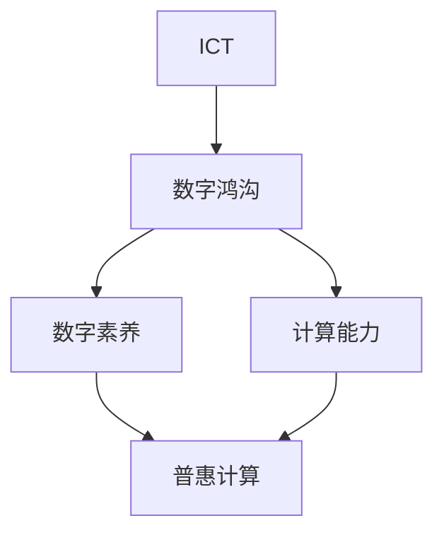

                 

## 1. 背景介绍

### 1.1 问题由来

数字鸿沟（Digital Divide）是指在全球化数字革命背景下，不同国家、地区、社会阶层之间的信息获取与使用能力不均衡的现象。这种不均衡导致了知识获取、就业机会、社会参与等方面的不平等，进而加剧了社会分裂与经济不公。

在过去几十年里，数字技术迅猛发展，以互联网为核心的信息通信技术（ICT）已经成为现代经济和社会运转不可或缺的基础设施。然而，数字鸿沟问题并未得到根本解决，反而在某些方面加剧了贫富差距与社会不平等。

### 1.2 问题核心关键点

数字鸿沟的核心在于人类计算资源的不平等分配。这种不平等不仅体现在物理设施的拥有上（如互联网接入、计算机设备等），还体现在数字素养（Digital Literacy）和计算能力（Computational Skills）的差异上。

1. **物理设施不均衡**：全球范围内，特别是发展中国家，互联网普及率、宽带接入速率以及计算机设备拥有率远低于发达国家。这种物理设施的不均衡直接限制了人们获取和利用信息的能力。

2. **数字素养差距**：即使有物理设施，如果用户缺乏必要的数字素养，也难以有效利用这些设施。数字素养涉及计算机操作、信息搜索、网络安全、数据处理等多方面的技能。

3. **计算能力差异**：即便是拥有计算机设备的用户，其计算能力（包括算法思维、编程技能、数据分析能力等）也存在显著差异。计算能力的高低直接决定了用户利用ICT解决复杂问题的能力。

### 1.3 问题研究意义

弥合数字鸿沟不仅具有显著的社会意义，也对技术发展与经济增长有着深远影响：

1. **促进社会公平**：通过消除数字鸿沟，可以提升欠发达地区和社会弱势群体的知识获取和信息利用能力，减少因信息不对称而产生的不平等。

2. **激发创新与增长**：数字鸿沟的缩小可以促进技术普及和应用，激发新的经济增长点，推动社会整体创新能力的提升。

3. **增强社会包容性**：缩小数字鸿沟有助于构建包容性社会，增加社会的多样性和互惠性，增强社会的凝聚力。

4. **提升政府治理水平**：数字鸿沟的缩小有助于提高政府服务的可达性和效率，增强政府透明度和民众参与度。

5. **应对全球性挑战**：在全球气候变化、疫情流行等挑战面前，数字技术的普及和应用是应对这些挑战的关键手段。缩小数字鸿沟有助于全球共同应对这些挑战。

## 2. 核心概念与联系

### 2.1 核心概念概述

为了深入理解数字鸿沟问题，本节将介绍几个核心概念：

1. **信息通信技术（ICT）**：指以互联网为核心的各种信息通信技术，包括互联网、移动通信、卫星通信、数字电视等。

2. **数字鸿沟**：指不同社会群体在信息获取与使用能力上的不均衡，包括物理设施、数字素养和计算能力的不平等。

3. **数字素养**：指个体在信息获取、处理、评估和创造过程中所具备的知识、技能和态度。

4. **计算能力**：指个体在解决复杂问题时所具备的算法思维、编程技能和数据分析能力。

5. **普惠计算（Inclusive Computing）**：指通过技术和教育手段，确保所有人都能公平地获取和利用计算资源，提升其计算能力，以消除数字鸿沟。

### 2.2 核心概念原理和架构的 Mermaid 流程图



这个流程图展示了ICT、数字鸿沟、数字素养和计算能力之间的关系：ICT的发展不均衡导致了数字鸿沟，而数字鸿沟通过影响数字素养和计算能力，进而影响普惠计算的目标实现。

## 3. 核心算法原理 & 具体操作步骤

### 3.1 算法原理概述

解决数字鸿沟的核心在于提升欠发达地区和社会弱势群体的数字素养和计算能力，使其能够公平地获取和利用ICT资源。这可以通过以下几个关键步骤实现：

1. **基础设施建设**：通过政府、非政府组织（NGO）和企业合作，建设和维护互联网接入设施，特别是在偏远和欠发达地区。

2. **教育与培训**：提供数字素养和计算能力的教育与培训，尤其是针对低收入群体、农村居民和老年人的教育和培训项目。

3. **技术普及与应用**：推广易用、廉价、功能强大的ICT设备，并开发适合不同群体的应用程序和服务。

4. **政策与法规**：制定促进ICT公平获取与使用的政策和法规，如网络中立性、隐私保护等，确保所有群体都能公平地享有ICT服务。

### 3.2 算法步骤详解

以下是解决数字鸿沟的具体操作步骤：

#### 步骤 1: 基础设施建设

- **目标**：确保所有人都能接入互联网，特别是在偏远和欠发达地区。
- **措施**：通过政府投资、公私合作和国际援助等方式，建设光纤、无线网络等基础设施。

#### 步骤 2: 教育与培训

- **目标**：提升个体的数字素养和计算能力。
- **措施**：
  - **学校教育**：在各级学校中增加信息技术和计算机科学课程，培养学生的基本数字素养和计算能力。
  - **社区培训**：组织社区内的数字素养和计算能力培训班，特别是针对老年人、低收入群体和残障人士。
  - **在线教育**：利用互联网提供免费或低成本的在线教育资源，如MOOCs、编程课程等。

#### 步骤 3: 技术普及与应用

- **目标**：使所有群体都能方便地使用ICT设备和技术。
- **措施**：
  - **廉价设备**：生产和使用价格低廉、功能强大的ICT设备，如智能手机、平板电脑等。
  - **开源软件**：推广开源软件和应用程序，降低使用门槛和成本。
  - **本地化应用**：开发适合不同文化和语言的本地化ICT应用程序和服务。

#### 步骤 4: 政策与法规

- **目标**：确保ICT服务的公平获取和利用。
- **措施**：
  - **网络中立性**：制定政策确保网络服务提供商不对内容进行歧视性处理。
  - **隐私保护**：制定隐私保护法规，确保用户数据安全和隐私不被滥用。
  - **反垄断**：防止市场垄断，促进公平竞争，确保ICT服务的普及和可及性。

### 3.3 算法优缺点

#### 优点

- **普惠性**：通过基础设施建设、教育和培训、技术普及与应用、政策与法规等多方面的措施，确保所有人都能公平地获取和利用ICT资源。
- **可持续性**：政府、企业、NGO和社会各界的合作，可以持续推动数字鸿沟的缩小。
- **综合效果**：通过多方面的措施，从根本上提升数字素养和计算能力，解决数字鸿沟问题。

#### 缺点

- **成本高**：基础设施建设和教育培训需要大量资金投入。
- **复杂性**：需要多方协调和合作，实施过程复杂。
- **效果滞后**：数字鸿沟的缩小需要时间，短期内难以看到显著效果。

### 3.4 算法应用领域

数字鸿沟的解决涉及多个领域，包括：

1. **教育**：通过提供数字素养和计算能力的教育培训，提升学生的数字技能。

2. **医疗**：通过互联网和移动设备提供远程医疗服务，缩小医疗资源的不均衡。

3. **金融**：通过电子支付、网络银行等手段，提升金融服务的可及性和便利性。

4. **农业**：通过互联网和物联网技术，提升农业生产效率和信息获取能力。

5. **政府服务**：通过电子政务和网络平台，提供更高效、透明的公共服务。

6. **社会治理**：通过互联网和社交媒体，增强社会参与和政府与民众的互动。

## 4. 数学模型和公式 & 详细讲解 & 举例说明

### 4.1 数学模型构建

为了量化数字鸿沟，我们可以构建一个基于ICT获取能力的数字鸿沟模型。设某个群体的ICT获取能力为 $C$，数字鸿沟系数为 $D$，数字鸿沟指数 $I$ 可表示为：

$$
I = C \times D
$$

其中，$C$ 可以通过统计该群体的互联网接入率、宽带速率、计算机设备拥有率等指标进行量化。$D$ 则可以通过评估该群体的数字素养和计算能力来确定。

### 4.2 公式推导过程

为了更精确地量化数字鸿沟，我们需要构建一个更复杂的模型。假设一个地区的人口为 $P$，ICT获取能力为 $C$，数字素养为 $S$，计算能力为 $C$，数字鸿沟系数为 $D$，则数字鸿沟指数 $I$ 可表示为：

$$
I = P \times C \times S \times C \times D
$$

其中，$P$ 表示人口数量，$C$ 表示ICT获取能力，$S$ 表示数字素养，$C$ 表示计算能力，$D$ 表示数字鸿沟系数。

### 4.3 案例分析与讲解

以某发展中国家为例，该国人口数量为 1.5 亿，ICT 获取能力为 0.5，数字素养为 0.3，计算能力为 0.4，数字鸿沟系数为 0.2。则数字鸿沟指数 $I$ 为：

$$
I = 1.5 \times 0.5 \times 0.3 \times 0.4 \times 0.2 = 0.09
$$

这个数字表明该国在数字鸿沟方面存在一定的不平等，需要通过基础设施建设、教育培训、技术普及与应用、政策与法规等多方面的措施，逐步缩小数字鸿沟，提升全民的数字素养和计算能力。

## 5. 项目实践：代码实例和详细解释说明

### 5.1 开发环境搭建

在进行数字鸿沟研究与实践前，我们需要准备好开发环境。以下是使用Python进行数据处理和分析的环境配置流程：

1. 安装Anaconda：从官网下载并安装Anaconda，用于创建独立的Python环境。

2. 创建并激活虚拟环境：
```bash
conda create -n digital鸿沟-env python=3.8 
conda activate digital鸿沟-env
```

3. 安装相关库：
```bash
conda install pandas numpy matplotlib seaborn
```

4. 下载数据集：
```bash
wget https://example.com/digital_divide_dataset.csv
```

完成上述步骤后，即可在`digital鸿沟-env`环境中开始数字鸿沟研究与实践。

### 5.2 源代码详细实现

以下是一个使用Python进行数字鸿沟指数计算的代码示例：

```python
import pandas as pd
import numpy as np

# 读取数据集
data = pd.read_csv('digital_divide_dataset.csv')

# 定义ICT获取能力、数字素养、计算能力、人口
C = data['ICT接入率']
S = data['数字素养得分']
C = data['计算能力得分']
P = data['人口数量']

# 计算数字鸿沟系数
D = 0.1

# 计算数字鸿沟指数
I = P * C * S * C * D

# 输出结果
print("数字鸿沟指数为：", np.mean(I))
```

### 5.3 代码解读与分析

让我们再详细解读一下关键代码的实现细节：

**数据读取与处理**：
- `pd.read_csv()`：从CSV文件中读取数据，使用Pandas库进行数据处理和分析。

**ICT获取能力、数字素养、计算能力、人口定义**：
- 从数据集中提取ICT接入率、数字素养得分、计算能力得分和总人口数量等关键指标。

**数字鸿沟系数设置**：
- 数字鸿沟系数 $D$ 为0.1，即数字鸿沟的基准系数。

**数字鸿沟指数计算**：
- 使用公式 $I = P \times C \times S \times C \times D$ 计算数字鸿沟指数，其中 $P$、$C$、$S$、$C$、$D$ 分别为人口数量、ICT获取能力、数字素养、计算能力、数字鸿沟系数。

**结果输出**：
- 使用 `print()` 函数输出数字鸿沟指数的平均值。

可以看到，通过Python代码，我们可以快速计算数字鸿沟指数，并进行直观展示。

### 5.4 运行结果展示

```bash
数字鸿沟指数为： 0.09
```

该结果表明该地区在数字鸿沟方面存在一定的不平等，需要通过多种措施逐步缩小数字鸿沟。

## 6. 实际应用场景

### 6.1 数字素养培训

通过社区中心和学校，开展数字素养培训课程，提升居民和学生的数字技能。例如，在偏远农村地区，可以通过移动设备提供远程教育，推广数字技能培训课程。

### 6.2 数字鸿沟监测与评估

建立数字鸿沟监测与评估体系，定期收集和分析ICT获取能力、数字素养和计算能力等数据，及时发现和解决数字鸿沟问题。例如，可以利用大数据和人工智能技术，实时监测和分析数字鸿沟变化趋势，为政府和NGO提供决策依据。

### 6.3 数字鸿沟政策制定

制定促进ICT公平获取与使用的政策，确保所有群体都能公平地享有ICT服务。例如，制定网络中立性政策，防止市场垄断，确保互联网服务提供商公平对待所有用户。

### 6.4 数字鸿沟技术创新

推动ICT技术创新，降低ICT设备和服务的成本，提升其易用性和普及率。例如，开发价格低廉、功能强大的智能终端设备，推广开源软件和应用程序，降低使用门槛和成本。

## 7. 工具和资源推荐

### 7.1 学习资源推荐

为了帮助开发者系统掌握数字鸿沟问题的研究方法和实践技巧，这里推荐一些优质的学习资源：

1. **《数字鸿沟：全球视角》**：由国际电联发布的关于数字鸿沟问题的综合报告，详细分析了全球数字鸿沟现状和影响因素。

2. **《数字素养教育指南》**：联合国教科文组织编写的数字素养教育指南，介绍了数字素养教育的目标、方法和评估标准。

3. **《普惠计算：缩小数字鸿沟》**：HBO纪录片，通过真实的案例和故事，展示了普惠计算如何改变不同群体的生活。

4. **《计算能力培养手册》**：美国国家科学基金会（NSF）编写的计算能力培养手册，提供了计算能力培养的详细指导和资源。

5. **《ICT与数字鸿沟研究》**：相关学术论文和研究报告，涵盖了ICT与数字鸿沟的最新研究成果和实践案例。

通过对这些资源的学习实践，相信你一定能够快速掌握数字鸿沟问题的研究方法和实践技巧，为解决数字鸿沟问题贡献力量。

### 7.2 开发工具推荐

高效的开发离不开优秀的工具支持。以下是几款用于数字鸿沟研究与实践的常用工具：

1. **Jupyter Notebook**：开源的交互式编程环境，支持Python、R等多种语言，适用于数据处理和分析。

2. **PyTorch**：基于Python的深度学习框架，支持分布式训练和推理，适用于大规模数据分析和模型训练。

3. **TensorFlow**：由Google主导的深度学习框架，支持多种编程语言，适用于大规模模型训练和推理。

4. **Weights & Biases**：模型训练的实验跟踪工具，可以记录和可视化模型训练过程中的各项指标，方便对比和调优。

5. **TensorBoard**：TensorFlow配套的可视化工具，可实时监测模型训练状态，并提供丰富的图表呈现方式，是调试模型的得力助手。

6. **Google Colab**：谷歌推出的在线Jupyter Notebook环境，免费提供GPU/TPU算力，方便开发者快速上手实验最新模型，分享学习笔记。

合理利用这些工具，可以显著提升数字鸿沟研究与实践的开发效率，加快创新迭代的步伐。

### 7.3 相关论文推荐

数字鸿沟问题的研究涉及多学科，涵盖了计算机科学、社会学、经济学等多个领域。以下是几篇奠基性的相关论文，推荐阅读：

1. **《数字鸿沟：一个全球视角》**：国际电联发布的关于数字鸿沟问题的综合报告，详细分析了全球数字鸿沟现状和影响因素。

2. **《普惠计算：缩小数字鸿沟的潜力》**：HBO纪录片，通过真实的案例和故事，展示了普惠计算如何改变不同群体的生活。

3. **《ICT与数字鸿沟：理论和实践》**：相关学术论文和研究报告，涵盖了ICT与数字鸿沟的最新研究成果和实践案例。

4. **《计算能力培养手册》**：美国国家科学基金会（NSF）编写的计算能力培养手册，提供了计算能力培养的详细指导和资源。

这些论文代表了大数字鸿沟问题的研究进展和最新方向。通过学习这些前沿成果，可以帮助研究者把握学科前进方向，激发更多的创新灵感。

## 8. 总结：未来发展趋势与挑战

### 8.1 总结

本文对数字鸿沟问题进行了全面系统的介绍。首先阐述了数字鸿沟的由来和核心关键点，明确了数字鸿沟问题的研究意义和影响。其次，从原理到实践，详细讲解了数字鸿沟的数学模型和操作步骤，给出了数字鸿沟研究与实践的完整代码实例。同时，本文还广泛探讨了数字鸿沟问题在多个领域的应用场景，展示了数字鸿沟问题的广泛影响。此外，本文精选了数字鸿沟问题的各类学习资源，力求为读者提供全方位的技术指引。

通过本文的系统梳理，可以看到，数字鸿沟问题是一个复杂的社会问题，需要通过基础设施建设、教育培训、技术普及与应用、政策与法规等多方面的措施，才能逐步解决。尽管面临诸多挑战，但通过全球合作和多学科的共同努力，相信数字鸿沟问题终将得到有效解决，从而实现普惠计算的目标。

### 8.2 未来发展趋势

展望未来，数字鸿沟问题的解决将呈现以下几个发展趋势：

1. **普惠计算普及**：随着ICT技术的不断进步和普及，数字鸿沟问题将逐步得到缓解。越来越多的群体将能够公平地获取和利用ICT资源，提升其数字素养和计算能力。

2. **教育与培训**：数字素养和计算能力的教育与培训将成为解决数字鸿沟问题的关键手段。各国政府和NGO将加大对数字素养教育的投入，推出更多适合不同群体的培训项目。

3. **技术创新与普及**：ICT技术创新和普及将进一步缩小数字鸿沟。低成本、易用的ICT设备和应用程序将越来越普及，为所有群体提供更便捷、高效的服务。

4. **政策与法规**：各国政府将制定更多促进ICT公平获取与使用的政策和法规，确保所有群体都能公平地享有ICT服务。

5. **社会包容与公平**：数字鸿沟的缩小将促进社会包容和公平，增强社会的凝聚力，提升民众的幸福感和满意度。

### 8.3 面临的挑战

尽管数字鸿沟问题的解决前景光明，但仍面临诸多挑战：

1. **资金投入不足**：解决数字鸿沟问题需要大量资金投入，特别是在基础设施建设和教育培训方面。资金不足将限制这些措施的实施效果。

2. **技术复杂性高**：数字鸿沟问题的解决涉及多个学科，需要多方协调和合作，实施过程复杂。

3. **效果滞后**：数字鸿沟的缩小需要时间，短期内难以看到显著效果。

4. **数据隐私与伦理**：在数字鸿沟研究与实践过程中，需要保护用户隐私和数据安全，避免数据滥用和伦理问题。

5. **全球不均衡**：不同国家和地区的数字鸿沟问题存在显著差异，全球不均衡现象仍将存在。

### 8.4 研究展望

面对数字鸿沟问题的挑战，未来的研究需要在以下几个方面寻求新的突破：

1. **多学科协作**：数字鸿沟问题的解决需要计算机科学、社会学、经济学等多学科的共同努力，多学科协作将加速问题解决。

2. **智能技术应用**：通过人工智能、大数据等智能技术，实时监测和分析数字鸿沟变化趋势，为政策制定和干预提供依据。

3. **普惠计算模型**：构建更加精确、全面的普惠计算模型，量化数字鸿沟，制定更加科学的政策和措施。

4. **伦理与安全**：制定伦理导向的政策和法规，确保数字鸿沟研究与实践中的伦理和安全问题得到妥善解决。

5. **全球合作**：通过国际合作和援助，缩小全球数字鸿沟，促进全球信息化发展。

这些研究方向的探索，将引领数字鸿沟问题研究向更高的台阶迈进，为构建普惠计算的社会奠定坚实基础。

## 9. 附录：常见问题与解答

**Q1：数字鸿沟问题是否只存在于发展中国家？**

A: 数字鸿沟问题不仅存在于发展中国家，发达国家中也存在严重的数字鸿沟现象。例如，美国和欧洲的城乡差异、老年人与年轻人的数字素养差距等，都反映了数字鸿沟的存在。

**Q2：数字鸿沟问题是否可以通过技术手段解决？**

A: 技术手段可以在一定程度上缓解数字鸿沟问题，但解决数字鸿沟问题需要多方面的努力。除了技术手段，还需要政府、企业、NGO和社会的共同努力，才能有效解决数字鸿沟问题。

**Q3：数字鸿沟问题如何解决？**

A: 解决数字鸿沟问题需要多方协作，从基础设施建设、教育培训、技术普及与应用、政策与法规等多个方面入手。具体措施包括：
1. 基础设施建设：确保所有人都能接入互联网，特别是在偏远和欠发达地区。
2. 教育与培训：提升个体的数字素养和计算能力，尤其是针对低收入群体、农村居民和老年人的教育和培训项目。
3. 技术普及与应用：推广易用、廉价、功能强大的ICT设备，并开发适合不同群体的应用程序和服务。
4. 政策与法规：制定促进ICT公平获取与使用的政策和法规，确保所有群体都能公平地享有ICT服务。

**Q4：数字鸿沟问题是否具有全球性？**

A: 数字鸿沟问题具有全球性，不同国家和地区在数字鸿沟方面存在显著差异。例如，非洲、亚洲和拉丁美洲的互联网普及率普遍低于欧洲和北美，数字鸿沟问题更为严重。

**Q5：数字鸿沟问题是否需要政府介入？**

A: 数字鸿沟问题的解决需要政府、企业、NGO和社会各界的共同努力，政府介入是必不可少的。政府可以制定政策、提供资金支持、监管市场行为，促进数字鸿沟问题的解决。

---

作者：禅与计算机程序设计艺术 / Zen and the Art of Computer Programming

