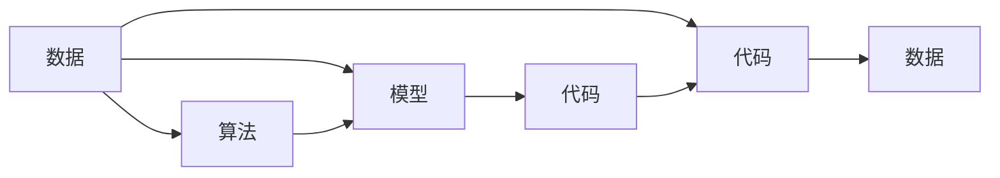

                 

# 数据即模型,软件2.0颠覆传统软件方法论

## 1. 背景介绍

在计算机科学和软件工程的历史长河中，传统的软件方法论经历了许多演化与变迁，从早期的瀑布模型、增量模型到敏捷方法、微服务架构、DevOps等。这些方法论为软件开发提供了重要的理论指导和实践指南，然而随着技术的不断进步和应用场景的日益复杂，传统方法论已难以适应快速变化的软件开发环境。

当前，数据驱动的软件开发方法论正在逐渐崭露头角，数据即模型（Data is the Model）的理念正在重塑软件开发的整个生命周期。软件2.0（Software 2.0）的概念由著名计算机科学家、图灵奖获得者Andrej Karpathy提出，旨在强调数据在软件开发中的核心地位，从以代码为中心转向以数据为中心，通过大规模数据集和深度学习技术，构建智能软件系统。本文将深入探讨数据即模型和软件2.0的概念及其在软件开发中的应用，并尝试揭示其对传统软件方法论的颠覆性影响。

## 2. 核心概念与联系

### 2.1 核心概念概述

- **数据即模型（Data is the Model）**：指在软件开发中，数据不仅是一种输入和输出的媒介，更是整个系统的模型。通过训练数据，模型可以自动发现输入数据中的规律和关系，自动生成代码和实现逻辑，从而使软件具有更强的自适应性和智能化水平。

- **软件2.0（Software 2.0）**：一种强调数据在软件开发中核心地位的新范式，倡导通过大规模数据集和深度学习技术构建智能软件系统，使软件具备自我演化和适应的能力。其核心思想是将数据与代码的界限模糊化，以数据驱动代码生成和系统优化。

- **算法即数据（Algorithms are Data）**：进一步拓展了数据即模型的理念，指出算法本身也是一种数据，通过反向传播等技术，算法可以不断优化并生成更高效的模型和代码。

- **代码即数据（Code is Data）**：将代码视为一种数据类型，认为代码可以通过训练和优化，自动生成更优的代码实现。

这些概念之间的逻辑关系可以通过以下Mermaid流程图来展示：



### 2.2 核心概念原理和架构的 Mermaid 流程图

为了更直观地展示这些概念的联系，我们可以绘制一个简单的架构图。其中，数据是输入，模型是处理，算法是训练过程，代码是输出：


在实际的软件开发中，数据、模型、算法和代码之间是动态交互的，数据驱动模型，模型驱动算法，算法驱动代码，最终生成新的数据反馈给模型，形成一个闭环的反馈系统。

## 3. 核心算法原理 & 具体操作步骤

### 3.1 算法原理概述

数据即模型和软件2.0方法论的核心算法原理主要是基于深度学习和机器学习技术。其核心思想是将大规模数据集作为模型训练的素材，通过训练获得模型参数，从而自动生成代码和实现逻辑。

具体而言，对于一个给定的软件需求，可以将其抽象为一系列数据集，这些数据集包含了输入和输出，以及一些隐含的约束和规则。通过深度学习模型对这些数据集进行训练，模型可以自动学习输入和输出之间的映射关系，从而生成相应的代码和实现逻辑。

### 3.2 算法步骤详解

基于深度学习的数据即模型和软件2.0方法论主要包括以下几个关键步骤：

**Step 1: 数据准备和预处理**
- 收集和清洗软件需求数据集，如功能规格、技术需求、设计文档等。
- 将数据集转换为模型可处理的格式，如将自然语言描述转换为结构化数据。

**Step 2: 模型训练和优化**
- 选择适当的深度学习模型，如神经网络、深度强化学习等，进行模型训练。
- 对模型进行超参数调优和正则化处理，以防止过拟合和提升模型泛化能力。

**Step 3: 模型评估和测试**
- 在测试数据集上对模型进行评估，计算准确率、召回率、F1值等指标。
- 根据评估结果对模型进行微调，以进一步提升模型性能。

**Step 4: 代码生成和优化**
- 将模型生成的代码转换为可执行的源代码。
- 对生成的代码进行自动化测试和优化，如静态代码分析、动态代码优化等。

**Step 5: 部署和监控**
- 将优化后的代码部署到实际环境中，进行性能监控和问题反馈。
- 根据监控数据和用户反馈，对模型和代码进行持续迭代和优化。

### 3.3 算法优缺点

**优点**：
1. **自动化程度高**：通过模型自动生成代码，大大减少了手动编写代码的工作量，提升了开发效率。
2. **自适应性强**：模型可以根据新的数据集进行持续学习和优化，适应软件需求的变化。
3. **智能程度高**：通过深度学习技术，模型可以发现输入数据中的隐含规律，生成更高效的代码实现。

**缺点**：
1. **依赖数据质量**：模型的训练效果高度依赖于输入数据的质量，数据偏差和噪声可能导致模型性能下降。
2. **计算资源要求高**：大规模数据集的训练需要高性能计算资源，对硬件要求较高。
3. **模型可解释性差**：深度学习模型的黑盒性质使得其决策过程难以理解和解释。
4. **安全风险高**：自动生成的代码可能存在漏洞和安全隐患，需要严格的测试和审查。

### 3.4 算法应用领域

数据即模型和软件2.0方法论在多个领域都有广泛的应用，例如：

- **自动化代码生成**：用于软件自动化测试、API自动生成、代码重构等。
- **智能辅助开发**：如代码补全、代码重构建议、代码调试等。
- **数据驱动的设计**：通过用户行为数据和反馈，自动优化软件界面和用户体验。
- **自适应系统**：如推荐系统、智能聊天机器人等，通过学习用户数据，实现个性化服务。
- **实时系统**：如自动驾驶、智能监控等，通过实时数据分析，优化系统性能。

## 4. 数学模型和公式 & 详细讲解 & 举例说明

### 4.1 数学模型构建

在数据即模型的框架下，我们可以将软件需求视为一种数据集，模型训练的目标是找到一个函数 $f$，使得 $f(x) = y$，其中 $x$ 是输入数据，$y$ 是输出数据。对于给定的软件需求，可以将其抽象为如下形式：

$$
(x_1, y_1), (x_2, y_2), ..., (x_n, y_n)
$$

其中 $x_i$ 是第 $i$ 个需求描述，$y_i$ 是对应的代码实现。通过训练一个神经网络模型 $M$，使其满足上述映射关系，可以得到模型参数 $\theta$，从而自动生成代码实现。

### 4.2 公式推导过程

以一个简单的需求描述和代码实现为例，我们可以将其形式化如下：

需求描述：
```python
def calculate_price(product, quantity):
    price = product.price * quantity
    return price
```

代码实现：
```python
class Product:
    def __init__(self, price):
        self.price = price

class ShoppingCart:
    def __init__(self):
        self.items = []

    def add_item(self, item):
        self.items.append(item)

    def calculate_total(self):
        total_price = 0
        for item in self.items:
            total_price += item.price
        return total_price
```

将需求描述和代码实现转换为数据集，可以得到如下形式：

```
(x_1, y_1), (x_2, y_2), ..., (x_n, y_n)
```

其中 $x_i$ 是对应需求描述的输入数据，$y_i$ 是对应代码实现的输出数据。通过训练一个神经网络模型 $M$，使其满足上述映射关系，可以得到模型参数 $\theta$，从而自动生成代码实现。

### 4.3 案例分析与讲解

以OpenAI的CodeX为例，CodeX是一个基于深度学习的代码生成工具，可以自动生成代码片段和程序设计方案。其基本流程如下：

1. 数据准备：收集大量的编程问题、代码片段和解决方案，形成大规模的数据集。
2. 模型训练：使用神经网络模型对数据集进行训练，学习输入和输出之间的映射关系。
3. 代码生成：输入编程问题，通过训练好的模型生成对应的代码片段或解决方案。
4. 代码优化：对生成的代码进行自动化测试和优化，确保其正确性和性能。

## 5. 项目实践：代码实例和详细解释说明

### 5.1 开发环境搭建

在进行数据即模型和软件2.0的实践前，我们需要准备好开发环境。以下是使用Python和TensorFlow进行开发的常见环境配置流程：

1. 安装Anaconda：从官网下载并安装Anaconda，用于创建独立的Python环境。

2. 创建并激活虚拟环境：
```bash
conda create -n tensorflow-env python=3.8 
conda activate tensorflow-env
```

3. 安装TensorFlow：根据CUDA版本，从官网获取对应的安装命令。例如：
```bash
conda install tensorflow tensorflow-gpu -c conda-forge
```

4. 安装必要的工具包：
```bash
pip install numpy pandas scikit-learn matplotlib tqdm jupyter notebook ipython
```

完成上述步骤后，即可在`tensorflow-env`环境中开始实践。

### 5.2 源代码详细实现

下面我们以代码自动生成为例，给出使用TensorFlow进行数据即模型和软件2.0实践的代码实现。

首先，定义数据集：

```python
import tensorflow as tf

# 定义数据集
x_train = ["def calculate_price(product, quantity):", "return product.price * quantity"]
y_train = ["def calculate_price(product, quantity):\n    price = product.price * quantity\n    return price", "def calculate_price(product, quantity):\n    total_price = 0\n    for item in product.items:\n        total_price += item.price\n    return total_price"]

# 将数据转换为张量
x_train = tf.convert_to_tensor(x_train)
y_train = tf.convert_to_tensor(y_train)
```

然后，定义模型：

```python
# 定义神经网络模型
model = tf.keras.Sequential([
    tf.keras.layers.Dense(64, activation='relu', input_shape=(len(x_train[0]),)),
    tf.keras.layers.Dense(64, activation='relu'),
    tf.keras.layers.Dense(len(y_train[0]), activation='softmax')
])

# 编译模型
model.compile(optimizer='adam', loss='categorical_crossentropy', metrics=['accuracy'])
```

接着，训练模型：

```python
# 训练模型
model.fit(x_train, y_train, epochs=10, validation_split=0.2)
```

最后，使用模型进行代码生成：

```python
# 生成代码
def generate_code(model, input):
    x = tf.convert_to_tensor([input])
    y_pred = model.predict(x)
    code = y_pred.argmax()
    return code
```

使用生成的代码进行测试：

```python
# 测试代码生成
code = generate_code(model, "def calculate_price(product, quantity):")
print(code)
```

以上就是使用TensorFlow进行数据即模型和软件2.0实践的完整代码实现。可以看到，通过神经网络模型，可以自动生成代码片段，大大提升了开发效率。

### 5.3 代码解读与分析

让我们再详细解读一下关键代码的实现细节：

**数据集定义**：
- 通过定义训练数据集 $x$ 和 $y$，将需求描述和代码实现转换为模型可处理的张量形式。

**神经网络模型定义**：
- 定义了一个简单的神经网络模型，包括两个全连接层和一个softmax输出层，用于生成代码实现的概率分布。

**模型编译**：
- 使用Adam优化器和交叉熵损失函数，编译模型，并设置评估指标。

**模型训练**：
- 使用训练数据集 $x$ 和 $y$ 训练模型，通过指定epoch和验证集比例，控制训练过程。

**代码生成**：
- 使用训练好的模型，对新的需求描述进行前向传播，得到代码实现的概率分布，选择概率最高的输出作为生成的代码。

**代码测试**：
- 使用生成的代码片段进行测试，验证其正确性。

可以看到，通过TensorFlow等深度学习框架，我们可以将数据即模型和软件2.0的实践变得非常简单和高效。开发者可以将更多精力放在模型设计和数据处理等高层逻辑上，而不必过多关注底层的实现细节。

## 6. 实际应用场景

### 6.1 自动化代码生成

基于数据即模型和软件2.0的自动化代码生成技术，可以广泛应用于软件开发中的各个环节，如代码生成、API自动生成、测试用例生成等。例如，可以使用模型自动生成API文档、测试用例、代码片段，减少手动编写的工作量，提升开发效率。

### 6.2 智能辅助开发

数据即模型和软件2.0技术还可以用于智能辅助开发，如代码补全、代码重构建议、代码调试等。例如，可以在IDE中集成代码生成模块，实时生成代码补全建议，帮助开发者快速编写代码。

### 6.3 数据驱动的设计

通过收集和分析用户行为数据，数据即模型和软件2.0技术可以用于优化软件界面和用户体验。例如，可以收集用户点击、滚动等行为数据，自动优化界面布局和交互逻辑，提升用户满意度。

### 6.4 自适应系统

数据即模型和软件2.0技术可以用于构建自适应系统，如推荐系统、智能聊天机器人等。例如，可以通过学习用户行为数据，自动优化推荐算法，提供个性化的内容推荐。

### 6.5 实时系统

数据即模型和软件2.0技术可以用于实时系统，如自动驾驶、智能监控等。例如，可以通过实时数据分析，优化系统性能，提高系统的响应速度和稳定性。

## 7. 工具和资源推荐

### 7.1 学习资源推荐

为了帮助开发者系统掌握数据即模型和软件2.0的理论基础和实践技巧，这里推荐一些优质的学习资源：

1. 《深度学习入门》系列博文：由著名计算机科学家李宏毅教授撰写，深入浅出地介绍了深度学习的基本概念和应用。

2. CS231n《深度学习计算机视觉》课程：斯坦福大学开设的深度学习课程，涵盖了深度学习在计算机视觉领域的应用，非常适合计算机视觉领域的研究者。

3. 《TensorFlow 实战》书籍：TensorFlow的官方文档，提供了丰富的代码样例和教程，是TensorFlow开发的必备资料。

4. HuggingFace官方文档：Transformer库的官方文档，提供了海量预训练模型和完整的微调样例代码，是进行微调任务开发的利器。

5. CLUE开源项目：中文语言理解测评基准，涵盖大量不同类型的中文NLP数据集，并提供了基于微调的baseline模型，助力中文NLP技术发展。

通过对这些资源的学习实践，相信你一定能够快速掌握数据即模型和软件2.0的精髓，并用于解决实际的NLP问题。

### 7.2 开发工具推荐

高效的开发离不开优秀的工具支持。以下是几款用于数据即模型和软件2.0开发的常用工具：

1. TensorFlow：由Google主导开发的开源深度学习框架，生产部署方便，适合大规模工程应用。同样有丰富的预训练语言模型资源。

2. PyTorch：基于Python的开源深度学习框架，灵活动态的计算图，适合快速迭代研究。大部分预训练语言模型都有PyTorch版本的实现。

3. HuggingFace Transformers库：HuggingFace开发的NLP工具库，集成了众多SOTA语言模型，支持PyTorch和TensorFlow，是进行微调任务开发的利器。

4. Weights & Biases：模型训练的实验跟踪工具，可以记录和可视化模型训练过程中的各项指标，方便对比和调优。与主流深度学习框架无缝集成。

5. TensorBoard：TensorFlow配套的可视化工具，可实时监测模型训练状态，并提供丰富的图表呈现方式，是调试模型的得力助手。

6. Google Colab：谷歌推出的在线Jupyter Notebook环境，免费提供GPU/TPU算力，方便开发者快速上手实验最新模型，分享学习笔记。

合理利用这些工具，可以显著提升数据即模型和软件2.0的开发效率，加快创新迭代的步伐。

### 7.3 相关论文推荐

数据即模型和软件2.0的发展源于学界的持续研究。以下是几篇奠基性的相关论文，推荐阅读：

1. Deep Learning（深度学习）：Yoshua Bengio、Ian Goodfellow、Aaron Courville合著，全面介绍了深度学习的基本原理和应用，是深度学习的入门必读书籍。

2. GPT-2: Language Models are Unsupervised Multitask Learners（GPT-2论文）：提出GPT-2模型，展示了大规模语言模型的强大zero-shot学习能力，引发了对于通用人工智能的新一轮思考。

3. AutoML: Automated Machine Learning（AutoML论文）：提出了AutoML的概念，即自动化机器学习，通过自动化工具和算法，自动设计、优化和部署机器学习模型。

4. Data2Text: A Machine Learning Framework for Data-to-Text Generation（Data2Text论文）：提出Data2Text框架，用于自动生成文本数据，支持从数据到文本的自动化转换。

5. TensorFlow Datasets：TensorFlow的数据集框架，提供丰富的数据集和预处理工具，支持数据的自动化预处理和清洗。

这些论文代表了大语言模型微调技术的发展脉络。通过学习这些前沿成果，可以帮助研究者把握学科前进方向，激发更多的创新灵感。

## 8. 总结：未来发展趋势与挑战

### 8.1 总结

本文对数据即模型和软件2.0的概念进行了全面系统的介绍。首先阐述了数据即模型和软件2.0的研究背景和意义，明确了其在软件开发中的应用价值。其次，从原理到实践，详细讲解了数据即模型和软件2.0的数学原理和关键步骤，给出了数据即模型和软件2.0任务开发的完整代码实例。同时，本文还广泛探讨了数据即模型和软件2.0在多个领域的应用前景，展示了其广泛的应用场景。最后，本文精选了数据即模型和软件2.0的各类学习资源，力求为读者提供全方位的技术指引。

通过本文的系统梳理，可以看到，数据即模型和软件2.0正在逐渐成为软件开发的重要范式，其核心思想是将数据和代码进行无缝整合，通过深度学习技术实现智能软件开发。未来，伴随深度学习技术的不断进步和数据获取能力的提升，数据即模型和软件2.0必将在更广阔的应用领域大放异彩。

### 8.2 未来发展趋势

展望未来，数据即模型和软件2.0方法论将呈现以下几个发展趋势：

1. **模型规模持续增大**：随着算力成本的下降和数据规模的扩张，预训练语言模型的参数量还将持续增长。超大规模语言模型蕴含的丰富语言知识，有望支撑更加复杂多变的软件开发任务。

2. **数据驱动的编程范式**：未来的软件开发将更多地依赖于数据驱动的编程范式，开发者可以基于实时数据动态生成和优化代码，使软件具备更强的自适应性和智能化水平。

3. **多模态融合**：数据即模型和软件2.0技术将不仅仅局限于文本数据，还将拓展到图像、视频、语音等多模态数据，实现不同模态数据的协同建模和融合。

4. **自动化工具和平台**：数据即模型和软件2.0技术将推动自动化工具和平台的普及，如自动化代码生成、自动化测试、自动化部署等，大大提升软件开发效率。

5. **智能编程助手**：数据即模型和软件2.0技术将催生智能编程助手，帮助开发者快速编写代码、调试程序、优化性能，提升开发体验。

6. **实时智能系统**：数据即模型和软件2.0技术将推动实时智能系统的构建，如自动驾驶、智能监控等，通过实时数据分析，优化系统性能。

以上趋势凸显了数据即模型和软件2.0方法论的广阔前景。这些方向的探索发展，必将进一步提升软件开发效率，推动软件开发范式的革命性变革。

### 8.3 面临的挑战

尽管数据即模型和软件2.0技术已经取得了瞩目成就，但在迈向更加智能化、普适化应用的过程中，仍面临诸多挑战：

1. **数据获取和标注成本高**：数据即模型和软件2.0技术高度依赖于大规模数据集，而获取和标注高质量的数据成本较高。如何降低数据获取和标注成本，将是未来的一大挑战。

2. **模型可解释性差**：深度学习模型的黑盒性质使得其决策过程难以理解和解释。对于医疗、金融等高风险应用，算法的可解释性和可审计性尤为重要。如何赋予模型更强的可解释性，将是亟待攻克的难题。

3. **安全风险高**：数据即模型和软件2.0技术生成的代码可能存在漏洞和安全隐患，需要严格的测试和审查。如何确保代码的安全性和可靠性，将是重要的研究方向。

4. **计算资源要求高**：大规模数据集的训练需要高性能计算资源，对硬件要求较高。如何降低计算资源要求，提高算法的效率和鲁棒性，将是重要的优化方向。

5. **用户接受度低**：数据即模型和软件2.0技术的应用可能改变用户的使用习惯和预期，用户接受度低将影响其广泛应用。如何提升用户接受度，增强用户体验，将是重要的研究课题。

6. **跨领域适用性差**：数据即模型和软件2.0技术在不同领域的应用效果差异较大，如何设计通用的跨领域适用性模型，将是一大挑战。

正视数据即模型和软件2.0面临的这些挑战，积极应对并寻求突破，将使该技术更加成熟，实现更大规模的落地应用。相信随着学界和产业界的共同努力，这些挑战终将一一被克服，数据即模型和软件2.0必将在软件开发中发挥更大的作用。

### 8.4 研究展望

面对数据即模型和软件2.0所面临的诸多挑战，未来的研究需要在以下几个方面寻求新的突破：

1. **无监督和半监督学习**：探索无监督和半监督学习范式，摆脱对大规模标注数据的依赖，利用自监督学习、主动学习等无监督和半监督方法，最大限度利用非结构化数据，实现更加灵活高效的开发。

2. **参数高效模型**：开发更加参数高效的模型，如Transformer、LoRA等，在固定大部分预训练参数的情况下，只更新极少量的任务相关参数，以提高模型性能和效率。

3. **数据增强**：引入数据增强技术，如文本回译、噪声注入等，提升模型的泛化能力和鲁棒性，避免过拟合。

4. **模型压缩和优化**：通过模型压缩、稀疏化存储等技术，降低模型的计算资源要求，提高模型的部署效率。

5. **模型解释性和可解释性**：开发可解释性强的模型，增强模型的透明度和可信度，提升用户接受度和应用效果。

6. **跨领域适用性**：设计通用的跨领域适用性模型，增强模型在不同领域的泛化能力和适用性，推动技术在不同领域的应用。

这些研究方向将进一步推动数据即模型和软件2.0技术的成熟和完善，推动其在更多领域的广泛应用。未来，随着技术的不断发展，数据即模型和软件2.0必将在软件开发中发挥更加重要的作用，推动软件开发范式的革命性变革。

## 9. 附录：常见问题与解答

**Q1：数据即模型和软件2.0是否适用于所有软件开发任务？**

A: 数据即模型和软件2.0技术适用于大多数软件开发任务，特别是对于数据量较大的任务，如自动化测试、API自动生成、代码重构等。但对于一些特定领域的任务，如医疗、法律等，仅仅依靠通用语料预训练的模型可能难以很好地适应。此时需要在特定领域语料上进一步预训练，再进行微调，才能获得理想效果。

**Q2：数据即模型和软件2.0生成的代码是否可靠和安全？**

A: 数据即模型和软件2.0技术生成的代码可能存在漏洞和安全隐患，需要严格的测试和审查。开发者可以通过自动化测试、代码审查等手段，确保代码的正确性和安全性。同时，也可以引入形式化验证等技术，增强代码的可靠性和可信度。

**Q3：数据即模型和软件2.0技术如何提升开发效率？**

A: 数据即模型和软件2.0技术可以通过自动生成代码、自动优化代码、自动测试代码等手段，大大提升软件开发效率。开发者可以将更多精力放在高层次的设计和优化上，而不必过多关注底层代码的编写和调试。

**Q4：数据即模型和软件2.0技术如何适应不同的应用场景？**

A: 数据即模型和软件2.0技术可以通过引入不同的数据集和模型架构，适应不同的应用场景。例如，对于推荐系统，可以引入用户行为数据，自动优化推荐算法；对于实时系统，可以引入实时数据，优化系统性能。

**Q5：数据即模型和软件2.0技术如何与传统软件开发方法结合？**

A: 数据即模型和软件2.0技术可以与传统软件开发方法结合，形成一种新的混合范式。例如，在敏捷开发中，可以使用数据即模型技术自动生成测试用例、代码片段，提升开发效率和代码质量。在瀑布模型中，可以使用数据即模型技术自动生成系统架构和设计文档，加速项目进展。

综上所述，数据即模型和软件2.0技术正在逐渐颠覆传统软件方法论，引领软件开发范式的革命性变革。未来，随着技术的不断进步和应用场景的日益复杂，数据即模型和软件2.0必将在软件开发中发挥更大的作用，推动软件开发方法的演进和创新。

