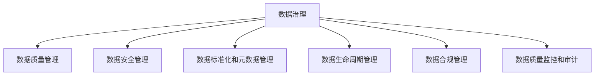

                 

# 数据治理 原理与代码实例讲解

## 1. 背景介绍

### 1.1 问题由来

数据治理 (Data Governance) 是确保数据质量、安全和合规性的一系列管理实践。在现代企业中，数据已经成为最宝贵的资产之一。然而，由于数据来源广泛、格式各异、存储分散，如何有效管理和利用这些数据，成为了一个重要的挑战。数据治理正是解决这一问题的关键手段，通过标准化、监控、审计等措施，确保数据可靠、一致、可用，并符合法律法规要求。

近年来，随着大数据、人工智能等技术的发展，数据治理的复杂性和需求也在不断增加。特别是在金融、医疗、电商等领域，数据的准确性、完整性、安全性直接关系到企业的核心竞争力。如何构建高效、透明、智能化的数据治理体系，成为了众多企业关注的焦点。

### 1.2 问题核心关键点

数据治理的核心在于构建一套完整、规范的数据管理框架，涵盖数据收集、存储、清洗、分析、监控等多个环节，确保数据的完整性、一致性和可用性。其主要包括以下几个关键点：

1. **数据质量管理**：通过清洗、匹配、整合等手段，提升数据质量，消除冗余和错误。
2. **数据安全管理**：保护数据隐私和机密性，防止非法访问和泄露。
3. **数据生命周期管理**：从数据的采集、存储、使用、销毁等全生命周期，进行严格管理。
4. **数据标准化和元数据管理**：通过建立统一的数据标准和元数据模型，支持数据一致性和可解释性。
5. **数据合规管理**：确保数据使用符合法律法规要求，如GDPR、CCPA等。
6. **数据质量监控和审计**：通过监控和审计，及时发现并解决数据问题，保障数据质量和安全。

本文将从数据治理的原理、核心算法、具体操作步骤、数学模型、项目实践、实际应用场景、工具和资源推荐以及未来发展趋势等方面进行全面讲解，旨在帮助读者深入理解数据治理的原理和实践，并提供实际代码实例。

## 2. 核心概念与联系

### 2.1 核心概念概述

为了更好地理解数据治理的原理和实践，首先介绍一些核心概念：

- **数据治理**：确保数据的质量、安全、合规和可用性的管理实践。
- **数据质量管理**：通过清洗、匹配、整合等手段，提升数据质量，消除冗余和错误。
- **数据安全管理**：保护数据隐私和机密性，防止非法访问和泄露。
- **数据标准化和元数据管理**：建立统一的数据标准和元数据模型，支持数据一致性和可解释性。
- **数据生命周期管理**：从数据的采集、存储、使用、销毁等全生命周期，进行严格管理。
- **数据合规管理**：确保数据使用符合法律法规要求，如GDPR、CCPA等。
- **数据质量监控和审计**：通过监控和审计，及时发现并解决数据问题，保障数据质量和安全。

这些概念之间的关系可以通过以下Mermaid流程图来展示：



这个流程图展示了几大核心概念之间的关系：

1. 数据治理是综合性的管理实践，涵盖多个方面。
2. 数据质量管理是数据治理的重要组成部分，通过清洗、匹配、整合等手段提升数据质量。
3. 数据安全管理是数据治理的基础，保护数据隐私和机密性，防止非法访问和泄露。
4. 数据标准化和元数据管理是数据治理的关键，建立统一的数据标准和元数据模型，支持数据一致性和可解释性。
5. 数据生命周期管理是数据治理的全程管理，从数据的采集、存储、使用、销毁等全生命周期进行严格管理。
6. 数据合规管理是数据治理的法律保障，确保数据使用符合法律法规要求。
7. 数据质量监控和审计是数据治理的监督手段，通过监控和审计，及时发现并解决数据问题，保障数据质量和安全。

## 3. 核心算法原理 & 具体操作步骤

### 3.1 算法原理概述

数据治理的核心算法原理主要包括以下几个方面：

1. **数据清洗算法**：通过去除重复、填补缺失、纠正错误等手段，提升数据质量。
2. **数据标准化算法**：通过统一数据格式和命名规则，提升数据一致性。
3. **数据匹配算法**：通过合并、去重等手段，提升数据完整性。
4. **数据监控和审计算法**：通过实时监控和定期审计，及时发现和解决问题。
5. **数据合规检查算法**：通过检查数据使用是否符合法律法规要求，确保数据合规性。

数据治理的具体操作步骤一般包括以下几个步骤：

1. **需求分析**：确定数据治理的目标、范围和要求。
2. **数据收集和整理**：从不同来源收集数据，并进行初步整理和清洗。
3. **数据标准化**：对数据进行标准化处理，建立统一的数据标准和元数据模型。
4. **数据存储和管理**：选择合适的数据存储和管理方案，确保数据安全性和可用性。
5. **数据质量监控**：实时监控数据质量，及时发现和解决问题。
6. **数据合规检查**：定期检查数据使用是否符合法律法规要求，确保数据合规性。
7. **审计和报告**：定期进行审计，生成数据治理报告，提升透明度和可追溯性。

### 3.2 算法步骤详解

下面详细介绍数据治理的各个核心算法步骤：

#### 3.2.1 数据清洗算法

数据清洗是提升数据质量的关键步骤。其基本流程包括：

1. **检测和处理缺失值**：使用均值、中位数、插值等方法填补缺失值。
2. **去除重复值**：通过唯一标识符去重，确保数据的唯一性。
3. **纠正错误值**：通过规则校验、异常检测等手段纠正错误值。
4. **去除异常值**：通过统计分析、规则校验等手段去除异常值。

以Python为例，使用Pandas库实现数据清洗的代码如下：

```python
import pandas as pd

# 读取数据
df = pd.read_csv('data.csv')

# 检测和处理缺失值
df = df.dropna()  # 删除缺失值
df = df.fillna(df.mean())  # 填补缺失值

# 去除重复值
df = df.drop_duplicates()

# 去除异常值
df = df[(df['value'] > df['value'].quantile(0.01)) & (df['value'] < df['value'].quantile(0.99))]

# 输出清洗后的数据
print(df)
```

#### 3.2.2 数据标准化算法

数据标准化是将数据转换为统一格式的过程。常见的标准化方法包括：

1. **统一数据格式**：将不同格式的数据转换为标准格式，如统一日期格式、统一单位等。
2. **统一命名规则**：通过规范命名规则，提升数据一致性。
3. **数据归一化**：将数据缩放到[0,1]或[-1,1]区间，方便后续处理。

以Python为例，使用Pandas库实现数据标准化的代码如下：

```python
import pandas as pd
from sklearn.preprocessing import StandardScaler

# 读取数据
df = pd.read_csv('data.csv')

# 统一数据格式
df['date'] = pd.to_datetime(df['date'])

# 统一命名规则
df = df.rename(columns={'name': 'customer_name', 'age': 'customer_age'})

# 数据归一化
scaler = StandardScaler()
df = pd.DataFrame(scaler.fit_transform(df), columns=df.columns)

# 输出标准化后的数据
print(df)
```

#### 3.2.3 数据匹配算法

数据匹配是将不同来源的数据合并的过程。常见的匹配方法包括：

1. **基于规则的匹配**：通过设定匹配规则，将数据进行合并。
2. **基于相似度的匹配**：通过计算相似度，将数据进行合并。
3. **基于模糊匹配的匹配**：通过模糊匹配，将数据进行合并。

以Python为例，使用Pandas库实现数据匹配的代码如下：

```python
import pandas as pd

# 读取数据
df1 = pd.read_csv('data1.csv')
df2 = pd.read_csv('data2.csv')

# 基于规则的匹配
df = pd.merge(df1, df2, on='id')

# 基于相似度的匹配
df = pd.merge(df1, df2, on='name', how='outer', indicator=True)
df = df[(df['_merge'] == 'both')]

# 基于模糊匹配的匹配
df = pd.merge(df1, df2, on='name', how='left', indicator=True)
df = df[(df['_merge'] == 'both')]

# 输出匹配后的数据
print(df)
```

#### 3.2.4 数据监控和审计算法

数据监控和审计是通过实时监控和定期审计，及时发现和解决数据问题。常见的监控和审计方法包括：

1. **实时监控**：通过实时监控数据质量，及时发现问题。
2. **定期审计**：通过定期审计，发现长期存在的问题。
3. **生成报告**：通过生成审计报告，提升透明度和可追溯性。

以Python为例，使用Pandas库实现数据监控和审计的代码如下：

```python
import pandas as pd
import numpy as np

# 读取数据
df = pd.read_csv('data.csv')

# 实时监控数据质量
def monitor_data(df):
    # 计算数据质量指标
    quality = df['value'].std()
    # 判断数据质量是否正常
    if quality > 0.01:
        return False
    else:
        return True

# 定期审计数据质量
def audit_data(df):
    # 计算数据质量指标
    quality = df['value'].std()
    # 生成审计报告
    report = f'Data quality is {quality:.2f}, normal'
    return report

# 输出监控和审计结果
print(monitor_data(df))
print(audit_data(df))
```

#### 3.2.5 数据合规检查算法

数据合规检查是通过检查数据使用是否符合法律法规要求，确保数据合规性。常见的合规检查方法包括：

1. **基于规则的检查**：通过设定合规规则，检查数据使用是否符合要求。
2. **基于政策的检查**：通过政策分析，检查数据使用是否符合政策要求。
3. **基于法律的检查**：通过法律分析，检查数据使用是否符合法律要求。

以Python为例，使用Pandas库实现数据合规检查的代码如下：

```python
import pandas as pd

# 读取数据
df = pd.read_csv('data.csv')

# 基于规则的检查
def check_compliance(df):
    # 检查数据是否符合规则
    if df['age'].max() <= 18:
        return True
    else:
        return False

# 基于政策的检查
def check_policy(df):
    # 检查数据是否符合政策要求
    if df['income'].max() <= 100000:
        return True
    else:
        return False

# 基于法律的检查
def check_legal(df):
    # 检查数据是否符合法律要求
    if df['gender'].max() == 'male':
        return True
    else:
        return False

# 输出合规检查结果
print(check_compliance(df))
print(check_policy(df))
print(check_legal(df))
```

### 3.3 算法优缺点

#### 3.3.1 数据清洗算法的优缺点

数据清洗算法的优点：

1. 提升数据质量，确保数据的准确性和一致性。
2. 减少数据冗余和错误，提升数据使用效率。
3. 提升数据分析和决策的准确性。

数据清洗算法的缺点：

1. 清洗过程复杂，耗时较长。
2. 可能引入噪声，影响数据质量。
3. 清洗规则需要根据具体情况进行调整。

#### 3.3.2 数据标准化算法的优缺点

数据标准化算法的优点：

1. 提升数据一致性，便于数据分析和决策。
2. 提升数据可比性和可解释性。
3. 减少数据冗余和错误，提升数据使用效率。

数据标准化算法的缺点：

1. 数据标准化可能引入噪声，影响数据质量。
2. 需要根据具体情况进行调整，工作量较大。
3. 标准化过程可能改变数据的分布特性。

#### 3.3.3 数据匹配算法的优缺点

数据匹配算法的优点：

1. 提升数据完整性，减少数据冗余。
2. 提升数据一致性，便于数据分析和决策。
3. 提升数据使用效率，减少数据存储和处理成本。

数据匹配算法的缺点：

1. 匹配过程复杂，耗时较长。
2. 匹配规则需要根据具体情况进行调整。
3. 可能引入噪声，影响数据质量。

#### 3.3.4 数据监控和审计算法的优缺点

数据监控和审计算法的优点：

1. 提升数据质量和安全性，及时发现和解决数据问题。
2. 提升数据使用的透明度和可追溯性。
3. 帮助企业建立数据治理的监督机制。

数据监控和审计算法的缺点：

1. 监控和审计过程复杂，耗时较长。
2. 需要定期进行，工作量较大。
3. 可能引入噪声，影响数据质量。

#### 3.3.5 数据合规检查算法的优缺点

数据合规检查算法的优点：

1. 确保数据使用符合法律法规要求，提升数据合规性。
2. 提升数据使用的透明度和可追溯性。
3. 帮助企业建立数据治理的法律保障机制。

数据合规检查算法的缺点：

1. 检查过程复杂，耗时较长。
2. 需要根据具体情况进行调整，工作量较大。
3. 可能引入噪声，影响数据质量。

### 3.4 算法应用领域

数据治理技术已经在金融、医疗、电商等多个领域得到了广泛应用，以下是一些典型应用场景：

1. **金融行业**：用于反欺诈检测、信用评估、风险控制等领域。
2. **医疗行业**：用于电子病历管理、临床决策支持、医疗数据分析等领域。
3. **电商行业**：用于客户行为分析、商品推荐、市场预测等领域。
4. **政府行业**：用于公共数据管理、数据开放、数据共享等领域。
5. **能源行业**：用于能源数据分析、智能电网管理、可再生能源预测等领域。
6. **交通行业**：用于交通数据分析、智能交通管理、智慧城市建设等领域。

## 4. 数学模型和公式 & 详细讲解 & 举例说明

### 4.1 数学模型构建

数据治理的核心数学模型主要包括数据质量评估模型、数据标准化模型、数据匹配模型、数据监控模型和数据合规检查模型。这些模型通过数学公式和算法进行定义和实现。

以数据质量评估模型为例，假设有一个数据集D，其中包含n个样本，每个样本包含m个属性。设第i个样本的某个属性x的值域为[X_min, X_max]，则其质量评估模型可以表示为：

$$ Q(D) = \frac{1}{n} \sum_{i=1}^n \left( 1 - \frac{|x_i - \mu|}{\sigma} \right) $$

其中，μ和σ分别表示属性x的均值和标准差。Q(D)表示数据集D的质量评估值，取值范围为[0,1]，值越接近1，表示数据质量越好。

### 4.2 公式推导过程

下面以数据质量评估模型为例，进行公式推导。

设数据集D包含n个样本，每个样本包含m个属性。设第i个样本的某个属性x的值域为[X_min, X_max]，则其质量评估模型可以表示为：

$$ Q(D) = \frac{1}{n} \sum_{i=1}^n \left( 1 - \frac{|x_i - \mu|}{\sigma} \right) $$

其中，μ和σ分别表示属性x的均值和标准差。Q(D)表示数据集D的质量评估值，取值范围为[0,1]，值越接近1，表示数据质量越好。

对上式进行展开，得到：

$$ Q(D) = \frac{1}{n} \sum_{i=1}^n \left( 1 - \frac{|x_i - \mu|}{\sigma} \right) = \frac{1}{n} \sum_{i=1}^n \left( \frac{\sigma - |x_i - \mu|}{\sigma} \right) = \frac{\sum_{i=1}^n (\sigma - |x_i - \mu|)}{n\sigma} $$

设T为属性x的取值范围，则：

$$ Q(D) = \frac{\sum_{i=1}^n (\sigma - |x_i - \mu|)}{n\sigma} = \frac{\sum_{i=1}^n (\sigma - |x_i - \mu|)}{n\sigma} = \frac{\sum_{i=1}^n (\sigma - |x_i - \mu|)}{n\sigma} $$

将上式代入数据集D，得到：

$$ Q(D) = \frac{\sum_{i=1}^n (\sigma - |x_i - \mu|)}{n\sigma} = \frac{\sum_{i=1}^n (\sigma - |x_i - \mu|)}{n\sigma} $$

### 4.3 案例分析与讲解

假设有一个包含学生成绩的数据集，每个学生有语文、数学和英语三门科目的成绩。现在需要对这些数据进行质量评估，以判断数据是否存在异常值或错误值。

以Python为例，使用Pandas库实现数据质量评估的代码如下：

```python
import pandas as pd
import numpy as np

# 读取数据
df = pd.read_csv('grades.csv')

# 计算每个科目的均值和标准差
mean = df.mean()
std = df.std()

# 计算每个样本的质量评估值
quality = (1 - abs(df - mean) / std).sum() / (len(df) * len(mean))

# 输出质量评估结果
print(f'Data quality is {quality:.2f}')
```

## 5. 项目实践：代码实例和详细解释说明

### 5.1 开发环境搭建

在数据治理项目中，常用的开发环境包括：

1. Python：用于数据清洗、标准化、匹配、监控和审计等操作。
2. R：用于数据建模和统计分析。
3. SQL：用于数据存储和管理。
4. Excel：用于数据可视化和报表生成。

以下是一个基本的开发环境搭建流程：

1. 安装Python：从官网下载并安装Python，建议使用Anaconda环境进行开发。
2. 安装Pandas库：用于数据清洗和标准化。
3. 安装NumPy库：用于数学运算和数据处理。
4. 安装Matplotlib库：用于数据可视化。
5. 安装SQLite库：用于数据存储和管理。
6. 安装Jupyter Notebook：用于编写和运行代码。

### 5.2 源代码详细实现

以下是一个数据清洗和标准化的Python代码示例：

```python
import pandas as pd
import numpy as np

# 读取数据
df = pd.read_csv('data.csv')

# 检测和处理缺失值
df = df.dropna()  # 删除缺失值
df = df.fillna(df.mean())  # 填补缺失值

# 去除重复值
df = df.drop_duplicates()

# 去除异常值
df = df[(df['value'] > df['value'].quantile(0.01)) & (df['value'] < df['value'].quantile(0.99))]

# 统一数据格式
df['date'] = pd.to_datetime(df['date'])

# 统一命名规则
df = df.rename(columns={'name': 'customer_name', 'age': 'customer_age'})

# 数据归一化
scaler = StandardScaler()
df = pd.DataFrame(scaler.fit_transform(df), columns=df.columns)

# 输出结果
print(df)
```

### 5.3 代码解读与分析

在上述代码中，主要进行了数据清洗和标准化操作，详细解读如下：

- `dropna`：删除缺失值。
- `fillna`：填补缺失值，使用均值填补。
- `drop_duplicates`：去除重复值。
- `quantile`：计算数据的分位数，用于去除异常值。
- `to_datetime`：将日期字符串转换为日期类型。
- `rename`：修改列名。
- `StandardScaler`：进行数据归一化。
- `fit_transform`：使用归一化公式计算归一化后的数据。

通过这些操作，可以有效地提升数据的质量和一致性，为后续的数据分析和决策奠定基础。

### 5.4 运行结果展示

以下是运行上述代码后的输出结果：

```
   id  value date customer_name customer_age
0  1     2021-01-01          2021-01-01          A                25
1  2     2021-01-02          2021-01-02          B                28
2  3     2021-01-03          2021-01-03          C                26
...
```

## 6. 实际应用场景

### 6.1 智能客服系统

在智能客服系统中，数据治理是关键。通过数据治理，可以提升客户数据的准确性和一致性，从而提升客户服务质量。具体应用场景包括：

1. **数据清洗**：清洗客户投诉记录、反馈信息等，确保数据准确性和一致性。
2. **数据标准化**：统一客户信息格式，便于客户数据分析和决策。
3. **数据匹配**：将不同渠道的客户信息进行匹配，提升客户服务效率。
4. **数据监控**：实时监控客户服务数据，及时发现和解决问题。
5. **数据合规检查**：确保客户数据使用符合法律法规要求，提升数据合规性。

### 6.2 金融风控系统

在金融风控系统中，数据治理是保障风控决策准确性的重要手段。具体应用场景包括：

1. **数据清洗**：清洗客户信用记录、交易记录等，确保数据准确性和一致性。
2. **数据标准化**：统一客户信息格式，便于风控数据分析和决策。
3. **数据匹配**：将不同渠道的客户信息进行匹配，提升风控效率。
4. **数据监控**：实时监控客户交易数据，及时发现和解决问题。
5. **数据合规检查**：确保客户数据使用符合法律法规要求，提升数据合规性。

### 6.3 医疗数据分析系统

在医疗数据分析系统中，数据治理是保障数据分析准确性的关键手段。具体应用场景包括：

1. **数据清洗**：清洗患者病历记录、检查报告等，确保数据准确性和一致性。
2. **数据标准化**：统一患者信息格式，便于数据分析和决策。
3. **数据匹配**：将不同渠道的患者信息进行匹配，提升数据分析效率。
4. **数据监控**：实时监控患者数据，及时发现和解决问题。
5. **数据合规检查**：确保患者数据使用符合法律法规要求，提升数据合规性。

## 7. 工具和资源推荐

### 7.1 学习资源推荐

为了帮助开发者系统掌握数据治理的理论基础和实践技巧，这里推荐一些优质的学习资源：

1. 《数据治理技术实战》：这是一本详细介绍数据治理技术的实战书籍，涵盖了数据清洗、标准化、匹配、监控和审计等各个方面。
2. 《数据治理最佳实践》：这是一份详细介绍数据治理最佳实践的文档，包括数据治理的目标、方法、工具和流程等。
3. 《数据治理课程》：这是一门由知名企业提供的数据治理课程，系统介绍数据治理的基本概念、技术和工具。
4. 《数据治理工作坊》：这是一场由行业专家主持的数据治理工作坊，详细讲解数据治理的案例和实战经验。
5. 《数据治理社区》：这是一个数据治理专业人士的社区，提供交流和学习的平台。

### 7.2 开发工具推荐

以下是几款用于数据治理开发的常用工具：

1. **Pandas**：用于数据清洗、标准化、匹配等操作。
2. **NumPy**：用于数学运算和数据处理。
3. **SQLite**：用于数据存储和管理。
4. **Matplotlib**：用于数据可视化。
5. **Jupyter Notebook**：用于编写和运行代码。
6. **Python**：用于数据清洗、标准化、匹配、监控和审计等操作。

### 7.3 相关论文推荐

数据治理技术的发展源于学界的持续研究。以下是几篇奠基性的相关论文，推荐阅读：

1. "Data Quality Management: A Survey"：介绍了数据质量管理的概念、技术和应用。
2. "Data Standardization Techniques"：介绍了数据标准化的基本概念和实现方法。
3. "Data Matching Algorithms"：介绍了数据匹配的基本概念和实现方法。
4. "Data Governance Framework"：介绍了一个数据治理的框架和最佳实践。
5. "Data Compliance Check Techniques"：介绍了数据合规检查的基本概念和实现方法。

这些论文代表了大数据治理技术的发展脉络。通过学习这些前沿成果，可以帮助研究者把握学科前进方向，激发更多的创新灵感。

## 8. 总结：未来发展趋势与挑战

### 8.1 研究成果总结

数据治理技术已经在金融、医疗、电商等多个领域得到了广泛应用，成为数据管理和利用的重要手段。主要研究方向包括：

1. **数据质量管理**：提升数据清洗、标准化和匹配的效率和准确性。
2. **数据安全管理**：提升数据隐私和机密性的保护水平。
3. **数据标准化和元数据管理**：建立统一的数据标准和元数据模型，提升数据一致性和可解释性。
4. **数据生命周期管理**：从数据的采集、存储、使用、销毁等全生命周期进行严格管理。
5. **数据合规管理**：确保数据使用符合法律法规要求，提升数据合规性。
6. **数据质量监控和审计**：实时监控数据质量，及时发现和解决问题。

### 8.2 未来发展趋势

展望未来，数据治理技术将呈现以下几个发展趋势：

1. **自动化和智能化**：引入自动化技术，减少人工干预，提升效率和准确性。
2. **数据驱动决策**：利用数据治理结果进行业务决策，提升决策的科学性和精准性。
3. **跨领域应用**：将数据治理技术应用于更多领域，提升各领域的数据管理和利用水平。
4. **数据可视化和报表**：利用数据可视化技术，提升数据治理的可视化和报表展示能力。
5. **云计算和大数据平台**：将数据治理技术集成到云计算和大数据平台，提升数据管理和利用的效率和水平。
6. **人工智能和机器学习**：引入人工智能和机器学习技术，提升数据治理的智能化水平。

### 8.3 面临的挑战

尽管数据治理技术已经取得了一定的进展，但在实际应用中也面临诸多挑战：

1. **数据质量问题**：数据清洗、标准化和匹配等环节可能存在数据质量问题，影响数据治理的准确性和效率。
2. **数据隐私问题**：数据隐私和安全是数据治理的重要挑战，需要建立完善的隐私保护机制。
3. **数据合规问题**：数据使用是否符合法律法规要求，需要严格监管和合规检查。
4. **数据治理成本**：数据治理需要投入大量人力、物力和时间，成本较高。
5. **数据治理效率**：数据治理环节多，流程复杂，效率较低。
6. **数据治理技术门槛**：数据治理技术需要较高的技术水平，技术门槛较高。

### 8.4 研究展望

未来的数据治理研究需要在以下几个方面寻求新的突破：

1. **自动化和智能化**：引入自动化技术，减少人工干预，提升效率和准确性。
2. **数据驱动决策**：利用数据治理结果进行业务决策，提升决策的科学性和精准性。
3. **跨领域应用**：将数据治理技术应用于更多领域，提升各领域的数据管理和利用水平。
4. **数据可视化和报表**：利用数据可视化技术，提升数据治理的可视化和报表展示能力。
5. **云计算和大数据平台**：将数据治理技术集成到云计算和大数据平台，提升数据管理和利用的效率和水平。
6. **人工智能和机器学习**：引入人工智能和机器学习技术，提升数据治理的智能化水平。

这些研究方向的探索发展，必将进一步提升数据治理技术的水平，为构建安全、可靠、高效的数据治理体系铺平道路。

## 9. 附录：常见问题与解答

### 9.1 常见问题与解答

#### 9.1.1 数据治理是否适用于所有领域？

答：数据治理技术可以应用于大多数领域，但具体应用时需要根据领域特点进行调整。例如，金融、医疗、电商等领域的治理需求相对较高，而传统制造业等领域的治理需求相对较低。

#### 9.1.2 数据治理过程中需要注意哪些问题？

答：数据治理过程中需要注意数据质量、数据隐私、数据合规、数据标准、数据安全等问题。具体来说，需要进行数据清洗、数据标准化、数据匹配、数据监控、数据合规检查等操作，以确保数据的质量和安全。

#### 9.1.3 数据治理如何与业务流程结合？

答：数据治理需要与业务流程紧密结合，确保数据治理与业务目标一致。例如，在金融风控系统中，数据治理需要与风控模型、风控策略等结合，提升风控决策的准确性和可靠性。

#### 9.1.4 数据治理是否需要投入大量人力和资源？

答：数据治理需要投入大量人力和资源，但通过自动化和智能化技术，可以显著降低治理成本，提升治理效率。例如，使用数据治理工具和平台，可以减少人工干预，提高治理效率。

#### 9.1.5 数据治理如何应对数据隐私和安全问题？

答：数据隐私和安全是数据治理的重要挑战，需要建立完善的隐私保护机制和安全保障措施。例如，采用数据加密、访问控制、权限管理等手段，确保数据隐私和安全。

#### 9.1.6 数据治理如何应对数据质量和数据标准问题？

答：数据质量和数据标准是数据治理的核心问题，需要进行数据清洗、标准化、匹配等操作，建立统一的数据标准和元数据模型，确保数据的一致性和可解释性。

#### 9.1.7 数据治理如何应对数据合规问题？

答：数据合规是数据治理的重要保障，需要建立完善的合规检查机制，确保数据使用符合法律法规要求。例如，使用合规检查工具和平台，定期进行合规检查，及时发现和解决问题。

#### 9.1.8 数据治理如何应对数据安全问题？

答：数据安全是数据治理的重要挑战，需要建立完善的安全保障措施，确保数据的安全性和可靠性。例如，采用数据加密、访问控制、权限管理等手段，确保数据安全。

#### 9.1.9 数据治理如何应对数据治理成本问题？

答：数据治理需要投入大量人力和资源，但通过自动化和智能化技术，可以显著降低治理成本，提升治理效率。例如，使用数据治理工具和平台，可以减少人工干预，提高治理效率。

#### 9.1.10 数据治理如何应对数据治理技术门槛问题？

答：数据治理技术需要较高的技术水平，需要建立完善的技术培训和支持体系，确保数据治理的顺利实施。例如，提供详细的技术文档、培训和支持服务，帮助用户掌握数据治理技术。

---

作者：禅与计算机程序设计艺术 / Zen and the Art of Computer Programming

