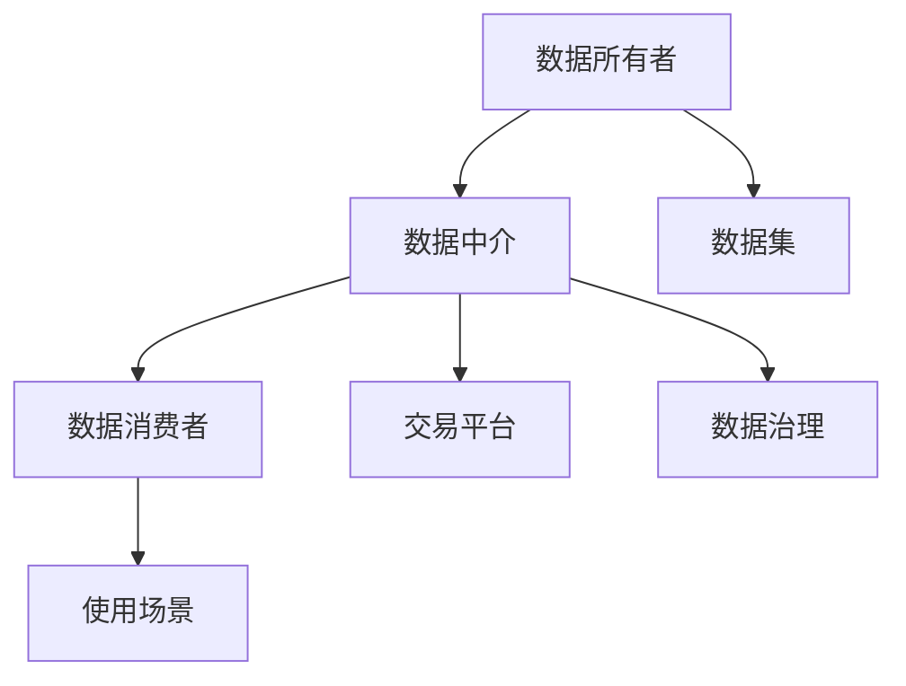

                 

# 数据集市场兴起,每个人都是数据提供者

## 1. 背景介绍

### 1.1 问题由来
近年来，随着人工智能技术在各行各业的广泛应用，数据集（Dataset）的搜集、整理、存储和交易逐渐成为关键问题。数据集市场兴起的一个重要原因在于，AI模型尤其是深度学习模型，往往需要海量、多维度、结构化与非结构化数据来训练和优化。在许多情况下，单一组织或个人无法独立拥有足够的数据集来满足模型训练的需求，这便催生了数据集市场。

### 1.2 问题核心关键点
数据集市场主要是基于数据共享、交易和租赁的商业模式。核心在于将具有特定属性的数据集，从数据所有者传递给数据消费者，从而实现数据资源的有效利用。数据集的共享与交易为AI模型开发提供了充足的资源，使得各类模型训练效率大幅提升，推动了AI技术的进步。

### 1.3 问题研究意义
数据集市场不仅促进了AI技术的加速发展，还直接影响了各行业数字化转型升级。其重要性体现在以下几个方面：
1. 加速AI模型训练：通过共享数据集，各类AI模型尤其是深度学习模型可以更快、更高效地进行训练。
2. 推动行业应用：数据集市场的兴起，为各行业应用AI技术提供了基础支持，促进了AI技术在更多场景中的落地。
3. 优化资源分配：数据集市场为数据资源提供了一个高效流转的平台，使得资源能够被更合理地分配和使用。
4. 降低数据成本：共享交易机制有助于降低数据获取和存储的成本，使得更多的中小企业也能参与AI研发。
5. 提升数据质量：数据集市场通过严格的数据质量评估机制，推动数据共享的规范性，提升整体数据质量。

## 2. 核心概念与联系

### 2.1 核心概念概述
为了更好地理解数据集市场，下面将介绍几个核心概念：

- **数据集（Dataset）**：是指具有特定格式和结构的原始数据集合，可以包括图片、文本、音频、视频等多种形式。
- **数据所有者（Data Owner）**：是数据集的原主人，即拥有数据所有权和使用权的主体。
- **数据消费者（Data Consumer）**：是需要使用数据集进行模型训练或模型测试的AI开发者或企业。
- **数据中介（Data Broker）**：是在数据所有者与消费者之间提供数据共享和交易服务的第三方平台。
- **数据质量（Data Quality）**：指的是数据集的完整性、准确性、一致性和时效性等，是数据集价值的核心。

这些核心概念之间相互依赖，形成了数据集市场的完整框架。数据所有者提供高质量的数据集，数据中介负责交易和监管，数据消费者使用数据集优化AI模型。

### 2.2 核心概念原理和架构的 Mermaid 流程图

这个流程图展示了数据集市场中各角色的关键作用和相互关系：

1. **数据所有者**：提供高质量的数据集。
2. **数据中介**：负责数据集的共享和交易，确保数据质量和安全。
3. **数据消费者**：使用数据集优化AI模型，提升业务效率。
4. **数据治理**：对数据质量进行监控和管理，确保数据安全合规。

数据集市场通过数据所有者、数据中介、数据消费者和数据治理的多方协同，形成了一个高效运转的生态系统。

## 3. 核心算法原理 & 具体操作步骤
### 3.1 算法原理概述
数据集市场的核心算法主要围绕数据共享、数据交易和数据质量控制展开。其原理包括：

1. **数据共享算法**：即如何高效地将数据集从一个所有者传递给另一个消费者，保证数据的完整性和一致性。
2. **数据交易算法**：涉及到交易机制的设计，如竞价、拍卖、租赁等，确保数据交易的公平性和透明性。
3. **数据质量控制算法**：通过数据清洗、去重、标注等技术，提升数据集的准确性和可靠性。

### 3.2 算法步骤详解
数据集市场的具体步骤包括：

1. **数据采集**：数据所有者通过爬虫、API、合作机构等方式，收集和整理各类原始数据。
2. **数据标注**：对原始数据进行标注，如分类、注释、实体识别等，以提高数据的可用性。
3. **数据清洗**：去除冗余数据、修复缺失值、去除噪声等，确保数据质量。
4. **数据共享**：数据所有者将数据集上传到数据中介平台，并通过平台进行发布和共享。
5. **数据交易**：数据消费者在平台上进行竞价或租赁，选择最适合自己需求的数据集。
6. **数据使用**：数据消费者使用数据集进行模型训练、优化和测试，提升AI模型性能。
7. **数据反馈**：消费者使用数据后的效果反馈给数据中介平台，平台根据反馈调整数据质量和共享策略。

### 3.3 算法优缺点
数据集市场的主要优势包括：
1. **高效资源共享**：数据集市场的出现使得AI模型训练效率大幅提升，缩短了模型开发的周期。
2. **降低数据获取成本**：共享和交易机制降低了数据获取和存储的成本，使更多中小企业受益。
3. **提升数据质量**：数据中介平台严格的数据质量管控，提高了整体数据质量。

然而，数据集市场也存在一些问题：
1. **数据隐私和安全**：数据共享和交易过程中存在隐私泄露和数据安全风险，需要有效的监管机制。
2. **数据质量和合规性**：不同数据集的质量参差不齐，如何评估和确保数据集符合标准是一个挑战。
3. **市场价格波动**：市场机制设计不当可能导致价格波动，影响市场稳定性。
4. **数据垄断风险**：部分大型企业可能通过数据集市场形成数据垄断，影响市场公平竞争。

### 3.4 算法应用领域
数据集市场在多个领域得到广泛应用，包括但不限于：

- **医疗健康**：数据集市场为医疗影像分析、疾病预测和药物研发提供了大量数据支持。
- **金融服务**：金融数据集市场推动了风险评估、信用评分和算法交易的发展。
- **自动驾驶**：自动驾驶数据集市场提供了大量的道路、交通和环境数据，支持模型训练和优化。
- **电商零售**：电商平台通过数据集交易提升了客户行为分析、推荐系统和个性化营销的精准度。
- **智能制造**：工业数据集市场推动了生产调度、设备维护和质量控制等技术的智能化应用。
- **智能客服**：数据集市场为智能客服系统的优化和升级提供了丰富的对话记录和用户反馈数据。

## 4. 数学模型和公式 & 详细讲解 & 举例说明

### 4.1 数学模型构建
数据集市场的数学模型主要涉及数据共享和交易机制的设计。下面以简单的竞价模型为例，描述其数学构建过程。

设 $D$ 为待交易的数据集，$P$ 为数据集的价格，$b$ 为竞价者 $B$ 愿意支付的最高价格，$Q$ 为数据集的需求量。假设有 $N$ 个竞价者，价格和需求量为 $P_i$ 和 $Q_i$，$i \in [1, N]$。

**竞价模型**：
- 数据集以最高价 $P_{max}$ 成交。
- 所有竞价者按出价排序，选择报价最高的前 $Q$ 个竞价者成交。
- 成交价格为成交者中出价最高的 $P_{max}$。

**目标函数**：
- 最大化数据集的市场价值 $V(D)$，即 $V(D) = P_{max} \times Q$。

**约束条件**：
- 每个竞价者 $B$ 支付的价格不超过其最高出价 $b$，即 $P_i \leq b_i$。
- 成交需求不超过 $Q$，即 $\sum_{i=1}^{Q} Q_i = Q$。

### 4.2 公式推导过程
根据上述目标函数和约束条件，建立数学模型：

$$
\max_{P_i} \sum_{i=1}^{N} P_i \\
s.t. \begin{cases}
P_i \leq b_i, \quad i \in [1, N] \\
\sum_{i=1}^{Q} Q_i = Q
\end{cases}
$$

使用整数线性规划求解上述问题，得到最优解 $P^*$：

$$
P^* = \begin{cases}
P_i, \quad \text{if} \sum_{i=1}^{Q} P_i = P_{max} \text{且} Q_i \leq Q \\
\text{其他}, \quad \text{其他情况}
\end{cases}
$$

### 4.3 案例分析与讲解
以智能医疗为例，分析数据集市场的应用。假设某医院拥有大规模的医学影像数据集 $D$，包括CT、MRI、X光等多种类型。医院希望通过数据集市场将数据分享给多家医疗机构，用于疾病诊断和医疗研究。

**数据采集**：医院通过合作机构、爬虫等方式，收集各类医学影像数据，并进行标注和清洗。

**数据共享**：医院将数据集上传到数据中介平台，并设置竞价机制，允许医疗机构竞价购买数据集。

**数据交易**：医疗机构 A 和 B 出价 $P_A = 10000$ 和 $P_B = 9000$，成交需求为 $Q = 5$。平台按照竞价排序，选择报价最高的前 5 个竞价者成交，成交价格为 $P_{max} = 10000$。

**数据使用**：A 和 B 分别使用数据集优化疾病诊断模型，提升诊断准确率。

**数据反馈**：A 反馈数据集在疾病预测中的效果，平台根据反馈调整数据集质量，发布新的版本以优化算法性能。

通过以上案例可以看出，数据集市场使得医院的数据得以有效利用，同时也为医疗机构提供了高质量的数据集，提升医疗技术水平。

## 5. 项目实践：代码实例和详细解释说明

### 5.1 开发环境搭建
在进行数据集市场系统开发前，需要搭建开发环境，包括编程语言、数据处理库、数据交易平台等。

1. **编程语言**：Python，使用PyTorch、TensorFlow、Pandas、NumPy等库进行数据处理和模型训练。
2. **数据处理库**：Pandas，用于数据清洗、标注和格式转换。
3. **数据交易平台**：搭建基于Web的RESTful API接口，使用Flask或Django框架进行开发。
4. **数据库**：使用MySQL或PostgreSQL存储数据集信息、交易记录和用户信息。

### 5.2 源代码详细实现
下面给出数据集市场系统的一个简单实现示例，包括数据上传、竞价和数据共享等功能。

```python
from flask import Flask, request, jsonify
from flask_sqlalchemy import SQLAlchemy
from sqlalchemy import Column, Integer, String, Boolean

app = Flask(__name__)
app.config['SQLALCHEMY_DATABASE_URI'] = 'sqlite:///data_market.db'
db = SQLAlchemy(app)

class Dataset(db.Model):
    id = Column(Integer, primary_key=True)
    name = Column(String(50), nullable=False)
    description = Column(String(255))
    price = Column(Integer, nullable=False)
    available_quantity = Column(Integer, nullable=False)

    def __init__(self, name, description, price, available_quantity):
        self.name = name
        self.description = description
        self.price = price
        self.available_quantity = available_quantity

@app.route('/datasets', methods=['POST'])
def create_dataset():
    data = request.get_json()
    dataset = Dataset(name=data['name'], description=data['description'], price=data['price'], available_quantity=data['quantity'])
    db.session.add(dataset)
    db.session.commit()
    return jsonify({'id': dataset.id}), 201

@app.route('/datasets/<int:id>', methods=['GET'])
def get_dataset(id):
    dataset = Dataset.query.get(id)
    return jsonify({'id': dataset.id, 'name': dataset.name, 'description': dataset.description, 'price': dataset.price, 'available_quantity': dataset.available_quantity})

@app.route('/datasets/<int:id>', methods=['PUT'])
def update_dataset(id):
    dataset = Dataset.query.get(id)
    if not dataset:
        return jsonify({'error': 'Dataset not found'}), 404
    data = request.get_json()
    dataset.description = data['description']
    dataset.price = data['price']
    dataset.available_quantity = data['quantity']
    db.session.commit()
    return jsonify({'id': dataset.id, 'name': dataset.name, 'description': dataset.description, 'price': dataset.price, 'available_quantity': dataset.available_quantity})

@app.route('/datasets/<int:id>', methods=['DELETE'])
def delete_dataset(id):
    dataset = Dataset.query.get(id)
    if not dataset:
        return jsonify({'error': 'Dataset not found'}), 404
    db.session.delete(dataset)
    db.session.commit()
    return jsonify({'id': dataset.id, 'name': dataset.name, 'description': dataset.description, 'price': dataset.price, 'available_quantity': dataset.available_quantity}), 204
```

### 5.3 代码解读与分析
上述代码实现了简单的数据集管理系统，包括数据集的创建、获取、更新和删除功能。使用Flask框架搭建RESTful API接口，SQLAlchemy库进行数据库操作，MySQL或PostgreSQL数据库存储数据集信息。

**5.3.1 数据集创建**：
```python
@app.route('/datasets', methods=['POST'])
def create_dataset():
    data = request.get_json()
    dataset = Dataset(name=data['name'], description=data['description'], price=data['price'], available_quantity=data['quantity'])
    db.session.add(dataset)
    db.session.commit()
    return jsonify({'id': dataset.id}), 201
```

**5.3.2 数据集获取**：
```python
@app.route('/datasets/<int:id>', methods=['GET'])
def get_dataset(id):
    dataset = Dataset.query.get(id)
    return jsonify({'id': dataset.id, 'name': dataset.name, 'description': dataset.description, 'price': dataset.price, 'available_quantity': dataset.available_quantity})
```

**5.3.3 数据集更新**：
```python
@app.route('/datasets/<int:id>', methods=['PUT'])
def update_dataset(id):
    dataset = Dataset.query.get(id)
    if not dataset:
        return jsonify({'error': 'Dataset not found'}), 404
    data = request.get_json()
    dataset.description = data['description']
    dataset.price = data['price']
    dataset.available_quantity = data['quantity']
    db.session.commit()
    return jsonify({'id': dataset.id, 'name': dataset.name, 'description': dataset.description, 'price': dataset.price, 'available_quantity': dataset.available_quantity})
```

**5.3.4 数据集删除**：
```python
@app.route('/datasets/<int:id>', methods=['DELETE'])
def delete_dataset(id):
    dataset = Dataset.query.get(id)
    if not dataset:
        return jsonify({'error': 'Dataset not found'}), 404
    db.session.delete(dataset)
    db.session.commit()
    return jsonify({'id': dataset.id, 'name': dataset.name, 'description': dataset.description, 'price': dataset.price, 'available_quantity': dataset.available_quantity}), 204
```

### 5.4 运行结果展示
在上述代码基础上，搭建Web服务后，可以访问 `http://localhost:5000/datasets` 等接口，获取数据集的相关信息。具体结果如下：

- **创建数据集**：
  - `POST /datasets`
  - 请求体：
    ```json
    {
        "name": "医疗影像数据集",
        "description": "包含CT、MRI、X光等多种类型的医学影像数据",
        "price": 10000,
        "quantity": 100
    }
    ```
  - 响应体：
    ```json
    {
        "id": 1,
        "name": "医疗影像数据集",
        "description": "包含CT、MRI、X光等多种类型的医学影像数据",
        "price": 10000,
        "available_quantity": 100
    }
    ```

- **获取数据集**：
  - `GET /datasets/1`
  - 响应体：
    ```json
    {
        "id": 1,
        "name": "医疗影像数据集",
        "description": "包含CT、MRI、X光等多种类型的医学影像数据",
        "price": 10000,
        "available_quantity": 100
    }
    ```

- **更新数据集**：
  - `PUT /datasets/1`
  - 请求体：
    ```json
    {
        "description": "更新后的描述",
        "price": 20000,
        "quantity": 200
    }
    ```
  - 响应体：
    ```json
    {
        "id": 1,
        "name": "医疗影像数据集",
        "description": "更新后的描述",
        "price": 20000,
        "available_quantity": 200
    }
    ```

- **删除数据集**：
  - `DELETE /datasets/1`
  - 响应体：
    ```json
    {
        "id": 1,
        "name": "医疗影像数据集",
        "description": "更新后的描述",
        "price": 20000,
        "available_quantity": 200
    }
    ```

通过上述代码实现，可以构建一个基本的在线数据集市场管理系统，满足数据集的创建、获取、更新和删除需求。

## 6. 实际应用场景

### 6.1 智能医疗

在智能医疗领域，数据集市场为医学影像分析和疾病预测提供了重要支持。例如，医院可以通过共享CT、MRI等医学影像数据，帮助其他医疗机构提升诊断能力，并加速疾病预测模型的开发。

**具体应用**：
- **数据集共享**：医院通过数据集市场，将大量医学影像数据分享给合作医院，用于疾病诊断和治疗。
- **疾病预测**：医疗机构利用共享数据集训练疾病预测模型，提升预测准确率，优化诊疗方案。
- **远程医疗**：远程医疗平台通过数据集市场获取数据，支持远程诊断和实时分析。

### 6.2 自动驾驶

自动驾驶技术依赖于大量的道路交通数据和环境数据，数据集市场能够提供丰富的数据支持。例如，自动驾驶公司可以通过数据集市场获取大规模的交通视频、道路地图和环境传感器数据，用于模型训练和优化。

**具体应用**：
- **道路数据**：自动驾驶公司获取包含各种交通场景的道路视频数据，用于训练和测试自动驾驶模型。
- **环境数据**：通过数据集市场获取环境传感器数据，用于提升自动驾驶系统对复杂环境变化的适应能力。
- **车辆行为数据**：通过数据集市场获取车辆行为数据，提升自动驾驶系统对交通流量的预测和规划能力。

### 6.3 金融服务

金融行业对数据的需求极其旺盛，数据集市场为金融数据分析和风险评估提供了重要支持。例如，金融机构可以通过数据集市场获取金融交易数据、客户行为数据和市场情绪数据，用于模型训练和优化。

**具体应用**：
- **风险评估**：金融机构利用共享金融交易数据，训练风险评估模型，预测信贷和投资风险。
- **客户行为分析**：通过数据集市场获取客户行为数据，优化客户服务和产品推荐。
- **市场情绪分析**：利用数据集市场获取市场情绪数据，预测市场走势和波动。

### 6.4 未来应用展望

数据集市场的未来发展将体现在以下几个方面：

1. **标准化和规范化**：随着数据集市场的发展，将逐步建立统一的数据格式和标准，提升数据质量和互操作性。
2. **去中心化数据共享**：去中心化存储和共享技术，如区块链，将为数据共享提供更加安全和透明的方式。
3. **跨平台集成**：数据集市场将与其他AI平台、云平台和数据治理系统集成，形成生态闭环。
4. **数据隐私保护**：数据集市场将引入隐私保护技术，如差分隐私、联邦学习等，确保数据安全和隐私合规。
5. **智能数据发现**：数据集市场将引入智能推荐系统，帮助用户发现和筛选最适合的数据集，提高数据利用效率。
6. **多元化数据来源**：数据集市场将整合更多元化的数据来源，如传感器数据、物联网数据等，拓展数据市场边界。

## 7. 工具和资源推荐

### 7.1 学习资源推荐

为了帮助开发者系统掌握数据集市场的理论和实践，这里推荐一些优质的学习资源：

1. **《Python数据科学手册》**：全面介绍Python在数据科学和机器学习中的应用，包括数据集管理和交易。
2. **Kaggle数据科学竞赛**：通过参与Kaggle竞赛，学习数据集管理和数据处理技巧。
3. **Coursera《数据科学基础》课程**：由约翰霍普金斯大学提供，涵盖数据集管理和数据科学基础。
4. **DataCamp在线课程**：提供丰富的数据集管理和数据科学课程，涵盖数据清洗、数据可视化和数据交易等主题。

通过对这些资源的学习实践，相信你一定能够快速掌握数据集市场的精髓，并用于解决实际的数据问题。

### 7.2 开发工具推荐

高效的开发离不开优秀的工具支持。以下是几款用于数据集市场开发的常用工具：

1. **Jupyter Notebook**：数据集管理和数据处理的好帮手，支持多语言代码编辑和数据可视化。
2. **TensorBoard**：数据集市场监控和调试的好工具，可以实时查看数据集市场的工作状态和性能指标。
3. **Kibana**：数据集市场的数据可视化和探索工具，提供丰富的可视化图表和仪表盘。
4. **Flask和Django**：用于搭建数据集市场API接口，方便数据集共享和交易。
5. **AWS SageMaker**：提供云端的数据集管理、训练和部署服务，支持大规模数据集交易。
6. **Google Cloud BigQuery**：云数据仓库，支持大规模数据集的存储和分析。

合理利用这些工具，可以显著提升数据集市场开发效率，加快模型训练和数据共享速度。

### 7.3 相关论文推荐

数据集市场的研究方向非常广泛，以下是几篇具有代表性的相关论文，推荐阅读：

1. **《数据集市场的理论基础与实践》**：全面介绍了数据集市场的理论基础和实践技术，涵盖了数据共享、交易和质量控制等方面。
2. **《数据集市场的标准化和规范化研究》**：研究了数据集市场标准化和规范化的重要性，探讨了如何建立统一的数据格式和标准。
3. **《去中心化数据共享技术》**：介绍了去中心化存储和共享技术，如区块链，如何在数据集市场实现数据的安全和透明共享。
4. **《智能数据发现和推荐系统》**：研究了智能推荐系统在数据集市场中的应用，提升用户发现和筛选数据集的能力。
5. **《数据集市场的数据隐私保护》**：探讨了数据集市场中的数据隐私保护技术，如差分隐私、联邦学习等。

这些论文代表了数据集市场的研究方向和前沿成果，有助于理解数据集市场的理论基础和技术细节。

## 8. 总结：未来发展趋势与挑战

### 8.1 研究成果总结
本文对数据集市场兴起进行了系统介绍，深入分析了数据集市场的基本概念、原理和操作步骤，并给出了实际应用场景和未来展望。通过分析，可以得出以下总结：

1. 数据集市场为AI模型训练提供了重要支持，显著提升了模型训练效率和质量。
2. 数据集市场应用广泛，涵盖医疗、金融、自动驾驶等多个领域，推动了各行业的数字化转型。
3. 数据集市场具有巨大的市场潜力和应用前景，是AI技术发展的重要基础。

### 8.2 未来发展趋势
数据集市场的未来发展将体现在以下几个方面：

1. **标准化和规范化**：数据集市场将逐步建立统一的数据格式和标准，提升数据质量和互操作性。
2. **去中心化数据共享**：去中心化存储和共享技术，如区块链，将为数据共享提供更加安全和透明的方式。
3. **跨平台集成**：数据集市场将与其他AI平台、云平台和数据治理系统集成，形成生态闭环。
4. **数据隐私保护**：数据集市场将引入隐私保护技术，如差分隐私、联邦学习等，确保数据安全和隐私合规。
5. **智能数据发现**：数据集市场将引入智能推荐系统，帮助用户发现和筛选最适合的数据集，提高数据利用效率。
6. **多元化数据来源**：数据集市场将整合更多元化的数据来源，如传感器数据、物联网数据等，拓展数据市场边界。

### 8.3 面临的挑战
数据集市场在快速发展的同时，也面临着诸多挑战：

1. **数据隐私和安全**：数据共享和交易过程中存在隐私泄露和数据安全风险，需要有效的监管机制。
2. **数据质量和合规性**：不同数据集的质量参差不齐，如何评估和确保数据集符合标准是一个挑战。
3. **市场价格波动**：市场机制设计不当可能导致价格波动，影响市场稳定性。
4. **数据垄断风险**：部分大型企业可能通过数据集市场形成数据垄断，影响市场公平竞争。

### 8.4 研究展望
面对数据集市场所面临的挑战，未来的研究需要在以下几个方面寻求新的突破：

1. **数据隐私和安全保护**：引入差分隐私、联邦学习等技术，确保数据共享和交易过程中的隐私和安全。
2. **数据质量控制**：建立严格的数据质量评估机制，确保数据集的准确性和可靠性。
3. **市场机制优化**：设计更加公平、透明的市场机制，避免价格波动和数据垄断。
4. **多元化数据来源**：整合更多元化的数据来源，如传感器数据、物联网数据等，拓展数据市场边界。
5. **智能数据发现**：引入智能推荐系统，提升用户发现和筛选数据集的能力。

这些研究方向将有助于进一步完善数据集市场，提升数据利用效率和市场稳定性，推动数据集市场健康、持续发展。

## 9. 附录：常见问题与解答

**Q1：数据集市场如何确保数据安全？**

A: 数据集市场通过引入隐私保护技术，如差分隐私、联邦学习等，确保数据共享和交易过程中的隐私和安全。同时，数据中介平台也需要建立严格的数据治理和合规机制，确保数据使用的合法性和合规性。

**Q2：如何评估数据集的质量？**

A: 数据集质量评估可以通过以下方法进行：
1. 数据完整性：检查数据集是否完整，是否存在缺失值和异常值。
2. 数据准确性：通过人工和自动方式，验证数据的准确性和一致性。
3. 数据时效性：确保数据集的时效性，避免使用过期数据。
4. 数据多样性：评估数据集的多样性和代表性，避免数据偏置。
5. 数据格式：确保数据格式符合标准，支持各类数据处理和分析工具。

**Q3：数据集市场如何处理数据版权问题？**

A: 数据集市场通过明确数据版权归属，确保数据共享和交易的合法性。数据所有者需要提供数据集的版权证明，数据消费者需要签署版权协议，明确使用数据的权利和责任。数据中介平台需要建立完善的版权管理系统，监控数据版权的使用情况。

**Q4：数据集市场如何确保数据质量一致性？**

A: 数据集市场可以通过以下方法确保数据质量一致性：
1. 数据标准化：建立统一的数据格式和标准，确保数据集的一致性。
2. 数据校验：引入数据校验机制，定期检查数据集的完整性和准确性。
3. 数据更新：及时更新数据集，确保数据的时效性。
4. 数据溯源：建立数据溯源机制，确保数据的来源和变更记录。
5. 数据质量评估：引入第三方评估机构，对数据集进行定期评估，提升数据质量。

通过以上措施，数据集市场可以确保数据集的质量一致性，提升数据集的交易价值和使用效果。

**Q5：数据集市场如何处理数据垄断问题？**

A: 数据集市场可以通过以下方法处理数据垄断问题：
1. 数据共享：鼓励数据所有者共享数据集，避免数据垄断。
2. 数据来源多元化：整合更多元化的数据来源，如传感器数据、物联网数据等，拓展数据市场边界。
3. 数据治理：建立严格的数据治理和合规机制，确保数据使用的合法性和合规性。
4. 市场监管：引入市场监管机制，防止数据垄断和不公平竞争。
5. 数据开放：通过数据开放政策，鼓励更多的数据所有者参与数据共享和交易。

通过这些措施，数据集市场可以防止数据垄断问题，确保市场的公平竞争和健康发展。

---

作者：禅与计算机程序设计艺术 / Zen and the Art of Computer Programming

