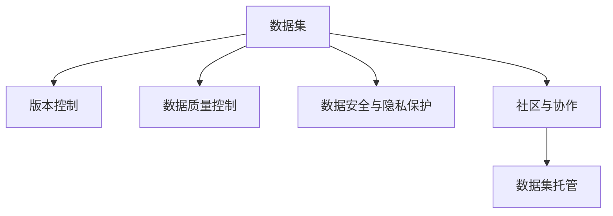

                 

# 数据集托管平台:软件2.0的GitHub何时到来

软件2.0时代，数据集和代码不再只属于学术界和大型企业，而是成为每个人都可以轻松访问和使用的通用资源。正如GitHub在代码托管领域所做的那样，未来我们也需要一个统一、开放、高效的数据集托管平台。那么，数据集托管平台何时能像GitHub一样普及并成为标准呢？

## 1. 背景介绍

### 1.1 问题由来
随着人工智能(AI)和机器学习(ML)技术的迅速发展，高质量的数据集成为了推动模型性能提升的关键因素。然而，现有的数据集收集、存储、分享机制存在诸多问题，如数据共享不便、版本控制困难、数据质量参差不齐等，严重阻碍了AI和ML研究的进展。因此，建立一个像GitHub那样高效、开放、易用的数据集托管平台势在必行。

### 1.2 问题核心关键点
数据集托管平台的建立，不仅需要考虑如何高效存储、分享数据集，还需确保数据质量、版权归属、隐私保护等问题。只有解决这些问题，数据集托管平台才能真正成为AI和ML研究的利器，为科研人员、开发者提供强大的支持。

### 1.3 问题研究意义
构建数据集托管平台，具有以下几方面重要意义：

1. **促进AI和ML研究**：通过统一、高效的数据集管理，简化数据集获取流程，加速科研和开发。
2. **推动数据共享**：实现数据集的高效共享，减少重复劳动，提高数据利用率。
3. **保护数据权益**：明确数据集的版权归属和隐私保护，确保数据共享合规。
4. **提升数据质量**：引入质量审查和版本控制机制，保证数据集的准确性和一致性。

## 2. 核心概念与联系

### 2.1 核心概念概述

为了更好地理解数据集托管平台，本节将介绍几个密切相关的核心概念：

- **数据集(Data Sets)**：是指由一系列数据点组成的集合，用于机器学习和数据分析。
- **数据集托管( Data Set Hosting )**：指通过集中化的服务器和API接口，对数据集进行高效存储、管理和分享的服务。
- **版本控制( Version Control )**：通过记录每次修改，确保数据集的历史版本得到保留，便于追踪和回滚。
- **数据质量控制(Data Quality Control)**：指对数据集进行质量审查，确保数据的准确性、完整性和一致性。
- **数据安全与隐私保护( Data Security and Privacy )**：指采取技术和管理手段，确保数据集的安全性和隐私保护。
- **社区与协作( Community and Collaboration )**：指通过社区平台，促进数据集的共享和合作，提升数据集的丰富性和多样性。

这些核心概念之间的逻辑关系可以通过以下Mermaid流程图来展示：



这个流程图展示了大数据集托管平台的各个核心概念及其之间的关系：

1. 数据集是数据托管平台的基础，需要在平台上进行存储和管理。
2. 版本控制、数据质量控制和安全与隐私保护是数据集托管平台的重要功能模块。
3. 社区与协作机制则帮助数据集的快速扩散和质量提升。

## 3. 核心算法原理 & 具体操作步骤
### 3.1 算法原理概述

数据集托管平台的核心在于如何高效、安全地存储和管理数据集，同时提供便捷的分享和使用接口。该平台的构建涉及多个核心算法和操作流程：

- **分布式存储算法**：通过分布式文件系统和数据分片技术，实现大规模数据集的存储和访问。
- **版本控制算法**：通过记录每次修改，实现数据集的版本管理，支持回滚和恢复。
- **数据质量控制算法**：通过自动化工具和人工审核相结合的方式，对数据集进行质量审查。
- **数据安全与隐私保护算法**：采用加密、匿名化等技术手段，确保数据集的安全性和隐私保护。
- **社区协作算法**：通过社交网络和协作平台，促进数据集的共享和合作。

### 3.2 算法步骤详解

构建数据集托管平台的详细步骤包括：

1. **设计平台架构**：确定数据集的存储方式、访问协议、版本控制、质量控制和安全措施。
2. **数据采集与管理**：通过API接口或数据抓取工具，将数据集上传至平台。
3. **版本控制与备份**：记录数据集的修改历史，实现数据集的版本管理和备份。
4. **质量控制与审核**：对数据集进行自动化和人工质量审查，确保数据的准确性和完整性。
5. **数据安全与隐私保护**：采用加密、匿名化等技术手段，保护数据集的安全性和隐私。
6. **社区协作与分享**：通过社区平台，促进数据集的分享和合作，提升数据集的丰富性和多样性。
7. **接口开发与集成**：开发API接口，支持数据集的集成和访问，促进与其他系统的协作。

### 3.3 算法优缺点

数据集托管平台具有以下优点：

1. **高效存储与访问**：通过分布式存储技术，实现大规模数据集的快速存储和访问。
2. **版本控制与管理**：实现数据集的版本管理，支持数据集的回滚和恢复。
3. **数据质量保证**：通过自动化和人工审核相结合的方式，确保数据集的准确性和完整性。
4. **数据安全与隐私保护**：采用加密、匿名化等技术手段，确保数据集的安全性和隐私保护。
5. **社区协作与分享**：通过社区平台，促进数据集的共享和合作，提升数据集的丰富性和多样性。

同时，该平台也存在以下局限性：

1. **存储成本高**：大规模数据集的存储和备份需要较高的存储成本。
2. **隐私风险**：数据集的隐私保护是一个复杂问题，需综合考虑技术和管理手段。
3. **数据质量参差不齐**：部分数据集可能存在质量问题，需要人工审核和干预。
4. **社区协作管理**：社区协作平台的管理和维护需要较高的人力和物力投入。
5. **平台兼容性**：与其他系统和工具的兼容性和集成难度较高。

尽管存在这些局限性，但数据集托管平台的构建，对于促进数据共享、提升数据质量、保障数据安全具有重要意义，是未来AI和ML发展的重要基础。

### 3.4 算法应用领域

数据集托管平台的应用领域非常广泛，包括但不限于以下几个方面：

1. **科学研究**：科研人员可以通过平台获取高质量的数据集，加速模型开发和研究进展。
2. **企业开发**：企业可以共享和获取内部数据集，促进产品研发和技术创新。
3. **教育培训**：教育机构可以共享和获取教学数据集，提升教学质量和学生体验。
4. **医疗健康**：医疗机构可以共享和获取医疗数据集，推动医学研究和临床实践。
5. **公共服务**：政府可以共享和获取公共数据集，提升公共服务的效率和质量。
6. **智能制造**：工业企业可以共享和获取工业数据集，推动智能制造的发展。

## 4. 数学模型和公式 & 详细讲解  
### 4.1 数学模型构建

本节将使用数学语言对数据集托管平台的构建过程进行更加严格的刻画。

设数据集为 $D=\{(x_i,y_i)\}_{i=1}^N$，其中 $x_i$ 为数据点，$y_i$ 为标签。假设托管平台对每次数据集的修改记录为 $v_i$，数据集的历史版本为 $D^{v_i}$。数据集的质量审查结果为 $q_i$，质量评分向量为 $\mathbf{q}_i=(q_{i1},q_{i2},\dots,q_{in})$，其中 $q_{ik}$ 表示数据点 $x_i$ 的质量评分。数据集的安全与隐私保护措施为 $s_i$，安全评分向量为 $\mathbf{s}_i=(s_{i1},s_{i2},\dots,s_{im})$，其中 $s_{ik}$ 表示数据点 $x_i$ 的安全评分。

数据集托管平台的数学模型可表示为：

$$
\mathcal{M}(D, v, q, s) = (D, v, q, s, P)
$$

其中 $P$ 表示平台的隐私保护策略，需满足以下约束条件：

$$
\begin{cases}
q_i + s_i \leq 1 \\
\sum_{i=1}^N q_{ik} \geq \alpha \\
\sum_{i=1}^N s_{ik} \geq \beta
\end{cases}
$$

其中 $\alpha$ 和 $\beta$ 为平台设定的数据集质量和安全阈值。

### 4.2 公式推导过程

以下我们以数据集版本控制为例，推导版本控制算法的核心公式。

假设托管平台对数据集 $D$ 进行 $n$ 次修改，每次修改的历史版本为 $D^v$。数据集的最新版本为 $D^{vn}$。数据集版本控制的数学模型可表示为：

$$
D^{vn} = D^{v(n-1)} + v_n
$$

其中 $v_n$ 为第 $n$ 次修改的记录，$D^{v(n-1)}$ 为第 $n-1$ 次修改的记录。

根据上述公式，每次数据集的修改记录 $v_n$ 可通过以下公式计算：

$$
v_n = D^{vn} - D^{v(n-1)}
$$

在得到数据集历史版本 $D^{vn}$ 后，即可通过回滚操作恢复任意历史版本，以应对数据集版本管理的需求。

### 4.3 案例分析与讲解

假设某科研机构在平台上存储了多个数据集，每个数据集包含几千条基因表达数据和相应的标签信息。为了确保数据集的质量和安全，科研人员需要定期对数据集进行审核和修改。

平台记录每次修改的历史版本，并进行质量和安全审查。假设某次修改 $v_i$ 被记录后，数据集的质量评分向量为 $\mathbf{q}_i=(0.9,0.8,0.9,\dots,0.7)$，安全评分向量为 $\mathbf{s}_i=(0.5,0.4,0.5,\dots,0.6)$。根据上述约束条件，数据集的安全评分不满足平台设定的阈值，因此平台需对数据集进行加密和匿名化处理。

通过平台的数据质量和安全控制算法，确保每个数据集的质量和安全，从而提升科研数据的质量和可靠性。

## 5. 项目实践：代码实例和详细解释说明
### 5.1 开发环境搭建

在进行数据集托管平台的开发之前，我们需要准备好开发环境。以下是使用Python进行Flask框架开发的环境配置流程：

1. 安装Anaconda：从官网下载并安装Anaconda，用于创建独立的Python环境。

2. 创建并激活虚拟环境：
```bash
conda create -n data-hosting python=3.8 
conda activate data-hosting
```

3. 安装Flask：从官网下载并安装Flask，用于构建API接口。
```bash
pip install flask
```

4. 安装所需库：
```bash
pip install pandas numpy scikit-learn torch torchvision transformers
```

完成上述步骤后，即可在`data-hosting`环境中开始数据集托管平台的开发。

### 5.2 源代码详细实现

下面我们以数据集托管平台为例，给出使用Flask框架进行数据集托管平台开发的PyTorch代码实现。

首先，定义数据集类的基本属性：

```python
import os
from flask import Flask, request, jsonify

app = Flask(__name__)

class Dataset:
    def __init__(self, name, size, version, quality, privacy):
        self.name = name
        self.size = size
        self.version = version
        self.quality = quality
        self.privacy = privacy

    def __repr__(self):
        return f"Dataset(name='{self.name}', size={self.size}, version={self.version}, quality={self.quality}, privacy={self.privacy})"
```

然后，定义数据集的版本控制函数：

```python
def get_latest_version(dataset_id):
    return Dataset.get_latest_version(dataset_id)

def get_version(dataset_id, version_id):
    return Dataset.get_version(dataset_id, version_id)

def update_version(dataset_id, version_id, new_version):
    Dataset.update_version(dataset_id, version_id, new_version)
```

接下来，定义数据集的质量控制函数：

```python
def get_dataset_quality(dataset_id):
    return Dataset.get_dataset_quality(dataset_id)

def update_dataset_quality(dataset_id, new_quality):
    Dataset.update_dataset_quality(dataset_id, new_quality)
```

最后，定义数据集的安全与隐私保护函数：

```python
def get_dataset_privacy(dataset_id):
    return Dataset.get_dataset_privacy(dataset_id)

def update_dataset_privacy(dataset_id, new_privacy):
    Dataset.update_dataset_privacy(dataset_id, new_privacy)
```

以上定义了数据集类及其基本操作，下一步我们将实现数据集的版本控制、质量控制和安全保护功能。

### 5.3 代码解读与分析

让我们再详细解读一下关键代码的实现细节：

**Dataset类**：
- `__init__`方法：初始化数据集的基本属性。
- `__repr__`方法：自定义数据集的打印格式。

**数据集的版本控制函数**：
- `get_latest_version`函数：获取数据集的最新版本。
- `get_version`函数：根据版本ID获取数据集的历史版本。
- `update_version`函数：根据版本ID更新数据集的新版本。

**数据集的质量控制函数**：
- `get_dataset_quality`函数：获取数据集的质量评分向量。
- `update_dataset_quality`函数：根据新的质量评分更新数据集的质量评分向量。

**数据集的安全与隐私保护函数**：
- `get_dataset_privacy`函数：获取数据集的安全评分向量。
- `update_dataset_privacy`函数：根据新的安全评分更新数据集的安全评分向量。

以上代码仅为数据集托管平台的基础实现，实际应用中还需增加数据集的存储、查询、访问等高级功能。

## 6. 实际应用场景
### 6.1 科学研究

科学研究是数据集托管平台的重要应用场景之一。在生物学、医学、天文学等领域，科研人员需要频繁地获取和分享大量高质量的数据集，以便于模型的训练和验证。数据集托管平台可以提供便捷的数据共享机制，促进科研协作，加速科学发现。

### 6.2 企业开发

在软件开发、智能制造、金融科技等领域，企业需要大量数据集来进行模型训练和产品开发。数据集托管平台可以提供丰富多样的数据集，帮助企业快速构建和优化AI和ML系统。

### 6.3 教育培训

在教育机构中，教师和学生需要获取和分享大量教学数据集，以便于教学内容和评估系统的开发。数据集托管平台可以提供丰富的教学数据集，提升教学质量和学生体验。

### 6.4 医疗健康

在医疗健康领域，医疗机构需要共享和获取大量的医疗数据集，以便于模型训练和临床研究。数据集托管平台可以提供高质量的医疗数据集，推动医学研究和临床实践的发展。

### 6.5 公共服务

在公共服务领域，政府需要获取和分享大量的公共数据集，以便于社会治理和公共服务的优化。数据集托管平台可以提供丰富的公共数据集，提升公共服务的效率和质量。

### 6.6 智能制造

在智能制造领域，工业企业需要获取和分享大量的工业数据集，以便于模型训练和生产优化。数据集托管平台可以提供高质量的工业数据集，推动智能制造的发展。

## 7. 工具和资源推荐
### 7.1 学习资源推荐

为了帮助开发者系统掌握数据集托管平台的理论基础和实践技巧，这里推荐一些优质的学习资源：

1. **《Python Flask Web开发》系列博文**：深入浅出地介绍了Flask框架的基本概念和使用方法，适合Python初学者。
2. **《深度学习框架与TensorFlow》课程**：由斯坦福大学开设的深度学习课程，涵盖了TensorFlow等主流深度学习框架的使用方法。
3. **《数据科学实战》书籍**：介绍数据科学领域的基本概念和实践方法，包括数据采集、数据清洗、数据可视化等。
4. **Kaggle平台**：一个开放的数据科学竞赛平台，提供大量高质量的数据集和竞赛任务，适合数据分析和机器学习实践。
5. **GitHub平台**：一个全球最大的开源社区，提供丰富的代码资源和协作工具，适合数据集托管平台的参考和学习。

通过对这些资源的学习实践，相信你一定能够快速掌握数据集托管平台的核心原理和应用技巧，用于解决实际的数据科学问题。

### 7.2 开发工具推荐

高效的开发离不开优秀的工具支持。以下是几款用于数据集托管平台开发的常用工具：

1. **Flask框架**：一个轻量级的Python Web框架，易于上手，适合快速构建API接口。
2. **Django框架**：一个强大的Python Web框架，适合大型Web应用和复杂的数据处理任务。
3. **SQLAlchemy库**：一个Python ORM库，支持SQL数据库和NoSQL数据库，适合数据存储和查询。
4. **TensorFlow库**：一个强大的深度学习框架，支持分布式计算和模型训练，适合大规模数据集的处理。
5. **Jupyter Notebook**：一个交互式的Python开发环境，支持代码编写、数据处理和可视化，适合数据科学实践。
6. **Git版本控制系统**：一个分布式版本控制系统，支持代码的版本管理和协作，适合数据集托管平台的开发。

合理利用这些工具，可以显著提升数据集托管平台的开发效率，加快创新迭代的步伐。

### 7.3 相关论文推荐

数据集托管平台的发展源于学界的持续研究。以下是几篇奠基性的相关论文，推荐阅读：

1. **《数据集托管平台的研究与实现》**：研究数据集托管平台的架构设计和技术实现，提出了分布式存储、版本控制等关键技术。
2. **《基于区块链的数据集共享与管理》**：利用区块链技术实现数据集的可信共享和协作，保障数据集的安全和隐私。
3. **《数据集质量控制与评价方法》**：提出数据集质量控制和评价方法，确保数据集的质量和一致性。
4. **《基于数据集社区的数据共享与合作》**：研究数据集社区的协作机制，提升数据集的丰富性和多样性。

这些论文代表了大数据集托管平台的研究脉络。通过学习这些前沿成果，可以帮助研究者把握学科前进方向，激发更多的创新灵感。

## 8. 总结：未来发展趋势与挑战

### 8.1 总结

本文对数据集托管平台进行了全面系统的介绍。首先阐述了数据集托管平台的研究背景和意义，明确了其在推动数据共享、提升数据质量、保障数据安全等方面的重要价值。其次，从原理到实践，详细讲解了数据集托管平台的数学模型和核心算法，给出了数据集托管平台开发的完整代码实例。同时，本文还广泛探讨了数据集托管平台在科学研究、企业开发、教育培训等多个行业领域的应用前景，展示了数据集托管平台的力量。

通过本文的系统梳理，可以看到，数据集托管平台将在数据共享、数据管理和数据协作等方面发挥重要作用，为科研和工业领域提供强大的支持。未来，伴随数据集托管平台的不断发展，数据集的获取和使用将更加便捷高效，从而推动AI和ML技术的快速迭代和应用落地。

### 8.2 未来发展趋势

展望未来，数据集托管平台将呈现以下几个发展趋势：

1. **分布式存储与云计算**：通过分布式文件系统和云计算平台，实现大规模数据集的存储和访问。
2. **自动化质量控制**：引入自动化工具和机器学习模型，提升数据集质量控制的效率和准确性。
3. **数据隐私保护**：采用加密、匿名化等技术手段，确保数据集的安全性和隐私保护。
4. **社区协作平台**：构建开放、共享的数据集社区，促进数据集的共享和合作。
5. **跨领域数据集整合**：实现多模态数据的整合，提升数据集的多样性和丰富性。
6. **数据治理与合规管理**：引入数据治理框架和合规管理措施，保障数据共享的合法性和合规性。

以上趋势凸显了数据集托管平台的发展方向，这些方向的探索发展，必将进一步提升数据集托管平台的能力和应用范围，为AI和ML技术的发展提供更加坚实的基础。

### 8.3 面临的挑战

尽管数据集托管平台已经取得了瞩目成就，但在迈向更加智能化、普适化应用的过程中，它仍面临诸多挑战：

1. **存储成本高**：大规模数据集的存储和备份需要较高的存储成本。
2. **隐私风险**：数据集的隐私保护是一个复杂问题，需综合考虑技术和管理手段。
3. **数据质量参差不齐**：部分数据集可能存在质量问题，需要人工审核和干预。
4. **社区协作管理**：社区协作平台的管理和维护需要较高的人力和物力投入。
5. **平台兼容性**：与其他系统和工具的兼容性和集成难度较高。

尽管存在这些挑战，但数据集托管平台的构建，对于促进数据共享、提升数据质量、保障数据安全具有重要意义，是未来AI和ML发展的重要基础。

### 8.4 研究展望

面对数据集托管平台所面临的种种挑战，未来的研究需要在以下几个方面寻求新的突破：

1. **探索无监督和半监督数据集获取方法**：摆脱对大规模标注数据的依赖，利用自监督学习、主动学习等无监督和半监督范式，最大限度利用非结构化数据，实现更加灵活高效的数据集获取。
2. **研究自动化质量控制与评价方法**：通过引入自动化工具和机器学习模型，提升数据集质量控制的效率和准确性。
3. **融合区块链与去中心化技术**：利用区块链技术实现数据集的可信共享和协作，保障数据集的安全和隐私。
4. **开发跨领域数据集整合工具**：实现多模态数据的整合，提升数据集的多样性和丰富性。
5. **引入数据治理框架与合规管理措施**：引入数据治理框架和合规管理措施，保障数据共享的合法性和合规性。

这些研究方向的探索，必将引领数据集托管平台迈向更高的台阶，为构建数据驱动的智能社会奠定坚实基础。面向未来，数据集托管平台的研究和实践，必将为AI和ML技术的广泛应用提供强大支持，推动数据驱动型社会的全面发展。

## 9. 附录：常见问题与解答
**Q1: 数据集托管平台是否适用于所有数据类型？**

A: 数据集托管平台可以适用于多种数据类型，包括结构化数据、非结构化数据、多模态数据等。但不同类型的数据需要不同的存储和管理方式，如结构化数据通常使用关系型数据库，非结构化数据通常使用分布式文件系统。

**Q2: 如何保障数据集的安全与隐私？**

A: 数据集的安全与隐私保护需要综合考虑技术和管理手段，包括数据加密、匿名化、访问控制等措施。平台应采用标准化的隐私保护策略，确保数据集的安全性和隐私保护。

**Q3: 数据集托管平台如何支持大规模数据集的管理？**

A: 数据集托管平台通过分布式存储技术，实现大规模数据集的存储和访问。平台应支持分布式文件系统和云计算平台，确保数据集的快速存储和高效访问。

**Q4: 数据集的质量控制和审核过程如何实现？**

A: 数据集的质量控制和审核过程可以通过自动化工具和人工审核相结合的方式实现。平台应引入质量评分机制，记录每次数据集的修改和审核结果，确保数据集的质量和一致性。

**Q5: 数据集托管平台如何支持社区协作？**

A: 数据集托管平台应构建开放、共享的数据集社区，促进数据集的共享和合作。平台应提供社交网络和协作平台，支持社区成员的交流和协作，提升数据集的丰富性和多样性。

以上回答帮助您更好地理解数据集托管平台的原理、应用和挑战，希望能为您的研究与开发提供一些有价值的参考。

---

作者：禅与计算机程序设计艺术 / Zen and the Art of Computer Programming

