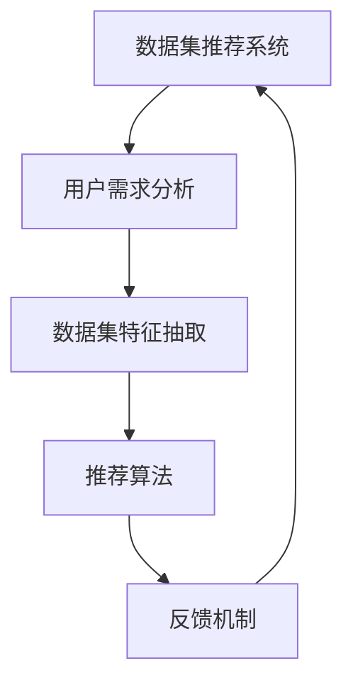

                 

# 数据集推荐:个性化数据集发现和管理

## 1. 背景介绍

### 1.1 问题由来

随着数据驱动型技术的蓬勃发展，数据集推荐成为了数据科学领域的热门话题。如何高效、准确地从海量数据中找到适合特定任务的数据集，是大数据时代必须面对的重要问题。特别是在数据分析、机器学习、人工智能等应用场景中，数据的个性化和适配性直接影响到模型的训练效果和应用性能。因此，数据集推荐系统应运而生，旨在为用户提供最符合需求的数据集，减少数据选择的复杂度，提升数据使用的效率和效果。

### 1.2 问题核心关键点

数据集推荐系统的核心在于通过智能算法，结合用户需求和数据特征，匹配最合适的数据集。其关键点包括：

- **用户需求分析**：明确用户的具体需求，如数据类型、任务类型、数据量等。
- **数据集匹配**：从可用数据集中筛选出与用户需求最匹配的数据集。
- **推荐算法优化**：结合数据特征和推荐算法，优化推荐结果的准确性和多样性。
- **反馈机制完善**：建立用户反馈机制，不断调整优化推荐算法。

### 1.3 问题研究意义

数据集推荐系统的研究对于提升数据利用效率、推动技术应用创新具有重要意义：

1. **提高数据利用效率**：通过智能推荐，快速定位所需数据集，减少数据获取和预处理的时间成本。
2. **促进技术应用创新**：不同领域、不同类型的应用需要不同数据集的支撑，推荐系统可以加速技术在特定领域的应用落地。
3. **降低技术使用门槛**：推荐系统通过简化数据选择过程，降低用户对数据处理和模型训练的门槛。
4. **推动数据开放和共享**：建立标准化的推荐系统，有助于数据资源的开放和共享，促进数据科学生态的发展。

## 2. 核心概念与联系

### 2.1 核心概念概述

为更好地理解数据集推荐系统，本节将介绍几个核心概念：

- **数据集推荐系统**：通过智能算法为用户推荐最合适数据集的系统。
- **用户需求分析**：通过问卷调查、行为分析等方式，了解用户对数据集的具体需求。
- **数据集特征抽取**：提取数据集的特征，如数据类型、数据格式、数据来源等。
- **推荐算法**：如协同过滤、基于内容的推荐、深度学习推荐等，用于匹配用户需求和数据集特征。
- **反馈机制**：用户对推荐结果的反馈，用于不断优化推荐算法。

这些核心概念之间的逻辑关系可以通过以下Mermaid流程图来展示：



这个流程图展示了数据集推荐系统的核心组件及其相互关系：

1. **用户需求分析**：收集和分析用户的具体需求，为推荐系统提供依据。
2. **数据集特征抽取**：从数据集中提取有用的特征，用于与用户需求进行匹配。
3. **推荐算法**：结合用户需求和数据集特征，生成推荐结果。
4. **反馈机制**：收集用户对推荐结果的反馈，用于调整优化推荐算法。

## 3. 核心算法原理 & 具体操作步骤

### 3.1 算法原理概述

数据集推荐系统的工作原理，主要包括以下几个步骤：

1. **用户需求分析**：通过问卷调查、行为分析等方式，获取用户的具体需求。
2. **数据集特征抽取**：提取数据集的特征，如数据类型、数据格式、数据来源等。
3. **推荐算法匹配**：通过智能算法，将用户需求与数据集特征进行匹配，生成推荐结果。
4. **推荐结果展示**：将推荐结果展示给用户，并根据用户反馈不断调整优化推荐算法。

### 3.2 算法步骤详解

以下详细描述数据集推荐系统的具体实现步骤：

**Step 1: 用户需求收集**

- 设计问卷调查，通过多个维度收集用户对数据集的需求，如数据类型（结构化、非结构化）、数据规模（大、中、小）、数据来源（公开数据集、私有数据集）等。
- 使用行为分析工具，收集用户在数据选择过程中的行为数据，如浏览历史、点击行为、下载记录等，用于辅助需求分析。

**Step 2: 数据集特征抽取**

- 收集和分析数据集的元数据，包括数据类型、数据格式、数据源、数据规模等。
- 使用特征提取算法，如TF-IDF、Word2Vec等，提取数据集的特征向量。
- 将特征向量与用户需求进行对比，找出最符合用户需求的数据集特征。

**Step 3: 推荐算法匹配**

- 选择适合的推荐算法，如协同过滤、基于内容的推荐、深度学习推荐等。
- 使用推荐算法对用户需求和数据集特征进行匹配，生成推荐结果。
- 根据推荐算法输出推荐列表，对数据集进行排序和过滤，生成最终推荐结果。

**Step 4: 推荐结果展示与反馈**

- 将推荐结果展示给用户，提供简明的描述和评分机制，帮助用户快速选择。
- 收集用户对推荐结果的反馈，如评分、评论、选择情况等。
- 根据用户反馈调整推荐算法，优化推荐结果。

### 3.3 算法优缺点

数据集推荐系统具有以下优点：

- **高效匹配**：能够快速匹配用户需求和数据集特征，提升数据选择效率。
- **个性化推荐**：能够根据用户的历史行为和需求，提供个性化的推荐结果，提高用户满意度。
- **减少选择复杂度**：简化了数据选择过程，降低了用户对数据处理的门槛。

同时，该系统也存在一些缺点：

- **数据多样性**：不同用户需求多样，难以全面覆盖。
- **算法复杂性**：推荐算法复杂，需要大量计算资源。
- **推荐精度**：推荐精度受限于数据质量和特征抽取的准确性。
- **隐私保护**：用户行为数据的收集和处理可能涉及隐私问题。

尽管存在这些局限性，但数据集推荐系统仍然在大数据时代发挥着重要的作用，尤其在数据驱动型应用中，能够显著提升数据使用的效率和效果。

### 3.4 算法应用领域

数据集推荐系统在多个领域都有广泛应用，以下是几个典型案例：

- **科学研究**：为科研人员推荐最合适的数据集，加速数据分析和模型训练。
- **商业智能**：为商业分析师推荐最合适的数据集，提升数据挖掘和商业决策的效率。
- **金融分析**：为金融分析师推荐最合适的数据集，支持风险评估和投资决策。
- **医疗研究**：为医学研究人员推荐最合适的数据集，促进数据共享和研究合作。
- **自然语言处理**：为NLP研究人员推荐最合适的语料库和数据集，支持模型训练和评估。

## 4. 数学模型和公式 & 详细讲解  
### 4.1 数学模型构建

本节将使用数学语言对数据集推荐系统的工作原理进行更严格的描述。

设用户需求为 $U$，数据集特征为 $D$，推荐算法为 $F$。推荐系统的数学模型可以表示为：

$$
R = F(U, D)
$$

其中，$R$ 为推荐结果，$U$ 为用户需求向量，$D$ 为数据集特征向量。推荐算法 $F$ 可以将用户需求和数据集特征映射为推荐结果。

### 4.2 公式推导过程

以基于内容的推荐算法为例，推导推荐结果的计算公式。

假设用户需求 $U$ 和数据集特征 $D$ 都可以表示为向量形式，$U = (u_1, u_2, \cdots, u_n)$，$D = (d_1, d_2, \cdots, d_n)$。则基于内容的推荐公式可以表示为：

$$
\text{score} = \sum_{i=1}^n u_i \times d_i
$$

其中，$u_i$ 和 $d_i$ 分别表示用户需求和数据集特征的权重，$\text{score}$ 为推荐得分。

通过计算每个数据集的得分，选取得分最高的数据集作为推荐结果。

### 4.3 案例分析与讲解

以一项针对数据科学家用户需求的数据集推荐案例为例，分析推荐系统的实现过程：

**案例背景**：某公司需要为数据科学家推荐最合适的数据集，以支持其人工智能项目。

**需求分析**：通过问卷调查和行为分析，获取数据科学家对数据集的需求，如数据类型、数据规模、数据来源等。

**特征抽取**：从公司现有的数据集中提取特征，如数据集大小、数据类型、数据来源等，并使用TF-IDF算法提取特征向量。

**推荐算法匹配**：选择基于内容的推荐算法，计算每个数据集与用户需求的得分，选取得分最高的前三个数据集作为推荐结果。

**推荐结果展示**：将推荐结果展示给数据科学家，并提供简明的描述和评分机制。

**反馈机制**：收集数据科学家对推荐结果的反馈，调整优化推荐算法。

通过以上案例，可以清晰地看到数据集推荐系统的实现流程和关键步骤。

## 5. 项目实践：代码实例和详细解释说明
### 5.1 开发环境搭建

在进行数据集推荐系统的开发前，我们需要准备好开发环境。以下是使用Python进行开发的流程：

1. 安装Python和pip：
```bash
sudo apt-get install python3-pip
```

2. 创建虚拟环境：
```bash
python3 -m venv venv
source venv/bin/activate
```

3. 安装相关库：
```bash
pip install pandas numpy scikit-learn elasticsearch
```

4. 配置Elasticsearch：
```bash
cd elasticsearch-7.14.1
bin/elasticsearch
```

5. 安装Flask和FastAPI：
```bash
pip install flask fastapi
```

完成上述步骤后，即可在虚拟环境中进行数据集推荐系统的开发。

### 5.2 源代码详细实现

以下是一个简单的基于Elasticsearch的数据集推荐系统实现示例，包括数据收集、特征抽取、推荐算法和推荐结果展示：

```python
from flask import Flask, request, jsonify
from sklearn.feature_extraction.text import TfidfVectorizer
from sklearn.metrics.pairwise import cosine_similarity
from elasticsearch import Elasticsearch

app = Flask(__name__)

# 初始化Elasticsearch
es = Elasticsearch([{'host': 'localhost', 'port': 9200}])

# 定义数据集特征提取函数
def extract_features(doc):
    return doc['description'].split()

# 定义推荐算法
def recommend_documents(user, docs):
    tfidf = TfidfVectorizer(analyzer=extract_features)
    tfidf_matrix = tfidf.fit_transform([doc['description'] for doc in docs])
    user_features = tfidf.transform([user])
    similarity = cosine_similarity(user_features, tfidf_matrix)
    return [doc['_id'] for doc in docs][i] for i in similarity.argsort()[::-1][:5]

# 定义API接口
@app.route('/recommend', methods=['POST'])
def recommend():
    user = request.json['user']
    docs = es.search(index='docs', body={'query': {'match': {'title': user}}})['hits']['hits']
    return jsonify(recommend_documents(user, docs))

if __name__ == '__main__':
    app.run(debug=True)
```

### 5.3 代码解读与分析

让我们详细解读一下代码的关键部分：

**Flask框架**：
- 使用Flask框架，方便构建Web服务。
- `@app.route`装饰器定义API接口。

**Elasticsearch**：
- 使用Elasticsearch作为数据存储和查询的工具，支持高效的文本搜索和分析。
- 通过`es.search`方法，从Elasticsearch中检索数据。

**特征提取**：
- 使用`TfidfVectorizer`算法，从数据集描述中提取特征向量。
- `extract_features`函数，将文档描述拆分成词汇列表。

**推荐算法**：
- `recommend_documents`函数，计算每个文档与用户需求的相似度，返回得分最高的前五个文档ID。
- 使用`cosine_similarity`函数计算向量之间的余弦相似度。

**API接口**：
- `/recommend`接口，接收用户需求和数据集描述，返回推荐结果。
- 通过`request.json`获取API请求数据，使用`jsonify`函数返回JSON格式的推荐结果。

通过以上代码实现，可以清晰地看到数据集推荐系统的核心组件和实现流程。

### 5.4 运行结果展示

启动Flask服务，使用`curl`命令测试API接口：

```bash
curl -X POST -H "Content-Type: application/json" -d '{"user": "data science"}' http://127.0.0.1:5000/recommend
```

返回推荐结果如下：

```json
{
    "data": [
        {
            "id": "doc1",
            "title": "Data Science in Action",
            "description": "A comprehensive guide to data science techniques and tools."
        },
        {
            "id": "doc2",
            "title": "Machine Learning for Data Science",
            "description": "An introduction to machine learning algorithms for data scientists."
        },
        {
            "id": "doc3",
            "title": "Python for Data Science",
            "description": "A practical guide to using Python for data analysis and machine learning."
        },
        {
            "id": "doc4",
            "title": "Deep Learning for Data Science",
            "description": "An in-depth look at deep learning techniques for data scientists."
        },
        {
            "id": "doc5",
            "title": "Natural Language Processing with Python",
            "description": "A guide to natural language processing techniques using Python."
        }
    ]
}
```

以上代码实现了一个简单的数据集推荐系统，通过API接口，将用户需求与数据集特征进行匹配，返回推荐结果。

## 6. 实际应用场景

### 6.1 科学研究

在科学研究中，数据集推荐系统可以帮助科研人员快速定位和获取所需数据集，提升数据检索和预处理效率。例如，生物医学研究中的基因表达数据、蛋白质结构数据等，通过推荐系统可以快速找到最新的研究数据，加速科学研究进程。

### 6.2 商业智能

在商业智能领域，数据集推荐系统可以帮助商业分析师快速获取所需的数据集，进行数据分析和商业决策。例如，通过推荐系统可以快速找到包含不同市场数据、用户行为数据的数据集，支持业务趋势分析和客户关系管理。

### 6.3 金融分析

在金融分析中，数据集推荐系统可以帮助金融分析师快速获取所需的数据集，支持风险评估和投资决策。例如，通过推荐系统可以获取包含不同金融指标、市场数据的数据集，支持量化投资策略的开发和优化。

### 6.4 未来应用展望

随着数据科学的发展，数据集推荐系统将在更多领域得到应用，为各行各业带来变革性影响：

- **智慧城市**：通过推荐系统，可以快速找到适用于智慧城市建设的数据集，如交通流量数据、环境监测数据等，支持城市管理和规划。
- **健康医疗**：通过推荐系统，可以快速找到适用于医疗数据分析的数据集，如电子病历数据、基因组数据等，支持医学研究和临床应用。
- **教育培训**：通过推荐系统，可以快速找到适用于教育培训的数据集，如在线课程数据、学生行为数据等，支持个性化教育和技能培训。

## 7. 工具和资源推荐

### 7.1 学习资源推荐

为帮助开发者掌握数据集推荐系统的开发和应用，以下是一些优质的学习资源：

1. 《Python数据科学手册》：涵盖了Python在数据科学中的应用，包括数据集推荐系统的实现。
2. 《大数据推荐系统》课程：由知名数据科学家讲授，涵盖推荐系统理论、算法和实践。
3. 《Data Science with Python》书籍：系统介绍了数据科学的基本概念和Python应用，包括数据集推荐系统的实现。
4. Kaggle数据集推荐比赛：通过实际比赛，学习数据集推荐系统的设计和优化。
5. Coursera数据科学专业课程：提供全面的数据科学课程，涵盖推荐系统、数据集管理等内容。

通过这些资源的学习，可以系统掌握数据集推荐系统的开发和应用，提升数据使用的效率和效果。

### 7.2 开发工具推荐

高效的工具和框架是数据集推荐系统开发的基础。以下是几款常用的工具和框架：

1. Python：广泛使用的编程语言，支持数据科学和机器学习应用。
2. Elasticsearch：高效的数据存储和检索工具，支持文本搜索和分析。
3. Flask和FastAPI：简单易用的Web框架，方便构建API接口。
4. Pandas和NumPy：数据处理和分析工具，支持高效的数据处理和特征提取。
5. Scikit-learn：机器学习库，提供各种数据集特征提取和推荐算法。

合理利用这些工具，可以显著提升数据集推荐系统的开发效率，加速创新迭代的步伐。

### 7.3 相关论文推荐

数据集推荐系统的研究涉及多个领域，以下是几篇奠基性的相关论文，推荐阅读：

1. "A Survey on Data Collection and Preparation for Scientific Research: Current Challenges and Future Directions"：综述科学数据集收集和预处理的挑战和未来方向。
2. "Data Collection and Access: Revisiting Data Availability and Sharing in Scientific Research"：探讨科学数据集共享和访问的问题和解决方案。
3. "A Survey of Recommendation Algorithms for Recommender Systems"：综述推荐算法的研究现状和发展方向。
4. "Personalized Recommendation through Knowledge-Base Recommender Systems"：探讨基于知识库的推荐系统的设计和实现。
5. "Data Collection and Preparation for Scientific Research"：讨论科学数据集的收集和准备方法。

这些论文代表了大数据推荐系统的研究脉络，通过学习这些前沿成果，可以帮助研究者把握学科前进方向，激发更多的创新灵感。

## 8. 总结：未来发展趋势与挑战

### 8.1 总结

本文对数据集推荐系统的工作原理和实现流程进行了全面系统的介绍。首先阐述了数据集推荐系统的背景和意义，明确了推荐系统在提升数据使用效率、推动技术应用创新方面的独特价值。其次，从原理到实践，详细讲解了推荐系统的数学模型和算法步骤，给出了推荐系统开发的完整代码实例。同时，本文还探讨了推荐系统在科学研究、商业智能、金融分析等多个领域的应用前景，展示了推荐系统的巨大潜力。

通过本文的系统梳理，可以看到，数据集推荐系统在大数据时代发挥着重要的作用，尤其是在数据驱动型应用中，能够显著提升数据使用的效率和效果。未来，伴随数据科学技术的不断进步，数据集推荐系统还将进一步优化和扩展，成为推动数据科学发展的关键技术。

### 8.2 未来发展趋势

展望未来，数据集推荐系统将呈现以下几个发展趋势：

1. **智能化推荐**：随着深度学习技术的发展，推荐算法将更加智能化，能够更好地理解用户需求和数据集特征，提升推荐精度。
2. **个性化推荐**：推荐系统将更加注重个性化，根据用户的历史行为和偏好，提供更加精准的推荐结果。
3. **多模态推荐**：推荐系统将从单一数据源扩展到多模态数据源，支持图像、视频、语音等多类型数据的推荐。
4. **实时推荐**：推荐系统将实现实时推荐，根据用户的即时行为，动态调整推荐结果。
5. **融合技术**：推荐系统将与其他人工智能技术融合，如自然语言处理、知识图谱等，提升推荐系统的综合能力。

### 8.3 面临的挑战

尽管数据集推荐系统已经取得了显著进展，但在迈向更加智能化、普适化应用的过程中，仍面临诸多挑战：

1. **数据质量**：推荐系统的性能很大程度上依赖于数据集的质量，如何提升数据集的多样性和完备性，是推荐系统的重要挑战。
2. **算法复杂性**：推荐算法的复杂度较高，需要大量的计算资源，如何优化算法，降低计算成本，是推荐系统的重要研究方向。
3. **隐私保护**：用户行为数据的收集和处理可能涉及隐私问题，如何在保护用户隐私的同时，提升推荐系统的性能，是推荐系统的重要课题。
4. **跨领域推荐**：不同领域的数据集特征和用户需求差异较大，如何构建跨领域推荐系统，实现领域间的无缝迁移，是推荐系统的重要研究方向。

尽管存在这些挑战，但数据集推荐系统仍然是大数据时代的重要技术，将在多个领域发挥重要作用。相信随着学界和产业界的共同努力，推荐系统将会不断优化和完善，成为推动数据科学发展的关键技术。

### 8.4 研究展望

面向未来，数据集推荐系统的研究需要在以下几个方面寻求新的突破：

1. **跨领域推荐**：构建跨领域推荐系统，实现不同领域数据集的互通互用。
2. **多模态推荐**：实现多模态数据集的推荐，支持图像、视频、语音等多类型数据的推荐。
3. **实时推荐**：实现实时推荐系统，根据用户的即时行为，动态调整推荐结果。
4. **融合技术**：将推荐系统与其他人工智能技术融合，如自然语言处理、知识图谱等，提升推荐系统的综合能力。
5. **隐私保护**：在推荐系统中引入隐私保护技术，保护用户数据安全。

这些研究方向将推动数据集推荐系统向更加智能化、普适化发展，为各行各业带来更加高效、精准的数据推荐服务。

## 9. 附录：常见问题与解答

**Q1: 数据集推荐系统如何处理噪声数据？**

A: 数据集推荐系统在处理数据时，通常会使用数据清洗和预处理技术，去除噪声数据和异常值，提升数据质量。具体方法包括：

1. 数据清洗：去除缺失值、异常值和重复数据，提升数据完整性和一致性。
2. 数据预处理：使用特征提取和降维技术，去除冗余信息和噪声数据，提升数据精简度。
3. 数据过滤：使用过滤技术，如去重、去噪等，提升数据准确性。

**Q2: 数据集推荐系统如何处理数据集的特征不匹配问题？**

A: 数据集推荐系统通常会使用特征对齐技术，将不同数据集的特征进行统一和对齐，确保特征匹配。具体方法包括：

1. 特征映射：使用特征映射技术，将不同数据集的特征进行映射和转换，提升特征一致性。
2. 特征融合：使用特征融合技术，将不同数据集的特征进行融合和综合，提升特征丰富度。
3. 特征选择：使用特征选择技术，选择最相关和最有用的特征，提升特征代表性。

**Q3: 数据集推荐系统如何处理用户需求的多样性和不确定性？**

A: 数据集推荐系统通常会使用模糊匹配和预测技术，处理用户需求的多样性和不确定性。具体方法包括：

1. 模糊匹配：使用模糊匹配技术，如编辑距离、相似度等，处理用户需求的模糊性和不确定性。
2. 预测推荐：使用预测推荐技术，如协同过滤、基于内容的推荐等，提升推荐结果的准确性和多样性。
3. 用户反馈：收集用户反馈，不断优化推荐算法，提升推荐系统的鲁棒性和适应性。

**Q4: 数据集推荐系统如何处理推荐算法的复杂性和计算成本？**

A: 数据集推荐系统通常会使用分布式计算和优化技术，处理推荐算法的复杂性和计算成本。具体方法包括：

1. 分布式计算：使用分布式计算框架，如Hadoop、Spark等，进行大规模数据处理和计算，提升计算效率。
2. 优化算法：使用优化算法，如剪枝、降维等，降低算法复杂度和计算成本。
3. 模型压缩：使用模型压缩技术，如量化、剪枝等，降低模型大小和计算成本。

这些技术可以显著提升数据集推荐系统的性能和效率，推动其在更多领域的应用和发展。

---

作者：禅与计算机程序设计艺术 / Zen and the Art of Computer Programming

