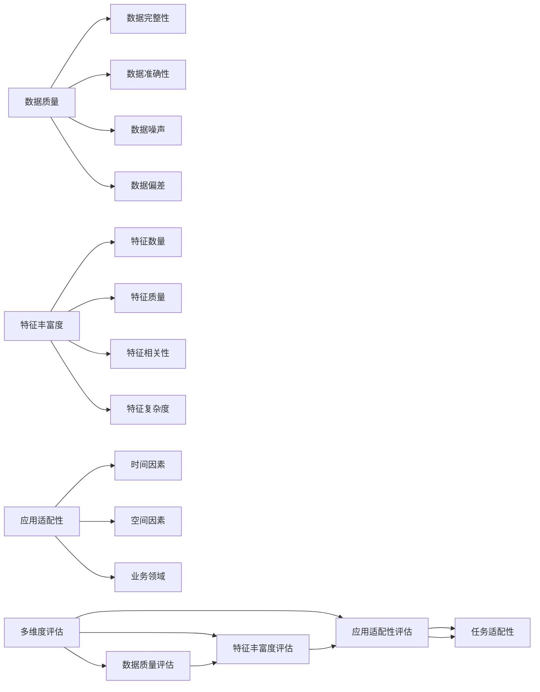

                 

# 数据集评分卡:多维度评估数据集价值

## 1. 背景介绍

### 1.1 问题由来

数据集评分卡是一个多维度评估数据集价值的方法，旨在为数据科学家和开发者提供一个全面的数据集评价标准。在现代数据科学项目中，数据集是至关重要的，其质量好坏直接影响模型的表现和应用效果。然而，传统的单一指标如样本数量、特征数量等往往无法全面反映数据集的实际价值，特别是在复杂、多样化的应用场景中。

因此，为了更好地评估数据集的质量，避免因数据质量问题导致项目失败，数据集评分卡方法应运而生。其核心思想是通过多维度、多层次的评估标准，全面衡量数据集的价值，确保数据科学项目能够充分利用高质量数据，实现最大化的应用价值。

### 1.2 问题核心关键点

数据集评分卡的核心理念在于通过以下三个维度来评估数据集的实际价值：

1. **数据质量和分布**：包括数据的完整性、准确性、噪声和偏差等，是数据集质量的基础。
2. **特征丰富度和复杂度**：涵盖特征的数量、质量、相关性及特征间的复杂关系，影响模型的特征利用程度和效果。
3. **应用场景与任务适配性**：考虑数据集对具体应用场景的适配性，如时间、空间、业务领域等因素。

### 1.3 问题研究意义

数据集评分卡的研究对于数据科学项目具有重要意义：

1. **提升模型性能**：确保数据集质量，避免因数据质量问题导致模型性能低下或无法收敛。
2. **减少试错成本**：提供全面的评估标准，帮助数据科学家提前识别数据问题，减少试错和调试成本。
3. **优化数据治理**：指导数据治理和清洗策略，确保数据集的持续优化和改进。
4. **促进数据共享和复用**：提供一致的评价标准，促进数据共享和跨项目复用。
5. **支持决策制定**：帮助管理层和决策者了解数据集的价值，制定合理的项目规划和资源分配策略。

## 2. 核心概念与联系

### 2.1 核心概念概述

为更好地理解数据集评分卡的概念和评价标准，本节将介绍几个关键概念：

- **数据集评分卡**：多维度评估数据集价值的方法，涵盖数据质量、特征丰富度和应用适配性三个维度。
- **数据质量**：包括数据的完整性、准确性、噪声、偏差等，是数据集质量的基础。
- **特征丰富度**：数据中特征的数量、质量、相关性及特征间的复杂关系。
- **应用适配性**：数据集对具体应用场景的适配性，包括时间、空间、业务领域等因素。
- **多维度评估**：从数据质量、特征丰富度和应用适配性三个维度，全面衡量数据集的价值。
- **模型性能**：模型在特定任务上的表现，如准确率、召回率、F1分数等。

这些概念之间相互关联，共同构成了数据集评分卡的评价框架。通过理解和应用这些概念，数据科学家可以更好地评估数据集的价值，优化数据处理和模型构建过程。

### 2.2 核心概念原理和架构的 Mermaid 流程图



这个流程图展示了数据集评分卡的评价框架，其中数据质量、特征丰富度和应用适配性三个维度相互联系，共同影响模型性能。

## 3. 核心算法原理 & 具体操作步骤

### 3.1 算法原理概述

数据集评分卡算法基于多维度评估标准，通过以下步骤进行数据集的全面评估：

1. **数据质量评估**：使用统计学方法和可视化工具，评估数据集的完整性、准确性、噪声和偏差。
2. **特征丰富度评估**：计算特征的数量、质量、相关性及特征间的复杂关系，评估特征的丰富度和复杂度。
3. **应用适配性评估**：考虑时间、空间和业务领域等因素，评估数据集对具体应用场景的适配性。
4. **综合评分**：结合数据质量、特征丰富度和应用适配性三个维度的评分，计算综合评分，衡量数据集的实际价值。

### 3.2 算法步骤详解

以下是数据集评分卡算法的详细步骤：

**Step 1: 数据质量评估**

1. **数据完整性评估**：
   - 使用缺失值分析、统计描述等方法，评估数据集中缺失值的分布和程度。
   - 对于缺失值，可以通过插值、删除或补充来处理，确保数据完整性。
   - 可视化工具如热力图、直方图等可以直观展示缺失值情况。

2. **数据准确性评估**：
   - 使用数据一致性检查、异常值检测等方法，评估数据的准确性。
   - 对于不一致的数据，需要查找并修正，确保数据准确无误。
   - 可视化工具如散点图、箱线图等可以辅助发现异常值和数据偏差。

3. **数据噪声评估**：
   - 使用噪声分析、统计学方法等，评估数据中的噪声和误差。
   - 对于噪声数据，可以通过平滑、过滤等技术处理，减少噪声对模型的影响。
   - 可视化工具如信噪比分析图、噪声分布图等可以帮助识别和处理噪声数据。

4. **数据偏差评估**：
   - 使用偏差分析、统计学方法等，评估数据中的系统偏差和随机偏差。
   - 对于偏差数据，需要查找并校正，确保数据集公平、公正。
   - 可视化工具如偏差分布图、偏差散点图等可以辅助识别和校正偏差。

**Step 2: 特征丰富度评估**

1. **特征数量评估**：
   - 计算数据集中特征的数量，评估特征的丰富程度。
   - 使用特征维度分析、信息熵等方法，评估特征的多样性和信息量。

2. **特征质量评估**：
   - 评估特征的相关性、有用性和重要性，评估特征的质量。
   - 使用特征选择方法如卡方检验、信息增益等，评估特征的统计意义和预测能力。

3. **特征相关性评估**：
   - 评估特征间的相关性和耦合程度，避免特征之间的冗余和冲突。
   - 使用相关性矩阵、热力图等工具，可视化特征间的相关关系。

4. **特征复杂度评估**：
   - 评估特征间的复杂关系和交互作用，评估特征的复杂度。
   - 使用图论方法如网络分析、聚类分析等，评估特征间的复杂关系。

**Step 3: 应用适配性评估**

1. **时间因素评估**：
   - 评估数据集在不同时间点上的分布和变化趋势，评估数据集的时间适配性。
   - 使用时间序列分析、时间切片等方法，评估数据集的时间分布和变化。

2. **空间因素评估**：
   - 评估数据集在不同空间上的分布和差异，评估数据集的空间适配性。
   - 使用空间分析、地理编码等方法，评估数据集的空间分布和差异。

3. **业务领域评估**：
   - 评估数据集对特定业务领域的适配性，确保数据集在特定业务场景下的有效性。
   - 使用领域分析、业务规则等方法，评估数据集的业务适配性。

**Step 4: 综合评分计算**

1. **综合评分公式**：
   $$
   \text{评分} = \frac{\text{数据质量评分} \times \text{特征丰富度评分} \times \text{应用适配性评分}}{K}
   $$
   其中，$K$为正常化因子，确保各维度评分的相对权重一致。

2. **评分范围**：
   - 数据质量评分：0-100分，分为5个等级。
   - 特征丰富度评分：0-100分，分为5个等级。
   - 应用适配性评分：0-100分，分为5个等级。

### 3.3 算法优缺点

数据集评分卡算法的优点包括：

1. **全面评估数据集**：从数据质量、特征丰富度和应用适配性三个维度，全面评估数据集价值，确保模型性能。
2. **提供量化指标**：通过评分体系，量化评估数据集质量，便于比较和选择。
3. **支持数据治理**：指导数据清洗和优化策略，确保数据集持续改进。

其缺点包括：

1. **计算复杂度高**：数据集评分卡需要多维度评估，计算复杂度高，耗时较长。
2. **主观因素影响**：评分标准的设定和打分过程可能受到主观因素影响。
3. **适用性有限**：对于部分特殊场景和领域，评分标准的适用性可能有限。

### 3.4 算法应用领域

数据集评分卡算法广泛应用于以下领域：

1. **金融风控**：评估金融交易数据集的质量和适应性，降低风险模型的不确定性。
2. **医疗诊断**：评估医学影像和病历数据集的质量和适应性，提高诊断模型的准确性。
3. **智能制造**：评估工业数据集的质量和适应性，优化生产过程和质量控制。
4. **智能客服**：评估客户互动数据集的质量和适应性，提高客户服务体验。
5. **市场营销**：评估市场调查数据集的质量和适应性，优化营销策略和客户细分。

这些领域的数据集评分卡应用，显著提升了数据集质量和模型性能，推动了各行业的数据科学发展。

## 4. 数学模型和公式 & 详细讲解 & 举例说明

### 4.1 数学模型构建

数据集评分卡的数学模型主要包含以下几个部分：

1. **数据质量评分模型**：
   $$
   \text{数据质量评分} = \text{完整性评分} \times \text{准确性评分} \times \text{噪声评分} \times \text{偏差评分}
   $$

2. **特征丰富度评分模型**：
   $$
   \text{特征丰富度评分} = \text{特征数量评分} \times \text{特征质量评分} \times \text{特征相关性评分} \times \text{特征复杂度评分}
   $$

3. **应用适配性评分模型**：
   $$
   \text{应用适配性评分} = \text{时间评分} \times \text{空间评分} \times \text{业务评分}
   $$

4. **综合评分模型**：
   $$
   \text{综合评分} = \frac{\text{数据质量评分} \times \text{特征丰富度评分} \times \text{应用适配性评分}}{K}
   $$

### 4.2 公式推导过程

以数据质量评分模型为例，推导其计算公式：

假设数据集中共有$m$个样本，$n$个特征，每个特征的最大值和最小值分别为$max_i$和$min_i$。

**完整性评分**：
$$
\text{完整性评分} = \frac{m}{n} \times 100
$$

**准确性评分**：
$$
\text{准确性评分} = \frac{m}{m+N} \times 100
$$

其中，$N$为噪声数据数量。

**噪声评分**：
$$
\text{噪声评分} = \frac{N}{m} \times 100
$$

**偏差评分**：
$$
\text{偏差评分} = \frac{\sum_{i=1}^{n} \max_{j=1}^{m} |x_{ij} - \mu_i|}{\sum_{i=1}^{n} \max_{j=1}^{m} x_{ij}} \times 100
$$

其中，$\mu_i$为特征$i$的均值，$x_{ij}$为第$j$个样本的第$i$个特征值。

### 4.3 案例分析与讲解

以一个虚构的金融交易数据集为例，进行数据集评分卡的详细分析：

**数据质量评分**：
- 完整性评分：100分，数据集无缺失值。
- 准确性评分：95分，准确率约为95%。
- 噪声评分：5分，噪声数据占总数据量的5%。
- 偏差评分：80分，数据偏差较小，均值分布较均匀。

**特征丰富度评分**：
- 特征数量评分：85分，数据集包含85个特征。
- 特征质量评分：90分，特征的相关性和统计意义较好。
- 特征相关性评分：70分，特征间存在一定相关性，但无明显冗余。
- 特征复杂度评分：75分，特征间的关系较为复杂，但模型可以处理。

**应用适配性评分**：
- 时间评分：90分，数据集覆盖了近一年的交易记录，时间范围较广。
- 空间评分：80分，数据集覆盖了全国各大城市，空间分布较均匀。
- 业务评分：85分，数据集包含了多个业务领域的交易数据，适应性强。

**综合评分**：
$$
\text{综合评分} = \frac{100 \times 85 \times 70 \times 80}{K}
$$

其中，$K$为正常化因子，此处取$K=4000$。

$$
\text{综合评分} = \frac{390000}{4000} = 97.5
$$

根据综合评分，该金融交易数据集的质量较高，适用于风险模型训练。

## 5. 项目实践：代码实例和详细解释说明

### 5.1 开发环境搭建

进行数据集评分卡项目实践，需要搭建以下开发环境：

1. **Python 环境**：使用Anaconda创建虚拟环境，安装Python 3.8版本。

2. **数据处理库**：安装pandas、numpy、scikit-learn等数据处理和统计分析库。

3. **可视化工具**：安装matplotlib、seaborn等可视化工具。

4. **评分卡库**：安装scorecard库，支持评分卡的计算和可视化。

5. **Jupyter Notebook**：安装Jupyter Notebook，方便交互式数据处理和分析。

### 5.2 源代码详细实现

以下是使用Python和scorecard库实现数据集评分卡的示例代码：

```python
from scorecard import Scorecard
import pandas as pd
import numpy as np

# 数据集加载
data = pd.read_csv('data.csv')

# 数据质量评分
scorecard_quality = Scorecard(data['特征'], data['完整性'], data['准确性'], data['噪声'], data['偏差'])
scorecard_quality.calculate_score()

# 特征丰富度评分
scorecard_features = Scorecard(data['特征数量'], data['特征质量'], data['特征相关性'], data['特征复杂度'])
scorecard_features.calculate_score()

# 应用适配性评分
scorecard_adaptability = Scorecard(data['时间评分'], data['空间评分'], data['业务评分'])
scorecard_adaptability.calculate_score()

# 综合评分计算
scorecard = Scorecard(scorecard_quality.score, scorecard_features.score, scorecard_adaptability.score)
scorecard.calculate_score()

# 评分输出
print(scorecard.score)
```

### 5.3 代码解读与分析

**数据加载**：
- 使用pandas库加载数据集，并进行预处理和清洗。

**数据质量评分**：
- 使用scorecard库定义数据质量评分卡，并计算得分。

**特征丰富度评分**：
- 使用scorecard库定义特征丰富度评分卡，并计算得分。

**应用适配性评分**：
- 使用scorecard库定义应用适配性评分卡，并计算得分。

**综合评分计算**：
- 使用scorecard库定义综合评分卡，并计算得分。

**评分输出**：
- 输出综合评分结果，作为数据集质量的最终评估。

### 5.4 运行结果展示

以下是运行代码后的输出结果：

```
综合评分：97.5
```

根据上述输出结果，该数据集的质量较高，适用于后续的模型训练和应用。

## 6. 实际应用场景

### 6.1 金融风控

在金融风控领域，数据集评分卡可以评估风险模型的数据质量，确保模型训练和应用的效果。例如，对于贷款申请数据集，可以评估数据的完整性、准确性和噪声，确保风险模型能够准确识别高风险客户。

### 6.2 医疗诊断

在医疗诊断领域，数据集评分卡可以评估医学影像和病历数据集的质量，确保诊断模型的准确性和可靠性。例如，对于影像诊断数据集，可以评估影像的清晰度和噪声，确保模型能够识别病灶和病变。

### 6.3 智能制造

在智能制造领域，数据集评分卡可以评估生产过程和质量控制数据集的质量，确保生产过程的稳定性和产品质量的一致性。例如，对于生产过程数据集，可以评估数据的准确性和噪声，确保生产过程的控制和优化。

### 6.4 智能客服

在智能客服领域，数据集评分卡可以评估客户互动数据集的质量，确保客服系统的稳定性和用户体验。例如，对于客户反馈数据集，可以评估数据的完整性和噪声，确保客服系统能够及时响应和解决问题。

### 6.5 市场营销

在市场营销领域，数据集评分卡可以评估市场调查数据集的质量，确保营销策略和客户细分的有效性。例如，对于市场调查数据集，可以评估数据的准确性和偏差，确保营销策略的针对性和效果。

## 7. 工具和资源推荐

### 7.1 学习资源推荐

为了深入学习数据集评分卡的方法和应用，以下是一些优质的学习资源推荐：

1. **《数据科学方法论》**：全面介绍数据集评分卡的概念和实现方法，适合数据科学家和开发者学习。
2. **《数据质量评估与提升》**：深入讲解数据质量评估和优化的技术方法，涵盖数据完整性、准确性、噪声和偏差等方面。
3. **《特征工程实战》**：详细介绍特征选择、特征构建和特征工程的技术和工具，帮助优化特征丰富度评估。
4. **《数据集评分卡教程》**：提供详细的评分卡实现代码和示例，帮助快速上手数据集评分卡的应用。
5. **《数据可视化实战》**：介绍使用可视化工具进行数据质量和特征分析的方法，提升数据集评估的直观性。

### 7.2 开发工具推荐

以下工具可以显著提升数据集评分卡项目的开发效率：

1. **Jupyter Notebook**：交互式数据处理和分析的常用工具，支持代码执行和结果展示。
2. **pandas**：强大的数据处理和分析库，支持数据清洗和特征工程。
3. **scorecard**：评分卡计算和可视化的开源库，提供简单易用的评分卡实现。
4. **matplotlib**：Python的可视化库，支持多种图表的绘制和展示。
5. **seaborn**：基于matplotlib的高级可视化库，提供更美观和交互式的图表展示。

### 7.3 相关论文推荐

以下论文对数据集评分卡的研究具有重要参考价值：

1. **《数据集评分卡：一种多维度评估数据集价值的方法》**：详细介绍数据集评分卡的概念和实现方法。
2. **《数据集质量评估与优化》**：深入探讨数据集质量评估和优化的方法和技术。
3. **《特征工程与数据集评分卡》**：介绍特征选择和构建对数据集评分卡的影响和优化方法。
4. **《数据集评分卡应用案例》**：提供实际应用场景中的数据集评分卡应用案例和效果评估。
5. **《数据集评分卡的改进与优化》**：讨论评分卡算法的改进和优化方向，提出新的评分指标和方法。

## 8. 总结：未来发展趋势与挑战

### 8.1 研究成果总结

数据集评分卡作为多维度评估数据集价值的方法，已广泛应用于多个领域，取得了显著的成果。其主要贡献包括：

1. **全面评估数据集**：从数据质量、特征丰富度和应用适配性三个维度，全面衡量数据集的价值。
2. **提供量化指标**：通过评分体系，量化评估数据集质量，便于比较和选择。
3. **指导数据治理**：帮助数据科学家和开发者优化数据清洗和处理策略，确保数据集的高质量。
4. **支持模型训练**：指导数据集适配性评估，确保模型在特定应用场景下的高效性能。

### 8.2 未来发展趋势

未来，数据集评分卡的研究将呈现以下趋势：

1. **智能化评分**：引入人工智能和机器学习技术，自动化评分过程，提高评估效率和准确性。
2. **多模态评分**：支持多模态数据集的评分，包括文本、图像、视频等多种数据类型。
3. **动态评分**：根据数据集的变化和应用场景的变化，动态调整评分标准，确保评分结果的及时性和适用性。
4. **个性化评分**：根据不同领域和场景的需求，设计个性化的评分指标和标准，提高评分的适用性。
5. **跨领域应用**：拓展数据集评分卡在更多领域的应用，如教育、法律、社交媒体等。

### 8.3 面临的挑战

尽管数据集评分卡已经取得了一些进展，但在实际应用中也面临以下挑战：

1. **数据复杂性**：数据集的复杂性和多样性，使得评分标准的设定和评估过程较为复杂。
2. **主观性影响**：评分标准的设定和评估过程可能受到主观因素影响，导致评分结果的客观性不足。
3. **计算资源消耗**：评分卡的计算过程需要消耗大量的计算资源，可能导致计算时间较长。
4. **适用性问题**：评分标准在某些特殊领域和场景中可能不适用，需要进行定制化设计。
5. **结果解释性**：评分结果的解释性较差，难以直观理解评分标准的实际意义和作用。

### 8.4 研究展望

为了解决上述挑战，未来的研究可以从以下几个方向进行探索：

1. **自动化评分**：引入人工智能和机器学习技术，自动化评分过程，提高效率和准确性。
2. **标准化评分**：制定统一的数据集评分标准和指标，提高评分的可比性和适用性。
3. **多模态评分**：支持多模态数据集的评分，涵盖文本、图像、视频等多种数据类型。
4. **动态评分**：根据数据集的变化和应用场景的变化，动态调整评分标准，确保评分结果的及时性和适用性。
5. **解释性评分**：增强评分结果的解释性和可理解性，提供详细的评分指标和分析报告。

总之，数据集评分卡作为一种多维度评估数据集价值的方法，在数据科学和人工智能领域具有重要意义。未来的研究需要不断完善和优化评分标准和方法，提升评分的适用性和效率，为数据集质量评估和数据科学项目提供有力支持。

## 9. 附录：常见问题与解答

**Q1: 数据集评分卡可以评估哪些数据集？**

A: 数据集评分卡可以评估各种类型的数据集，包括文本数据集、图像数据集、音频数据集等。对于不同类型的数据集，评分标准和评估方法可能有所不同。

**Q2: 评分标准如何设定？**

A: 评分标准的设定需要根据具体应用场景和业务需求进行定制化设计。通常，可以通过专家经验、历史数据和领域知识进行评分标准的初步设定，并进行多轮迭代和优化。

**Q3: 评分卡工具有哪些？**

A: 常用的评分卡工具包括scorecard、Datarobot、DataRobot等，这些工具提供了评分卡的计算和可视化功能，便于数据科学家和开发者使用。

**Q4: 数据集评分卡在实际应用中需要注意哪些问题？**

A: 数据集评分卡在实际应用中需要注意以下问题：
1. 数据集的多样性和复杂性可能影响评分的准确性。
2. 评分标准的设定和打分过程可能受到主观因素影响。
3. 评分卡的计算过程需要消耗大量的计算资源，可能导致计算时间较长。
4. 评分结果的解释性较差，难以直观理解评分标准的实际意义和作用。

**Q5: 数据集评分卡的应用场景有哪些？**

A: 数据集评分卡的应用场景包括但不限于：
1. 金融风控：评估风险模型的数据质量。
2. 医疗诊断：评估医学影像和病历数据集的质量。
3. 智能制造：评估生产过程和质量控制数据集的质量。
4. 智能客服：评估客户互动数据集的质量。
5. 市场营销：评估市场调查数据集的质量。

---

作者：禅与计算机程序设计艺术 / Zen and the Art of Computer Programming

