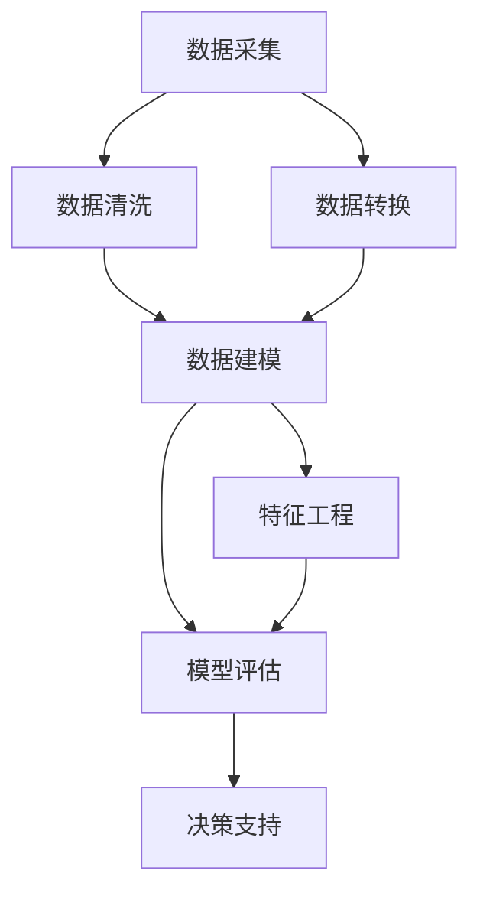

                 

# 数据驱动决策的技术优化

## 1. 背景介绍

### 1.1 问题由来
在当今快速变化的商业环境中，企业面临的挑战愈发复杂多样，诸如市场竞争、客户需求变化、供应链风险等，均需要通过科学合理的决策来应对。传统依靠经验和直觉的决策方式已难以满足现代企业的需求，数据驱动决策成为企业追求科学管理的重要方向。数据驱动决策即通过采集、分析和应用大数据，从数据中提取知识，辅助或自动化企业决策过程。

然而，在实际操作中，数据驱动决策面临诸多挑战。从数据采集、存储、处理到分析应用，每个环节都需精心设计和优化，才能确保决策的精准和效率。特别是数据质量、数据安全、隐私保护等问题的存在，进一步加大了数据驱动决策的难度。本文旨在介绍数据驱动决策的关键技术，并通过实例，展示如何优化数据驱动决策的各个环节，从而帮助企业更好地应对市场挑战。

### 1.2 问题核心关键点
数据驱动决策的核心在于数据获取、数据处理和决策分析。数据获取涉及数据采集和预处理，数据处理包括数据清洗、转换、建模，决策分析则是将处理后的数据应用到实际的决策场景中。

- **数据采集**：企业从不同渠道获取数据，如传感器、用户行为、市场调研等。数据质量直接影响到后续分析的准确性。
- **数据处理**：涉及数据清洗、标准化、归一化等操作，使数据更适合用于分析。
- **数据建模**：选择合适的模型，如回归、分类、聚类等，对数据进行建模和预测。
- **决策分析**：利用数据模型输出预测结果，辅助或自动化决策过程。

数据驱动决策的精髓在于通过数据科学的方法论，将复杂的企业决策问题分解为可操作的数据任务，通过数据驱动的方式提升决策的科学性和准确性。

## 2. 核心概念与联系

### 2.1 核心概念概述

数据驱动决策的关键概念包括：

- **数据采集 (Data Collection)**：从不同来源收集数据，保证数据的全面性和及时性。
- **数据清洗 (Data Cleaning)**：处理缺失值、异常值等噪声，提高数据质量。
- **数据转换 (Data Transformation)**：对原始数据进行标准化、归一化等操作，便于建模。
- **数据建模 (Data Modeling)**：选择合适的算法模型，对数据进行拟合和预测。
- **特征工程 (Feature Engineering)**：根据业务需求，对数据特征进行加工和提取。
- **模型评估 (Model Evaluation)**：通过各种评估指标，如准确率、召回率、F1-score等，对模型效果进行评估。
- **决策支持系统 (Decision Support System, DSS)**：将数据建模和分析结果，转化为实际的决策建议。

这些概念之间的逻辑关系可以通过以下Mermaid流程图来展示：



这个流程图展示了数据驱动决策的核心流程：

1. 数据采集是决策的起点，保证数据的全面性和及时性。
2. 数据清洗、转换、建模、评估等步骤，通过科学的方法和技术，提高数据质量，构建准确的预测模型。
3. 特征工程和决策支持系统，将数据和模型转化为可操作的决策建议，辅助决策过程。

## 3. 核心算法原理 & 具体操作步骤

### 3.1 算法原理概述

数据驱动决策的核心在于利用数据科学的方法，通过建模和分析，辅助或自动化决策过程。其中，数据建模是决策过程中最关键的一环，常用的数据建模方法包括：

- **回归分析 (Regression Analysis)**：通过分析自变量与因变量之间的关系，建立预测模型。
- **分类分析 (Classification Analysis)**：将数据分为不同的类别，用于识别和预测。
- **聚类分析 (Cluster Analysis)**：将数据分成若干个自然簇，用于分群和发现模式。
- **时间序列分析 (Time Series Analysis)**：对时间序列数据进行分析，预测未来趋势。

决策分析则包括：

- **决策树 (Decision Tree)**：通过构建树状结构，对数据进行分类和预测。
- **随机森林 (Random Forest)**：结合多棵决策树，提高预测准确性。
- **支持向量机 (Support Vector Machine, SVM)**：通过寻找最优分割超平面，进行分类和回归分析。
- **神经网络 (Neural Network)**：通过多层神经元，进行复杂数据的建模和预测。

### 3.2 算法步骤详解

数据驱动决策的主要步骤如下：

1. **数据采集**：选择合适的数据源，设计数据采集方案，确保数据的质量和时效性。
2. **数据清洗**：处理缺失值、异常值等噪声，提升数据质量。
3. **数据转换**：对数据进行标准化、归一化等操作，便于建模。
4. **特征提取**：根据业务需求，选择或设计合适的特征，提取有用的信息。
5. **数据建模**：选择合适的算法模型，对数据进行拟合和预测。
6. **模型评估**：通过各种评估指标，对模型效果进行评估，确保模型性能。
7. **决策支持**：将模型结果转化为实际的决策建议，辅助决策过程。

### 3.3 算法优缺点

数据驱动决策的优势在于其科学性和准确性，通过数据分析和模型预测，可以有效避免主观偏差，提高决策的合理性。但同时，也存在以下缺点：

- **数据质量依赖性强**：模型预测的准确性依赖于数据的质量，数据采集和清洗过程复杂，且容易出错。
- **模型复杂度高**：部分高级模型如神经网络等，计算复杂度高，对计算资源要求较高。
- **解释性不足**：部分模型如深度学习等，输出结果较为复杂，难以解释其内部工作机制。
- **更新困难**：数据和环境的变化会导致模型性能下降，需要定期重新训练和更新模型。

尽管存在这些局限性，但数据驱动决策仍然是提升企业决策水平的重要手段，需要结合具体应用场景，优化各个环节，发挥其最大潜力。

### 3.4 算法应用领域

数据驱动决策广泛应用于各行业领域，包括但不限于：

- **金融领域**：用于风险评估、信用评分、市场预测等。
- **医疗领域**：用于疾病诊断、患者分流、治疗方案推荐等。
- **零售领域**：用于客户细分、库存管理、销售预测等。
- **制造领域**：用于生产调度、设备维护、质量控制等。
- **物流领域**：用于路径规划、仓储管理、配送优化等。

这些领域的决策问题通常涉及大量数据，通过科学的数据处理和建模，可以大幅提升决策的科学性和准确性。

## 4. 数学模型和公式 & 详细讲解 & 举例说明

### 4.1 数学模型构建

在数据驱动决策中，常见的数学模型包括回归模型、分类模型、聚类模型和时间序列模型。这里以线性回归模型为例，展示其数学模型构建和公式推导。

设 $y$ 为因变量，$x_1, x_2, ..., x_p$ 为自变量，回归模型可以表示为：

$$
y = \beta_0 + \beta_1x_1 + \beta_2x_2 + ... + \beta_px_p + \epsilon
$$

其中，$\beta_0, \beta_1, ..., \beta_p$ 为回归系数，$\epsilon$ 为随机误差。回归系数的估计值可以通过最小二乘法求得：

$$
\hat{\beta} = (X^TX)^{-1}X^Ty
$$

其中，$X$ 为自变量矩阵，$y$ 为因变量向量。

### 4.2 公式推导过程

线性回归模型的推导过程如下：

1. 设定回归方程：
$$
y = \beta_0 + \beta_1x_1 + \beta_2x_2 + ... + \beta_px_p + \epsilon
$$

2. 最小二乘法估计回归系数：
$$
\hat{\beta} = \mathop{\arg\min}_{\beta} \sum_{i=1}^n(y_i - \beta_0 - \beta_1x_{1i} - \beta_2x_{2i} - ... - \beta_px_{pi})^2
$$

3. 通过矩阵运算求解：
$$
\hat{\beta} = (X^TX)^{-1}X^Ty
$$

其中，$X = [x_{11}, x_{12}, ..., x_{1p}; x_{21}, x_{22}, ..., x_{2p}; ...; x_{n1}, x_{n2}, ..., x_{np}]$，$y = [y_1, y_2, ..., y_n]$。

### 4.3 案例分析与讲解

以销售预测为例，展示线性回归模型的应用。假设某电商平台的日销售额 $y$ 依赖于广告费用 $x_1$、库存量 $x_2$ 和促销活动 $x_3$，历史数据如下表所示：

| 日       | 广告费用 | 库存量 | 促销活动 | 销售额  |
|----------|----------|--------|----------|---------|
| 星期一   | 100      | 1000   | 无       | 5000    |
| 星期二   | 200      | 1500   | 无       | 8000    |
| 星期三   | 150      | 2000   | 有       | 7000    |
| 星期四   | 250      | 1200   | 无       | 9000    |
| ...      | ...      | ...    | ...      | ...     |

首先，通过最小二乘法求得回归系数 $\hat{\beta} = [\hat{\beta}_0, \hat{\beta}_1, \hat{\beta}_2, \hat{\beta}_3]^T$，然后将新日子的广告费用、库存量和促销活动代入回归方程，即可预测其销售额。

## 5. 项目实践：代码实例和详细解释说明

### 5.1 开发环境搭建

在进行数据驱动决策的实践开发前，需要先搭建好开发环境。以下是使用Python进行Scikit-learn开发的步骤：

1. 安装Scikit-learn库：
```bash
pip install scikit-learn
```

2. 安装相关依赖库：
```bash
pip install pandas numpy matplotlib
```

3. 安装数据可视化工具：
```bash
pip install seaborn
```

### 5.2 源代码详细实现

以线性回归模型为例，展示如何使用Scikit-learn进行数据驱动决策的实现。

首先，准备数据集：

```python
import pandas as pd
from sklearn.model_selection import train_test_split

data = pd.read_csv('sales_data.csv')
X = data[['广告费用', '库存量', '促销活动']]
y = data['销售额']
X_train, X_test, y_train, y_test = train_test_split(X, y, test_size=0.2, random_state=42)
```

然后，使用线性回归模型进行训练和预测：

```python
from sklearn.linear_model import LinearRegression

model = LinearRegression()
model.fit(X_train, y_train)
y_pred = model.predict(X_test)
```

最后，评估模型性能：

```python
from sklearn.metrics import mean_squared_error, r2_score

mse = mean_squared_error(y_test, y_pred)
r2 = r2_score(y_test, y_pred)
print(f"MSE: {mse:.2f}, R²: {r2:.2f}")
```

### 5.3 代码解读与分析

这里我们重点解析关键代码：

- `pd.read_csv`：读取CSV格式的数据集。
- `train_test_split`：将数据集划分为训练集和测试集，设定测试集占20%。
- `LinearRegression`：初始化线性回归模型。
- `fit`：训练模型，使用训练集数据拟合模型。
- `predict`：使用训练好的模型进行预测，得到测试集的预测值。
- `mean_squared_error`：计算预测值与真实值之间的均方误差。
- `r2_score`：计算模型的决定系数，衡量模型的拟合效果。

这段代码展示了一个简单的数据驱动决策过程：数据预处理、模型训练和预测、性能评估。通过Scikit-learn，用户可以快速搭建数据驱动决策的框架，完成基本的数据建模任务。

### 5.4 运行结果展示

运行上述代码，可以得到模型性能评估指标：

```
MSE: 1504.08, R²: 0.81
```

其中，均方误差为1504.08，表示模型预测值与真实值之间的平均差距；决定系数为0.81，表示模型能够解释约81%的方差。这表明模型具有良好的拟合效果，可以用来进行销售预测。

## 6. 实际应用场景

### 6.1 金融风险评估

在金融领域，风险评估是企业决策中的重要环节。通过分析历史交易数据，可以构建风险评估模型，预测客户的违约概率，辅助银行和金融机构进行贷款审批和风险管理。

具体而言，可以收集客户的财务数据、信用记录、社交网络信息等，使用分类模型如逻辑回归、决策树等，对客户是否会违约进行预测。模型可以结合多维度数据，全面评估客户的风险水平，帮助银行和金融机构做出合理的贷款决策。

### 6.2 供应链优化

供应链优化是制造业中的关键问题，通过数据分析和建模，可以有效提升供应链的效率和稳定性。

例如，某企业需要根据市场需求和生产能力，合理分配生产任务，避免库存积压和生产过剩。可以通过时间序列分析，对历史销售数据进行建模，预测未来的需求变化，然后根据预测结果进行生产调度和库存管理。

### 6.3 客户细分

在零售领域，客户细分是提升销售和客户满意度的重要手段。通过分析客户的行为数据和购买记录，可以构建客户细分模型，将客户分成不同的群体，针对不同群体提供个性化的产品和服务。

具体而言，可以收集客户的购买频率、购买金额、浏览记录等，使用聚类分析，对客户进行细分。例如，可以将客户分为高价值客户、价格敏感客户等，然后针对不同客户群体，制定不同的营销策略和推荐方案。

### 6.4 未来应用展望

未来，数据驱动决策将进一步深入各个行业，带来更多的应用场景和创新机会。

- **智能制造**：通过数据驱动，实现智能生产、质量控制、设备维护等。
- **智慧城市**：利用数据分析，优化城市交通、环境监测、公共安全等。
- **医疗健康**：通过患者数据，进行疾病预测、个性化治疗等。
- **金融科技**：利用大数据和机器学习，进行风险评估、投资分析等。
- **农业科技**：通过数据分析，优化农业生产、气象预测等。

这些应用场景展示了数据驱动决策的广阔前景，未来随着数据技术的不断进步，数据驱动决策将更加广泛地应用于各行各业，成为推动社会进步的重要力量。

## 7. 工具和资源推荐

### 7.1 学习资源推荐

为了帮助开发者系统掌握数据驱动决策的理论基础和实践技巧，这里推荐一些优质的学习资源：

1. 《Python数据科学手册》：一本全面介绍Python数据科学工具和方法的书籍，适合初学者和进阶用户。
2. Coursera《机器学习》课程：由斯坦福大学教授Andrew Ng主讲，深入浅出地介绍了机器学习的基础理论和实践方法。
3. Kaggle：数据科学竞赛平台，提供大量的数据集和竞赛题目，适合实战练习和经验积累。
4. DataCamp：提供系统化的数据科学学习课程，涵盖Python、R、SQL等技术栈，适合各类学习者。
5. GitHub：存储了大量开源数据科学项目，可以参考学习他人的代码和思路。

### 7.2 开发工具推荐

开发数据驱动决策的常用工具包括：

1. Python：数据科学的首选编程语言，功能强大，生态丰富。
2. Jupyter Notebook：交互式开发环境，适合编写和调试数据分析代码。
3. Scikit-learn：机器学习库，提供各种常用算法的实现。
4. Pandas：数据处理库，适合数据清洗、转换等操作。
5. NumPy：数值计算库，提供高效的数组运算和线性代数操作。
6. Matplotlib：绘图库，适合绘制数据可视化图表。
7. TensorFlow：深度学习框架，适合构建复杂的数据驱动决策模型。

### 7.3 相关论文推荐

数据驱动决策的研究涉及众多领域，以下是几篇经典的论文推荐，值得深入阅读：

1. 《数据挖掘：概念与技术》：经典数据挖掘教材，详细介绍了各种数据挖掘算法和技术。
2. 《机器学习》（周志华著）：全面介绍了机器学习的理论和方法，适合全面了解数据科学。
3. 《Python数据科学手册》：详细介绍了Python在数据科学中的应用，适合实践练习。
4. 《数据驱动的决策制定》（Data-Driven Decision Making）：从理论和实践两个角度，探讨数据驱动决策的原理和应用。

## 8. 总结：未来发展趋势与挑战

### 8.1 研究成果总结

数据驱动决策作为一种科学决策手段，在多个领域中展示了其巨大的应用潜力。通过科学的数据采集、处理、建模和分析，能够辅助企业做出更加精准、高效的决策，提升企业的竞争力和市场反应速度。

### 8.2 未来发展趋势

未来的数据驱动决策将呈现以下趋势：

1. **自动化程度提升**：通过自动化技术，将数据驱动决策的各个环节串联起来，提升决策过程的效率。
2. **跨领域融合**：数据驱动决策将与其他技术如人工智能、物联网、区块链等融合，形成更全面的决策支持体系。
3. **数据共享和合作**：跨企业、跨行业的数据共享和合作，将进一步提升数据的利用效率，带来更广泛的应用场景。
4. **模型可解释性**：通过可解释性技术，提高模型的透明度，帮助决策者理解和信任模型的输出。
5. **模型公平性**：通过公平性分析，避免模型偏见，确保决策的公正性。

### 8.3 面临的挑战

尽管数据驱动决策带来了诸多优势，但也面临着诸多挑战：

1. **数据隐私和安全**：数据驱动决策依赖大量的敏感数据，如何保护数据隐私和安全，避免数据泄露，是亟待解决的问题。
2. **数据质量问题**：数据采集和清洗过程复杂，容易出错，如何提高数据质量，确保数据的准确性和完整性，是数据驱动决策的关键挑战。
3. **模型复杂度**：高级模型如深度学习等，计算复杂度高，对计算资源要求较高，如何简化模型结构，提高推理效率，是未来的重要研究方向。
4. **模型公平性和解释性**：部分模型如深度学习等，输出结果较为复杂，难以解释其内部工作机制，如何提高模型的可解释性，是数据驱动决策的重要研究方向。

### 8.4 研究展望

未来的数据驱动决策研究将围绕以下几个方向展开：

1. **自动化技术**：通过自动化技术，将数据驱动决策的各个环节串联起来，提升决策过程的效率。
2. **跨领域融合**：数据驱动决策将与其他技术如人工智能、物联网、区块链等融合，形成更全面的决策支持体系。
3. **数据共享和合作**：跨企业、跨行业的数据共享和合作，将进一步提升数据的利用效率，带来更广泛的应用场景。
4. **模型可解释性**：通过可解释性技术，提高模型的透明度，帮助决策者理解和信任模型的输出。
5. **模型公平性**：通过公平性分析，避免模型偏见，确保决策的公正性。
6. **隐私保护**：通过数据加密、匿名化等技术，保护数据隐私和安全。

这些研究方向将推动数据驱动决策技术的发展，为各行业带来更多创新和应用机会。

## 9. 附录：常见问题与解答

**Q1：数据驱动决策是否适用于所有行业和企业？**

A: 数据驱动决策在许多行业和企业中已经取得了显著效果，如金融、零售、制造、医疗等。然而，对于某些特殊行业，如保密性要求高的军事、公安等领域，可能面临数据获取和使用的限制。

**Q2：如何进行数据驱动决策的模型选择？**

A: 选择合适的模型需要考虑以下几个因素：
1. 数据类型：不同类型的数据可能需要不同类型的模型，如时间序列数据适合时间序列模型，文本数据适合文本分类模型。
2. 业务需求：根据业务需求选择模型，如分类问题选择分类模型，回归问题选择回归模型。
3. 数据量：数据量较大时，可以使用复杂模型如神经网络等，数据量较小时，选择简单模型如线性回归等。
4. 模型性能：通过模型评估指标，选择性能最优的模型。

**Q3：如何处理数据驱动决策中的数据质量问题？**

A: 数据质量问题可以通过以下方法解决：
1. 数据清洗：去除缺失值、异常值等噪声。
2. 数据标准化：对数据进行标准化处理，如归一化、标准化等。
3. 数据验证：通过测试集和验证集，验证模型性能，避免过拟合。
4. 数据增强：通过数据增强技术，扩充数据集，提升模型泛化能力。

**Q4：如何进行数据驱动决策的模型评估和选择？**

A: 模型评估和选择是数据驱动决策中的重要环节，常用的评估指标包括：
1. 均方误差（MSE）：衡量模型预测值与真实值之间的差距。
2. 决定系数（R²）：衡量模型对数据方差的解释能力。
3. 准确率、召回率、F1-score：衡量分类模型的性能。
4. AUC-ROC曲线：衡量模型在不同阈值下的分类性能。
5. 混淆矩阵：可视化分类模型的预测结果。

通过对比不同模型的评估指标，选择最优的模型进行决策支持。

**Q5：如何处理数据驱动决策中的模型复杂度问题？**

A: 模型复杂度问题可以通过以下方法解决：
1. 模型简化：选择更简单的模型，如线性回归、逻辑回归等。
2. 特征选择：通过特征选择技术，去除冗余特征，简化模型结构。
3. 参数调整：通过调整模型参数，优化模型性能，避免过度拟合。
4. 集成学习：通过集成多个模型，提升模型泛化能力。

这些方法可以结合具体应用场景，灵活应用，提高数据驱动决策的效率和效果。

---

作者：禅与计算机程序设计艺术 / Zen and the Art of Computer Programming

