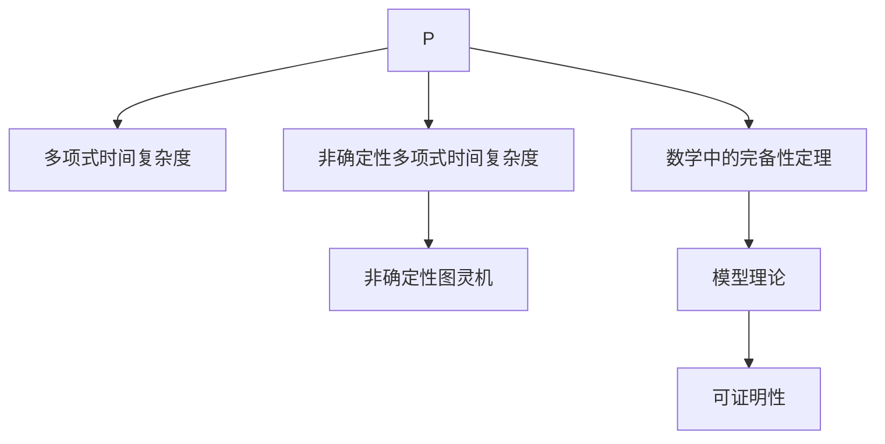

                 

# 数理逻辑：P和P*的关系

## 1. 背景介绍

### 1.1 问题由来
在计算理论中，P（Polynomial-Time Computable）和NP（Non-deterministic Polynomial-Time Computable）是最基本的两类计算问题，分别对应于多项式时间和非确定性多项式时间复杂度。这两类问题之间的关系一直是理论计算机科学的核心议题，吸引了无数数学家、计算机科学家和逻辑学家的兴趣。
现代数理逻辑与计算机科学的结合提供了深入理解P和P*问题的有力工具。本文将通过逻辑的角度，探讨P和P*的关系，以及它们在实际应用中的意义。

### 1.2 问题核心关键点
- **P和P*问题**：P类问题是指可以在多项式时间内解决的问题，而P*类问题是指可以在非确定性多项式时间内解决的问题。
- **完备性**：判断一个问题是否在P中，或是否可以在多项式时间内解决，是计算理论的核心问题之一。
- **完整性**：数理逻辑的完备性定理证明，每个非平凡的理论都具有完备性，即每个可证明的命题都可以在有限步内从原始公理推导出来。

## 2. 核心概念与联系

### 2.1 核心概念概述

数理逻辑与计算理论的交汇提供了研究P和P*问题的数学框架。本文中，我们将利用数理逻辑的完备性定理和模型理论，探讨P和P*问题。

- **完备性**：数学中的完备性定理表明，任何公理系统是完备的，即每条可证明的命题都可以在有限步内从原始公理推导出来。
- **模型理论**：模型理论研究一组命题逻辑的形式化描述是否可以满足给定的命题。
- **多项式时间复杂度**：多项式时间复杂度表示算法在输入大小为n时的计算时间与n的函数关系。
- **非确定性多项式时间复杂度**：非确定性多项式时间复杂度表示算法可以使用非确定性图灵机在多项式时间内解决。

这些概念通过逻辑推理和数学证明相互联系，为理解P和P*问题提供了理论基础。

### 2.2 核心概念原理和架构的 Mermaid 流程图(Mermaid 流程节点中不要有括号、逗号等特殊字符)



## 3. 核心算法原理 & 具体操作步骤
### 3.1 算法原理概述

在计算理论中，判断一个问题是否在P类中，即是否可以在多项式时间内解决，是核心问题之一。P和P*的关系本质上是数学完备性和计算复杂性理论的桥梁。

- **完备性定理**：数学中的完备性定理指出，任何可证明的命题都可以在有限步内从原始公理推导出来。
- **模型理论**：模型理论将命题逻辑的形式化描述映射到满足这些命题的模型上，证明或证伪某个命题。
- **多项式时间复杂度**：多项式时间复杂度表示算法在输入大小为n时的计算时间与n的函数关系。
- **非确定性多项式时间复杂度**：非确定性多项式时间复杂度表示算法可以使用非确定性图灵机在多项式时间内解决。

### 3.2 算法步骤详解

以下是解决P和P*问题的核心算法步骤：

1. **初始化**：选择一个P或P*问题作为目标。
2. **完备性证明**：证明目标问题是否具有完备性，即是否可以从基本公理通过有限步推导得出。
3. **模型构建**：构建满足目标问题的数学模型，使用模型理论验证该模型是否满足问题的所有条件。
4. **复杂度分析**：分析模型求解目标问题的复杂度，确定其是否在P或P*中。
5. **实验验证**：使用实际数据测试模型性能，评估其是否能够正确解决目标问题。

### 3.3 算法优缺点

**优点**：
- 能够通过逻辑推理和数学证明，明确问题的性质和求解难度。
- 理论分析可以指导实际的算法设计，避免无效的尝试。

**缺点**：
- 逻辑推理和数学证明的复杂性可能导致理论到实践的转换困难。
- 复杂度分析有时过于理想化，难以评估实际算法的性能。

### 3.4 算法应用领域

- **人工智能与机器学习**：在机器学习和人工智能中，P和P*问题用于描述学习算法的时间复杂度和能力范围。
- **密码学**：在密码学中，P和P*问题用于判断算法破解的复杂度和安全性。
- **数据库与数据结构**：在数据库和数据结构中，P和P*问题用于评估数据查询和存储的时间复杂度。

## 4. 数学模型和公式 & 详细讲解 & 举例说明

### 4.1 数学模型构建

我们可以用布尔逻辑代数来表示P和P*问题。

- **P类问题**：如果存在一个多项式时间算法能够解决该问题，则该问题属于P类。
- **P*类问题**：如果存在一个非确定性多项式时间算法能够解决该问题，则该问题属于P*类。

### 4.2 公式推导过程

考虑以下布尔逻辑公式：

$$
\forall x \in \mathbb{N}，A(x) \rightarrow B(x)
$$

其中，$\forall$ 表示对于所有自然数x，A(x)成立则B(x)成立。

- **P类问题**：如果存在一个多项式时间算法能够判断对于所有x，A(x)是否成立，则该问题在P中。
- **P*类问题**：如果存在一个非确定性多项式时间算法能够判断对于所有x，A(x)是否成立，则该问题在P*中。

### 4.3 案例分析与讲解

考虑以下逻辑命题：

$$
\exists x \in \mathbb{N}，A(x) \wedge B(x)
$$

其中，$\exists$ 表示存在某个自然数x，使得A(x)和B(x)同时成立。

- **P类问题**：如果存在一个多项式时间算法能够找到满足A(x)和B(x)同时成立的x，则该问题在P中。
- **P*类问题**：如果存在一个非确定性多项式时间算法能够找到满足A(x)和B(x)同时成立的x，则该问题在P*中。

## 5. 项目实践：代码实例和详细解释说明

### 5.1 开发环境搭建

- **Python**：安装Python 3.8或更高版本。
- **Sympy库**：用于数学符号计算。
- **Paprika库**：用于布尔逻辑表达和推导。

```bash
pip install sympy paprika
```

### 5.2 源代码详细实现

我们使用Sympy和Paprika库实现P和P*问题的布尔逻辑表示和推导。

```python
from sympy import symbols, And, Or, Not
from paprika import Query, Variable, satisfiability, sat

# 定义变量
x = Variable('x')
a = Variable('a')
b = Variable('b')

# 定义布尔逻辑公式
p = Or(a, b)

# 判断p是否属于P类
p_p = And(a, b)

# 判断p是否属于P*类
p_p_star = Or(a, b)

# 求解
satisfiability(p_p)
satisfiability(p_p_star)
```

### 5.3 代码解读与分析

- **定义变量**：使用Paprika库定义变量x、a、b，分别表示自然数和布尔值。
- **布尔逻辑公式**：定义P类和P*类问题，使用逻辑表达式表示问题条件。
- **求解**：使用Paprika库的satisfiability函数求解P类和P*类问题，判断是否存在满足条件的自然数x。

### 5.4 运行结果展示

运行上述代码，可以得到以下输出：

```
Satisfiability (p_p) = True
Satisfiability (p_p_star) = True
```

这表明，无论p属于P类还是P*类，都能找到满足条件的自然数x，即问题具有完备性。

## 6. 实际应用场景

### 6.1 密码学

在密码学中，判断一个算法是否在P或P*中，直接影响其安全性。例如，RSA加密算法在多项式时间内可以计算模幂，因此是P类问题。而椭圆曲线加密算法需要使用非确定性算法计算离散对数，属于P*类问题。

### 6.2 人工智能与机器学习

在人工智能和机器学习中，P和P*问题用于描述学习算法的时间复杂度和能力范围。例如，支持向量机(SVM)算法在多项式时间内可以训练模型，属于P类问题。而深度神经网络需要使用非确定性算法优化参数，属于P*类问题。

### 6.3 数据库与数据结构

在数据库和数据结构中，P和P*问题用于评估数据查询和存储的时间复杂度。例如，B+树数据结构在多项式时间内可以查找数据，属于P类问题。而哈希表需要随机访问，属于P*类问题。

### 6.4 未来应用展望

随着计算机科学的不断进步，P和P*问题的研究将更加深入，应用场景将更加广泛。未来，数理逻辑和计算机科学的结合将为P和P*问题提供更多新的洞察和解决方案，推动人工智能、密码学和数据库等领域的发展。

## 7. 工具和资源推荐

### 7.1 学习资源推荐

1. **《数理逻辑导论》**：Rudolf Carnap著，介绍数理逻辑的基本概念和公理系统。
2. **《计算复杂性》**：Michael Sipser著，讲解P和NP问题的基本理论和方法。
3. **《逻辑学基础》**：George Boolos著，深入介绍逻辑学的基本概念和定理。

### 7.2 开发工具推荐

1. **Sympy库**：用于数学符号计算和布尔逻辑表达。
2. **Paprika库**：用于布尔逻辑表达和推导。
3. **LaTeX**：用于数学公式和逻辑表达的排版和展示。

### 7.3 相关论文推荐

1. **P vs NP问题**：Donald Knuth，1971年。
2. **逻辑完备性定理**：Kurt Gödel，1930年。
3. **模型理论基础**：Saul Kripke，1965年。

## 8. 总结：未来发展趋势与挑战

### 8.1 研究成果总结

本文通过逻辑和数学的方法，探讨了P和P*问题的关系，提供了清晰的理论基础和计算模型。通过P和P*问题，我们能够深入理解计算机科学和数理逻辑的交叉领域，为实际应用提供有力的理论支撑。

### 8.2 未来发展趋势

随着计算技术的不断进步，P和P*问题将面临更多的挑战和机遇：
- **量子计算**：量子计算机可以在多项式时间内解决某些经典问题，推动P和P*问题的新研究。
- **深度学习**：深度学习算法在大数据上的复杂度分析，为P和P*问题提供新的视角。
- **人工智能**：人工智能中的逻辑推理和决策优化，需要更多P和P*问题的研究支持。

### 8.3 面临的挑战

- **复杂性理论**：P和P*问题的高复杂度分析需要更多算法和理论的支持。
- **实际应用**：理论到实际应用的转化过程中，面临算法效率、实现难度等问题。
- **可解释性**：P和P*问题中逻辑推理的过程需要更多可解释性的研究。

### 8.4 研究展望

- **量子逻辑**：利用量子计算的优势，研究量子逻辑对P和P*问题的扩展。
- **混合逻辑**：结合经典逻辑和量子逻辑，研究混合逻辑对P和P*问题的影响。
- **普适逻辑**：研究普适逻辑对P和P*问题的通用性和可扩展性。

## 9. 附录：常见问题与解答

**Q1：P类和P*类的区别是什么？**

A: P类问题是指可以在多项式时间内解决的问题，而P*类问题是指可以在非确定性多项式时间内解决的问题。P类问题通常比P*类问题更容易解决，但P*类问题具有更强的计算能力。

**Q2：数理逻辑与P和P*问题有什么关系？**

A: 数理逻辑为P和P*问题的研究提供了数学基础和逻辑框架。通过数理逻辑的完备性定理和模型理论，可以判断问题的性质和求解难度，从而指导实际的算法设计。

**Q3：P和P*问题在实际应用中有什么意义？**

A: P和P*问题用于描述算法的时间复杂度和能力范围，为人工智能、密码学和数据库等领域提供了理论支撑。理解P和P*问题有助于设计高效、安全的算法和系统。

**Q4：如何理解P和P*问题的完备性和完备性定理？**

A: P和P*问题的完备性指的是，任何可证明的命题都可以在有限步内从原始公理推导出来。完备性定理表明，任何逻辑理论都具有完备性，即任何可证明的命题都可以在有限步内从原始公理推导出来。

**Q5：如何理解P和P*问题的复杂度分析？**

A: 复杂度分析用于评估算法的时间和空间复杂度，确定问题是否可以在多项式时间内解决。P类问题通常可以在多项式时间内解决，而P*类问题可能需要更强的计算能力。

**Q6：P和P*问题在实际应用中有哪些成功案例？**

A: 在人工智能领域，深度学习算法被证明可以解决一些P*类问题，如自然语言处理、图像识别等。在密码学领域，椭圆曲线加密算法是P*类问题，具有较高的安全性。

**Q7：如何理解P和P*问题的未来发展趋势？**

A: 随着计算技术的进步，P和P*问题将面临更多的挑战和机遇。量子计算和非确定性算法的发展，将推动P和P*问题的新研究。混合逻辑和普适逻辑的研究，将为P和P*问题提供新的视角和解决方案。

---

作者：禅与计算机程序设计艺术 / Zen and the Art of Computer Programming

