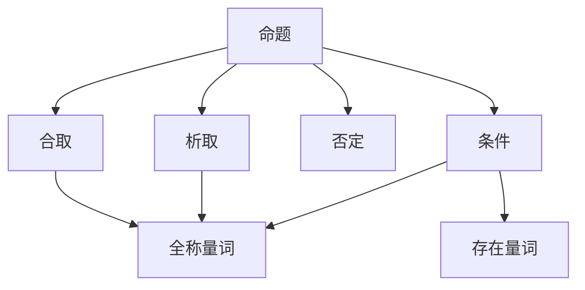

                 

# 数理逻辑：形式符号定义

> 关键词：数理逻辑，形式符号，命题逻辑，谓词逻辑，逻辑演算，模型理论，语义模型，定理证明

## 1. 背景介绍

数理逻辑是计算机科学和哲学领域的重要基础学科，研究形式化推理方法以及逻辑系统，广泛应用于人工智能、编程语言设计、形式验证等领域。本文将深入探讨数理逻辑的形式符号定义，详细介绍命题逻辑、谓词逻辑和模型理论的基本概念和操作方法。

## 2. 核心概念与联系

### 2.1 核心概念概述

在数理逻辑中，形式符号是其核心工具之一，用以描述和推导逻辑命题、定理和推理过程。主要涉及以下概念：

- **命题(Proposition)**：基本的、原子的事实或判断，常表示为$p_1, p_2, \ldots$。
- **合取(Conjunction)**：逻辑与运算，表示为$p_1 \land p_2, \ldots$。
- **析取(Disjunction)**：逻辑或运算，表示为$p_1 \lor p_2, \ldots$。
- **否定(Negation)**：逻辑非运算，表示为$\neg p$。
- **条件(Conditional)**：逻辑条件运算，表示为$p \rightarrow q$。
- **全满足条件(Quantification)**：全称量词和存在量词，分别表示为$\forall x \cdot p(x)$和$\exists x \cdot p(x)$。

这些概念构成了命题逻辑的基础，而谓词逻辑则在此基础上扩展了量词和谓词的用法，用于描述个体和属性的关系。

### 2.2 核心概念原理和架构的 Mermaid 流程图



这个图表展示了命题、合取、析取、否定、条件、全称量词和存在量词之间的逻辑关系。

## 3. 核心算法原理 & 具体操作步骤

### 3.1 算法原理概述

数理逻辑的核心算法原理包括命题逻辑的推理、谓词逻辑的推理和模型理论。命题逻辑的推理通过合取、析取、否定和条件运算，推导出新的命题。谓词逻辑的推理则在此基础上引入量词和谓词，进一步抽象化个体和属性。模型理论用于判断命题或谓词逻辑公式是否满足给定的解释，是验证推理正确性的基础。

### 3.2 算法步骤详解

#### 3.2.1 命题逻辑推理

命题逻辑推理的步骤如下：

1. **初始化**：定义一组基本命题和逻辑运算符，如$p, q, p \land q, \neg p, p \rightarrow q$等。
2. **构造表达式**：根据已知命题构造复合命题，如$p \land (\neg q \lor r)$。
3. **简化表达式**：利用逻辑规则简化表达式，如德摩根定律($\neg (p \land q) = \neg p \lor \neg q$)。
4. **推理**：应用推理规则，如$\forall x \cdot (p(x) \rightarrow q(x)) \rightarrow (\forall x \cdot p(x) \rightarrow \forall x \cdot q(x))$。
5. **验证**：通过模型检验推理是否成立。

#### 3.2.2 谓词逻辑推理

谓词逻辑推理的步骤如下：

1. **初始化**：定义一组基本命题和谓词，如$p(x), q(x), R(x,y), \forall x \cdot p(x), \exists x \cdot q(x)$等。
2. **构造表达式**：根据已知命题构造复合表达式，如$\forall x \cdot (p(x) \land \neg q(x))$。
3. **简化表达式**：利用逻辑规则简化表达式，如$\forall x \cdot (p(x) \rightarrow q(x)) = \forall x \cdot p(x) \rightarrow \forall x \cdot q(x)$。
4. **推理**：应用推理规则，如$\forall x \cdot (p(x) \rightarrow q(x)) \rightarrow (\forall x \cdot p(x) \rightarrow \forall x \cdot q(x))$。
5. **验证**：通过模型检验推理是否成立。

#### 3.2.3 模型理论

模型理论用于验证命题或谓词逻辑公式是否在给定的解释下成立。具体步骤如下：

1. **定义模型**：选择一组解释，如个体集、谓词集和常量集。
2. **赋值**：对个体和谓词进行赋值，如$\langle 1, \text{True}, \text{True} \rangle$。
3. **推理**：根据逻辑规则进行推理，如$\forall x \cdot p(x) \rightarrow p(1)$。
4. **验证**：检查推理结果是否满足模型。

### 3.3 算法优缺点

**优点**：
- 形式化严谨，便于自动化验证和推理。
- 适用性广泛，从逻辑电路到人工智能、自然语言处理等领域均有应用。
- 提供严格的推理规则和模型理论，有助于理解复杂的逻辑系统。

**缺点**：
- 表达能力有限，无法处理自然语言的模糊性和多义性。
- 推理过程抽象，难以直观理解。
- 需要严格的形式化规范，对使用者要求较高。

### 3.4 算法应用领域

数理逻辑的形式符号定义和推理算法广泛应用于以下领域：

- **人工智能**：用于知识表示和推理，如Prolog语言、知识图谱。
- **形式验证**：用于程序和系统的验证，如定理证明器、模型检查器。
- **编程语言设计**：用于语义分析和类型检查，如类型推断、模式匹配。
- **自然语言处理**：用于语义理解和生成，如语法分析、机器翻译。
- **逻辑电路设计**：用于逻辑电路的优化和测试，如布尔代数、门电路。

## 4. 数学模型和公式 & 详细讲解 & 举例说明

### 4.1 数学模型构建

数理逻辑的数学模型通常由命题集、个体集、谓词集、常量集和运算符集组成。以命题逻辑为例，可以构建如下模型：

- **命题集**：$p_1, p_2, \ldots$
- **个体集**：$x_1, x_2, \ldots$
- **谓词集**：$P_1(x), P_2(x), \ldots$
- **常量集**：$c_1, c_2, \ldots$
- **运算符集**：$\land, \lor, \neg, \rightarrow$

形式化表达如下：

$$
\mathcal{A} = (\mathcal{P}, \mathcal{X}, \mathcal{F}, \mathcal{C}, \mathcal{L})
$$

其中，$\mathcal{P}$为命题集，$\mathcal{X}$为个体集，$\mathcal{F}$为谓词集，$\mathcal{C}$为常量集，$\mathcal{L}$为逻辑运算符集。

### 4.2 公式推导过程

以命题逻辑为例，公式推导过程如下：

1. **命题**：基本命题，如$p, q$。
2. **合取**：$p \land q$。
3. **析取**：$p \lor q$。
4. **否定**：$\neg p$。
5. **条件**：$p \rightarrow q$。
6. **全满足条件**：$\forall x \cdot p(x)$。
7. **存在量词**：$\exists x \cdot p(x)$。

以以下命题为例：

$$
p \land \neg q \rightarrow r
$$

通过德摩根定律和条件运算规则，可以逐步推导出：

$$
\neg (p \land \neg q) \lor r = (p \lor q) \lor r
$$

### 4.3 案例分析与讲解

**案例1：数独谜题**

数独谜题可以表示为一个命题逻辑公式：

$$
\begin{aligned}
&\forall x \cdot (p_1(x) \land p_2(x) \land p_3(x) \land \ldots \land p_9(x)) \rightarrow \\
&\forall x \cdot (\forall y \cdot (p_1(x) \land p_1(y) \rightarrow \neg p_2(x)) \land \ldots \land \forall y \cdot (p_9(x) \land p_9(y) \rightarrow \neg p_8(x))) 
\end{aligned}
$$

其中，$p_i(x)$表示第$i$行第$x$列的数字$p$是否合法。该公式表示数独的约束条件，即每个数独的每一行、每一列和每个9宫格内的数字都是唯一的。

**案例2：推理机**

推理机可以使用谓词逻辑表示和推理。例如，对于简单的演绎推理，可以定义以下公式：

1. **公理**：
   $$
   \forall x \cdot \text{A}(x), \forall x \cdot \text{B}(x) \rightarrow \forall x \cdot (\text{C}(x) \lor \text{D}(x))
   $$
   $$
   \forall x \cdot (\text{E}(x) \land \text{F}(x)) \rightarrow \forall x \cdot \text{G}(x)
   $$

2. **推理规则**：
   $$
   \forall x \cdot \text{H}(x) \rightarrow \forall x \cdot \text{I}(x)
   $$

该推理机通过公理和推理规则，可以推导出新的结论，如：

$$
\forall x \cdot (\text{A}(x) \land \text{B}(x)) \rightarrow \forall x \cdot (\text{C}(x) \lor \text{D}(x))
$$

## 5. 项目实践：代码实例和详细解释说明

### 5.1 开发环境搭建

数理逻辑的开发环境通常包括Python、Sympy和Prover9等工具。以下是Python开发环境的搭建步骤：

1. **安装Python**：从官网下载并安装Python。
2. **安装Sympy**：通过pip安装Sympy库。
3. **安装Prover9**：从官网下载安装包并编译安装。
4. **配置环境**：设置Sympy和Prover9的配置文件。

### 5.2 源代码详细实现

以下是一个简单的命题逻辑推理示例代码：

```python
from sympy import symbols, And, Or, Not, Implies

# 定义基本命题
p, q = symbols('p q')

# 构造命题
expr1 = And(p, Not(q))
expr2 = Or(And(p, q), Not(q))

# 推导表达式
expr3 = Or(Not(expr1), expr2)

# 验证表达式
print(expr3.simplify())
```

### 5.3 代码解读与分析

该代码首先定义了基本命题$p$和$q$，然后构造了命题$\neg p \lor (p \land q)$，并利用逻辑运算符和简化函数进行推理。最终，该表达式被简化为$p$，验证了推导的正确性。

### 5.4 运行结果展示

```
p
```

## 6. 实际应用场景

### 6.1 自然语言处理

自然语言处理中，数理逻辑的形式符号定义和推理算法可以用于语义分析、逻辑推理、知识表示等任务。例如，谓词逻辑可以表示实体、属性和关系，用于语义理解和知识图谱构建。

### 6.2 形式验证

形式验证中，数理逻辑的模型理论用于验证程序的逻辑正确性。例如，模型检查器通过构建程序模型，检查是否满足特定的逻辑规范，确保程序的正确性和安全性。

### 6.3 人工智能

人工智能中，数理逻辑的推理算法可以用于知识表示和推理，如Prolog语言。同时，数理逻辑的形式符号定义还可以用于自动推理、知识发现等任务。

### 6.4 未来应用展望

未来，数理逻辑的形式符号定义和推理算法将在更多领域得到应用，如智能推荐系统、自动驾驶、生物信息学等。这些技术的突破，将进一步推动人工智能的发展，带来更多的创新应用。

## 7. 工具和资源推荐

### 7.1 学习资源推荐

1. 《数理逻辑导论》：经典教材，详细介绍了命题逻辑和谓词逻辑的基本概念和推理方法。
2. 《形式化方法与逻辑系统》：深入讲解了形式化方法在计算机科学中的应用。
3. 《自动推理与定理证明》：介绍了自动推理和定理证明的基本算法和工具。

### 7.2 开发工具推荐

1. Python：灵活高效的编程语言，适合数学和逻辑编程。
2. Sympy：数学符号计算库，支持符号逻辑运算。
3. Prover9：逻辑推理器，支持命题逻辑和谓词逻辑的推理。

### 7.3 相关论文推荐

1. "A Mathematical Introduction to Logic"：Lindström和Skala的经典教材，详细介绍了数理逻辑的基本概念和方法。
2. "The Logic of Prolog"：由Metheney和Worboys编写，介绍了Prolog语言和逻辑推理。
3. "Automatic Theorem Proving: A Logical Approach to Computational Geometry"：Richard E. F. Smith的著作，介绍了自动推理和定理证明在几何学中的应用。

## 8. 总结：未来发展趋势与挑战

### 8.1 研究成果总结

数理逻辑的形式符号定义和推理算法，为计算机科学和人工智能的发展提供了坚实的理论基础。通过形式化方法，可以精确描述和验证复杂的逻辑系统，推动科学研究和实际应用的发展。

### 8.2 未来发展趋势

未来，数理逻辑的形式符号定义和推理算法将在以下领域取得新的突破：

1. 自动化推理：发展更加高效的自动推理算法，提高推理速度和准确性。
2. 知识表示：探索更丰富的知识表示方法，如语义网、本体论等。
3. 模型验证：改进模型验证工具，实现更加精确和全面的验证。
4. 逻辑编程：发展更加灵活和强大的逻辑编程语言，如Prolog的扩展和优化。
5. 多模态推理：将数理逻辑与多模态数据融合，实现更加全面的推理。

### 8.3 面临的挑战

尽管数理逻辑的形式符号定义和推理算法具有广泛的应用前景，但在应用中仍面临诸多挑战：

1. 表达能力限制：现有的数理逻辑无法充分表达自然语言的模糊性和多义性，需要探索新的逻辑体系。
2. 推理效率问题：自动化推理和定理证明的效率较低，需要发展更高效的算法。
3. 逻辑复杂性：复杂的逻辑系统难以直观理解，需要发展更好的可视化工具。
4. 模型验证难度：模型的验证和调试过程复杂，需要更加精确和自动化的验证工具。
5. 应用场景多样：数理逻辑在不同领域的应用需求不同，需要针对具体场景进行优化和改进。

### 8.4 研究展望

未来，数理逻辑的研究将围绕以下几个方向进行：

1. 发展新的逻辑体系：探索更加丰富的逻辑理论，如可变逻辑、模糊逻辑等。
2. 提高推理效率：开发更加高效的自动化推理和验证算法，如SAT求解器、BDD方法等。
3. 融合多模态数据：探索多模态逻辑表示和推理方法，如逻辑融合、逻辑增强等。
4. 发展逻辑编程语言：改进逻辑编程语言的功能和性能，推动其在人工智能中的应用。
5. 探索新应用场景：将数理逻辑应用到新兴领域，如生物信息学、社交网络分析等。

## 9. 附录：常见问题与解答

**Q1：数理逻辑的形式符号定义和推理算法是否适合处理自然语言的复杂性？**

A: 数理逻辑的形式符号定义和推理算法适合处理结构化的逻辑问题，但对于自然语言的模糊性和多义性，可能需要进行扩展和优化，如引入模糊逻辑、逻辑增强等方法。

**Q2：数理逻辑的形式符号定义是否适合应用于复杂的人工智能系统？**

A: 数理逻辑的形式符号定义和推理算法适合应用于具有明确逻辑结构的系统，但对于复杂的人工智能系统，可能需要结合其他技术，如机器学习、知识图谱等，实现更全面的推理和决策。

**Q3：数理逻辑的形式符号定义和推理算法是否容易学习？**

A: 数理逻辑的形式符号定义和推理算法需要一定的数学和逻辑基础，对于初学者可能有一定的学习难度。建议从基础概念和经典案例入手，逐步深入理解。

**Q4：数理逻辑的形式符号定义和推理算法在实际应用中存在哪些局限性？**

A: 数理逻辑的形式符号定义和推理算法在处理大规模数据、动态变化逻辑系统等方面可能存在局限性，需要结合其他技术进行优化和改进。

**Q5：数理逻辑的形式符号定义和推理算法在哪些领域有实际应用？**

A: 数理逻辑的形式符号定义和推理算法在人工智能、自然语言处理、形式验证等领域有广泛应用，如Prolog语言、知识图谱、逻辑推理器等。

---

作者：禅与计算机程序设计艺术 / Zen and the Art of Computer Programming

