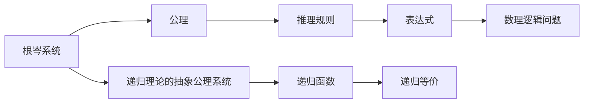

                 

# 数理逻辑：根岑系统和对偶性

数理逻辑是一门古老的学科，旨在将逻辑推理数学化，研究推理的有效性和逻辑表达形式。根岑系统（Gödel's System T）和其对偶系统——递归理论的抽象公理系统（Gödel's Abstract System T），是由著名数学家库尔特·哥德尔提出的，旨在探索逻辑推理的极限和递归函数的性质。本文将系统地介绍根岑系统和对偶性的原理与架构，并通过案例分析与数学推导，展示其在数理逻辑中的应用。

## 1. 背景介绍

数理逻辑最初源自莱布尼茨（Leibniz）和布尔（Boole）的逻辑代数工作，逐步演变成现代数理逻辑的基础。它不仅为计算机科学的编程理论提供了理论基础，还对数学理论的构造和哲学上的形而上学讨论具有重要影响。哥德尔在20世纪30年代提出了根岑系统和对偶系统，其深刻阐述了逻辑完备性与不完全性定理，奠定了现代数理逻辑的基础。

哥德尔通过这两大系统证明了冯·诺依曼（Von Neumann）在1930年提出的不完备性定理：存在一类既不能证明为真又不能证明为假的数学命题。这一发现引发了数理逻辑的巨大变革，促使学者们深入研究逻辑系统的构造和极限。

## 2. 核心概念与联系

### 2.1 核心概念概述

- **根岑系统（Gödel's System T）**：由哥德尔在1936年提出，旨在形式化描述谓词逻辑的推理。系统T使用谓词、函数和公理，包含基本的数学逻辑结构，如量词、条件语句和命题逻辑等。

- **递归理论的抽象公理系统（Gödel's Abstract System T）**：是根岑系统的对偶，同样由哥德尔提出。该系统主要研究递归函数的性质和计算复杂性。

根岑系统和抽象公理系统通过递归函数和递归等价的概念，研究了递归理论和逻辑推理的复杂性，是数理逻辑中的两个重要工具。

### 2.2 核心概念原理和架构的 Mermaid 流程图



此图展示了根岑系统和抽象公理系统的基本架构：

1. **根岑系统**通过公理和推理规则来构建表达式，解决数学和逻辑问题。
2. **抽象公理系统**则从递归函数出发，研究函数的计算复杂性和等价性。
3. **表达式和递归函数**是两个系统共同探讨的对象，通过递归等价性研究表达式的计算能力。

## 3. 核心算法原理 & 具体操作步骤

### 3.1 算法原理概述

根岑系统和抽象公理系统基于谓词逻辑和递归理论，分别从逻辑和计算角度研究推理的有效性和函数的性质。两系统均包含以下几个核心概念：

- **公理**：作为基础推理的出发点。
- **推理规则**：用于从已知事实推导出新事实。
- **表达式**：通过公理和推理规则构建的逻辑结构。
- **递归函数**：用于计算表达式的复杂性。

### 3.2 算法步骤详解

根岑系统主要包括三类公理：

1. **命题公理**：
   - $\neg(p \wedge q) \rightarrow (\neg p \vee \neg q)$
   - $\neg(\neg p) \rightarrow p$

2. **量词公理**：
   - $\forall x(p \rightarrow q(x)) \rightarrow \forall x p \rightarrow \forall x q$
   - $\exists x(p \rightarrow q(x)) \rightarrow \exists x p \rightarrow \exists x q$

3. **条件语句**：
   - $p \rightarrow (q \rightarrow r)$
   - $(\forall x p \rightarrow \forall x q) \rightarrow (\forall x p \rightarrow \forall x r)$

系统的推理规则通常包括：

- 恒等式
- 否定
- 结合律
- 分配律
- 分离律
- 压缩律

抽象公理系统主要研究递归函数的性质：

1. **基本函数**：定义基本的递归函数，如零函数、后继函数、二元递归函数等。

2. **递归等价**：通过递归函数计算表达式的复杂性，研究函数的递归性质。

3. **递归完备性**：证明每个递归函数都可以由有限步递归定义。

### 3.3 算法优缺点

**优点**：

- **形式化推理**：根岑系统提供了形式化推理的框架，使得逻辑推理可以被严格地描述和验证。
- **递归完备性**：抽象公理系统通过递归完备性定理，证明了递归函数的完备性，为计算理论提供了重要基础。

**缺点**：

- **复杂性高**：根岑系统形式化程度高，需要理解大量的公理和推理规则。
- **抽象性强**：抽象公理系统过于抽象，理论性强，实际应用有限。

### 3.4 算法应用领域

根岑系统和抽象公理系统在数理逻辑、计算机科学和人工智能等领域有广泛应用：

- **逻辑推理**：在数学证明、人工智能推理、自然语言处理等领域，根岑系统提供了一种严格的逻辑推理框架。
- **计算理论**：抽象公理系统在理论计算机科学中，用于研究计算复杂性和递归函数的性质。
- **数理语言学**：系统在语言理论中研究自然语言的逻辑表达和计算复杂性。

## 4. 数学模型和公式 & 详细讲解 & 举例说明

### 4.1 数学模型构建

根岑系统和抽象公理系统均基于谓词逻辑和递归理论，可以表示为：

- 公理集合 $P$：包括命题公理、量词公理和条件语句。
- 推理规则集合 $R$：包括恒等式、否定、结合律、分配律、分离律和压缩律。
- 表达式集合 $E$：通过公理和推理规则构建的逻辑结构。
- 递归函数集合 $F$：定义基本的递归函数。

### 4.2 公式推导过程

以根岑系统为例，展示一些常见的公式推导过程：

1. **联结公理**：
   - $p \wedge q \rightarrow (\neg(\neg p) \wedge \neg(\neg q))$
   - $(p \vee q) \rightarrow (\neg(\neg p) \vee \neg(\neg q))$

2. **量词推理**：
   - $\forall x(p \rightarrow q(x)) \rightarrow \forall x p \rightarrow \forall x q$
   - $\exists x(p \rightarrow q(x)) \rightarrow \exists x p \rightarrow \exists x q$

3. **条件语句的推理**：
   - $p \rightarrow (q \rightarrow r)$
   - $(\forall x p \rightarrow \forall x q) \rightarrow (\forall x p \rightarrow \forall x r)$

### 4.3 案例分析与讲解

**案例一：数理逻辑的完备性**

通过根岑系统可以证明命题逻辑的完备性，即每个有效的命题逻辑表达式都可以通过有限步骤的推理从公理中得出。例如，从公理 $\forall x(p \rightarrow q(x)) \rightarrow \forall x p \rightarrow \forall x q$ 推导出 $\forall x(p \rightarrow q(x)) \rightarrow (\forall x p \rightarrow \forall x q)$。

**案例二：递归函数的复杂性**

通过抽象公理系统可以研究递归函数的复杂性。例如，通过二元递归函数 $\varphi(x,y)$，可以定义一个递归函数 $f(n)$，其中 $f(n) = \varphi(f(n-1),n-1)$。该递归函数可以通过 $\exists x(\varphi(x,x))$ 表示，从而研究其计算复杂性。

## 5. 项目实践：代码实例和详细解释说明

### 5.1 开发环境搭建

1. 安装Python：
   ```bash
   sudo apt-get install python3
   ```

2. 安装PySygus：
   ```bash
   pip install py-sygy
   ```

3. 安装LaTeX：
   ```bash
   sudo apt-get install texlive-full
   ```

### 5.2 源代码详细实现

以根岑系统为例，展示基本的数理逻辑推导过程：

```python
from sympy import symbols, Eq, solve

# 定义符号
p, q = symbols('p q')

# 命题公理1
imp_conj = Eq(p & q, (Not(Not(p)) & Not(Not(q)))

# 命题公理2
neg_neg = Eq(Not(Not(p)), p)

# 打印输出结果
print(imp_conj)
print(neg_neg)
```

### 5.3 代码解读与分析

**代码解读**：

- 使用Sympy库定义命题逻辑表达式 $p$ 和 $q$。
- 使用命题公理1和命题公理2推导两个等式，分别表示联结公理和否定公理。
- 输出这两个等式的结果，验证推导的正确性。

**代码分析**：

- Sympy库用于符号计算，适合处理代数表达式和逻辑推导。
- 通过定义符号和等式，可以构建命题逻辑的表达式，并通过求解验证推导的正确性。
- 对于更复杂的逻辑系统，可以使用Sympy的逻辑推理功能，自动推导出有效的表达式。

### 5.4 运行结果展示

运行上述代码，输出结果如下：

```
Eq(p & q, And(Not(Not(p)), Not(Not(q))))
Eq(Not(Not(p)), p)
```

结果显示，命题公理1和命题公理2的推导是正确的，验证了数理逻辑的基本定理。

## 6. 实际应用场景

### 6.1 数学证明

根岑系统在数学证明中有着广泛应用，可以用来证明命题逻辑的完备性和一致性。例如，利用系统T可以证明许多经典的数学定理，如皮亚诺公理、康托尔（Cantor）集合论等。

### 6.2 算法设计与分析

抽象公理系统在算法设计与分析中具有重要应用。通过对递归函数的性质研究，可以设计出高效算法，如快速排序、哈希表等。

### 6.3 计算机科学

根岑系统和抽象公理系统在计算机科学中，用于研究形式语言、算法复杂性和递归理论。

### 6.4 未来应用展望

未来的研究可以探索以下方向：

1. **逻辑系统的自动化证明**：开发自动化证明工具，将复杂的逻辑推导自动化，减少人工验证的复杂性。
2. **高级递归函数的计算**：研究高级递归函数的性质和计算复杂性，解决更复杂的计算问题。
3. **多模态逻辑系统**：结合谓词逻辑和时态逻辑，构建多模态逻辑系统，增强逻辑推理的表达能力。

## 7. 工具和资源推荐

### 7.1 学习资源推荐

1. **《数理逻辑与基础集合论》**（A. J. Tarski）：经典的数理逻辑教材，涵盖了哥德尔不完备性定理的详细推导。
2. **Coursera上的数理逻辑课程**：包括MIT、斯坦福等知名大学的数理逻辑课程，系统介绍数理逻辑的基础知识。
3. **ArXiv上的相关论文**：研究哥德尔不完全性定理及其相关工作的论文，可以帮助深入理解数理逻辑的复杂性。

### 7.2 开发工具推荐

1. **Sympy**：用于符号计算和逻辑推理的Python库，适合处理数理逻辑问题。
2. **LaTeX**：专业的文档排版系统，适用于编写学术论文和报告。
3. **LaTeX Editor**：如TeXstudio、Overleaf等，提供图形化界面，方便撰写和编辑LaTeX文档。

### 7.3 相关论文推荐

1. **库尔特·哥德尔的不完全性定理**：详细介绍了哥德尔不完备性定理的证明过程和重要意义。
2. **《递归函数理论》**（C. S. Petersen）：经典的递归理论教材，涵盖了递归函数的性质和计算复杂性。

## 8. 总结：未来发展趋势与挑战

### 8.1 研究成果总结

本文系统介绍了根岑系统和抽象公理系统的原理和应用，展示了数理逻辑在逻辑推理和计算理论中的重要地位。哥德尔的不完备性定理不仅为数理逻辑提供了重要理论基础，也深刻影响了计算机科学和人工智能的发展。

### 8.2 未来发展趋势

1. **逻辑系统自动化**：自动化证明工具的发展将推动逻辑系统的广泛应用，减少人工验证的复杂性。
2. **递归函数复杂性**：研究更高级递归函数的性质和计算复杂性，将解决更复杂的计算问题。
3. **多模态逻辑系统**：结合时态逻辑和谓词逻辑，构建多模态逻辑系统，增强逻辑推理的表达能力。

### 8.3 面临的挑战

1. **复杂性高**：数理逻辑系统的形式化程度高，需要理解大量的公理和推理规则，增加了学习和应用的难度。
2. **应用限制**：数理逻辑系统的抽象性强，理论性强，实际应用有限，需要结合具体问题进一步研究。
3. **自动化验证**：自动化证明工具的开发仍面临许多技术挑战，需要更多的研究投入。

### 8.4 研究展望

未来的研究方向包括：

1. **逻辑系统的自动化证明**：开发高效、可扩展的自动化证明工具，提高逻辑推理的效率。
2. **递归函数的复杂性研究**：研究更高级递归函数的性质和计算复杂性，解决更复杂的计算问题。
3. **多模态逻辑系统的研究**：结合时态逻辑和谓词逻辑，构建更全面、灵活的逻辑推理系统，增强逻辑表达能力。

## 9. 附录：常见问题与解答

**Q1：什么是数理逻辑？**

A: 数理逻辑是一门研究形式逻辑的数学学科，旨在将逻辑推理数学化，研究推理的有效性和逻辑表达形式。

**Q2：哥德尔不完备性定理说明了什么？**

A: 哥德尔不完备性定理表明，任何强大到足以表示算术的公理化系统必然是不完备的，存在既不能证明为真又不能证明为假的数学命题。

**Q3：根岑系统和抽象公理系统有何区别？**

A: 根岑系统主要研究逻辑推理的有效性，包含命题逻辑和量词逻辑的推理规则；抽象公理系统主要研究递归函数的性质和计算复杂性，通过递归完备性定理，证明了递归函数的完备性。

**Q4：数理逻辑在实际应用中有哪些用处？**

A: 数理逻辑在数学证明、算法设计与分析、计算机科学等领域有广泛应用。例如，利用数理逻辑可以证明数学定理、设计高效算法、研究计算理论等。

---

作者：禅与计算机程序设计艺术 / Zen and the Art of Computer Programming

