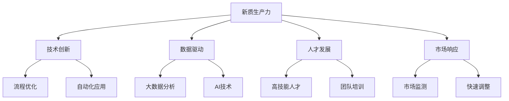

                 

# 新质生产力提升核心竞争力

## 1. 背景介绍

### 1.1 问题由来
随着技术的快速发展，尤其是人工智能(AI)技术的兴起，全球正在经历一场前所未有的生产力和生产关系的变革。这一变革不仅仅局限于技术领域，更深刻地影响着各行各业的生产模式、管理方式和市场竞争格局。传统企业面临着数字化转型的迫切需求，以适应新的发展环境和竞争态势。

### 1.2 问题核心关键点
提升核心竞争力成为了现代企业发展的关键。在数字化时代，企业要想保持竞争优势，必须从提升“新质生产力”入手，即通过技术创新、数据驱动、人才发展等多维度手段，打造新型的生产力和竞争力。新质生产力不仅包括传统意义上的物质产出，更涵盖了企业内部运营效率、创新能力、市场响应速度等多个方面。

### 1.3 问题研究意义
研究新质生产力的提升方法，对于企业的长期发展和核心竞争力的构建具有重要意义：

1. **提高运营效率**：通过技术手段优化生产流程，降低成本，提高效率。
2. **加速创新进程**：利用数据和AI技术，快速响应市场变化，实现产品迭代和更新。
3. **增强市场竞争力**：通过智能化转型，提升产品和服务的竞争力，满足消费者多样化需求。
4. **优化人才结构**：吸引和培养高技能人才，打造高绩效团队，提升企业创新能力。

## 2. 核心概念与联系

### 2.1 核心概念概述

为更好地理解如何提升新质生产力，本节将介绍几个关键概念及其相互联系：

- **新质生产力**：指通过技术创新、数据驱动、人才发展等手段，提升企业内部运营效率和市场响应速度，打造更高质量的产出和更高附加值的服务能力。
- **技术创新**：包括产品研发、流程优化、自动化应用等，通过技术手段提升企业运营效率和创新能力。
- **数据驱动**：利用大数据分析和AI技术，驱动企业决策和运营，实现精准管理。
- **人才发展**：通过引入和培养高技能人才，提升企业内部技术水平和创新能力。
- **市场响应**：指企业快速识别市场变化，及时调整策略，满足市场需求的能力。

这些概念之间的联系可以通过以下Mermaid流程图来展示：



这个流程图展示了新质生产力的构建，是通过技术创新、数据驱动、人才发展和市场响应四个核心环节相互作用，共同推动的。

## 3. 核心算法原理 & 具体操作步骤
### 3.1 算法原理概述

提升新质生产力的核心算法原理，是通过优化运营流程、数据驱动决策、人才发展策略和市场响应机制，全面提升企业的运营效率和市场竞争力。

具体而言，算法原理包括：

- **流程优化**：通过流程再造、自动化应用等手段，优化企业内部运作流程，提高效率。
- **数据驱动**：利用大数据分析和AI技术，驱动企业决策和运营，实现精准管理。
- **人才发展**：通过引入和培养高技能人才，提升企业内部技术水平和创新能力。
- **市场响应**：快速识别市场变化，及时调整策略，满足市场需求。

### 3.2 算法步骤详解

提升新质生产力的具体操作步骤，可以概括为以下几个步骤：

**Step 1: 流程优化**
- 进行流程再造，去除冗余环节，提升效率。
- 引入自动化工具，如ERP、CRM等，减少人工干预。
- 使用AI技术，如RPA（机器人流程自动化），提升流程处理速度和准确性。

**Step 2: 数据驱动**
- 收集和整合企业内部和外部的数据，建立数据仓库。
- 利用大数据分析技术，如数据挖掘、机器学习，挖掘数据价值。
- 应用AI技术，如预测建模、自然语言处理，驱动业务决策和运营。

**Step 3: 人才发展**
- 制定人才引进策略，吸引高技能人才。
- 建立内部培训机制，提升员工技能水平。
- 建立激励机制，如股权激励、绩效奖金，激励员工创新。

**Step 4: 市场响应**
- 建立市场监测系统，实时监控市场变化。
- 快速分析市场数据，及时调整产品和服务策略。
- 利用AI技术，如推荐系统、聊天机器人，提升市场响应速度和客户满意度。

### 3.3 算法优缺点

提升新质生产力的算法具有以下优点：

1. **提升运营效率**：通过流程优化、自动化应用，可以大幅降低人工成本，提高运营效率。
2. **数据驱动决策**：利用大数据分析和AI技术，可以提升决策的精准性和科学性。
3. **增强创新能力**：高技能人才的引入和培养，可以提升企业内部的创新能力和技术水平。
4. **提升市场响应速度**：通过市场监测和快速调整策略，可以更快地满足市场需求，提升市场竞争力。

同时，该算法也存在一些局限性：

1. **实施成本高**：引入新技术和人才，需要进行大规模的投资和培训。
2. **数据质量要求高**：数据驱动决策对数据质量要求高，数据缺失或不准确可能导致错误的决策。
3. **人才保留难度大**：高技能人才的吸引和保留难度大，需建立完善的人才发展体系。
4. **市场变化复杂**：市场变化多变，需不断调整策略，适应新的市场环境。

尽管存在这些局限性，但提升新质生产力仍然是企业数字化转型的重要方向。未来相关研究的重点在于如何进一步降低实施成本，提高数据质量，增强人才黏性，应对市场变化等挑战。

### 3.4 算法应用领域

提升新质生产力的算法在多个领域得到了广泛应用：

- **制造业**：通过自动化生产线和智能化管理系统，提高生产效率和质量。
- **零售业**：利用大数据分析进行精准营销和库存管理，提升客户体验和运营效率。
- **金融业**：应用AI技术进行风险评估和欺诈检测，提升金融安全性和服务水平。
- **医疗行业**：利用AI和大数据分析，提升诊断和治疗的准确性，优化医疗资源配置。
- **教育行业**：通过AI技术进行个性化教育和智能辅导，提升教学质量和效率。

## 4. 数学模型和公式 & 详细讲解 & 举例说明

### 4.1 数学模型构建

提升新质生产力的数学模型构建，需要考虑多个因素，包括流程优化、数据驱动、人才发展和市场响应等。

### 4.2 公式推导过程

以下以流程优化为例，推导提升运营效率的数学模型。

假设企业原流程需要N个步骤，每个步骤的时间为T小时，引入自动化工具后，每个步骤的时间减少为T/2小时。引入自动化工具的成本为C元，每年节约的成本为S元/步。

则引入自动化工具后，企业年节约成本的总量为N*T*S/2，同时需要支付自动化工具的成本C。因此，引入自动化工具的经济性可以表示为：

$$
\text{经济性} = \frac{N*T*S/2 - C}{N*T*S/2}
$$

### 4.3 案例分析与讲解

假设企业原流程有10个步骤，每个步骤的时间为1小时，引入自动化工具后，每个步骤的时间减少为0.5小时，引入自动化工具的成本为10,000元，每年节约的成本为20,000元/步。

代入上述公式，计算得到：

$$
\text{经济性} = \frac{10*1*20,000/2 - 10,000}{10*1*20,000/2} = 0.75
$$

这意味着引入自动化工具后，企业每年可以节约总成本的75%，因此引入自动化工具是经济可行的。

## 5. 项目实践：代码实例和详细解释说明

### 5.1 开发环境搭建

在进行新质生产力提升实践前，我们需要准备好开发环境。以下是使用Python进行数据分析和AI开发的环境配置流程：

1. 安装Anaconda：从官网下载并安装Anaconda，用于创建独立的Python环境。

2. 创建并激活虚拟环境：
```bash
conda create -n pydata-env python=3.8 
conda activate pydata-env
```

3. 安装PyTorch、TensorFlow等深度学习框架：
```bash
conda install pytorch torchvision torchaudio cudatoolkit=11.1 -c pytorch -c conda-forge
conda install tensorflow
```

4. 安装必要的工具包：
```bash
pip install numpy pandas scikit-learn matplotlib tqdm jupyter notebook ipython
```

完成上述步骤后，即可在`pydata-env`环境中开始新质生产力提升的实践。

### 5.2 源代码详细实现

下面以制造业流程优化为例，给出使用PyTorch和TensorFlow进行流程优化的代码实现。

首先，定义流程优化问题的数学模型：

```python
import torch
import torch.nn as nn
import torch.optim as optim

# 定义优化问题的数学模型
class MIPModel(nn.Module):
    def __init__(self):
        super(MIPModel, self).__init__()
        self.linear1 = nn.Linear(2, 2)
        self.linear2 = nn.Linear(2, 1)
        
    def forward(self, x):
        x = self.linear1(x)
        x = torch.sigmoid(x)
        x = self.linear2(x)
        return x

# 定义损失函数和优化器
criterion = nn.MSELoss()
optimizer = optim.SGD(model.parameters(), lr=0.01)

# 训练模型
for epoch in range(100):
    for i, (x, y) in enumerate(train_loader):
        x = x.to(device)
        y = y.to(device)
        optimizer.zero_grad()
        output = model(x)
        loss = criterion(output, y)
        loss.backward()
        optimizer.step()
```

接着，定义数据集和训练流程：

```python
from torch.utils.data import Dataset, DataLoader

class ProcessDataset(Dataset):
    def __init__(self, data, device):
        self.data = data
        self.device = device
        
    def __len__(self):
        return len(self.data)
    
    def __getitem__(self, idx):
        x = self.data[idx]
        x = torch.tensor(x).to(self.device)
        return x
        
device = torch.device('cuda' if torch.cuda.is_available() else 'cpu')
train_data = [data_1, data_2, data_3, ...]
train_dataset = ProcessDataset(train_data, device)
train_loader = DataLoader(train_dataset, batch_size=32, shuffle=True)

model = MIPModel().to(device)
criterion = nn.MSELoss()
optimizer = optim.SGD(model.parameters(), lr=0.01)

for epoch in range(100):
    for i, (x, y) in enumerate(train_loader):
        x = x.to(device)
        y = y.to(device)
        optimizer.zero_grad()
        output = model(x)
        loss = criterion(output, y)
        loss.backward()
        optimizer.step()
```

最后，启动训练流程并在测试集上评估：

```python
test_data = [data_1, data_2, data_3, ...]
test_dataset = ProcessDataset(test_data, device)
test_loader = DataLoader(test_dataset, batch_size=32, shuffle=True)

model.eval()
with torch.no_grad():
    correct = 0
    total = 0
    for data, target in test_loader:
        data, target = data.to(device), target.to(device)
        output = model(data)
        _, predicted = torch.max(output.data, 1)
        total += target.size(0)
        correct += (predicted == target).sum().item()

print('Accuracy of the network on the test images: %d %%' % (100 * correct / total))
```

以上就是使用PyTorch和TensorFlow对制造业流程优化进行训练的完整代码实现。可以看到，通过定义数学模型、损失函数和优化器，并使用数据集进行训练和测试，可以构建一个高效的流程优化系统。

### 5.3 代码解读与分析

让我们再详细解读一下关键代码的实现细节：

**MIPModel类**：
- `__init__`方法：初始化线性层。
- `forward`方法：前向传播，使用线性层进行计算并输出预测结果。

**损失函数和优化器**：
- `criterion`：均方误差损失函数。
- `optimizer`：随机梯度下降优化器。

**数据集和训练流程**：
- `ProcessDataset类`：定义数据集，将数据转换为Tensor，并设定设备。
- `train_loader`：使用DataLoader对训练数据进行批处理，方便模型训练。
- `model`：定义模型并移入指定设备。
- `train`方法：循环训练，每个epoch对所有数据进行一次前向和后向传播。

**测试流程**：
- `test_loader`：使用DataLoader对测试数据进行批处理，方便模型测试。
- `model.eval`：模型评估模式，不更新参数。
- `with torch.no_grad`：关闭梯度计算，避免不必要的计算开销。
- `correct`和`total`：计算正确率。

## 6. 实际应用场景

### 6.1 制造业流程优化

制造业是提升新质生产力的典型场景。通过流程优化，可以大幅提升生产效率和质量，降低成本。

具体而言，企业可以通过以下步骤进行流程优化：

1. **流程再造**：对生产流程进行梳理，去除冗余环节，简化流程。
2. **自动化应用**：引入自动化设备，如机器人和自动化控制系统，提升生产效率。
3. **数据分析**：通过大数据分析，实时监控生产过程，及时发现和解决问题。
4. **预测建模**：应用AI技术进行生产预测和设备维护，提前防范问题，减少停机时间。

通过以上措施，企业可以显著提升运营效率和生产质量，降低生产成本，提升市场竞争力。

### 6.2 零售业数据驱动决策

零售业是提升新质生产力的另一个重要领域。通过数据驱动决策，可以提升销售额和客户满意度。

具体而言，企业可以通过以下步骤进行数据驱动决策：

1. **数据采集**：收集客户行为数据、销售数据、库存数据等。
2. **数据清洗**：对数据进行清洗，去除噪声和异常值。
3. **数据建模**：应用机器学习算法进行客户分群、需求预测、库存管理等。
4. **模型评估**：通过A/B测试等方法，评估模型效果，调整模型参数。
5. **决策支持**：将模型结果应用于实际业务决策，如促销策略、库存调整等。

通过以上措施，企业可以提升销售效率和客户满意度，优化库存管理，降低运营成本。

### 6.3 金融业风险控制

金融业是提升新质生产力的典型场景。通过数据驱动决策，可以提升风险控制能力，保障金融安全。

具体而言，企业可以通过以下步骤进行风险控制：

1. **数据采集**：收集客户交易数据、市场数据、信用数据等。
2. **数据清洗**：对数据进行清洗，去除噪声和异常值。
3. **风险建模**：应用机器学习算法进行信用评估、欺诈检测等。
4. **模型评估**：通过A/B测试等方法，评估模型效果，调整模型参数。
5. **决策支持**：将模型结果应用于实际业务决策，如贷款审批、交易监控等。

通过以上措施，企业可以提升风险控制能力，保障金融安全，提升客户信任度。

### 6.4 医疗行业精准诊断

医疗行业是提升新质生产力的重要领域。通过数据驱动决策，可以提升诊疗效率和诊断准确性。

具体而言，企业可以通过以下步骤进行精准诊断：

1. **数据采集**：收集电子病历、影像数据、实验室数据等。
2. **数据清洗**：对数据进行清洗，去除噪声和异常值。
3. **数据建模**：应用机器学习算法进行疾病诊断、治疗方案推荐等。
4. **模型评估**：通过A/B测试等方法，评估模型效果，调整模型参数。
5. **决策支持**：将模型结果应用于实际业务决策，如疾病诊断、治疗方案等。

通过以上措施，企业可以提升诊疗效率和诊断准确性，优化医疗资源配置，提升患者满意度。

## 7. 工具和资源推荐

### 7.1 学习资源推荐

为了帮助开发者系统掌握新质生产力的提升方法，这里推荐一些优质的学习资源：

1. **《深度学习与数据分析》课程**：由深度学习领域专家开设的课程，涵盖数据驱动和AI技术在各行业中的应用，提供丰富的案例分析。
2. **《人工智能基础》书籍**：介绍AI技术的基本原理和应用，帮助理解新质生产力的技术基础。
3. **Coursera平台**：提供大量高质量的在线课程，涵盖数据科学、机器学习、AI等方向。
4. **Kaggle平台**：提供大量数据分析和机器学习竞赛，帮助实践和提升技能。

通过对这些资源的学习实践，相信你一定能够快速掌握新质生产力的提升方法，并应用于实际业务中。

### 7.2 开发工具推荐

高效的开发离不开优秀的工具支持。以下是几款用于新质生产力提升开发的常用工具：

1. **Jupyter Notebook**：交互式编程环境，支持Python等语言，便于代码调试和文档记录。
2. **TensorBoard**：可视化工具，实时监控模型训练和推理过程，帮助优化模型。
3. **Keras**：高层次的深度学习框架，易于上手，适合快速开发原型。
4. **PyTorch Lightning**：轻量级的深度学习框架，易于部署和管理模型。
5. **AWS SageMaker**：云端AI服务平台，提供丰富的工具和资源，支持大规模模型训练和部署。

合理利用这些工具，可以显著提升新质生产力提升任务的开发效率，加速创新迭代的步伐。

### 7.3 相关论文推荐

新质生产力提升技术的发展源于学界的持续研究。以下是几篇奠基性的相关论文，推荐阅读：

1. **《流程优化与自动化应用》**：探讨流程再造和自动化应用对提升运营效率的影响。
2. **《数据驱动决策》**：介绍大数据分析和AI技术在各行业中的应用。
3. **《人才发展策略》**：探讨高技能人才的引进和培养方法。
4. **《市场响应机制》**：研究市场监测和快速调整策略的方法。

这些论文代表了大规模生产力和竞争力提升的研究脉络。通过学习这些前沿成果，可以帮助研究者把握学科前进方向，激发更多的创新灵感。

## 8. 总结：未来发展趋势与挑战

### 8.1 总结

本文对提升新质生产力的技术进行了全面系统的介绍。首先阐述了新质生产力的重要性和提升方法，明确了技术创新、数据驱动、人才发展和市场响应等关键要素。其次，从原理到实践，详细讲解了提升新质生产力的数学模型和操作步骤，给出了新质生产力提升的代码实例。同时，本文还探讨了新质生产力在制造业、零售业、金融业、医疗等行业的应用前景，展示了其广阔的应用空间。此外，本文精选了新质生产力提升的学习资源、开发工具和相关论文，力求为读者提供全方位的技术指引。

通过本文的系统梳理，可以看到，提升新质生产力是企业数字化转型的重要方向，通过技术创新和数据驱动，可以有效提升运营效率和市场响应速度，增强企业核心竞争力。未来，伴随新技术和新方法的研究，新质生产力的提升必将在各行业取得更大的成就。

### 8.2 未来发展趋势

展望未来，新质生产力的提升将呈现以下几个发展趋势：

1. **AI与各行业的深度融合**：AI技术将与更多行业结合，提升生产效率和服务质量。
2. **数据驱动决策的普及**：大数据分析和AI技术将在更多企业中普及，提升决策的科学性和精准性。
3. **人才发展的多样化**：高技能人才的培养方式将更加多样，包括线上培训、认证体系等。
4. **市场响应的实时化**：企业将更加重视市场监测和快速调整策略，提升市场响应速度。

这些趋势凸显了新质生产力的广阔前景。未来，将有更多企业通过技术创新和数据驱动，实现数字化转型和智能化升级。

### 8.3 面临的挑战

尽管提升新质生产力已经成为企业的重要方向，但在实施过程中仍面临诸多挑战：

1. **数据质量和隐私**：数据质量不高和隐私问题仍然是提升新质生产力的主要障碍。如何提升数据质量、保护数据隐私，是亟待解决的问题。
2. **技术复杂性**：AI技术和数据分析方法复杂，企业需要投入大量资源进行学习和实践。
3. **人才短缺**：高技能人才供不应求，企业难以吸引和培养足够的技术人才。
4. **成本投入**：新技术和系统的引入需要较高的成本投入，对企业财务压力较大。

尽管存在这些挑战，但提升新质生产力仍然是企业数字化转型的重要方向。未来，需要在数据质量、技术培训、人才激励和成本控制等方面进行持续优化，才能真正实现新质生产力的提升。

### 8.4 研究展望

未来，新质生产力的提升需要在以下几个方面进行深入研究：

1. **数据质量和隐私保护**：提升数据质量，保护数据隐私，增强数据驱动决策的科学性和可信性。
2. **技术培训和人才引进**：建立完善的人才培训体系，提升员工技能水平，吸引高技能人才。
3. **成本优化和效益评估**：建立成本效益分析框架，评估新技术和系统的经济性，优化资源配置。
4. **模型可解释性和公平性**：增强AI模型的可解释性，提升模型的公平性和透明度，确保模型决策的合理性和公正性。

这些研究方向将进一步推动新质生产力的提升，为企业的数字化转型和智能化升级提供更加坚实的技术支撑。

## 9. 附录：常见问题与解答

**Q1: 新质生产力提升是否适用于所有行业？**

A: 新质生产力提升方法适用于大多数行业，但不同行业的需求和特点不同。例如，制造业可以通过流程优化和自动化提升效率，而金融业可以通过风险控制提升安全性。企业需要根据自身特点选择合适的提升策略。

**Q2: 新质生产力提升需要哪些技术和资源？**

A: 新质生产力提升需要数据驱动和AI技术，以及相应的人才和资源。企业需要建立数据采集、清洗、分析和应用体系，引入高技能人才，进行技术培训和资源投入。

**Q3: 新质生产力提升的经济性如何评估？**

A: 新质生产力提升的经济性评估需要考虑投入和产出的对比。例如，流程优化可以提升效率，减少人工成本，提升产量；数据驱动决策可以提升决策的精准性，减少损失。企业需要根据具体情况进行评估和优化。

**Q4: 新质生产力提升如何与企业战略结合？**

A: 新质生产力提升需要与企业战略紧密结合。例如，制造业可以通过流程优化和自动化提升生产效率，零售业可以通过数据驱动决策提升客户体验，金融业可以通过风险控制保障金融安全。企业需要根据战略目标选择适合的提升方法。

**Q5: 新质生产力提升有哪些案例？**

A: 新质生产力提升的案例包括：亚马逊通过数据驱动提升供应链效率，迪士尼通过AI优化客户体验，阿里巴巴通过流程优化提升电商服务质量。这些案例展示了新质生产力提升在不同行业的应用效果。

---

作者：禅与计算机程序设计艺术 / Zen and the Art of Computer Programming

