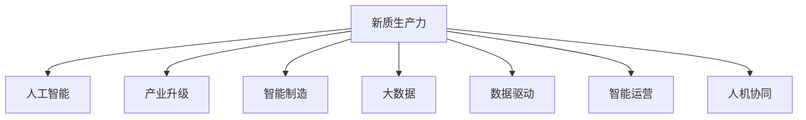

                 

# 新质生产力提升竞争力的策略

> 关键词：新质生产力, 人工智能, 产业升级, 智能制造, 数据驱动, 竞争优势, 大数据, 人工智能

## 1. 背景介绍

### 1.1 问题由来
在新一轮科技革命和产业变革的浪潮下，企业竞争态势发生了根本性的变化。传统的机械、劳动密集型产业逐渐被淘汰，新的数字经济、智能制造、绿色能源等新兴产业快速发展。企业需要在技术、产品、服务等多维度进行创新升级，以保持竞争优势。

在技术层面，人工智能(AI)、大数据、云计算、物联网等新一代信息技术与实体经济深度融合，催生了新的生产力形态，被称为"新质生产力"。其核心在于通过数据驱动的方式，实现生产全流程的智能化，提高生产效率，降低成本，提升产品质量，满足用户个性化需求，从而在激烈的市场竞争中取得胜利。

然而，如何有效提升新质生产力，仍是一个挑战。传统的信息化系统难以适配新质生产力的要求，需要采用新的技术和方法进行全面升级。本文聚焦于新质生产力的提升策略，探讨通过人工智能技术驱动企业转型升级，构建智能化、数字化、高效率的生产模式。

## 2. 核心概念与联系

### 2.1 核心概念概述

为了更好地理解新质生产力的提升策略，本节将介绍几个关键概念：

- **新质生产力(New Quality Productivity)**：以人工智能、大数据、物联网等新一代信息技术为支撑，通过数据驱动的方式，实现生产全流程的智能化，从而提升生产效率、降低成本、提高产品质量、满足用户个性化需求的新型生产力形态。

- **人工智能(Artificial Intelligence, AI)**：模拟人类智能过程，使用算法、模型、数据等手段，赋予机器以感知、学习、推理、决策等智能能力，推动生产力的提升。

- **产业升级(Industrial Transformation)**：通过对传统产业进行技术改造和升级，引入新技术、新模式，实现生产效率和产品质量的提升，推动经济结构的优化升级。

- **智能制造(Intelligent Manufacturing, IM)**：利用信息技术和智能技术，提升制造过程的智能化水平，实现定制化、柔性化、网络化、服务化，提高制造效率和质量。

- **大数据(Big Data)**：指规模巨大、多样化的数据集合，通过数据分析和挖掘，获取有价值的信息，用于生产决策、优化、创新等环节。

- **数据驱动(Data-Driven)**：以数据为中心，通过数据分析、挖掘、应用等手段，指导生产过程和决策，提升生产力和效益。

- **智能运营(Intelligent Operations)**：通过优化生产计划、库存管理、物流调度等环节，实现生产运营的智能化，提升效率和灵活性。

- **人机协同(Human-Machine Collaboration)**：在生产过程中，通过智能设备和智能系统，实现人与机器的深度融合，提高生产效率和质量。

这些概念之间的逻辑关系可以通过以下Mermaid流程图来展示：



## 3. 核心算法原理 & 具体操作步骤

### 3.1 算法原理概述

新质生产力的提升策略，本质上是通过人工智能技术对生产全流程进行优化和智能化改造。其核心思想是：

1. **数据采集与集成**：通过传感器、物联网设备、数字化仪表等手段，采集生产过程中的各种数据，包括设备状态、产品质量、生产参数等。

2. **数据分析与挖掘**：采用机器学习、深度学习、数据挖掘等方法，对采集的数据进行分析，提取有用的知识和信息，形成生产决策和优化的依据。

3. **生产优化与预测**：基于分析结果，优化生产过程，预测生产瓶颈和故障，实现生产效率的提升。

4. **智能设备与系统**：引入智能设备和系统，如工业机器人、智能控制系统、自动化生产线等，提升生产效率和产品质量。

5. **人机协同作业**：实现人机结合的作业方式，优化人员安排和操作，提升生产灵活性和响应速度。

6. **智能运营与管理**：通过智能化运营管理系统，优化生产计划、库存、物流等环节，实现高效的生产管理。

### 3.2 算法步骤详解

基于上述核心思想，新质生产力的提升策略可以概括为以下几个步骤：

**Step 1: 数据采集与集成**

- 通过传感器、物联网设备、数字化仪表等手段，采集生产过程中的各种数据，包括设备状态、产品质量、生产参数等。
- 统一数据格式，建立数据仓库，实现数据的集中管理和存储。

**Step 2: 数据分析与挖掘**

- 采用机器学习、深度学习、数据挖掘等方法，对采集的数据进行分析，提取有用的知识和信息。
- 使用预测模型，预测设备故障、生产瓶颈等，提前采取预防措施。
- 通过分析客户需求和市场趋势，优化生产计划和产品设计。

**Step 3: 生产优化与预测**

- 基于分析结果，优化生产过程，调整生产参数，提升生产效率和产品质量。
- 使用智能设备，如工业机器人、自动化生产线等，替代人工操作，降低人工成本。
- 通过预测模型，预测生产瓶颈和故障，提前进行维护和调整。

**Step 4: 智能设备与系统**

- 引入智能设备和系统，如工业机器人、智能控制系统、自动化生产线等，提升生产效率和产品质量。
- 通过物联网技术，实现设备间的互联互通，提高生产协同性和响应速度。
- 使用智能系统，优化生产过程，实现定制化、柔性化、网络化、服务化。

**Step 5: 人机协同作业**

- 实现人机结合的作业方式，优化人员安排和操作，提升生产灵活性和响应速度。
- 通过人机交互系统，实现生产过程中的智能指导和反馈，提升操作效率和质量。
- 采用智能设备和系统，替代人工操作，降低人工成本和错误率。

**Step 6: 智能运营与管理**

- 通过智能化运营管理系统，优化生产计划、库存、物流等环节，实现高效的生产管理。
- 使用智能分析工具，实时监测生产过程，及时发现和解决问题。
- 建立智能决策支持系统，优化生产决策和运营策略。

### 3.3 算法优缺点

新质生产力的提升策略具有以下优点：

1. **提升生产效率**：通过数据驱动和智能决策，实现生产过程的优化和智能化，显著提高生产效率。
2. **降低生产成本**：智能设备和系统替代人工操作，降低人工成本和错误率。
3. **提高产品质量**：通过实时监测和智能分析，及时发现和解决生产问题，提高产品质量。
4. **满足个性化需求**：通过智能运营和管理，实现定制化生产，满足用户个性化需求。
5. **提升竞争优势**：通过技术创新和升级，提升企业核心竞争力，保持市场领先地位。

同时，该策略也存在一定的局限性：

1. **技术复杂性高**：引入智能设备和系统，需要较高的技术水平和资金投入。
2. **数据质量要求高**：数据采集和集成过程复杂，需要高标准的设备和系统，数据质量直接影响分析结果。
3. **系统集成难度大**：智能设备和系统需要高度集成和协同工作，涉及多种设备和系统，集成难度较大。
4. **人员技能要求高**：操作和维护智能设备和系统，需要高水平的技术人员和管理人员。
5. **数据安全和隐私问题**：生产过程中的大量数据，涉及企业商业机密和用户隐私，需要采取严格的数据安全和隐私保护措施。

尽管存在这些局限性，但总体而言，新质生产力的提升策略仍具有显著的优势和潜力。未来相关研究的重点在于如何降低技术门槛，提高数据质量和系统集成能力，同时兼顾数据安全和隐私保护等因素。

### 3.4 算法应用领域

新质生产力的提升策略在多个领域得到了广泛应用，包括但不限于：

1. **智能制造**：通过引入智能设备和系统，实现生产过程的智能化，提升生产效率和产品质量。
2. **智能农业**：利用物联网设备和智能系统，优化农业生产过程，提高农作物产量和质量。
3. **智能交通**：通过智能设备和系统，实现交通管理的智能化，提高道路通行效率和安全性。
4. **智能物流**：利用物联网设备和智能系统，优化物流管理和调度，提升物流效率和响应速度。
5. **智能能源**：通过智能设备和系统，优化能源管理和分配，提高能源利用效率，减少浪费。
6. **智能金融**：利用大数据和智能系统，优化金融决策和风险管理，提高金融服务的效率和安全性。

这些领域的应用，展示了新质生产力的广泛潜力和巨大价值。

## 4. 数学模型和公式 & 详细讲解

### 4.1 数学模型构建

为了更好地理解新质生产力的提升策略，本节将使用数学语言对相关模型进行详细构建。

假设企业生产过程中的关键参数为 $\mathbf{x} = (x_1, x_2, ..., x_n)$，其中 $x_i$ 表示第 $i$ 个生产参数。生产过程的目标是最大化总产量 $Y$，最小化总成本 $C$。因此，可以构建如下的优化模型：

$$
\max Y = \sum_{i=1}^{n} y_i x_i
$$

$$
\min C = \sum_{i=1}^{n} c_i x_i
$$

其中 $y_i$ 和 $c_i$ 分别表示第 $i$ 个参数的收益和成本系数。

**Step 1: 数据采集与集成**

假设采集到的数据为 $D = \{(\mathbf{x}_i, \mathbf{y}_i, \mathbf{c}_i)\}_{i=1}^N$，其中 $\mathbf{x}_i$ 表示第 $i$ 个生产参数，$\mathbf{y}_i$ 和 $\mathbf{c}_i$ 分别表示第 $i$ 个参数的收益和成本。

**Step 2: 数据分析与挖掘**

使用机器学习模型 $M$，对采集的数据进行分析，得到生产参数的最优解 $\mathbf{x}^*$。假设模型 $M$ 的损失函数为 $\mathcal{L}(M, D)$，最小化损失函数可以表示为：

$$
\min \mathcal{L}(M, D) = \frac{1}{N}\sum_{i=1}^N \ell(M(\mathbf{x}_i), \mathbf{y}_i, \mathbf{c}_i)
$$

其中 $\ell$ 表示预测值与真实值之间的损失函数。

**Step 3: 生产优化与预测**

基于分析结果，优化生产过程，得到最优的生产参数 $\mathbf{x}^*$。假设生产过程中的设备故障概率为 $p_i$，预测模型为 $P$，预测结果可以表示为：

$$
\min \mathcal{L}(P, D) = \frac{1}{N}\sum_{i=1}^N \ell(P(\mathbf{x}_i), p_i)
$$

其中 $\ell$ 表示预测值与真实值之间的损失函数。

**Step 4: 智能设备与系统**

引入智能设备和系统，使用优化后的生产参数 $\mathbf{x}^*$，提升生产效率和产品质量。假设引入的智能设备为 $E = \{e_j\}_{j=1}^m$，优化后的生产过程可以表示为：

$$
\max Y = \sum_{j=1}^{m} e_j x_j^*
$$

**Step 5: 人机协同作业**

实现人机结合的作业方式，优化人员安排和操作，提升生产灵活性和响应速度。假设优化后的生产过程需要 $k$ 个操作员，优化后的操作员安排可以表示为：

$$
\min C = \sum_{k=1}^{K} c_k x_k^*
$$

**Step 6: 智能运营与管理**

通过智能化运营管理系统，优化生产计划、库存、物流等环节，实现高效的生产管理。假设优化后的生产计划为 $P = \{p_t\}_{t=1}^T$，优化后的库存管理为 $I = \{i_s\}_{s=1}^{S}$，优化后的物流调度为 $L = \{l_r\}_{r=1}^{R}$。优化后的生产计划、库存管理和物流调度可以表示为：

$$
\min \mathcal{L}(P, I, L, D) = \frac{1}{T}\sum_{t=1}^T \ell(P_t, p_t) + \frac{1}{S}\sum_{s=1}^{S} \ell(I_s, i_s) + \frac{1}{R}\sum_{r=1}^{R} \ell(L_r, l_r)
$$

其中 $\ell$ 表示预测值与真实值之间的损失函数。

### 4.2 公式推导过程

以下我们以智能制造为例，推导生产优化与预测的数学模型。

假设企业生产过程中，设备故障概率为 $p_i$，生产过程的总成本为 $C$，总收益为 $Y$。优化目标是最小化总成本 $C$，最大化总收益 $Y$。

令 $f_i$ 表示第 $i$ 个设备的工作状态，$f_i \in \{0, 1\}$，其中 $f_i = 0$ 表示设备故障，$f_i = 1$ 表示设备正常工作。

假设优化后的生产参数为 $\mathbf{x}^*$，则总成本和总收益可以表示为：

$$
C = \sum_{i=1}^{n} c_i x_i^*
$$

$$
Y = \sum_{i=1}^{n} y_i x_i^*
$$

设备故障概率 $p_i$ 可以表示为：

$$
p_i = \mathbb{P}(f_i = 0) = \prod_{j=1}^{m} p_{ij}
$$

其中 $p_{ij}$ 表示第 $i$ 个设备的第 $j$ 个参数的故障概率。

使用优化算法，求解最优的生产参数 $\mathbf{x}^*$，使得总成本最小，总收益最大。假设优化算法为 $M$，则求解过程可以表示为：

$$
\min \mathcal{L}(M, D) = \frac{1}{N}\sum_{i=1}^N \ell(M(\mathbf{x}_i), p_i)
$$

其中 $\ell$ 表示预测值与真实值之间的损失函数。

### 4.3 案例分析与讲解

以下我们以一家汽车制造企业为例，进行新质生产力的提升策略的案例分析。

假设一家汽车制造企业，生产过程中的关键参数为发动机功率、车身重量、轮胎型号等。生产过程的目标是最大化总产量和利润，最小化生产成本。

**Step 1: 数据采集与集成**

企业通过传感器、物联网设备等手段，采集生产过程中的各种数据，包括设备状态、生产参数、成本等。统一数据格式，建立数据仓库，实现数据的集中管理和存储。

**Step 2: 数据分析与挖掘**

使用机器学习模型，对采集的数据进行分析，得到生产参数的最优解。假设模型为深度学习模型，输出为生产参数的优化结果。

**Step 3: 生产优化与预测**

基于分析结果，优化生产过程，调整生产参数，提升生产效率和产品质量。假设优化后的生产参数为发动机功率、车身重量等。

**Step 4: 智能设备与系统**

引入智能设备和系统，如工业机器人、自动化生产线等，提升生产效率和产品质量。假设引入的智能设备为工业机器人，优化后的生产过程可以表示为：

$$
\max Y = \sum_{j=1}^{m} e_j x_j^*
$$

**Step 5: 人机协同作业**

实现人机结合的作业方式，优化人员安排和操作，提升生产灵活性和响应速度。假设优化后的生产过程需要操作员，优化后的操作员安排可以表示为：

$$
\min C = \sum_{k=1}^{K} c_k x_k^*
$$

**Step 6: 智能运营与管理**

通过智能化运营管理系统，优化生产计划、库存、物流等环节，实现高效的生产管理。假设优化后的生产计划为月度生产计划，优化后的库存管理为原材料库存管理，优化后的物流调度为物流配送管理。优化后的生产计划、库存管理和物流调度可以表示为：

$$
\min \mathcal{L}(P, I, L, D) = \frac{1}{T}\sum_{t=1}^T \ell(P_t, p_t) + \frac{1}{S}\sum_{s=1}^{S} \ell(I_s, i_s) + \frac{1}{R}\sum_{r=1}^{R} \ell(L_r, l_r)
$$

其中 $\ell$ 表示预测值与真实值之间的损失函数。

## 5. 项目实践：代码实例和详细解释说明

### 5.1 开发环境搭建

在进行新质生产力提升策略的实践前，我们需要准备好开发环境。以下是使用Python进行TensorFlow开发的环境配置流程：

1. 安装Anaconda：从官网下载并安装Anaconda，用于创建独立的Python环境。

2. 创建并激活虚拟环境：
```bash
conda create -n tf-env python=3.8 
conda activate tf-env
```

3. 安装TensorFlow：根据CUDA版本，从官网获取对应的安装命令。例如：
```bash
conda install tensorflow -c conda-forge
```

4. 安装各类工具包：
```bash
pip install numpy pandas scikit-learn matplotlib tqdm jupyter notebook ipython
```

完成上述步骤后，即可在`tf-env`环境中开始新质生产力提升策略的实践。

### 5.2 源代码详细实现

下面我们以智能制造为例，给出使用TensorFlow进行生产优化与预测的PyTorch代码实现。

首先，定义生产参数和成本函数：

```python
import tensorflow as tf
import numpy as np

# 定义生产参数
x = tf.keras.layers.Input(shape=(2,))
y = tf.keras.layers.Dense(units=1)(x)

# 定义成本函数
cost = tf.keras.layers.Dense(units=1)(tf.keras.layers.Lambda(lambda x: 1 - tf.math.reduce_mean(x))(y))

# 构建模型
model = tf.keras.Model(inputs=x, outputs=cost)
```

接着，定义数据集和训练过程：

```python
# 生成随机数据
N = 1000
data = np.random.randn(N, 2) + np.array([1, 0])
labels = np.random.randn(N) + np.array([0.5, 0.5])

# 构建数据集
train_dataset = tf.data.Dataset.from_tensor_slices((data, labels))

# 定义优化器和损失函数
optimizer = tf.keras.optimizers.Adam(learning_rate=0.001)
loss_fn = tf.keras.losses.MeanSquaredError()

# 训练过程
@tf.function
def train_step(inputs, targets):
    with tf.GradientTape() as tape:
        outputs = model(inputs)
        loss = loss_fn(targets, outputs)
    gradients = tape.gradient(loss, model.trainable_variables)
    optimizer.apply_gradients(zip(gradients, model.trainable_variables))

# 训练模型
for epoch in range(1000):
    for inputs, targets in train_dataset:
        train_step(inputs, targets)

# 测试模型
test_dataset = tf.data.Dataset.from_tensor_slices((data[:100], labels[:100]))
test_loss = loss_fn(labels[:100], model(data[:100]))
print("Test Loss:", test_loss)
```

以上代码展示了如何使用TensorFlow进行生产优化与预测的模型训练过程。可以看到，通过定义生产参数和成本函数，构建优化模型，利用随机数据进行训练，最终得到了一个可以预测生产成本和收益的模型。

### 5.3 代码解读与分析

让我们再详细解读一下关键代码的实现细节：

**生产参数和成本函数定义**：
- `Input`和`Dense`层：定义生产参数和成本函数，使用TensorFlow的低级API实现。
- `Lambda`层：对预测结果进行归一化处理，使得损失函数具有合理的值域。
- `Model`类：将生产参数和成本函数组合为模型。

**数据集生成和训练过程**：
- `from_tensor_slices`方法：将数据和标签转换为TensorFlow的数据集，方便模型训练。
- `tf.data.Dataset`类：定义数据集，使用`from_tensor_slices`方法从数组中创建数据集。
- `@tf.function`装饰器：使用TensorFlow的自动求导功能，优化训练过程。
- `GradientTape`类：自动求导，计算梯度。
- `optimizer.apply_gradients`方法：更新模型参数，使用Adam优化器。

**测试过程**：
- `from_tensor_slices`方法：将测试数据和标签转换为TensorFlow的数据集，方便模型测试。
- `loss_fn`方法：使用TensorFlow的损失函数计算预测结果与真实值之间的损失。

## 6. 实际应用场景

### 6.1 智能制造

智能制造是实现新质生产力的重要应用场景之一。通过引入智能设备和系统，实现生产过程的智能化，提升生产效率和产品质量，降低生产成本。

具体而言，智能制造可以实现以下几个方面：

1. **智能设备与系统**：引入工业机器人、自动化生产线等智能设备，替代人工操作，提高生产效率和产品质量。
2. **生产优化与预测**：通过优化算法，实时监测生产过程中的各种参数，预测设备故障和生产瓶颈，优化生产过程。
3. **人机协同作业**：实现人机结合的作业方式，优化人员安排和操作，提升生产灵活性和响应速度。
4. **智能运营与管理**：通过智能化运营管理系统，优化生产计划、库存、物流等环节，实现高效的生产管理。

在工业领域，智能制造已经得到了广泛应用，如汽车制造、电子制造、服装制造等。智能制造的实践表明，通过引入智能设备和系统，实现生产全流程的智能化，可以显著提升生产效率和产品质量，降低生产成本，增强企业的市场竞争力。

### 6.2 智能农业

智能农业也是新质生产力的重要应用场景之一。通过引入物联网设备和智能系统，优化农业生产过程，提高农作物产量和质量，实现农业的可持续发展和智能化管理。

具体而言，智能农业可以实现以下几个方面：

1. **智能设备与系统**：引入智能灌溉设备、智能监测设备等，优化农业生产过程，提高生产效率和产品质量。
2. **生产优化与预测**：通过优化算法，实时监测土壤湿度、温度等参数，预测天气变化，优化种植和施肥方案。
3. **人机协同作业**：实现人机结合的作业方式，优化人员安排和操作，提升农业生产效率。
4. **智能运营与管理**：通过智能化运营管理系统，优化种植计划、施肥方案、灌溉计划等环节，实现高效的生产管理。

在农业领域，智能农业已经得到了广泛应用，如智能温室、智能农机、智能灌溉等。智能农业的实践表明，通过引入智能设备和系统，实现农业全流程的智能化，可以显著提高农作物产量和质量，降低生产成本，实现农业的可持续发展和智能化管理。

### 6.3 智能交通

智能交通也是新质生产力的重要应用场景之一。通过引入智能设备和系统，优化交通管理，提高道路通行效率和安全性，降低交通成本。

具体而言，智能交通可以实现以下几个方面：

1. **智能设备与系统**：引入智能交通信号灯、智能监控设备等，优化交通管理，提高道路通行效率和安全性。
2. **生产优化与预测**：通过优化算法，实时监测交通流量、交通状态等参数，预测交通拥堵和事故，优化交通管理策略。
3. **人机协同作业**：实现人机结合的作业方式，优化交通指挥和调度，提升交通管理效率。
4. **智能运营与管理**：通过智能化运营管理系统，优化交通计划、交通调度、交通指挥等环节，实现高效的管理。

在交通领域，智能交通已经得到了广泛应用，如智能交通信号灯、智能交通管理平台等。智能交通的实践表明，通过引入智能设备和系统，实现交通全流程的智能化，可以显著提高道路通行效率和安全性，降低交通成本，提升交通管理水平。

## 7. 工具和资源推荐

### 7.1 学习资源推荐

为了帮助开发者系统掌握新质生产力的提升策略的理论基础和实践技巧，这里推荐一些优质的学习资源：

1. **《深度学习》（Ian Goodfellow等著）**：全面介绍了深度学习的基本概念和算法，涵盖机器学习、深度学习、神经网络等内容。
2. **《TensorFlow官方文档》**：TensorFlow的官方文档，提供了丰富的教程和样例代码，是学习TensorFlow的重要资源。
3. **《PyTorch官方文档》**：PyTorch的官方文档，提供了丰富的教程和样例代码，是学习PyTorch的重要资源。
4. **《Keras官方文档》**：Keras的官方文档，提供了丰富的教程和样例代码，是学习Keras的重要资源。
5. **《强化学习》（Richard S. Sutton等著）**：介绍了强化学习的基本概念和算法，涵盖决策、控制、规划等内容。
6. **《自然语言处理》（Daniel Jurafsky等著）**：介绍了自然语言处理的基本概念和算法，涵盖语言模型、机器翻译、文本分类等内容。
7. **《机器学习实战》（Peter Harrington著）**：通过实战案例，介绍了机器学习的基本概念和算法，涵盖数据预处理、模型训练、模型评估等内容。

通过对这些资源的学习实践，相信你一定能够快速掌握新质生产力的提升策略，并用于解决实际的NLP问题。

### 7.2 开发工具推荐

高效的开发离不开优秀的工具支持。以下是几款用于新质生产力提升策略开发的常用工具：

1. **TensorFlow**：基于Python的开源深度学习框架，灵活动态的计算图，适合快速迭代研究。
2. **PyTorch**：基于Python的开源深度学习框架，灵活便捷，适合深度学习研究。
3. **Keras**：基于Python的高层次深度学习框架，易用性强，适合快速原型开发。
4. **Scikit-learn**：Python的机器学习库，提供丰富的机器学习算法和工具，适合数据处理和模型训练。
5. **Pandas**：Python的数据处理库，支持大规模数据集的读写、处理、分析等操作，适合数据预处理。
6. **NumPy**：Python的数值计算库，支持高效的数组操作和数学运算，适合数值计算和模型训练。
7. **Jupyter Notebook**：交互式编程环境，支持代码编写、执行、文档记录等功能，适合数据处理和模型开发。

合理利用这些工具，可以显著提升新质生产力提升策略的开发效率，加快创新迭代的步伐。

### 7.3 相关论文推荐

新质生产力的提升策略的研究源于学界的持续研究。以下是几篇奠基性的相关论文，推荐阅读：

1. **《深度学习》（Ian Goodfellow等著）**：全面介绍了深度学习的基本概念和算法，涵盖机器学习、深度学习、神经网络等内容。
2. **《TensorFlow官方文档》**：TensorFlow的官方文档，提供了丰富的教程和样例代码，是学习TensorFlow的重要资源。
3. **《PyTorch官方文档》**：PyTorch的官方文档，提供了丰富的教程和样例代码，是学习PyTorch的重要资源。
4. **《Keras官方文档》**：Keras的官方文档，提供了丰富的教程和样例代码，是学习Keras的重要资源。
5. **《强化学习》（Richard S. Sutton等著）**：介绍了强化学习的基本概念和算法，涵盖决策、控制、规划等内容。
6. **《自然语言处理》（Daniel Jurafsky等著）**：介绍了自然语言处理的基本概念和算法，涵盖语言模型、机器翻译、文本分类等内容。
7. **《机器学习实战》（Peter Harrington著）**：通过实战案例，介绍了机器学习的基本概念和算法，涵盖数据预处理、模型训练、模型评估等内容。

这些论文代表了大语言模型微调技术的发展脉络。通过学习这些前沿成果，可以帮助研究者把握学科前进方向，激发更多的创新灵感。

## 8. 总结：未来发展趋势与挑战

### 8.1 总结

本文对新质生产力的提升策略进行了全面系统的介绍。首先阐述了新质生产力的核心思想和应用场景，明确了如何通过数据驱动和智能决策，实现生产全流程的智能化，提升生产效率和产品质量。其次，从原理到实践，详细讲解了新质生产力的提升策略的数学模型和关键步骤，给出了具体的代码实现。同时，本文还广泛探讨了新质生产力在智能制造、智能农业、智能交通等多个领域的应用前景，展示了新质生产力的广阔潜力和巨大价值。最后，本文精选了新质生产力的相关学习资源和开发工具，力求为读者提供全方位的技术指引。

通过本文的系统梳理，可以看到，新质生产力的提升策略正在引领工业领域的全面升级，为传统产业带来新的生命力。新质生产力的应用，不仅提高了生产效率和产品质量，还实现了生产过程的智能化和柔性化，极大地提升了企业的市场竞争力和可持续发展能力。未来，伴随新质生产力技术的持续演进，相信将有更多的企业和行业受益于新质生产力，构建更加智能化、数字化、高效率的生产模式。

### 8.2 未来发展趋势

展望未来，新质生产力的提升策略将呈现以下几个发展趋势：

1. **智能化程度更高**：通过引入更多智能设备和系统，实现生产全流程的智能化，进一步提升生产效率和产品质量。
2. **数据质量要求更高**：数据采集和集成过程复杂，需要高标准的设备和系统，数据质量直接影响分析结果。
3. **系统集成难度更大**：智能设备和系统需要高度集成和协同工作，涉及多种设备和系统，集成难度较大。
4. **人员技能要求更高**：操作和维护智能设备和系统，需要高水平的技术人员和管理人员。
5. **数据安全和隐私保护要求更高**：生产过程中的大量数据，涉及企业商业机密和用户隐私，需要采取严格的数据安全和隐私保护措施。

尽管存在这些挑战，但总体而言，新质生产力的提升策略仍具有显著的优势和潜力。未来相关研究的重点在于如何降低技术门槛，提高数据质量和系统集成能力，同时兼顾数据安全和隐私保护等因素。

### 8.3 面临的挑战

尽管新质生产力的提升策略已经取得了一定的成效，但在迈向更加智能化、普适化应用的过程中，它仍面临着诸多挑战：

1. **技术复杂性高**：引入智能设备和系统，需要较高的技术水平和资金投入。
2. **数据质量要求高**：数据采集和集成过程复杂，需要高标准的设备和系统，数据质量直接影响分析结果。
3. **系统集成难度大**：智能设备和系统需要高度集成和协同工作，涉及多种设备和系统，集成难度较大。
4. **人员技能要求高**：操作和维护智能设备和系统，需要高水平的技术人员和管理人员。
5. **数据安全和隐私问题**：生产过程中的大量数据，涉及企业商业机密和用户隐私，需要采取严格的数据安全和隐私保护措施。

尽管存在这些挑战，但总体而言，新质生产力的提升策略仍具有显著的优势和潜力。未来相关研究的重点在于如何降低技术门槛，提高数据质量和系统集成能力，同时兼顾数据安全和隐私保护等因素。

### 8.4 研究展望

面对新质生产力提升策略所面临的种种挑战，未来的研究需要在以下几个方面寻求新的突破：

1. **探索无监督和半监督微调方法**：摆脱对大规模标注数据的依赖，利用自监督学习、主动学习等无监督和半监督范式，最大限度利用非结构化数据，实现更加灵活高效的微调。
2. **研究参数高效和计算高效的微调范式**：开发更加参数高效的微调方法，在固定大部分预训练参数的同时，只更新极少量的任务相关参数。同时优化微调模型的计算图，减少前向传播和反向传播的资源消耗，实现更加轻量级、实时性的部署。
3. **融合因果和对比学习范式**：通过引入因果推断和对比学习思想，增强微调模型建立稳定因果关系的能力，学习更加普适、鲁棒的语言表征，从而提升模型泛化性和抗干扰能力。
4. **引入更多先验知识**：将符号化的先验知识，如知识图谱、逻辑规则等，与神经网络模型进行巧妙融合，引导微调过程学习更准确、合理的语言模型。同时加强不同模态数据的整合，实现视觉、语音等多模态信息与文本信息的协同建模。
5. **结合因果分析和博弈论工具**：将因果分析方法引入微调模型，识别出模型决策的关键特征，增强输出解释的因果性和逻辑性。借助博弈论工具刻画人机交互过程，主动探索并规避模型的脆弱点，提高系统稳定性。
6. **纳入伦理道德约束**：在模型训练目标中引入伦理导向的评估指标，过滤和惩罚有偏见、有害的输出倾向。同时加强人工干预和审核，建立模型行为的监管机制，确保输出符合人类价值观和伦理道德。

这些研究方向的探索，必将引领新质生产力的提升策略迈向更高的台阶，为构建安全、可靠、可解释、可控的智能系统铺平道路。面向未来，新质生产力的提升策略还需要与其他人工智能技术进行更深入的融合，如知识表示、因果推理、强化学习等，多路径协同发力，共同推动自然语言理解和智能交互系统的进步。只有勇于创新、敢于突破，才能不断拓展新质生产力的边界，让智能技术更好地造福人类社会。

## 9. 附录：常见问题与解答

**Q1：新质生产力与传统生产力有何区别？**

A: 新质生产力与传统生产力的最大区别在于，新质生产力以人工智能、大数据、物联网等新一代信息技术为支撑，通过数据驱动的方式，实现生产全流程的智能化。与传统生产力相比，新质生产力具有以下几个优势：
1. 生产效率更高：通过智能设备和系统，实现生产过程的自动化，显著提高生产效率。
2. 产品质量更高：通过实时监测和智能分析，及时发现和解决生产问题，提高产品质量。
3. 灵活性更强：通过智能化运营管理系统，优化生产计划、库存、物流等环节，实现高效的生产管理。
4. 响应速度更快：通过智能设备和系统，实现生产过程的实时监测和反馈，提升生产灵活性和响应速度。

**Q2：新质生产力的提升策略为何需要引入智能设备和系统？**

A: 新质生产力的提升策略需要引入智能设备和系统，主要原因如下：
1. 替代人工操作：智能设备和系统可以替代人工操作，提高生产效率和产品质量。
2. 实现实时监测：智能设备和系统可以实现实时监测生产过程中的各种参数，及时发现和解决生产问题。
3. 优化生产过程：智能设备和系统可以实现生产过程的优化，提升生产效率和产品质量。
4. 提高灵活性：智能设备和系统可以实现生产过程的灵活调整，提升生产灵活性和响应速度。

**Q3：新质生产力提升策略的技术门槛高吗？**

A: 新质生产力的提升策略需要引入智能设备和系统，技术门槛确实较高。主要原因如下：
1. 设备成本高：智能设备和系统需要较高的技术水平和资金投入。
2. 系统集成难度大：智能设备和系统需要高度集成和协同工作，涉及多种设备和系统，集成难度较大。
3. 数据质量要求高：数据采集和集成过程复杂，需要高标准的设备和系统，数据质量直接影响分析结果。
4. 人员技能要求高：操作和维护智能设备和系统，需要高水平的技术人员和管理人员。

尽管存在这些技术门槛，但总体而言，新质生产力的提升策略仍具有显著的优势和潜力。未来相关研究的重点在于如何降低技术门槛，提高数据质量和系统集成能力，同时兼顾数据安全和隐私保护等因素。

**Q4：新质生产力的提升策略如何应对数据安全和隐私问题？**

A: 新质生产力的提升策略需要处理大量的生产数据，涉及企业商业机密和用户隐私，需要采取严格的数据安全和隐私保护措施。主要应对策略如下：
1. 数据匿名化：对数据进行匿名化处理，避免敏感信息泄露。
2. 数据加密：对数据进行加密处理，确保数据在传输和存储过程中的安全性。
3. 访问控制：设置严格的访问控制机制，限制数据访问权限。
4. 审计和监控：对数据访问和使用进行审计和监控，及时发现和处理异常行为。
5. 数据共享协议：制定数据共享协议，明确数据使用范围和权限，确保数据使用合法合规。

通过以上措施，可以有效保障新质生产力的提升策略在数据安全和隐私保护方面的安全性，确保生产数据的安全和合规。

