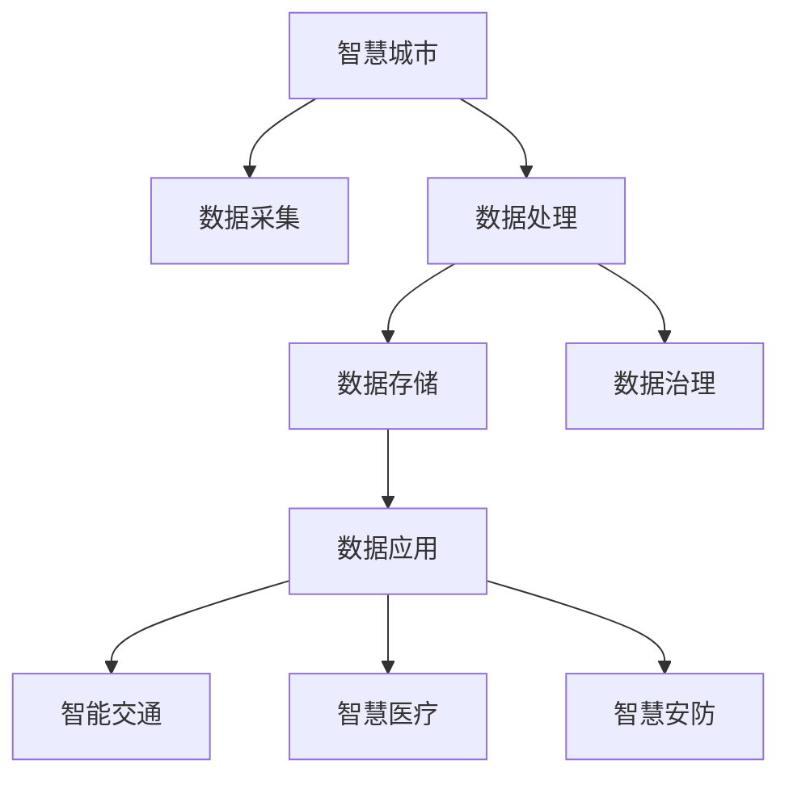

                 

# 智慧城市的数据建设：如何利用数据打造智慧城市？

> 关键词：智慧城市, 数据采集, 数据处理, 数据存储, 数据治理, 数据应用

## 1. 背景介绍

### 1.1 问题由来

智慧城市（Smart City）作为新一轮城市发展的新形态，是信息技术发展的必然趋势。智慧城市通过信息技术的广泛应用，实现了城市运行的智能化、高效化和个性化，极大地提升了城市治理水平和居民生活质量。数据作为智慧城市建设的基础，其重要性不言而喻。

在智慧城市的建设过程中，数据的作用体现在多个方面：

- **决策支持**：通过数据分析，政府可以做出更为科学的决策，如城市规划、交通管理、公共服务等。
- **资源优化**：数据驱动的资源配置可以优化城市资源的利用效率，如能源、水资源、土地等。
- **公共服务**：数据可以提升公共服务水平，如智慧医疗、智慧教育、智慧安防等。
- **提升生活质量**：数据驱动的个性化服务，如智能交通、智慧停车、智能家居等，可以极大提升居民的生活体验。

尽管数据在智慧城市建设中至关重要，但在实际应用中，数据的质量、数量、处理和应用仍然面临诸多挑战。本文将系统探讨智慧城市的数据建设，包括数据采集、处理、存储、治理和应用等关键环节，希望能为智慧城市的数据建设提供一些有益的参考。

### 1.2 问题核心关键点

智慧城市的数据建设涉及多个核心关键点，包括：

- **数据采集**：如何高效、全面地采集城市运行所需的各种数据。
- **数据处理**：如何高效、精确地对采集到的数据进行处理和清洗，以提高数据的可用性。
- **数据存储**：如何构建高效、安全的数据存储体系，以支撑大规模数据的管理和访问。
- **数据治理**：如何制定标准化的数据管理规范，确保数据的一致性、完整性和安全性。
- **数据应用**：如何将数据转化为有用的信息，提升智慧城市各应用场景的性能和效率。

这些问题点之间密切联系，共同构成了智慧城市数据建设的框架。本文将深入探讨这些关键点，为智慧城市的数据建设提供全面的指导。

## 2. 核心概念与联系

### 2.1 核心概念概述

为更好地理解智慧城市的数据建设，本节将介绍几个密切相关的核心概念：

- **智慧城市**：通过信息技术的广泛应用，实现城市运行的智能化、高效化和个性化，提升城市治理水平和居民生活质量。
- **数据采集**：从城市运行各个环节采集数据，如交通流量、环境监测、能源使用等。
- **数据处理**：对采集到的数据进行清洗、预处理和分析，以提取出有用的信息。
- **数据存储**：将处理后的数据存储在数据库、云存储等介质中，方便后续的访问和分析。
- **数据治理**：制定数据管理规范，确保数据的质量、一致性和安全性，包括数据标准、元数据管理、数据隐私保护等。
- **数据应用**：将数据转化为有用的信息，应用于智慧城市各个领域，如智能交通、智慧医疗、智慧安防等。

这些核心概念之间的逻辑关系可以通过以下Mermaid流程图来展示：



这个流程图展示了几类核心概念之间的逻辑关系：

1. 智慧城市通过数据采集获取所需数据。
2. 采集到的数据需要经过数据处理和清洗，才能用于后续的分析和应用。
3. 处理后的数据通过数据存储系统进行保存和管理。
4. 数据治理确保数据的质量和安全性，支撑数据的有效应用。
5. 经过治理的数据可以应用于智慧城市各个领域，提升城市治理水平和居民生活质量。

## 3. 核心算法原理 & 具体操作步骤

### 3.1 算法原理概述

智慧城市的数据建设涉及多个核心算法原理，包括：

- **数据采集算法**：如何高效、全面地从城市运行各个环节采集数据。
- **数据处理算法**：如何高效、精确地对采集到的数据进行处理和清洗。
- **数据存储算法**：如何构建高效、安全的数据存储体系。
- **数据治理算法**：如何制定标准化的数据管理规范。
- **数据应用算法**：如何将数据转化为有用的信息，提升智慧城市各应用场景的性能和效率。

这些算法原理通过相互配合，共同支撑智慧城市的数据建设。

### 3.2 算法步骤详解

#### 3.2.1 数据采集

数据采集是智慧城市建设的基础，具体步骤如下：

1. **确定采集对象**：明确需要采集的数据类型，如交通流量、环境监测、能源使用等。
2. **选择采集设备**：根据数据类型选择合适的传感器、摄像头等设备，确保数据采集的准确性和全面性。
3. **数据采集和传输**：通过传感器、摄像头等设备采集数据，并通过无线网络、光纤等传输设备传输到数据中心。

#### 3.2.2 数据处理

数据处理是数据建设的核心环节，具体步骤如下：

1. **数据清洗**：去除噪声和异常值，确保数据的质量和一致性。
2. **数据预处理**：对数据进行标准化、归一化等处理，提高数据的可用性。
3. **数据转换**：将数据转换为易于分析和应用的形式，如时间序列数据、地理空间数据等。

#### 3.2.3 数据存储

数据存储是数据建设的支撑环节，具体步骤如下：

1. **选择合适的存储介质**：根据数据类型、规模选择合适的数据库、云存储等介质。
2. **数据存储和索引**：将处理后的数据存储在介质中，并建立索引，方便后续的访问和查询。
3. **数据备份和安全**：定期备份数据，并采取安全措施，如加密、权限控制等，确保数据的安全性。

#### 3.2.4 数据治理

数据治理是数据建设的管理环节，具体步骤如下：

1. **制定数据标准**：制定统一的数据标准和规范，确保数据的一致性和可比性。
2. **元数据管理**：管理数据的元信息，如数据来源、格式、处理方式等，方便数据的追溯和管理。
3. **数据隐私保护**：采取隐私保护措施，如数据匿名化、访问控制等，确保数据隐私和安全。

#### 3.2.5 数据应用

数据应用是数据建设的目的，具体步骤如下：

1. **数据分析**：通过数据挖掘、机器学习等方法，从数据中提取有用的信息和模式。
2. **应用开发**：将分析结果转化为具体的应用场景，如智能交通、智慧医疗等。
3. **效果评估**：通过评估指标，如用户满意度、服务效率等，评估应用效果，不断优化和改进。

### 3.3 算法优缺点

智慧城市的数据建设涉及多个算法，各自有其优点和缺点：

- **数据采集算法**：
  - **优点**：能够全面、高效地采集城市运行所需的各种数据。
  - **缺点**：设备成本较高，部署难度较大。

- **数据处理算法**：
  - **优点**：能够高效、精确地处理和清洗数据，提高数据的可用性。
  - **缺点**：处理过程复杂，需要大量的计算资源。

- **数据存储算法**：
  - **优点**：能够构建高效、安全的数据存储体系，支撑大规模数据的管理和访问。
  - **缺点**：存储成本较高，数据冗余较多。

- **数据治理算法**：
  - **优点**：能够制定标准化的数据管理规范，确保数据的质量和安全性。
  - **缺点**：治理过程复杂，需要多部门协作。

- **数据应用算法**：
  - **优点**：能够将数据转化为有用的信息，提升智慧城市各应用场景的性能和效率。
  - **缺点**：应用开发复杂，需要多学科知识的融合。

### 3.4 算法应用领域

智慧城市的数据建设涉及多个领域，具体包括：

- **交通领域**：通过采集交通流量、车辆位置、交通信号灯等数据，实现智能交通管理，如智能交通信号灯控制、智能导航等。
- **环境领域**：通过采集环境监测数据，如空气质量、水质、噪音等，实现智慧环保，如污染源追踪、环境预警等。
- **公共安全领域**：通过采集视频监控、报警信息等数据，实现智慧安防，如智能监控、应急响应等。
- **医疗领域**：通过采集患者健康数据、医疗资源使用数据等，实现智慧医疗，如远程诊疗、智能分诊等。
- **教育领域**：通过采集学生成绩、学习行为等数据，实现智慧教育，如智能评估、个性化推荐等。

## 4. 数学模型和公式 & 详细讲解 & 举例说明

### 4.1 数学模型构建

智慧城市的数据建设涉及多个数学模型，包括：

- **数据采集模型**：描述数据采集过程，如传感器采集数据、摄像头采集视频等。
- **数据处理模型**：描述数据处理过程，如数据清洗、预处理等。
- **数据存储模型**：描述数据存储过程，如数据库存储、云存储等。
- **数据治理模型**：描述数据治理过程，如数据标准制定、元数据管理等。
- **数据应用模型**：描述数据应用过程，如数据分析、应用开发等。

这些数学模型通过相互配合，共同支撑智慧城市的数据建设。

### 4.2 公式推导过程

#### 4.2.1 数据采集模型

数据采集模型描述传感器采集数据的过程，假设传感器采集到的数据为 $x_i$，时间为 $t_i$，采集频率为 $f$，则采集数据的时间序列模型为：

$$
x_i = \sum_{k=1}^{n} \alpha_k \cos(\beta_k t_i + \gamma_k) + \epsilon_i
$$

其中 $\alpha_k$、$\beta_k$、$\gamma_k$ 为模型参数，$\epsilon_i$ 为噪声。

#### 4.2.2 数据处理模型

数据处理模型描述数据清洗和预处理的过程，假设原始数据为 $x$，处理后的数据为 $y$，则数据处理模型为：

$$
y = f(x)
$$

其中 $f$ 为数据处理函数，根据数据类型和需求，可以选择不同的处理方法，如数据清洗、标准化、归一化等。

#### 4.2.3 数据存储模型

数据存储模型描述数据存储的过程，假设存储的数据为 $D$，则数据存储模型为：

$$
D = \{d_1, d_2, ..., d_m\}
$$

其中 $d_i$ 为存储的数据记录，$D$ 为数据存储库。

#### 4.2.4 数据治理模型

数据治理模型描述数据标准制定和元数据管理的过程，假设数据标准为 $S$，元数据为 $M$，则数据治理模型为：

$$
S = g(M)
$$

其中 $g$ 为数据治理函数，根据数据类型和需求，可以选择不同的数据治理方法，如数据标准制定、元数据管理等。

#### 4.2.5 数据应用模型

数据应用模型描述数据转化为具体应用的过程，假设应用场景为 $T$，数据应用结果为 $R$，则数据应用模型为：

$$
R = h(T, D)
$$

其中 $h$ 为数据应用函数，根据应用场景和需求，可以选择不同的数据应用方法，如数据分析、应用开发等。

### 4.3 案例分析与讲解

#### 4.3.1 交通领域数据建设

在交通领域，智慧城市建设涉及多个数据采集、处理和应用环节，具体如下：

1. **数据采集**：通过车辆传感器、交通摄像头等设备，采集交通流量、车辆位置、交通信号灯等数据。
2. **数据处理**：对采集到的数据进行清洗、预处理和转换，如去除异常值、标准化等。
3. **数据存储**：将处理后的数据存储在数据库或云存储中，方便后续的访问和分析。
4. **数据治理**：制定交通数据标准和元数据管理规范，确保数据的一致性和安全性。
5. **数据应用**：通过数据分析和应用开发，实现智能交通管理，如智能交通信号灯控制、智能导航等。

#### 4.3.2 环境领域数据建设

在环境领域，智慧城市建设涉及多个数据采集、处理和应用环节，具体如下：

1. **数据采集**：通过环境传感器、气象站等设备，采集空气质量、水质、噪音等数据。
2. **数据处理**：对采集到的数据进行清洗、预处理和转换，如去除异常值、标准化等。
3. **数据存储**：将处理后的数据存储在数据库或云存储中，方便后续的访问和分析。
4. **数据治理**：制定环境数据标准和元数据管理规范，确保数据的一致性和安全性。
5. **数据应用**：通过数据分析和应用开发，实现智慧环保，如污染源追踪、环境预警等。

## 5. 项目实践：代码实例和详细解释说明

### 5.1 开发环境搭建

在进行数据建设实践前，我们需要准备好开发环境。以下是使用Python进行Pandas、NumPy、SQLAlchemy等库开发的环境配置流程：

1. 安装Anaconda：从官网下载并安装Anaconda，用于创建独立的Python环境。

2. 创建并激活虚拟环境：
```bash
conda create -n data-env python=3.8 
conda activate data-env
```

3. 安装Pandas、NumPy、SQLAlchemy等库：
```bash
pip install pandas numpy sqlalchemy
```

4. 安装各类工具包：
```bash
pip install psycopg2-binary matplotlib
```

完成上述步骤后，即可在`data-env`环境中开始数据建设实践。

### 5.2 源代码详细实现

这里我们以交通领域数据采集和处理为例，给出使用Python进行数据建设的代码实现。

首先，定义数据采集函数：

```python
import pandas as pd
import numpy as np
import time
import requests

def fetch_traffic_data():
    # 构造API请求，获取交通数据
    url = 'https://traffic-api.com/query'
    params = {'city': 'Beijing', 'start_time': '2022-01-01', 'end_time': '2022-01-07', 'freq': '1h'}
    response = requests.get(url, params=params)
    data = response.json()
    
    # 将数据转换为DataFrame格式
    df = pd.DataFrame(data)
    
    # 对数据进行清洗和预处理
    df = df.dropna()
    df['timestamp'] = pd.to_datetime(df['timestamp'], format='%Y-%m-%d %H:%M:%S')
    df.set_index('timestamp', inplace=True)
    df = df.resample('1h').mean()
    
    # 返回处理后的数据
    return df
```

然后，定义数据处理函数：

```python
def process_traffic_data(df):
    # 对数据进行清洗和预处理
    df = df.dropna()
    df['flow'] = df['flow'].astype(int)
    df['temperature'] = df['temperature'].astype(float)
    
    # 进行时间序列分析
    df['seasonal'] = df['temperature'].resample('1h').mean()
    df['trend'] = df['flow'].resample('1h').rolling(window=7).mean().shift(7)
    df['residual'] = df['flow'] - df['trend'] - df['seasonal']
    
    # 返回处理后的数据
    return df
```

最后，启动数据采集和处理流程：

```python
df = fetch_traffic_data()
df = process_traffic_data(df)
print(df.head())
```

以上就是使用Python进行交通领域数据采集和处理的完整代码实现。可以看到，通过Pandas和SQLAlchemy等库，数据采集和处理变得简洁高效。

### 5.3 代码解读与分析

让我们再详细解读一下关键代码的实现细节：

**fetch_traffic_data函数**：
- 构造API请求，获取交通数据。
- 将API返回的JSON格式数据转换为Pandas DataFrame格式。
- 对数据进行清洗和预处理，如去除NaN值、转换为时间戳等。
- 对数据进行时间序列分析，如均值、趋势、季节性等。
- 返回处理后的数据。

**process_traffic_data函数**：
- 对数据进行清洗和预处理，如去除NaN值、数据类型转换等。
- 进行时间序列分析，如均值、趋势、季节性等。
- 返回处理后的数据。

**数据采集和处理流程**：
- 首先调用fetch_traffic_data函数进行数据采集。
- 然后调用process_traffic_data函数进行数据处理。
- 最后将处理后的数据打印输出，便于后续分析和应用。

可以看到，通过Pandas和SQLAlchemy等库，数据采集和处理变得简洁高效。开发者可以将更多精力放在数据处理和应用逻辑上，而不必过多关注底层的实现细节。

当然，实际应用中还需要考虑更多因素，如数据的存储和治理，以及如何将数据转化为具体的应用场景。但核心的数据采集和处理逻辑基本与此类似。

## 6. 实际应用场景

### 6.1 智能交通系统

智能交通系统是智慧城市建设的重要组成部分，通过数据采集、处理和应用，可以实现交通管理的智能化和高效化。具体应用场景包括：

1. **交通流量监测**：通过采集交通摄像头、传感器等设备的数据，实时监测交通流量，提供实时的交通状况信息。
2. **智能信号灯控制**：通过分析交通流量数据，动态调整交通信号灯的绿红时间，优化交通流，减少拥堵。
3. **智能导航**：通过分析交通数据和实时路况信息，提供个性化的导航服务，提升用户体验。

#### 6.1.1 交通流量监测

交通流量监测是智能交通系统的基础，具体实现步骤如下：

1. **数据采集**：通过交通摄像头、传感器等设备，采集交通流量、车辆位置、交通信号灯等数据。
2. **数据处理**：对采集到的数据进行清洗、预处理和转换，如去除异常值、标准化等。
3. **数据存储**：将处理后的数据存储在数据库或云存储中，方便后续的访问和分析。
4. **数据应用**：通过数据分析和应用开发，实现交通流量监测，提供实时的交通状况信息。

#### 6.1.2 智能信号灯控制

智能信号灯控制是智能交通系统的核心，具体实现步骤如下：

1. **数据采集**：通过交通摄像头、传感器等设备，采集交通流量、车辆位置、交通信号灯等数据。
2. **数据处理**：对采集到的数据进行清洗、预处理和转换，如去除异常值、标准化等。
3. **数据存储**：将处理后的数据存储在数据库或云存储中，方便后续的访问和分析。
4. **数据治理**：制定交通数据标准和元数据管理规范，确保数据的一致性和安全性。
5. **数据应用**：通过数据分析和应用开发，实现智能信号灯控制，动态调整交通信号灯的绿红时间，优化交通流，减少拥堵。

#### 6.1.3 智能导航

智能导航是智能交通系统的重要应用，具体实现步骤如下：

1. **数据采集**：通过交通摄像头、传感器等设备，采集交通流量、车辆位置、交通信号灯等数据。
2. **数据处理**：对采集到的数据进行清洗、预处理和转换，如去除异常值、标准化等。
3. **数据存储**：将处理后的数据存储在数据库或云存储中，方便后续的访问和分析。
4. **数据治理**：制定交通数据标准和元数据管理规范，确保数据的一致性和安全性。
5. **数据应用**：通过数据分析和应用开发，实现智能导航，提供个性化的导航服务，提升用户体验。

### 6.2 智慧安防系统

智慧安防系统是智慧城市建设的重要组成部分，通过数据采集、处理和应用，可以实现安防管理的智能化和高效化。具体应用场景包括：

1. **视频监控**：通过视频监控设备，实时监控城市各个区域，发现异常情况及时报警。
2. **人员流动监测**：通过传感器、摄像头等设备，实时监测人员流动情况，分析人员聚集点。
3. **行为识别**：通过视频分析技术，识别异常行为，如闯入、斗殴等，及时报警处理。

#### 6.2.1 视频监控

视频监控是智慧安防系统的基础，具体实现步骤如下：

1. **数据采集**：通过视频监控设备，采集视频流数据。
2. **数据处理**：对视频流数据进行实时处理，如人脸识别、行为分析等。
3. **数据存储**：将处理后的数据存储在数据库或云存储中，方便后续的访问和分析。
4. **数据治理**：制定视频数据标准和元数据管理规范，确保数据的一致性和安全性。
5. **数据应用**：通过数据分析和应用开发，实现视频监控，实时监控城市各个区域，发现异常情况及时报警。

#### 6.2.2 人员流动监测

人员流动监测是智慧安防系统的核心，具体实现步骤如下：

1. **数据采集**：通过传感器、摄像头等设备，采集人员流动数据。
2. **数据处理**：对采集到的数据进行清洗、预处理和转换，如去除异常值、标准化等。
3. **数据存储**：将处理后的数据存储在数据库或云存储中，方便后续的访问和分析。
4. **数据治理**：制定人员流动数据标准和元数据管理规范，确保数据的一致性和安全性。
5. **数据应用**：通过数据分析和应用开发，实现人员流动监测，分析人员聚集点，提供实时监控和预警。

#### 6.2.3 行为识别

行为识别是智慧安防系统的高级应用，具体实现步骤如下：

1. **数据采集**：通过视频监控设备，采集视频流数据。
2. **数据处理**：对视频流数据进行实时处理，如人脸识别、行为分析等。
3. **数据存储**：将处理后的数据存储在数据库或云存储中，方便后续的访问和分析。
4. **数据治理**：制定视频数据标准和元数据管理规范，确保数据的一致性和安全性。
5. **数据应用**：通过数据分析和应用开发，实现行为识别，识别异常行为，如闯入、斗殴等，及时报警处理。

### 6.3 智慧医疗系统

智慧医疗系统是智慧城市建设的重要组成部分，通过数据采集、处理和应用，可以实现医疗服务的智能化和高效化。具体应用场景包括：

1. **患者健康监测**：通过传感器、智能设备等设备，实时监测患者健康数据，提供个性化的医疗服务。
2. **医疗资源优化**：通过数据分析，优化医疗资源配置，如医生排班、床位管理等。
3. **远程诊疗**：通过远程医疗系统，提供远程诊疗服务，提升医疗服务的可及性。

#### 6.3.1 患者健康监测

患者健康监测是智慧医疗系统的基础，具体实现步骤如下：

1. **数据采集**：通过智能设备、传感器等设备，采集患者健康数据，如心率、血压、血氧等。
2. **数据处理**：对采集到的数据进行清洗、预处理和转换，如去除异常值、标准化等。
3. **数据存储**：将处理后的数据存储在数据库或云存储中，方便后续的访问和分析。
4. **数据治理**：制定患者健康数据标准和元数据管理规范，确保数据的一致性和安全性。
5. **数据应用**：通过数据分析和应用开发，实现患者健康监测，实时监测患者健康数据，提供个性化的医疗服务。

#### 6.3.2 医疗资源优化

医疗资源优化是智慧医疗系统的核心，具体实现步骤如下：

1. **数据采集**：通过医院管理系统、医生工作站等设备，采集医疗资源使用数据，如医生排班、床位管理等。
2. **数据处理**：对采集到的数据进行清洗、预处理和转换，如去除异常值、标准化等。
3. **数据存储**：将处理后的数据存储在数据库或云存储中，方便后续的访问和分析。
4. **数据治理**：制定医疗资源数据标准和元数据管理规范，确保数据的一致性和安全性。
5. **数据应用**：通过数据分析和应用开发，实现医疗资源优化，优化医疗资源配置，如医生排班、床位管理等。

#### 6.3.3 远程诊疗

远程诊疗是智慧医疗系统的高级应用，具体实现步骤如下：

1. **数据采集**：通过远程医疗设备，采集患者健康数据和医生诊疗数据。
2. **数据处理**：对采集到的数据进行清洗、预处理和转换，如去除异常值、标准化等。
3. **数据存储**：将处理后的数据存储在数据库或云存储中，方便后续的访问和分析。
4. **数据治理**：制定远程诊疗数据标准和元数据管理规范，确保数据的一致性和安全性。
5. **数据应用**：通过数据分析和应用开发，实现远程诊疗，提供远程诊疗服务，提升医疗服务的可及性。

## 7. 工具和资源推荐

### 7.1 学习资源推荐

为了帮助开发者系统掌握智慧城市的数据建设的理论基础和实践技巧，这里推荐一些优质的学习资源：

1. 《Python数据科学手册》：详细介绍Pandas、NumPy等库的用法，适合入门数据处理。
2. 《机器学习实战》：讲解常用的机器学习算法和应用，适合学习数据应用。
3. 《智慧城市建设指南》：系统介绍智慧城市建设的方法和实践，适合了解智慧城市的基本框架。
4. 《数据治理之道》：讲解数据治理的基本概念和实践方法，适合理解数据管理规范。
5. 《智能交通系统》：讲解智能交通系统的技术和应用，适合了解智能交通的实际案例。

通过对这些资源的学习实践，相信你一定能够快速掌握智慧城市的数据建设精髓，并用于解决实际的问题。

### 7.2 开发工具推荐

高效的开发离不开优秀的工具支持。以下是几款用于智慧城市数据建设的常用工具：

1. Python：主流的数据处理和分析语言，支持Pandas、NumPy等库，适合数据处理和分析。
2. SQLAlchemy：Python的ORM框架，支持关系型数据库的操作，适合数据存储和治理。
3. Elasticsearch：高可扩展的分布式搜索引擎，适合大规模数据的存储和查询。
4. Apache Kafka：分布式流处理平台，适合数据的实时采集和传输。
5. Docker和Kubernetes：容器化技术，适合分布式系统的高效管理和扩展。

合理利用这些工具，可以显著提升智慧城市数据建设的开发效率，加快创新迭代的步伐。

### 7.3 相关论文推荐

智慧城市的数据建设涉及多个前沿研究方向，以下是几篇奠基性的相关论文，推荐阅读：

1. "A Survey on Big Data Analytics in Smart City"：综述了智慧城市大数据分析和应用的研究现状和未来趋势。
2. "Big Data Technologies for Smart City Development"：探讨了智慧城市建设中大数据技术的应用和挑战。
3. "Data Governance for Smart Cities"：介绍了智慧城市数据治理的基本概念和实践方法。
4. "Intelligent Traffic Management in Smart Cities"：讨论了智能交通管理中的数据采集和处理技术。
5. "Hospital Data Mining and Analysis for Smart Healthcare"：介绍了智慧医疗中的数据挖掘和分析方法。

这些论文代表了大数据和智慧城市建设的研究方向。通过学习这些前沿成果，可以帮助研究者把握学科前进方向，激发更多的创新灵感。

## 8. 总结：未来发展趋势与挑战

### 8.1 总结

本文对智慧城市的数据建设进行了全面系统的介绍。首先阐述了智慧城市建设中数据的重要性，明确了数据采集、处理、存储、治理和应用等关键环节。其次，从原理到实践，详细讲解了智慧城市数据建设的数学模型和核心算法，给出了数据采集和处理的代码实例。最后，我们探讨了智慧城市数据建设在交通、安防、医疗等领域的实际应用场景，展示了数据建设在智慧城市建设中的巨大潜力。

通过本文的系统梳理，可以看到，智慧城市的数据建设是一个复杂而系统的工程，涉及多个关键环节和核心算法。开发者需要从数据采集、处理、存储、治理和应用等多个维度进行全面优化，才能构建高效、智能、安全的智慧城市系统。未来，随着大数据和人工智能技术的不断发展，智慧城市的数据建设将变得更加智能化、高效化，为城市治理和居民生活带来更多的便利和福祉。

### 8.2 未来发展趋势

展望未来，智慧城市的数据建设将呈现以下几个发展趋势：

1. **数据采集自动化**：随着物联网技术的发展，智慧城市的数据采集将更加自动化、智能化，提升数据采集的效率和准确性。
2. **数据处理实时化**：通过实时数据处理技术，智慧城市的数据建设将更加实时、高效，提升数据处理的速度和质量。
3. **数据存储云化**：随着云计算技术的普及，智慧城市的数据存储将更加云化、分布式，提升数据存储的可靠性和扩展性。
4. **数据治理规范化**：随着数据治理技术的不断发展，智慧城市的数据治理将更加标准化、规范化，提升数据管理的质量和一致性。
5. **数据应用智能化**：随着人工智能技术的不断发展，智慧城市的数据应用将更加智能化、个性化，提升智慧城市各应用场景的性能和效率。

以上趋势凸显了智慧城市数据建设的广阔前景。这些方向的探索发展，必将进一步提升智慧城市的数据建设水平，为智慧城市建设提供坚实的技术支撑。

### 8.3 面临的挑战

尽管智慧城市的数据建设已经取得了显著成果，但在迈向更加智能化、普适化应用的过程中，仍面临诸多挑战：

1. **数据质量问题**：数据采集、处理和存储过程中，数据的质量和一致性仍需进一步提升，如数据清洗、去重等。
2. **数据安全问题**：智慧城市的数据建设涉及大量的敏感数据，数据隐私和安全保护仍需进一步加强。
3. **数据标准化问题**：不同数据源的数据格式、质量差异较大，数据标准化仍需进一步规范。
4. **数据应用复杂性问题**：数据应用过程中，数据融合、算法选择等复杂性问题仍需进一步解决。
5. **数据治理难度问题**：数据治理过程中，跨部门协作、数据共享等难度较大，数据治理仍需进一步推进。

这些挑战需要通过技术创新和协同合作，不断攻克，才能确保智慧城市数据建设的成功实施。

### 8.4 研究展望

面对智慧城市数据建设所面临的挑战，未来的研究需要在以下几个方面寻求新的突破：

1. **自动化数据采集技术**：开发更加自动化的数据采集设备，提升数据采集的效率和准确性。
2. **实时数据处理技术**：研究更加高效的实时数据处理算法，提升数据处理的实时性和准确性。
3. **云化数据存储技术**：开发更加云化的数据存储技术，提升数据存储的可靠性和扩展性。
4. **规范化数据治理技术**：制定更加标准化的数据治理规范，提升数据管理的质量和一致性。
5. **智能化数据应用技术**：开发更加智能化的数据应用算法，提升智慧城市各应用场景的性能和效率。

这些研究方向的探索，必将引领智慧城市数据建设技术的不断进步，为智慧城市建设提供坚实的技术保障。相信随着学界和产业界的共同努力，智慧城市的数据建设必将取得更加丰硕的成果，为智慧城市建设注入新的动力。

## 9. 附录：常见问题与解答

**Q1：智慧城市的数据采集有哪些方法？**

A: 智慧城市的数据采集方法包括：

1. **传感器采集**：通过各种传感器采集环境数据，如温度、湿度、噪音等。
2. **视频监控采集**：通过摄像头采集视频流数据，用于交通流量、人员流动等监测。
3. **智能设备采集**：通过智能设备采集健康数据、能源使用数据等。

**Q2：如何确保智慧城市数据的安全性？**

A: 确保智慧城市数据的安全性，主要从以下几方面入手：

1. **数据加密**：对敏感数据进行加密处理，防止数据泄露。
2. **权限控制**：制定严格的数据访问权限控制策略，限制数据访问范围。
3. **数据匿名化**：对数据进行匿名化处理，防止个人隐私泄露。
4. **安全审计**：建立数据安全审计机制，及时发现和处理数据安全问题。

**Q3：如何提高智慧城市数据的实时性？**

A: 提高智慧城市数据的实时性，主要从以下几方面入手：

1. **实时数据采集**：使用实时数据采集技术，如物联网、分布式采集等，确保数据的实时性。
2. **实时数据处理**：使用实时数据处理技术，如流式计算、实时分析等，确保数据的实时性。
3. **实时数据传输**：使用实时数据传输技术，如消息队列、分布式存储等，确保数据的实时性。

**Q4：如何提升智慧城市数据处理的效率？**

A: 提升智慧城市数据处理的效率，主要从以下几方面入手：

1. **数据标准化**：制定统一的数据标准，确保数据的一致性和可用性。
2. **数据预处理**：对数据进行预处理，如去重、去噪、归一化等，提高数据处理的效率。
3. **分布式处理**：使用分布式数据处理技术，如Spark、Hadoop等，提高数据处理的效率。
4. **数据缓存**：使用数据缓存技术，如Redis、Memcached等，提高数据处理的效率。

**Q5：如何优化智慧城市数据应用的性能？**

A: 优化智慧城市数据应用的性能，主要从以下几方面入手：

1. **算法优化**：优化数据应用算法，如使用高效的机器学习算法、优化算法等，提升数据应用的性能。
2. **模型优化**：优化数据应用模型，如使用轻量级模型、参数化模型等，提升数据应用的性能。
3. **系统优化**：优化数据应用系统，如使用缓存、负载均衡等技术，提升数据应用的性能。

这些优化方法需要在数据采集、处理、存储、治理和应用等多个环节协同推进，才能构建高效、智能、安全的智慧城市系统。相信随着技术的不断进步，智慧城市的数据建设必将迎来更加广阔的发展空间。

---

作者：禅与计算机程序设计艺术 / Zen and the Art of Computer Programming

