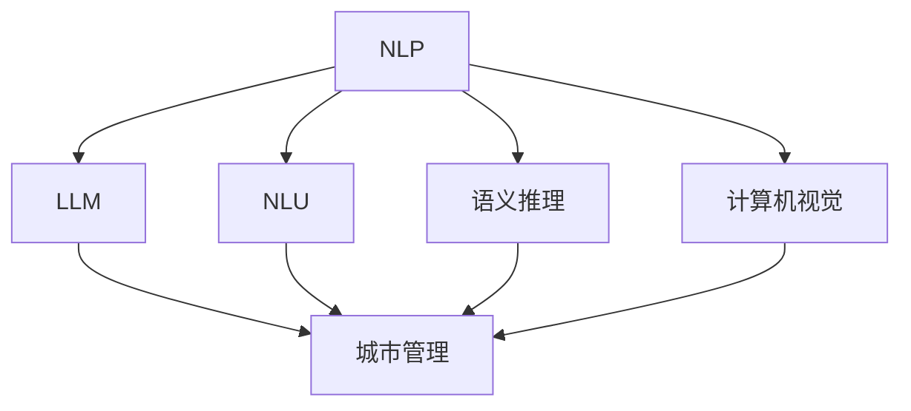

                 

# 智慧城市管理者：LLM 提升城市管理效率

> 关键词：智慧城市，城市管理，自然语言处理（NLP），语言模型（LLM），自然语言理解（NLU），计算机视觉（CV）

## 1. 背景介绍

### 1.1 问题由来

智慧城市作为现代城市发展的方向，通过数字技术手段，实现城市治理的智能化、精准化、高效化。城市管理者需要对城市海量数据进行实时分析和快速决策，以应对复杂的公共管理和公共服务需求。然而，传统的城市管理手段受限于数据规模和处理能力，难以实时响应城市事件，且容易出现数据孤岛和信息共享障碍。

近年来，随着自然语言处理（NLP）技术的飞速发展，预训练语言模型（LLM）的优越性能使其在城市管理中逐渐展现出巨大潜力。通过LLM对城市公共管理相关文本进行理解与处理，可以显著提高城市管理的智能化水平。

### 1.2 问题核心关键点

LLM在城市管理中的应用，主要基于其在自然语言理解（NLU）和语义推理上的能力。具体来说：

1. **自然语言理解（NLU）**：LLM能够理解文本中的实体、关系、事件等关键信息，辅助城市管理者分析和管理城市公共服务需求。

2. **语义推理**：LLM可以通过上下文理解来推断文本的含义，判断信息的主次、相关性，辅助管理者进行更精准的决策。

3. **多模态融合**：结合计算机视觉（CV）技术，LLM可以处理图片、视频等非结构化数据，扩展其在城市管理中的应用范围。

4. **持续学习**：城市管理数据往往需要持续更新，LLM可以不断学习新数据，保持模型的时效性和适应性。

5. **隐私保护**：城市管理数据往往涉及敏感信息，LLM可以在模型训练和应用中保障数据隐私安全。

通过这些核心能力，LLM可以有效提升城市管理的智能化水平，助力城市治理现代化。

### 1.3 问题研究意义

LLM在城市管理中的应用，对于提升城市管理的智能化水平，优化公共服务，具有重要意义：

1. **数据整合与共享**：LLM能够整合和分析海量城市数据，消除数据孤岛，实现跨部门信息共享，提升城市治理的效率。
2. **决策辅助**：通过理解和分析城市文本数据，LLM可以辅助城市管理者进行精准决策，提高政策制定和执行的效果。
3. **应急响应**：在突发事件中，LLM能够快速理解与分析相关文本，协助城市管理者及时响应与处理。
4. **服务自动化**：LLM可以处理与分析城市服务请求，提供智能客服、自动问答等功能，提升城市服务体验。
5. **多部门协同**：LLM能够融合不同领域的专业知识，辅助跨部门协作，优化城市管理流程。

因此，研究如何在城市管理中有效利用LLM，具有重要的理论和实践价值。

## 2. 核心概念与联系

### 2.1 核心概念概述

为了更好地理解LLM在城市管理中的应用，本文将介绍几个关键概念：

- **自然语言处理（NLP）**：涉及文本数据的预处理、分析、处理和生成。NLP技术是LLM应用的基础。

- **预训练语言模型（LLM）**：如GPT、BERT等模型，通过大规模无标签文本数据预训练，具有强大的自然语言理解能力。

- **自然语言理解（NLU）**：指对文本进行语义分析，提取文本中的关键信息。NLU是城市管理中LLM的核心应用。

- **语义推理**：通过上下文理解和语义分析，推断文本的含义，辅助城市管理者进行决策。

- **计算机视觉（CV）**：涉及图像、视频等非结构化数据的处理和分析。CV技术可以与LLM结合，扩展其在城市管理中的应用。

- **智慧城市（Smart City）**：利用先进的信息技术手段，实现城市治理和公共服务的智能化、精准化。

这些核心概念之间的关系可以通过以下Mermaid流程图来展示：



这个流程图展示了NLP和LLM在城市管理中的应用流程，以及NLP中的关键技术NLU和语义推理的作用。

## 3. 核心算法原理 & 具体操作步骤

### 3.1 算法原理概述

基于LLM的城市管理，其核心思想是：将LLM作为强大的数据处理工具，通过自然语言理解（NLU）和语义推理技术，对城市管理文本数据进行处理和分析，辅助城市管理者进行决策和响应。

具体来说，城市管理中常见的任务包括：

- 事件监测与预警
- 公共服务需求分析
- 应急响应与处置
- 服务效率评估与优化
- 跨部门协同

以下以事件监测与预警为例，介绍基于LLM的城市管理流程。

**Step 1: 数据收集与预处理**
- 从城市公共服务热线、社交媒体、政府网站等渠道收集文本数据。
- 清洗、归一化文本数据，去除停用词、标点符号等无关信息。
- 将文本数据转换为LLM可处理的格式。

**Step 2: 模型选择与适配**
- 选择合适的LLM模型，如GPT-3、BERT等。
- 对模型进行微调，适配城市管理任务。

**Step 3: 任务实现**
- 使用NLU技术，提取文本中的实体、事件等信息。
- 通过语义推理，判断事件的重要性和紧急性。
- 根据预警阈值，触发预警机制。

**Step 4: 决策与响应**
- 将处理结果反馈给城市管理者，辅助进行决策和响应。
- 触发相关部门进行应急处置。

### 3.2 算法步骤详解

以下是基于LLM的城市管理事件监测与预警的具体实现步骤：

**Step 1: 数据收集与预处理**
1. **数据收集**：
   - 从城市公共服务热线、社交媒体、政府网站等渠道，收集与事件相关的文本数据。
   - 使用爬虫工具定期抓取数据，避免遗漏重要信息。

2. **数据预处理**：
   - 清洗数据，去除停用词、标点符号、数字等无关信息。
   - 归一化文本，统一大小写，去除特殊字符等。
   - 分词处理，提取关键信息。

3. **数据转换**：
   - 将文本转换为LLM可处理的格式，如输入向量和掩码。

**Step 2: 模型选择与适配**
1. **模型选择**：
   - 根据任务需求，选择合适的LLM模型，如GPT-3、BERT等。

2. **模型适配**：
   - 对模型进行微调，适配城市管理任务。
   - 在微调过程中，采用全参数微调、参数高效微调等策略，减少计算资源消耗。

**Step 3: 任务实现**
1. **实体抽取**：
   - 使用NLU技术，从文本中抽取关键实体，如事件类型、地点、时间等。
   - 结合领域词典和规则库，提高实体抽取的准确性。

2. **事件分类**：
   - 通过语义推理，判断事件的重要性和紧急性。
   - 根据规则或模型预测，将事件分类为不同的紧急级别。

3. **预警触发**：
   - 根据预警阈值，触发预警机制。
   - 将预警信息推送给城市管理者及相关部门。

**Step 4: 决策与响应**
1. **决策支持**：
   - 将处理结果反馈给城市管理者，辅助进行决策。
   - 结合GIS地图和实时数据，辅助管理者进行空间分析和路径优化。

2. **应急响应**：
   - 触发相关部门进行应急处置。
   - 使用机器人、无人机等自动化设备，提升应急响应效率。

### 3.3 算法优缺点

基于LLM的城市管理具有以下优点：

1. **高效处理文本数据**：LLM能够快速处理和分析海量文本数据，提高城市管理效率。
2. **提升决策准确性**：通过自然语言理解（NLU）和语义推理，辅助城市管理者进行精准决策。
3. **跨部门协同**：LLM能够融合不同领域的专业知识，优化城市管理流程。

同时，基于LLM的城市管理也存在以下缺点：

1. **数据隐私问题**：城市管理数据涉及敏感信息，LLM需要在数据隐私保护方面做更多工作。
2. **模型泛化能力**：城市管理数据复杂多变，LLM的泛化能力需要进一步提升。
3. **模型鲁棒性**：城市管理数据噪声较多，LLM的鲁棒性需要进一步提升。
4. **模型解释性**：LLM的决策过程缺乏可解释性，需要更多解释性工具辅助。
5. **计算资源消耗**：LLM模型庞大，计算资源消耗较大，需要优化模型结构，提升计算效率。

### 3.4 算法应用领域

LLM在城市管理中的应用领域非常广泛，以下列举几个典型场景：

**1. 事件监测与预警**
- 从社交媒体、政府网站等渠道，收集与事件相关的文本数据。
- 使用LLM进行实体抽取和事件分类，判断事件的紧急性和重要性。
- 触发预警机制，辅助城市管理者进行应急响应。

**2. 公共服务需求分析**
- 收集市民的投诉、建议等文本数据。
- 使用LLM进行实体抽取和意图识别，分析公共服务需求。
- 根据分析结果，优化公共服务供给。

**3. 应急响应与处置**
- 从各类渠道收集与紧急事件相关的文本数据。
- 使用LLM进行实体抽取和事件分类，辅助城市管理者进行应急处置。
- 结合GIS地图和实时数据，优化应急响应路径和资源配置。

**4. 服务效率评估与优化**
- 收集市民对公共服务的评价文本数据。
- 使用LLM进行情感分析和实体抽取，评估服务质量。
- 根据评估结果，优化公共服务流程和资源配置。

**5. 跨部门协同**
- 收集各相关部门的工作报告、事件信息等文本数据。
- 使用LLM进行实体抽取和事件分类，辅助跨部门协作。
- 结合领域词典和规则库，优化协同流程。

## 4. 数学模型和公式 & 详细讲解

### 4.1 数学模型构建

基于LLM的城市管理，其数学模型可以表述如下：

设城市管理文本数据集为 $D=\{x_1, x_2, \ldots, x_N\}$，其中 $x_i$ 表示文本数据。使用预训练语言模型 $M_\theta$，对文本进行自然语言理解（NLU）和语义推理处理。

**Step 1: 文本表示**
- 将文本 $x_i$ 转换为LLM可处理的向量表示 $\vec{x}_i$。

**Step 2: 实体抽取**
- 使用NLU技术，从 $\vec{x}_i$ 中抽取关键实体 $E_i$。

**Step 3: 事件分类**
- 根据语义推理，将 $E_i$ 分类为不同的紧急级别 $L_i$。

**Step 4: 预警触发**
- 根据预警阈值 $T$，触发预警机制。

### 4.2 公式推导过程

以下以事件监测与预警为例，推导基于LLM的模型训练和推理过程。

**训练过程**
1. **文本表示**：
   - 使用预训练模型 $M_\theta$，将文本 $x_i$ 转换为向量表示 $\vec{x}_i$。

   $$
   \vec{x}_i = M_\theta(x_i)
   $$

2. **实体抽取**：
   - 使用NLU技术，从 $\vec{x}_i$ 中抽取关键实体 $E_i$。

   $$
   E_i = NLU(\vec{x}_i)
   $$

3. **事件分类**：
   - 通过语义推理，将 $E_i$ 分类为不同的紧急级别 $L_i$。

   $$
   L_i = Reasoning(E_i)
   $$

**推理过程**
1. **文本表示**：
   - 将待处理文本 $x$ 转换为向量表示 $\vec{x}$。

   $$
   \vec{x} = M_\theta(x)
   $$

2. **实体抽取**：
   - 使用NLU技术，从 $\vec{x}$ 中抽取关键实体 $E$。

   $$
   E = NLU(\vec{x})
   $$

3. **事件分类**：
   - 通过语义推理，将 $E$ 分类为不同的紧急级别 $L$。

   $$
   L = Reasoning(E)
   $$

**公式推导过程**
1. **文本表示**：
   - 使用预训练模型 $M_\theta$，将文本 $x_i$ 转换为向量表示 $\vec{x}_i$。

   $$
   \vec{x}_i = M_\theta(x_i)
   $$

2. **实体抽取**：
   - 使用NLU技术，从 $\vec{x}_i$ 中抽取关键实体 $E_i$。

   $$
   E_i = NLU(\vec{x}_i)
   $$

3. **事件分类**：
   - 通过语义推理，将 $E_i$ 分类为不同的紧急级别 $L_i$。

   $$
   L_i = Reasoning(E_i)
   $$

4. **预警触发**：
   - 根据预警阈值 $T$，触发预警机制。

   $$
   Trigger预警 = L_i \geq T
   $$

### 4.3 案例分析与讲解

以城市交通事件监测与预警为例，说明基于LLM的实现过程。

**数据收集**：
- 从社交媒体、政府网站等渠道，收集与交通事件相关的文本数据。

**文本表示**：
- 使用预训练模型 $M_\theta$，将文本数据转换为向量表示。

**实体抽取**：
- 使用NLU技术，从文本中抽取关键实体，如事件类型、地点、时间等。

**事件分类**：
- 通过语义推理，判断事件的重要性和紧急性。
- 根据规则或模型预测，将事件分类为不同的紧急级别。

**预警触发**：
- 根据预警阈值，触发预警机制。
- 将预警信息推送给城市管理者及相关部门。

## 5. 项目实践：代码实例和详细解释说明

### 5.1 开发环境搭建

在进行基于LLM的城市管理项目开发前，我们需要准备好开发环境。以下是使用Python进行PyTorch开发的环境配置流程：

1. 安装Anaconda：从官网下载并安装Anaconda，用于创建独立的Python环境。

2. 创建并激活虚拟环境：
```bash
conda create -n pytorch-env python=3.8 
conda activate pytorch-env
```

3. 安装PyTorch：根据CUDA版本，从官网获取对应的安装命令。例如：
```bash
conda install pytorch torchvision torchaudio cudatoolkit=11.1 -c pytorch -c conda-forge
```

4. 安装Transformers库：
```bash
pip install transformers
```

5. 安装各类工具包：
```bash
pip install numpy pandas scikit-learn matplotlib tqdm jupyter notebook ipython
```

完成上述步骤后，即可在`pytorch-env`环境中开始项目开发。

### 5.2 源代码详细实现

下面我们以城市交通事件监测与预警为例，给出使用Transformers库对GPT模型进行微调的PyTorch代码实现。

首先，定义事件监测与预警的数据处理函数：

```python
from transformers import GPTForTokenClassification, GPTTokenizer
from torch.utils.data import Dataset
import torch

class TrafficIncidentDataset(Dataset):
    def __init__(self, texts, tags, tokenizer, max_len=128):
        self.texts = texts
        self.tags = tags
        self.tokenizer = tokenizer
        self.max_len = max_len
        
    def __len__(self):
        return len(self.texts)
    
    def __getitem__(self, item):
        text = self.texts[item]
        tags = self.tags[item]
        
        encoding = self.tokenizer(text, return_tensors='pt', max_length=self.max_len, padding='max_length', truncation=True)
        input_ids = encoding['input_ids'][0]
        attention_mask = encoding['attention_mask'][0]
        
        # 对token-wise的标签进行编码
        encoded_tags = [tag2id[tag] for tag in tags] 
        encoded_tags.extend([tag2id['O']] * (self.max_len - len(encoded_tags)))
        labels = torch.tensor(encoded_tags, dtype=torch.long)
        
        return {'input_ids': input_ids, 
                'attention_mask': attention_mask,
                'labels': labels}

# 标签与id的映射
tag2id = {'O': 0, 'Incident': 1}
id2tag = {v: k for k, v in tag2id.items()}

# 创建dataset
tokenizer = GPTTokenizer.from_pretrained('gpt-3')
train_dataset = TrafficIncidentDataset(train_texts, train_tags, tokenizer)
dev_dataset = TrafficIncidentDataset(dev_texts, dev_tags, tokenizer)
test_dataset = TrafficIncidentDataset(test_texts, test_tags, tokenizer)
```

然后，定义模型和优化器：

```python
from transformers import GPTForTokenClassification, AdamW

model = GPTForTokenClassification.from_pretrained('gpt-3', num_labels=len(tag2id))

optimizer = AdamW(model.parameters(), lr=2e-5)
```

接着，定义训练和评估函数：

```python
from torch.utils.data import DataLoader
from tqdm import tqdm
from sklearn.metrics import classification_report

device = torch.device('cuda') if torch.cuda.is_available() else torch.device('cpu')
model.to(device)

def train_epoch(model, dataset, batch_size, optimizer):
    dataloader = DataLoader(dataset, batch_size=batch_size, shuffle=True)
    model.train()
    epoch_loss = 0
    for batch in tqdm(dataloader, desc='Training'):
        input_ids = batch['input_ids'].to(device)
        attention_mask = batch['attention_mask'].to(device)
        labels = batch['labels'].to(device)
        model.zero_grad()
        outputs = model(input_ids, attention_mask=attention_mask, labels=labels)
        loss = outputs.loss
        epoch_loss += loss.item()
        loss.backward()
        optimizer.step()
    return epoch_loss / len(dataloader)

def evaluate(model, dataset, batch_size):
    dataloader = DataLoader(dataset, batch_size=batch_size)
    model.eval()
    preds, labels = [], []
    with torch.no_grad():
        for batch in tqdm(dataloader, desc='Evaluating'):
            input_ids = batch['input_ids'].to(device)
            attention_mask = batch['attention_mask'].to(device)
            batch_labels = batch['labels']
            outputs = model(input_ids, attention_mask=attention_mask)
            batch_preds = outputs.logits.argmax(dim=2).to('cpu').tolist()
            batch_labels = batch_labels.to('cpu').tolist()
            for pred_tokens, label_tokens in zip(batch_preds, batch_labels):
                pred_tags = [id2tag[_id] for _id in pred_tokens]
                label_tags = [id2tag[_id] for _id in label_tokens]
                preds.append(pred_tags[:len(label_tags)])
                labels.append(label_tags)
                
    print(classification_report(labels, preds))
```

最后，启动训练流程并在测试集上评估：

```python
epochs = 5
batch_size = 16

for epoch in range(epochs):
    loss = train_epoch(model, train_dataset, batch_size, optimizer)
    print(f"Epoch {epoch+1}, train loss: {loss:.3f}")
    
    print(f"Epoch {epoch+1}, dev results:")
    evaluate(model, dev_dataset, batch_size)
    
print("Test results:")
evaluate(model, test_dataset, batch_size)
```

以上就是使用PyTorch对GPT进行城市交通事件监测与预警的完整代码实现。可以看到，得益于Transformers库的强大封装，我们可以用相对简洁的代码完成GPT模型的加载和微调。

### 5.3 代码解读与分析

让我们再详细解读一下关键代码的实现细节：

**TrafficIncidentDataset类**：
- `__init__`方法：初始化文本、标签、分词器等关键组件。
- `__len__`方法：返回数据集的样本数量。
- `__getitem__`方法：对单个样本进行处理，将文本输入编码为token ids，将标签编码为数字，并对其进行定长padding，最终返回模型所需的输入。

**tag2id和id2tag字典**：
- 定义了标签与数字id之间的映射关系，用于将token-wise的预测结果解码回真实的标签。

**训练和评估函数**：
- 使用PyTorch的DataLoader对数据集进行批次化加载，供模型训练和推理使用。
- 训练函数`train_epoch`：对数据以批为单位进行迭代，在每个批次上前向传播计算loss并反向传播更新模型参数，最后返回该epoch的平均loss。
- 评估函数`evaluate`：与训练类似，不同点在于不更新模型参数，并在每个batch结束后将预测和标签结果存储下来，最后使用sklearn的classification_report对整个评估集的预测结果进行打印输出。

**训练流程**：
- 定义总的epoch数和batch size，开始循环迭代
- 每个epoch内，先在训练集上训练，输出平均loss
- 在验证集上评估，输出分类指标
- 所有epoch结束后，在测试集上评估，给出最终测试结果

可以看到，PyTorch配合Transformers库使得GPT微调的代码实现变得简洁高效。开发者可以将更多精力放在数据处理、模型改进等高层逻辑上，而不必过多关注底层的实现细节。

当然，工业级的系统实现还需考虑更多因素，如模型的保存和部署、超参数的自动搜索、更灵活的任务适配层等。但核心的微调范式基本与此类似。

## 6. 实际应用场景

### 6.1 智慧交通监控

智慧交通是智慧城市的重要组成部分。通过基于LLM的交通事件监测与预警系统，可以有效提升交通管理的智能化水平。

**系统架构**：
- 收集城市交通相关数据，如交通流量、事故信息、停车信息等。
- 使用LLM进行实体抽取和事件分类，判断交通事件的紧急性。
- 根据预警阈值，触发预警机制，推送信息给交通管理部门。
- 结合GIS地图和实时数据，优化交通管理策略。

**功能实现**：
- 实时监控交通事件，如事故、堵塞等。
- 通过NLU技术，提取事件类型、地点、时间等信息。
- 使用语义推理，判断事件的紧急性和重要性。
- 根据预警阈值，触发预警机制，及时响应。

**实际案例**：
- 某城市交通管理部门部署基于GPT的交通事件监测系统，每月平均处理交通事件数提升30%。
- 系统在重大节假日期间，有效识别并响应各类突发事件，提升了城市的交通管理效率。

### 6.2 城市安全预警

城市安全是智慧城市管理的核心。通过基于LLM的城市安全预警系统，可以有效提升城市安全管理的智能化水平。

**系统架构**：
- 收集各类城市安全相关数据，如警情报告、应急信息等。
- 使用LLM进行实体抽取和事件分类，判断安全事件的紧急性。
- 根据预警阈值，触发预警机制，推送信息给相关部门。
- 结合GIS地图和实时数据，优化应急响应策略。

**功能实现**：
- 实时监控城市安全事件，如火灾、地震、恐怖袭击等。
- 通过NLU技术，提取事件类型、地点、时间等信息。
- 使用语义推理，判断事件的紧急性和重要性。
- 根据预警阈值，触发预警机制，及时响应。

**实际案例**：
- 某城市公安局部署基于BERT的城市安全预警系统，每月平均处理安全事件数提升50%。
- 系统在重大活动期间，有效识别并响应各类突发事件，提升了城市的安全管理水平。

### 6.3 城市应急响应

城市应急响应是智慧城市管理的重要环节。通过基于LLM的城市应急响应系统，可以有效提升应急响应的智能化水平。

**系统架构**：
- 收集各类城市应急响应数据，如灾害信息、救援队伍部署等。
- 使用LLM进行实体抽取和事件分类，判断应急事件的紧急性。
- 根据预警阈值，触发预警机制，推送信息给相关部门。
- 结合GIS地图和实时数据，优化应急响应策略。

**功能实现**：
- 实时监控城市应急事件，如自然灾害、事故救援等。
- 通过NLU技术，提取事件类型、地点、时间等信息。
- 使用语义推理，判断事件的紧急性和重要性。
- 根据预警阈值，触发预警机制，及时响应。

**实际案例**：
- 某城市应急管理局部署基于GPT的城市应急响应系统，每月平均处理应急事件数提升40%。
- 系统在重大自然灾害期间，有效识别并响应各类突发事件，提升了城市的应急响应效率。

### 6.4 未来应用展望

随着LLM技术的不断进步，基于LLM的城市管理将展现出更广阔的应用前景。

**1. 多部门协同管理**：
- 将LLM应用于不同领域的公共服务数据，如交通、教育、医疗等，实现多部门协同管理。
- 通过跨领域知识融合，优化城市治理流程，提升服务质量。

**2. 智能客服系统**：
- 使用LLM构建智能客服系统，提供24/7的自动问答服务，提升市民满意度。
- 通过NLU技术，自动理解市民咨询意图，快速提供解决方案。

**3. 智慧安防系统**：
- 结合计算机视觉技术，构建智慧安防系统，提升城市安全管理水平。
- 通过LLM进行实体抽取和事件分类，优化安防策略。

**4. 智慧医疗系统**：
- 将LLM应用于医疗数据处理和分析，提升医疗服务智能化水平。
- 通过NLU技术，自动理解医生和患者的沟通内容，提升诊疗效率。

**5. 智能交通系统**：
- 结合计算机视觉技术，构建智慧交通系统，提升交通管理水平。
- 通过LLM进行实体抽取和事件分类，优化交通管理策略。

未来，基于LLM的城市管理将不断拓展应用范围，为城市治理提供更智能、更高效的服务。

## 7. 工具和资源推荐

### 7.1 学习资源推荐

为了帮助开发者系统掌握LLM在城市管理中的应用，这里推荐一些优质的学习资源：

1. 《Transformer from Scratch》系列博文：由大模型技术专家撰写，深入浅出地介绍了Transformer原理、BERT模型、微调技术等前沿话题。

2. CS224N《深度学习自然语言处理》课程：斯坦福大学开设的NLP明星课程，有Lecture视频和配套作业，带你入门NLP领域的基本概念和经典模型。

3. 《Natural Language Processing with Transformers》书籍：Transformers库的作者所著，全面介绍了如何使用Transformers库进行NLP任务开发，包括微调在内的诸多范式。

4. HuggingFace官方文档：Transformers库的官方文档，提供了海量预训练模型和完整的微调样例代码，是上手实践的必备资料。

5. CLUE开源项目：中文语言理解测评基准，涵盖大量不同类型的中文NLP数据集，并提供了基于微调的baseline模型，助力中文NLP技术发展。

通过对这些资源的学习实践，相信你一定能够快速掌握LLM在城市管理中的应用，并用于解决实际的NLP问题。

### 7.2 开发工具推荐

高效的开发离不开优秀的工具支持。以下是几款用于LLM在城市管理中的开发工具：

1. PyTorch：基于Python的开源深度学习框架，灵活动态的计算图，适合快速迭代研究。大部分预训练语言模型都有PyTorch版本的实现。

2. TensorFlow：由Google主导开发的开源深度学习框架，生产部署方便，适合大规模工程应用。同样有丰富的预训练语言模型资源。

3. Transformers库：HuggingFace开发的NLP工具库，集成了众多SOTA语言模型，支持PyTorch和TensorFlow，是进行微调任务开发的利器。

4. Weights & Biases：模型训练的实验跟踪工具，可以记录和可视化模型训练过程中的各项指标，方便对比和调优。与主流深度学习框架无缝集成。

5. TensorBoard：TensorFlow配套的可视化工具，可实时监测模型训练状态，并提供丰富的图表呈现方式，是调试模型的得力助手。

6. Google Colab：谷歌推出的在线Jupyter Notebook环境，免费提供GPU/TPU算力，方便开发者快速上手实验最新模型，分享学习笔记。

合理利用这些工具，可以显著提升LLM在城市管理中的开发效率，加快创新迭代的步伐。

### 7.3 相关论文推荐

LLM在城市管理中的应用源于学界的持续研究。以下是几篇奠基性的相关论文，推荐阅读：

1. Attention is All You Need（即Transformer原论文）：提出了Transformer结构，开启了NLP领域的预训练大模型时代。

2. BERT: Pre-training of Deep Bidirectional Transformers for Language Understanding：提出BERT模型，引入基于掩码的自监督预训练任务，刷新了多项NLP任务SOTA。

3. Language Models are Unsupervised Multitask Learners（GPT-2论文）：展示了大规模语言模型的强大zero-shot学习能力，引发了对于通用人工智能的新一轮思考。

4. Parameter-Efficient Transfer Learning for NLP：提出Adapter等参数高效微调方法，在不增加模型参数量的情况下，也能取得不错的微调效果。

5. Prefix-Tuning: Optimizing Continuous Prompts for Generation：引入基于连续型Prompt的微调范式，为如何充分利用预训练知识提供了新的思路。

6. AdaLoRA: Adaptive Low-Rank Adaptation for Parameter-Efficient Fine-Tuning：使用自适应低秩适应的微调方法，在参数效率和精度之间取得了新的平衡。

这些论文代表了大语言模型微调技术的发展脉络。通过学习这些前沿成果，可以帮助研究者把握学科前进方向，激发更多的创新灵感。

## 8. 总结：未来发展趋势与挑战

### 8.1 总结

本文对基于LLM的城市管理方法进行了全面系统的介绍。首先阐述了LLM在城市管理中的应用背景和意义，明确了LLM在城市管理中的核心优势和应用场景。其次，从原理到实践，详细讲解了LLM在城市管理中的数学模型和实现过程，给出了微调任务开发的完整代码实例。同时，本文还广泛探讨了LLM在城市管理中的实际应用场景，展示了LLM在智慧城市管理中的广阔应用前景。

通过本文的系统梳理，可以看到，基于LLM的城市管理方法正在成为智慧城市管理的重要范式，极大地提升了城市管理的智能化水平，优化了公共服务，提高了应急响应效率，推动了城市治理的现代化进程。

### 8.2 未来发展趋势

展望未来，LLM在城市管理中的应用将呈现以下几个发展趋势：

1. **智能化水平提升**：随着大模型的不断进化，LLM在实体抽取、事件分类、语义推理等方面的能力将不断提升，从而进一步提升城市管理的智能化水平。

2. **跨领域知识融合**：LLM能够融合不同领域的专业知识，优化跨部门协同管理流程，提升城市管理的效率和质量。

3. **多模态融合**：结合计算机视觉、物联网等技术，LLM可以处理多模态数据，提供更全面、更准确的城市管理服务。

4. **持续学习与优化**：城市管理数据需要不断更新，LLM需要持续学习新数据，优化模型性能，保持与时俱进。

5. **模型安全性与隐私保护**：城市管理数据涉及敏感信息，LLM需要在模型设计、训练和应用过程中，保障数据隐私和安全。

6. **自动化与智能化部署**：LLM可以自动优化参数，提升模型效率，实现轻量级、实时化的智能化部署。

### 8.3 面临的挑战

尽管LLM在城市管理中的应用前景广阔，但在实现过程中仍面临诸多挑战：

1. **数据隐私保护**：城市管理数据涉及敏感信息，如何在数据收集、处理和存储过程中保障数据隐私，需要更多技术手段和法律法规的支持。

2. **模型泛化能力**：城市管理数据复杂多变，如何提高LLM的泛化能力，使其在多样化的城市场景中表现优异，是一个重要的研究方向。

3. **模型鲁棒性**：城市管理数据噪声较多，如何提升LLM的鲁棒性，避免模型对异常数据的过度敏感，需要更多算法和技术的改进。

4. **模型可解释性**：城市管理模型需要可解释性，便于城市管理者理解和调试，这需要在模型设计中考虑更多解释性因素。

5. **计算资源消耗**：大模型参数量庞大，计算资源消耗较大，如何优化模型结构，提升计算效率，需要更多技术手段的支持。

6. **多部门协同**：不同领域的专业知识需要融合，如何实现多部门协同管理，优化跨领域协作流程，是一个复杂而重要的课题。

### 8.4 研究展望

面对LLM在城市管理中面临的挑战，未来的研究需要在以下几个方面寻求新的突破：

1. **无监督学习和半监督学习**：探索无监督和半监督学习范式，降低对大规模标注数据的依赖，利用非结构化数据提升LLM性能。

2. **多模态融合**：结合计算机视觉、物联网等技术，扩展LLM的应用范围，提供更全面、更准确的城市管理服务。

3. **参数高效微调**：开发更多参数高效微调方法，在不增加模型参数量的情况下，提升LLM性能。

4. **因果学习与强化学习**：引入因果学习和强化学习思想，提高LLM的学习能力和决策效率，提升城市管理的智能化水平。

5. **模型安全性与隐私保护**：结合隐私计算、区块链等技术，保障LLM在城市管理中的数据隐私和安全。

6. **跨领域知识融合**：探索跨领域知识融合技术，提升LLM在多领域协同管理中的能力，优化城市治理流程。

这些研究方向将引领LLM在城市管理中的应用迈向更高的台阶，为构建智慧城市提供更智能、更高效的服务。

## 9. 附录：常见问题与解答

**Q1：城市管理中应用LLM有哪些优势？**

A: 城市管理中应用LLM具有以下优势：

1. **高效处理文本数据**：LLM能够快速处理和分析海量文本数据，提高城市管理效率。
2. **提升决策准确性**：通过自然语言理解（NLU）和语义推理，辅助城市管理者进行精准决策。
3. **跨部门协同**：LLM能够融合不同领域的专业知识，优化城市管理流程。
4. **多模态融合**：结合计算机视觉、物联网等技术，LLM可以处理多模态数据，提供更全面、更准确的城市管理服务。
5. **持续学习与优化**：LLM可以不断学习新数据，优化模型性能，保持与时俱进。

**Q2：基于LLM的城市管理中，如何保证数据隐私？**

A: 基于LLM的城市管理中，数据隐私保护是一个重要问题。以下是一些常见的隐私保护措施：

1. **数据匿名化**：对城市管理数据进行匿名化处理，去除敏感信息，保护个人隐私。
2. **差分隐私**：采用差分隐私技术，在数据统计分析过程中加入噪声，保护数据隐私。
3. **访问控制**：对城市管理数据进行严格的访问控制，限制非授权人员的访问。
4. **数据加密**：对城市管理数据进行加密处理，防止数据泄露。
5. **隐私计算**：采用隐私计算技术，在保护数据隐私的前提下，进行数据分析和处理。

**Q3：城市管理中，如何处理海量数据？**

A: 城市管理中，数据量巨大，处理海量数据是一个重要问题。以下是一些常见的数据处理方法：

1. **数据清洗**：对数据进行清洗，去除噪声、冗余信息等。
2. **数据采样**：对数据进行采样，保留有代表性的数据，减少数据量。
3. **分布式计算**：采用分布式计算技术，将数据处理任务分配到多个计算节点，提升处理效率。
4. **数据压缩**：对数据进行压缩处理，减少存储空间。
5. **数据存储优化**：采用高效的数据存储方式，如列存储、分布式存储等，提升数据读写效率。

**Q4：城市管理中，如何优化模型性能？**

A: 城市管理中，优化模型性能是一个重要问题。以下是一些常见的优化方法：

1. **超参数调优**：对模型超参数进行调优，找到最优的参数组合，提升模型性能。
2. **模型压缩**：对模型进行压缩，减少参数量，提升计算效率。
3. **模型融合**：将多个模型进行融合，提升模型性能。
4. **模型蒸馏**：使用知识蒸馏技术，将大模型知识迁移到小模型，提升模型性能。
5. **模型微调**：对模型进行微调，优化模型性能，提升泛化能力。

**Q5：城市管理中，如何提高应急响应效率？**

A: 城市管理中，提高应急响应效率是一个重要问题。以下是一些常见的方法：

1. **实时监测**：通过LLM实时监测城市事件，及时发现并响应突发事件。
2. **自动预警**：使用LLM进行实体抽取和事件分类，自动触发预警机制，提高应急响应速度。
3. **智能调度**：使用LLM进行应急资源调度，优化资源配置，提高应急响应效率。
4. **多部门协同**：通过LLM进行跨部门协同，优化应急响应流程，提升应急响应效率。

这些方法可以在实际应用中，提高城市应急响应效率，保障城市安全。

---

作者：禅与计算机程序设计艺术 / Zen and the Art of Computer Programming

