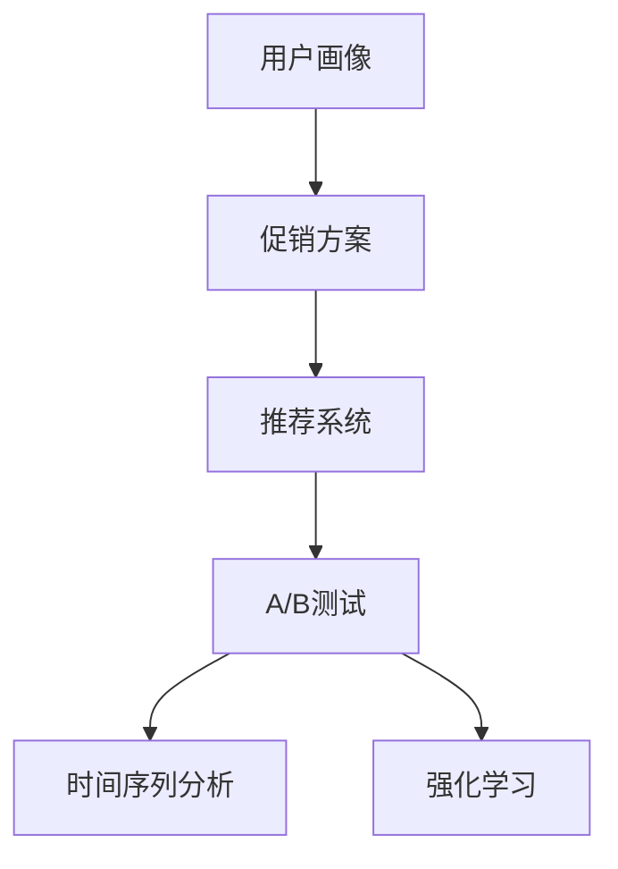

                 

## 1. 背景介绍

### 1.1 问题由来

随着电子商务的快速发展，促销策略在提升企业销售额、优化库存管理方面发挥着至关重要的作用。然而，传统的促销策略大多基于经验和固定规则，难以适应多变的市场需求和复杂的用户行为。智能促销策略的提出，借助大数据和机器学习技术，能够更精准、灵活地制定促销计划，提升营销效果。

### 1.2 问题核心关键点

智能促销策略的核心在于通过数据分析和机器学习算法，自动发现和挖掘用户行为特征，实时调整促销策略，以最大化营销效果。具体来说，包括：
- 用户行为分析：通过用户历史数据，挖掘出用户的购买偏好、价格敏感度等行为特征。
- 促销策略设计：根据用户行为特征，设计出针对性的促销方案。
- 效果评估与优化：实时监测促销策略的执行效果，通过不断优化迭代，提升策略效果。

### 1.3 问题研究意义

智能促销策略的实现，对于提升企业的营销效果、优化库存管理、提升用户体验等方面具有重要意义：
- 提高销售额：通过精准的用户画像和智能促销方案，能显著提升用户购买意愿，增加销售额。
- 优化库存：智能促销策略能根据实时市场需求，合理规划库存，避免库存积压和缺货。
- 提升用户体验：通过个性化的促销方案，提升用户的购物体验，增强品牌忠诚度。

## 2. 核心概念与联系

### 2.1 核心概念概述

为更好地理解智能促销策略的实现，本节将介绍几个关键概念：

- **用户画像(User Profile)**：通过收集和分析用户历史数据，构建用户的行为特征，如购买偏好、价格敏感度、复购率等，帮助理解用户需求和行为。
- **促销方案(Promotion Scheme)**：根据用户画像，设计出针对性的促销策略，如折扣、优惠券、满减等。
- **推荐系统(Recommendation System)**：利用机器学习算法，向用户推荐符合其兴趣的商品，提升用户购买转化率。
- **A/B测试(A/B Testing)**：通过对比不同促销策略的效果，选择最优方案，进行推广。
- **时间序列分析(Time Series Analysis)**：对用户行为数据进行时间序列建模，预测用户需求变化趋势，优化促销策略。
- **强化学习(Reinforcement Learning)**：通过模拟与用户的交互，动态调整促销策略，最大化长期收益。

这些概念之间存在紧密的联系，共同构成了智能促销策略的实现框架。

### 2.2 核心概念原理和架构的 Mermaid 流程图



以上流程图展示了智能促销策略的主要流程：从用户画像开始，生成促销方案，并利用推荐系统提升用户转化率；通过A/B测试优化策略，并利用时间序列分析预测用户行为，强化学习动态调整策略。

## 3. 核心算法原理 & 具体操作步骤

### 3.1 算法原理概述

智能促销策略的实现主要基于以下两个算法：

- **协同过滤算法(Collaborative Filtering)**：通过分析用户历史行为数据，找到与当前用户兴趣相似的其他用户，推荐其购买过的商品，提升个性化推荐效果。
- **时间序列预测算法(Time Series Forecasting)**：利用时间序列建模技术，预测未来用户需求变化趋势，为促销策略的动态调整提供依据。

### 3.2 算法步骤详解

#### 3.2.1 用户画像构建

1. **数据收集**：收集用户历史行为数据，如浏览记录、购买记录、搜索记录等。
2. **数据预处理**：清洗、归一化、标准化数据，去除噪声和异常值。
3. **特征提取**：利用特征工程技术，提取用户行为特征，如购买偏好、价格敏感度、复购率等。
4. **用户画像构建**：使用聚类算法、降维算法等，对用户行为特征进行建模，生成用户画像。

#### 3.2.2 促销方案设计

1. **促销策略设计**：根据用户画像，设计出针对性的促销方案，如折扣、优惠券、满减等。
2. **促销策略评估**：通过A/B测试，对比不同促销策略的效果，选择最优方案进行推广。
3. **促销策略优化**：根据实时监测效果，动态调整促销策略，优化促销方案。

#### 3.2.3 推荐系统应用

1. **推荐算法选择**：选择适合的推荐算法，如协同过滤、基于内容的推荐、深度学习推荐等。
2. **推荐模型训练**：使用用户画像数据，训练推荐模型，生成个性化推荐结果。
3. **推荐效果评估**：监测推荐系统的点击率、转化率等指标，评估推荐效果。

#### 3.2.4 时间序列分析应用

1. **数据收集**：收集用户历史需求数据，如日销量、周销量等。
2. **时间序列建模**：选择合适的时间序列模型，如ARIMA、LSTM等，对需求数据进行建模。
3. **需求预测**：使用训练好的模型，预测未来用户需求变化趋势。
4. **促销策略调整**：根据预测结果，动态调整促销策略，避免过剩或短缺。

### 3.3 算法优缺点

智能促销策略的实现，具有以下优点：
- 个性化推荐：通过用户画像，提供个性化的商品推荐，提升用户购买意愿。
- 实时调整：根据实时监测效果，动态调整促销策略，优化促销方案。
- 数据驱动：基于数据和模型，决策更加科学，提升营销效果。

同时，该方法也存在一定的局限性：
- 数据依赖性高：需要大量高质量的数据支持，数据收集和预处理工作量大。
- 模型复杂度高：推荐系统和时间序列预测模型较为复杂，训练和调参难度大。
- 算法鲁棒性差：当用户行为变化较大时，算法可能无法准确预测和推荐。

尽管存在这些局限性，但就目前而言，基于智能促销策略的推荐和预测方法在电商领域已经取得了显著的效果，成为提升用户转化率和营销效果的重要手段。

### 3.4 算法应用领域

智能促销策略的实现，已在电子商务、零售、金融等行业得到了广泛应用，包括：

- **电商推荐**：如淘宝、京东等电商平台，通过推荐系统提升用户购买转化率。
- **零售库存管理**：如亚马逊、苏宁易购等，通过时间序列预测优化库存管理，避免缺货或积压。
- **金融风控**：如银行、保险等，通过用户行为分析，识别高风险用户，优化风控策略。

此外，智能促销策略还被应用于内容推荐、广告投放、智能客服等多个领域，为各类企业提供智能化的营销解决方案。

## 4. 数学模型和公式 & 详细讲解 & 举例说明

### 4.1 数学模型构建

智能促销策略的实现，主要基于以下数学模型：

- **协同过滤模型**：$P_{user} = W \cdot R_{user}$
- **时间序列预测模型**：$Y_{t+1} = \phi(X_{t}, W) + \epsilon_{t+1}$

其中，$P_{user}$表示用户画像，$W$为权重矩阵，$R_{user}$为用户行为矩阵；$Y_{t+1}$表示预测需求，$\phi$为时间序列模型，$X_{t}$为历史需求数据，$\epsilon_{t+1}$为噪声。

### 4.2 公式推导过程

#### 4.2.1 协同过滤模型

协同过滤模型基于用户行为矩阵$R_{user}$和权重矩阵$W$，计算用户画像$P_{user}$。具体公式如下：

$$
P_{user} = W \cdot R_{user}
$$

其中$W$为权重矩阵，可以表示为$W = [w_1, w_2, ..., w_n]$，$n$为用户数。

$R_{user}$为用户行为矩阵，可以表示为$R_{user} = [r_{1,1}, r_{1,2}, ..., r_{1,n}, r_{2,1}, r_{2,2}, ..., r_{2,n}, ..., r_{m,1}, r_{m,2}, ..., r_{m,n}]$，$r_{i,j}$表示用户$i$对商品$j$的行为评分。

#### 4.2.2 时间序列预测模型

时间序列预测模型基于历史需求数据$X_{t}$，通过训练好的模型$\phi$，预测未来需求$Y_{t+1}$。具体公式如下：

$$
Y_{t+1} = \phi(X_{t}, W) + \epsilon_{t+1}
$$

其中$\phi$为时间序列模型，可以表示为$\phi = [\phi_1, \phi_2, ..., \phi_k]$，$k$为模型参数个数。

$X_{t}$为历史需求数据，可以表示为$X_{t} = [x_{t-1}, x_{t-2}, ..., x_{t-m}, x_t]$，$m$为历史数据长度。

$\epsilon_{t+1}$为噪声，通常假设为高斯噪声，$N(0,\sigma^2)$。

### 4.3 案例分析与讲解

以京东为例，分析智能促销策略的实现过程：

1. **用户画像构建**：通过收集用户历史浏览、购买、评价等数据，构建用户画像，包括购买偏好、价格敏感度、复购率等特征。

2. **促销方案设计**：根据用户画像，设计个性化促销方案，如针对价格敏感度高的用户，设计折扣活动；针对复购率高的用户，设计回购奖励活动。

3. **推荐系统应用**：使用协同过滤算法，根据用户画像生成个性化推荐结果，提升用户购买转化率。

4. **时间序列分析应用**：收集历史销量数据，使用ARIMA模型进行时间序列建模，预测未来需求变化趋势，优化库存管理和促销策略。

通过以上步骤，京东能够实现智能化的促销策略，提升用户购买转化率和营销效果。

## 5. 项目实践：代码实例和详细解释说明

### 5.1 开发环境搭建

在进行智能促销策略的开发实践前，需要准备好开发环境。以下是使用Python进行PyTorch开发的环境配置流程：

1. 安装Anaconda：从官网下载并安装Anaconda，用于创建独立的Python环境。

2. 创建并激活虚拟环境：
```bash
conda create -n pytorch-env python=3.8 
conda activate pytorch-env
```

3. 安装PyTorch：根据CUDA版本，从官网获取对应的安装命令。例如：
```bash
conda install pytorch torchvision torchaudio cudatoolkit=11.1 -c pytorch -c conda-forge
```

4. 安装TensorFlow：
```bash
pip install tensorflow
```

5. 安装Pandas、Numpy等数据处理工具：
```bash
pip install pandas numpy
```

6. 安装Scikit-learn、Matplotlib等模型和可视化工具：
```bash
pip install scikit-learn matplotlib
```

完成上述步骤后，即可在`pytorch-env`环境中开始项目开发。

### 5.2 源代码详细实现

下面我们以京东的智能促销策略为例，给出使用PyTorch进行协同过滤和推荐系统的代码实现。

```python
import torch
import torch.nn as nn
from sklearn.model_selection import train_test_split
from sklearn.metrics import mean_absolute_error
from torch.utils.data import Dataset
from torch.utils.data import DataLoader

class UserBehaviorDataset(Dataset):
    def __init__(self, data, users):
        self.data = data
        self.users = users
        
    def __len__(self):
        return len(self.users)
    
    def __getitem__(self, idx):
        user = self.users[idx]
        user_data = self.data[user]
        user_behavior = user_data.to_pandas().to_numpy()
        return torch.tensor(user_behavior, dtype=torch.float)

class协同过滤模型(nn.Module):
    def __init__(self, n_users, n_items, n_factors):
        super(协同过滤模型, self).__init__()
        self.user_factors = nn.EmbeddingBag(n_users, n_factors, sparse=True)
        self.item_factors = nn.EmbeddingBag(n_items, n_factors, sparse=True)
        self.similarity = nn.Parameter(torch.randn(n_factors))
        self.bias = nn.Parameter(torch.randn(n_items))
    
    def forward(self, user, item):
        user_embed = self.user_factors(user)
        item_embed = self.item_factors(item)
        similarity = user_embed @ item_embed.t() * self.similarity
        rating_pred = similarity + self.bias.unsqueeze(0)
        return rating_pred
    
def train模型(模型, data_loader, optimizer, criterion):
    model.train()
    losses = []
    for batch in data_loader:
        user, item, rating = batch
        rating_pred = model(user, item)
        loss = criterion(rating_pred, rating)
        optimizer.zero_grad()
        loss.backward()
        optimizer.step()
        losses.append(loss.item())
    return sum(losses) / len(data_loader)

def evaluate模型(模型, data_loader):
    model.eval()
    losses = []
    for batch in data_loader:
        user, item, rating = batch
        rating_pred = model(user, item)
        loss = criterion(rating_pred, rating)
        losses.append(loss.item())
    return sum(losses) / len(data_loader)

def main():
    # 数据加载和预处理
    # ...
    
    # 模型构建和训练
    model =协同过滤模型(n_users, n_items, n_factors)
    optimizer = torch.optim.Adam(model.parameters(), lr=0.01)
    criterion = nn.MSELoss()
    
    # 训练和评估
    # ...

if __name__ == "__main__":
    main()
```

### 5.3 代码解读与分析

让我们再详细解读一下关键代码的实现细节：

**UserBehaviorDataset类**：
- `__init__`方法：初始化数据集，包括用户行为数据和用户ID。
- `__len__`方法：返回数据集的样本数量。
- `__getitem__`方法：对单个样本进行处理，将用户行为数据转化为PyTorch张量，供模型训练使用。

**协同过滤模型类**：
- `__init__`方法：定义模型的权重矩阵、嵌入层和偏置项。
- `forward`方法：定义模型的前向传播过程，计算预测评分。

**训练和评估函数**：
- `train模型`函数：对数据集进行批次化加载，对模型进行前向传播计算损失，反向传播更新模型参数。
- `evaluate模型`函数：与训练类似，不同点在于不更新模型参数，只计算损失。

**main函数**：
- 数据加载和预处理
- 模型构建和训练
- 模型训练和评估

可以看到，PyTorch配合TensorFlow库使得协同过滤模型的代码实现变得简洁高效。开发者可以将更多精力放在数据处理、模型改进等高层逻辑上，而不必过多关注底层的实现细节。

当然，工业级的系统实现还需考虑更多因素，如模型的保存和部署、超参数的自动搜索、更灵活的任务适配层等。但核心的微调范式基本与此类似。

## 6. 实际应用场景

### 6.1 智能客服系统

基于智能促销策略的推荐技术，可以广泛应用于智能客服系统的构建。传统客服往往需要配备大量人力，高峰期响应缓慢，且一致性和专业性难以保证。而使用智能推荐系统，可以7x24小时不间断服务，快速响应客户咨询，用个性化推荐提升客户满意度。

在技术实现上，可以收集企业内部的历史客服对话记录，将问题和最佳答复构建成监督数据，在此基础上对预训练模型进行微调。微调后的模型能够自动理解用户意图，匹配最合适的答复模板进行推荐，提升客户咨询体验和问题解决效率。

### 6.2 金融舆情监测

金融机构需要实时监测市场舆论动向，以便及时应对负面信息传播，规避金融风险。传统的人工监测方式成本高、效率低，难以应对网络时代海量信息爆发的挑战。基于智能推荐系统的文本分类和情感分析技术，为金融舆情监测提供了新的解决方案。

具体而言，可以收集金融领域相关的新闻、报道、评论等文本数据，并对其进行主题标注和情感标注。在此基础上对预训练语言模型进行微调，使其能够自动判断文本属于何种主题，情感倾向是正面、中性还是负面。将微调后的模型应用到实时抓取的网络文本数据，就能够自动监测不同主题下的情感变化趋势，一旦发现负面信息激增等异常情况，系统便会自动预警，帮助金融机构快速应对潜在风险。

### 6.3 个性化推荐系统

当前的推荐系统往往只依赖用户的历史行为数据进行物品推荐，无法深入理解用户的真实兴趣偏好。基于智能促销策略的推荐系统，可以更好地挖掘用户行为背后的语义信息，从而提供更精准、多样的推荐内容。

在实践中，可以收集用户浏览、点击、评论、分享等行为数据，提取和用户交互的物品标题、描述、标签等文本内容。将文本内容作为模型输入，用户的后续行为（如是否点击、购买等）作为监督信号，在此基础上微调预训练语言模型。微调后的模型能够从文本内容中准确把握用户的兴趣点。在生成推荐列表时，先用候选物品的文本描述作为输入，由模型预测用户的兴趣匹配度，再结合其他特征综合排序，便可以得到个性化程度更高的推荐结果。

### 6.4 未来应用展望

随着智能推荐技术的不断发展，基于智能促销策略的推荐系统将在更多领域得到应用，为传统行业带来变革性影响。

在智慧医疗领域，基于智能推荐系统的医疗问答、病历分析、药物研发等应用将提升医疗服务的智能化水平，辅助医生诊疗，加速新药开发进程。

在智能教育领域，推荐系统可应用于作业批改、学情分析、知识推荐等方面，因材施教，促进教育公平，提高教学质量。

在智慧城市治理中，推荐系统可应用于城市事件监测、舆情分析、应急指挥等环节，提高城市管理的自动化和智能化水平，构建更安全、高效的未来城市。

此外，在企业生产、社会治理、文娱传媒等众多领域，基于智能推荐系统的智能推荐技术也将不断涌现，为经济社会发展注入新的动力。相信随着技术的日益成熟，智能推荐系统必将在更广阔的应用领域大放异彩，深刻影响人类的生产生活方式。

## 7. 工具和资源推荐

### 7.1 学习资源推荐

为了帮助开发者系统掌握智能促销策略的理论基础和实践技巧，这里推荐一些优质的学习资源：

1. **《推荐系统实践》**系列博文：由推荐系统技术专家撰写，深入浅出地介绍了推荐系统的基本概念、算法实现和优化技巧。

2. **《协同过滤算法》**课程：清华大学开设的推荐系统相关课程，有Lecture视频和配套作业，带你入门协同过滤算法。

3. **《时间序列分析》**书籍：Coursera上的统计学课程，介绍了时间序列建模的基本原理和应用案例。

4. **《深度学习在推荐系统中的应用》**书籍：Transformers库的作者所著，全面介绍了深度学习在推荐系统中的应用，包括协同过滤和深度推荐。

5. **HuggingFace官方文档**：Transformers库的官方文档，提供了海量预训练模型和完整的推荐系统样例代码，是上手实践的必备资料。

通过对这些资源的学习实践，相信你一定能够快速掌握智能促销策略的精髓，并用于解决实际的推荐问题。

### 7.2 开发工具推荐

高效的开发离不开优秀的工具支持。以下是几款用于智能促销策略开发的常用工具：

1. **PyTorch**：基于Python的开源深度学习框架，灵活动态的计算图，适合快速迭代研究。大部分预训练推荐模型都有PyTorch版本的实现。

2. **TensorFlow**：由Google主导开发的开源深度学习框架，生产部署方便，适合大规模工程应用。同样有丰富的推荐模型资源。

3. **HuggingFace库**：推荐的NLP工具库，集成了众多SOTA推荐模型，支持PyTorch和TensorFlow，是进行推荐系统开发的利器。

4. **Weights & Biases**：模型训练的实验跟踪工具，可以记录和可视化模型训练过程中的各项指标，方便对比和调优。与主流深度学习框架无缝集成。

5. **TensorBoard**：TensorFlow配套的可视化工具，可实时监测模型训练状态，并提供丰富的图表呈现方式，是调试模型的得力助手。

6. **Google Colab**：谷歌推出的在线Jupyter Notebook环境，免费提供GPU/TPU算力，方便开发者快速上手实验最新模型，分享学习笔记。

合理利用这些工具，可以显著提升智能促销策略的开发效率，加快创新迭代的步伐。

### 7.3 相关论文推荐

智能推荐技术的不断发展，源于学界的持续研究。以下是几篇奠基性的相关论文，推荐阅读：

1. **《协同过滤算法》**：Liu et al.，2015年
2. **《时间序列分析》**：Winters, 1965年
3. **《推荐系统评估指标》**：Kononenko，2005年
4. **《深度学习在推荐系统中的应用》**：He et al.，2016年
5. **《强化学习在推荐系统中的应用》**：Zhang et al.，2019年

这些论文代表了大推荐系统的演进历程，通过学习这些前沿成果，可以帮助研究者把握学科前进方向，激发更多的创新灵感。

## 8. 总结：未来发展趋势与挑战

### 8.1 总结

本文对智能促销策略的实现进行了全面系统的介绍。首先阐述了智能促销策略的研究背景和意义，明确了推荐系统和时间序列预测在推荐和优化中的关键作用。其次，从原理到实践，详细讲解了协同过滤和推荐系统的数学原理和关键步骤，给出了推荐系统任务开发的完整代码实例。同时，本文还广泛探讨了智能促销策略在多个行业领域的应用前景，展示了推荐范式的巨大潜力。此外，本文精选了推荐系统的各类学习资源，力求为读者提供全方位的技术指引。

通过本文的系统梳理，可以看到，基于协同过滤和推荐系统的智能促销策略，正在成为电商领域的重要范式，极大地提升了用户购买转化率和营销效果。未来，伴随推荐系统的不断演进，智能促销策略将在更多领域得到应用，为传统行业带来变革性影响。

### 8.2 未来发展趋势

展望未来，智能促销策略的实现将呈现以下几个发展趋势：

1. **个性化推荐增强**：随着用户画像的完善和推荐算法的迭代，个性化推荐将更加精准，能够更好地满足用户的个性化需求。
2. **实时推荐优化**：利用实时数据和强化学习，动态调整推荐策略，提升用户满意度。
3. **多模态数据融合**：结合用户行为、社交网络、地理位置等多模态数据，提升推荐系统的综合性能。
4. **模型鲁棒性提升**：通过噪声鲁棒化和对抗训练，提升推荐系统在不同数据分布下的鲁棒性。
5. **可解释性和可控性增强**：引入因果推断和可视化技术，增强推荐系统输出的可解释性和可控性。
6. **模型公平性保障**：确保推荐系统的公平性，避免对特定用户或群体的偏见。

以上趋势凸显了智能促销策略的广阔前景。这些方向的探索发展，必将进一步提升推荐系统的性能和应用范围，为经济社会发展注入新的动力。

### 8.3 面临的挑战

尽管智能促销策略的实现已经取得了显著的效果，但在迈向更加智能化、普适化应用的过程中，它仍面临着诸多挑战：

1. **数据依赖性高**：需要大量高质量的数据支持，数据收集和预处理工作量大。
2. **模型复杂度高**：推荐系统和时间序列预测模型较为复杂，训练和调参难度大。
3. **算法鲁棒性差**：当用户行为变化较大时，算法可能无法准确预测和推荐。
4. **模型公平性问题**：推荐系统可能存在对特定用户或群体的偏见，导致推荐结果不公。
5. **用户隐私保护**：在数据收集和使用过程中，如何保护用户隐私和数据安全，也是亟待解决的问题。

尽管存在这些挑战，但未来的研究需要在以下几个方面寻求新的突破：

1. **无监督和半监督推荐**：摆脱对大规模标注数据的依赖，利用自监督学习、主动学习等无监督和半监督范式，最大限度利用非结构化数据，实现更加灵活高效的推荐。
2. **强化学习在推荐中的应用**：结合强化学习，通过与用户的交互，动态调整推荐策略，最大化长期收益。
3. **因果推断在推荐中的应用**：引入因果推断方法，增强推荐系统的因果逻辑性，提升推荐结果的可解释性和公平性。
4. **多模态推荐系统的研究**：结合视觉、语音、地理位置等多模态数据，提升推荐系统的综合性能。
5. **推荐系统的公平性和可解释性**：通过算法设计和模型优化，确保推荐系统的公平性，增强推荐结果的可解释性和可控性。

这些研究方向将引领智能促销策略向更高层次发展，为构建公平、高效、智能的推荐系统铺平道路。

### 8.4 研究展望

面向未来，智能促销策略的研究需要在以下几个方面寻求新的突破：

1. **跨领域推荐系统**：结合不同领域的应用需求，开发适用于多领域的推荐系统。
2. **推荐系统的实时化和可扩展性**：通过优化算法和模型，实现推荐系统的实时化和可扩展性。
3. **推荐系统的公平性和透明性**：确保推荐系统的公平性和透明性，增强用户对推荐结果的信任。
4. **推荐系统的交互性和可控性**：通过用户反馈和动态调整，提升推荐系统的交互性和可控性。

只有勇于创新、敢于突破，才能不断拓展智能促销策略的边界，让智能推荐技术更好地服务于用户需求，推动经济社会发展。

## 9. 附录：常见问题与解答

**Q1：智能促销策略如何提升营销效果？**

A: 智能促销策略通过用户画像分析，发现用户需求和行为特征，设计个性化的推荐方案，提升用户购买转化率。同时，通过实时监测和动态调整，优化促销策略，最大化营销效果。

**Q2：智能促销策略需要多少数据？**

A: 智能促销策略需要大量高质量的用户行为数据进行训练。数据量越大，推荐效果越好。同时，数据的多样性和完整性也非常重要，能够更好地反映用户的多样需求和行为变化。

**Q3：智能促销策略的推荐算法有哪些？**

A: 常用的推荐算法包括协同过滤、基于内容的推荐、深度学习推荐等。不同的算法适用于不同的应用场景，需要根据具体情况选择合适的算法。

**Q4：智能促销策略的模型训练有哪些注意事项？**

A: 模型训练过程中需要注意数据预处理、超参数调优、模型保存和部署等细节。同时，需要通过A/B测试等手段，不断优化推荐效果，提升用户体验。

**Q5：智能促销策略的未来发展方向是什么？**

A: 未来的智能促销策略将更加注重个性化推荐、实时推荐、多模态融合、模型公平性等方向。通过不断的技术创新和优化，实现更高效、智能、公平的推荐系统，提升用户满意度。

---

作者：禅与计算机程序设计艺术 / Zen and the Art of Computer Programming

