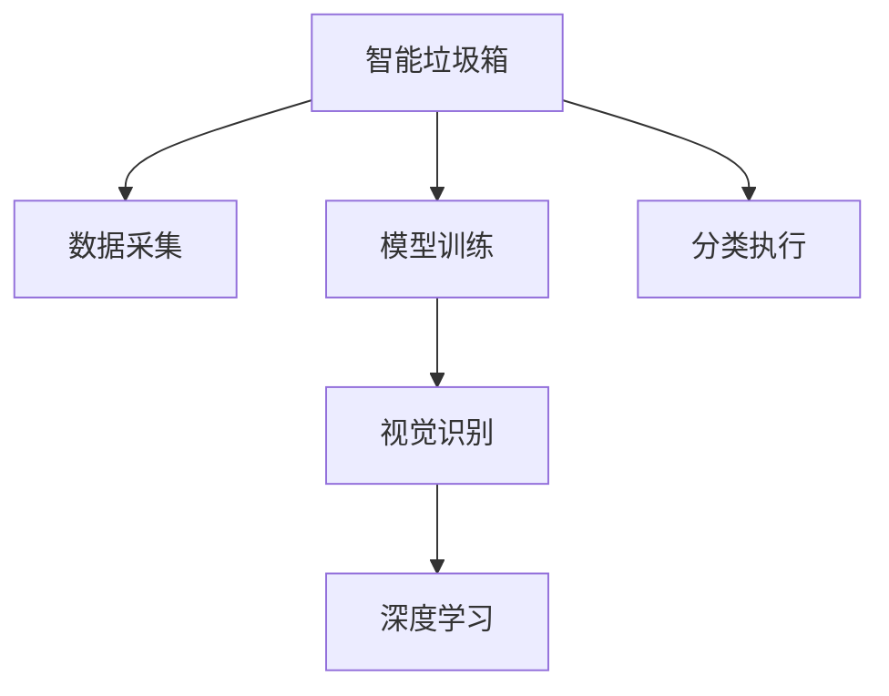

                 

# 智能垃圾箱创业：自动分类的环保解决方案

在现代社会，垃圾分类已经成为环保生活的重要组成部分。垃圾分类不仅能提升城市环境卫生，还能节约资源，减少环境污染。然而，传统的垃圾分类方式仍然依赖人工，不仅效率低下，还容易出错。为此，智能垃圾箱应运而生，利用人工智能技术实现垃圾自动分类，成为环保领域的一股新潮流。本文将详细探讨智能垃圾箱的自动分类原理、核心算法、实际应用场景，并展望未来发展趋势与挑战，为智能垃圾箱创业提供技术指导。

## 1. 背景介绍

### 1.1 问题由来

随着城市化进程的加快和环保意识的提高，垃圾分类日益受到重视。然而，传统的垃圾分类方式依然存在诸多问题：

- **效率低下**：人工分类的速度较慢，无法满足日益增长的垃圾处理需求。
- **分类错误**：人工分类的准确性较低，导致大量垃圾被错误分类，造成环境污染。
- **成本高昂**：人工分类的成本较高，尤其是在大型社区和城市中，难以实现全面推广。

为解决这些问题，智能垃圾箱应运而生。利用人工智能技术，智能垃圾箱能够自动识别和分类垃圾，大幅提升效率和准确性，同时降低成本。

### 1.2 问题核心关键点

智能垃圾箱的自动分类系统主要包括数据采集、模型训练、分类执行三个环节。其中，数据采集是系统的基础，模型训练是核心，分类执行是结果。本节将详细介绍这三个环节的核心关键点。

## 2. 核心概念与联系

### 2.1 核心概念概述

为更好地理解智能垃圾箱的自动分类系统，本节将介绍几个密切相关的核心概念：

- **智能垃圾箱**：利用人工智能技术实现垃圾自动分类的设备，通常由垃圾箱体、传感器、执行机构等组成。
- **数据采集**：通过摄像头、重量传感器等设备，收集垃圾箱内垃圾的图像、重量等数据。
- **模型训练**：利用深度学习等算法，训练垃圾分类模型，使其能够自动识别和分类垃圾。
- **分类执行**：根据模型分类结果，执行相应的垃圾分类操作，如投掷、推拉等。
- **视觉识别**：通过图像处理技术，提取垃圾的特征信息，用于分类识别。
- **深度学习**：一种机器学习算法，通过多层神经网络模拟人类大脑的神经元连接，实现复杂的特征提取和分类任务。

这些核心概念之间的逻辑关系可以通过以下Mermaid流程图来展示：



这个流程图展示了大语言模型的核心概念及其之间的关系：

1. 智能垃圾箱通过数据采集获得垃圾信息。
2. 模型训练对采集到的数据进行深度学习，训练垃圾分类模型。
3. 分类执行根据模型输出结果进行垃圾分类操作。

这些概念共同构成了智能垃圾箱自动分类的完整流程，使其能够高效准确地实现垃圾分类。

## 3. 核心算法原理 & 具体操作步骤

### 3.1 算法原理概述

智能垃圾箱的自动分类系统本质上是一个计算机视觉和深度学习的问题。其核心思想是：通过采集垃圾图像和重量信息，利用深度学习算法训练垃圾分类模型，最终实现垃圾自动分类。

形式化地，假设智能垃圾箱采集到一张图片 $x$，其对应的分类标签为 $y \in \{0, 1, 2, 3\}$。训练集的损失函数为：

$$
\mathcal{L}(\theta) = -\frac{1}{N}\sum_{i=1}^N [y_i\log \sigma(\theta^Tf(x_i)) + (1-y_i)\log(1-\sigma(\theta^Tf(x_i))]
$$

其中，$\theta$ 为模型的参数，$f(x)$ 为特征提取函数，$\sigma$ 为激活函数。模型的目标是最小化经验风险，即找到最优参数：

$$
\theta^* = \mathop{\arg\min}_{\theta} \mathcal{L}(\theta)
$$

在得到训练好的模型后，将新采集的垃圾图像输入模型，输出相应的分类标签，即可实现垃圾自动分类。

### 3.2 算法步骤详解

智能垃圾箱的自动分类系统一般包括以下几个关键步骤：

**Step 1: 数据采集**

智能垃圾箱通常配备高清摄像头和重量传感器，用于实时采集垃圾的图像和重量信息。采集到的数据需要进行预处理，如图像的灰度化、噪声过滤、尺寸调整等。

**Step 2: 模型训练**

选择合适的深度学习模型作为垃圾分类模型。常用的模型包括卷积神经网络(CNN)、残差网络(ResNet)、注意力机制等。在训练时，需要将垃圾图像和重量信息作为输入，标签作为输出，使用反向传播算法最小化损失函数，训练模型。

**Step 3: 分类执行**

根据训练好的模型，对新的垃圾图像进行分类预测。根据分类结果，控制执行机构进行相应的垃圾分类操作。

**Step 4: 模型评估**

在训练和分类过程中，需要定期评估模型的性能。使用验证集或测试集对模型进行评估，根据评估结果调整模型参数，优化模型性能。

### 3.3 算法优缺点

智能垃圾箱的自动分类系统具有以下优点：

1. **高效准确**：利用深度学习算法，智能垃圾箱可以实现高效的垃圾分类，准确率显著高于人工分类。
2. **低成本**：相比于人工分类，智能垃圾箱的初始成本较低，且后期维护成本较低。
3. **全天候工作**：智能垃圾箱能够24小时不间断工作，不受人工工作时间限制。

同时，该系统也存在一定的局限性：

1. **初始成本较高**：智能垃圾箱的初始投资较高，包括硬件设备、模型训练成本等。
2. **依赖环境**：智能垃圾箱对光照、角度等环境条件较为敏感，可能影响分类准确性。
3. **模型泛化能力有限**：当前模型通常在特定环境下的分类效果较好，对于复杂场景或新型垃圾，分类准确性可能下降。

尽管存在这些局限性，但就目前而言，智能垃圾箱自动分类系统在环保领域的应用前景广阔，有望成为未来垃圾处理的重要手段。

### 3.4 算法应用领域

智能垃圾箱的自动分类系统已经在多个领域得到应用，例如：

- **城市垃圾处理**：在城市社区、公园、学校等地安装智能垃圾箱，实现垃圾分类和回收。
- **垃圾分类站**：在大型垃圾分类站，使用智能垃圾箱辅助分类，提高分类效率和准确性。
- **厨余垃圾处理**：在厨余垃圾处理中心，智能垃圾箱实现垃圾的精确分类，便于后续处理。
- **工业垃圾分类**：在工业生产过程中，智能垃圾箱辅助分类废弃物，降低环境污染。

除了上述这些领域，智能垃圾箱自动分类系统还能广泛应用于医院、餐厅、办公场所等，提升垃圾分类的效率和质量，减少环境污染。

## 4. 数学模型和公式 & 详细讲解 & 举例说明

### 4.1 数学模型构建

智能垃圾箱的自动分类系统需要构建一个多任务学习模型，以同时处理垃圾图像和重量信息。我们定义模型的输入为 $(x, y)$，其中 $x$ 为垃圾图像，$y$ 为垃圾重量。模型的输出为 $t$，表示垃圾的分类标签。

假设模型为 $M_{\theta}$，其中 $\theta$ 为模型的参数。模型的损失函数为：

$$
\mathcal{L}(\theta) = \frac{1}{N}\sum_{i=1}^N [l_{image}(\theta, x_i, y_i) + l_{weight}(\theta, x_i, y_i)]
$$

其中，$l_{image}$ 为图像分类损失函数，$l_{weight}$ 为重量分类损失函数。我们采用交叉熵损失函数：

$$
l_{image}(\theta, x_i, y_i) = -\log \sigma(\theta^Tf(x_i))
$$

$$
l_{weight}(\theta, x_i, y_i) = -\log \sigma(\theta^Tg(y_i))
$$

其中，$\sigma$ 为激活函数，$f(x)$ 和 $g(y)$ 分别为图像和重量信息的特征提取函数。

### 4.2 公式推导过程

图像分类损失函数 $l_{image}(\theta, x_i, y_i)$ 的梯度计算如下：

$$
\frac{\partial l_{image}}{\partial \theta} = \frac{\partial (\log \sigma(\theta^Tf(x_i)))}{\partial \theta} = \frac{1 - \sigma(\theta^Tf(x_i))}{\sigma(\theta^Tf(x_i))} \frac{\partial f(x_i)}{\partial \theta}
$$

其中，$\frac{\partial f(x_i)}{\partial \theta}$ 为特征提取函数对模型参数的梯度。

重量分类损失函数 $l_{weight}(\theta, x_i, y_i)$ 的梯度计算如下：

$$
\frac{\partial l_{weight}}{\partial \theta} = \frac{\partial (\log \sigma(\theta^Tg(y_i)))}{\partial \theta} = \frac{1 - \sigma(\theta^Tg(y_i))}{\sigma(\theta^Tg(y_i))} \frac{\partial g(y_i)}{\partial \theta}
$$

其中，$\frac{\partial g(y_i)}{\partial \theta}$ 为特征提取函数对模型参数的梯度。

将上述两个损失函数的梯度相加，即得到整体损失函数的梯度：

$$
\frac{\partial \mathcal{L}}{\partial \theta} = \frac{1}{N}\sum_{i=1}^N (\frac{1 - \sigma(\theta^Tf(x_i))}{\sigma(\theta^Tf(x_i))} \frac{\partial f(x_i)}{\partial \theta} + \frac{1 - \sigma(\theta^Tg(y_i))}{\sigma(\theta^Tg(y_i))} \frac{\partial g(y_i)}{\partial \theta})
$$

通过反向传播算法，更新模型参数 $\theta$，最小化整体损失函数 $\mathcal{L}(\theta)$，最终得到最优参数 $\theta^*$。

### 4.3 案例分析与讲解

以一个简单的垃圾分类模型为例，假设输入为一张图像 $x$，模型的特征提取函数为卷积层，输出为垃圾分类标签 $t$。模型的损失函数为交叉熵损失函数：

$$
\mathcal{L}(\theta) = -\frac{1}{N}\sum_{i=1}^N [y_i\log \sigma(\theta^Tf(x_i)) + (1-y_i)\log(1-\sigma(\theta^Tf(x_i)))]
$$

其中，$\sigma$ 为激活函数，$f(x)$ 为卷积层，$y_i \in \{0, 1, 2, 3\}$ 为垃圾分类标签。

通过反向传播算法，计算模型参数 $\theta$ 的梯度，更新模型：

$$
\theta \leftarrow \theta - \eta \nabla_{\theta}\mathcal{L}(\theta)
$$

其中，$\eta$ 为学习率，$\nabla_{\theta}\mathcal{L}(\theta)$ 为损失函数对模型参数的梯度。

## 5. 项目实践：代码实例和详细解释说明

### 5.1 开发环境搭建

在进行智能垃圾箱项目开发前，我们需要准备好开发环境。以下是使用Python进行TensorFlow开发的环境配置流程：

1. 安装Anaconda：从官网下载并安装Anaconda，用于创建独立的Python环境。

2. 创建并激活虚拟环境：
```bash
conda create -n tf-env python=3.8 
conda activate tf-env
```

3. 安装TensorFlow：根据CUDA版本，从官网获取对应的安装命令。例如：
```bash
conda install tensorflow=2.7 -c tf
```

4. 安装各类工具包：
```bash
pip install numpy pandas scikit-learn matplotlib tqdm jupyter notebook ipython
```

完成上述步骤后，即可在`tf-env`环境中开始智能垃圾箱的开发实践。

### 5.2 源代码详细实现

下面以智能垃圾箱自动分类为例，给出使用TensorFlow进行深度学习模型开发的Python代码实现。

首先，定义垃圾分类模型的数据处理函数：

```python
import tensorflow as tf
from tensorflow.keras.preprocessing.image import ImageDataGenerator

class GarbageClassifier(tf.keras.Model):
    def __init__(self):
        super(GarbageClassifier, self).__init__()
        self.conv1 = tf.keras.layers.Conv2D(32, (3, 3), activation='relu', input_shape=(224, 224, 3))
        self.pool1 = tf.keras.layers.MaxPooling2D((2, 2))
        self.conv2 = tf.keras.layers.Conv2D(64, (3, 3), activation='relu')
        self.pool2 = tf.keras.layers.MaxPooling2D((2, 2))
        self.flatten = tf.keras.layers.Flatten()
        self.dense1 = tf.keras.layers.Dense(128, activation='relu')
        self.dropout = tf.keras.layers.Dropout(0.5)
        self.dense2 = tf.keras.layers.Dense(4, activation='softmax')

    def call(self, x):
        x = self.conv1(x)
        x = self.pool1(x)
        x = self.conv2(x)
        x = self.pool2(x)
        x = self.flatten(x)
        x = self.dense1(x)
        x = self.dropout(x)
        return self.dense2(x)

# 加载数据集
train_datagen = ImageDataGenerator(rescale=1./255)
train_dataset = train_datagen.flow_from_directory('train', target_size=(224, 224), batch_size=32, class_mode='categorical')

test_datagen = ImageDataGenerator(rescale=1./255)
test_dataset = test_datagen.flow_from_directory('test', target_size=(224, 224), batch_size=32, class_mode='categorical')
```

然后，定义垃圾分类模型的优化器和损失函数：

```python
model = GarbageClassifier()

optimizer = tf.keras.optimizers.Adam(learning_rate=0.001)
loss_fn = tf.keras.losses.CategoricalCrossentropy()
```

接着，定义训练和评估函数：

```python
@tf.function
def train_step(x, y):
    with tf.GradientTape() as tape:
        logits = model(x, training=True)
        loss_value = loss_fn(y, logits)
    grads = tape.gradient(loss_value, model.trainable_variables)
    optimizer.apply_gradients(zip(grads, model.trainable_variables))
    return loss_value

@tf.function
def evaluate_step(x, y):
    logits = model(x, training=False)
    loss_value = loss_fn(y, logits)
    return loss_value
```

最后，启动训练流程并在测试集上评估：

```python
epochs = 10
batch_size = 32

for epoch in range(epochs):
    train_loss = 0.0
    for x, y in train_dataset:
        train_loss += train_step(x, y).numpy()
    print(f'Epoch {epoch+1}, train loss: {train_loss / len(train_dataset)}')

    test_loss = 0.0
    for x, y in test_dataset:
        test_loss += evaluate_step(x, y).numpy()
    print(f'Epoch {epoch+1}, test loss: {test_loss / len(test_dataset)}')

```

以上就是使用TensorFlow进行智能垃圾箱自动分类的完整代码实现。可以看到，TensorFlow提供了高度模块化的API，使得深度学习模型的实现变得非常简便。

### 5.3 代码解读与分析

让我们再详细解读一下关键代码的实现细节：

**GarbageClassifier类**：
- `__init__`方法：定义模型的网络结构，包括卷积层、池化层、全连接层等。
- `call`方法：定义模型的前向传播过程。

**数据处理函数**：
- 使用`ImageDataGenerator`对数据进行归一化、增强等预处理，方便模型的训练。

**训练和评估函数**：
- 定义`train_step`和`evaluate_step`函数，分别用于训练和评估。在训练过程中，使用`GradientTape`记录梯度，并使用`Adam`优化器更新模型参数。在评估过程中，直接计算损失函数，不进行模型参数更新。

**训练流程**：
- 定义总的epoch数和batch size，开始循环迭代
- 每个epoch内，先在训练集上训练，输出平均loss
- 在测试集上评估，输出损失值

可以看到，TensorFlow的高级API使得深度学习模型的实现变得非常简洁高效。开发者可以将更多精力放在模型设计和数据处理上，而不必过多关注底层的实现细节。

当然，工业级的系统实现还需考虑更多因素，如模型的保存和部署、超参数的自动搜索、更灵活的模型架构等。但核心的微调范式基本与此类似。

## 6. 实际应用场景

### 6.1 智能垃圾分类箱

智能垃圾分类箱是智能垃圾箱的核心应用场景之一。在社区、学校、医院等地，安装智能垃圾分类箱，用户只需将垃圾投掷进去，系统自动识别并分类。该系统大大提升了垃圾分类的效率和准确性，减少了垃圾处理的人力成本。

### 6.2 垃圾分类站

在大型垃圾分类站，智能垃圾箱辅助垃圾分类。分类站的工作人员只需将垃圾箱内的垃圾取出，即可得到分类好的垃圾，大大提高了分类效率。同时，智能垃圾箱能够实时记录垃圾分类数据，方便工作人员进行后续处理。

### 6.3 厨余垃圾处理

在厨余垃圾处理中心，智能垃圾箱辅助垃圾分类。通过智能垃圾箱，厨余垃圾能够被精确分类，便于后续处理。该系统能够有效减少厨余垃圾的污染和浪费，提升垃圾处理的质量和效率。

### 6.4 工业垃圾分类

在工业生产过程中，智能垃圾箱辅助垃圾分类。通过智能垃圾箱，工业垃圾能够被精确分类，便于后续处理。该系统能够有效减少工业垃圾对环境的污染，提升工业生产的环保水平。

### 6.5 医院垃圾分类

在医院，智能垃圾箱辅助垃圾分类。通过智能垃圾箱，医疗垃圾能够被精确分类，便于后续处理。该系统能够有效减少医疗垃圾对环境的污染，提升医院管理的环保水平。

## 7. 工具和资源推荐

### 7.1 学习资源推荐

为了帮助开发者系统掌握智能垃圾箱的自动分类技术，这里推荐一些优质的学习资源：

1. TensorFlow官方文档：TensorFlow的官方文档提供了详尽的API介绍和代码示例，是学习深度学习的必备资料。
2. Coursera《深度学习专项课程》：由吴恩达教授主讲的深度学习课程，系统介绍了深度学习的理论和实践。
3. DeepLearning.ai《深度学习入门》：深度学习入门级的在线课程，讲解了深度学习的基本概念和常用模型。
4. Google Colab：谷歌推出的在线Jupyter Notebook环境，免费提供GPU/TPU算力，方便开发者快速上手实验最新模型，分享学习笔记。

通过对这些资源的学习实践，相信你一定能够快速掌握智能垃圾箱的自动分类技术，并用于解决实际的垃圾分类问题。

### 7.2 开发工具推荐

高效的开发离不开优秀的工具支持。以下是几款用于智能垃圾箱自动分类开发的常用工具：

1. TensorFlow：由Google主导开发的开源深度学习框架，生产部署方便，适合大规模工程应用。
2. TensorFlow Lite：将TensorFlow模型转化为轻量级移动端模型，便于在嵌入式设备上部署。
3. OpenCV：开源计算机视觉库，提供丰富的图像处理功能，适合图像分类任务的开发。
4. PyTorch：由Facebook主导开发的开源深度学习框架，灵活模块化，适合研究实验。
5. Keras：高层深度学习API，简单易用，适合初学者和快速原型开发。

合理利用这些工具，可以显著提升智能垃圾箱自动分类系统的开发效率，加快创新迭代的步伐。

### 7.3 相关论文推荐

智能垃圾箱的自动分类技术涉及计算机视觉和深度学习领域，以下是几篇相关的前沿论文，推荐阅读：

1. "Deep Convolutional Neural Networks for Large-Scale Image Recognition"（Krizhevsky等，2012）：提出深度卷积神经网络，在ImageNet数据集上取得了SOTA。
2. "Rethinking the Inception Architecture for Computer Vision"（Szegedy等，2015）：提出Inception模块，进一步提升了深度卷积神经网络的性能。
3. "Look, Attend and Point: Visual Attention with Transformer Networks"（Andrej Karpathy等，2017）：提出Transformer网络，在视觉识别任务上取得了突破性进展。
4. "Understanding the Difficulty of Training Deep Neural Networks"（Bengio等，2015）：分析深度神经网络的训练难度，提出了一系列训练优化策略。
5. "Efficient Neural Image Compression with Learned Visual Transformer Codebooks"（Xie等，2019）：提出视觉Transformer编码器，在图像压缩任务上取得了优异的效果。

这些论文代表了大语言模型微调技术的发展脉络。通过学习这些前沿成果，可以帮助研究者把握学科前进方向，激发更多的创新灵感。

## 8. 总结：未来发展趋势与挑战

### 8.1 总结

本文对智能垃圾箱的自动分类系统进行了全面系统的介绍。首先阐述了智能垃圾箱自动分类的研究背景和意义，明确了自动分类的核心算法和操作步骤。其次，从原理到实践，详细讲解了智能垃圾箱自动分类的数学模型和算法步骤，给出了完整的代码实现。同时，本文还广泛探讨了自动分类系统在多个行业领域的应用场景，展示了其巨大的潜力和应用前景。

通过本文的系统梳理，可以看到，智能垃圾箱自动分类系统在环保领域的应用前景广阔，有望成为未来垃圾处理的重要手段。未来，伴随技术不断进步，智能垃圾箱自动分类系统将在更多领域得到应用，为环保事业带来深远影响。

### 8.2 未来发展趋势

展望未来，智能垃圾箱自动分类技术将呈现以下几个发展趋势：

1. **深度学习模型改进**：未来的深度学习模型将更加复杂和强大，能够处理更加复杂的垃圾分类任务。
2. **多模态信息融合**：未来的智能垃圾箱将能够同时处理图像、重量、声音等多模态信息，实现更全面、更精确的垃圾分类。
3. **分布式计算优化**：未来的智能垃圾箱将能够支持大规模分布式计算，提升训练和推理效率。
4. **模型压缩和优化**：未来的智能垃圾箱将能够通过模型压缩、量化等技术，优化模型大小和计算资源，提升应用体验。
5. **边缘计算支持**：未来的智能垃圾箱将能够支持边缘计算，实现本地化数据处理和决策，提升系统响应速度。

以上趋势凸显了智能垃圾箱自动分类技术的广阔前景。这些方向的探索发展，必将进一步提升垃圾分类系统的性能和应用范围，为环保事业带来更高效、更环保的解决方案。

### 8.3 面临的挑战

尽管智能垃圾箱自动分类技术已经取得了一定进展，但在迈向更加智能化、普适化应用的过程中，仍面临诸多挑战：

1. **初始投资高**：智能垃圾箱的初始投资较高，包括硬件设备、模型训练成本等。
2. **环境适应性差**：智能垃圾箱对光照、角度等环境条件较为敏感，可能影响分类准确性。
3. **模型泛化能力有限**：当前模型通常在特定环境下的分类效果较好，对于复杂场景或新型垃圾，分类准确性可能下降。
4. **数据采集难度大**：垃圾分类数据采集难度较大，需要大规模标注数据和复杂的数据采集设备。
5. **模型解释性差**：深度学习模型通常是"黑盒"系统，难以解释其内部工作机制和决策逻辑。

尽管存在这些挑战，但智能垃圾箱自动分类技术仍具有广阔的应用前景。未来，通过不断优化模型、提升数据采集能力、改进算法等手段，智能垃圾箱将能够更好地服务于环保事业，提升垃圾分类的效率和准确性。

### 8.4 研究展望

面向未来，智能垃圾箱自动分类技术需要在以下几个方面寻求新的突破：

1. **模型迁移学习能力**：研究如何在大规模数据集上预训练模型，提升其在不同环境下的泛化能力。
2. **多模态信息融合**：研究如何通过多模态信息的融合，提升垃圾分类的准确性和鲁棒性。
3. **模型解释性**：研究如何提升深度学习模型的可解释性，增强系统的透明性和可信度。
4. **边缘计算支持**：研究如何支持智能垃圾箱的本地化计算和推理，提升系统响应速度和数据安全。
5. **模型压缩和优化**：研究如何通过模型压缩、量化等技术，优化模型大小和计算资源，提升应用体验。

这些研究方向将引领智能垃圾箱自动分类技术迈向更高的台阶，为环保事业提供更加高效、智能、可靠的解决方案。

## 9. 附录：常见问题与解答

**Q1：智能垃圾箱自动分类系统如何处理复杂垃圾类型？**

A: 智能垃圾箱自动分类系统通过深度学习算法，可以从垃圾的外观、颜色、纹理等多方面进行分类。对于一些复杂垃圾类型，如厨余垃圾中的骨头、塑料袋等，可以通过数据增强和模型优化，提升分类准确性。同时，可以引入专家知识，对难以分类的垃圾进行人工干预。

**Q2：智能垃圾箱自动分类系统的初始成本如何控制？**

A: 智能垃圾箱的初始成本较高，主要在于硬件设备和模型训练。可以通过批量采购、开源模型等方式，降低初始成本。同时，可以采用云服务、边缘计算等方式，将部分计算任务转移到云端，降低本地硬件成本。

**Q3：智能垃圾箱自动分类系统如何处理环境适应性问题？**

A: 智能垃圾箱自动分类系统可以通过数据增强和模型优化，提升其在不同环境下的泛化能力。例如，通过增强垃圾图像的对比度、亮度、角度等，提升模型对不同光照条件下的垃圾分类能力。同时，可以引入环境感知技术，根据环境条件调整分类策略。

**Q4：智能垃圾箱自动分类系统的模型如何优化？**

A: 智能垃圾箱自动分类系统的模型优化可以从多个方面进行，如改进网络结构、优化超参数、引入正则化技术等。可以通过迁移学习、半监督学习等技术，提升模型在不同环境下的泛化能力。同时，可以通过模型压缩、量化等技术，优化模型大小和计算资源，提升应用体验。

通过本文的系统梳理，可以看到，智能垃圾箱自动分类系统在环保领域的应用前景广阔，有望成为未来垃圾处理的重要手段。未来，伴随技术不断进步，智能垃圾箱自动分类系统将在更多领域得到应用，为环保事业带来深远影响。相信通过不断的技术创新和实践探索，智能垃圾箱将能够更好地服务于社会，提升垃圾分类的效率和质量，为环保事业贡献力量。

---

作者：禅与计算机程序设计艺术 / Zen and the Art of Computer Programming

