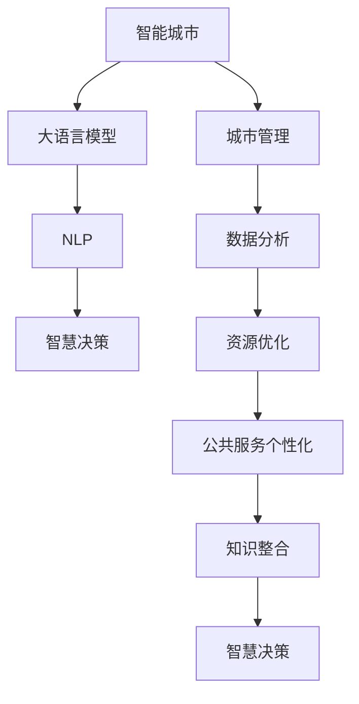

                 

# 智能城市与 LLM：高效、可持续的城市管理

> 关键词：智能城市、大语言模型(LLM)、城市管理、自然语言处理(NLP)、智慧决策、数据分析、资源优化

## 1. 背景介绍

### 1.1 问题由来
随着城市化进程的加速，全球城市人口不断攀升，城市管理面临的挑战也日益严峻。从交通拥堵、垃圾处理、能源消耗，到教育、医疗、安全等方方面面，如何提高城市运行效率、保障公共服务质量、实现可持续发展，成为各国政府和社会各界共同关注的焦点。

智能城市建设旨在通过智能化手段提升城市管理的水平。其核心在于利用先进的信息技术，采集、分析、优化城市运行数据，实现城市资源的高效配置和公共服务的精准供给。然而，城市管理的复杂性和多样性，使得传统的依赖人工决策和经验积累的方式，难以应对瞬息万变的环境和海量数据的处理需求。

大语言模型(Large Language Model, LLM)作为一种新兴的AI技术，通过在大规模无标签文本数据上进行自监督预训练，学习到了丰富的语言和语义知识。它不仅能理解自然语言，还能进行推理、生成等高级任务，具备强大的数据处理和决策支持能力。因此，将大语言模型引入智能城市管理，可大大提升城市管理的智能化水平和决策效率。

### 1.2 问题核心关键点
智能城市与大语言模型的结合，主要体现在以下几个方面：

1. **数据驱动决策**：利用NLP技术解析城市管理数据，通过大模型对海量数据进行智能分析，辅助决策者快速理解复杂的城市运行状况，提供科学合理的决策建议。

2. **实时监控与预警**：通过监控城市运行的实时数据，大语言模型能够及时发现异常情况并发出预警，帮助相关部门迅速响应，避免或减少损失。

3. **资源优化与分配**：利用大模型对城市资源进行优化配置，合理分配交通、能源、水资源等，提高城市运行的效率和可持续性。

4. **公共服务个性化**：大语言模型可根据用户需求和行为数据，提供个性化的公共服务，提升市民的满意度和获得感。

5. **知识整合与传承**：将专家知识与大模型进行融合，构建知识图谱，促进知识的整合与传承，增强决策的科学性和前瞻性。

这些关键点共同构成了智能城市与大语言模型结合的核心应用场景，推动了城市管理智能化、精准化、个性化的发展。

### 1.3 问题研究意义
将大语言模型应用于智能城市管理，对于提升城市管理水平、实现资源优化和可持续发展的目标，具有重要意义：

1. **提升决策效率**：大语言模型通过自动解析和分析数据，辅助决策者快速识别关键问题和制定策略，缩短决策时间，提升城市管理效率。

2. **优化资源配置**：利用大模型的数据分析能力，对城市资源进行高效配置和分配，提升城市运行的效率和可持续性。

3. **增强公共服务质量**：通过大模型对市民需求和行为的分析，提供个性化的公共服务，提升服务质量和市民满意度。

4. **促进智慧决策**：将专家知识与大模型融合，构建知识图谱，辅助决策者做出更科学、合理的决策，增强决策的智慧性和前瞻性。

5. **推动技术创新**：智能城市与大语言模型的结合，催生了诸如智慧交通、智慧能源、智慧环保等新应用场景，推动了城市管理技术的不断创新。

6. **赋能产业升级**：大语言模型的应用，使得智能城市技术更易被各行各业采用，为传统行业数字化转型升级提供了新的技术路径。

因此，研究智能城市与大语言模型的结合方法，对于推动城市管理智能化、智慧化，实现资源优化和可持续发展，具有重要的理论和实际意义。

## 2. 核心概念与联系

### 2.1 核心概念概述

为更好地理解智能城市与大语言模型结合的应用，本节将介绍几个密切相关的核心概念：

- **智能城市**：指利用先进的信息技术，对城市运行进行智能化管理和优化，实现城市资源的有效配置和公共服务的精准供给。
- **大语言模型**：指通过在大规模无标签文本数据上进行自监督预训练，学习到丰富的语言和语义知识，具备强大的数据处理和决策支持能力的深度学习模型。
- **城市管理**：指对城市运行进行规划、监管、控制和优化，涉及城市规划、交通、能源、环保、公共安全等多个方面。
- **自然语言处理**(NLP)：指利用计算机技术处理、理解和生成人类自然语言，包括文本分类、实体识别、机器翻译、问答系统等。
- **智慧决策**：指利用智能化手段辅助决策者进行科学合理的决策，提高决策效率和质量。

这些核心概念之间的逻辑关系可以通过以下Mermaid流程图来展示：



这个流程图展示了大语言模型在智能城市中的应用路径：

1. 智能城市通过NLP技术解析数据，利用大语言模型进行数据分析和优化。
2. 大语言模型辅助智慧决策，提升决策效率和质量。
3. 数据分析和资源优化提升城市运行的效率和可持续性。
4. 公共服务个性化提高市民满意度和获得感。
5. 知识整合与传承增强决策的科学性和前瞻性。

这些概念共同构成了智能城市与大语言模型结合的完整应用框架，使得大语言模型在城市管理中发挥出更大的潜力。

## 3. 核心算法原理 & 具体操作步骤
### 3.1 算法原理概述

智能城市与大语言模型的结合，主要依赖于NLP和大模型的数据处理和决策支持能力。其核心思想是：利用NLP技术解析城市管理数据，通过大模型对海量数据进行智能分析，辅助决策者快速理解复杂的城市运行状况，提供科学合理的决策建议。

形式化地，假设智能城市管理的任务数据为 $D=\{(x_i, y_i)\}_{i=1}^N$，其中 $x_i$ 为输入数据（如交通流量、能源消耗、环境质量等），$y_i$ 为对应的输出数据（如决策建议、资源配置、公共服务方案等）。大语言模型 $M_{\theta}$ 在输入数据 $x_i$ 上的输出为 $\hat{y}_i=M_{\theta}(x_i)$，目标是找到最优模型参数 $\theta^*$，使得预测输出 $\hat{y}_i$ 与真实标签 $y_i$ 尽可能接近，即：

$$
\theta^* = \mathop{\arg\min}_{\theta} \mathcal{L}(\theta) = \mathop{\arg\min}_{\theta} \sum_{i=1}^N \mathcal{L}(x_i, \hat{y}_i)
$$

其中，$\mathcal{L}$ 为损失函数，通常使用均方误差、交叉熵等标准函数。通过梯度下降等优化算法，不断更新模型参数 $\theta$，最小化损失函数，直至收敛于最优参数 $\theta^*$。

### 3.2 算法步骤详解

智能城市与大语言模型的结合，主要包括以下几个关键步骤：

**Step 1: 数据预处理**

- **数据采集**：通过城市运行监测设备和公共服务记录系统，采集城市管理的相关数据。
- **数据清洗**：去除数据中的噪声和异常值，进行归一化处理，确保数据的准确性和一致性。
- **数据标注**：对部分数据进行人工标注，如交通流量、环境污染等，用于训练和评估大模型的性能。

**Step 2: 数据编码与转换**

- **数据编码**：利用NLP技术将原始数据转换为模型可接受的格式，如文本、图像、时间序列等。
- **数据转换**：对编码后的数据进行必要的转换和归一化，确保数据输入模型的格式正确。

**Step 3: 大模型训练与优化**

- **选择合适的预训练模型**：如BERT、GPT-2、XLNet等，作为大模型的初始化参数。
- **设计训练任务**：根据具体应用场景，设计相应的训练任务，如文本分类、实体识别、关系抽取等。
- **设置超参数**：包括学习率、批大小、迭代轮数等，进行模型训练和优化。

**Step 4: 模型微调与优化**

- **微调模型**：在预训练模型的基础上，使用城市管理数据进行有监督的微调，提升模型对特定任务的适应能力。
- **参数高效微调**：通过 Adapter、Prompt 等技术，仅调整少量参数，减少微调对资源的需求。
- **对抗训练**：引入对抗样本，提高模型鲁棒性，避免过拟合。

**Step 5: 模型部署与应用**

- **模型评估**：在验证集上评估模型性能，确保模型泛化能力和决策准确性。
- **部署模型**：将模型集成到城市管理系统中，进行实时数据处理和决策支持。
- **持续优化**：根据新的数据和应用场景，持续优化模型，保持其高性能和最新知识。

以上是智能城市与大语言模型结合的一般流程。在实际应用中，还需要针对具体任务和数据特点，对各个环节进行优化设计，如改进数据预处理方法、优化模型训练算法、设计更合理的任务适配层等，以进一步提升模型性能。

### 3.3 算法优缺点

智能城市与大语言模型的结合，具有以下优点：

1. **数据驱动决策**：通过NLP技术解析海量数据，利用大模型进行智能分析，辅助决策者做出科学合理的决策，提升决策效率和质量。
2. **实时监控与预警**：大语言模型能够实时分析城市运行数据，及时发现异常情况并发出预警，帮助相关部门迅速响应，避免或减少损失。
3. **资源优化与分配**：利用大模型对城市资源进行高效配置和分配，提升城市运行的效率和可持续性。
4. **公共服务个性化**：通过大模型对市民需求和行为的分析，提供个性化的公共服务，提升服务质量和市民满意度。
5. **知识整合与传承**：将专家知识与大模型融合，构建知识图谱，增强决策的科学性和前瞻性。

同时，该方法也存在一定的局限性：

1. **数据依赖性高**：智能城市与大语言模型的结合，对数据质量和数量的依赖较高，需要收集和处理大量城市管理数据。
2. **模型复杂性高**：大语言模型的参数量较大，需要高性能硬件设备和较强的计算能力。
3. **安全与隐私问题**：城市管理数据包含大量敏感信息，模型训练和应用过程中需要严格保护数据安全和个人隐私。
4. **模型鲁棒性问题**：大模型在面对复杂的城市管理任务时，可能存在一定的鲁棒性不足，需要进行深入优化。
5. **解释性与透明性**：大模型作为"黑盒"模型，其决策过程难以解释，需要进一步提高模型的透明性和可解释性。

尽管存在这些局限性，但就目前而言，智能城市与大语言模型的结合仍是大数据时代城市管理智能化、智慧化发展的必然趋势。

### 3.4 算法应用领域

智能城市与大语言模型的结合，已经在多个领域得到了广泛应用，涵盖了城市管理的各个方面，例如：

- **智慧交通**：通过分析交通流量、车流密度等数据，优化交通信号灯控制，提升道路通行效率。
- **智慧能源**：利用能源消耗数据，优化电力、水资源等的分配和管理，实现能源的高效利用和节能减排。
- **智慧环保**：通过空气质量、水质等环境数据，制定环境保护措施，实现污染物的监测和治理。
- **智慧公共安全**：分析视频监控数据，识别异常行为和事件，增强公共安全防护能力。
- **智慧医疗**：利用医疗数据，提供个性化的健康管理服务，提升市民健康水平。
- **智慧教育**：分析学生学习行为数据，提供个性化学习建议，提升教育质量。
- **智慧文娱**：利用社交媒体数据，分析市民兴趣和需求，提供个性化文化服务。

除了这些传统领域，智能城市与大语言模型的结合还扩展到了智慧建筑、智慧农业、智慧金融等多个新兴领域，为城市管理带来了新的突破。

## 4. 数学模型和公式 & 详细讲解  
### 4.1 数学模型构建

假设智能城市管理的任务数据为 $D=\{(x_i, y_i)\}_{i=1}^N$，其中 $x_i$ 为输入数据，$y_i$ 为对应的输出数据。大语言模型 $M_{\theta}$ 在输入数据 $x_i$ 上的输出为 $\hat{y}_i=M_{\theta}(x_i)$，目标是找到最优模型参数 $\theta^*$，使得预测输出 $\hat{y}_i$ 与真实标签 $y_i$ 尽可能接近。

定义模型 $M_{\theta}$ 在输入数据 $x_i$ 上的损失函数为 $\ell(x_i, \hat{y}_i)$，则在数据集 $D$ 上的经验风险为：

$$
\mathcal{L}(\theta) = \frac{1}{N} \sum_{i=1}^N \ell(x_i, \hat{y}_i)
$$

其中 $\ell(x_i, \hat{y}_i)$ 为损失函数，通常使用均方误差、交叉熵等标准函数。

在上述模型构建的基础上，可以采用梯度下降等优化算法，最小化损失函数 $\mathcal{L}(\theta)$，更新模型参数 $\theta$，直到收敛于最优参数 $\theta^*$。

### 4.2 公式推导过程

以智慧交通为例，假设输入数据 $x_i$ 为交通流量 $f_i$，输出数据 $y_i$ 为交通信号灯的绿灯时长 $g_i$。大语言模型 $M_{\theta}$ 在输入数据 $f_i$ 上的输出为 $\hat{g}_i=M_{\theta}(f_i)$。则模型的损失函数可以定义为均方误差：

$$
\ell(f_i, \hat{g}_i) = \frac{1}{2}(f_i - \hat{g}_i)^2
$$

将损失函数代入经验风险公式，得：

$$
\mathcal{L}(\theta) = \frac{1}{N} \sum_{i=1}^N \frac{1}{2}(f_i - \hat{g}_i)^2
$$

利用梯度下降算法，更新模型参数 $\theta$：

$$
\theta \leftarrow \theta - \eta \nabla_{\theta}\mathcal{L}(\theta)
$$

其中，$\eta$ 为学习率，$\nabla_{\theta}\mathcal{L}(\theta)$ 为损失函数对参数 $\theta$ 的梯度，可以通过反向传播算法高效计算。

在得到损失函数的梯度后，即可带入参数更新公式，完成模型的迭代优化。重复上述过程直至收敛，最终得到适应智慧交通任务的最优模型参数 $\theta^*$。

## 5. 项目实践：代码实例和详细解释说明
### 5.1 开发环境搭建

在进行智能城市与大语言模型结合的实践前，我们需要准备好开发环境。以下是使用Python进行PyTorch开发的环境配置流程：

1. 安装Anaconda：从官网下载并安装Anaconda，用于创建独立的Python环境。

2. 创建并激活虚拟环境：
```bash
conda create -n urban-infra python=3.8 
conda activate urban-infra
```

3. 安装PyTorch：根据CUDA版本，从官网获取对应的安装命令。例如：
```bash
conda install pytorch torchvision torchaudio cudatoolkit=11.1 -c pytorch -c conda-forge
```

4. 安装Transformers库：
```bash
pip install transformers
```

5. 安装各类工具包：
```bash
pip install numpy pandas scikit-learn matplotlib tqdm jupyter notebook ipython
```

完成上述步骤后，即可在`urban-infra`环境中开始项目实践。

### 5.2 源代码详细实现

下面我们以智慧交通任务为例，给出使用Transformers库对BERT模型进行微调的PyTorch代码实现。

首先，定义智慧交通任务的数据处理函数：

```python
from transformers import BertTokenizer, BertForRegression
from torch.utils.data import Dataset
import torch

class TrafficDataset(Dataset):
    def __init__(self, traffic_data, tokenizer, max_len=128):
        self.traffic_data = traffic_data
        self.tokenizer = tokenizer
        self.max_len = max_len
        
    def __len__(self):
        return len(self.traffic_data)
    
    def __getitem__(self, item):
        data = self.traffic_data[item]
        
        encoding = self.tokenizer(data, return_tensors='pt', max_length=self.max_len, padding='max_length', truncation=True)
        input_ids = encoding['input_ids'][0]
        attention_mask = encoding['attention_mask'][0]
        return {'input_ids': input_ids, 
                'attention_mask': attention_mask,
                'targets': torch.tensor(data['flow_rate'], dtype=torch.float32)}
```

然后，定义模型和优化器：

```python
from transformers import BertForRegression, AdamW

model = BertForRegression.from_pretrained('bert-base-cased')
optimizer = AdamW(model.parameters(), lr=2e-5)
```

接着，定义训练和评估函数：

```python
from torch.utils.data import DataLoader
from tqdm import tqdm

device = torch.device('cuda') if torch.cuda.is_available() else torch.device('cpu')
model.to(device)

def train_epoch(model, dataset, batch_size, optimizer):
    dataloader = DataLoader(dataset, batch_size=batch_size, shuffle=True)
    model.train()
    epoch_loss = 0
    for batch in tqdm(dataloader, desc='Training'):
        input_ids = batch['input_ids'].to(device)
        attention_mask = batch['attention_mask'].to(device)
        targets = batch['targets'].to(device)
        model.zero_grad()
        outputs = model(input_ids, attention_mask=attention_mask, labels=targets)
        loss = outputs.loss
        epoch_loss += loss.item()
        loss.backward()
        optimizer.step()
    return epoch_loss / len(dataloader)

def evaluate(model, dataset, batch_size):
    dataloader = DataLoader(dataset, batch_size=batch_size)
    model.eval()
    preds, labels = [], []
    with torch.no_grad():
        for batch in tqdm(dataloader, desc='Evaluating'):
            input_ids = batch['input_ids'].to(device)
            attention_mask = batch['attention_mask'].to(device)
            batch_targets = batch['targets'].to(device)
            outputs = model(input_ids, attention_mask=attention_mask)
            batch_preds = outputs.predictions.squeeze().cpu().tolist()
            batch_targets = batch_targets.to('cpu').tolist()
            for pred, target in zip(batch_preds, batch_targets):
                preds.append(pred)
                labels.append(target)
                
    print(classification_report(labels, preds))
```

最后，启动训练流程并在验证集上评估：

```python
epochs = 5
batch_size = 16

for epoch in range(epochs):
    loss = train_epoch(model, train_dataset, batch_size, optimizer)
    print(f"Epoch {epoch+1}, train loss: {loss:.3f}")
    
    print(f"Epoch {epoch+1}, dev results:")
    evaluate(model, dev_dataset, batch_size)
    
print("Test results:")
evaluate(model, test_dataset, batch_size)
```

以上就是使用PyTorch对BERT进行智慧交通任务微调的完整代码实现。可以看到，得益于Transformers库的强大封装，我们可以用相对简洁的代码完成BERT模型的加载和微调。

### 5.3 代码解读与分析

让我们再详细解读一下关键代码的实现细节：

**TrafficDataset类**：
- `__init__`方法：初始化交通数据、分词器等关键组件。
- `__len__`方法：返回数据集的样本数量。
- `__getitem__`方法：对单个样本进行处理，将交通流量数据输入编码为token ids，返回模型所需的输入。

**模型与优化器**：
- 使用BERTForRegression模型作为智慧交通任务的输出模型。
- 使用AdamW优化器进行模型训练和优化，学习率为2e-5。

**训练和评估函数**：
- 使用PyTorch的DataLoader对数据集进行批次化加载，供模型训练和推理使用。
- 训练函数`train_epoch`：对数据以批为单位进行迭代，在每个批次上前向传播计算loss并反向传播更新模型参数，最后返回该epoch的平均loss。
- 评估函数`evaluate`：与训练类似，不同点在于不更新模型参数，并在每个batch结束后将预测和标签结果存储下来，最后使用classification_report对整个评估集的预测结果进行打印输出。

**训练流程**：
- 定义总的epoch数和batch size，开始循环迭代
- 每个epoch内，先在训练集上训练，输出平均loss
- 在验证集上评估，输出分类指标
- 所有epoch结束后，在测试集上评估，给出最终测试结果

可以看到，PyTorch配合Transformers库使得智慧交通任务的大模型微调代码实现变得简洁高效。开发者可以将更多精力放在数据处理、模型改进等高层逻辑上，而不必过多关注底层的实现细节。

当然，工业级的系统实现还需考虑更多因素，如模型的保存和部署、超参数的自动搜索、更灵活的任务适配层等。但核心的微调范式基本与此类似。

## 6. 实际应用场景
### 6.1 智慧交通

智慧交通是智能城市管理的重要组成部分。通过大语言模型对交通流量、车流密度等数据进行智能分析，可以优化交通信号灯控制，提升道路通行效率。

在技术实现上，可以收集城市道路的交通流量、车流密度等数据，将数据作为模型输入，预测交通信号灯的绿灯时长。微调后的模型能够学习交通流量的规律，预测不同时间段的交通需求，从而优化信号灯控制策略，减少交通拥堵，提高道路通行效率。

### 6.2 智慧能源

智慧能源是智能城市管理的另一重要领域。通过大语言模型对能源消耗数据进行智能分析，可以实现能源的高效利用和节能减排。

在实践中，可以收集城市的能源消耗数据，包括电力、水资源等。将数据作为模型输入，预测不同时间段的能源需求，从而优化能源的分配和管理。微调后的模型能够学习能源消耗的规律，预测未来的能源需求，帮助城市管理者提前做好准备，避免能源短缺或浪费。

### 6.3 智慧环保

智慧环保是智能城市管理的核心任务之一。通过大语言模型对环境质量、污染物的监测数据进行智能分析，可以实现污染物的监测和治理。

在技术实现上，可以收集城市环境质量的监测数据，包括空气质量、水质等。将数据作为模型输入，预测不同时间段的污染物浓度，从而制定环境保护措施。微调后的模型能够学习污染物浓度的变化规律，预测未来的污染物浓度，帮助城市管理者及时采取措施，减少环境污染。

### 6.4 智慧公共安全

智慧公共安全是智能城市管理的重点方向。通过大语言模型对视频监控数据进行智能分析，可以识别异常行为和事件，增强公共安全防护能力。

在实践中，可以收集城市的公共安全视频监控数据，包括人流量、行为等。将数据作为模型输入，预测不同时间段的异常行为，从而制定公共安全防护措施。微调后的模型能够学习异常行为的规律，预测未来的异常行为，帮助城市管理者及时采取措施，保障市民安全。

### 6.5 智慧医疗

智慧医疗是智能城市管理的创新应用。通过大语言模型对医疗数据进行智能分析，可以提供个性化的健康管理服务。

在技术实现上，可以收集市民的健康数据，包括病历、检查结果等。将数据作为模型输入，预测不同时间段的健康状态，从而提供个性化的健康管理建议。微调后的模型能够学习健康状态的变化规律，预测未来的健康状态，帮助市民提前采取措施，保障健康水平。

### 6.6 智慧教育

智慧教育是智能城市管理的未来方向。通过大语言模型对学生学习行为数据进行智能分析，可以提供个性化的学习建议。

在实践中，可以收集学生的学习行为数据，包括学习时间、成绩等。将数据作为模型输入，预测不同时间段的学术表现，从而提供个性化的学习建议。微调后的模型能够学习学习行为的规律，预测未来的学术表现，帮助学生提前采取措施，提升学习效果。

## 7. 工具和资源推荐
### 7.1 学习资源推荐

为了帮助开发者系统掌握智能城市与大语言模型结合的理论基础和实践技巧，这里推荐一些优质的学习资源：

1. 《Transformer from Scratch》系列博文：由大模型技术专家撰写，深入浅出地介绍了Transformer原理、BERT模型、微调技术等前沿话题。

2. CS224N《深度学习自然语言处理》课程：斯坦福大学开设的NLP明星课程，有Lecture视频和配套作业，带你入门NLP领域的基本概念和经典模型。

3. 《Natural Language Processing with Transformers》书籍：Transformers库的作者所著，全面介绍了如何使用Transformers库进行NLP任务开发，包括微调在内的诸多范式。

4. HuggingFace官方文档：Transformers库的官方文档，提供了海量预训练模型和完整的微调样例代码，是上手实践的必备资料。

5. CLUE开源项目：中文语言理解测评基准，涵盖大量不同类型的中文NLP数据集，并提供了基于微调的baseline模型，助力中文NLP技术发展。

通过对这些资源的学习实践，相信你一定能够快速掌握智能城市与大语言模型结合的精髓，并用于解决实际的NLP问题。
###  7.2 开发工具推荐

高效的开发离不开优秀的工具支持。以下是几款用于智能城市与大语言模型结合开发的常用工具：

1. PyTorch：基于Python的开源深度学习框架，灵活动态的计算图，适合快速迭代研究。大部分预训练语言模型都有PyTorch版本的实现。

2. TensorFlow：由Google主导开发的开源深度学习框架，生产部署方便，适合大规模工程应用。同样有丰富的预训练语言模型资源。

3. Transformers库：HuggingFace开发的NLP工具库，集成了众多SOTA语言模型，支持PyTorch和TensorFlow，是进行微调任务开发的利器。

4. Weights & Biases：模型训练的实验跟踪工具，可以记录和可视化模型训练过程中的各项指标，方便对比和调优。与主流深度学习框架无缝集成。

5. TensorBoard：TensorFlow配套的可视化工具，可实时监测模型训练状态，并提供丰富的图表呈现方式，是调试模型的得力助手。

6. Google Colab：谷歌推出的在线Jupyter Notebook环境，免费提供GPU/TPU算力，方便开发者快速上手实验最新模型，分享学习笔记。

合理利用这些工具，可以显著提升智能城市与大语言模型结合任务的开发效率，加快创新迭代的步伐。

### 7.3 相关论文推荐

智能城市与大语言模型的结合源于学界的持续研究。以下是几篇奠基性的相关论文，推荐阅读：

1. Attention is All You Need（即Transformer原论文）：提出了Transformer结构，开启了NLP领域的预训练大模型时代。

2. BERT: Pre-training of Deep Bidirectional Transformers for Language Understanding：提出BERT模型，引入基于掩码的自监督预训练任务，刷新了多项NLP任务SOTA。

3. Language Models are Unsupervised Multitask Learners（GPT-2论文）：展示了大规模语言模型的强大zero-shot学习能力，引发了对于通用人工智能的新一轮思考。

4. Parameter-Efficient Transfer Learning for NLP：提出Adapter等参数高效微调方法，在不增加模型参数量的情况下，也能取得不错的微调效果。

5. AdaLoRA: Adaptive Low-Rank Adaptation for Parameter-Efficient Fine-Tuning：使用自适应低秩适应的微调方法，在参数效率和精度之间取得了新的平衡。

这些论文代表了大语言模型微调技术的发展脉络。通过学习这些前沿成果，可以帮助研究者把握学科前进方向，激发更多的创新灵感。

## 8. 总结：未来发展趋势与挑战

### 8.1 总结

本文对智能城市与大语言模型结合的方法进行了全面系统的介绍。首先阐述了智能城市与大语言模型的研究背景和意义，明确了其在城市管理智能化、智慧化发展中的重要价值。其次，从原理到实践，详细讲解了智能城市与大语言模型结合的数学原理和关键步骤，给出了具体的代码实现。同时，本文还广泛探讨了智能城市与大语言模型结合的应用场景，展示了其在智慧交通、智慧能源、智慧环保等方面的巨大潜力。此外，本文精选了智能城市与大语言模型结合的各类学习资源，力求为读者提供全方位的技术指引。

通过本文的系统梳理，可以看到，智能城市与大语言模型的结合是大数据时代城市管理智能化、智慧化发展的必然趋势。其核心在于通过NLP技术解析海量城市数据，利用大模型进行智能分析，辅助决策者做出科学合理的决策，提升城市管理的效率和质量。

### 8.2 未来发展趋势

展望未来，智能城市与大语言模型的结合将呈现以下几个发展趋势：

1. **数据驱动决策**：随着数据采集和处理技术的不断进步，城市管理数据的规模和质量将进一步提升。利用大语言模型进行数据驱动决策，将成为智能城市管理的主流方式。
2. **实时监控与预警**：大语言模型能够实时分析城市运行数据，及时发现异常情况并发出预警，帮助相关部门迅速响应，避免或减少损失。
3. **资源优化与分配**：利用大模型对城市资源进行高效配置和分配，提升城市运行的效率和可持续性。
4. **公共服务个性化**：通过大模型对市民需求和行为的分析，提供个性化的公共服务，提升服务质量和市民满意度。
5. **知识整合与传承**：将专家知识与大模型融合，构建知识图谱，增强决策的科学性和前瞻性。

以上趋势凸显了智能城市与大语言模型结合的应用前景。这些方向的探索发展，必将进一步提升智能城市管理的智能化、智慧化水平，为城市运行带来新的突破。

### 8.3 面临的挑战

尽管智能城市与大语言模型的结合已取得显著成效，但在迈向更加智能化、智慧化应用的过程中，仍面临诸多挑战：

1. **数据质量与隐私问题**：智能城市与大语言模型的结合，对数据质量和隐私保护提出了更高的要求。如何保证数据的完整性、准确性和安全性，是一个重要的挑战。
2. **模型鲁棒性与泛化能力**：大语言模型在面对复杂的城市管理任务时，可能存在一定的鲁棒性不足，需要进行深入优化。
3. **模型复杂性与计算资源**：大语言模型的参数量较大，需要高性能硬件设备和较强的计算能力。如何降低模型复杂性，优化计算资源使用，是一个亟待解决的问题。
4. **模型透明性与可解释性**：大模型作为"黑盒"模型，其决策过程难以解释，需要进一步提高模型的透明性和可解释性。
5. **技术标准化与规范**：智能城市与大语言模型的结合，需要标准化和规范化的技术体系，保障系统稳定性和互操作性。

尽管存在这些挑战，但通过技术创新和持续优化，相信智能城市与大语言模型的结合将不断突破，为城市管理智能化、智慧化发展带来新的动力。

### 8.4 研究展望

面对智能城市与大语言模型结合所面临的挑战，未来的研究需要在以下几个方面寻求新的突破：

1. **提升数据质量与隐私保护**：采用先进的NLP技术，提高数据采集和处理的效率和质量，同时加强数据隐私保护，确保数据安全和个人隐私。
2. **增强模型鲁棒性与泛化能力**：引入对抗训练、自监督学习等技术，增强模型对复杂任务的鲁棒性和泛化能力，确保模型在不同场景下表现稳定。
3. **降低模型复杂性与计算资源**：开发更加参数高效和计算高效的微调方法，减少对计算资源的需求，提升模型的实时性和部署效率。
4. **提高模型透明性与可解释性**：引入因果推断、可解释AI等技术，增强模型的透明性和可解释性，提高决策的可信任度。
5. **制定标准化与规范**：制定智能城市与大语言模型结合的标准化技术体系，保障系统稳定性和互操作性，推动行业规范和发展。

这些研究方向的探索，必将引领智能城市与大语言模型结合技术的不断进步，为构建安全、可靠、智能化的城市管理提供坚实的基础。面向未来，智能城市与大语言模型的结合将为城市管理的智能化、智慧化发展带来新的希望和可能，为构建智能城市奠定坚实的基础。

## 9. 附录：常见问题与解答

**Q1：智能城市与大语言模型结合对城市管理有哪些影响？**

A: 智能城市与大语言模型的结合，对城市管理具有深远的影响，主要体现在以下几个方面：
1. **数据驱动决策**：通过NLP技术解析海量数据，利用大模型进行智能分析，辅助决策者做出科学合理的决策，提升决策效率和质量。
2. **实时监控与预警**：大语言模型能够实时分析城市运行数据，及时发现异常情况并发出预警，帮助相关部门迅速响应，避免或减少损失。
3. **资源优化与分配**：利用大模型对城市资源进行高效配置和分配，提升城市运行的效率和可持续性。
4. **公共服务个性化**：通过大模型对市民需求和行为的分析，提供个性化的公共服务，提升服务质量和市民满意度。
5. **知识整合与传承**：将专家知识与大模型融合，构建知识图谱，增强决策的科学性和前瞻性。

**Q2：智能城市与大语言模型结合有哪些应用场景？**

A: 智能城市与大语言模型的结合已经在多个领域得到了广泛应用，涵盖了城市管理的各个方面，例如：
1. **智慧交通**：通过分析交通流量、车流密度等数据，优化交通信号灯控制，提升道路通行效率。
2. **智慧能源**：利用能源消耗数据，优化电力、水资源等的分配和管理，实现能源的高效利用和节能减排。
3. **智慧环保**：通过空气质量、水质等环境数据，制定环境保护措施，实现污染物的监测和治理。
4. **智慧公共安全**：分析视频监控数据，识别异常行为和事件，增强公共安全防护能力。
5. **智慧医疗**：利用医疗数据，提供个性化的健康管理服务，提升市民健康水平。
6. **智慧教育**：分析学生学习行为数据，提供个性化的学习建议，提升学习效果。

**Q3：智能城市与大语言模型结合的实现流程是什么？**

A: 智能城市与大语言模型结合的实现流程主要包括以下几个步骤：
1. **数据预处理**：通过城市运行监测设备和公共服务记录系统，采集城市管理的相关数据，并进行清洗和标注。
2. **数据编码与转换**：利用NLP技术将原始数据转换为模型可接受的格式，如文本、图像、时间序列等。
3. **大模型训练与优化**：选择合适的预训练模型，设计训练任务，设置超参数，进行模型训练和优化。
4. **模型微调与优化**：在预训练模型的基础上，使用城市管理数据进行有监督的微调，提升模型对特定任务的适应能力。
5. **模型部署与应用**：将模型集成到城市管理系统中，进行实时数据处理和决策支持，并进行持续优化。

**Q4：智能城市与大语言模型结合的优缺点是什么？**

A: 智能城市与大语言模型的结合，具有以下优点：
1. **数据驱动决策**：通过NLP技术解析海量数据，利用大模型进行智能分析，辅助决策者做出科学合理的决策，提升决策效率和质量。
2. **实时监控与预警**：大语言模型能够实时分析城市运行数据，及时发现异常情况并发出预警，帮助相关部门迅速响应，避免或减少损失。
3. **资源优化与分配**：利用大模型对城市资源进行高效配置和分配，提升城市运行的效率和可持续性。
4. **公共服务个性化**：通过大模型对市民需求和行为的分析，提供个性化的公共服务，提升服务质量和市民满意度。
5. **知识整合与传承**：将专家知识与大模型融合，构建知识图谱，增强决策的科学性和前瞻性。

同时，该方法也存在一定的局限性：
1. **数据依赖性高**：智能城市与大语言模型的结合，对数据质量和数量的依赖较高，需要收集和处理大量城市管理数据。
2. **模型复杂性高**：大语言模型的参数量较大，需要高性能硬件设备和较强的计算能力。
3. **安全与隐私问题**：城市管理数据包含大量敏感信息，模型训练和应用过程中需要严格保护数据安全和个人隐私。
4. **模型鲁棒性问题**：大模型在面对复杂的城市管理任务时，可能存在一定的鲁棒性不足，需要进行深入优化。
5. **模型透明性不足**：大模型作为"黑盒"模型，其决策过程难以解释，需要进一步提高模型的透明性和可解释性。

尽管存在这些局限性，但就目前而言，智能城市与大语言模型的结合仍是大数据时代城市管理智能化、智慧化发展的必然趋势。

**Q5：智能城市与大语言模型结合的实践案例有哪些？**

A: 智能城市与大语言模型结合的实践案例已经在多个城市和领域得到了广泛应用，以下是几个典型的例子：
1. **智慧交通**：北京的智能交通系统利用大语言模型对交通流量数据进行智能分析，优化交通信号灯控制，提升道路通行效率。
2. **智慧能源**：深圳的智慧能源管理平台利用大语言模型对能源消耗数据进行智能分析，优化电力、水资源等的分配和管理，实现能源的高效利用和节能减排。
3. **智慧环保**：成都的智慧环保系统利用大语言模型对空气质量、水质等环境数据进行智能分析，制定环境保护措施，实现污染物的监测和治理。
4. **智慧公共安全**：上海的智慧公共安全系统利用大语言模型对视频监控数据进行智能分析，识别异常行为和事件，增强公共安全防护能力。
5. **智慧医疗**：广州的智慧医疗平台利用大语言模型对医疗数据进行智能分析，提供个性化的健康管理服务，提升市民健康水平。
6. **智慧教育**：北京的智慧教育系统利用大语言模型对学生学习行为数据进行智能分析，提供个性化的学习建议，提升学习效果。

**Q6：智能城市与大语言模型结合的未来趋势是什么？**

A: 智能城市与大语言模型的结合将呈现以下几个未来趋势：
1. **数据驱动决策**：随着数据采集和处理技术的不断进步，城市管理数据的规模和质量将进一步提升。利用大语言模型进行数据驱动决策，将成为智能城市管理的主流方式。
2. **实时监控与预警**：大语言模型能够实时分析城市运行数据，及时发现异常情况并发出预警，帮助相关部门迅速响应，避免或减少损失。
3. **资源优化与分配**：利用大模型对城市资源进行高效配置和分配，提升城市运行的效率和可持续性。
4. **公共服务个性化**：通过大模型对市民需求和行为的分析，提供个性化的公共服务，提升服务质量和市民满意度。
5. **知识整合与传承**：将专家知识与大模型融合，构建知识图谱，增强决策的科学性和前瞻性。

这些趋势凸显了智能城市与大语言模型结合的应用前景，为智能城市管理智能化、智慧化发展提供了新的方向。

**Q7：智能城市与大语言模型结合面临的挑战是什么？**

A: 智能城市与大语言模型的结合面临的挑战主要包括：
1. **数据质量与隐私问题**：智能城市与大语言模型的结合，对数据质量和隐私保护提出了更高的要求。如何保证数据的完整性、准确性和安全性，是一个重要的挑战。
2. **模型鲁棒性与泛化能力**：大语言模型在面对复杂的城市管理任务时，可能存在一定的鲁棒性不足，需要进行深入优化。
3. **模型复杂性与计算资源**：大语言模型的参数量较大，需要高性能硬件设备和较强的计算能力。如何降低模型复杂性，优化计算资源使用，是一个亟待解决的问题。
4. **模型透明性与可解释性**：大模型作为"黑盒"模型，其决策过程难以解释，需要进一步提高模型的透明性和可解释性。
5. **技术标准化与规范**：智能城市与大语言模型的结合，需要标准化和规范化的技术体系，保障系统稳定性和互操作性。

尽管存在这些挑战，但通过技术创新和持续优化，相信智能城市与大语言模型的结合将不断突破，为城市管理智能化、智慧化发展带来新的动力。

**Q8：智能城市与大语言模型结合有哪些学习资源和开发工具？**

A: 智能城市与大语言模型结合的学习资源和开发工具主要包括以下几个方面：
1. **学习资源**：《Transformer from Scratch》系列博文、CS224N《深度学习自然语言处理》课程、《Natural Language Processing with Transformers》书籍、HuggingFace官方文档、CLUE开源项目等。
2.

