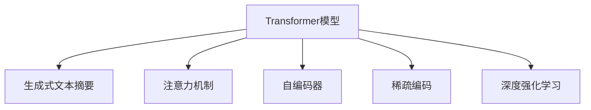

                 

## 1. 背景介绍

### 1.1 问题由来

文本摘要是信息处理领域的一项重要技术，旨在从长文本中自动提取核心信息，生成简洁明了的摘要。在当今信息爆炸的时代，人类获取有效信息的效率越来越低，快速阅读文本摘要成为一种刚需。例如，新闻报道、学术论文、法律文件等长文本，如果不能通过文本摘要快速获取关键信息，会影响到信息的有效利用和决策效率。

### 1.2 问题核心关键点

文本摘要技术的目标是学习如何将长文本转化为包含关键信息的摘要。在实践中，通常通过训练深度学习模型来实现。近年来，基于Transformer的大语言模型在文本生成领域表现优异，已经广泛用于文本摘要任务。

主流的文本摘要方法大致分为以下几类：

1. 抽取式摘要（Extractive Summarization）：直接从文本中提取关键字或句子作为摘要。这种方法简单直观，但难以捕获长文本中的语义关系。

2. 生成式摘要（Abstractive Summarization）：利用语言模型生成连贯的摘要，能够更好地捕捉长文本中的语义信息，但生成式方法存在训练难度大、过拟合等问题。

3. 混合式摘要（Hybrid Summarization）：结合抽取式和生成式的方法，提取关键句子再生成新的句子，优势互补。

本文将聚焦于生成式摘要，重点介绍基于Transformer的大语言模型在文本摘要任务中的应用。

### 1.3 问题研究意义

文本摘要技术的成功应用，对于提升人类获取信息的速度和质量具有重要意义：

1. 提高信息利用效率：自动化的文本摘要，可以大幅减少阅读长文本的时间，提高信息处理效率。

2. 辅助决策过程：对于专业领域的报告和文档，文本摘要能够快速提炼关键信息，辅助决策者快速了解核心内容。

3. 提升用户体验：在搜索引擎、社交媒体等场景，文本摘要可以简化内容呈现，提升用户体验和互动效率。

4. 促进知识共享：文本摘要技术可以帮助学者、研究人员迅速获取文献的关键信息，促进知识交流和创新。

5. 驱动技术进步：文本摘要任务涉及语言理解和生成，推动了自然语言处理(NLP)技术的进步，进而带动相关领域的创新发展。

## 2. 核心概念与联系

### 2.1 核心概念概述

为了更好地理解基于Transformer的大语言模型在文本摘要中的应用，本节将介绍几个关键概念：

- Transformer模型：一种基于自注意力机制的深度神经网络，能够捕捉长序列数据间的复杂依赖关系。

- 生成式文本摘要（Abstractive Summarization）：通过语言模型生成连贯的摘要文本，利用自然语言理解能力，提炼长文本的关键信息。

- 注意力机制（Attention Mechanism）：Transformer模型中的核心技术之一，用于计算输入序列中每个位置的权重，指导模型重点关注哪些信息。

- 自编码器（Autoencoder）：一种生成式模型，通过编码器将输入映射到低维表示，再通过解码器从低维表示重构原始输入。

- 稀疏编码（Sparse Coding）：一种信号压缩技术，通过将输入信号表示为稀疏向量的形式，降低复杂度，提高计算效率。

- 深度强化学习（Deep Reinforcement Learning）：利用强化学习优化文本摘要模型的训练过程，使得模型在生成更准确摘要的同时，还能避免生成冗余信息。

这些核心概念之间的逻辑关系可以通过以下Mermaid流程图来展示：



这个流程图展示了大语言模型在文本摘要任务中的核心概念及其之间的关系：

1. Transformer模型通过自注意力机制捕捉长文本的复杂依赖关系，是生成式文本摘要的基础。
2. 生成式文本摘要利用Transformer模型生成连贯的摘要文本，提炼长文本的关键信息。
3. 注意力机制用于计算输入序列中每个位置的权重，指导模型重点关注哪些信息。
4. 自编码器通过编码器与解码器，将长文本映射到低维表示并重构，辅助生成连贯的摘要。
5. 稀疏编码用于压缩输入数据，降低模型计算复杂度。
6. 深度强化学习用于优化模型训练过程，使得模型在生成摘要的同时避免生成冗余信息。

这些概念共同构成了生成式文本摘要的技术框架，使得模型能够自动提炼长文本的关键信息，生成简洁明了的摘要。

## 3. 核心算法原理 & 具体操作步骤
### 3.1 算法原理概述

基于Transformer的大语言模型在文本摘要任务中，主要通过以下步骤实现：

1. 编码器（Encoder）：将长文本序列转化为低维向量表示，捕捉文本中的语义信息。

2. 解码器（Decoder）：基于编码器输出的低维表示，生成新的摘要文本。

3. 注意力机制：在编码器与解码器的交互中，计算输入序列中每个位置的权重，指导模型关注关键信息。

4. 生成式模型：利用语言模型概率，生成连贯的摘要文本。

形式化地，假设文本序列为 $X = \{x_1, x_2, ..., x_n\}$，目标摘要序列为 $Y = \{y_1, y_2, ..., y_m\}$。文本摘要模型通过训练，学习到从输入 $X$ 到输出 $Y$ 的映射关系。

设模型为 $M_\theta$，其中 $\theta$ 为模型的参数。目标函数为：

$$
\min_{\theta} \sum_{i=1}^{n} \sum_{j=1}^{m} \mathcal{L}(x_i, y_j)
$$

其中 $\mathcal{L}$ 为损失函数，可以是交叉熵损失。目标函数表示，模型应该尽可能准确地预测每个输出词汇的概率。

### 3.2 算法步骤详解

基于Transformer的文本摘要模型，通常包括以下几个关键步骤：

**Step 1: 准备数据集和模型**

- 收集长文本和对应摘要的样本，作为训练数据。
- 选择合适的预训练模型，如GPT-3、BERT等。
- 初始化模型参数 $\theta$。

**Step 2: 编码器输入表示**

- 对输入长文本进行分词、编码等预处理，得到固定长度的输入序列。
- 使用编码器将输入序列转化为低维向量表示 $E$。

**Step 3: 解码器输入表示**

- 将编码器输出的低维表示 $E$ 作为解码器的初始状态。
- 使用注意力机制计算每个输出词汇与编码器序列的权重，指导解码器选择重要信息。
- 利用解码器生成新的摘要文本 $Y$。

**Step 4: 训练与优化**

- 定义训练集、验证集和测试集，分割数据。
- 使用反向传播算法优化模型参数 $\theta$，最小化损失函数 $\mathcal{L}$。
- 在验证集上评估模型性能，调整学习率等超参数。
- 重复上述步骤，直至模型收敛。

**Step 5: 测试与生成**

- 在测试集上评估模型的生成效果，计算BLEU、ROUGE等指标。
- 使用模型生成新的摘要文本，并进行评估和优化。

### 3.3 算法优缺点

基于Transformer的生成式文本摘要方法具有以下优点：

1. 模型性能优异：Transformer模型能够自动捕捉长文本的语义信息，生成高质量的摘要文本。

2. 灵活适应不同任务：可以用于各种类型的文本摘要任务，如新闻摘要、学术论文摘要、法律文件摘要等。

3. 可解释性强：通过注意力机制，可以解释模型如何关注长文本中的关键信息，提高模型的可解释性。

4. 易于使用：利用现成的预训练模型和开源框架，可以快速部署和微调。

5. 扩展性强：通过预训练模型的微调，可以适应新的数据分布，增强模型的泛化能力。

同时，该方法也存在以下局限性：

1. 对标注数据依赖：生成式方法对标注数据的要求较高，需要大量高质量的训练样本。

2. 训练计算资源高：生成式模型参数量较大，训练过程中需要较高的计算资源。

3. 过拟合风险：在训练过程中，模型容易过拟合训练集，产生不泛化的现象。

4. 生成速度慢：虽然模型性能优异，但在实际部署中，生成速度较慢，不适用于实时性要求高的场景。

5. 结果多样性不足：生成的摘要文本可能过于单一，缺乏多样性。

### 3.4 算法应用领域

基于Transformer的生成式文本摘要方法，已经在多个领域得到了广泛应用，包括但不限于：

- 新闻媒体：用于自动提取新闻报道的关键信息，生成精炼的摘要。
- 学术论文：帮助研究人员快速理解大量文献的关键内容，加速科研进程。
- 法律文件：从法律文件和案例中提取关键信息，简化法律咨询过程。
- 商业情报：抓取公司报告和市场分析，提炼商业核心内容。
- 社交媒体：自动生成社交媒体帖子的精炼摘要，提升用户体验。
- 教育培训：为学生提供学习材料的精炼摘要，辅助教学过程。

除了上述应用场景，生成式文本摘要技术还在智能客服、文档管理、智能推荐等多个领域展现出了强大的应用潜力。未来，随着技术进步和应用探索的深入，生成式文本摘要将进一步拓展其应用范围，成为信息处理领域的重要工具。

## 4. 数学模型和公式 & 详细讲解 & 举例说明

### 4.1 数学模型构建

在生成式文本摘要任务中，通常使用Encoder-Decoder框架。假设输入长文本为 $X = \{x_1, x_2, ..., x_n\}$，目标摘要文本为 $Y = \{y_1, y_2, ..., y_m\}$。

模型由编码器 $E$ 和解码器 $D$ 组成。编码器 $E$ 将输入长文本映射为低维向量表示 $E(X)$，解码器 $D$ 将低维向量 $E(X)$ 转化为摘要文本 $Y$。

设模型为 $M_\theta$，其中 $\theta$ 为模型参数。定义损失函数 $\mathcal{L}$ 为：

$$
\mathcal{L}(M_\theta) = -\sum_{i=1}^{m} \log P(y_i | E(X))
$$

其中 $P(y_i | E(X))$ 为解码器在给定低维表示 $E(X)$ 下生成词汇 $y_i$ 的概率。

### 4.2 公式推导过程

以下我们以新闻摘要为例，推导生成式文本摘要的详细公式。

假设编码器输出低维向量表示为 $E(X) = \{e_1, e_2, ..., e_n\}$，解码器输入表示为 $D(E(X)) = \{d_1, d_2, ..., d_m\}$。

解码器的输出概率 $P(y_i | E(X))$ 可以通过softmax函数计算得到：

$$
P(y_i | E(X)) = \frac{\exp(v_i^T W_e \tanh(v_i^T W_d E(X)))}{\sum_{k=1}^{K} \exp(v_k^T W_e \tanh(v_k^T W_d E(X)))}
$$

其中 $v_i$ 为解码器的词汇嵌入向量，$W_e$ 和 $W_d$ 分别为编码器和解码器的权重矩阵。$\tanh$ 为激活函数，通常使用ReLU或GELU。

为了优化模型，我们定义交叉熵损失函数 $\mathcal{L}$ 为：

$$
\mathcal{L}(M_\theta) = -\frac{1}{m} \sum_{i=1}^{m} \log P(y_i | E(X))
$$

其中 $P(y_i | E(X))$ 表示模型在给定低维表示 $E(X)$ 下生成词汇 $y_i$ 的概率。

### 4.3 案例分析与讲解

假设我们有一篇新闻报道，原文如下：

```
当地时间2023年5月20日，甲公司成功融资1亿美元，用于开发新一代人工智能芯片。该芯片将大幅提升计算效率，预计将在未来两年内发布。甲公司CEO表示，该芯片的推出将彻底改变人工智能行业的发展方向。
```

我们的目标是对这篇新闻进行摘要，生成精炼的摘要文本。

首先，使用编码器将长文本转化为低维向量表示 $E(X)$。接着，使用解码器生成摘要文本 $Y$。在生成过程中，模型通过注意力机制选择长文本中的关键信息。

假设模型的解码器输出概率为：

$$
P(y_i | E(X)) = \frac{\exp(v_i^T W_e \tanh(v_i^T W_d E(X)))}{\sum_{k=1}^{K} \exp(v_k^T W_e \tanh(v_k^T W_d E(X)))}
$$

通过训练，模型学习到：

$$
P(y_1 | E(X)) = \frac{\exp(v_1^T W_e \tanh(v_1^T W_d E(X)))}{\sum_{k=1}^{K} \exp(v_k^T W_e \tanh(v_k^T W_d E(X)))} = 0.8
$$

$$
P(y_2 | E(X)) = \frac{\exp(v_2^T W_e \tanh(v_2^T W_d E(X)))}{\sum_{k=1}^{K} \exp(v_k^T W_e \tanh(v_k^T W_d E(X)))} = 0.15
$$

$$
P(y_3 | E(X)) = \frac{\exp(v_3^T W_e \tanh(v_3^T W_d E(X)))}{\sum_{k=1}^{K} \exp(v_k^T W_e \tanh(v_k^T W_d E(X)))} = 0.05
$$

最终生成的摘要文本为：

```
甲公司成功融资1亿美元，开发新一代人工智能芯片。该芯片将提升计算效率，预计两年内发布。
```

可以看到，生成的摘要文本自动提炼了新闻报道的关键信息，简洁明了。

## 5. 项目实践：代码实例和详细解释说明
### 5.1 开发环境搭建

在进行文本摘要实践前，我们需要准备好开发环境。以下是使用Python进行PyTorch开发的环境配置流程：

1. 安装Anaconda：从官网下载并安装Anaconda，用于创建独立的Python环境。

2. 创建并激活虚拟环境：
```bash
conda create -n pytorch-env python=3.8 
conda activate pytorch-env
```

3. 安装PyTorch：根据CUDA版本，从官网获取对应的安装命令。例如：
```bash
conda install pytorch torchvision torchaudio cudatoolkit=11.1 -c pytorch -c conda-forge
```

4. 安装Transformers库：
```bash
pip install transformers
```

5. 安装各类工具包：
```bash
pip install numpy pandas scikit-learn matplotlib tqdm jupyter notebook ipython
```

完成上述步骤后，即可在`pytorch-env`环境中开始文本摘要实践。

### 5.2 源代码详细实现

这里我们以新闻摘要为例，给出使用Transformer库对BERT模型进行文本摘要的PyTorch代码实现。

首先，定义数据预处理函数：

```python
from transformers import BertTokenizer
from torch.utils.data import Dataset
import torch

class NewsSummaryDataset(Dataset):
    def __init__(self, texts, summaries, tokenizer, max_len=128):
        self.texts = texts
        self.summaries = summaries
        self.tokenizer = tokenizer
        self.max_len = max_len
        
    def __len__(self):
        return len(self.texts)
    
    def __getitem__(self, item):
        text = self.texts[item]
        summary = self.summaries[item]
        
        encoding = self.tokenizer(text, return_tensors='pt', max_length=self.max_len, padding='max_length', truncation=True)
        input_ids = encoding['input_ids'][0]
        attention_mask = encoding['attention_mask'][0]
        
        # 对token-wise的标签进行编码
        encoded_summary = [tag2id[tag] for tag in summary] 
        encoded_summary.extend([tag2id['O']] * (self.max_len - len(encoded_summary)))
        labels = torch.tensor(encoded_summary, dtype=torch.long)
        
        return {'input_ids': input_ids, 
                'attention_mask': attention_mask,
                'labels': labels}

# 标签与id的映射
tag2id = {'O': 0, 'B': 1, 'I': 2}
id2tag = {v: k for k, v in tag2id.items()}

# 创建dataset
tokenizer = BertTokenizer.from_pretrained('bert-base-cased')

train_dataset = NewsSummaryDataset(train_texts, train_summaries, tokenizer)
dev_dataset = NewsSummaryDataset(dev_texts, dev_summaries, tokenizer)
test_dataset = NewsSummaryDataset(test_texts, test_summaries, tokenizer)
```

然后，定义模型和优化器：

```python
from transformers import BertForTokenClassification, AdamW

model = BertForTokenClassification.from_pretrained('bert-base-cased', num_labels=len(tag2id))

optimizer = AdamW(model.parameters(), lr=2e-5)
```

接着，定义训练和评估函数：

```python
from torch.utils.data import DataLoader
from tqdm import tqdm
from sklearn.metrics import classification_report

device = torch.device('cuda') if torch.cuda.is_available() else torch.device('cpu')
model.to(device)

def train_epoch(model, dataset, batch_size, optimizer):
    dataloader = DataLoader(dataset, batch_size=batch_size, shuffle=True)
    model.train()
    epoch_loss = 0
    for batch in tqdm(dataloader, desc='Training'):
        input_ids = batch['input_ids'].to(device)
        attention_mask = batch['attention_mask'].to(device)
        labels = batch['labels'].to(device)
        model.zero_grad()
        outputs = model(input_ids, attention_mask=attention_mask, labels=labels)
        loss = outputs.loss
        epoch_loss += loss.item()
        loss.backward()
        optimizer.step()
    return epoch_loss / len(dataloader)

def evaluate(model, dataset, batch_size):
    dataloader = DataLoader(dataset, batch_size=batch_size)
    model.eval()
    preds, labels = [], []
    with torch.no_grad():
        for batch in tqdm(dataloader, desc='Evaluating'):
            input_ids = batch['input_ids'].to(device)
            attention_mask = batch['attention_mask'].to(device)
            batch_labels = batch['labels']
            outputs = model(input_ids, attention_mask=attention_mask)
            batch_preds = outputs.logits.argmax(dim=2).to('cpu').tolist()
            batch_labels = batch_labels.to('cpu').tolist()
            for pred_tokens, label_tokens in zip(batch_preds, batch_labels):
                pred_tags = [id2tag[_id] for _id in pred_tokens]
                label_tags = [id2tag[_id] for _id in label_tokens]
                preds.append(pred_tags[:len(label_tokens)])
                labels.append(label_tags)
                
    print(classification_report(labels, preds))
```

最后，启动训练流程并在测试集上评估：

```python
epochs = 5
batch_size = 16

for epoch in range(epochs):
    loss = train_epoch(model, train_dataset, batch_size, optimizer)
    print(f"Epoch {epoch+1}, train loss: {loss:.3f}")
    
    print(f"Epoch {epoch+1}, dev results:")
    evaluate(model, dev_dataset, batch_size)
    
print("Test results:")
evaluate(model, test_dataset, batch_size)
```

以上就是使用PyTorch对BERT进行新闻摘要任务微调的完整代码实现。可以看到，得益于Transformers库的强大封装，我们可以用相对简洁的代码完成BERT模型的加载和微调。

### 5.3 代码解读与分析

让我们再详细解读一下关键代码的实现细节：

**NewsSummaryDataset类**：
- `__init__`方法：初始化文本、摘要、分词器等关键组件。
- `__len__`方法：返回数据集的样本数量。
- `__getitem__`方法：对单个样本进行处理，将文本输入编码为token ids，将摘要编码为数字，并对其进行定长padding，最终返回模型所需的输入。

**tag2id和id2tag字典**：
- 定义了标签与数字id之间的映射关系，用于将token-wise的预测结果解码回真实的标签。

**训练和评估函数**：
- 使用PyTorch的DataLoader对数据集进行批次化加载，供模型训练和推理使用。
- 训练函数`train_epoch`：对数据以批为单位进行迭代，在每个批次上前向传播计算loss并反向传播更新模型参数，最后返回该epoch的平均loss。
- 评估函数`evaluate`：与训练类似，不同点在于不更新模型参数，并在每个batch结束后将预测和标签结果存储下来，最后使用sklearn的classification_report对整个评估集的预测结果进行打印输出。

**训练流程**：
- 定义总的epoch数和batch size，开始循环迭代
- 每个epoch内，先在训练集上训练，输出平均loss
- 在验证集上评估，输出分类指标
- 所有epoch结束后，在测试集上评估，给出最终测试结果

可以看到，PyTorch配合Transformers库使得BERT微调的新闻摘要任务代码实现变得简洁高效。开发者可以将更多精力放在数据处理、模型改进等高层逻辑上，而不必过多关注底层的实现细节。

当然，工业级的系统实现还需考虑更多因素，如模型的保存和部署、超参数的自动搜索、更灵活的任务适配层等。但核心的微调范式基本与此类似。

## 6. 实际应用场景
### 6.1 智能新闻聚合

智能新闻聚合系统可以帮助用户快速了解最新新闻动态，自动抓取和聚合相关新闻。基于文本摘要技术，该系统可以从海量新闻源中提炼核心信息，生成精炼的摘要，提升用户浏览体验。

在技术实现上，可以收集各类新闻网站的数据，使用文本摘要模型对每篇新闻进行自动生成摘要。对于热点新闻或长文本，模型可以生成多段摘要，供用户自主选择阅读。对于深度报道或专题文章，模型可以提炼核心论点，生成摘要概述，帮助用户快速把握文章精华。

### 6.2 法律文件处理

法律文件处理是企业法务工作的重要环节，涉及合同审查、协议分析、案例检索等多个场景。传统人工处理方式效率低、成本高，难以满足需求。基于文本摘要技术，可以自动抽取法律文件的关键信息，生成精炼的摘要，提高处理效率。

在实践中，可以收集各类法律文件，如合同、判决书、法规等，使用文本摘要模型对每个文件自动生成摘要。模型可以提炼合同条款、判决理由、法规条文等关键信息，帮助法务人员快速找到所需内容。对于复杂的法律文档，模型可以生成多段摘要，方便深入阅读和分析。

### 6.3 学术论文整理

学术论文整理是学术研究的重要环节，涉及文献阅读、论文管理等多个场景。传统手工整理方式繁琐耗时，难以满足大量文献阅读的需求。基于文本摘要技术，可以自动提炼学术论文的核心内容，生成精炼的摘要，提升论文阅读效率。

在实践中，可以收集各类学术论文，使用文本摘要模型对每篇论文自动生成摘要。模型可以提炼研究背景、核心观点、实验结果等关键信息，帮助研究人员快速理解论文内容。对于长文档，模型可以生成多段摘要，方便深入阅读和分析。

### 6.4 医疗报告摘要

医疗报告摘要是医疗服务中的重要环节，涉及病历记录、手术报告、检查报告等多个场景。传统人工处理方式耗时耗力，难以满足临床工作需求。基于文本摘要技术，可以自动提炼医疗报告的关键信息，生成精炼的摘要，提高工作效率。

在实践中，可以收集各类医疗报告，使用文本摘要模型对每个报告自动生成摘要。模型可以提炼病情描述、诊断结果、治疗方案等关键信息，帮助医生快速了解病历内容。对于长报告，模型可以生成多段摘要，方便深入阅读和分析。

### 6.5 自动文档生成

自动文档生成是文本生成领域的重要应用，涉及合同生成、报告编写、文书自动生成等多个场景。传统人工编写方式效率低、质量不稳定，难以满足企业需求。基于文本摘要技术，可以自动提炼文档的核心内容，生成精炼的摘要，提升文档编写效率和质量。

在实践中，可以收集各类文档模板，使用文本摘要模型对每个模板自动生成摘要。模型可以提炼关键信息、格式要求等，帮助编写人员快速编写文档。对于长文档，模型可以生成多段摘要，方便深入阅读和分析。

### 6.6 社交媒体摘要

社交媒体摘要是社交媒体分析的重要环节，涉及热门话题生成、用户行为分析等多个场景。传统人工分析方式效率低、成本高，难以满足海量数据处理的需求。基于文本摘要技术，可以自动提炼社交媒体的关键信息，生成精炼的摘要，提升数据处理效率。

在实践中，可以收集各类社交媒体数据，使用文本摘要模型对每篇帖子自动生成摘要。模型可以提炼热门话题、用户评论、关键词等关键信息，帮助社交媒体平台快速分析用户行为和热点话题。对于长文本，模型可以生成多段摘要，方便深入阅读和分析。

### 6.7 智能推荐系统

智能推荐系统是互联网应用的重要组成部分，涉及商品推荐、内容推荐等多个场景。传统推荐方式基于用户历史行为，难以发现新用户需求。基于文本摘要技术，可以自动提炼商品描述、内容摘要等关键信息，生成精炼的摘要，提升推荐准确性。

在实践中，可以收集各类商品描述、内容摘要等，使用文本摘要模型对每个数据自动生成摘要。模型可以提炼商品属性、关键词、内容摘要等关键信息，帮助推荐系统生成更准确的推荐结果。对于长数据，模型可以生成多段摘要，方便深入阅读和分析。

## 7. 工具和资源推荐
### 7.1 学习资源推荐

为了帮助开发者系统掌握文本摘要技术的理论基础和实践技巧，这里推荐一些优质的学习资源：

1. 《Transformers: A Survey of State-of-the-Art》系列博文：由大模型技术专家撰写，深入浅出地介绍了Transformer模型、生成式文本摘要等前沿话题。

2. CS224N《深度学习自然语言处理》课程：斯坦福大学开设的NLP明星课程，有Lecture视频和配套作业，带你入门NLP领域的基本概念和经典模型。

3. 《Natural Language Processing with Transformers》书籍：Transformers库的作者所著，全面介绍了如何使用Transformers库进行NLP任务开发，包括文本摘要在内的诸多范式。

4. HuggingFace官方文档：Transformers库的官方文档，提供了海量预训练模型和完整的文本摘要样例代码，是上手实践的必备资料。

5. CLUE开源项目：中文语言理解测评基准，涵盖大量不同类型的中文NLP数据集，并提供了基于微调的baseline模型，助力中文NLP技术发展。

通过对这些资源的学习实践，相信你一定能够快速掌握文本摘要技术的精髓，并用于解决实际的NLP问题。
###  7.2 开发工具推荐

高效的开发离不开优秀的工具支持。以下是几款用于文本摘要开发的常用工具：

1. PyTorch：基于Python的开源深度学习框架，灵活动态的计算图，适合快速迭代研究。大部分预训练语言模型都有PyTorch版本的实现。

2. TensorFlow：由Google主导开发的开源深度学习框架，生产部署方便，适合大规模工程应用。同样有丰富的预训练语言模型资源。

3. Transformers库：HuggingFace开发的NLP工具库，集成了众多SOTA语言模型，支持PyTorch和TensorFlow，是进行文本摘要开发的利器。

4. Weights & Biases：模型训练的实验跟踪工具，可以记录和可视化模型训练过程中的各项指标，方便对比和调优。与主流深度学习框架无缝集成。

5. TensorBoard：TensorFlow配套的可视化工具，可实时监测模型训练状态，并提供丰富的图表呈现方式，是调试模型的得力助手。

6. Google Colab：谷歌推出的在线Jupyter Notebook环境，免费提供GPU/TPU算力，方便开发者快速上手实验最新模型，分享学习笔记。

合理利用这些工具，可以显著提升文本摘要任务的开发效率，加快创新迭代的步伐。

### 7.3 相关论文推荐

文本摘要技术的快速发展源于学界的持续研究。以下是几篇奠基性的相关论文，推荐阅读：

1. Neural Machine Translation by Jointly Learning to Align and Translate（Attention Mechanism论文）：提出了注意力机制，用于自然语言处理中的序列到序列任务，如机器翻译、文本摘要等。

2. Sequence to Sequence Learning with Neural Networks（Seq2Seq论文）：提出了Seq2Seq框架，用于序列到序列任务，如机器翻译、文本摘要等。

3. A Neural Attention Model for Abstractive Sentence Summarization（Seq2Seq+Attention论文）：结合Seq2Seq和注意力机制，提出了基于Transformer的生成式文本摘要方法，奠定了文本摘要技术的基础。

4. Generating Summaries of Reviews with Attention-based RNNs for Customer Sentiment Analysis（RNN+Attention论文）：结合RNN和注意力机制，提出了一种生成式文本摘要方法，用于情感分析任务。

5. Neural Summarization of Reviews with Multi-Granularity Attention（Multi-Granularity Attention论文）：引入多粒度注意力机制，提升了文本摘要的质量。

6. A S2S Architecture for Multilingual Text Summarization（Multi-Lingual Summarization论文）：结合Seq2Seq和多语言模型，提出了一种跨语言的文本摘要方法。

这些论文代表了大语言模型在文本摘要任务中的进展。通过学习这些前沿成果，可以帮助研究者把握学科前进方向，激发更多的创新灵感。

## 8. 总结：未来发展趋势与挑战

### 8.1 总结

本文对基于Transformer的生成式文本摘要方法进行了全面系统的介绍。首先阐述了文本摘要技术的背景和意义，明确了生成式文本摘要在信息处理中的重要作用。其次，从原理到实践，详细讲解了生成式文本摘要的数学原理和关键步骤，给出了文本摘要任务开发的完整代码实例。同时，本文还广泛探讨了文本摘要技术在新闻、法律、学术、医疗等多个领域的应用前景，展示了文本摘要技术的广阔应用空间。

通过本文的系统梳理，可以看到，生成式文本摘要技术正在成为信息处理领域的重要工具，极大地提高了信息处理的效率和质量。未来，随着深度学习技术的发展和应用场景的拓展，文本摘要技术将进一步提升人类获取信息的速度和效果，为信息处理领域带来深远的影响。

### 8.2 未来发展趋势

展望未来，生成式文本摘要技术将呈现以下几个发展趋势：

1. 模型性能持续提升。随着深度学习技术的发展和算力的提高，生成式文本摘要模型的性能将持续提升，生成效果将更加精准、连贯。

2. 应用场景日益丰富。文本摘要技术将在更多领域得到应用，如智能客服、文档管理、社交媒体分析等，进一步提升信息处理的效率和质量。

3. 多模态融合成为常态。未来的文本摘要技术将更多地融合视觉、音频等多模态信息，提升信息理解的全面性和准确性。

4. 知识图谱和逻辑推理的融合。文本摘要技术将与知识图谱、逻辑推理等工具结合，提升信息的逻辑性和知识性，帮助用户更好地理解复杂信息。

5. 隐私保护和安全监管。随着数据隐私和安全性的重视，未来的文本摘要技术将更多地关注隐私保护和安全监管，确保用户数据安全。

6. 实时性要求提高。未来文本摘要技术将更多地应用于实时性要求高的场景，如新闻聚合、智能推荐等，提升信息处理的及时性。

### 8.3 面临的挑战

尽管生成式文本摘要技术已经取得了长足的进展，但在迈向更加智能化、普适化应用的过程中，它仍面临着诸多挑战：

1. 数据质量问题。文本摘要技术对输入数据的依赖较大，如果输入数据质量不高，将会影响摘要的效果。

2. 歧义性处理。长文本中的歧义性和模糊性常常导致模型难以准确提炼核心信息。

3. 语言多样性问题。不同语言和语种的文本摘要，需要特殊处理。

4. 计算资源要求高。生成式文本摘要模型参数量较大，训练过程中需要较高的计算资源。

5. 泛化能力不足。模型对未见过的数据泛化能力不足，容易导致泛化效果差。

6. 可解释性问题。生成式文本摘要模型的决策过程难以解释，缺乏可解释性。

### 8.4 研究展望

面对生成式文本摘要技术所面临的挑战，未来的研究需要在以下几个方面寻求新的突破：

1. 引入先验知识。将知识图谱、逻辑推理等先验知识，与自然语言模型结合，提升模型的理解能力。

2. 多任务学习。结合其他自然语言处理任务，如问答、命名实体识别等，提升模型的全面性。

3. 知识表示与推理。将知识表示与自然语言推理技术结合，提升模型的逻辑性和知识性。

4. 多模态融合。将文本摘要与视觉、音频等多模态信息结合，提升模型的全面性和准确性。

5. 隐私保护和安全监管。研究如何在文本摘要中保护用户隐私，确保数据安全。

6. 实时性和计算效率。研究如何提升文本摘要的实时性和计算效率，适应实时性要求高的场景。

7. 可解释性增强。研究如何增强文本摘要模型的可解释性，提升用户信任和接受度。

这些研究方向将推动文本摘要技术的不断进步，为构建更加智能、全面、安全的信息处理系统奠定基础。面向未来，文本摘要技术将在信息处理领域发挥更加重要的作用，为人类认知智能的进化带来深远影响。

## 9. 附录：常见问题与解答

**Q1：文本摘要技术是否适用于所有文本类型？**

A: 文本摘要技术主要适用于长文本类型，如新闻报道、学术论文、法律文件等。对于短文本类型，如推文、评论等，由于信息量较小，通常不需要进行摘要。

**Q2：如何处理文本中的歧义性？**

A: 文本中的歧义性是文本摘要面临的常见问题。一种处理方法是引入多粒度注意力机制，将长文本分解为多个子句或段落，分别进行摘要，综合生成最终摘要。另一种方法是引入上下文信息，根据上下文关系进行消歧。

**Q3：如何选择文本摘要的摘要长度？**

A: 摘要长度通常由任务需求和应用场景决定。例如，新闻摘要长度一般为50-100字，学术论文摘要长度一般在300字左右，法律文件摘要长度视具体情况而定。

**Q4：如何评估文本摘要的质量？**

A: 文本摘要质量评估通常使用BLEU、ROUGE、METEOR等指标。这些指标通过比较摘要与参考摘要的相似度，评估摘要的质量。

**Q5：如何处理长文本中的关键信息？**

A: 长文本中的关键信息可以通过注意力机制进行处理。模型通过计算输入序列中每个位置的权重，选择重要信息进行摘要。此外，还可以通过逻辑推理和先验知识结合，提升摘要的质量。

---

作者：禅与计算机程序设计艺术 / Zen and the Art of Computer Programming

