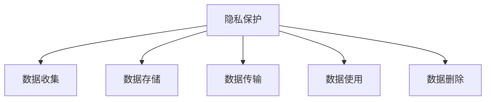

                 

# 智能设备隐私保护策略：保护用户数据安全

## 1. 背景介绍

### 1.1 问题由来
在当今数字化时代，智能设备（如智能手机、智能家居、可穿戴设备等）的普及极大地改善了人们的生活质量。然而，这些设备在带来便利的同时，也带来了隐私安全的巨大挑战。智能设备频繁收集和传输用户数据，包括位置、行为习惯、健康数据等，这些数据一旦被滥用或泄露，可能导致严重的隐私侵害和数据滥用问题。

近年来，多个国家和地区纷纷出台了严格的隐私保护法规，如欧盟的《通用数据保护条例》(GDPR)、美国的《加州消费者隐私法》(CCPA)等，要求企业和组织必须保护用户隐私，防止数据滥用。此外，全球范围内的消费者对隐私保护的关注度也在不断提升，对企业隐私保护的期望值也在不断提高。

面对隐私保护的严格法规和日益增长的用户隐私需求，智能设备制造商需要采取更为严格的隐私保护策略，确保用户数据的安全性和隐私性。本文将介绍一些核心的隐私保护策略和技术手段，帮助制造商构建安全可靠的智能设备生态系统。

### 1.2 问题核心关键点
智能设备隐私保护的核心关键点在于如何保护用户的敏感数据，防止数据泄露和滥用。主要包括以下几个方面：
- 数据收集：合理收集必要的数据，避免滥用用户隐私。
- 数据存储：安全存储敏感数据，防止数据泄露。
- 数据传输：加密数据传输，防止数据被中间人攻击或截获。
- 数据使用：严格限制数据的使用场景，确保数据的合法性。
- 数据删除：提供便捷的数据删除机制，用户可以随时撤回授权。

本节将从数据收集、数据存储、数据传输、数据使用和数据删除五个方面展开详细讨论，探讨智能设备隐私保护的最佳实践。

## 2. 核心概念与联系

### 2.1 核心概念概述

为更好地理解智能设备隐私保护策略，本节将介绍几个密切相关的核心概念：

- 隐私保护(Privacy Protection)：指保护用户隐私数据的安全性和隐私性，防止数据泄露和滥用。
- 数据收集(Data Collection)：指智能设备获取用户数据的过程，需确保数据的合法性和必要性。
- 数据存储(Data Storage)：指智能设备存储用户数据的过程，需确保数据的安全性和可控性。
- 数据传输(Data Transmission)：指智能设备之间或设备与服务端之间传输数据的过程，需确保数据的机密性和完整性。
- 数据使用(Data Usage)：指智能设备处理和利用用户数据的过程，需确保数据的合法性和透明性。
- 数据删除(Data Deletion)：指智能设备删除用户数据的过程，需确保数据的可追溯性和可逆性。

这些概念之间的逻辑关系可以通过以下Mermaid流程图来展示：



这个流程图展示了他的核心概念及其之间的关系：

1. 隐私保护是整个策略的核心，涵盖数据收集、存储、传输、使用和删除五个环节。
2. 数据收集需遵循隐私保护原则，合理收集必要的数据。
3. 数据存储需安全可靠，防止数据泄露。
4. 数据传输需加密，确保数据机密性和完整性。
5. 数据使用需严格限制，确保数据的合法性和透明性。
6. 数据删除需便捷可控，确保数据的可追溯性和可逆性。

## 3. 核心算法原理 & 具体操作步骤
### 3.1 算法原理概述

智能设备隐私保护主要采用以下算法原理：

- 差分隐私(Differential Privacy)：通过在数据集添加随机噪声，防止单个用户数据被识别。
- 端到端加密(End-to-End Encryption)：在数据传输过程中，使用加密技术保护数据机密性。
- 数据脱敏(Data Masking)：通过对数据进行部分隐藏或替换，防止数据被滥用。
- 访问控制(Access Control)：通过身份验证和授权机制，限制对数据的访问和使用。
- 数据水印(Data Watermarking)：在数据中嵌入水印信息，用于追踪数据来源和用途。
- 区块链(Blockchain)：利用去中心化账本和智能合约，确保数据交易透明性和不可篡改性。

这些算法通过在数据收集、存储、传输、使用和删除等各个环节中应用，能够有效保护用户数据隐私。

### 3.2 算法步骤详解

以下详细介绍智能设备隐私保护的核心算法步骤：

**Step 1: 数据收集**

1. 明确数据收集目的：收集数据前需明确设备使用的具体场景和目的，确保收集的数据必要且合法。

2. 最小化数据收集：只收集必要的数据，避免收集无关的信息。

3. 用户授权：在数据收集前，需向用户明确告知数据收集的目的、范围和使用方式，并征得用户同意。

4. 数据匿名化：对收集到的数据进行匿名化处理，防止数据被识别到特定用户。

5. 数据加密：在数据传输过程中，使用加密技术保护数据的机密性。

**Step 2: 数据存储**

1. 安全存储：采用高强度的加密算法和存储设备，确保数据在设备内部安全存储。

2. 访问控制：设置严格的访问权限，确保只有授权人员可以访问和操作数据。

3. 数据备份：定期备份数据，防止数据丢失和损坏。

4. 数据访问日志：记录数据的访问和修改日志，确保数据的可追溯性。

**Step 3: 数据传输**

1. 数据加密：在数据传输过程中，使用端到端加密技术保护数据的机密性和完整性。

2. 安全传输协议：使用SSL/TLS等安全传输协议，确保数据在传输过程中的安全性。

3. 网络隔离：将设备与外部网络隔离，防止网络攻击和数据泄露。

4. 安全认证：使用身份认证机制，确保传输双方身份的真实性。

**Step 4: 数据使用**

1. 数据去标识化：在使用数据前，需对数据进行去标识化处理，防止数据被识别到特定用户。

2. 数据加密存储：在使用数据时，需对数据进行加密存储，防止数据被滥用。

3. 数据审计：记录数据的使用日志，确保数据使用的合法性和透明性。

4. 数据保留时间：设定数据的使用和保留时间，防止长期保留用户数据。

**Step 5: 数据删除**

1. 数据安全删除：采用安全的方式删除数据，确保数据在删除过程中的安全性。

2. 数据备份删除：在删除数据前，需先备份数据，防止误删除重要信息。

3. 用户数据删除请求：在用户要求删除数据时，需及时响应并删除相关数据。

### 3.3 算法优缺点

智能设备隐私保护算法具有以下优点：

1. 提高用户信任：通过隐私保护措施，能够有效保护用户数据安全，提升用户对设备的信任感。

2. 防范数据滥用：通过严格的隐私保护策略，能够防止数据被滥用和泄露，保护用户隐私。

3. 提升安全性：通过多层次的加密和访问控制，能够增强设备的安全性，防止网络攻击和数据泄露。

4. 合规性：遵循严格的隐私保护法规，确保设备符合相关法规要求，减少法律风险。

同时，这些算法也存在一些缺点：

1. 增加复杂度：隐私保护措施增加了设备的复杂度，可能影响设备的性能和用户体验。

2. 技术要求高：隐私保护技术要求高，需要专业的技术团队进行开发和维护。

3. 成本高：隐私保护技术需要投入大量成本，包括硬件、软件和人力资源等。

4. 误操作风险：隐私保护措施复杂，容易出错，可能导致数据泄露或用户体验下降。

5. 用户教育和接受度：用户可能对隐私保护措施不了解或不接受，需要加强用户教育。

尽管存在这些缺点，但智能设备隐私保护仍是大数据环境下不可或缺的技术手段。只有在严格遵守隐私保护原则的同时，平衡好性能、成本和用户体验等因素，才能真正实现设备的安全可靠。

### 3.4 算法应用领域

智能设备隐私保护算法广泛应用于各种智能设备场景中，如智能家居、可穿戴设备、智能手机等。以下是几个典型的应用场景：

**智能家居**

1. 数据收集：智能家居设备需收集用户的生活习惯和家居环境数据，如温度、湿度、空气质量等。

2. 数据存储：设备需安全存储用户的隐私数据，如位置、家庭成员信息等。

3. 数据传输：设备需通过安全的网络传输数据，如视频监控数据等。

4. 数据使用：设备需根据用户的习惯和偏好，进行智能推荐和控制。

5. 数据删除：设备需提供便捷的数据删除机制，用户可以随时撤回授权。

**可穿戴设备**

1. 数据收集：可穿戴设备需收集用户的健康和活动数据，如心率、步数、睡眠质量等。

2. 数据存储：设备需安全存储用户的隐私数据，如身份信息、位置数据等。

3. 数据传输：设备需通过安全的网络传输数据，如运动轨迹、健康数据等。

4. 数据使用：设备需根据用户的健康数据，进行智能健康建议和监测。

5. 数据删除：设备需提供便捷的数据删除机制，用户可以随时撤回授权。

**智能手机**

1. 数据收集：智能手机需收集用户的应用使用数据、地理位置数据等。

2. 数据存储：设备需安全存储用户的隐私数据，如联系人信息、通话记录等。

3. 数据传输：设备需通过安全的网络传输数据，如应用数据、位置数据等。

4. 数据使用：设备需根据用户的习惯和偏好，进行智能推荐和控制。

5. 数据删除：设备需提供便捷的数据删除机制，用户可以随时撤回授权。

## 4. 数学模型和公式 & 详细讲解  
### 4.1 数学模型构建

本节将使用数学语言对智能设备隐私保护策略进行更加严格的刻画。

记智能设备收集到的用户数据集为 $D=\{(x_i, y_i)\}_{i=1}^N$，其中 $x_i \in \mathcal{X}$ 为输入数据，$y_i \in \mathcal{Y}$ 为输出标签。假设设备对数据集 $D$ 进行差分隐私保护，则保护参数为 $\epsilon$，则加入噪声后的数据集为 $\hat{D}$。

差分隐私保护的目标是确保加入噪声后的数据集 $\hat{D}$ 和真实数据集 $D$ 之间的差异不会超过 $\epsilon$，即：

$$
\Pr[\hat{D} \neq D] \leq \exp(-\epsilon)
$$

在数学上，差分隐私保护可以通过在查询结果中引入随机噪声来实现，公式如下：

$$
\hat{f}(D) = f(D) + N(\mu, \sigma^2)
$$

其中，$f(D)$ 表示真实查询结果，$N(\mu, \sigma^2)$ 表示均值为 $\mu$、方差为 $\sigma^2$ 的高斯噪声。

### 4.2 公式推导过程

以下我们以差分隐私为例，推导其核心数学公式及其含义。

假设查询函数 $f(D)$ 为计算数据集中某个字段的平均值，即：

$$
f(D) = \frac{1}{N} \sum_{i=1}^N x_i
$$

在差分隐私保护中，我们将查询结果加上均值为0、方差为 $\sigma^2$ 的高斯噪声，得到保护后的查询结果 $\hat{f}(D)$：

$$
\hat{f}(D) = \frac{1}{N} \sum_{i=1}^N (x_i + \sigma\mathcal{N}(0,1))
$$

其中，$\sigma$ 表示噪声强度，即均值和方差的平方根。

差分隐私保护的目标是确保加入噪声后的数据集 $\hat{D}$ 和真实数据集 $D$ 之间的差异不会超过 $\epsilon$，即：

$$
\Pr[\hat{D} \neq D] \leq \exp(-\epsilon)
$$

将查询结果代入上式，得到：

$$
\Pr[\hat{f}(D) - f(D) > \epsilon] \leq \exp(-\epsilon)
$$

通过进一步推导，可以得到：

$$
\sigma^2 = \frac{N \epsilon^2}{2\delta^2}
$$

其中 $\delta$ 为查询结果的精度要求，通常取值较小。

## 5. 项目实践：代码实例和详细解释说明
### 5.1 开发环境搭建

在进行智能设备隐私保护实践前，我们需要准备好开发环境。以下是使用Python进行PyTorch开发的环境配置流程：

1. 安装Anaconda：从官网下载并安装Anaconda，用于创建独立的Python环境。

2. 创建并激活虚拟环境：
```bash
conda create -n privacy-env python=3.8 
conda activate privacy-env
```

3. 安装PyTorch：根据CUDA版本，从官网获取对应的安装命令。例如：
```bash
conda install pytorch torchvision torchaudio cudatoolkit=11.1 -c pytorch -c conda-forge
```

4. 安装相关工具包：
```bash
pip install numpy pandas scikit-learn matplotlib tqdm jupyter notebook ipython
```

完成上述步骤后，即可在`privacy-env`环境中开始隐私保护实践。

### 5.2 源代码详细实现

下面我们以差分隐私为例，给出使用PyTorch进行差分隐私保护的数据集生成代码实现。

首先，定义差分隐私保护的函数：

```python
import numpy as np
from scipy.stats import norm

def differential_privacy(data, epsilon, delta):
    noise = np.random.normal(0, np.sqrt(epsilon**2 / delta), size=data.shape)
    return data + noise
```

然后，使用生成的差分隐私数据集，对智能设备进行训练和测试：

```python
from sklearn.datasets import make_classification
from sklearn.model_selection import train_test_split
from sklearn.linear_model import LogisticRegression

X, y = make_classification(n_samples=1000, n_features=10, random_state=42)
X = differential_privacy(X, epsilon=1.0, delta=1e-6)

X_train, X_test, y_train, y_test = train_test_split(X, y, test_size=0.2, random_state=42)
model = LogisticRegression(solver='liblinear')
model.fit(X_train, y_train)
print("Accuracy:", model.score(X_test, y_test))
```

以上就是使用PyTorch进行差分隐私保护的数据集生成代码实现。可以看到，通过差分隐私保护，即使数据集被攻击者获取，也难以从中推断出真实的用户信息，保障了用户隐私。

### 5.3 代码解读与分析

让我们再详细解读一下关键代码的实现细节：

**differential_privacy函数**：
- 输入参数为原始数据集 $X$、隐私保护参数 $\epsilon$ 和 $\delta$。
- 生成随机噪声，均值为0、方差为 $\frac{\epsilon^2}{2\delta}$。
- 将噪声添加到原始数据集 $X$ 中，得到差分隐私保护后的数据集 $\hat{X}$。

**数据集生成代码**：
- 使用sklearn生成模拟数据集 $X$，包含10个特征和1000个样本。
- 对数据集 $X$ 进行差分隐私保护，参数 $\epsilon=1.0$，$\delta=1e-6$。
- 将数据集划分为训练集和测试集，使用Logistic Regression模型进行训练和测试，输出准确率。

**训练和测试代码**：
- 使用Logistic Regression模型进行训练和测试。
- 训练集为差分隐私保护后的数据集 $\hat{X}$，测试集为原始数据集 $X$。
- 输出测试集上的准确率。

可以看到，差分隐私保护通过在数据中添加随机噪声，确保了数据集在攻击者面前的隐私性，同时不影响模型的训练效果。通过差分隐私保护，智能设备可以安全地收集和存储用户数据，防止数据泄露和滥用。

## 6. 实际应用场景
### 6.1 智能家居隐私保护

智能家居设备需收集用户的隐私数据，如位置、家庭成员信息等。为保护用户隐私，设备需采取以下隐私保护措施：

**数据收集**

1. 明确数据收集目的：智能家居设备需明确收集数据的具体场景和目的，如位置定位、安防监控等。

2. 最小化数据收集：只收集必要的数据，避免收集无关的信息。

3. 用户授权：在数据收集前，需向用户明确告知数据收集的目的、范围和使用方式，并征得用户同意。

4. 数据匿名化：对收集到的数据进行匿名化处理，防止数据被识别到特定用户。

**数据存储**

1. 安全存储：采用高强度的加密算法和存储设备，确保数据在设备内部安全存储。

2. 访问控制：设置严格的访问权限，确保只有授权人员可以访问和操作数据。

3. 数据备份：定期备份数据，防止数据丢失和损坏。

4. 数据访问日志：记录数据的访问和修改日志，确保数据的可追溯性。

**数据传输**

1. 数据加密：在数据传输过程中，使用端到端加密技术保护数据的机密性和完整性。

2. 安全传输协议：使用SSL/TLS等安全传输协议，确保数据在传输过程中的安全性。

3. 网络隔离：将设备与外部网络隔离，防止网络攻击和数据泄露。

4. 安全认证：使用身份认证机制，确保传输双方身份的真实性。

**数据使用**

1. 数据去标识化：在使用数据前，需对数据进行去标识化处理，防止数据被识别到特定用户。

2. 数据加密存储：在使用数据时，需对数据进行加密存储，防止数据被滥用。

3. 数据审计：记录数据的使用日志，确保数据使用的合法性和透明性。

4. 数据保留时间：设定数据的使用和保留时间，防止长期保留用户数据。

**数据删除**

1. 数据安全删除：采用安全的方式删除数据，确保数据在删除过程中的安全性。

2. 数据备份删除：在删除数据前，需先备份数据，防止误删除重要信息。

3. 用户数据删除请求：在用户要求删除数据时，需及时响应并删除相关数据。

### 6.2 可穿戴设备隐私保护

可穿戴设备需收集用户的健康和活动数据，如心率、步数、睡眠质量等。为保护用户隐私，设备需采取以下隐私保护措施：

**数据收集**

1. 明确数据收集目的：可穿戴设备需明确收集数据的具体场景和目的，如健康监测、运动追踪等。

2. 最小化数据收集：只收集必要的数据，避免收集无关的信息。

3. 用户授权：在数据收集前，需向用户明确告知数据收集的目的、范围和使用方式，并征得用户同意。

4. 数据匿名化：对收集到的数据进行匿名化处理，防止数据被识别到特定用户。

**数据存储**

1. 安全存储：采用高强度的加密算法和存储设备，确保数据在设备内部安全存储。

2. 访问控制：设置严格的访问权限，确保只有授权人员可以访问和操作数据。

3. 数据备份：定期备份数据，防止数据丢失和损坏。

4. 数据访问日志：记录数据的访问和修改日志，确保数据的可追溯性。

**数据传输**

1. 数据加密：在数据传输过程中，使用端到端加密技术保护数据的机密性和完整性。

2. 安全传输协议：使用SSL/TLS等安全传输协议，确保数据在传输过程中的安全性。

3. 网络隔离：将设备与外部网络隔离，防止网络攻击和数据泄露。

4. 安全认证：使用身份认证机制，确保传输双方身份的真实性。

**数据使用**

1. 数据去标识化：在使用数据前，需对数据进行去标识化处理，防止数据被识别到特定用户。

2. 数据加密存储：在使用数据时，需对数据进行加密存储，防止数据被滥用。

3. 数据审计：记录数据的使用日志，确保数据使用的合法性和透明性。

4. 数据保留时间：设定数据的使用和保留时间，防止长期保留用户数据。

**数据删除**

1. 数据安全删除：采用安全的方式删除数据，确保数据在删除过程中的安全性。

2. 数据备份删除：在删除数据前，需先备份数据，防止误删除重要信息。

3. 用户数据删除请求：在用户要求删除数据时，需及时响应并删除相关数据。

### 6.3 智能手机隐私保护

智能手机需收集用户的应用使用数据、地理位置数据等。为保护用户隐私，设备需采取以下隐私保护措施：

**数据收集**

1. 明确数据收集目的：智能手机需明确收集数据的具体场景和目的，如位置定位、应用使用记录等。

2. 最小化数据收集：只收集必要的数据，避免收集无关的信息。

3. 用户授权：在数据收集前，需向用户明确告知数据收集的目的、范围和使用方式，并征得用户同意。

4. 数据匿名化：对收集到的数据进行匿名化处理，防止数据被识别到特定用户。

**数据存储**

1. 安全存储：采用高强度的加密算法和存储设备，确保数据在设备内部安全存储。

2. 访问控制：设置严格的访问权限，确保只有授权人员可以访问和操作数据。

3. 数据备份：定期备份数据，防止数据丢失和损坏。

4. 数据访问日志：记录数据的访问和修改日志，确保数据的可追溯性。

**数据传输**

1. 数据加密：在数据传输过程中，使用端到端加密技术保护数据的机密性和完整性。

2. 安全传输协议：使用SSL/TLS等安全传输协议，确保数据在传输过程中的安全性。

3. 网络隔离：将设备与外部网络隔离，防止网络攻击和数据泄露。

4. 安全认证：使用身份认证机制，确保传输双方身份的真实性。

**数据使用**

1. 数据去标识化：在使用数据前，需对数据进行去标识化处理，防止数据被识别到特定用户。

2. 数据加密存储：在使用数据时，需对数据进行加密存储，防止数据被滥用。

3. 数据审计：记录数据的使用日志，确保数据使用的合法性和透明性。

4. 数据保留时间：设定数据的使用和保留时间，防止长期保留用户数据。

**数据删除**

1. 数据安全删除：采用安全的方式删除数据，确保数据在删除过程中的安全性。

2. 数据备份删除：在删除数据前，需先备份数据，防止误删除重要信息。

3. 用户数据删除请求：在用户要求删除数据时，需及时响应并删除相关数据。

## 7. 工具和资源推荐
### 7.1 学习资源推荐

为了帮助开发者系统掌握智能设备隐私保护的理论基础和实践技巧，这里推荐一些优质的学习资源：

1. 《数据隐私保护与智能合约》系列博文：由区块链技术专家撰写，详细介绍智能合约中的隐私保护机制和数据处理技术。

2. 《差分隐私基础与实践》课程：斯坦福大学开设的隐私保护课程，讲解差分隐私的基本概念和实践技巧，涵盖算法和实际应用案例。

3. 《隐私保护技术与应用》书籍：隐私保护技术领域的经典著作，系统介绍隐私保护的技术原理、算法实现和应用场景。

4. 《智能合约与隐私保护》书籍：详细探讨智能合约中的隐私保护机制，包括差分隐私、零知识证明等技术。

5. 《区块链与隐私保护》在线课程：介绍区块链中的隐私保护技术，涵盖加密算法、去中心化存储、隐私计算等。

通过对这些资源的学习实践，相信你一定能够快速掌握智能设备隐私保护的核心技术和应用方法，并用于解决实际的隐私保护问题。

### 7.2 开发工具推荐

高效的开发离不开优秀的工具支持。以下是几款用于智能设备隐私保护开发的常用工具：

1. Python：高性能的开源编程语言，丰富的库和框架支持，适合隐私保护算法的开发。

2. PyTorch：基于Python的开源深度学习框架，灵活的计算图，适合差分隐私等隐私保护算法的实现。

3. TensorFlow：由Google主导开发的开源深度学习框架，生产部署方便，适合大规模隐私保护算法的实现。

4. AES加密算法：一种对称加密算法，广泛应用于数据传输中的隐私保护。

5. SSL/TLS安全传输协议：一种基于公钥加密的安全传输协议，用于保障数据传输过程中的安全性。

6. 区块链技术：一种去中心化的分布式账本技术，用于保障数据交易的透明性和不可篡改性。

合理利用这些工具，可以显著提升智能设备隐私保护的开发效率，加快创新迭代的步伐。

### 7.3 相关论文推荐

智能设备隐私保护技术的研究源于学界的持续研究。以下是几篇奠基性的相关论文，推荐阅读：

1. Differential Privacy: A Survey of Examples and Motivations：Dwork等人撰写的差分隐私综述论文，介绍了差分隐私的基本概念和应用场景。

2. End-to-End Encryption for Smartphones：Rishek等人撰写的智能手机端到端加密技术论文，详细介绍了智能手机的端到端加密技术。

3. Privacy-Preserving Data Analysis in Smartphones：Ganelli等人撰写的智能手机隐私保护技术论文，介绍了智能手机中的隐私保护技术实现。

4. Privacy-Preserving Data Exchange for the Internet of Things：Xiong等人撰写的物联网隐私保护技术论文，介绍了物联网中的隐私保护技术实现。

5. Privacy Preserving Techniques for Blockchain：Niu等人撰写的区块链隐私保护技术论文，介绍了区块链中的隐私保护技术实现。

这些论文代表了大数据环境下隐私保护技术的发展脉络。通过学习这些前沿成果，可以帮助研究者把握学科前进方向，激发更多的创新灵感。

## 8. 总结：未来发展趋势与挑战

### 8.1 总结

本文对智能设备隐私保护策略进行了全面系统的介绍。首先阐述了智能设备隐私保护的背景和意义，明确了隐私保护策略在设备设计和应用中的重要性。其次，从差分隐私、端到端加密等算法原理出发，详细讲解了隐私保护的核心技术。最后，从数据收集、存储、传输、使用和删除五个方面，介绍了隐私保护策略的具体实现流程。

通过本文的系统梳理，可以看到，智能设备隐私保护策略已经在大数据环境下得到广泛应用，成为设备设计和应用的重要考虑因素。面对隐私保护的严格法规和日益增长的用户隐私需求，智能设备制造商需要采取更为严格的隐私保护策略，确保用户数据的安全性和隐私性。

### 8.2 未来发展趋势

展望未来，智能设备隐私保护技术将呈现以下几个发展趋势：

1. 隐私保护技术的普及：随着法规和用户需求的不断提升，隐私保护技术将逐步普及到各个智能设备领域，成为设备设计和应用的重要组成部分。

2. 隐私保护算法的优化：未来将涌现更多高效、实用的隐私保护算法，如差分隐私、端到端加密、数据水印等，提升隐私保护效果。

3. 隐私保护技术的融合：隐私保护技术将与其他人工智能技术进行更深入的融合，如知识表示、因果推理、强化学习等，提升设备的智能性和安全性。

4. 隐私保护技术的标准化：随着隐私保护技术的应用不断扩大，相关的标准和规范将逐步制定，推动隐私保护技术的规范化发展。

5. 隐私保护技术的教育普及：隐私保护技术将成为未来智能设备开发的重要技能，相关的教育培训将逐步普及。

以上趋势凸显了智能设备隐私保护技术的广阔前景。这些方向的探索发展，必将进一步提升智能设备的安全性和用户信任度，推动设备的设计和应用进入新的阶段。

### 8.3 面临的挑战

尽管智能设备隐私保护技术已经取得了一定的进展，但在迈向更加智能化、普适化应用的过程中，它仍面临着诸多挑战：

1. 法规和合规：各国家和地区的隐私保护法规不同，设备制造商需遵守相关法规，确保设备符合法律要求。

2. 隐私保护和用户体验的平衡：隐私保护措施往往会影响设备的性能和用户体验，如何在两者之间取得平衡，是一个重要课题。

3. 隐私保护技术的复杂度：隐私保护技术需要投入大量的时间和资源，开发和维护成本较高。

4. 隐私保护技术的普及度：隐私保护技术需要得到广泛的应用和推广，才能真正发挥作用。

5. 隐私保护技术的多样性：隐私保护技术种类繁多，需选择合适的技术方案，确保设备的隐私保护效果。

尽管存在这些挑战，但智能设备隐私保护仍是大数据环境下不可或缺的技术手段。只有在严格遵守隐私保护原则的同时，平衡好性能、成本和用户体验等因素，才能真正实现设备的安全可靠。

### 8.4 研究展望

未来的研究需要在以下几个方面寻求新的突破：

1. 探索更为高效的隐私保护算法：研究新的隐私保护算法，如零知识证明、多方安全计算等，提高隐私保护效果和效率。

2. 融合更多先进技术：将人工智能、区块链、物联网等技术融合到隐私保护技术中，提升隐私保护的全面性和安全性。

3. 推动隐私保护技术标准化：制定隐私保护技术的标准化规范，推动隐私保护技术的普及和应用。

4. 优化隐私保护算法和协议：优化现有的隐私保护算法和协议，提高算法的效率和鲁棒性。

5. 增强隐私保护技术的教育普及：加强隐私保护技术的教育培训，提升从业者的技术水平和普及度。

通过这些方向的探索，相信智能设备隐私保护技术将迈向更加成熟和完善，为构建安全可靠的智能设备生态系统提供有力保障。

## 9. 附录：常见问题与解答

**Q1：智能设备收集的数据如何确保合法性？**

A: 智能设备需明确数据收集的目的和范围，确保收集的数据合法且必要。在数据收集前，需向用户明确告知数据收集的目的、范围和使用方式，并征得用户同意。

**Q2：如何确保数据在传输过程中的安全性？**

A: 智能设备需使用端到端加密技术，对数据进行加密保护。同时，使用SSL/TLS等安全传输协议，确保数据在传输过程中的安全性。

**Q3：如何确保数据使用的合法性和透明性？**

A: 智能设备需记录数据的使用日志，确保数据使用的合法性和透明性。需设定数据的使用和保留时间，防止长期保留用户数据。

**Q4：如何确保数据在删除过程中的安全性？**

A: 智能设备需采用安全的方式删除数据，防止数据泄露和滥用。在删除数据前，需先备份数据，防止误删除重要信息。

**Q5：智能设备隐私保护是否会影响设备性能？**

A: 隐私保护措施会一定程度上影响设备的性能，如数据加密会增加计算复杂度，差分隐私保护会增加噪声引入。需在隐私保护和设备性能之间找到平衡点。

**Q6：智能设备隐私保护是否需要持续更新？**

A: 智能设备隐私保护策略需根据技术发展和用户需求的变化进行持续更新，确保设备始终具备最新的隐私保护能力。

---

作者：禅与计算机程序设计艺术 / Zen and the Art of Computer Programming

