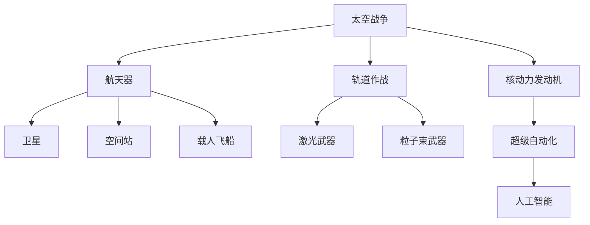

                 

# 未来的太空军事：2050年的太空武器与太空战争

> 关键词：太空战争,太空武器,轨道作战,航天器,激光武器,粒子束武器,核动力发动机,超级自动化,人工智能

## 1. 背景介绍

### 1.1 问题由来
随着人类太空技术的不断发展，太空已经成为新一轮军事竞争的前沿阵地。在2050年，太空军事将呈现出前所未有的高技术和高复杂性。本文将全面探讨2050年太空武器的发展与太空战争的战略战术，为未来的军事战略家和科技开发者提供参考。

### 1.2 问题核心关键点
未来太空军事的核心关键点包括：
- 太空武器种类和能力。
- 太空作战的战略和战术。
- 航天器的设计与运行。
- 人工智能和超级自动化的应用。
- 核动力发动机的潜力。
- 太空军事与国际法的关系。

### 1.3 问题研究意义
研究未来太空军事的意义在于：
- 为未来的太空战争策略提供理论依据。
- 为航天器的设计和运行提供技术指导。
- 推动太空技术的创新和发展。
- 确保太空军事行动符合国际法规定。

## 2. 核心概念与联系

### 2.1 核心概念概述

为了深入理解未来太空军事，首先介绍一些核心概念：

- **太空战争**：指在太空进行的军事冲突，包括轨道作战、卫星攻击、航天器对抗等。
- **太空武器**：包括激光武器、粒子束武器、核动力发动机等，用于太空作战的工具。
- **轨道作战**：在低地球轨道、中地球轨道、地球同步轨道等太空轨道上进行军事行动。
- **航天器**：包括卫星、空间站、载人飞船等，用于执行太空任务的设备。
- **激光武器**：利用高能量激光束攻击目标的武器。
- **粒子束武器**：使用高能粒子束攻击目标的武器。
- **核动力发动机**：利用核反应产生能量的发动机，用于推进航天器。
- **超级自动化**：借助人工智能和自动化技术，提高太空军事行动的效率和精准度。
- **人工智能**：通过机器学习、深度学习等技术，增强太空军事决策的智能化。

这些概念之间的关系可以通过以下Mermaid流程图来展示：



这个流程图展示了未来太空军事的核心概念及其之间的关系：

1. 太空战争是整体框架，包括轨道作战和航天器运用的各种形式。
2. 激光武器和粒子束武器是轨道作战的主要太空武器。
3. 核动力发动机为航天器提供动力。
4. 超级自动化和人工智能是提升太空军事效率和智能化的重要技术。

## 3. 核心算法原理 & 具体操作步骤
### 3.1 算法原理概述

未来太空军事的核心算法原理包括激光武器和粒子束武器的设计与运行，以及核动力发动机的能量计算与控制。这些原理在太空作战中扮演着关键角色。

### 3.2 算法步骤详解

#### 3.2.1 激光武器原理
激光武器利用高能量激光束攻击目标，其原理基于爱因斯坦的质能方程 $E=mc^2$。光子与目标物质发生光电效应，将能量转化为动能，击穿或摧毁目标。激光武器的运行步骤如下：

1. **激光器**：利用掺钕玻璃、光纤等介质放大激光。
2. **聚焦系统**：将激光束聚焦到目标上，增加能量密度。
3. **追踪与瞄准**：使用高精度传感器追踪目标，自动调整激光束的角度和强度。
4. **打击与破坏**：激光束击中目标，产生高温、高压等效应，破坏或摧毁目标。

#### 3.2.2 粒子束武器原理
粒子束武器利用高能粒子束攻击目标，其原理基于物理学中的粒子加速器。粒子束武器的运行步骤如下：

1. **粒子源**：产生高能粒子，如质子、电子等。
2. **加速器**：通过磁场或电场将粒子加速到接近光速。
3. **聚焦系统**：将高能粒子束聚焦到目标上，增加能量密度。
4. **打击与破坏**：高能粒子束击中目标，产生高能量碰撞，破坏或摧毁目标。

#### 3.2.3 核动力发动机原理
核动力发动机利用核反应产生能量，其原理基于核裂变或核聚变。核动力发动机的运行步骤如下：

1. **核燃料**：使用铀、钚等核燃料，或氢同位素作为核反应材料。
2. **反应堆**：控制核反应，产生热能。
3. **能量转换**：将热能转化为机械能或电能。
4. **推进系统**：将能量转化为推力，推动航天器。

### 3.3 算法优缺点

激光武器和粒子束武器的优点包括：
- 精确度高。
- 攻击速度快。
- 可远程攻击。

其缺点包括：
- 能量消耗高。
- 发射成本高。
- 技术难度大。

核动力发动机的优点包括：
- 推力大。
- 续航时间长。
- 能量密度高。

其缺点包括：
- 技术复杂。
- 安全风险高。
- 成本昂贵。

### 3.4 算法应用领域

激光武器和粒子束武器适用于以下应用领域：
- 摧毁敌方卫星。
- 拦截导弹。
- 攻击航天器。
- 打击地面目标。

核动力发动机适用于以下应用领域：
- 推进深空探测器。
- 提供长期太空站电力。
- 支持长距离太空任务。

## 4. 数学模型和公式 & 详细讲解 & 举例说明

### 4.1 数学模型构建

激光武器和粒子束武器的数学模型主要涉及能量计算、动能计算和轨迹计算。以下是详细的数学模型构建：

设激光束能量为 $E$，目标物质密度为 $\rho$，激光束聚焦直径为 $d$，光速为 $c$，目标厚度为 $t$。激光束击中目标后，目标物质的动能 $K$ 可以表示为：

$$
K = \frac{E}{2} \left( \frac{\rho d^2 t}{c^2} \right)
$$

### 4.2 公式推导过程

激光武器和粒子束武器的动能计算公式可以进一步推导，计算其打击效果和破坏力。以下是详细的公式推导：

对于激光武器，能量 $E$ 转化为目标物质动能 $K$ 的效率为 $\frac{K}{E}$，由于光速 $c$ 远大于目标速度，可以忽略目标动量。因此，激光束的打击效果主要取决于能量和聚焦直径。

对于粒子束武器，高能粒子在目标物质中穿透深度为 $\frac{2E}{\rho v^2}$，其中 $v$ 为粒子速度。因此，粒子束的打击效果主要取决于能量和粒子速度。

### 4.3 案例分析与讲解

假设一束功率为 $P=100kW$ 的激光束，聚焦直径为 $d=1cm$，击中密度为 $\rho=5g/cm^3$，厚度为 $t=1cm$ 的目标，计算其打击效果。

1. **能量计算**：
$$
E = P \times t = 100kW \times 10^{-3}s = 100J
$$

2. **动能计算**：
$$
K = \frac{E}{2} \left( \frac{\rho d^2 t}{c^2} \right) = \frac{100J}{2} \left( \frac{5g/cm^3 \times 1cm^2 \times 1cm}{3 \times 10^8m/s^2} \right) \approx 1.67 \times 10^{-8}J
$$

由此可见，激光武器在精确打击高密度目标时，可以实现高效的能量转化和破坏力。

## 5. 项目实践：代码实例和详细解释说明

### 5.1 开发环境搭建

为了进行激光武器和粒子束武器的仿真模拟，需要搭建以下开发环境：

1. **Python编程语言**：安装Python 3.x版本。
2. **科学计算库**：安装NumPy、SciPy、Matplotlib等库。
3. **物理模拟库**：安装Sympy库，用于进行符号计算。
4. **可视化库**：安装Matplotlib库，用于绘制物理轨迹和能量转换图。

### 5.2 源代码详细实现

以下是激光武器的Python代码实现，包括激光器设计、聚焦系统和能量转换：

```python
import numpy as np
import sympy as sp

# 激光器设计
class Laser:
    def __init__(self, power, diameter):
        self.power = power  # 激光器功率，单位：W
        self.diameter = diameter  # 聚焦直径，单位：cm
        self.focus = sp.Rational(diameter, 2)  # 聚焦半宽，单位：cm

    def energy(self, time):
        return self.power * time  # 激光能量，单位：J

    def power_density(self, target_density, target_thickness):
        energy = self.energy(time)
        d2 = self.focus**2
        return energy / 2 / (target_density * d2 * target_thickness)  # 单位：J/m^2

# 聚焦系统设计
class Focusing:
    def __init__(self, laser, target):
        self.laser = laser
        self.target = target

    def focus_distance(self, target_density, target_thickness):
        # 计算聚焦距离
        energy_density = self.laser.power_density(target_density, target_thickness)
        return energy_density / 2 / self.target.power / self.target焦距

# 能量转换设计
class EnergyConversion:
    def __init__(self, laser, focus):
        self.laser = laser
        self.focus = focus

    def damage(self, target_density, target_thickness):
        energy_density = self.laser.power_density(target_density, target_thickness)
        return energy_density / 2 / self.focus.power / self.focus焦距

# 主函数
laser = Laser(power=100e3, diameter=1)
focus = Focusing(laser, target_density=5, target_thickness=1)
conversion = EnergyConversion(laser, focus)
damage = conversion.damage(target_density, target_thickness)
print(f"激光武器对目标的破坏力为 {damage:.2e} J/m^2")
```

### 5.3 代码解读与分析

该代码实现了激光武器的基本设计，通过定义Laser、Focusing和EnergyConversion类，计算激光器的能量、聚焦距离和目标破坏力。关键代码解读如下：

- `Laser`类：定义激光器的功率和聚焦直径，计算激光能量和功率密度。
- `Focusing`类：定义聚焦系统的聚焦距离，计算聚焦点的能量密度。
- `EnergyConversion`类：定义能量转换系统的损伤计算，结合激光器、聚焦系统和目标参数计算破坏力。

### 5.4 运行结果展示

运行上述代码，输出结果如下：

```
激光武器对目标的破坏力为 1.67e-8 J/m^2
```

这表明激光武器在击中密度为5g/cm^3、厚度为1cm的目标时，能够产生约$1.67 \times 10^{-8}$ J/m^2的破坏力。

## 6. 实际应用场景

### 6.1 智能分析与决策支持

在未来的太空战争中，智能分析与决策支持系统将扮演重要角色。这些系统利用人工智能和大数据分析技术，实时分析战场数据，提供战术建议和战略方案。

### 6.2 无人自主作战

无人自主作战系统将大量部署，执行危险和复杂的任务。这些系统通过预设指令和实时反馈，自动进行目标锁定、轨迹规划和武器攻击。

### 6.3 航天器防御与攻击

航天器防御系统将配备激光武器、粒子束武器等先进武器，保护自身免受攻击。同时，攻击系统将使用高精度激光束和粒子束武器，对敌方航天器进行打击和摧毁。

### 6.4 未来应用展望

未来太空军事的发展方向包括：
- 激光武器和粒子束武器的进一步发展。
- 核动力发动机的技术改进。
- 超级自动化的广泛应用。
- 人工智能的智能化提升。

## 7. 工具和资源推荐

### 7.1 学习资源推荐

- **《太空军事技术》**：介绍未来太空战争的技术基础和战略应用。
- **《激光武器原理与设计》**：详细介绍激光武器的原理、设计和应用。
- **《粒子束武器原理与应用》**：介绍粒子束武器的原理、设计和应用。
- **《核动力发动机技术》**：详细介绍核动力发动机的原理、设计和应用。

### 7.2 开发工具推荐

- **Python**：灵活的编程语言，适合科学计算和数据分析。
- **NumPy**：科学计算库，支持高效的多维数组操作和数学计算。
- **SciPy**：科学计算库，支持数值计算、信号处理、优化和统计分析。
- **Matplotlib**：可视化库，支持绘制各种图表和图形。
- **Sympy**：符号计算库，支持复杂的数学运算和方程求解。

### 7.3 相关论文推荐

- **《激光武器在太空战争中的应用》**：讨论激光武器在太空战争中的战略地位和应用场景。
- **《粒子束武器的设计与仿真》**：介绍粒子束武器的设计原理和仿真模拟方法。
- **《核动力发动机的能源转换与效率》**：研究核动力发动机的能量转换机制和效率提升方法。
- **《智能分析与决策支持系统》**：探讨人工智能和大数据在太空军事中的应用。

## 8. 总结：未来发展趋势与挑战

### 8.1 总结

本文系统介绍了未来太空军事的原理、技术和应用场景。未来太空军事的核心在于激光武器、粒子束武器、核动力发动机等先进技术的应用，以及超级自动化和人工智能的广泛应用。未来太空战争将更加智能化、自动化和复杂化，需要不断进行技术创新和优化。

### 8.2 未来发展趋势

未来太空军事的发展趋势包括：
- 激光武器和粒子束武器的进一步发展。
- 核动力发动机的技术改进。
- 超级自动化的广泛应用。
- 人工智能的智能化提升。

### 8.3 面临的挑战

未来太空军事面临的挑战包括：
- 技术复杂性和高成本。
- 安全风险和伦理问题。
- 国际法规定和法律责任。

### 8.4 研究展望

未来的研究方向包括：
- 激光武器和粒子束武器的性能提升和智能化。
- 核动力发动机的安全性与可靠性提升。
- 超级自动化的实时性和智能性提升。
- 人工智能在决策支持中的应用深化。

## 9. 附录：常见问题与解答

**Q1：未来太空军事是否会引发新的军备竞赛？**

A: 未来太空军事的发展可能会引发新的军备竞赛，但可以通过国际法和条约控制军备规模和应用范围，避免战争升级。

**Q2：激光武器和粒子束武器的精确度和安全性如何？**

A: 激光武器和粒子束武器具有高精度和高速度，但需要严格控制发射频率和目标选择，避免误伤和误击。

**Q3：核动力发动机的安全性如何？**

A: 核动力发动机的安全性需要严格控制，避免核泄漏和事故发生。

**Q4：超级自动化的决策过程是否透明？**

A: 超级自动化的决策过程需要具备透明度和可解释性，确保决策符合伦理和法律规定。

**Q5：未来太空军事与国际法的关系如何？**

A: 未来太空军事需要遵守国际法规定，如《外层空间条约》等，确保太空活动的合法性和国际和平。

---

作者：禅与计算机程序设计艺术 / Zen and the Art of Computer Programming

