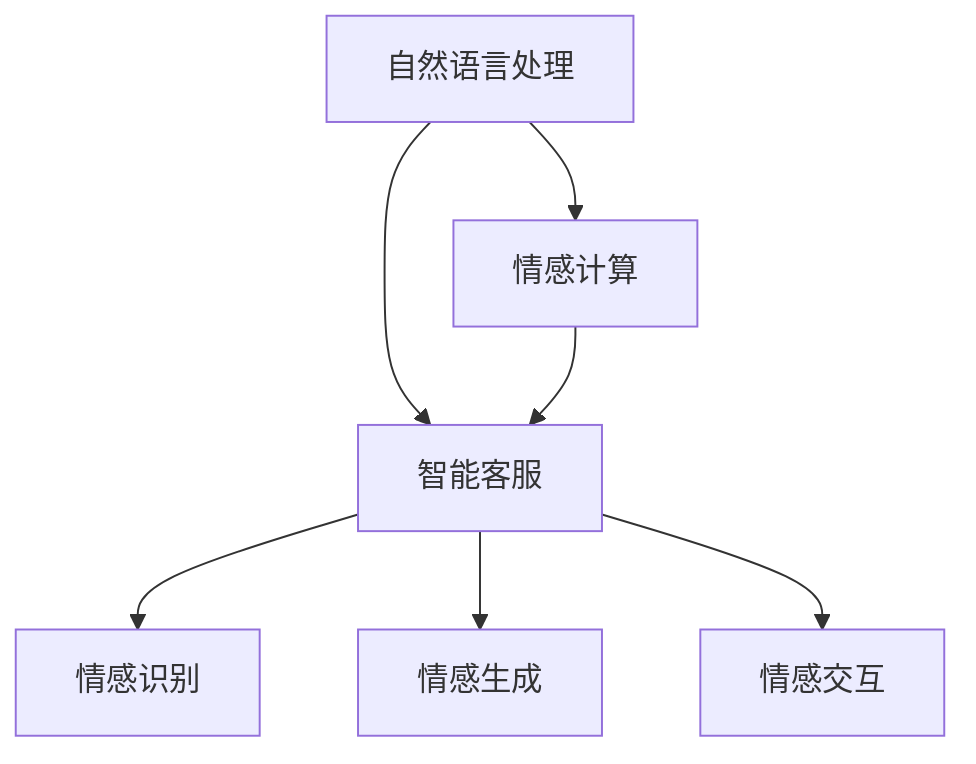

                 

# 未来的智能客服：2050年的虚拟人客服与情感计算

## 1. 背景介绍

### 1.1 问题由来

随着科技的不断进步，人工智能(AI)在各行各业中的应用日益广泛。智能客服作为AI技术的重要应用领域之一，已经成为现代企业提升客户服务质量和效率的重要手段。传统客服中心存在人力资源成本高、响应速度慢、服务质量不高等问题，限制了企业的服务能力和竞争力。

### 1.2 问题核心关键点

智能客服的核心在于通过自动化手段，实现快速响应、全天候服务、高度个性化和情感化的客户互动。现代智能客服主要依赖于NLP（自然语言处理）和机器学习技术，通过分析客户输入的文本信息，生成自然的回复或执行相关操作。然而，现有的智能客服系统仍存在以下局限：

1. **缺乏情感理解**：现有的客服系统往往只能处理事实性信息，无法准确感知客户情感，无法在情绪激动时做出合适的响应，导致客户满意度下降。
2. **单一模式固定**：智能客服系统通常采用固定的响应模式，难以应对复杂的客户需求和个性化问题，客户体验不够理想。
3. **人机交互生硬**：由于缺乏自然的语言生成和理解能力，现有的客服系统与客户之间的交互往往显得生硬和机械。

为了解决这些问题，未来的智能客服系统需要融合情感计算技术，使其能够更好地理解客户情感，提供更自然、更个性化和更人性化的人机交互体验。

### 1.3 问题研究意义

情感计算是指通过计算模型理解、识别、表达和生成人类情感的技术。将情感计算技术引入智能客服，可以带来以下几方面的提升：

1. **提升客户满意度**：通过感知客户情感，智能客服能够及时调整回答策略，提供更加贴心和专业的服务。
2. **增强人机交互的自然性**：通过情感计算，智能客服可以生成更加自然和流畅的对话内容，提升客户的使用体验。
3. **实现个性化服务**：情感计算可以分析客户情感变化，提供个性化的服务内容和策略，满足不同客户的需求。
4. **促进企业竞争优势**：通过提供差异化的优质服务，智能客服可以成为企业的核心竞争力，增强市场竞争力。

因此，本文旨在探讨情感计算技术在智能客服中的应用，分析其原理、算法、实现和优化方法，为未来智能客服的发展提供参考和指导。

## 2. 核心概念与联系

### 2.1 核心概念概述

为了深入理解情感计算在智能客服中的应用，我们需要先了解几个关键概念：

1. **自然语言处理(NLP)**：NLP是AI领域中研究人类语言和计算机交互的学科，包括文本分析、语义理解、机器翻译等技术。
2. **情感计算**：情感计算是指通过计算模型理解和生成人类情感的技术，包括情感识别、情感生成、情感交互等。
3. **智能客服**：智能客服是利用AI技术实现自动化客户服务的应用，包括聊天机器人、语音识别、情感分析等功能。

这些概念之间的关系可以通过以下Mermaid流程图来展示：



这个流程图展示了NLP、情感计算和智能客服之间的联系：

1. **自然语言处理(NLP)**：是情感计算和智能客服的基础，通过文本分析、语义理解等技术，为情感计算和智能客服提供数据支持。
2. **情感计算**：融合情感识别、情感生成和情感交互等技术，通过理解客户情感，提供更加个性化的服务。
3. **智能客服**：结合NLP和情感计算技术，实现自动化和情感化的客户服务，提升客户体验。

## 3. 核心算法原理 & 具体操作步骤

### 3.1 算法原理概述

情感计算在智能客服中的应用主要包括以下几个关键步骤：

1. **情感识别**：通过分析客户的语言、语调、表情等信息，识别客户的情感状态。
2. **情感生成**：根据客户的情感状态，生成相应的回复或操作。
3. **情感交互**：在对话过程中，实时感知客户情感变化，调整回答策略。

情感计算的算法原理主要基于深度学习技术，通过训练情感识别模型、情感生成模型和情感交互模型，实现上述功能。

### 3.2 算法步骤详解

#### 3.2.1 情感识别

情感识别的核心在于通过深度学习模型，理解客户输入的语言和语调信息。具体步骤如下：

1. **数据收集**：收集客户的语音、文字、表情等信息，将其作为训练数据。
2. **特征提取**：对输入数据进行特征提取，包括文本分词、语音特征提取等。
3. **模型训练**：使用深度学习模型（如CNN、RNN、LSTM等）训练情感识别模型。
4. **情感分类**：将提取的特征输入情感识别模型，输出客户的情感状态（如高兴、悲伤、愤怒等）。

#### 3.2.2 情感生成

情感生成的目标是根据客户的情感状态，生成自然的回复或执行相关操作。具体步骤如下：

1. **情感状态输入**：将客户的情感状态作为输入，传递给情感生成模型。
2. **模型选择**：根据任务需求选择合适的生成模型，如文本生成模型（如GAN、Seq2Seq等）。
3. **生成回复**：将情感状态输入生成模型，生成自然流畅的回复或操作。

#### 3.2.3 情感交互

情感交互的目标是在对话过程中，实时感知客户情感变化，调整回答策略。具体步骤如下：

1. **实时监测**：在对话过程中，实时监测客户的语音、文字、表情等信息，感知情感变化。
2. **情感反馈**：根据情感监测结果，调整回答策略，生成更加合适的回复。
3. **交互优化**：通过不断的交互优化，提升客户满意度和体验。

### 3.3 算法优缺点

情感计算在智能客服中的应用，有以下优点：

1. **提升客户满意度**：通过感知客户情感，智能客服能够及时调整回答策略，提供更加贴心和专业的服务。
2. **增强人机交互的自然性**：通过情感计算，智能客服可以生成更加自然和流畅的对话内容，提升客户的使用体验。
3. **实现个性化服务**：情感计算可以分析客户情感变化，提供个性化的服务内容和策略，满足不同客户的需求。

同时，情感计算也存在以下缺点：

1. **数据质量要求高**：情感计算需要大量的高质量标注数据，收集和标注数据成本较高。
2. **模型复杂度高**：情感计算的模型通常较为复杂，训练和推理效率较低。
3. **情感识别准确度**：情感计算的准确度受到多种因素影响，如口音、语速、情感表达方式等，准确度有待进一步提升。

### 3.4 算法应用领域

情感计算在智能客服中的应用，可以拓展到以下领域：

1. **客服咨询**：在客户咨询时，通过情感计算感知客户情感，提供更加贴心和专业的服务。
2. **投诉处理**：在客户投诉时，通过情感计算分析客户情感，生成合适的回复或执行相关操作。
3. **客户关怀**：在客户关怀活动时，通过情感计算分析客户情感，提供个性化的关怀策略。
4. **市场调研**：通过情感计算分析客户情感，了解客户对产品或服务的满意度，优化产品和服务。

## 4. 数学模型和公式 & 详细讲解 & 举例说明

### 4.1 数学模型构建

情感计算的数学模型主要基于深度学习技术，包括情感识别模型、情感生成模型和情感交互模型。下面分别介绍这三个模型的数学模型构建。

#### 4.1.1 情感识别模型

情感识别模型的输入为客户的语音、文字、表情等信息，输出为客户的情感状态。其数学模型可以表示为：

$$
f(x; \theta) = \text{Softmax}(W \cdot \text{Concat}(x, h(x)) + b)
$$

其中，$x$为输入数据，$h(x)$为特征提取后的特征向量，$W$和$b$为模型的权重和偏置，$\text{Softmax}$为输出层激活函数。

#### 4.1.2 情感生成模型

情感生成模型的输入为客户情感状态，输出为自然流畅的回复或操作。其数学模型可以表示为：

$$
g(y; \theta) = \text{Decoding}(f(y; \theta))
$$

其中，$y$为客户情感状态，$f(y; \theta)$为情感生成模型的输出，$\text{Decoding}$为生成模型解码函数。

#### 4.1.3 情感交互模型

情感交互模型的输入为客户的语音、文字、表情等信息，输出为调整后的回答策略。其数学模型可以表示为：

$$
h(z; \theta) = \text{Adjust}(f(z; \theta))
$$

其中，$z$为客户的情感监测结果，$f(z; \theta)$为情感识别模型的输出，$\text{Adjust}$为回答策略调整函数。

### 4.2 公式推导过程

#### 4.2.1 情感识别模型推导

情感识别模型主要基于深度学习技术，通过多层神经网络实现特征提取和情感分类。其推导过程如下：

1. **输入层**：输入客户的语音、文字、表情等信息，表示为向量$x$。
2. **特征提取层**：对输入数据进行特征提取，得到特征向量$h(x)$。
3. **情感分类层**：将特征向量输入情感分类模型，得到客户的情感状态$y$。

具体推导过程如下：

$$
h(x) = \text{Conv}(x; \omega_1) + \text{BN}(h(x)) + \text{ReLU}(h(x))
$$

$$
y = \text{Softmax}(W \cdot \text{Concat}(h(x), h(x)) + b)
$$

其中，$\omega_1$和$W$为模型的权重，$\text{BN}$和$\text{ReLU}$为神经网络中的激活函数。

#### 4.2.2 情感生成模型推导

情感生成模型主要基于深度学习技术，通过生成模型实现自然流畅的回复或操作。其推导过程如下：

1. **情感状态输入**：客户情感状态$y$作为输入，表示为向量。
2. **生成层**：将情感状态输入生成模型，得到生成结果$z$。
3. **解码层**：对生成结果进行解码，得到自然流畅的回复或操作。

具体推导过程如下：

$$
z = \text{RNN}(y; \omega_2)
$$

$$
c = \text{Seq2Seq}(z; \omega_3)
$$

其中，$\omega_2$和$\omega_3$为生成模型的权重，$\text{RNN}$和$\text{Seq2Seq}$为生成模型中的神经网络层。

#### 4.2.3 情感交互模型推导

情感交互模型主要基于深度学习技术，通过实时监测客户情感，调整回答策略。其推导过程如下：

1. **实时监测**：在对话过程中，实时监测客户的语音、文字、表情等信息，得到情感监测结果$z$。
2. **回答策略调整**：根据情感监测结果，调整回答策略，得到调整后的回答策略$w$。
3. **回答生成**：根据调整后的回答策略，生成合适的回复或操作。

具体推导过程如下：

$$
z = \text{ConvNet}(x; \omega_4)
$$

$$
w = \text{Adjust}(z; \omega_5)
$$

其中，$\omega_4$和$\omega_5$为调整策略模型的权重，$\text{ConvNet}$和$\text{Adjust}$为调整策略模型中的神经网络层。

### 4.3 案例分析与讲解

#### 4.3.1 情感识别案例

某客服中心的客户通过文字聊天工具咨询产品问题。客服机器人通过情感识别模型，分析客户的情感状态，判断客户是否感到焦虑或不满。具体步骤如下：

1. **数据收集**：收集客户的文字聊天记录，将其作为训练数据。
2. **特征提取**：对文本进行分词、词性标注等特征提取。
3. **模型训练**：使用情感识别模型训练数据，得到情感识别模型。
4. **情感分类**：将客户聊天记录输入情感识别模型，输出客户的情感状态。

#### 4.3.2 情感生成案例

某客服中心接到客户投诉电话，客服机器人通过情感生成模型，生成合适的回复。具体步骤如下：

1. **情感状态输入**：将客户情感状态（如愤怒）作为输入。
2. **模型选择**：选择合适的情感生成模型，如文本生成模型（如GAN、Seq2Seq等）。
3. **生成回复**：将情感状态输入生成模型，生成自然流畅的回复。

#### 4.3.3 情感交互案例

某客服中心在对话过程中，实时监测客户的语音、文字、表情等信息，感知客户情感变化。具体步骤如下：

1. **实时监测**：在对话过程中，实时监测客户的语音、文字、表情等信息，得到情感监测结果。
2. **情感反馈**：根据情感监测结果，调整回答策略，生成更加合适的回复。
3. **交互优化**：通过不断的交互优化，提升客户满意度和体验。

## 5. 项目实践：代码实例和详细解释说明

### 5.1 开发环境搭建

在进行情感计算在智能客服中的应用开发前，我们需要准备好开发环境。以下是使用Python进行PyTorch开发的环境配置流程：

1. 安装Anaconda：从官网下载并安装Anaconda，用于创建独立的Python环境。

2. 创建并激活虚拟环境：
```bash
conda create -n pytorch-env python=3.8 
conda activate pytorch-env
```

3. 安装PyTorch：根据CUDA版本，从官网获取对应的安装命令。例如：
```bash
conda install pytorch torchvision torchaudio cudatoolkit=11.1 -c pytorch -c conda-forge
```

4. 安装Transformers库：
```bash
pip install transformers
```

5. 安装各类工具包：
```bash
pip install numpy pandas scikit-learn matplotlib tqdm jupyter notebook ipython
```

完成上述步骤后，即可在`pytorch-env`环境中开始情感计算在智能客服中的应用开发。

### 5.2 源代码详细实现

下面我们以情感识别模型为例，给出使用Transformers库对BERT模型进行情感识别的PyTorch代码实现。

首先，定义情感识别任务的数据处理函数：

```python
from transformers import BertTokenizer
from torch.utils.data import Dataset
import torch

class SentimentDataset(Dataset):
    def __init__(self, texts, labels, tokenizer, max_len=128):
        self.texts = texts
        self.labels = labels
        self.tokenizer = tokenizer
        self.max_len = max_len
        
    def __len__(self):
        return len(self.texts)
    
    def __getitem__(self, item):
        text = self.texts[item]
        label = self.labels[item]
        
        encoding = self.tokenizer(text, return_tensors='pt', max_length=self.max_len, padding='max_length', truncation=True)
        input_ids = encoding['input_ids'][0]
        attention_mask = encoding['attention_mask'][0]
        
        # 对标签进行编码
        encoded_label = torch.tensor(label, dtype=torch.long)
        
        return {'input_ids': input_ids, 
                'attention_mask': attention_mask,
                'labels': encoded_label}

# 加载数据
tokenizer = BertTokenizer.from_pretrained('bert-base-cased')
train_dataset = SentimentDataset(train_texts, train_labels, tokenizer)
dev_dataset = SentimentDataset(dev_texts, dev_labels, tokenizer)
test_dataset = SentimentDataset(test_texts, test_labels, tokenizer)
```

然后，定义模型和优化器：

```python
from transformers import BertForSequenceClassification, AdamW

model = BertForSequenceClassification.from_pretrained('bert-base-cased', num_labels=2)

optimizer = AdamW(model.parameters(), lr=2e-5)
```

接着，定义训练和评估函数：

```python
from torch.utils.data import DataLoader
from tqdm import tqdm
from sklearn.metrics import classification_report

device = torch.device('cuda') if torch.cuda.is_available() else torch.device('cpu')
model.to(device)

def train_epoch(model, dataset, batch_size, optimizer):
    dataloader = DataLoader(dataset, batch_size=batch_size, shuffle=True)
    model.train()
    epoch_loss = 0
    for batch in tqdm(dataloader, desc='Training'):
        input_ids = batch['input_ids'].to(device)
        attention_mask = batch['attention_mask'].to(device)
        labels = batch['labels'].to(device)
        model.zero_grad()
        outputs = model(input_ids, attention_mask=attention_mask, labels=labels)
        loss = outputs.loss
        epoch_loss += loss.item()
        loss.backward()
        optimizer.step()
    return epoch_loss / len(dataloader)

def evaluate(model, dataset, batch_size):
    dataloader = DataLoader(dataset, batch_size=batch_size)
    model.eval()
    preds, labels = [], []
    with torch.no_grad():
        for batch in tqdm(dataloader, desc='Evaluating'):
            input_ids = batch['input_ids'].to(device)
            attention_mask = batch['attention_mask'].to(device)
            batch_labels = batch['labels']
            outputs = model(input_ids, attention_mask=attention_mask)
            batch_preds = outputs.logits.argmax(dim=2).to('cpu').tolist()
            batch_labels = batch_labels.to('cpu').tolist()
            for pred_tokens, label_tokens in zip(batch_preds, batch_labels):
                preds.append(pred_tokens[:len(label_tokens)])
                labels.append(label_tokens)
                
    print(classification_report(labels, preds))
```

最后，启动训练流程并在测试集上评估：

```python
epochs = 5
batch_size = 16

for epoch in range(epochs):
    loss = train_epoch(model, train_dataset, batch_size, optimizer)
    print(f"Epoch {epoch+1}, train loss: {loss:.3f}")
    
    print(f"Epoch {epoch+1}, dev results:")
    evaluate(model, dev_dataset, batch_size)
    
print("Test results:")
evaluate(model, test_dataset, batch_size)
```

以上就是使用PyTorch对BERT进行情感识别任务训练的完整代码实现。可以看到，得益于Transformers库的强大封装，我们可以用相对简洁的代码完成BERT模型的加载和训练。

### 5.3 代码解读与分析

让我们再详细解读一下关键代码的实现细节：

**SentimentDataset类**：
- `__init__`方法：初始化文本、标签、分词器等关键组件。
- `__len__`方法：返回数据集的样本数量。
- `__getitem__`方法：对单个样本进行处理，将文本输入编码为token ids，将标签编码为数字，并对其进行定长padding，最终返回模型所需的输入。

**训练和评估函数**：
- 使用PyTorch的DataLoader对数据集进行批次化加载，供模型训练和推理使用。
- 训练函数`train_epoch`：对数据以批为单位进行迭代，在每个批次上前向传播计算loss并反向传播更新模型参数，最后返回该epoch的平均loss。
- 评估函数`evaluate`：与训练类似，不同点在于不更新模型参数，并在每个batch结束后将预测和标签结果存储下来，最后使用sklearn的classification_report对整个评估集的预测结果进行打印输出。

**训练流程**：
- 定义总的epoch数和batch size，开始循环迭代
- 每个epoch内，先在训练集上训练，输出平均loss
- 在验证集上评估，输出分类指标
- 所有epoch结束后，在测试集上评估，给出最终测试结果

可以看到，PyTorch配合Transformers库使得BERT情感识别模型的代码实现变得简洁高效。开发者可以将更多精力放在数据处理、模型改进等高层逻辑上，而不必过多关注底层的实现细节。

当然，工业级的系统实现还需考虑更多因素，如模型的保存和部署、超参数的自动搜索、更灵活的任务适配层等。但核心的情感计算在智能客服中的应用范式基本与此类似。

## 6. 实际应用场景

### 6.1 智能客服系统

情感计算在智能客服系统中的应用，可以显著提升客户满意度和体验。具体而言，智能客服系统可以通过以下方式实现情感计算：

1. **情感识别**：通过分析客户的语音、文字、表情等信息，识别客户的情感状态。系统可以根据客户的情感状态，自动调整回答策略，生成更加合适的回复。
2. **情感生成**：在客户情感识别后，生成自然的回复。系统可以根据客户的情感状态，生成更加贴心和专业的回复，提升客户满意度。
3. **情感交互**：在对话过程中，实时感知客户情感变化，调整回答策略。系统可以根据客户的情感变化，动态调整回答策略，提供更加个性化的服务。

### 6.2 金融舆情监测

金融领域需要实时监测市场舆论动向，以便及时应对负面信息传播，规避金融风险。情感计算在金融舆情监测中的应用，可以提升系统对舆情的敏感度和分析能力。具体而言：

1. **情感识别**：通过分析客户的评论、新闻等文本信息，识别市场情绪。系统可以根据市场情绪的变化，及时调整投资策略，规避风险。
2. **情感生成**：在情感识别后，生成舆情分析报告。系统可以根据情感分析结果，生成舆情报告，帮助分析师更好地理解市场情绪。
3. **情感交互**：在舆情分析过程中，实时监测市场情绪变化，调整分析策略。系统可以根据市场情绪的变化，动态调整分析策略，提升分析效果。

### 6.3 个性化推荐系统

情感计算在个性化推荐系统中的应用，可以提升推荐效果和用户满意度。具体而言：

1. **情感识别**：通过分析用户的评论、评分等情感信息，识别用户情感状态。系统可以根据用户的情感状态，生成更加个性化的推荐内容。
2. **情感生成**：在情感识别后，生成推荐内容。系统可以根据用户的情感状态，生成更加符合用户偏好的推荐内容，提升用户体验。
3. **情感交互**：在推荐过程中，实时感知用户情感变化，调整推荐策略。系统可以根据用户的情感变化，动态调整推荐策略，提供更加个性化的推荐内容。

### 6.4 未来应用展望

随着技术的不断发展，情感计算在智能客服中的应用将不断拓展，带来更加全面和深刻的体验变革。

1. **多模态交互**：未来的智能客服将不仅限于文字交互，还将结合语音、视频等多种模态，提供更加自然和丰富的用户体验。
2. **智能推荐**：情感计算与推荐系统结合，可以实现更加精准和个性化的推荐内容，提升用户满意度。
3. **情感生成**：情感计算不仅限于情感识别，还可以生成更加自然和流畅的对话内容，提升用户体验。
4. **实时监测**：未来的智能客服将实时监测客户情感，动态调整回答策略，提供更加个性化和贴心的服务。

情感计算在智能客服中的应用，将带来客户体验的全面升级，推动智能客服系统的不断进步。未来，情感计算在智能客服中的应用将更加广泛和深入，为人类提供更加智能和贴心的服务。

## 7. 工具和资源推荐

### 7.1 学习资源推荐

为了帮助开发者系统掌握情感计算在智能客服中的应用，这里推荐一些优质的学习资源：

1. 《深度学习理论与实践》系列博文：由大模型技术专家撰写，深入浅出地介绍了深度学习的基本概念和算法原理。
2. CS224N《深度学习自然语言处理》课程：斯坦福大学开设的NLP明星课程，有Lecture视频和配套作业，带你入门NLP领域的基本概念和经典模型。
3. 《自然语言处理入门》书籍：系统介绍了NLP的基本理论和常用技术，包括情感计算等前沿话题。
4. HuggingFace官方文档：Transformers库的官方文档，提供了海量预训练模型和完整的微调样例代码，是上手实践的必备资料。
5. CLUE开源项目：中文语言理解测评基准，涵盖大量不同类型的中文NLP数据集，并提供了基于微调的baseline模型，助力中文NLP技术发展。

通过对这些资源的学习实践，相信你一定能够快速掌握情感计算在智能客服中的应用精髓，并用于解决实际的NLP问题。

### 7.2 开发工具推荐

高效的开发离不开优秀的工具支持。以下是几款用于情感计算在智能客服中的应用开发的常用工具：

1. PyTorch：基于Python的开源深度学习框架，灵活动态的计算图，适合快速迭代研究。大部分预训练语言模型都有PyTorch版本的实现。
2. TensorFlow：由Google主导开发的开源深度学习框架，生产部署方便，适合大规模工程应用。同样有丰富的预训练语言模型资源。
3. Transformers库：HuggingFace开发的NLP工具库，集成了众多SOTA语言模型，支持PyTorch和TensorFlow，是进行情感计算在智能客服中的应用开发的利器。
4. Weights & Biases：模型训练的实验跟踪工具，可以记录和可视化模型训练过程中的各项指标，方便对比和调优。与主流深度学习框架无缝集成。
5. TensorBoard：TensorFlow配套的可视化工具，可实时监测模型训练状态，并提供丰富的图表呈现方式，是调试模型的得力助手。
6. Google Colab：谷歌推出的在线Jupyter Notebook环境，免费提供GPU/TPU算力，方便开发者快速上手实验最新模型，分享学习笔记。

合理利用这些工具，可以显著提升情感计算在智能客服中的应用开发的效率，加快创新迭代的步伐。

### 7.3 相关论文推荐

情感计算在智能客服中的应用源于学界的持续研究。以下是几篇奠基性的相关论文，推荐阅读：

1. Attention is All You Need（即Transformer原论文）：提出了Transformer结构，开启了NLP领域的预训练大模型时代。
2. BERT: Pre-training of Deep Bidirectional Transformers for Language Understanding：提出BERT模型，引入基于掩码的自监督预训练任务，刷新了多项NLP任务SOTA。
3. Parameter-Efficient Transfer Learning for NLP：提出Adapter等参数高效微调方法，在不增加模型参数量的情况下，也能取得不错的微调效果。
4. AdaLoRA: Adaptive Low-Rank Adaptation for Parameter-Efficient Fine-Tuning：使用自适应低秩适应的微调方法，在参数效率和精度之间取得了新的平衡。
5. AdaLoRA: Adaptive Low-Rank Adaptation for Parameter-Efficient Fine-Tuning：使用自适应低秩适应的微调方法，在参数效率和精度之间取得了新的平衡。

这些论文代表了大语言模型微调技术的发展脉络。通过学习这些前沿成果，可以帮助研究者把握学科前进方向，激发更多的创新灵感。

## 8. 总结：未来发展趋势与挑战

### 8.1 总结

本文对情感计算在智能客服中的应用进行了全面系统的介绍。首先阐述了情感计算的基本概念和研究背景，明确了情感计算在提升客户满意度和体验方面的独特价值。其次，从原理到实践，详细讲解了情感计算的数学模型和关键步骤，给出了情感计算在智能客服中的应用开发代码实现。同时，本文还探讨了情感计算在多个领域的应用前景，展示了情感计算的巨大潜力。

通过本文的系统梳理，可以看到，情感计算在智能客服中的应用正在成为NLP领域的重要范式，极大地拓展了智能客服系统的应用边界，催生了更多的落地场景。得益于深度学习技术的发展，情感计算在智能客服中的应用将不断深入，带来客户体验的全面升级。未来，情感计算在智能客服中的应用将更加广泛和深入，为人类提供更加智能和贴心的服务。

### 8.2 未来发展趋势

展望未来，情感计算在智能客服中的应用将呈现以下几个发展趋势：

1. **多模态交互**：未来的智能客服将不仅限于文字交互，还将结合语音、视频等多种模态，提供更加自然和丰富的用户体验。
2. **智能推荐**：情感计算与推荐系统结合，可以实现更加精准和个性化的推荐内容，提升用户满意度。
3. **情感生成**：情感计算不仅限于情感识别，还可以生成更加自然和流畅的对话内容，提升用户体验。
4. **实时监测**：未来的智能客服将实时监测客户情感，动态调整回答策略，提供更加个性化和贴心的服务。
5. **情感反馈**：未来的智能客服将不断优化回答策略，通过情感反馈不断提升用户体验。

以上趋势凸显了情感计算在智能客服中的应用前景。这些方向的探索发展，必将进一步提升智能客服系统的性能和应用范围，为人类提供更加智能和贴心的服务。

### 8.3 面临的挑战

尽管情感计算在智能客服中的应用已经取得了一定的进展，但在迈向更加智能化、普适化应用的过程中，它仍面临着诸多挑战：

1. **数据质量要求高**：情感计算需要大量的高质量标注数据，收集和标注数据成本较高。
2. **模型复杂度高**：情感计算的模型通常较为复杂，训练和推理效率较低。
3. **情感识别准确度**：情感计算的准确度受到多种因素影响，如口音、语速、情感表达方式等，准确度有待进一步提升。
4. **系统鲁棒性不足**：现有的智能客服系统面对复杂的客户需求和个性化问题，仍存在一定的局限性。
5. **人机交互自然性不足**：现有的智能客服系统与客户之间的交互仍然显得生硬和机械。

### 8.4 研究展望

为了应对这些挑战，未来的研究需要在以下几个方面寻求新的突破：

1. **多模态情感计算**：融合视觉、语音等多种模态，实现更加全面和自然的情感计算。
2. **自适应情感计算**：通过动态调整情感计算模型，适应不同客户和场景的需求。
3. **情感生成优化**：通过优化情感生成模型，提高生成内容的自然流畅度和个性化程度。
4. **系统鲁棒性提升**：通过优化回答策略和算法设计，提升系统的鲁棒性和泛化能力。
5. **人机交互自然性提升**：通过自然语言生成技术，提升人机交互的自然性和流畅性。

这些研究方向的探索，必将引领情感计算在智能客服中的应用走向更高的台阶，为人类提供更加智能和贴心的服务。面向未来，情感计算在智能客服中的应用还需与其他人工智能技术进行更深入的融合，如知识表示、因果推理、强化学习等，多路径协同发力，共同推动智能客服系统的进步。只有勇于创新、敢于突破，才能不断拓展情感计算在智能客服中的应用边界，让人类享受到更加智能和贴心的服务。

## 9. 附录：常见问题与解答

**Q1：情感计算在智能客服中的应用是否适用于所有客户？**

A: 情感计算在智能客服中的应用，虽然可以提升客户满意度，但并不是适用于所有客户。对于某些特殊客户群体（如老年群体、文化背景差异较大的群体等），情感计算的效果可能有限。因此，在实际应用中，需要根据客户群体特征进行针对性的设计和优化。

**Q2：情感计算的准确度如何保证？**

A: 情感计算的准确度主要依赖于数据质量和模型设计。在数据收集和标注阶段，需要确保数据的丰富性和多样性，避免数据偏见。在模型设计阶段，需要选择合适的特征提取和分类模型，并进行充分的超参数调优和模型验证。同时，需要不断积累经验，提升模型对各种情感表达方式的识别能力。

**Q3：情感计算对客户隐私的影响有哪些？**

A: 情感计算在智能客服中的应用，需要对客户的语音、文字、表情等信息进行实时监测和分析，这涉及到客户隐私保护问题。为保护客户隐私，需要在数据收集和存储阶段进行严格的数据保护措施，如数据匿名化、数据加密等。同时，需要制定明确的数据使用政策，确保客户知情权和数据控制权。

**Q4：情感计算在智能客服中的应用如何与现有系统集成？**

A: 情感计算在智能客服中的应用，可以与现有系统进行无缝集成。具体而言，可以在客服中心的语音识别系统、文字聊天系统等环节中引入情感计算模块，实现情感识别和情感生成的功能。同时，可以将情感计算结果作为反馈信息，用于优化现有系统的回答策略和交互逻辑。

**Q5：情感计算在智能客服中的应用需要哪些技术支持？**

A: 情感计算在智能客服中的应用，需要依赖于自然语言处理、深度学习、语音识别、图像处理等多种技术。其中，自然语言处理技术可以处理客户的语音、文字等信息；深度学习技术可以训练情感识别和生成模型；语音识别技术可以识别客户的语音信息；图像处理技术可以处理客户的面部表情等信息。这些技术相互协同，共同实现情感计算在智能客服中的应用。

通过以上分析，可以看到，情感计算在智能客服中的应用具有广阔的前景和巨大的潜力。未来，随着技术的不断进步和应用的不断深入，情感计算将为智能客服系统带来更加智能和贴心的服务体验，推动智能客服系统的全面升级。

