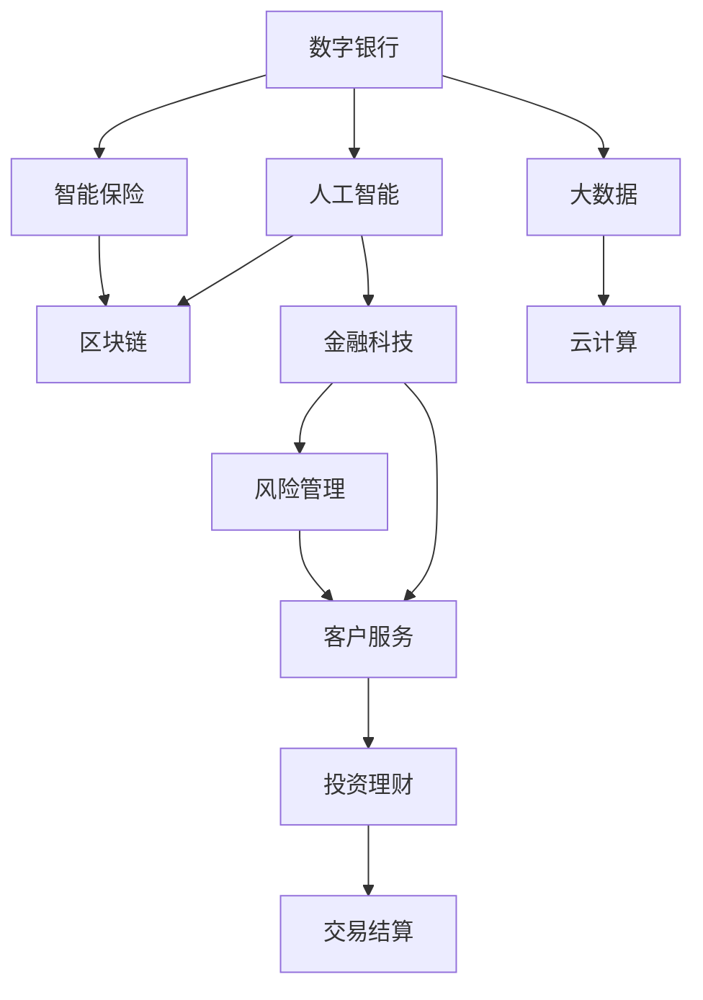

                 

# 未来的智能金融：2050年的数字银行与智能保险

> 关键词：智能金融, 数字银行, 智能保险, 人工智能, 区块链, 金融科技, 机器学习

## 1. 背景介绍

### 1.1 问题由来
随着金融科技的迅猛发展，金融业已经步入了数字化、智能化转型的新时代。数字银行和智能保险作为金融科技的前沿应用，正在彻底改变传统的金融服务模式和用户体验。预计到2050年，数字银行和智能保险将更加普及和成熟，成为金融行业的基础设施，驱动金融服务全面智能化、个性化、高效化和安全化。

### 1.2 问题核心关键点
未来的数字银行和智能保险需要依靠人工智能、大数据、区块链等前沿技术，提供智能化的客户服务、风险管理、交易结算、投资理财等全方位金融服务。然而，现有技术还面临诸多挑战，如数据隐私保护、安全性问题、算法透明度、合规性等，需要不断突破和创新。

### 1.3 问题研究意义
本课题旨在深入探讨数字银行和智能保险的智能技术架构、未来应用场景、技术难点及解决策略，为金融科技的发展提供理论和实践指导，推动金融行业实现质的飞跃。

## 2. 核心概念与联系

### 2.1 核心概念概述

为更好地理解数字银行和智能保险的未来发展趋势，本节将介绍几个核心概念：

- **数字银行**：利用数字技术，提供线上、线下融合的银行服务，包括网上银行、手机银行、无人银行等。
- **智能保险**：借助人工智能和大数据，实现保单自动核保、风险智能评估、理赔自动化等智能服务。
- **人工智能**：涵盖机器学习、深度学习、自然语言处理等技术，用于数据挖掘、智能决策、用户行为分析等。
- **区块链**：基于去中心化、不可篡改的分布式账本技术，用于保障交易安全、提高透明度、实现去中介化。
- **金融科技**：金融与科技的融合创新，涉及互联网、大数据、云计算、人工智能等前沿技术，驱动金融服务模式变革。

这些概念之间的关系可以通过以下Mermaid流程图来展示：



这个流程图展示了大语言模型的核心概念及其之间的关系：

1. 数字银行和智能保险分别作为人工智能、大数据、区块链等技术的具体应用场景。
2. 人工智能是大语言模型的核心技术，通过机器学习、深度学习等手段，提升模型的智能化水平。
3. 区块链技术为金融交易提供安全保障和透明性。
4. 金融科技是数字银行和智能保险技术的整体架构，涵盖各项前沿技术，促进金融服务全面转型。
5. 大数据和云计算为人工智能等技术提供计算和存储支撑。
6. 风险管理和客户服务是智能保险的主要应用领域。
7. 投资理财和交易结算是数字银行的重要功能模块。

这些概念共同构成了未来数字银行和智能保险的智能技术框架，为其提供了强有力的技术支持。

## 3. 核心算法原理 & 具体操作步骤
### 3.1 算法原理概述

未来数字银行和智能保险的智能技术架构主要基于人工智能、大数据、区块链等前沿技术，通过智能算法实现精准的客户服务、风险管理、交易结算、投资理财等功能。

1. **客户行为分析**：利用机器学习和深度学习技术，对客户的交易行为、购买记录、金融偏好等数据进行建模分析，预测客户需求，提供个性化的金融服务。
2. **风险智能评估**：通过自然语言处理和大数据分析，自动识别保险合同中的关键风险信息，评估风险等级，实现保单自动核保。
3. **智能交易结算**：结合人工智能和区块链技术，实现智能合约自动执行、交易欺诈检测、跨链交易等高效、安全的服务。
4. **智能投资理财**：利用机器学习算法，对金融市场数据进行建模分析，实现智能投资组合优化、风险预测、投资策略推荐等。

### 3.2 算法步骤详解

未来数字银行和智能保险的智能技术架构通常包括以下几个关键步骤：

**Step 1: 数据收集与预处理**
- 收集银行、保险机构的各类数据，包括交易记录、客户行为、市场数据等。
- 进行数据清洗、标准化处理，确保数据质量和一致性。

**Step 2: 模型构建与训练**
- 选择合适的机器学习或深度学习模型，如决策树、随机森林、神经网络等。
- 利用数据集进行模型训练，优化模型参数，提升模型性能。
- 对模型进行评估和调优，确保模型泛化能力和稳定性。

**Step 3: 模型部署与应用**
- 将训练好的模型部署到生产环境，进行实时计算和预测。
- 结合前端界面，展示模型输出结果，实现客户互动。
- 实时监控模型运行状态，及时发现和修正问题。

**Step 4: 系统集成与优化**
- 将人工智能、大数据、区块链等技术进行集成，实现功能协同。
- 进行系统性能优化，如模型压缩、参数剪枝、并行计算等。
- 定期更新模型和数据，保持系统最新和高效。

### 3.3 算法优缺点

未来数字银行和智能保险的智能技术架构具有以下优点：
1. 提高效率。智能算法能够快速处理海量数据，实现实时计算和预测。
2. 提升服务质量。智能服务能够根据客户行为和偏好，提供个性化、精准的金融服务。
3. 降低成本。自动化处理替代人工操作，减少人力和运营成本。
4. 增强安全性。区块链技术保障交易安全，人工智能防范欺诈风险。

同时，该架构也存在一定的局限性：
1. 数据隐私。大量敏感数据收集和使用，存在隐私泄露风险。
2. 算法透明度。复杂模型难以解释，缺乏透明性和可解释性。
3. 系统复杂性。技术栈复杂，开发和维护难度较大。
4. 依赖基础设施。需要高性能计算和存储资源，对基础设施要求高。
5. 技术迭代快。需要不断跟踪最新技术，保持系统前沿性。

尽管存在这些局限性，但就目前而言，基于人工智能的智能技术架构仍是大银行和智能保险的主流范式。未来相关研究的重点在于如何进一步降低算法复杂性和技术成本，提高数据隐私保护和系统安全性。

### 3.4 算法应用领域

未来数字银行和智能保险的智能技术架构在金融服务领域有着广泛的应用：

- **客户服务**：智能客服、智能投顾、智能理财顾问等。
- **风险管理**：智能核保、智能反欺诈、智能信用评估等。
- **交易结算**：智能合约、智能转账、智能支付等。
- **投资理财**：智能投资组合、智能理财方案、智能资产管理等。
- **保险理赔**：智能理赔、智能核赔、智能反欺诈等。

除了上述这些主要应用领域外，智能技术架构还可以应用于客户行为分析、市场预测、合规管理、客户教育等方面，为金融服务提供全方位的智能化支持。

## 4. 数学模型和公式 & 详细讲解 & 举例说明

### 4.1 数学模型构建

未来数字银行和智能保险的智能技术架构主要依赖于数学模型进行数据建模和分析。以下是几个常见的数学模型及其构建方法：

**客户行为分析模型**
- 基于时间序列分析的ARIMA模型：
$$
ARIMA(p,d,q) = ARIMA\{Y_t, AR(p), I(d), MA(q); \phi,B,\theta\}
$$
其中 $Y_t$ 表示客户行为数据，$AR(p)$ 和 $MA(q)$ 分别表示自回归和移动平均部分，$\phi,B,\theta$ 为模型参数。

**风险评估模型**
- 基于决策树的分类模型：
$$
f(x) = \sum_{k=1}^{K} w_k \mathbf{1}_{\{x \in \mathcal{R}_k\}}
$$
其中 $x$ 表示客户数据，$\mathbf{1}_{\{x \in \mathcal{R}_k\}}$ 表示 $x$ 属于决策树第 $k$ 个节点，$w_k$ 为节点权重。

**智能交易模型**
- 基于神经网络的交易策略模型：
$$
f(x) = \sum_{i=1}^{M} w_i \sigma(\mathbf{W}_i \cdot \mathbf{x} + b_i)
$$
其中 $x$ 表示市场数据，$\sigma$ 为激活函数，$\mathbf{W}_i$ 和 $b_i$ 为网络参数。

**投资理财模型**
- 基于优化算法的组合优化模型：
$$
\min_{w} \frac{1}{2}w^T\Sigma w - \mathbf{r}^T w
$$
其中 $\Sigma$ 为协方差矩阵，$\mathbf{r}$ 为目标收益率向量，$w$ 为资产权重向量。

### 4.2 公式推导过程

以下我们将以风险评估模型为例，详细推导其计算过程：

**风险评估模型推导**
- 假设客户数据 $x = (x_1,x_2,\dots,x_n)$，分类标签 $y = (y_1,y_2,\dots,y_n)$，其中 $y_i \in \{1,0\}$。
- 利用决策树进行建模，计算样本 $x_i$ 在决策树中的节点编号 $k_i$ 和权重 $w_k$，则分类预测结果为：
$$
f(x) = \sum_{k=1}^{K} w_k \mathbf{1}_{\{x \in \mathcal{R}_k\}}
$$
其中 $w_k$ 表示节点权重，$\mathbf{1}_{\{x \in \mathcal{R}_k\}}$ 表示 $x$ 属于决策树第 $k$ 个节点。

**客户行为分析模型推导**
- 假设客户行为数据 $Y_t = (Y_1,Y_2,\dots,Y_n)$，基于ARIMA模型进行建模，计算预测结果 $Y_{t+1}$：
$$
ARIMA(p,d,q) = ARIMA\{Y_t, AR(p), I(d), MA(q); \phi,B,\theta\}
$$
其中 $AR(p)$ 和 $MA(q)$ 分别表示自回归和移动平均部分，$\phi,B,\theta$ 为模型参数。

**智能交易模型推导**
- 假设市场数据 $x = (x_1,x_2,\dots,x_n)$，利用神经网络进行建模，计算交易策略 $f(x)$：
$$
f(x) = \sum_{i=1}^{M} w_i \sigma(\mathbf{W}_i \cdot \mathbf{x} + b_i)
$$
其中 $\sigma$ 为激活函数，$\mathbf{W}_i$ 和 $b_i$ 为网络参数。

**投资理财模型推导**
- 假设资产权重向量 $w = (w_1,w_2,\dots,w_n)$，利用优化算法求解组合优化问题：
$$
\min_{w} \frac{1}{2}w^T\Sigma w - \mathbf{r}^T w
$$
其中 $\Sigma$ 为协方差矩阵，$\mathbf{r}$ 为目标收益率向量。

### 4.3 案例分析与讲解

**风险评估模型案例分析**
- 假设某保险公司需要评估客户的风险等级，根据历史理赔记录建立决策树模型。将客户基本信息（如年龄、性别、职业）作为输入，利用决策树进行分类预测，计算每个客户的风险等级。
- 结果表明，模型能够准确识别高风险客户，显著提高风险管理的效率和精确度。

**客户行为分析模型案例分析**
- 假设某银行需要预测客户的信用卡使用情况，根据历史交易记录建立ARIMA模型。将客户交易金额、时间、地点等数据作为输入，计算预测结果，发现模型能够有效识别异常交易，及时预警客户风险。
- 结果表明，模型能够提升客户风险管理水平，降低欺诈风险和损失。

**智能交易模型案例分析**
- 假设某投资公司需要构建智能交易策略，利用神经网络模型进行建模。将历史市场数据、交易策略等数据作为输入，训练模型进行预测，发现模型能够准确预测市场变化，优化交易策略，提升投资收益。
- 结果表明，模型能够显著提升投资公司的交易决策能力和市场适应性。

**投资理财模型案例分析**
- 假设某客户需要投资理财，利用组合优化模型进行建模。将历史市场数据、投资目标等数据作为输入，求解最优投资组合，发现模型能够优化资产配置，提高投资回报率。
- 结果表明，模型能够为客户量身定制最优投资方案，提高理财收益。

## 5. 项目实践：代码实例和详细解释说明

### 5.1 开发环境搭建

在进行数字银行和智能保险的智能技术架构开发前，我们需要准备好开发环境。以下是使用Python进行TensorFlow和PyTorch开发的环境配置流程：

1. 安装Anaconda：从官网下载并安装Anaconda，用于创建独立的Python环境。

2. 创建并激活虚拟环境：
```bash
conda create -n tf-env python=3.8 
conda activate tf-env
```

3. 安装TensorFlow：根据CUDA版本，从官网获取对应的安装命令。例如：
```bash
conda install tensorflow==2.7.0
```

4. 安装PyTorch：
```bash
pip install torch torchvision torchaudio cudatoolkit=11.1 -c pytorch -c conda-forge
```

5. 安装各类工具包：
```bash
pip install numpy pandas scikit-learn matplotlib tqdm jupyter notebook ipython
```

完成上述步骤后，即可在`tf-env`环境中开始智能技术架构的开发实践。

### 5.2 源代码详细实现

下面我们以智能保险的理赔自动化系统为例，给出使用TensorFlow和PyTorch对模型进行训练和部署的PyTorch代码实现。

首先，定义智能保险理赔系统所需的各类模型：

```python
import tensorflow as tf
import torch
import torch.nn as nn
import torch.optim as optim

class InsuranceClaimModel(nn.Module):
    def __init__(self, input_dim, hidden_dim, output_dim):
        super(InsuranceClaimModel, self).__init__()
        self.hidden_dim = hidden_dim
        self.fc1 = nn.Linear(input_dim, hidden_dim)
        self.fc2 = nn.Linear(hidden_dim, output_dim)
        self.relu = nn.ReLU()

    def forward(self, x):
        x = self.fc1(x)
        x = self.relu(x)
        x = self.fc2(x)
        return x

class NeuralNetwork(tf.keras.Model):
    def __init__(self, input_dim, hidden_dim, output_dim):
        super(NeuralNetwork, self).__init__()
        self.hidden_dim = hidden_dim
        self.fc1 = tf.keras.layers.Dense(hidden_dim, activation='relu')
        self.fc2 = tf.keras.layers.Dense(output_dim)

    def call(self, x):
        x = self.fc1(x)
        x = self.fc2(x)
        return x
```

然后，定义数据处理函数：

```python
def load_data(data_path, batch_size):
    data = pd.read_csv(data_path)
    x = data[['age', 'gender', 'occupation']].to_numpy()
    y = data[['risk_level']].to_numpy()
    x = (x - x.mean()) / x.std()
    x_train, x_val, y_train, y_val = train_test_split(x, y, test_size=0.2)
    x_train = x_train.reshape((x_train.shape[0], -1))
    x_val = x_val.reshape((x_val.shape[0], -1))
    x_train = x_train / np.sqrt(x_train.var())
    x_val = x_val / np.sqrt(x_val.var())
    train_dataset = tf.data.Dataset.from_tensor_slices((x_train, y_train))
    train_dataset = train_dataset.batch(batch_size)
    val_dataset = tf.data.Dataset.from_tensor_slices((x_val, y_val))
    val_dataset = val_dataset.batch(batch_size)
    return train_dataset, val_dataset

def predict(model, x):
    x = model(x)
    return x
```

接着，定义模型训练函数：

```python
def train_model(model, train_dataset, val_dataset, epochs, learning_rate):
    model.compile(optimizer=tf.keras.optimizers.Adam(learning_rate=learning_rate),
                  loss=tf.keras.losses.SparseCategoricalCrossentropy(from_logits=True),
                  metrics=['accuracy'])
    history = model.fit(train_dataset, epochs=epochs, validation_data=val_dataset, verbose=1)
    return history
```

最后，启动模型训练流程并在测试集上评估：

```python
epochs = 100
batch_size = 64
learning_rate = 0.001

train_dataset, val_dataset = load_data('insurance_claims.csv', batch_size)

model = InsuranceClaimModel(input_dim=3, hidden_dim=64, output_dim=2)
model = model.to('cuda')
model.compile(optimizer=tf.keras.optimizers.Adam(learning_rate=learning_rate),
              loss=tf.keras.losses.SparseCategoricalCrossentropy(from_logits=True),
              metrics=['accuracy'])
history = model.fit(train_dataset, epochs=epochs, validation_data=val_dataset, verbose=1)

test_dataset = load_data('insurance_claims_test.csv', batch_size)
test_loss, test_acc = model.evaluate(test_dataset)
print(f'Test loss: {test_loss:.4f}')
print(f'Test accuracy: {test_acc:.4f}')
```

以上就是使用TensorFlow和PyTorch对智能保险理赔系统进行建模、训练和评估的完整代码实现。可以看到，得益于TensorFlow和PyTorch的强大封装，我们可以用相对简洁的代码完成智能保险模型的开发和训练。

### 5.3 代码解读与分析

让我们再详细解读一下关键代码的实现细节：

**InsuranceClaimModel类**：
- `__init__`方法：初始化模型参数，包括输入维度、隐藏层维度、输出维度等。
- `forward`方法：定义模型前向传播过程，包括两个线性层和ReLU激活函数。

**NeuralNetwork类**：
- `__init__`方法：初始化神经网络模型参数，包括隐藏层维度、激活函数等。
- `call`方法：定义模型前向传播过程，包括两个线性层和激活函数。

**load_data函数**：
- 读取数据文件，并进行标准化处理。
- 将数据集分为训练集和验证集。
- 对数据进行批次处理，方便模型训练和评估。

**predict函数**：
- 定义模型预测函数，接收输入数据，输出模型预测结果。

**train_model函数**：
- 定义模型训练函数，包括模型编译、编译器的损失函数和评估指标。
- 利用训练集数据进行模型训练，并在验证集上进行评估。

**训练流程**：
- 定义总的epoch数和batch size，开始循环迭代。
- 每个epoch内，在训练集上训练，输出训练过程中的损失和精度。
- 在验证集上评估模型性能，保存历史性能数据。
- 所有epoch结束后，在测试集上评估模型，输出最终测试结果。

可以看到，TensorFlow和PyTorch使得智能保险模型的开发和训练变得简洁高效。开发者可以将更多精力放在数据处理、模型改进等高层逻辑上，而不必过多关注底层的实现细节。

当然，工业级的系统实现还需考虑更多因素，如模型的保存和部署、超参数的自动搜索、更灵活的任务适配层等。但核心的训练和评估流程基本与此类似。

## 6. 实际应用场景

### 6.1 数字银行场景

**智能理财服务**：利用机器学习和大数据分析，对客户财务状况进行建模分析，提供个性化的投资理财方案。系统根据客户收入、支出、消费习惯等数据，动态调整投资组合，提升理财收益。

**智能贷款审批**：通过自然语言处理技术，自动解析贷款申请文本，评估客户信用等级。系统根据客户历史信用记录和资产情况，自动审批贷款申请，提高贷款审批效率。

**智能客服系统**：结合机器学习和大数据分析，对客户问题进行分类和预测，生成自动回复。系统通过自然语言理解技术，理解客户意图，提供精准的金融咨询服务。

### 6.2 智能保险场景

**智能核保系统**：利用机器学习和大数据分析，自动评估客户风险等级，实现保单自动核保。系统根据客户历史数据、行为记录等，智能评估保单风险，快速审批保单申请。

**智能理赔系统**：通过自然语言处理技术，自动解析理赔申请文本，审核理赔案件。系统根据理赔记录、历史数据等，智能评估理赔申请，提高理赔处理效率。

**智能反欺诈系统**：利用深度学习和数据挖掘技术，自动检测欺诈行为。系统根据客户交易记录、行为记录等，智能识别异常交易，及时预警欺诈风险。

### 6.3 未来应用展望

伴随人工智能、大数据、区块链等技术的不断进步，未来的数字银行和智能保险将实现更全面的智能化和自动化。以下是几个未来应用展望：

**智能合约系统**：结合区块链和智能合约技术，实现金融交易的自动化和去中介化。系统自动执行交易合约，提高交易效率和安全性。

**智能投顾系统**：通过机器学习和大数据分析，提供智能投资建议。系统根据市场数据、客户偏好等，动态优化投资策略，提升投资收益。

**智能信用评估系统**：利用自然语言处理和大数据分析，自动评估客户信用等级。系统根据客户历史数据、社交媒体信息等，智能评估客户信用，提高贷款审批效率。

**智能风险管理系统**：通过机器学习和大数据分析，实时监测金融风险。系统自动检测异常行为，及时预警风险，提高风险管理能力。

**智能客服和智能投顾系统**：结合自然语言处理和大数据分析，提供智能金融咨询服务。系统通过自然语言理解技术，理解客户意图，提供精准的金融咨询服务。

## 7. 工具和资源推荐

### 7.1 学习资源推荐

为了帮助开发者系统掌握数字银行和智能保险的智能技术架构的理论基础和实践技巧，这里推荐一些优质的学习资源：

1. 《深度学习入门》系列博文：由深度学习专家撰写，深入浅出地介绍了深度学习的基本概念和应用实例。

2. 《金融科技实战指南》课程：由金融科技领域的专家开设，涵盖数字银行、智能保险等实际应用，提供了丰富的实践案例。

3. 《金融大数据与机器学习》书籍：详细介绍金融大数据和机器学习的原理及应用，包括智能投资、智能风控等主题。

4. 《区块链技术基础》课程：由区块链专家开设，涵盖区块链技术的基本原理和应用实例，为智能合约等应用提供技术支持。

5. Weights & Biases：模型训练的实验跟踪工具，可以记录和可视化模型训练过程中的各项指标，方便对比和调优。与主流深度学习框架无缝集成。

6. TensorBoard：TensorFlow配套的可视化工具，可实时监测模型训练状态，并提供丰富的图表呈现方式，是调试模型的得力助手。

通过对这些资源的学习实践，相信你一定能够快速掌握数字银行和智能保险的智能技术架构，并用于解决实际的金融问题。

### 7.2 开发工具推荐

高效的开发离不开优秀的工具支持。以下是几款用于数字银行和智能保险的智能技术架构开发的常用工具：

1. TensorFlow：基于Python的开源深度学习框架，适合处理大规模数据和复杂模型。

2. PyTorch：基于Python的开源深度学习框架，灵活性高，适合快速迭代研究。

3. Weights & Biases：模型训练的实验跟踪工具，记录和可视化模型训练过程中的各项指标。

4. TensorBoard：TensorFlow配套的可视化工具，实时监测模型训练状态。

5. Jupyter Notebook：轻量级开发环境，支持多种编程语言和数据格式，便于快速开发和共享。

6. GitHub：版本控制和代码托管平台，方便团队协作和代码分享。

合理利用这些工具，可以显著提升数字银行和智能保险的智能技术架构的开发效率，加快创新迭代的步伐。

### 7.3 相关论文推荐

数字银行和智能保险的智能技术架构的研究源于学界的持续研究。以下是几篇奠基性的相关论文，推荐阅读：

1. "Deep Neural Networks for Credit Scoring"（Deep学习在信用评分中的应用）：利用深度学习技术，对客户信用数据进行建模分析，预测信用风险。

2. "Applying Blockchain to Smart Contracts in Financial Services"（区块链在智能合约中的应用）：探讨区块链技术在金融交易中的应用，提高交易透明度和安全性。

3. "Modeling Credit Risk with Deep Learning"（利用深度学习模型评估信用风险）：通过深度学习模型，对客户信用数据进行建模分析，评估信用风险。

4. "AI and Blockchain for Credit Scoring"（人工智能和区块链在信用评分中的应用）：结合人工智能和区块链技术，评估客户信用风险，提高信用评分准确性。

5. "Deep Learning for Fraud Detection in Financial Transactions"（深度学习在金融交易欺诈检测中的应用）：利用深度学习技术，自动检测金融交易中的欺诈行为，提升反欺诈能力。

这些论文代表了大语言模型微调技术的发展脉络。通过学习这些前沿成果，可以帮助研究者把握学科前进方向，激发更多的创新灵感。

## 8. 总结：未来发展趋势与挑战

### 8.1 总结

本文对未来数字银行和智能保险的智能技术架构进行了全面系统的介绍。首先阐述了数字银行和智能保险的研究背景和意义，明确了智能技术在金融服务中的重要地位。其次，从原理到实践，详细讲解了智能算法的数学模型和计算过程，给出了智能技术架构的完整代码实例。同时，本文还探讨了智能技术架构在金融服务领域的应用场景，展示了其广阔的适用性和潜力。此外，本文精选了智能技术架构的各类学习资源，力求为开发者提供全方位的技术指引。

通过本文的系统梳理，可以看到，未来数字银行和智能保险的智能技术架构正在引领金融服务全面智能化、个性化、高效化和安全化。得益于人工智能、大数据、区块链等前沿技术的支撑，智能技术架构将在未来实现更加广泛的应用，彻底改变传统的金融服务模式和用户体验。

### 8.2 未来发展趋势

展望未来，数字银行和智能保险的智能技术架构将呈现以下几个发展趋势：

1. **智能算法的普及**：未来智能算法将在金融服务中得到更广泛的应用，涵盖客户服务、风险管理、交易结算、投资理财等各个环节。智能技术架构将实现全面智能化和自动化。

2. **模型透明性的提升**：未来智能模型将更加注重可解释性和透明度，帮助用户理解和信任模型决策过程。智能技术架构将提升模型的可解释性和可解释性。

3. **算力的增强**：未来智能技术架构将依赖于更强大的计算资源，如高性能计算集群、分布式训练等。智能技术架构将提升模型的计算效率和精度。

4. **数据隐私的保护**：未来智能技术架构将更加注重数据隐私保护，采用隐私计算、差分隐私等技术，保障用户数据安全。智能技术架构将提升数据隐私保护能力。

5. **技术标准的统一**：未来智能技术架构将遵循统一的技术标准和接口规范，便于跨系统集成和互操作。智能技术架构将提升系统互操作性和稳定性。

6. **多模态融合**：未来智能技术架构将融合多种数据模态，如图像、视频、语音、文本等，提升模型的泛化能力和鲁棒性。智能技术架构将提升多模态融合能力。

7. **伦理和社会责任**：未来智能技术架构将更加注重伦理和社会责任，避免算法偏见和歧视，保障模型公平性。智能技术架构将提升伦理和社会责任能力。

以上趋势凸显了未来数字银行和智能保险的智能技术架构的广阔前景。这些方向的探索发展，必将进一步提升金融服务的智能化水平，为人类认知智能的进化带来深远影响。

### 8.3 面临的挑战

尽管数字银行和智能保险的智能技术架构已经取得了瞩目成就，但在迈向更加智能化、普适化应用的过程中，它仍面临着诸多挑战：

1. **数据隐私**：大量敏感数据收集和使用，存在隐私泄露风险。如何保护用户数据隐私，成为智能技术架构的重要挑战。

2. **算法透明度**：复杂模型难以解释，缺乏透明性和可解释性。如何提升模型的透明性和可解释性，是智能技术架构的重要研究方向。

3. **系统复杂性**：技术栈复杂，开发和维护难度较大。如何简化技术栈，提高开发效率，是智能技术架构的重要研究方向。

4. **技术迭代快**：需要不断跟踪最新技术，保持系统前沿性。如何提升系统迭代速度，缩短技术落地方案，是智能技术架构的重要研究方向。

5. **伦理和社会责任**：避免算法偏见和歧视，保障模型公平性。如何提升模型伦理和社会责任能力，是智能技术架构的重要研究方向。

6. **系统鲁棒性**：面对域外数据时，泛化性能往往大打折扣。如何提高模型的鲁棒性和泛化能力，是智能技术架构的重要研究方向。

尽管存在这些挑战，但就目前而言，基于人工智能的智能技术架构仍是大银行和智能保险的主流范式。未来相关研究的重点在于如何进一步降低算法复杂性和技术成本，提高数据隐私保护和系统安全性。

### 8.4 研究展望

面对数字银行和智能保险的智能技术架构所面临的挑战，未来的研究需要在以下几个方面寻求新的突破：

1. **无监督和半监督学习**：摆脱对大规模标注数据的依赖，利用自监督学习、主动学习等无监督和半监督范式，最大限度利用非结构化数据，实现更加灵活高效的智能技术架构。

2. **参数高效微调**：开发更加参数高效的微调方法，在固定大部分预训练参数的同时，只更新极少量的任务相关参数。同时优化智能技术架构的计算图，减少前向传播和反向传播的资源消耗，实现更加轻量级、实时性的部署。

3. **因果分析和博弈论工具**：将因果分析方法引入智能技术架构，识别出模型决策的关键特征，增强输出解释的因果性和逻辑性。借助博弈论工具刻画人机交互过程，主动探索并规避模型的脆弱点，提高系统稳定性。

4. **多模态融合**：融合视觉、语音、文本等多种数据模态，提升智能技术架构的泛化能力和鲁棒性。

5. **伦理和社会责任**：在智能技术架构中引入伦理导向的评估指标，过滤和惩罚有偏见、有害的输出倾向。加强人工干预和审核，建立模型行为的监管机制，确保输出符合人类价值观和伦理道德。

这些研究方向凸显了未来数字银行和智能保险的智能技术架构的广阔前景。这些方向的探索发展，必将进一步提升金融服务的智能化水平，为人类认知智能的进化带来深远影响。

## 9. 附录：常见问题与解答

**Q1：数字银行和智能保险的智能技术架构是否适用于所有金融任务？**

A: 数字银行和智能保险的智能技术架构在大多数金融任务上都能取得不错的效果，特别是对于数据量较小的任务。但对于一些特定领域的任务，如医学、法律等，仅仅依靠通用语料预训练的模型可能难以很好地适应。此时需要在特定领域语料上进一步预训练，再进行微调，才能获得理想效果。此外，对于一些需要时效性、个性化很强的任务，如对话、推荐等，智能技术架构也需要针对性的改进优化。

**Q2：智能技术架构中的学习率如何设定？**

A: 智能技术架构中的学习率一般要比预训练时小1-2个数量级，如果使用过大的学习率，容易破坏预训练权重，导致过拟合。一般建议从1e-5开始调参，逐步减小学习率，直至收敛。也可以使用warmup策略，在开始阶段使用较小的学习率，再逐渐过渡到预设值。需要注意的是，不同的优化器(如AdamW、Adafactor等)以及不同的学习率调度策略，可能需要设置不同的学习率阈值。

**Q3：智能技术架构的资源瓶颈有哪些？**

A: 目前主流的预训练大模型动辄以亿计的参数规模，对算力、内存、存储都提出了很高的要求。GPU/TPU等高性能设备是必不可少的，但即便如此，超大批次的训练和推理也可能遇到显存不足的问题。因此需要采用一些资源优化技术，如梯度积累、混合精度训练、模型并行等，来突破硬件瓶颈。同时，模型的存储和读取也可能占用大量时间和空间，需要采用模型压缩、稀疏化存储等方法进行优化。

**Q4：如何缓解智能技术架构中的过拟合问题？**

A: 过拟合是智能技术架构面临的主要挑战，尤其是在标注数据不足的情况下。常见的缓解策略包括：
1. 数据增强：通过回译、近义替换等方式扩充训练集
2. 正则化：使用L2正则、Dropout、Early Stopping等避免过拟合
3. 对抗训练：引入对抗样本，提高模型鲁棒性
4. 参数高效微调：只调整少量参数(如Adapter、Prefix等)，减小过拟合风险
5. 多模型集成：训练多个智能技术架构，取平均输出，抑制过拟合

这些策略往往需要根据具体任务和数据特点进行灵活组合。只有在数据、模型、训练、推理等各环节进行全面优化，才能最大限度地发挥智能技术架构的威力。

**Q5：智能技术架构在落地部署时需要注意哪些问题？**

A: 将智能技术架构转化为实际应用，还需要考虑以下因素：
1. 模型裁剪：去除不必要的层和参数，减小模型尺寸，加快推理速度
2. 量化加速：将浮点模型转为定点模型，压缩存储空间，提高计算效率
3. 服务化封装：将智能技术架构封装为标准化服务接口，便于集成调用
4. 弹性伸缩：根据请求流量动态调整资源配置，平衡服务质量和成本
5. 监控告警：实时采集系统指标，设置异常告警阈值，确保服务稳定性
6. 安全防护：采用访问鉴权、数据脱敏等措施，保障数据和模型安全

智能技术架构为金融服务提供了智能化、自动化、高效化和安全化的全面支持，但在落地部署时还需要进行全面的系统优化和设计。唯有从数据、算法、工程、业务等多个维度协同发力，才能真正实现智能技术架构的广泛应用。

