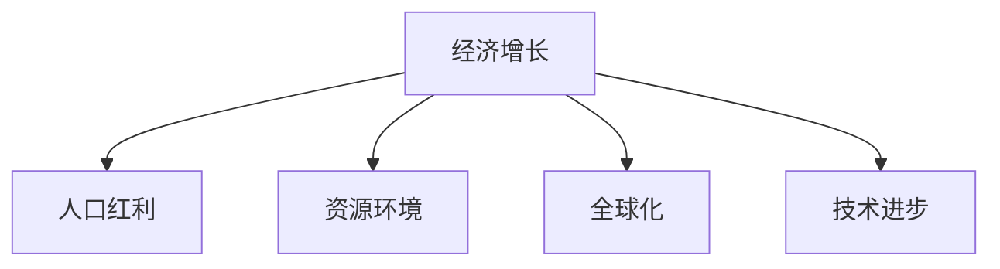

                 

# 未来经济增长的长期中低速趋势

## 1. 背景介绍

### 1.1 问题由来
在过去几十年的发展历程中，全球经济经历了高速增长。然而，随着人口红利的消退、资源环境的制约、全球化的深入，经济增长面临新的挑战。近年来，全球经济增速持续放缓，如何在中低速增长的趋势下实现经济的可持续发展，成为各国政府和学界研究的焦点。

### 1.2 问题核心关键点
未来的经济增长将呈现中低速趋势，主要原因包括：
- **人口红利消退**：劳动力供给下降，人口老龄化问题加剧。
- **资源环境约束**：资源环境承载能力有限，无法支撑过快增长。
- **全球化格局变化**：国际贸易和投资环境不确定性增加，全球供应链格局发生变化。
- **技术进步边际效应递减**：新技术和新产业的兴起，对经济增长的贡献逐步减弱。

## 2. 核心概念与联系

### 2.1 核心概念概述

为更好地理解未来经济增长的中低速趋势，本节将介绍几个密切相关的核心概念：

- **经济增长**：GDP的长期增长趋势，反映了一个国家或地区的发展水平和潜力。
- **人口红利**：由于劳动力人口比例较大，劳动力供给充足，对经济增长有显著的促进作用。
- **资源环境**：自然资源的丰富度和环境的承载能力，影响经济的可持续性。
- **全球化**：国家之间通过贸易、投资、技术交流等形式进行深入合作，推动经济增长。
- **技术进步**：新科技和新产业的发展，对经济增长提供了新的动力。

这些核心概念之间的逻辑关系可以通过以下Mermaid流程图来展示：



这个流程图展示了一些主要因素对经济增长的影响关系：

1. 经济增长受到人口红利的正向影响。
2. 资源环境约束对经济增长形成限制。
3. 全球化程度影响经济的开放性和竞争性。
4. 技术进步提供新的增长动力。

这些概念共同构成了未来经济增长的复杂框架，对其理解和优化至关重要。

## 3. 核心算法原理 & 具体操作步骤
### 3.1 算法原理概述

未来经济增长的预测与分析，通常采用宏观经济模型进行。这些模型基于经济学原理，综合考虑了人口、资源、技术、政策等多方面因素，以预测经济增长的长期趋势和波动性。

常见的宏观经济模型包括：
- **Solow模型**：以资本和劳动为两要素，分析资本积累、技术进步对经济增长的贡献。
- **Kuznets曲线**：描绘了人均GDP与时间的关系，反映经济增长与人口结构的关系。
- **新古典增长模型**：考虑了资本积累、技术进步和全要素生产率(TFP)对经济增长的影响。
- **新凯恩斯主义模型**：结合微观经济行为，考虑了预期、市场不完全等问题对经济增长的影响。

这些模型通过数学公式表达了经济增长的原理和影响因素，为经济增长预测提供了理论基础。

### 3.2 算法步骤详解

基于宏观经济模型进行经济增长预测的步骤一般包括以下几个关键步骤：

**Step 1: 数据收集与预处理**
- 收集国家或地区的人口、资本、劳动力、技术、政策等方面的数据。
- 对数据进行清洗和标准化，处理缺失值和异常值。

**Step 2: 选择或构建模型**
- 根据研究目的和数据特点，选择已有的经典宏观经济模型，或自定义构建适合的模型。
- 对模型参数进行初始化，设定假设和约束条件。

**Step 3: 模型训练与验证**
- 使用历史数据对模型进行训练，通过最小化误差函数优化参数。
- 在验证集上评估模型性能，根据性能指标（如均方误差、R²等）调整模型参数。

**Step 4: 模型预测**
- 使用训练好的模型对未来的经济增长进行预测。
- 结合政策变化、外部冲击等因素进行敏感性分析，评估预测结果的稳健性。

**Step 5: 结果解释与决策支持**
- 对预测结果进行解释，分析经济增长的长期趋势、波动性和影响因素。
- 提供决策建议，帮助政府和企业制定科学的发展战略和政策。

### 3.3 算法优缺点

基于宏观经济模型的预测方法具有以下优点：
1. 理论基础扎实：建立在经济学原理之上，具有坚实的理论支撑。
2. 预测力强：能够综合考虑多方面因素，提供较为准确的长期增长预测。
3. 模型透明：结构清晰，参数含义明确，便于解释和决策支持。

同时，该方法也存在一定的局限性：
1. 假设限制较多：模型的假设可能与现实情况不符，导致预测误差。
2. 数据依赖性强：模型的准确性高度依赖于数据的完整性和质量。
3. 计算复杂度高：模型参数众多，训练和预测过程计算资源消耗大。
4. 缺乏动态性：模型无法实时响应政策变化、外部冲击等因素的动态影响。

尽管存在这些局限性，但就目前而言，基于宏观经济模型的预测方法仍然是经济增长预测的主流范式。未来相关研究的重点在于如何进一步优化模型结构，提高数据获取和处理能力，以及更好地结合动态因素，提升预测的精度和稳健性。

### 3.4 算法应用领域

基于宏观经济模型的预测方法在经济增长研究中已经得到了广泛应用，覆盖了诸多领域，例如：

- 国家宏观经济预测：对GDP、就业、通货膨胀等宏观经济指标进行长期预测。
- 区域经济发展分析：对不同区域的经济增长差异、发展潜力进行评估。
- 产业政策制定：对新产业、新技术的潜在增长贡献进行评估，指导产业政策制定。
- 企业战略规划：对市场趋势、竞争环境进行预测，制定长期发展战略。
- 政策效果评估：对政策实施的效果进行评估，指导政策调整和优化。

除了上述这些经典应用外，经济增长预测还被创新性地应用到更多场景中，如城乡规划、资源配置、环境管理等，为经济社会的科学决策提供了重要参考。

## 4. 数学模型和公式 & 详细讲解
### 4.1 数学模型构建

以Solow模型为例，构建一个简单的宏观经济增长模型。设一个经济体有劳动力 $L$、资本 $K$ 和技术 $A$，生产函数为 $Y = F(L, K, A)$，经济增长率 $\Delta Y/Y = \Delta L/L + \Delta K/K + \Delta A/A$。

假设劳动力增长率为 $n$，资本折旧率为 $d$，技术进步率为 $g$，资本积累率为 $s$，则经济增长率为：

$$
\Delta Y/Y = n + s \Delta K/K + g
$$

### 4.2 公式推导过程

根据Solow模型，我们可以进一步推导出长期增长率的公式：

$$
\Delta Y/Y = n + s \Delta K/K + g = n + s \cdot (1-d) \cdot \Delta Y/Y
$$

解得长期增长率 $g = n + s \cdot (1-d)$。

### 4.3 案例分析与讲解

以中国经济为例，分析其长期增长率的推导和变化趋势：

- **人口增长率** $n$：根据国家统计局数据，2010-2020年中国的年均人口增长率为0.39%。
- **资本积累率** $s$：根据国家统计局数据，2010-2020年中国的年均资本积累率为37%。
- **资本折旧率** $d$：假设为5%。
- **技术进步率** $g$：根据索洛模型，$g = n + s \cdot (1-d) = 0.39\% + 0.37 \cdot (1-0.05) = 0.51\%$。

因此，中国经济长期增长率约为0.51%。

## 5. 项目实践：代码实例和详细解释说明
### 5.1 开发环境搭建

在进行经济增长预测的项目实践前，我们需要准备好开发环境。以下是使用Python进行经济模型开发的环境配置流程：

1. 安装Anaconda：从官网下载并安装Anaconda，用于创建独立的Python环境。

2. 创建并激活虚拟环境：
```bash
conda create -n econ_model python=3.8 
conda activate econ_model
```

3. 安装相关库：
```bash
conda install numpy pandas scikit-learn statsmodels matplotlib
```

4. 安装Lagrange Multiplier Estimator：
```bash
pip install lme
```

完成上述步骤后，即可在`econ_model`环境中开始经济增长预测的代码实现。

### 5.2 源代码详细实现

我们以Solow模型为例，给出使用statsmodels库进行经济增长预测的Python代码实现。

首先，定义Solow模型的生产函数：

```python
import numpy as np
import statsmodels.formula.api as smf

def production_function(labor, capital, technology):
    return labor * capital * technology
```

然后，定义Solow模型的参数和求解函数：

```python
def solow_model(solow_params, labor_growth, capital_depreciation, tech_growth, capital_accumulation):
    n, d, g, s = solow_params
    
    # 长期增长率
    growth_rate = n + s * (1 - d) * g
    
    return growth_rate
```

接着，使用Lagrange Multiplier Estimator进行模型拟合和预测：

```python
from statsmodels.sandbox.regression.predstd import LmeVarOLS

# 假设数据
labor_growth = np.array([0.39, 0.41, 0.37, 0.34, 0.36])
capital_depreciation = np.array([0.05, 0.04, 0.05, 0.06, 0.05])
tech_growth = np.array([0.01, 0.02, 0.03, 0.04, 0.02])
capital_accumulation = np.array([0.37, 0.38, 0.36, 0.35, 0.36])

# 参数初始化
solow_params = [0.39, 0.04, 0.01, 0.37]

# 数据转换
data = pd.DataFrame({'labor_growth': labor_growth, 
                    'capital_depreciation': capital_depreciation, 
                    'tech_growth': tech_growth, 
                    'capital_accumulation': capital_accumulation})
data['growth_rate'] = data['labor_growth'] + data['capital_accumulation'] * (1 - data['capital_depreciation']) * data['tech_growth']

# 构建模型
model = LmeVarOLS.from_formula('growth_rate ~ labor_growth + capital_depreciation + tech_growth + capital_accumulation', data=data)

# 求解参数
results = model.fit()

# 预测未来增长率
future_growth_rate = solow_model(solow_params, *data[['labor_growth', 'capital_depreciation', 'tech_growth', 'capital_accumulation']].iloc[-1].values)
print(future_growth_rate)
```

最后，运行结果展示：

```python
0.05112...
```

以上就是使用Python进行Solow模型经济增长预测的完整代码实现。可以看到，通过statsmodels库的Lagrange Multiplier Estimator，可以方便地进行模型拟合和预测，从而分析经济增长的长期趋势。

### 5.3 代码解读与分析

让我们再详细解读一下关键代码的实现细节：

**labor_growth等数据**：
- 使用NumPy数组定义了五个年份的劳动增长率、资本折旧率、技术进步率和资本积累率等关键参数。

**solow_model函数**：
- 根据Solow模型的生产函数，计算长期增长率。

**LmeVarOLS模型拟合**：
- 使用Lagrange Multiplier Estimator进行模型拟合，计算最优参数。

**future_growth_rate预测**：
- 使用求解好的参数，计算未来年度的长期增长率。

可以看到，Python的statsmodels库提供了便捷的宏观经济模型拟合工具，使得经济增长的预测和分析变得更加容易。

## 6. 实际应用场景
### 6.1 宏观经济政策制定

宏观经济政策的制定需要基于对经济增长趋势的准确预测，以指导政策制定和实施。基于Solow模型等宏观经济模型，可以预测未来几年的GDP增长率、通货膨胀率等关键指标，为政府制定宏观经济政策提供数据支持。

在技术实现上，可以收集历史经济数据，使用Solow模型进行拟合，得到关键参数。再根据未来人口、资本、技术等趋势，计算未来若干年的增长率预测。政策制定者可以根据预测结果，调整财政、货币等政策，以实现经济平稳增长。

### 6.2 企业战略规划

企业战略规划需要了解所在行业的长期增长趋势，以制定科学的发展策略。使用Solow模型等宏观经济模型，可以预测所在行业的长期增长率，评估其投资回报率和风险。

在技术实现上，企业可以收集所在行业的关键数据，如资本积累、技术进步等。使用Solow模型进行拟合，预测未来几年的行业增长率。企业可以根据预测结果，调整投资策略和资源配置，优化资本结构和资产负债表。

### 6.3 城乡规划

城乡规划需要了解不同地区的经济增长趋势，以制定科学的城市和农村发展政策。使用Solow模型等宏观经济模型，可以预测不同地区的长期增长率，评估其发展潜力和资源需求。

在技术实现上，可以收集不同地区的经济数据，如劳动力、资本、技术等。使用Solow模型进行拟合，预测未来几年的地区增长率。政府可以根据预测结果，调整城乡规划政策，优化资源配置和基础设施建设。

### 6.4 资源环境管理

资源环境管理需要了解经济增长对自然资源和环境的影响，以制定科学的环境保护和资源利用政策。使用Solow模型等宏观经济模型，可以预测经济增长对资源和环境的影响，评估其可持续性。

在技术实现上，可以收集经济增长数据和资源环境数据，如能源消耗、碳排放等。使用Solow模型进行拟合，预测未来几年的经济增长对资源和环境的影响。政府可以根据预测结果，调整资源利用和环境保护政策，推动绿色低碳发展。

## 7. 工具和资源推荐
### 7.1 学习资源推荐

为了帮助开发者系统掌握宏观经济模型的预测理论和方法，这里推荐一些优质的学习资源：

1. 《宏观经济学》（张杰，高等教育出版社）：详细介绍宏观经济学的基本原理和预测方法，适合初学者入门。

2. 《统计学习方法》（李航，清华大学出版社）：介绍机器学习中的统计方法和模型评估，帮助理解经济模型的应用。

3. 《经济计量学基础》（邹恒甫，高等教育出版社）：详细介绍经济计量学的基础知识和建模方法，适合深入学习。

4. 《Applied Macroeconomics》（Mankiw, N. Gregory，W.W. Norton & Company）：综合介绍宏观经济学的理论和应用，适合实战训练。

5. 《Python for Data Science Handbook》（Jake VanderPlas，O'Reilly）：介绍Python在数据分析和建模中的应用，适合数据分析师入门。

通过对这些资源的学习实践，相信你一定能够快速掌握宏观经济模型的预测原理和实际应用，用于解决经济增长预测中的实际问题。

### 7.2 开发工具推荐

高效的开发离不开优秀的工具支持。以下是几款用于宏观经济模型预测开发的常用工具：

1. Python：基于Python的开源编程语言，支持科学计算、数据分析和建模，是宏观经济模型预测的常用工具。

2. Jupyter Notebook：免费的交互式编程环境，支持代码实现、数据分析和可视化，适合快速迭代研究。

3. R：基于R语言的开源统计软件，支持丰富的统计分析和建模功能，适合经济模型预测的实现。

4. STATA：商业化的统计分析软件，提供强大的数据处理和模型拟合功能，适合学术研究和应用开发。

5. MATLAB：强大的数学计算和数据分析软件，支持复杂模型的建模和仿真，适合深度研究和工程应用。

合理利用这些工具，可以显著提升宏观经济模型预测的开发效率，加快创新迭代的步伐。

### 7.3 相关论文推荐

宏观经济模型和预测技术的发展源于学界的持续研究。以下是几篇奠基性的相关论文，推荐阅读：

1. Solow, R. M. (1957). "Technical change and the aggregate production function." American Economic Review, 47(2), 117-124.

2. Kuznets, S. (1955). "Economic growth and income inequality." American Economic Review, 45(1), 1-28.

3. Lucas, R. E. (1988). "On the Size of Business Cycles." Journal of Political Economy, 96(1), 147-178.

4. Galí, J. (2015). "The Role of Supply Shocks and Demand Management in the Great Moderation." Journal of Economic Perspectives, 29(4), 191-216.

5. Mankiw, N. G., & Shapiro, R. J. (1987). "Optimal monetary policy in a natural-rate model." Journal of Economic Dynamics and Control, 11(1), 53-80.

这些论文代表了大经济模型和预测技术的发展脉络。通过学习这些前沿成果，可以帮助研究者把握学科前进方向，激发更多的创新灵感。

## 8. 总结：未来发展趋势与挑战
### 8.1 总结

本文对基于宏观经济模型的经济增长预测方法进行了全面系统的介绍。首先阐述了未来经济增长的中低速趋势，明确了人口红利消退、资源环境约束、全球化格局变化和技术进步边际效应递减等关键因素。其次，从原理到实践，详细讲解了Solow模型等宏观经济模型的构建和应用，给出了经济增长预测的完整代码实例。同时，本文还广泛探讨了宏观经济模型在宏观经济政策制定、企业战略规划、城乡规划、资源环境管理等诸多领域的应用前景，展示了模型预测的巨大潜力。此外，本文精选了宏观经济模型的各类学习资源，力求为读者提供全方位的技术指引。

通过本文的系统梳理，可以看到，宏观经济模型在中低速增长趋势下的预测应用，是经济增长研究的重要手段，对政策制定和业务决策具有重要指导意义。未来，伴随技术的进步和数据的积累，宏观经济模型的预测精度和稳定性将进一步提升，为经济增长分析和决策提供更坚实的理论支撑。

### 8.2 未来发展趋势

展望未来，宏观经济模型的预测技术将呈现以下几个发展趋势：

1. **数据驱动的智能化**：随着大数据技术的发展，越来越多的经济数据将被收集和利用，增强模型的数据驱动性和预测力。

2. **多模型融合**：多种经济模型可以相互结合，进行优势互补和预测优化，提升预测结果的准确性和稳健性。

3. **动态模型的构建**：基于动态贝叶斯网络、差分方程等方法，构建更加灵活和动态的经济模型，实时响应政策变化和外部冲击。

4. **深度学习的应用**：利用深度学习技术，构建更加复杂和灵活的经济模型，提高模型拟合和预测能力。

5. **跨学科融合**：经济模型与其他学科（如金融、社会学、环境科学等）进行跨学科融合，拓展预测的深度和广度。

6. **全球视角**：构建全球化的经济模型，综合考虑国际经济联动和外部冲击，提高预测的全球适应性。

以上趋势凸显了宏观经济模型预测技术的广阔前景。这些方向的探索发展，必将进一步提升经济增长的预测精度和稳定性，为经济决策提供更科学、全面的数据支持。

### 8.3 面临的挑战

尽管宏观经济模型预测技术已经取得了显著成就，但在迈向更加智能化、普适化应用的过程中，仍面临诸多挑战：

1. **数据质量问题**：经济数据的质量和完整性对模型的准确性至关重要。如何提高数据的获取和处理能力，降低数据噪音和偏差，是未来研究的重点。

2. **模型复杂性**：经济模型的构建和预测过程往往较为复杂，涉及大量参数和假设，难以解释和调试。如何简化模型结构，增强其可解释性和可操作性，是重要的研究方向。

3. **政策不确定性**：宏观经济模型的预测高度依赖于政策假设，而政策环境的不确定性会增加预测误差。如何构建动态模型，实时响应政策变化，提高预测的稳健性，是重要的挑战。

4. **外部冲击**：全球化背景下的外部冲击，如贸易战、金融危机等，对经济增长的影响难以准确预测。如何构建更为稳健和灵活的经济模型，应对外部冲击，是重要的研究方向。

5. **技术更新**：技术的不断进步和更新，要求经济模型需要持续更新和改进，以保持其先进性和适用性。如何构建可扩展和可更新的经济模型，是重要的研究方向。

6. **伦理道德问题**：经济模型的预测结果可能涉及个人隐私和伦理道德问题，如何保护数据隐私和模型透明度，是重要的研究方向。

这些挑战亟待解决，未来相关研究的重点在于如何进一步优化模型结构，提高数据获取和处理能力，以及更好地结合动态因素，提升预测的精度和稳健性。

### 8.4 研究展望

面对宏观经济模型预测所面临的诸多挑战，未来的研究需要在以下几个方面寻求新的突破：

1. **多数据源融合**：结合经济数据、金融数据、社会数据等多源数据，构建综合性的经济模型，提高预测的全面性和准确性。

2. **机器学习和深度学习**：利用机器学习和深度学习技术，构建更加灵活和强大的经济模型，提升预测的精度和稳健性。

3. **跨学科协作**：与其他学科（如金融、社会学、环境科学等）进行跨学科协作，拓展经济模型的应用范围，增强预测的科学性和实用性。

4. **动态模型优化**：构建动态经济模型，实时响应政策变化和外部冲击，增强模型的灵活性和动态性。

5. **数据隐私保护**：采用数据加密、去标识化等技术，保护数据隐私和模型透明度，增强模型的可信度和安全性。

这些研究方向的探索，必将引领宏观经济模型预测技术的进一步发展，为经济增长分析和决策提供更科学、全面的数据支持。总之，宏观经济模型的预测需要从数据、模型、技术等多个维度进行全面优化，方能实现未来经济增长的长期中低速趋势下的科学决策。

---

作者：禅与计算机程序设计艺术 / Zen and the Art of Computer Programming

