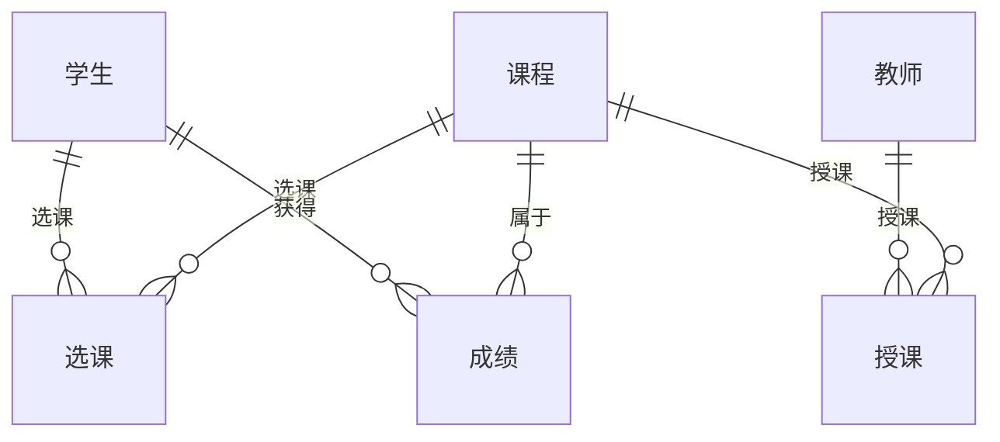

## 1. 背景介绍

### 1.1 高校学籍管理的意义

高校学籍管理是高等教育管理的重要组成部分，它涉及学生从入学到毕业的整个学习生涯，涵盖了招生、注册、选课、成绩管理、奖惩、毕业等各个环节。高效、规范的学籍管理系统对于维护学校正常的教学秩序、保障学生权益、提高学校管理水平具有重要意义。

### 1.2 传统学籍管理方式的弊端

传统的学籍管理方式主要依赖人工操作，存在着效率低下、易出错、信息不透明等弊端。例如：

* **信息记录分散**: 学生信息分散在各个部门，难以整合和共享。
* **人工操作繁琐**:  大量的纸质档案需要人工录入、整理和存档，效率低下。
* **信息更新滞后**:  学生信息更新不及时，容易造成信息错误和遗漏。
* **数据分析能力不足**: 难以对学籍数据进行深入分析，无法及时发现问题和趋势。

### 1.3 信息化建设的必然趋势

随着信息技术的快速发展，高校学籍管理的信息化建设已成为必然趋势。信息化可以有效解决传统学籍管理方式的弊端，提高管理效率和服务质量。

## 2. 核心概念与联系

### 2.1 系统用户角色

* **学生**:  系统的最终用户，可以查看个人信息、选课、查询成绩等。
* **教师**:  可以录入成绩、管理课程等。
* **管理员**:  拥有最高权限，可以管理所有用户、数据和系统设置。

### 2.2 主要功能模块

* **学生管理**:  包括学生信息维护、学籍异动、奖惩管理等。
* **课程管理**:  包括课程信息维护、排课管理、选课管理等。
* **成绩管理**:  包括成绩录入、成绩查询、成绩分析等。
* **毕业管理**:  包括毕业资格审核、毕业证书发放等。
* **系统管理**:  包括用户管理、权限管理、系统日志等。

### 2.3 数据关系图



## 3. 核心算法原理具体操作步骤

### 3.1 学生信息管理

#### 3.1.1 信息录入

管理员可以批量导入学生信息，也可以手动添加学生信息。录入的信息包括：学号、姓名、性别、出生日期、身份证号、院系、专业等。

#### 3.1.2 信息查询

学生、教师和管理员可以根据学号、姓名等条件查询学生信息。

#### 3.1.3 信息修改

管理员可以修改学生信息，例如：修改学生联系方式、家庭住址等。

### 3.2 课程管理

#### 3.2.1 课程信息维护

管理员可以添加、修改和删除课程信息。课程信息包括：课程编号、课程名称、课程类型、学分、开课学期等。

#### 3.2.2 排课管理

管理员可以根据教学计划安排课程的开课时间、地点和授课教师。

#### 3.2.3 选课管理

学生可以在规定时间内选择自己想要学习的课程。系统会根据课程容量限制学生的选课数量。

### 3.3 成绩管理

#### 3.3.1 成绩录入

教师可以在系统中录入学生的课程成绩。

#### 3.3.2 成绩查询

学生可以查询自己的课程成绩，教师可以查询自己所授课程的学生成绩。

#### 3.3.3 成绩分析

系统可以对学生的成绩进行统计分析，例如：计算平均成绩、排名等。

## 4. 数学模型和公式详细讲解举例说明

### 4.1 成绩加权平均分计算

学生的课程总评成绩通常由多个部分组成，例如：平时成绩、期中成绩、期末成绩等。每个部分的权重不同，最终成绩需要根据权重进行加权平均计算。

**公式**:

$$
总评成绩 = \sum_{i=1}^{n} w_i \times x_i
$$

其中：

* $w_i$ 表示第 $i$ 个部分的权重，$0 \le w_i \le 1$，且 $\sum_{i=1}^{n} w_i = 1$。
* $x_i$ 表示第 $i$ 个部分的成绩。

**举例**:

假设某门课程的平时成绩占 30%，期中成绩占 30%，期末成绩占 40%。学生的平时成绩为 80 分，期中成绩为 90 分，期末成绩为 85 分。则该学生的总评成绩为：

$$
总评成绩 = 0.3 \times 80 + 0.3 \times 90 + 0.4 \times 85 = 86
$$

### 4.2 GPA 计算

GPA (Grade Point Average) 是学生学业成绩的平均绩点，它反映了学生的整体学习水平。

**公式**:

$$
GPA = \frac{\sum_{i=1}^{n} c_i \times g_i}{\sum_{i=1}^{n} c_i}
$$

其中：

* $c_i$ 表示第 $i$ 门课程的学分。
* $g_i$ 表示第 $i$ 门课程的绩点。

**举例**:

假设某学生的课程成绩如下表所示：

| 课程名称 | 学分 | 成绩 | 绩点 |
|---|---|---|---|
| 数学 | 4 | 90 | 4.0 |
| 英语 | 3 | 85 | 3.7 |
| 计算机 | 2 | 80 | 3.3 |

则该学生的 GPA 为：

$$
GPA = \frac{4 \times 4.0 + 3 \times 3.7 + 2 \times 3.3}{4 + 3 + 2} = 3.78
$$

## 5. 项目实践：代码实例和详细解释说明

### 5.1 技术选型

* **后端**: Python + Django
* **前端**: HTML + CSS + JavaScript
* **数据库**: MySQL

### 5.2 数据库设计

**学生表 (student)**

| 字段 | 类型 | 说明 |
|---|---|---|
| id | INT | 主键 |
| student_id | VARCHAR(20) | 学号 |
| name | VARCHAR(50) | 姓名 |
| gender | VARCHAR(10) | 性别 |
| birth_date | DATE | 出生日期 |
| id_card | VARCHAR(20) | 身份证号 |
| department | VARCHAR(50) | 院系 |
| major | VARCHAR(50) | 专业 |

**课程表 (course)**

| 字段 | 类型 | 说明 |
|---|---|---|
| id | INT | 主键 |
| course_id | VARCHAR(20) | 课程编号 |
| name | VARCHAR(50) | 课程名称 |
| type | VARCHAR(20) | 课程类型 |
| credit | INT | 学分 |
| semester | VARCHAR(20) | 开课学期 |

**成绩表 (grade)**

| 字段 | 类型 | 说明 |
|---|---|---|
| id | INT | 主键 |
| student_id | INT | 学生 id |
| course_id | INT | 课程 id |
| score | FLOAT | 成绩 |

### 5.3 代码实现

**学生信息添加接口**:

```python
from django.http import JsonResponse
from .models import Student

def add_student(request):
    """
    添加学生信息接口
    """
    student_id = request.POST.get('student_id')
    name = request.POST.get('name')
    gender = request.POST.get('gender')
    birth_date = request.POST.get('birth_date')
    id_card = request.POST.get('id_card')
    department = request.POST.get('department')
    major = request.POST.get('major')

    student = Student(
        student_id=student_id,
        name=name,
        gender=gender,
        birth_date=birth_date,
        id_card=id_card,
        department=department,
        major=major
    )
    student.save()

    return JsonResponse({'status': 'success'})
```

**学生信息查询接口**:

```python
from django.http import JsonResponse
from .models import Student

def get_student(request):
    """
    查询学生信息接口
    """
    student_id = request.GET.get('student_id')

    student = Student.objects.filter(student_id=student_id).first()

    if student:
        return JsonResponse({
            'status': 'success',
            'data': {
                'student_id': student.student_id,
                'name': student.name,
                'gender': student.gender,
                'birth_date': student.birth_date,
                'id_card': student.id_card,
                'department': student.department,
                'major': student.major
            }
        })
    else:
        return JsonResponse({'status': 'error', 'message': '学生不存在'})
```

## 6. 实际应用场景

高校学籍管理系统可以应用于以下场景：

* **新生入学**:  新生入学时，可以使用系统进行在线注册、信息采集和学费缴纳。
* **日常教学**:  教师可以使用系统进行课程管理、成绩录入和查询。
* **学籍异动**:  学生可以申请休学、复学、转专业等学籍异动操作。
* **毕业审核**:  系统可以自动审核学生的毕业资格，并生成毕业证书。
* **数据分析**:  学校管理人员可以利用系统进行学籍数据分析，了解学生的学习情况和发展趋势。

## 7. 工具和资源推荐

### 7.1 数据库管理工具

* **MySQL Workbench**:  MySQL 官方提供的数据库管理工具，功能强大，易于使用。
* **Navicat**:  一款支持多种数据库的管理工具，界面美观，操作便捷。

### 7.2 Python Web 框架

* **Django**:  一款流行的 Python Web 框架，功能强大，易于学习和使用。
* **Flask**:  一款轻量级的 Python Web 框架，灵活易扩展。

### 7.3 前端开发工具

* **Visual Studio Code**:  一款流行的代码编辑器，支持多种编程语言，功能强大，插件丰富。
* **Sublime Text**:  一款轻量级的代码编辑器，启动速度快，易于使用。

## 8. 总结：未来发展趋势与挑战

### 8.1 未来发展趋势

* **云计算**:  将学籍管理系统部署到云平台，可以提高系统的可靠性、安全性和可扩展性。
* **大数据**:  利用大数据技术分析学籍数据，可以为学校管理决策提供更加科学的依据。
* **人工智能**:  将人工智能技术应用于学籍管理，可以实现自动化处理、智能推荐等功能。

### 8.2 面临的挑战

* **数据安全**:  学籍数据包含学生个人隐私信息，需要加强数据安全保护措施。
* **系统集成**:  学籍管理系统需要与其他校内系统进行集成，例如：教务系统、财务系统等。
* **用户体验**:  需要不断优化系统用户界面和操作流程，提升用户体验。

## 9. 附录：常见问题与解答

### 9.1 如何修改学生信息？

管理员登录系统后，点击“学生管理”菜单，找到需要修改的学生信息，点击“编辑”按钮即可修改。

### 9.2 如何查询学生的课程成绩？

学生登录系统后，点击“成绩查询”菜单，选择需要查询的学期，即可查看所有课程的成绩。

### 9.3 如何申请休学？

学生登录系统后，点击“学籍异动”菜单，选择“休学申请”，填写相关信息并提交申请即可。
