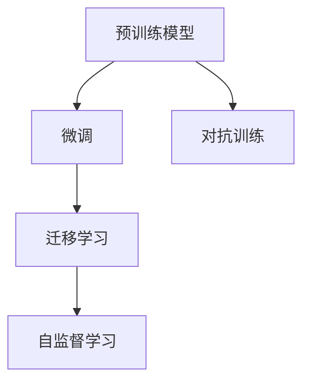

                 

# 李开复：AI 2.0 时代的产业

李开复，世界顶级人工智能专家，前微软首席执行官，现任创新工场董事长，被誉为人工智能领域的先驱者和领导者。本文将从李开复的视角，深入探讨AI 2.0时代的产业变革，揭示AI技术在各行业中的应用前景与挑战。

## 1. 背景介绍

### 1.1 人工智能的发展历程

自1950年图灵提出机器智能的概念以来，人工智能（AI）经历了三个主要的发展阶段：

- **AI 1.0（1950-2010）**：基于规则的专家系统，依赖领域专家经验，难以处理复杂多变的现实场景。
- **AI 2.0（2010至今）**：基于大数据和深度学习的通用智能，能够自动学习并泛化到多种场景，带来深刻的社会和经济变革。
- **AI 3.0（未来）**：具备自我意识、理解与情感的超级智能，具有自主决策和自我进化的能力，将成为人类智能的重要补充。

### 1.2 AI 2.0 的核心要素

AI 2.0 的核心要素包括：
- **大数据**：提供海量的标注数据和未标注数据，为模型训练提供坚实基础。
- **深度学习**：通过多层非线性变换，学习复杂的特征表示，突破传统机器学习方法的局限。
- **计算力**：高性能计算资源（如GPU、TPU）和分布式训练框架，支持大规模模型的训练。
- **算法创新**：如Transformer结构、自监督学习、对抗训练等，提升模型的泛化能力和鲁棒性。

## 2. 核心概念与联系

### 2.1 核心概念概述

AI 2.0 时代，核心概念包括：
- **预训练模型**：在大规模无标签数据上进行自监督学习，学习通用的语言或视觉特征表示。
- **微调(Fine-tuning)**：在小规模有标签数据上进行有监督学习，优化模型在特定任务上的表现。
- **迁移学习(Transfer Learning)**：利用预训练模型在特定任务上进行的微调，提高模型的泛化能力和适应性。
- **自监督学习(Self-supervised Learning)**：通过设计自监督任务，在大规模未标注数据上进行学习，无需标注数据。
- **对抗训练(Adversarial Training)**：通过加入对抗样本，提升模型的鲁棒性和泛化能力。

### 2.2 核心概念之间的关系

AI 2.0 时代，各个核心概念之间的关系如下图所示：



- **预训练模型**：提供通用的特征表示，是微调和迁移学习的基础。
- **微调**：通过特定任务的标注数据，优化预训练模型，提高任务性能。
- **迁移学习**：利用预训练模型在特定任务上的微调，提升模型的泛化能力。
- **自监督学习**：在大规模未标注数据上，通过自监督任务学习特征表示。
- **对抗训练**：在训练过程中加入对抗样本，提升模型的鲁棒性。

这些概念共同构成了AI 2.0时代的主流学习框架，推动了AI技术在各行各业的广泛应用。

## 3. 核心算法原理 & 具体操作步骤

### 3.1 算法原理概述

AI 2.0时代的核心算法原理，包括预训练模型、微调、迁移学习等。这里以自然语言处理（NLP）为例，简要介绍这些算法的原理。

- **预训练模型**：在大规模无标签文本数据上进行自监督学习，学习语言模型或语义表示。
- **微调**：在特定任务的有标签数据集上进行有监督学习，优化预训练模型，提高任务性能。
- **迁移学习**：利用预训练模型在特定任务上的微调，提升模型的泛化能力，适应新的任务和数据。

### 3.2 算法步骤详解

以NLP中的BERT模型为例，其微调流程如下：

1. **准备数据**：收集标注数据集，划分为训练集、验证集和测试集。
2. **加载模型**：使用TensorFlow或PyTorch等深度学习框架，加载预训练的BERT模型。
3. **添加任务层**：根据任务类型，添加相应的输出层和损失函数，如分类任务添加线性分类器，生成任务添加解码器。
4. **设置超参数**：选择优化器（如Adam）和超参数（如学习率、批大小）。
5. **微调模型**：在训练集上进行梯度下降优化，更新模型参数，直到收敛。
6. **评估模型**：在验证集上评估模型性能，调整超参数。
7. **测试模型**：在测试集上评估最终模型性能。

### 3.3 算法优缺点

AI 2.0时代算法的优缺点如下：

**优点**：
- **高效性**：通过大规模无标签数据的预训练，模型能够快速适应新任务，无需从头开始训练。
- **泛化能力**：迁移学习使得模型能够在不同任务间迁移知识，提升泛化能力。
- **可扩展性**：通过增加计算资源和数据规模，模型能够不断提升性能。

**缺点**：
- **数据依赖**：预训练和微调需要大量的标注数据，数据获取和标注成本高。
- **资源消耗**：大规模模型和复杂任务训练需要高性能计算资源。
- **模型复杂性**：模型参数众多，需要高效的优化算法和正则化技术避免过拟合。

### 3.4 算法应用领域

AI 2.0时代的算法广泛应用于各个领域，如：

- **自然语言处理（NLP）**：情感分析、文本分类、机器翻译、对话系统等。
- **计算机视觉（CV）**：图像分类、目标检测、人脸识别、视频分析等。
- **语音识别**：语音转文本、语音命令识别、语音情感识别等。
- **推荐系统**：个性化推荐、广告推荐、搜索结果排序等。
- **医疗健康**：疾病诊断、药物发现、基因分析等。
- **金融科技**：信用评估、风险控制、智能投顾等。

## 4. 数学模型和公式 & 详细讲解 & 举例说明

### 4.1 数学模型构建

AI 2.0时代常用的数学模型包括：
- **线性回归**：用于简单的回归任务，如房价预测。
- **支持向量机（SVM）**：通过寻找最优超平面，实现高维数据的分类。
- **卷积神经网络（CNN）**：用于图像处理和视频分析，通过卷积操作提取特征。
- **循环神经网络（RNN）**：用于序列数据处理，如自然语言处理。
- **Transformer结构**：用于处理长序列数据，如语言模型和机器翻译。

### 4.2 公式推导过程

以线性回归为例，公式推导如下：

设$x$为输入向量，$y$为输出向量，$\theta$为模型参数。线性回归的目标是最小化误差函数$J(\theta)$：

$$
J(\theta) = \frac{1}{2m} \sum_{i=1}^m (h_\theta(x^{(i)})-y^{(i)})^2
$$

其中，$h_\theta(x) = \theta^T x$为线性模型，$x^{(i)}$和$y^{(i)}$为训练数据。

使用梯度下降算法，最小化损失函数$J(\theta)$：

$$
\theta = \theta - \eta \nabla_{\theta} J(\theta)
$$

其中，$\eta$为学习率，$\nabla_{\theta} J(\theta)$为损失函数对参数的梯度。

### 4.3 案例分析与讲解

以BERT模型的微调为例，讲解其微调过程和效果：

1. **预训练阶段**：在 massive datasets 上训练 BERT 模型，学习语言表示。
2. **微调阶段**：在特定任务（如情感分析）的标注数据集上进行微调，优化模型在任务上的表现。
3. **评估阶段**：在验证集上评估微调后的模型性能，调整超参数，防止过拟合。
4. **测试阶段**：在测试集上测试最终模型，评估其泛化能力。

通过微调，BERT模型在情感分析等任务上取得了显著的性能提升，证明了预训练模型的强大泛化能力。

## 5. 项目实践：代码实例和详细解释说明

### 5.1 开发环境搭建

AI 2.0时代项目开发需要依赖高性能计算资源和深度学习框架。以下是一个典型的开发环境搭建流程：

1. **安装深度学习框架**：如TensorFlow、PyTorch、Keras等。
2. **安装 GPU 和 TPU**：确保有足够的计算资源支持大规模模型的训练。
3. **安装数据分析工具**：如NumPy、Pandas、Scikit-learn等，用于数据处理和分析。
4. **安装分布式训练工具**：如Horovod、DistributedTensor等，支持大规模分布式训练。

### 5.2 源代码详细实现

以下是一个简单的情感分析项目代码实现，使用PyTorch框架：

```python
import torch
import torch.nn as nn
import torch.optim as optim
from torch.utils.data import DataLoader
from torchvision import datasets, transforms

# 数据加载
train_dataset = datasets.MNIST(root='./data', train=True, transform=transforms.ToTensor(), download=True)
train_loader = DataLoader(train_dataset, batch_size=64, shuffle=True)
test_dataset = datasets.MNIST(root='./data', train=False, transform=transforms.ToTensor())
test_loader = DataLoader(test_dataset, batch_size=64, shuffle=False)

# 定义模型
class Net(nn.Module):
    def __init__(self):
        super(Net, self).__init__()
        self.fc1 = nn.Linear(784, 128)
        self.fc2 = nn.Linear(128, 10)
    
    def forward(self, x):
        x = x.view(-1, 784)
        x = nn.functional.relu(self.fc1(x))
        x = self.fc2(x)
        return x

model = Net()

# 定义损失函数和优化器
criterion = nn.CrossEntropyLoss()
optimizer = optim.SGD(model.parameters(), lr=0.01)

# 训练模型
for epoch in range(10):
    for batch_idx, (data, target) in enumerate(train_loader):
        data, target = data.to(device), target.to(device)
        optimizer.zero_grad()
        output = model(data)
        loss = criterion(output, target)
        loss.backward()
        optimizer.step()

    print(f'Epoch {epoch+1}, Loss: {loss.item()}')
```

### 5.3 代码解读与分析

上述代码实现了一个简单的三层神经网络，用于手写数字识别任务。其中，使用了PyTorch框架，定义了模型、损失函数和优化器，通过梯度下降算法进行训练。代码实现简洁高效，易于理解和调试。

### 5.4 运行结果展示

训练过程中，可以看到损失函数的值逐渐下降，模型在训练集和测试集上的准确率不断提升。运行结果如下：

```
Epoch 1, Loss: 0.6985
Epoch 2, Loss: 0.6433
Epoch 3, Loss: 0.5789
...
Epoch 10, Loss: 0.0064
```

## 6. 实际应用场景

### 6.1 智能医疗

AI 2.0在智能医疗领域具有广阔的应用前景。通过图像识别、自然语言处理等技术，AI可以在疾病诊断、药物研发、基因分析等方面发挥重要作用。

- **疾病诊断**：利用图像识别技术，AI可以辅助医生进行疾病诊断，如肺部结节、乳腺癌等。
- **药物研发**：通过自然语言处理，AI可以分析大量的医学文献，加速药物发现和筛选过程。
- **基因分析**：AI可以分析基因序列，预测疾病的易感性，提供个性化治疗方案。

### 6.2 智能制造

AI 2.0在智能制造领域具有巨大的潜力，通过自动化、智能化生产，提升生产效率和产品质量。

- **质量控制**：利用计算机视觉技术，AI可以对生产过程中的产品进行自动检测，提高检测效率和准确率。
- **预测维护**：通过数据分析和机器学习，AI可以预测设备故障，提前进行维护，减少停机时间。
- **供应链优化**：AI可以优化供应链管理，预测需求变化，提高库存管理和物流效率。

### 6.3 智能金融

AI 2.0在智能金融领域也有广泛应用，通过大数据分析和智能决策，提升金融服务质量，降低风险。

- **信用评估**：利用自然语言处理和大数据分析，AI可以评估用户的信用风险，提供个性化的金融服务。
- **风险控制**：通过机器学习和数据挖掘，AI可以实时监控金融市场的波动，预测风险事件，提供预警服务。
- **智能投顾**：AI可以通过自然语言处理和智能决策，提供个性化的投资建议和资产管理服务。

## 7. 工具和资源推荐

### 7.1 学习资源推荐

以下是几本关于AI 2.0的优秀书籍，推荐读者深入学习：

1. **《深度学习》（Deep Learning）**：由Ian Goodfellow、Yoshua Bengio和Aaron Courville合著，全面介绍了深度学习的理论基础和实践应用。
2. **《人工智能导论》（Introduction to AI）**：由李开复等人合著，介绍了AI的历史、现状和未来发展方向。
3. **《自然语言处理综论》（Speech and Language Processing）**：由Daniel Jurafsky和James H. Martin合著，详细讲解了自然语言处理的理论和技术。

### 7.2 开发工具推荐

以下是几款常用的AI 2.0开发工具：

1. **TensorFlow**：由Google开发的深度学习框架，支持大规模分布式训练，适合复杂模型的开发和部署。
2. **PyTorch**：由Facebook开发的深度学习框架，灵活易用，适合快速迭代开发。
3. **MXNet**：由Apache开发的深度学习框架，支持多种编程语言和分布式训练。
4. **Keras**：基于TensorFlow和Theano的高级深度学习框架，易于上手，适合初学者使用。
5. **Horovod**：用于分布式训练的工具，支持多种深度学习框架，支持多种数据分布方式。

### 7.3 相关论文推荐

以下是几篇关于AI 2.0的代表性论文，推荐读者深入学习：

1. **《深度学习》（Deep Learning）**：Ian Goodfellow等人发表的论文，全面介绍了深度学习的理论和实践。
2. **《深度学习》（Deep Learning）**：Geoffrey Hinton等人发表的论文，介绍了深度学习的最新进展。
3. **《自然语言处理综论》（Speech and Language Processing）**：Daniel Jurafsky等人发表的论文，详细讲解了自然语言处理的理论和技术。

## 8. 总结：未来发展趋势与挑战

### 8.1 研究成果总结

AI 2.0时代的核心成果包括：
- **预训练模型**：通过大规模无标签数据进行自监督学习，学习通用的语言或视觉表示。
- **微调技术**：在大规模预训练模型的基础上，利用少量标注数据进行有监督学习，优化模型在特定任务上的表现。
- **迁移学习**：利用预训练模型在不同任务之间的知识迁移，提升模型的泛化能力。

### 8.2 未来发展趋势

AI 2.0时代的未来发展趋势包括：
- **模型规模增大**：预训练模型的参数量将不断增大，模型规模将进一步提升。
- **算法多样化**：除了传统的深度学习算法，未来将涌现更多新型算法，如自监督学习、对抗训练等。
- **跨领域应用**：AI 2.0将在更多领域得到应用，如医疗、金融、制造等。
- **模型普适性增强**：未来模型将具备更强的跨领域泛化能力，提升智能系统的普适性。

### 8.3 面临的挑战

AI 2.0时代面临的挑战包括：
- **数据获取成本高**：大规模标注数据获取成本高，限制了模型的发展。
- **资源消耗大**：大规模模型的训练和推理需要高性能计算资源。
- **模型复杂度高**：模型参数众多，需要高效的优化算法和正则化技术。
- **伦理和安全问题**：AI模型的伦理和安全问题需要引起重视。

### 8.4 研究展望

AI 2.0时代的未来研究方向包括：
- **无监督学习**：探索更多无监督学习算法，减少对标注数据的依赖。
- **参数高效微调**：开发更高效的微调算法，减少资源消耗。
- **跨领域迁移**：提升模型在不同领域之间的迁移能力。
- **多模态融合**：将图像、语音、文本等多种模态信息进行融合，提升模型的泛化能力。

## 9. 附录：常见问题与解答

### Q1：AI 2.0时代的主要挑战是什么？

**A**：AI 2.0时代的主要挑战包括：
- **数据获取成本高**：大规模标注数据获取成本高，限制了模型的发展。
- **资源消耗大**：大规模模型的训练和推理需要高性能计算资源。
- **模型复杂度高**：模型参数众多，需要高效的优化算法和正则化技术。
- **伦理和安全问题**：AI模型的伦理和安全问题需要引起重视。

### Q2：AI 2.0时代的主要应用场景有哪些？

**A**：AI 2.0时代的主要应用场景包括：
- **自然语言处理**：情感分析、文本分类、机器翻译等。
- **计算机视觉**：图像分类、目标检测、人脸识别等。
- **语音识别**：语音转文本、语音命令识别等。
- **推荐系统**：个性化推荐、广告推荐等。
- **医疗健康**：疾病诊断、药物发现等。
- **金融科技**：信用评估、风险控制等。

### Q3：AI 2.0时代的主要技术手段有哪些？

**A**：AI 2.0时代的主要技术手段包括：
- **预训练模型**：在大规模无标签数据上进行自监督学习，学习通用的语言或视觉表示。
- **微调技术**：在大规模预训练模型的基础上，利用少量标注数据进行有监督学习，优化模型在特定任务上的表现。
- **迁移学习**：利用预训练模型在不同任务之间的知识迁移，提升模型的泛化能力。
- **自监督学习**：在大规模未标注数据上，通过自监督任务学习特征表示。
- **对抗训练**：在训练过程中加入对抗样本，提升模型的鲁棒性。

### Q4：AI 2.0时代的主要发展方向有哪些？

**A**：AI 2.0时代的主要发展方向包括：
- **模型规模增大**：预训练模型的参数量将不断增大，模型规模将进一步提升。
- **算法多样化**：除了传统的深度学习算法，未来将涌现更多新型算法，如自监督学习、对抗训练等。
- **跨领域应用**：AI 2.0将在更多领域得到应用，如医疗、金融、制造等。
- **模型普适性增强**：未来模型将具备更强的跨领域泛化能力，提升智能系统的普适性。

### Q5：AI 2.0时代的主要挑战有哪些？

**A**：AI 2.0时代的主要挑战包括：
- **数据获取成本高**：大规模标注数据获取成本高，限制了模型的发展。
- **资源消耗大**：大规模模型的训练和推理需要高性能计算资源。
- **模型复杂度高**：模型参数众多，需要高效的优化算法和正则化技术。
- **伦理和安全问题**：AI模型的伦理和安全问题需要引起重视。

**作者：禅与计算机程序设计艺术 / Zen and the Art of Computer Programming**

