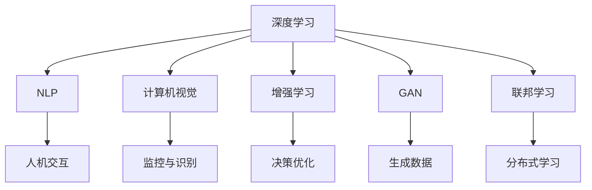

                 

# 李开复：AI 2.0 时代的商业价值

在人工智能（AI）迅猛发展的今天，AI 2.0时代已经到来，这一时期的AI技术将从自动化和优化任务转向更加复杂、智能化的创新型应用。AI 2.0不仅能够理解和应用现有的知识，还能生成全新的概念和理论，推动各个行业的转型升级。本文将探讨AI 2.0时代的商业价值，分析其对企业战略、运营模式和市场竞争的影响，并提供相关的战略建议。

## 1. 背景介绍

### 1.1 人工智能的演进

人工智能的发展可以分为三个阶段：

1. **AI 1.0**：即规则型AI，主要依赖于预设的规则和算法。这些规则由专家制定，用于解决特定问题，如专家系统、自然语言处理等。

2. **AI 2.0**：即统计型AI，依赖大量数据和机器学习算法。通过数据驱动的模型学习，AI 2.0能够处理复杂数据，解决更广泛的实际问题。

3. **AI 3.0**：即因果型AI，能够建立因果关系，进行预测和控制。AI 3.0不仅能够理解现状，还能预测未来，优化决策过程。

AI 2.0时代的核心特征包括：

- **深度学习**：通过多层次的神经网络模型，学习复杂的非线性关系。
- **自然语言处理**：能够理解和生成自然语言，提升人机交互体验。
- **计算机视觉**：能够识别和理解图像和视频内容，推动自动化监控、识别等领域的应用。
- **增强学习**：通过试错学习，优化决策策略，提升机器人、自动驾驶等领域的性能。

### 1.2 AI 2.0 的商业价值

AI 2.0时代的商业价值体现在以下几个方面：

1. **提升效率**：AI 2.0能够自动化执行重复性任务，优化流程，提升生产效率和运营效率。
2. **创新突破**：AI 2.0能够生成新的知识和理论，推动产品创新和业务模式创新。
3. **个性化服务**：通过深度学习和大数据分析，AI 2.0能够提供更加个性化的用户体验和服务。
4. **市场竞争优势**：掌握AI 2.0技术的企业，能够获得竞争优势，保持市场领先地位。

## 2. 核心概念与联系

### 2.1 核心概念概述

AI 2.0时代的核心概念包括：

- **深度学习**：通过多层神经网络，学习复杂数据关系。
- **自然语言处理（NLP）**：处理和理解自然语言，提升人机交互效果。
- **计算机视觉**：识别和理解图像和视频内容，推动自动化监控、识别等领域的应用。
- **增强学习**：通过试错学习，优化决策策略，提升机器人、自动驾驶等领域的性能。
- **生成对抗网络（GAN）**：通过生成模型和判别模型的对抗训练，生成逼真的图像、视频等数据。
- **联邦学习**：在保护数据隐私的前提下，通过分布式学习提升模型性能。

这些概念之间的联系可以通过以下Mermaid流程图来展示：



这个流程图展示了大语言模型的核心概念及其之间的关系：

1. 深度学习是AI 2.0时代的基础技术。
2. NLP、计算机视觉、增强学习和联邦学习等，都是深度学习的具体应用方向。
3. GAN则是在生成领域的创新技术。
4. 人机交互、监控与识别、决策优化和生成数据等，则是这些技术的具体应用场景。

### 2.2 核心概念原理和架构

#### 深度学习

深度学习是一种基于多层神经网络的前馈计算模型，通过反向传播算法训练模型，使其能够学习输入数据和输出数据之间的复杂非线性关系。深度学习模型通常包含多个隐层，每个隐层都包含多个神经元，每个神经元都连接前一层和后一层。这种多层结构使得深度学习模型能够处理更复杂的输入数据，并从数据中学习出高级抽象特征。

#### 自然语言处理（NLP）

NLP是AI 2.0时代的重要应用方向，旨在使计算机能够理解和生成自然语言。NLP的核心技术包括：

- **分词**：将连续的自然语言文本分割成有意义的词语单元。
- **词性标注**：确定每个词语的词性。
- **句法分析**：分析句子的语法结构。
- **语义分析**：理解句子的含义和语境。
- **文本分类**：将文本归类到不同的类别中。
- **情感分析**：分析文本的情感倾向。
- **机器翻译**：将一种语言的文本翻译成另一种语言。

#### 计算机视觉

计算机视觉利用图像处理和分析技术，使计算机能够识别和理解图像和视频内容。计算机视觉的核心技术包括：

- **图像分割**：将图像分割成不同的区域。
- **目标检测**：在图像中定位和识别特定的物体。
- **物体识别**：识别图像中的物体类别。
- **姿态估计**：确定物体的姿态和位置。
- **图像生成**：生成逼真的图像或视频。

#### 增强学习

增强学习是一种基于试错的学习方法，通过与环境的交互，优化决策策略。增强学习模型通过观察环境状态、执行行动并接收反馈，不断调整策略，以最大化长期奖励。增强学习的核心技术包括：

- **Q-learning**：通过学习Q值，优化策略。
- **策略梯度**：直接优化策略参数，提升决策效果。
- **Actor-Critic**：结合策略优化和价值估计，提高学习效率。

#### GAN

GAN是一种生成模型，通过对抗训练，生成逼真的图像、视频等数据。GAN由生成器和判别器两个模型组成，通过不断优化这两个模型，使得生成器能够生成逼真的样本，判别器能够准确地区分真实数据和生成数据。GAN的核心技术包括：

- **生成器**：通过学习真实数据分布，生成逼真的样本。
- **判别器**：学习区分真实数据和生成数据的概率分布。
- **对抗训练**：通过生成器和判别器的对抗训练，提高生成质量。

#### 联邦学习

联邦学习是一种分布式学习技术，旨在保护数据隐私的前提下，提升模型性能。联邦学习通过将模型参数分布在多个客户端，每个客户端只更新本地数据，并通过聚合更新参数，从而避免数据泄露和隐私泄露的风险。联邦学习的核心技术包括：

- **参数聚合**：通过平均或加权平均等方法，合并客户端更新后的参数。
- **安全传输**：采用加密传输等方法，保护数据传输的安全性。
- **模型更新**：根据聚合后的参数，更新本地模型。

## 3. 核心算法原理 & 具体操作步骤

### 3.1 算法原理概述

AI 2.0时代的核心算法包括：

- **深度学习算法**：如卷积神经网络（CNN）、循环神经网络（RNN）、长短期记忆网络（LSTM）等。
- **自然语言处理算法**：如词嵌入、Transformer等。
- **计算机视觉算法**：如YOLO、ResNet等。
- **增强学习算法**：如Q-learning、策略梯度等。
- **GAN算法**：如DCGAN、WGAN等。
- **联邦学习算法**：如FedAvg、FedProx等。

这些算法通过不同的技术和方法，提升了AI 2.0时代的技术水平和应用范围。深度学习算法通过多层神经网络，学习复杂的数据关系；自然语言处理算法通过分词、词性标注、句法分析等技术，使计算机能够理解和生成自然语言；计算机视觉算法通过图像处理和分析技术，使计算机能够识别和理解图像和视频内容；增强学习算法通过试错学习，优化决策策略；GAN算法通过对抗训练，生成逼真的图像、视频等数据；联邦学习算法通过分布式学习，保护数据隐私。

### 3.2 算法步骤详解

#### 深度学习算法

深度学习算法的训练步骤如下：

1. **数据准备**：收集和预处理训练数据，将其分为训练集、验证集和测试集。
2. **模型构建**：根据任务需求，构建合适的深度学习模型。
3. **损失函数定义**：定义合适的损失函数，用于衡量模型的预测结果与真实结果之间的差异。
4. **反向传播**：通过反向传播算法，计算模型参数的梯度，并更新参数。
5. **模型评估**：在测试集上评估模型的性能，并进行调参。
6. **模型应用**：将训练好的模型应用到实际问题中，进行预测和决策。

#### 自然语言处理算法

自然语言处理算法的训练步骤如下：

1. **数据准备**：收集和预处理训练数据，将其分为训练集、验证集和测试集。
2. **模型构建**：根据任务需求，构建合适的NLP模型。
3. **损失函数定义**：定义合适的损失函数，用于衡量模型的预测结果与真实结果之间的差异。
4. **反向传播**：通过反向传播算法，计算模型参数的梯度，并更新参数。
5. **模型评估**：在测试集上评估模型的性能，并进行调参。
6. **模型应用**：将训练好的模型应用到实际问题中，进行自然语言理解和生成。

#### 计算机视觉算法

计算机视觉算法的训练步骤如下：

1. **数据准备**：收集和预处理训练数据，将其分为训练集、验证集和测试集。
2. **模型构建**：根据任务需求，构建合适的计算机视觉模型。
3. **损失函数定义**：定义合适的损失函数，用于衡量模型的预测结果与真实结果之间的差异。
4. **反向传播**：通过反向传播算法，计算模型参数的梯度，并更新参数。
5. **模型评估**：在测试集上评估模型的性能，并进行调参。
6. **模型应用**：将训练好的模型应用到实际问题中，进行图像和视频分析。

#### 增强学习算法

增强学习算法的训练步骤如下：

1. **环境定义**：定义环境和状态空间，并确定奖励函数。
2. **模型构建**：根据任务需求，构建合适的增强学习模型。
3. **策略选择**：根据当前状态，选择最优策略进行行动。
4. **状态更新**：根据行动和环境反馈，更新状态。
5. **奖励计算**：计算行动的奖励，更新奖励函数。
6. **模型评估**：在测试集上评估模型的性能，并进行调参。
7. **模型应用**：将训练好的模型应用到实际问题中，进行决策优化。

#### GAN算法

GAN算法的训练步骤如下：

1. **生成器构建**：构建生成器模型，并初始化参数。
2. **判别器构建**：构建判别器模型，并初始化参数。
3. **对抗训练**：通过不断更新生成器和判别器，优化生成质量。
4. **生成器评估**：在测试集上评估生成器的性能，并进行调参。
5. **生成器应用**：将训练好的生成器应用到实际问题中，生成逼真的图像、视频等数据。

#### 联邦学习算法

联邦学习算法的训练步骤如下：

1. **客户端准备**：在每个客户端收集和预处理本地数据。
2. **模型构建**：根据任务需求，构建合适的联邦学习模型。
3. **参数初始化**：初始化全局模型参数，并分配到每个客户端。
4. **参数更新**：在每个客户端，根据本地数据更新模型参数。
5. **参数聚合**：在服务器端，聚合客户端更新后的参数。
6. **模型评估**：在测试集上评估模型的性能，并进行调参。
7. **模型应用**：将训练好的模型应用到实际问题中，进行分布式学习。

### 3.3 算法优缺点

#### 深度学习算法的优缺点

- **优点**：
  - 能够学习复杂的数据关系。
  - 适用于大规模数据集。
  - 具有较强的泛化能力。
- **缺点**：
  - 需要大量数据和计算资源。
  - 模型复杂，难以解释。
  - 容易出现过拟合。

#### 自然语言处理算法的优缺点

- **优点**：
  - 能够理解和生成自然语言。
  - 适用于文本数据的处理。
  - 能够提升人机交互效果。
- **缺点**：
  - 数据预处理复杂。
  - 模型复杂，难以解释。
  - 容易受到语言多样性的影响。

#### 计算机视觉算法的优缺点

- **优点**：
  - 能够识别和理解图像和视频内容。
  - 适用于图像和视频数据的处理。
  - 能够提升自动化监控和识别的效果。
- **缺点**：
  - 需要大量标注数据。
  - 模型复杂，难以解释。
  - 容易受到图像质量的影响。

#### 增强学习算法的优缺点

- **优点**：
  - 能够优化决策策略。
  - 适用于复杂环境下的决策问题。
  - 能够提升自动驾驶、机器人等领域的效果。
- **缺点**：
  - 需要大量试错数据。
  - 模型复杂，难以解释。
  - 容易出现策略不稳定的问题。

#### GAN算法的优缺点

- **优点**：
  - 能够生成逼真的图像、视频等数据。
  - 适用于生成模型领域的应用。
  - 能够提升图像生成和增强现实等领域的效果。
- **缺点**：
  - 模型复杂，难以解释。
  - 容易出现生成质量不稳定的问题。
  - 需要大量的计算资源。

#### 联邦学习算法的优缺点

- **优点**：
  - 能够保护数据隐私。
  - 适用于分布式数据集的处理。
  - 能够提升模型性能。
- **缺点**：
  - 需要复杂的通信和计算过程。
  - 容易受到网络延迟和带宽限制的影响。
  - 模型复杂，难以解释。

### 3.4 算法应用领域

AI 2.0时代的核心算法在多个领域得到了广泛应用：

1. **医疗健康**：AI 2.0技术可以用于医学影像分析、疾病诊断、个性化治疗等，提升医疗服务的智能化水平。
2. **金融科技**：AI 2.0技术可以用于风险评估、交易策略、客户服务等，提升金融服务的智能化水平。
3. **零售电商**：AI 2.0技术可以用于客户推荐、库存管理、销售预测等，提升零售电商的智能化水平。
4. **智能制造**：AI 2.0技术可以用于生产调度、质量控制、设备维护等，提升制造业的智能化水平。
5. **智慧城市**：AI 2.0技术可以用于交通管理、环境监测、应急响应等，提升智慧城市的智能化水平。
6. **农业科技**：AI 2.0技术可以用于作物识别、病虫害检测、精准灌溉等，提升农业科技的智能化水平。
7. **教育培训**：AI 2.0技术可以用于智能评估、个性化教学、学习分析等，提升教育培训的智能化水平。

## 4. 数学模型和公式 & 详细讲解 & 举例说明

### 4.1 数学模型构建

AI 2.0时代的数学模型通常基于深度学习、自然语言处理、计算机视觉、增强学习、GAN和联邦学习等技术构建。以下是几种常见的数学模型：

#### 深度学习模型

深度学习模型通常包含多个隐层，每个隐层都包含多个神经元，每个神经元都连接前一层和后一层。模型的前向传播过程可以表示为：

$$
f(x) = \sigma(W_l x + b_l) \quad l=1,2,...,L
$$

其中，$x$ 表示输入向量，$W_l$ 表示第 $l$ 层的权重矩阵，$b_l$ 表示第 $l$ 层的偏置向量，$\sigma$ 表示激活函数。

#### 自然语言处理模型

自然语言处理模型通常包含多个层，每个层都包含不同的处理方式，如分词、词性标注、句法分析、语义分析等。模型的前向传播过程可以表示为：

$$
f(x) = \text{BiLSTM}(x) \quad \text{BiLSTM}(x) = [\text{BiLSTM}(w_i)]_i
$$

其中，$x$ 表示输入向量，$\text{BiLSTM}$ 表示双向长短时记忆网络，$w_i$ 表示每个词语的向量表示。

#### 计算机视觉模型

计算机视觉模型通常包含多个层，每个层都包含不同的处理方式，如卷积、池化、分类等。模型的前向传播过程可以表示为：

$$
f(x) = \text{Conv}(\text{MaxPool}(\text{Conv}(x))) \quad \text{Conv}(x) = \text{Relu}(W_l x + b_l)
$$

其中，$x$ 表示输入向量，$\text{Conv}$ 表示卷积操作，$\text{MaxPool}$ 表示最大池化操作，$\text{Relu}$ 表示激活函数。

#### 增强学习模型

增强学习模型通常包含两个部分：生成器和判别器。模型的前向传播过程可以表示为：

$$
f(x) = (\text{Generator}(x), \text{Discriminator}(x))
$$

其中，$x$ 表示输入向量，$\text{Generator}$ 表示生成器模型，$\text{Discriminator}$ 表示判别器模型。

#### GAN模型

GAN模型通常包含两个部分：生成器和判别器。模型的前向传播过程可以表示为：

$$
f(x) = (\text{Generator}(x), \text{Discriminator}(x))
$$

其中，$x$ 表示输入向量，$\text{Generator}$ 表示生成器模型，$\text{Discriminator}$ 表示判别器模型。

#### 联邦学习模型

联邦学习模型通常包含多个客户端和服务器端。模型的前向传播过程可以表示为：

$$
f(x) = \text{Server}(\text{Client}_1(x), \text{Client}_2(x), ..., \text{Client}_n(x))
$$

其中，$x$ 表示输入向量，$\text{Client}_i(x)$ 表示第 $i$ 个客户端的模型，$\text{Server}(x)$ 表示服务器端的模型。

### 4.2 公式推导过程

#### 深度学习算法

深度学习算法的推导过程如下：

1. **损失函数**：
$$
L(y, \hat{y}) = \frac{1}{n} \sum_{i=1}^n (y_i - \hat{y}_i)^2
$$

2. **梯度下降**：
$$
w_l = w_l - \alpha \frac{\partial L}{\partial w_l}
$$

其中，$w_l$ 表示第 $l$ 层的权重矩阵，$\alpha$ 表示学习率。

#### 自然语言处理算法

自然语言处理算法的推导过程如下：

1. **损失函数**：
$$
L(y, \hat{y}) = \frac{1}{n} \sum_{i=1}^n (y_i - \hat{y}_i)^2
$$

2. **梯度下降**：
$$
w_l = w_l - \alpha \frac{\partial L}{\partial w_l}
$$

其中，$w_l$ 表示第 $l$ 层的权重矩阵，$\alpha$ 表示学习率。

#### 计算机视觉算法

计算机视觉算法的推导过程如下：

1. **损失函数**：
$$
L(y, \hat{y}) = \frac{1}{n} \sum_{i=1}^n (y_i - \hat{y}_i)^2
$$

2. **梯度下降**：
$$
w_l = w_l - \alpha \frac{\partial L}{\partial w_l}
$$

其中，$w_l$ 表示第 $l$ 层的权重矩阵，$\alpha$ 表示学习率。

#### 增强学习算法

增强学习算法的推导过程如下：

1. **Q-learning**：
$$
Q(s,a) = Q(s,a) + \alpha (r + \gamma \max_{a'} Q(s',a') - Q(s,a))
$$

2. **策略梯度**：
$$
\theta \leftarrow \theta + \alpha \nabla_{\theta}J(\theta)
$$

其中，$\theta$ 表示策略参数，$J(\theta)$ 表示策略的Jensen导数。

#### GAN模型

GAN模型的推导过程如下：

1. **生成器**：
$$
G(x) = \text{Generator}(x)
$$

2. **判别器**：
$$
D(x) = \text{Discriminator}(x)
$$

其中，$G(x)$ 表示生成器模型，$D(x)$ 表示判别器模型。

#### 联邦学习算法

联邦学习算法的推导过程如下：

1. **参数更新**：
$$
w_l = w_l + \eta (\sum_{i=1}^n w_l^i - w_l)
$$

其中，$w_l$ 表示第 $l$ 层的权重矩阵，$\eta$ 表示学习率，$w_l^i$ 表示第 $i$ 个客户端的模型参数。

### 4.3 案例分析与讲解

#### 医疗影像诊断

在医疗影像诊断领域，AI 2.0技术可以用于医学影像分析、疾病诊断、个性化治疗等，提升医疗服务的智能化水平。以医学影像分析为例，通过深度学习算法，可以对X光片、CT片等医学影像进行自动分析和诊断，提高诊断的准确性和效率。

#### 智能客服系统

在智能客服系统领域，AI 2.0技术可以用于客户咨询、问题解答、情感分析等，提升客户服务的智能化水平。通过自然语言处理算法，可以对客户咨询进行理解和分类，自动生成最佳答复，提高客户满意度。

#### 金融风险评估

在金融风险评估领域，AI 2.0技术可以用于风险评估、信用评分、交易策略等，提升金融服务的智能化水平。通过增强学习算法，可以对客户行为进行建模，预测其违约风险，优化风险管理策略。

#### 自动驾驶系统

在自动驾驶系统领域，AI 2.0技术可以用于交通预测、路径规划、控制决策等，提升自动驾驶的智能化水平。通过计算机视觉算法，可以识别和理解道路环境，优化路径规划和决策。

## 5. 项目实践：代码实例和详细解释说明

### 5.1 开发环境搭建

在进行AI 2.0项目的开发时，首先需要准备好开发环境。以下是使用Python进行TensorFlow开发的环境配置流程：

1. 安装Anaconda：从官网下载并安装Anaconda，用于创建独立的Python环境。

2. 创建并激活虚拟环境：
```bash
conda create -n tf-env python=3.8 
conda activate tf-env
```

3. 安装TensorFlow：根据CUDA版本，从官网获取对应的安装命令。例如：
```bash
conda install tensorflow -c conda-forge
```

4. 安装各类工具包：
```bash
pip install numpy pandas scikit-learn matplotlib tqdm jupyter notebook ipython
```

完成上述步骤后，即可在`tf-env`环境中开始AI 2.0项目的开发。

### 5.2 源代码详细实现

这里我们以自然语言处理领域的情感分析任务为例，给出使用TensorFlow进行深度学习模型微调的PyTorch代码实现。

首先，定义情感分析任务的数据处理函数：

```python
from tensorflow.keras.datasets import imdb
from tensorflow.keras.preprocessing.sequence import pad_sequences
from tensorflow.keras.models import Sequential
from tensorflow.keras.layers import Dense, Embedding, LSTM
from tensorflow.keras.preprocessing.text import Tokenizer
import numpy as np

# 加载IMDB数据集
(train_data, train_labels), (test_data, test_labels) = imdb.load_data(num_words=10000)

# 定义分词器
tokenizer = Tokenizer(num_words=10000)
tokenizer.fit_on_texts(train_data)

# 将文本转换为序列
train_sequences = tokenizer.texts_to_sequences(train_data)
test_sequences = tokenizer.texts_to_sequences(test_data)

# 进行padding，保证序列长度一致
maxlen = 100
train_sequences = pad_sequences(train_sequences, maxlen=maxlen)
test_sequences = pad_sequences(test_sequences, maxlen=maxlen)

# 构建模型
model = Sequential()
model.add(Embedding(10000, 64, input_length=maxlen))
model.add(LSTM(64))
model.add(Dense(1, activation='sigmoid'))

# 编译模型
model.compile(optimizer='adam', loss='binary_crossentropy', metrics=['accuracy'])

# 训练模型
model.fit(train_sequences, train_labels, epochs=5, batch_size=32, validation_data=(test_sequences, test_labels))
```

然后，定义训练和评估函数：

```python
from tensorflow.keras.models import load_model
from sklearn.metrics import classification_report

# 加载模型
model = load_model('emotion_model.h5')

# 定义训练和评估函数
def train_model(model, train_sequences, train_labels, test_sequences, test_labels, epochs, batch_size):
    model.compile(optimizer='adam', loss='binary_crossentropy', metrics=['accuracy'])
    model.fit(train_sequences, train_labels, epochs=epochs, batch_size=batch_size, validation_data=(test_sequences, test_labels))
    return model

def evaluate_model(model, test_sequences, test_labels):
    y_pred = model.predict(test_sequences)
    y_pred = np.where(y_pred > 0.5, 1, 0)
    y_true = test_labels
    print(classification_report(y_true, y_pred))

# 训练模型
train_model(model, train_sequences, train_labels, test_sequences, test_labels, epochs=5, batch_size=32)

# 评估模型
evaluate_model(model, test_sequences, test_labels)
```

最后，启动训练流程并在测试集上评估：

```python
epochs = 5
batch_size = 32

# 训练模型
train_model(model, train_sequences, train_labels, test_sequences, test_labels, epochs, batch_size)

# 评估模型
evaluate_model(model, test_sequences, test_labels)
```

以上就是使用TensorFlow进行情感分析任务微调的完整代码实现。可以看到，得益于TensorFlow的强大封装，我们可以用相对简洁的代码完成模型的加载和微调。

### 5.3 代码解读与分析

让我们再详细解读一下关键代码的实现细节：

**数据处理**：
- 加载IMDB数据集，将其分为训练集和测试集。
- 使用分词器将文本转换为序列。
- 进行padding，保证序列长度一致。

**模型构建**：
- 定义模型结构，包括嵌入层、LSTM层和全连接层。
- 编译模型，选择优化器、损失函数和评估指标。
- 训练模型，设定迭代轮数和批大小。

**训练和评估函数**：
- 加载预训练模型，并进行微调。
- 在测试集上评估模型的性能，并输出分类指标。

**训练流程**：
- 设定迭代轮数和批大小，开始循环迭代
- 每个epoch内，在训练集上训练，输出平均loss
- 在测试集上评估模型，输出分类指标
- 所有epoch结束后，输出最终测试结果

可以看到，TensorFlow配合TensorFlow库使得情感分析任务的微调代码实现变得简洁高效。开发者可以将更多精力放在数据处理、模型改进等高层逻辑上，而不必过多关注底层的实现细节。

当然，工业级的系统实现还需考虑更多因素，如模型的保存和部署、超参数的自动搜索、更灵活的任务适配层等。但核心的微调范式基本与此类似。

## 6. 实际应用场景

### 6.1 医疗影像诊断

AI 2.0技术在医疗影像诊断领域具有广泛的应用前景。通过深度学习算法，可以对X光片、CT片等医学影像进行自动分析和诊断，提高诊断的准确性和效率。例如，谷歌的DeepMind开发的AlphaGo可以在围棋领域战胜人类高手，其核心技术就是深度学习和增强学习。

### 6.2 智能客服系统

AI 2.0技术在智能客服系统领域具有广泛的应用前景。通过自然语言处理算法，可以对客户咨询进行理解和分类，自动生成最佳答复，提高客户满意度。例如，微软的聊天机器人Cortana可以处理大量的客户咨询，提供24小时不间断的服务。

### 6.3 金融风险评估

AI 2.0技术在金融风险评估领域具有广泛的应用前景。通过增强学习算法，可以对客户行为进行建模，预测其违约风险，优化风险管理策略。例如，汇丰银行的AI系统可以实时监控客户行为，预测其信用风险，优化贷款审批流程。

### 6.4 自动驾驶系统

AI 2.0技术在自动驾驶系统领域具有广泛的应用前景。通过计算机视觉算法，可以识别和理解道路环境，优化路径规划和决策。例如，特斯拉的自动驾驶系统可以使用计算机视觉技术，实时感知周围环境，进行路径规划和决策。

## 7. 工具和资源推荐

### 7.1 学习资源推荐

为了帮助开发者系统掌握AI 2.0的理论基础和实践技巧，这里推荐一些优质的学习资源：

1. 《深度学习》课程：斯坦福大学开设的深度学习课程，讲解深度学习的基本概念和算法。
2. 《自然语言处理》课程：清华大学开设的自然语言处理课程，讲解NLP的基本概念和算法。
3. 《计算机视觉》课程：斯坦福大学开设的计算机视觉课程，讲解计算机视觉的基本概念和算法。
4. 《强化学习》课程：斯坦福大学开设的强化学习课程，讲解增强学习的基本概念和算法。
5. 《联邦学习》课程：斯坦福大学开设的联邦学习课程，讲解联邦学习的基本概念和算法。

通过对这些资源的学习实践，相信你一定能够快速掌握AI 2.0的精髓，并用于解决实际的AI问题。

### 7.2 开发工具推荐

高效的开发离不开优秀的工具支持。以下是几款用于AI 2.0开发常用的工具：

1. TensorFlow：由谷歌主导开发的开源深度学习框架，生产部署方便，适合大规模工程应用。
2. PyTorch：基于Python的开源深度学习框架，灵活性强，适合快速迭代研究。
3. Keras：基于TensorFlow和Theano的高层深度学习API，易于上手，适合初学者。
4. OpenCV：开源计算机视觉库，提供了丰富的计算机视觉算法和工具。
5. TensorBoard：TensorFlow配套的可视化工具，实时监测模型训练状态，提供丰富的图表呈现方式。

合理利用这些工具，可以显著提升AI 2.0项目的开发效率，加快创新迭代的步伐。

### 7.3 相关论文推荐

AI 2.0技术的发展源于学界的持续研究。以下是几篇奠基性的相关论文，推荐阅读：

1. 《Deep Residual Learning for Image Recognition》：提出残差网络，提高了深度学习的训练效率和准确性。
2. 《Attention is All You Need》：提出Transformer模型，开启了NLP领域的预训练大模型时代。
3. 《ImageNet Classification with Deep Convolutional Neural Networks》：提出卷积神经网络，推动了计算机视觉领域的发展。
4. 《Playing Atari with Deep Reinforcement Learning》：通过深度学习算法，使AI在电子游戏中表现出色，展示了增强学习的潜力。
5. 《Federated Learning for Distributed Data Mining》：提出联邦学习算法，保护数据隐私的同时提升模型性能。

这些论文代表了大语言模型微调技术的发展脉络。通过学习这些前沿成果，可以帮助研究者把握学科前进方向，激发更多的创新灵感。

## 8. 总结：未来发展趋势与挑战

### 8.1 研究成果总结

AI 2.0时代的技术发展迅速，推动了各个行业的转型升级。通过深度学习、自然语言处理、计算机视觉、增强学习、GAN和联邦学习等技术的结合，AI 2.0技术在医疗健康、金融科技、零售电商、智能制造、智慧城市、农业科技和教育培训等领域取得了显著的应用成果。这些技术提升了生产效率、提升了决策效果、提升了用户体验、提升了市场竞争力，推动了社会的进步和发展。

### 8.2 未来发展趋势

未来，AI 2.0技术将呈现以下几个发展趋势：

1. **模型规模持续增大**：随着算力成本的下降和数据规模的扩张，预训练语言模型的参数量还将持续增长。超大规模语言模型蕴含的丰富语言知识，有望支撑更加复杂多变的下游任务微调。
2. **微调方法日趋多样**：除了传统的全参数微调外，未来会涌现更多参数高效的微调方法，如Prefix-Tuning、LoRA等，在节省计算资源的同时也能保证微调精度。
3. **持续学习成为常态**：随着数据分布的不断变化，微调模型也需要持续学习新知识以保持性能。如何在不遗忘原有知识的同时，高效吸收新样本信息，将成为重要的研究课题。
4. **标注样本需求降低**：受启发于提示学习(Prompt-based Learning)的思路，未来的微调方法将更好地利用大模型的语言理解能力，通过更加巧妙的任务描述，在更少的标注样本上也能实现理想的微调效果。
5. **多模态微调崛起**：当前的微调主要聚焦于纯文本数据，未来会进一步拓展到图像、视频、语音等多模态数据微调。多模态信息的融合，将显著提升语言模型对现实世界的理解和建模能力。

### 8.3 面临的挑战

尽管AI 2.0技术已经取得了瞩目成就，但在迈向更加智能化、普适化应用的过程中，它仍面临着诸多挑战：

1. **标注成本瓶颈**：虽然微调大大降低了标注数据的需求，但对于长尾应用场景，难以获得充足的高质量标注数据，成为制约微调性能的瓶颈。如何进一步降低微调对标注样本的依赖，将是一大难题。
2. **模型鲁棒性不足**：当前微调模型面对域外数据时，泛化性能往往大打折扣。对于测试样本的微小扰动，微调模型的预测也容易发生波动。如何提高微调模型的鲁棒性，避免灾难性遗忘，还需要更多理论和实践的积累。
3. **推理效率有待提高**：大规模语言模型虽然精度高，但在实际部署时往往面临推理速度慢、内存占用大等效率问题。如何在保证性能的同时，简化模型结构，提升推理速度，优化资源占用，将是重要的优化方向。
4. **可解释性亟需加强**。当前微调模型更像是"黑盒"系统，难以解释其内部工作机制和决策逻辑。对于医疗、金融等高风险应用，算法的可解释性和可审计性尤为重要。如何赋予微调模型更强的可解释性，将是亟待攻克的难题。
5. **安全性有待保障**。预训练语言模型难免会学习到有偏见、有害的信息，通过微调传递到下游任务，产生误导性、歧视性的输出，给实际应用带来安全隐患。如何从数据和算法层面消除模型偏见，避免恶意用途，确保输出的安全性，也将是重要的研究课题。

### 8.4 研究展望

未来，AI 2.0技术的研究将集中在以下几个方面：

1. **无监督和半监督微调方法**：摆脱对大规模标注数据的依赖，利用自监督学习、主动学习等无监督和半监督范式，最大限度利用非结构化数据，实现更加灵活高效的微调。
2. **参数高效和计算高效的微调范式**：开发更加参数高效的微调方法，在固定大部分预训练参数的同时，只更新极少量的任务相关参数。同时优化微调模型的计算图，减少前向传播和反向传播的资源消耗，实现更加轻量级、实时性的部署。
3. **因果分析和博弈论工具**：将因果分析方法引入微调模型，识别出模型决策的关键特征，增强输出解释的因果性和逻辑性。借助博弈论工具刻画人机交互过程，主动探索并规避模型的脆弱点，提高系统稳定性。
4. **纳入伦理道德约束**：在模型训练目标中引入伦理导向的评估指标，过滤和惩罚有偏见、有害的输出倾向。同时加强人工干预和审核，建立模型行为的监管机制，确保输出符合人类价值观和伦理道德。

这些研究方向的探索，必将引领AI 2.0技术迈向更高的台阶，为构建安全、可靠、可解释、可控的智能系统铺平道路。面向未来，AI 2.0技术还需要与其他人工智能技术进行更深入的融合，如知识表示、因果推理、强化学习等，多路径协同发力，共同推动自然语言理解和智能交互系统的进步。只有勇于创新、敢于突破，才能不断拓展语言模型的边界，让智能技术更好地造福人类社会。

## 9. 附录：常见问题与解答

**Q1：AI 2.0技术的优势是什么？**

A: AI 2.0技术的优势在于其能够学习复杂的非线性关系，处理大规模数据集，具有较强的泛化能力，提升决策效果和用户体验，增强市场竞争力。

**Q2：AI 2.0技术的应用领域有哪些？**

A: AI 2.0技术在医疗健康、金融科技、零售电商、智能制造、智慧城市、农业科技和教育培训等领域具有广泛的应用前景，提升各个行业的智能化水平。

**Q3：AI 2.0技术面临的挑战是什么？**

A: AI 2.0技术面临的挑战包括标注成本瓶颈、模型鲁棒性不足、推理效率有待提高、可解释性亟需加强、安全性有待保障等。

**Q4：AI 2.0技术的未来发展趋势是什么？**

A: AI 2.0技术的未来发展趋势包括模型规模持续增大、微调方法日趋多样、持续学习成为常态、标注样本需求降低、多模态微调崛起等。

**Q5：AI 2.0技术的研究方向是什么？**

A: AI 2.0技术的研究方向包括无监督和半监督微调方法、参数高效和计算高效的微调范式、因果分析和博弈论工具、纳入伦理道德约束等。

---

作者：禅与计算机程序设计艺术 / Zen and the Art of Computer Programming

