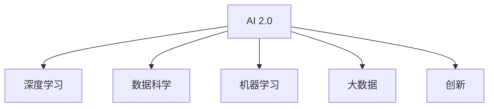

                 

# 李开复：AI 2.0 时代的挑战

> 关键词：AI 2.0, 人工智能, 数据科学, 深度学习, 技术挑战, 机器学习, 大数据, 创新, 技术应用

## 1. 背景介绍

### 1.1 问题由来
随着人工智能(AI)技术的飞速发展，我们正步入AI 2.0时代，这个时代的特点是AI技术在各个领域的应用越来越深入，AI不再只是科研人员的“玩具”，而是变得触手可及，成为各行各业的利器。但随之而来的，是前所未有的技术挑战和伦理困境。本文将从技术层面和伦理维度全面剖析AI 2.0时代的挑战，探讨如何应对这些挑战，推动AI技术的健康发展。

### 1.2 问题核心关键点
AI 2.0时代，我们面临的核心挑战包括但不限于：数据隐私保护、算法透明性、安全性、伦理决策和可解释性等。如何确保AI技术的负责任和公正使用，同时推动其技术进步，成为社会各界共同关注的话题。

## 2. 核心概念与联系

### 2.1 核心概念概述

为更好地理解AI 2.0时代的挑战，本节将介绍几个关键概念：

- AI 2.0: 人工智能发展的第二阶段，强调AI在各行业中的应用和普及。相比于AI 1.0（以科学研究和技术探索为主），AI 2.0更注重实际应用和用户体验。
- 深度学习(Deep Learning): 一种基于人工神经网络的机器学习技术，通过多层次的非线性变换，可以实现对复杂模式的学习和预测。
- 数据科学(Data Science): 一门综合性的学科，包括数据收集、数据处理、数据分析和数据可视化等多个环节，为AI模型训练提供数据支持。
- 机器学习(Machine Learning): 使计算机系统能够通过数据学习和优化，以完成特定任务的技术。
- 大数据(Big Data): 指规模庞大、结构复杂、速度快且来源多样的数据集，为AI模型提供数据支撑。
- 创新(Innovation): 通过新技术、新理念和新方法，推动AI技术的发展和应用。

这些核心概念之间的逻辑关系可以通过以下Mermaid流程图来展示：



这个流程图展示了这个时代AI的各个关键组件：

1. AI 2.0为AI应用提供了目标和方向。
2. 深度学习是实现AI的核心技术手段。
3. 数据科学为深度学习提供了数据和算法支持。
4. 机器学习是深度学习的具体实现。
5. 大数据为深度学习提供了数据来源。
6. 创新推动了AI技术的进步和应用。

## 3. 核心算法原理 & 具体操作步骤
### 3.1 算法原理概述

AI 2.0时代的核心算法原理在于深度学习和大数据的结合，通过大量的数据输入，训练出复杂的神经网络模型，从而实现对复杂模式的学习和预测。其核心步骤包括数据准备、模型设计、模型训练和模型评估。

### 3.2 算法步骤详解

AI 2.0时代深度学习模型的训练一般包括以下几个关键步骤：

**Step 1: 数据准备**
- 收集和清洗数据集，确保数据质量。
- 数据预处理，包括数据编码、归一化等。

**Step 2: 模型设计**
- 选择合适的深度学习模型架构，如卷积神经网络(CNN)、循环神经网络(RNN)、Transformer等。
- 设定模型的超参数，如学习率、批量大小、迭代轮数等。

**Step 3: 模型训练**
- 将数据集分成训练集、验证集和测试集。
- 使用随机梯度下降(Stochastic Gradient Descent, SGD)等优化算法，最小化损失函数。
- 模型在每个epoch迭代过程中，前向传播计算预测值，反向传播计算梯度。

**Step 4: 模型评估**
- 使用测试集对模型进行评估，计算准确率、精确率、召回率等指标。
- 调整模型参数，以提升模型性能。

### 3.3 算法优缺点

AI 2.0时代的深度学习模型具有以下优点：
1. 数据驱动：依赖大量数据进行训练，能够学习复杂的模式和规律。
2. 泛化能力强：在大规模数据集上进行预训练后，能够对新数据进行泛化。
3. 应用广泛：广泛应用于图像识别、语音识别、自然语言处理等多个领域。
4. 创新快速：随着研究进展，深度学习模型不断更新，应用领域不断扩展。

同时，该模型也存在一定的局限性：
1. 数据依赖：需要大量标注数据，且标注成本高。
2. 模型复杂：模型结构复杂，训练时间长，计算资源需求高。
3. 泛化性差：在小规模数据集上性能不稳定，容易出现过拟合。
4. 解释性差：深度学习模型通常是“黑盒”系统，难以解释其内部机制。

### 3.4 算法应用领域

AI 2.0时代的深度学习模型已经在多个领域得到应用，例如：

- 医疗诊断：通过图像识别技术，帮助医生进行疾病诊断和治疗方案选择。
- 自动驾驶：利用计算机视觉技术，实现对道路环境的感知和决策。
- 自然语言处理：通过语言模型和生成技术，实现自动翻译、文本摘要、问答系统等。
- 金融风控：利用机器学习技术，进行风险评估、信用评分等。
- 智能制造：通过图像识别技术，优化生产流程，提高产品质量和效率。

除了上述这些经典应用外，AI 2.0技术还在更多领域得到应用，如智能家居、智慧城市、智能教育等，为各行各业带来变革性影响。

## 4. 数学模型和公式 & 详细讲解 & 举例说明
### 4.1 数学模型构建

本节将使用数学语言对AI 2.0时代的深度学习模型进行更加严格的刻画。

记深度学习模型为 $M_{\theta}$，其中 $\theta$ 为模型参数。假设训练集为 $D=\{(x_i,y_i)\}_{i=1}^N$，$x_i$ 为输入，$y_i$ 为输出标签。

定义模型 $M_{\theta}$ 在输入 $x$ 上的预测为 $y^{\hat}=M_{\theta}(x)$。在训练过程中，模型的目标是最小化预测值与真实标签之间的误差，即损失函数 $\ell(M_{\theta}(x),y)$。常用的损失函数包括均方误差损失、交叉熵损失等。

### 4.2 公式推导过程

以交叉熵损失函数为例，推导其在二分类问题下的具体形式。

假设模型在输入 $x$ 上的预测为 $\hat{y} \in [0,1]$，表示样本属于正类的概率。真实标签 $y \in \{0,1\}$。则二分类交叉熵损失函数定义为：

$$
\ell(M_{\theta}(x),y) = -[y\log \hat{y} + (1-y)\log(1-\hat{y})]
$$

将其代入损失函数，得：

$$
\mathcal{L}(\theta) = -\frac{1}{N}\sum_{i=1}^N [y_i\log M_{\theta}(x_i)+(1-y_i)\log(1-M_{\theta}(x_i))]
$$

通过反向传播算法，可以计算出参数 $\theta$ 的梯度，从而进行模型参数的更新。

### 4.3 案例分析与讲解

以图像识别任务为例，解释深度学习模型的训练过程。

首先，准备图像数据集，并对图片进行预处理，如归一化、缩放等。然后，使用卷积神经网络(CNN)作为模型架构，设定超参数。接着，将数据集分为训练集、验证集和测试集，使用随机梯度下降等优化算法，最小化交叉熵损失函数。在每个epoch迭代过程中，模型对每个训练样本进行前向传播和反向传播，计算梯度并更新模型参数。最后，使用测试集对模型进行评估，根据评估结果调整模型参数，以提升模型性能。

## 5. 项目实践：代码实例和详细解释说明
### 5.1 开发环境搭建

在进行深度学习模型训练前，我们需要准备好开发环境。以下是使用Python进行TensorFlow开发的环境配置流程：

1. 安装Anaconda：从官网下载并安装Anaconda，用于创建独立的Python环境。

2. 创建并激活虚拟环境：
```bash
conda create -n tf-env python=3.8 
conda activate tf-env
```

3. 安装TensorFlow：从官网获取对应的安装命令。例如：
```bash
pip install tensorflow-gpu==2.4.1
```

4. 安装TensorFlow Addons：扩展TensorFlow功能，支持更复杂的模型和算法。
```bash
pip install tensorflow-addons
```

5. 安装各类工具包：
```bash
pip install numpy pandas scikit-learn matplotlib tqdm jupyter notebook ipython
```

完成上述步骤后，即可在`tf-env`环境中开始深度学习模型的训练和评估。

### 5.2 源代码详细实现

这里我们以图像识别任务为例，给出使用TensorFlow进行卷积神经网络(CNN)训练的Python代码实现。

首先，准备图像数据集：

```python
import os
import cv2
import numpy as np
from tensorflow.keras.preprocessing.image import ImageDataGenerator

train_dir = 'train'
val_dir = 'val'

train_datagen = ImageDataGenerator(rescale=1./255, shear_range=0.2, zoom_range=0.2, horizontal_flip=True)
val_datagen = ImageDataGenerator(rescale=1./255)

train_generator = train_datagen.flow_from_directory(train_dir, target_size=(224, 224), batch_size=32, class_mode='binary')
val_generator = val_datagen.flow_from_directory(val_dir, target_size=(224, 224), batch_size=32, class_mode='binary')
```

然后，定义CNN模型：

```python
from tensorflow.keras.models import Sequential
from tensorflow.keras.layers import Conv2D, MaxPooling2D, Flatten, Dense

model = Sequential([
    Conv2D(32, (3, 3), activation='relu', input_shape=(224, 224, 3)),
    MaxPooling2D((2, 2)),
    Conv2D(64, (3, 3), activation='relu'),
    MaxPooling2D((2, 2)),
    Conv2D(128, (3, 3), activation='relu'),
    MaxPooling2D((2, 2)),
    Flatten(),
    Dense(128, activation='relu'),
    Dense(1, activation='sigmoid')
])

model.compile(optimizer='adam', loss='binary_crossentropy', metrics=['accuracy'])
```

接着，进行模型训练：

```python
epochs = 10

history = model.fit(
    train_generator,
    validation_data=val_generator,
    steps_per_epoch=train_generator.n // train_generator.batch_size,
    validation_steps=val_generator.n // val_generator.batch_size,
    epochs=epochs,
    verbose=2
)

score = model.evaluate(val_generator, steps=val_generator.n // val_generator.batch_size, verbose=0)
print('Test loss:', score[0])
print('Test accuracy:', score[1])
```

以上代码实现了使用CNN对图像数据集进行二分类训练的过程。通过设置不同的卷积层和全连接层，调整超参数，可以优化模型性能。

### 5.3 代码解读与分析

让我们再详细解读一下关键代码的实现细节：

**ImageDataGenerator类**：
- 该类用于对图像数据进行预处理，如缩放、旋转、翻转等。
- 在训练过程中，生成批量的训练样本和标签，并进行数据增强。

**Sequential模型**：
- 该类用于构建序列化模型，可以方便地定义模型结构。
- 通过添加卷积层、池化层、全连接层等组件，构建CNN模型。

**模型训练流程**：
- 使用fit方法对模型进行训练，设定训练轮数和批大小。
- 在每个epoch迭代过程中，使用生成器生成批量的训练数据和标签，进行前向传播和反向传播。
- 周期性在验证集上评估模型性能，根据评估结果调整模型参数。
- 重复上述过程直至满足预设的训练轮数或提前停止条件。

**模型评估流程**：
- 使用evaluate方法对模型在测试集上进行评估，计算准确率等指标。
- 输出测试集上的损失和准确率。

可以看到，TensorFlow框架配合ImageDataGenerator类和Sequential模型，使得深度学习模型的训练和评估变得简洁高效。开发者可以将更多精力放在数据处理、模型改进等高层逻辑上，而不必过多关注底层的实现细节。

当然，工业级的系统实现还需考虑更多因素，如模型的保存和部署、超参数的自动搜索、更灵活的模型架构等。但核心的深度学习训练过程基本与此类似。

## 6. 实际应用场景
### 6.1 智能制造

深度学习在智能制造领域的应用，主要体现在生产过程的优化和产品质量的提升。通过图像识别技术，可以实现对生产线的监控和分析，及时发现和处理问题。

具体而言，可以利用深度学习模型对生产过程中的图像数据进行实时分析，检测机器故障、原材料缺陷等异常情况。通过机器学习技术，对生产数据进行建模分析，预测生产效率和质量，优化生产流程。

### 6.2 智能家居

深度学习在智能家居领域的应用，主要体现在语音识别、图像识别和自然语言处理等方面。通过智能音箱、智能摄像头等设备，实现对家居环境的自动化控制和智能化管理。

具体而言，可以构建语音识别模型，实现语音命令的自动识别和执行。通过图像识别技术，实现对家居环境的感知和理解。通过自然语言处理技术，实现对用户的意图理解和自然对话。

### 6.3 智慧城市

深度学习在智慧城市领域的应用，主要体现在城市事件监测、交通管理、环境保护等方面。通过智能摄像头、传感器等设备，实现对城市环境的感知和分析。

具体而言，可以利用深度学习模型对城市摄像头拍摄的视频进行实时分析，检测异常情况，如火灾、交通事故等。通过交通监控摄像头，实现对交通流量的分析和预测。通过环境传感器，实现对空气质量、水质等的监测和预警。

### 6.4 未来应用展望

随着深度学习技术的不断进步，未来其在AI 2.0时代的应用前景更加广阔。以下是对未来应用的几点展望：

1. 医疗影像分析：利用深度学习技术，对医学影像进行自动分析和诊断，提升医疗效率和准确性。
2. 智能客服：通过深度学习技术，构建智能客服系统，提升客户体验和服务效率。
3. 金融风控：利用深度学习技术，对金融数据进行分析和预测，提升风险评估和投资决策的准确性。
4. 智能推荐：通过深度学习技术，构建推荐系统，提升用户满意度和业务转化率。
5. 自动驾驶：利用深度学习技术，实现自动驾驶汽车的感知和决策，提升交通安全和效率。

## 7. 工具和资源推荐
### 7.1 学习资源推荐

为了帮助开发者系统掌握深度学习技术的理论基础和实践技巧，这里推荐一些优质的学习资源：

1. 《深度学习》系列书籍：由Ian Goodfellow等作者合著，全面介绍了深度学习的基本原理和应用。
2. 《TensorFlow官方文档》：TensorFlow官方文档，提供了丰富的教程和示例代码，是TensorFlow入门的必备资料。
3. 《PyTorch官方文档》：PyTorch官方文档，提供了丰富的教程和示例代码，是PyTorch入门的必备资料。
4. 《机器学习实战》系列书籍：由Peter Harrington著，提供了多个实际案例，帮助读者深入理解机器学习算法的实现和应用。
5. 《Kaggle数据科学竞赛》：Kaggle平台提供了大量公开数据集和竞赛，是学习数据科学和机器学习的实战平台。

通过对这些资源的学习实践，相信你一定能够快速掌握深度学习技术的精髓，并用于解决实际的AI应用问题。

### 7.2 开发工具推荐

高效的开发离不开优秀的工具支持。以下是几款用于深度学习模型训练开发的常用工具：

1. TensorFlow：由Google主导开发的深度学习框架，支持分布式训练和生产部署。
2. PyTorch：由Facebook主导开发的深度学习框架，动态计算图设计，适合快速迭代研究。
3. Keras：基于TensorFlow和Theano等后端框架的高层次API，易于上手和使用。
4. Jupyter Notebook：开源的交互式笔记本，支持多种编程语言，方便编写和执行代码。
5. Anaconda：开源的数据科学平台，提供科学计算的众多工具和环境，适合数据科学项目的开发。

合理利用这些工具，可以显著提升深度学习模型训练的开发效率，加快创新迭代的步伐。

### 7.3 相关论文推荐

深度学习技术的发展离不开学界的持续研究。以下是几篇奠基性的相关论文，推荐阅读：

1. AlexNet: ImageNet分类（2012）：提出AlexNet模型，标志着深度学习在计算机视觉领域的突破。
2. VGGNet: Visual Geometry Group（2014）：提出VGGNet模型，展示了卷积神经网络的多层架构和参数重要性。
3. GoogLeNet: Inception（2014）：提出Inception模块，展示了卷积神经网络的参数压缩和计算效率。
4. ResNet: Deep Residual Learning（2015）：提出ResNet模型，解决了深度神经网络的退化问题，提高了深度网络的训练效率和性能。
5. Attention is All You Need（2017）：提出Transformer模型，展示了注意力机制在自然语言处理中的应用。

这些论文代表了大数据时代的深度学习技术的发展脉络。通过学习这些前沿成果，可以帮助研究者把握学科前进方向，激发更多的创新灵感。

## 8. 总结：未来发展趋势与挑战
### 8.1 研究成果总结

AI 2.0时代的深度学习技术，已经在各个领域取得了显著的进展和应用。通过大规模数据集进行预训练，构建了强大的神经网络模型，实现了对复杂模式的学习和预测。在实际应用中，深度学习技术已经展示了其在医疗、智能制造、智能家居、智慧城市等领域的巨大潜力。

### 8.2 未来发展趋势

未来，深度学习技术将在以下几个方面取得新的突破：

1. 多模态学习：将视觉、语音、文本等多种模态的信息进行融合，实现更全面、更准确的模式识别。
2. 自监督学习：利用未标注数据进行自我监督学习，减少对标注数据的依赖。
3. 联邦学习：在分布式系统中，通过模型参数的共享和更新，实现本地数据的协同学习。
4. 迁移学习：将在大规模数据集上预训练的模型迁移到小规模数据集上，实现快速的模型迁移。
5. 因果推理：利用因果分析方法，实现对模型决策过程的解释和理解。

### 8.3 面临的挑战

尽管深度学习技术已经取得了瞩目成就，但在迈向更加智能化、普适化应用的过程中，它仍面临诸多挑战：

1. 数据隐私保护：深度学习模型需要大量的数据进行训练，如何保护用户隐私和数据安全，是一个重要的问题。
2. 算法透明性：深度学习模型通常是“黑盒”系统，难以解释其内部机制，如何提高算法的透明性和可解释性，将是一个关键问题。
3. 安全性：深度学习模型容易受到对抗样本攻击，如何提高模型的鲁棒性和安全性，是一个需要解决的问题。
4. 伦理决策：深度学习模型在医疗、金融等领域的应用，如何确保其决策的公正性和伦理合理性，是一个重要的研究方向。
5. 计算资源：深度学习模型需要大量的计算资源进行训练和推理，如何提高计算效率，降低计算成本，是一个需要解决的问题。

### 8.4 研究展望

面向未来，深度学习技术的进一步发展需要在以下几个方面进行深入探索：

1. 跨领域融合：将深度学习技术与自然语言处理、计算机视觉、语音识别等多领域技术进行融合，实现更全面、更智能的应用。
2. 实时化应用：将深度学习技术应用于实时化的场景，如智能客服、自动驾驶等，实现更高效、更精准的服务。
3. 可解释性研究：利用因果分析、可视化等方法，提高深度学习模型的可解释性，增强用户的信任和接受度。
4. 自适应学习：构建自适应学习系统，实现对数据分布变化和用户需求的动态适应。
5. 跨模态融合：将视觉、语音、文本等多种模态的信息进行融合，实现更全面、更准确的模式识别。

## 9. 附录：常见问题与解答

**Q1: 深度学习在实际应用中需要注意哪些问题？**

A: 深度学习在实际应用中需要注意以下几个问题：

1. 数据准备：需要大量的标注数据进行训练，标注成本较高。需要确保数据质量，避免数据偏差和噪音。
2. 模型选择：选择合适的模型架构和超参数，避免过拟合和欠拟合。
3. 计算资源：深度学习模型需要大量的计算资源进行训练和推理，需要合理规划资源，提高计算效率。
4. 模型部署：将训练好的模型部署到实际应用中，需要考虑模型的保存和加载、服务化封装、弹性伸缩等问题。
5. 可解释性：深度学习模型通常是“黑盒”系统，难以解释其内部机制。需要考虑模型的可解释性和可审计性，确保模型的公正性和透明性。

**Q2: 如何提高深度学习模型的泛化能力？**

A: 提高深度学习模型的泛化能力，可以采取以下几个策略：

1. 数据增强：通过旋转、翻转、裁剪等技术，扩充训练集，增加数据多样性。
2. 正则化：使用L2正则、Dropout等技术，防止过拟合。
3. 模型集成：将多个模型的预测结果进行融合，提高模型的鲁棒性和泛化能力。
4. 对抗训练：使用对抗样本进行训练，提高模型的鲁棒性和泛化能力。
5. 迁移学习：在相关领域的数据集上预训练模型，提高模型的泛化能力和迁移能力。

**Q3: 深度学习模型的可解释性有哪些方法？**

A: 深度学习模型的可解释性可以通过以下几个方法实现：

1. 可视化技术：利用可视化工具，展示模型的特征提取过程和决策路径。
2. 局部可解释性方法：通过解释单个样本的预测结果，理解模型在特定输入下的行为。
3. 全局可解释性方法：通过解释模型整体的决策过程，理解模型的全局行为和特征重要性。
4. 模型简化：通过剪枝、降维等技术，简化模型结构，提高模型的可解释性。

**Q4: 深度学习在智能制造中的应用前景如何？**

A: 深度学习在智能制造中的应用前景非常广阔，可以体现在以下几个方面：

1. 质量检测：利用深度学习技术，对生产过程中的图像数据进行实时分析，检测机器故障、原材料缺陷等异常情况。
2. 预测维护：利用深度学习技术，对生产数据进行建模分析，预测设备故障和维护需求。
3. 智能调度：利用深度学习技术，优化生产流程，提高生产效率和资源利用率。
4. 人机协作：利用深度学习技术，实现机器人与人工的协同工作，提升生产效率和质量。

**Q5: 深度学习在智能家居中的应用前景如何？**

A: 深度学习在智能家居中的应用前景非常广阔，可以体现在以下几个方面：

1. 语音识别：利用深度学习技术，实现语音命令的自动识别和执行。
2. 图像识别：利用深度学习技术，实现对家居环境的感知和理解。
3. 自然语言处理：利用深度学习技术，实现对用户的意图理解和自然对话。
4. 自动化控制：利用深度学习技术，实现对家居设备的自动化控制和智能化管理。

---

作者：禅与计算机程序设计艺术 / Zen and the Art of Computer Programming

