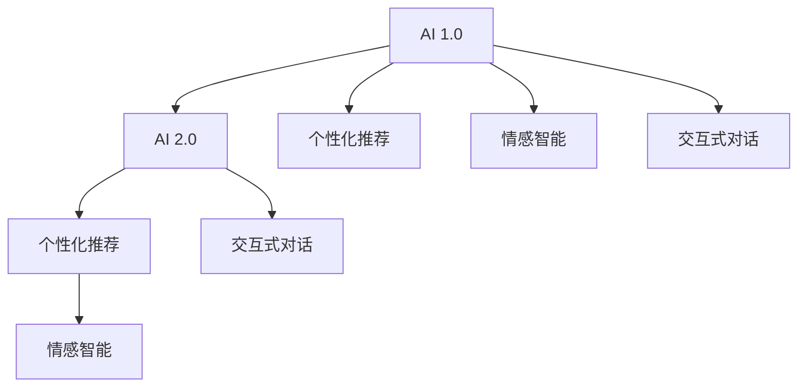

                 

# 李开复：AI 2.0 时代的未来

## 1. 背景介绍

随着人工智能（AI）技术的飞速发展，我们正处于一个全新的人工智能时代——AI 2.0。这个时代的核心特征是从以机器为中心的AI 1.0向以人类为中心的AI 2.0转变。本文将探讨AI 2.0时代的未来，包括其发展趋势、核心技术、应用场景以及对人类社会的影响。

## 2. 核心概念与联系

### 2.1 核心概念概述

为了更好地理解AI 2.0，我们需要明确一些关键概念及其之间的联系：

- **AI 1.0**：以机器为中心的时期，AI主要通过算法和模型来完成任务，如图像识别、自然语言处理、语音识别等。
- **AI 2.0**：以人类为中心的时期，AI技术将更加注重人类的需求和体验，如个性化推荐、情感智能、交互式对话等。
- **个性化推荐**：根据用户的历史行为和偏好，推荐符合其兴趣的内容，如商品、新闻、视频等。
- **情感智能**：AI系统能够识别和理解人类的情感，并提供个性化的情感反馈，如情感聊天机器人、心理咨询机器人等。
- **交互式对话**：AI系统能够进行自然、流畅的对话，提供即时的互动体验，如智能客服、虚拟助手等。

这些概念之间的关系可以用以下Mermaid流程图来表示：



## 3. 核心算法原理 & 具体操作步骤

### 3.1 算法原理概述

AI 2.0时代的核心算法原理包括深度学习、强化学习、生成对抗网络（GAN）等。其中，深度学习是最基础和核心的技术，通过多层神经网络对复杂数据进行建模和预测。强化学习则通过试错机制，让AI系统在特定环境中逐步优化决策策略。GAN则通过生成对抗的方式，生成逼真的数据和图像，用于图像生成、风格转换等任务。

### 3.2 算法步骤详解

以下是AI 2.0时代几个核心算法的操作步骤：

**深度学习**：
1. **数据准备**：收集并预处理训练数据，将其转化为神经网络的输入。
2. **模型设计**：选择合适的网络结构（如卷积神经网络CNN、循环神经网络RNN、变压器Transformer等），并进行超参数调优。
3. **模型训练**：使用随机梯度下降（SGD）等优化算法，通过反向传播更新模型参数。
4. **模型评估**：在测试集上评估模型的性能，选择最佳模型进行应用。

**强化学习**：
1. **环境设计**：定义AI系统的环境，包括状态、动作、奖励等。
2. **策略设计**：设计强化学习算法（如Q-learning、Deep Q-learning等），选择合适的策略更新方法。
3. **训练**：在环境中不断试错，通过累计奖励最大化训练模型。
4. **应用**：将训练好的模型应用于实际场景中，进行决策和控制。

**生成对抗网络（GAN）**：
1. **生成器设计**：设计生成器网络，能够生成逼真的数据和图像。
2. **判别器设计**：设计判别器网络，能够区分真实数据和生成数据。
3. **训练**：通过对抗的方式，让生成器和判别器不断优化，生成逼真的数据和图像。
4. **应用**：生成逼真的数据和图像，用于图像生成、图像修复等任务。

### 3.3 算法优缺点

**深度学习的优点**：
- **学习能力强大**：能够处理复杂的非线性问题，如图像、语音、自然语言等。
- **自动化程度高**：通过深度学习模型自动提取特征，减少了人工设计特征的工作量。

**深度学习的缺点**：
- **数据依赖性强**：需要大量的标注数据进行训练，数据收集和标注成本较高。
- **模型复杂度高**：网络结构复杂，需要大量的计算资源进行训练和推理。

**强化学习的优点**：
- **适应性强**：能够处理动态变化的环境，通过试错逐步优化策略。
- **鲁棒性强**：能够在复杂环境中取得较好的性能，避免过拟合。

**强化学习的缺点**：
- **训练时间较长**：需要大量的试错和调整，训练时间较长。
- **策略选择困难**：在复杂环境中，找到最优策略难度较大。

**GAN的优点**：
- **生成效果逼真**：生成的数据和图像逼真度较高，能够应用于图像生成、图像修复等任务。
- **技术应用广泛**：应用于图像、视频、音频等多个领域，前景广阔。

**GAN的缺点**：
- **模型训练不稳定**：生成器和判别器之间的对抗容易导致训练不稳定。
- **数据依赖性强**：生成效果受输入数据影响较大，对数据质量要求较高。

### 3.4 算法应用领域

AI 2.0技术在各个领域都有广泛的应用，包括医疗、金融、教育、娱乐等。以下是几个典型的应用场景：

- **医疗领域**：通过AI技术进行疾病诊断、医疗影像分析、个性化治疗等，提高医疗服务的效率和准确性。
- **金融领域**：应用AI进行风险控制、投资策略优化、客户行为分析等，提升金融服务的智能化水平。
- **教育领域**：利用AI进行个性化教学、智能评估、学习内容推荐等，改善教育体验。
- **娱乐领域**：通过AI技术进行内容推荐、情感分析、交互式对话等，提升用户体验。

## 4. 数学模型和公式 & 详细讲解

### 4.1 数学模型构建

AI 2.0时代的多数算法都建立在深度学习模型之上，其核心数学模型包括神经网络、卷积神经网络（CNN）、循环神经网络（RNN）、变压器（Transformer）等。以下以Transformer为例，介绍其数学模型的构建。

Transformer的数学模型如下：

$$
\text{Encoder} = \text{Self-Attention} + \text{Feed Forward} \\
\text{Decoder} = \text{Self-Attention} + \text{Feed Forward} + \text{Attention}
$$

其中，Self-Attention和Feed Forward是Transformer的基本组件。

### 4.2 公式推导过程

以Transformer模型为例，其自注意力机制的公式推导如下：

$$
\text{Query} = \text{W}_Q \cdot \text{X} \\
\text{Key} = \text{W}_K \cdot \text{X} \\
\text{Value} = \text{W}_V \cdot \text{X}
$$

其中，X为输入向量，W_Q、W_K、W_V为三个线性变换矩阵。

### 4.3 案例分析与讲解

以机器翻译为例，Transformer模型的自注意力机制能够捕捉到输入和输出之间的依赖关系，从而实现高效的翻译。

## 5. 项目实践：代码实例和详细解释说明

### 5.1 开发环境搭建

在进行AI 2.0项目实践前，我们需要准备好开发环境。以下是使用Python进行TensorFlow开发的环境配置流程：

1. 安装Anaconda：从官网下载并安装Anaconda，用于创建独立的Python环境。

2. 创建并激活虚拟环境：
```bash
conda create -n tf-env python=3.8 
conda activate tf-env
```

3. 安装TensorFlow：根据CUDA版本，从官网获取对应的安装命令。例如：
```bash
conda install tensorflow -c pytorch -c conda-forge
```

4. 安装各类工具包：
```bash
pip install numpy pandas scikit-learn matplotlib tqdm jupyter notebook ipython
```

完成上述步骤后，即可在`tf-env`环境中开始AI 2.0实践。

### 5.2 源代码详细实现

这里我们以自然语言生成为例，给出使用TensorFlow对GPT模型进行训练的代码实现。

首先，定义数据处理函数：

```python
import tensorflow as tf

class DataProcessor:
    def __init__(self, data_path):
        self.data = []
        self.tokenizer = tf.keras.layers.experimental.preprocessing.TextVectorization(max_tokens=512)
        self.tokenizer.adapt(data)
        
    def __len__(self):
        return len(self.data)
    
    def __getitem__(self, item):
        text = self.data[item]
        tokens = self.tokenizer(text, padding='max_length', truncation=True)
        return {'text': text, 'tokens': tokens}
```

然后，定义模型和优化器：

```python
from transformers import TFGPTModel

model = TFGPTModel.from_pretrained('gpt-2', output_attentions=True)
optimizer = tf.keras.optimizers.Adam(learning_rate=2e-5)

# 定义损失函数
def compute_loss(labels, logits):
    loss = tf.keras.losses.sparse_categorical_crossentropy(labels, logits, from_logits=True)
    return loss

# 定义训练函数
def train_step(model, optimizer, data):
    model.train()
    for text in data:
        with tf.GradientTape() as tape:
            tokens = model.tokenizer(text['tokens'])
            logits = model(tokens)
            loss = compute_loss(text['labels'], logits)
        grads = tape.gradient(loss, model.trainable_variables)
        optimizer.apply_gradients(zip(grads, model.trainable_variables))
```

最后，启动训练流程：

```python
epochs = 5
batch_size = 16

for epoch in range(epochs):
    for batch in tf.data.Dataset.from_generator(lambda: train_dataset, ('text', 'tokens'), output_type=tf.int64):
        train_step(model, optimizer, batch)
```

以上就是使用TensorFlow对GPT模型进行自然语言生成的完整代码实现。可以看到，TensorFlow提供了强大的计算图能力，使得模型训练和推理变得简单高效。

### 5.3 代码解读与分析

让我们再详细解读一下关键代码的实现细节：

**DataProcessor类**：
- `__init__`方法：初始化数据集和分词器，适应数据集。
- `__len__`方法：返回数据集的样本数量。
- `__getitem__`方法：对单个样本进行处理，将文本输入转换为分词后的token序列。

**模型和优化器**：
- `compute_loss`方法：计算损失函数，使用交叉熵损失。
- `train_step`方法：进行模型训练，使用Adam优化器更新模型参数。

**训练流程**：
- 定义总的epoch数和batch size，开始循环迭代
- 每个epoch内，循环遍历训练数据集，在每个batch上执行模型训练
- 使用GradientTape记录梯度，使用Adam优化器更新模型参数

可以看到，TensorFlow使得GPT模型的自然语言生成实践变得简洁高效。开发者可以将更多精力放在数据处理、模型改进等高层逻辑上，而不必过多关注底层的实现细节。

当然，工业级的系统实现还需考虑更多因素，如模型的保存和部署、超参数的自动搜索、更灵活的任务适配层等。但核心的AI 2.0算法基本与此类似。

## 6. 实际应用场景

### 6.1 医疗影像分析

AI 2.0技术在医疗影像分析领域有着广泛的应用。通过AI技术，可以对医学影像进行自动诊断和分析，提高诊断效率和准确性。例如，利用卷积神经网络（CNN）对X光片、CT、MRI等医学影像进行分类、分割和标注，辅助医生进行诊断。

### 6.2 智能客服

基于AI 2.0技术的智能客服系统，能够理解自然语言，进行自然对话，解决用户的问题。例如，利用深度学习模型和自然语言处理技术，智能客服可以提供24/7的咨询服务，减轻人工客服的负担，提升用户体验。

### 6.3 个性化推荐

AI 2.0技术可以应用于个性化推荐系统，通过用户的历史行为和偏好，推荐符合其兴趣的内容。例如，利用协同过滤和深度学习模型，推荐系统可以为用户推荐商品、新闻、视频等，提升用户满意度。

### 6.4 未来应用展望

随着AI 2.0技术的不断进步，未来将有更多创新应用涌现。例如：

- **自动化驾驶**：通过AI技术实现无人驾驶，提高交通安全和效率。
- **智慧城市**：利用AI技术进行城市管理、交通控制、环境监测等，提升城市智能化水平。
- **个性化健康管理**：利用AI技术进行健康监测、疾病预测、个性化治疗等，提升生活质量。

## 7. 工具和资源推荐

### 7.1 学习资源推荐

为了帮助开发者系统掌握AI 2.0的理论基础和实践技巧，这里推荐一些优质的学习资源：

1. **《深度学习》系列书籍**：如《深度学习》、《深度学习：入门与实践》等，帮助读者全面理解深度学习的原理和应用。
2. **Google Deep Learning Course**：谷歌提供的深度学习课程，涵盖深度学习基础、卷积神经网络、循环神经网络等内容。
3. **Kaggle**：数据科学和机器学习竞赛平台，提供丰富的数据集和实践机会，促进学习者技能提升。
4. **PyTorch官方文档**：PyTorch官方文档提供了全面的深度学习框架介绍和使用指南，适合深入学习。
5. **TensorFlow官方文档**：TensorFlow官方文档提供了完整的深度学习框架介绍和API文档，适合生产环境使用。

通过对这些资源的学习实践，相信你一定能够快速掌握AI 2.0的精髓，并用于解决实际的AI应用问题。

### 7.2 开发工具推荐

高效的开发离不开优秀的工具支持。以下是几款用于AI 2.0开发的常用工具：

1. **PyTorch**：基于Python的开源深度学习框架，灵活动态的计算图，适合快速迭代研究。
2. **TensorFlow**：由谷歌主导开发的开源深度学习框架，生产部署方便，适合大规模工程应用。
3. **Jupyter Notebook**：开源的交互式开发环境，支持Python、R等多种编程语言，适合学术研究和工程实践。
4. **Git**：版本控制系统，支持多人协作开发，便于代码管理和共享。
5. **Docker**：容器化技术，支持将AI应用打包成容器，便于部署和扩展。

合理利用这些工具，可以显著提升AI 2.0开发的效率，加快创新迭代的步伐。

### 7.3 相关论文推荐

AI 2.0技术的发展源于学界的持续研究。以下是几篇奠基性的相关论文，推荐阅读：

1. **《ImageNet Classification with Deep Convolutional Neural Networks》**：AlexNet论文，首次证明了深度卷积神经网络在图像分类任务中的有效性。
2. **《Speech and Language Processing》**：自然语言处理领域的经典教材，介绍了NLP的基本概念和技术。
3. **《Generative Adversarial Nets》**：GAN的奠基性论文，首次提出了生成对抗网络的概念。
4. **《Attention is All You Need》**：Transformer论文，提出了基于自注意力机制的Transformer模型，开启了NLP领域的预训练大模型时代。
5. **《Deep Learning for NLP》**：自然语言处理领域的深度学习综述，介绍了NLP中的深度学习技术。

这些论文代表了大规模人工智能技术的发展脉络。通过学习这些前沿成果，可以帮助研究者把握学科前进方向，激发更多的创新灵感。

## 8. 总结：未来发展趋势与挑战

### 8.1 研究成果总结

AI 2.0技术在各个领域都取得了显著的进展，已经成为推动社会进步的重要力量。以下是几个重要的研究成果：

- **深度学习**：通过深度神经网络，实现了图像识别、自然语言处理、语音识别等任务的高精度和高效率。
- **强化学习**：通过试错机制，提高了AI系统在复杂环境中的决策能力，应用于自动驾驶、游戏AI等领域。
- **生成对抗网络（GAN）**：通过生成对抗的方式，实现了逼真的图像和视频生成，应用于图像修复、风格转换等领域。

### 8.2 未来发展趋势

展望未来，AI 2.0技术将呈现以下几个发展趋势：

- **模型规模持续增大**：随着算力成本的下降和数据规模的扩张，预训练语言模型的参数量还将持续增长。超大规模语言模型蕴含的丰富语言知识，有望支撑更加复杂多变的下游任务。
- **迁移学习成为主流**：迁移学习将成为AI 2.0的核心技术之一，通过在大规模语料上进行预训练，在特定任务上进行微调，提高模型的泛化能力和迁移能力。
- **多模态学习兴起**：未来AI 2.0技术将不仅仅限于单一模态数据，将融合图像、语音、文本等多种数据，提升模型的综合表现。
- **弱监督学习得到重视**：相对于全监督学习，弱监督学习在标注成本较低的情况下，能够取得更好的效果，未来将得到更多应用。
- **边缘计算普及**：随着5G和IoT技术的发展，AI 2.0技术将更多地应用于边缘计算，提升实时性和响应速度。

### 8.3 面临的挑战

尽管AI 2.0技术取得了巨大的进展，但在迈向更加智能化、普适化应用的过程中，仍然面临一些挑战：

- **数据隐私和安全**：AI 2.0系统需要处理大量的个人数据，如何保护数据隐私和安全，防止数据泄露和滥用，是一个重要的问题。
- **模型公平性**：AI 2.0系统可能会学习到有偏见的数据，如何设计公平的算法，避免歧视性输出，是一个需要解决的问题。
- **技术壁垒**：AI 2.0技术涉及复杂的算法和模型，如何降低技术壁垒，普及AI技术，是一个需要解决的问题。
- **计算资源**：AI 2.0技术需要大量的计算资源进行训练和推理，如何降低计算成本，提高效率，是一个需要解决的问题。
- **人机交互**：AI 2.0系统需要与人类进行自然、流畅的交互，如何设计更好的人机界面，提升用户体验，是一个需要解决的问题。

### 8.4 研究展望

面对AI 2.0技术所面临的种种挑战，未来的研究需要在以下几个方面寻求新的突破：

- **多模态融合**：将视觉、语音、文本等多种数据融合，提升模型的综合表现。
- **弱监督学习**：在标注成本较低的情况下，设计更好的弱监督学习算法，提高模型性能。
- **可解释性**：如何提高AI系统的可解释性，让人们理解AI的决策过程，是一个重要的研究方向。
- **隐私保护**：如何在保证AI系统性能的同时，保护用户数据隐私，防止数据滥用，是一个重要的研究方向。
- **公平性算法**：如何设计公平、无偏的算法，避免歧视性输出，是一个重要的研究方向。

总之，AI 2.0技术需要在算法、模型、数据、应用等多个维度进行全面优化，才能实现更加智能化、普适化的应用。只有不断创新、突破技术瓶颈，才能让AI 2.0技术更好地服务于社会，推动人类社会向前发展。

## 9. 附录：常见问题与解答

**Q1：AI 2.0技术是否适用于所有领域？**

A: AI 2.0技术在大多数领域都有广泛的应用，特别是对于数据量较大、处理复杂度高、决策要求高、任务多样化的领域，AI 2.0技术将发挥更大的作用。但对于一些特殊领域，如某些科学实验、医学诊断等，AI 2.0技术可能面临数据隐私、数据质量等问题，需要结合实际情况进行评估。

**Q2：AI 2.0技术是否会取代人类工作？**

A: AI 2.0技术确实会对一些重复性高、任务标准化的工作产生影响，但并不会取代人类工作。AI 2.0技术更多地是作为人类工作的助手，提升工作效率和质量。在需要创新、判断、决策等复杂任务时，人类仍然是不可替代的。

**Q3：AI 2.0技术是否存在伦理问题？**

A: AI 2.0技术的发展需要面对伦理问题，如数据隐私、公平性、安全性等。如何设计伦理导向的算法，确保AI技术的公平性、透明性、可解释性，是未来研究的重要方向。

**Q4：AI 2.0技术是否需要大规模数据？**

A: AI 2.0技术需要大量的数据进行训练，但在一些特定任务上，可以采用迁移学习、零样本学习等方法，减少对大规模数据的需求。同时，AI 2.0技术也可以通过生成对抗网络等方式，生成更多的训练数据。

**Q5：AI 2.0技术是否需要高昂的计算资源？**

A: AI 2.0技术需要大量的计算资源进行训练和推理，但在一些轻量级任务上，可以通过模型压缩、剪枝等技术，降低计算成本。同时，边缘计算技术的发展，也使得AI 2.0技术可以在低计算资源环境中进行部署。

---

作者：禅与计算机程序设计艺术 / Zen and the Art of Computer Programming

