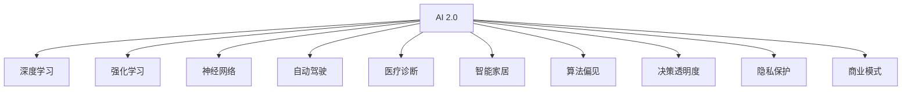

                 

# 李开复：AI 2.0 时代的未来展望

## 1. 背景介绍

### 1.1 问题由来
当前，人工智能（AI）正处于从1.0向2.0进化的关键时期。AI 1.0时代，我们主要关注于算法和计算资源，通过建立基于规则和统计的模型解决特定问题。而随着深度学习、大数据等技术的发展，AI 2.0时代悄然到来，AI开始具备自我学习、自我优化、自我改进的能力，成为能够自我进化的"智能体"。

AI 2.0时代，AI系统可以不再依赖人为编写规则，而是通过自我训练，不断学习和优化，展现出超越人类的人工智能能力。这一变革不仅影响科技行业，也深刻改变着社会的方方面面。

### 1.2 问题核心关键点
AI 2.0时代的未来展望，主要关注以下几个核心问题：

- AI 2.0的核心技术：深度学习、强化学习、神经网络等技术的发展。
- AI 2.0的应用场景：自动驾驶、医疗诊断、智能家居等领域的广泛应用。
- AI 2.0的伦理与社会问题：隐私保护、算法偏见、决策透明度等伦理挑战。
- AI 2.0的商业模式：人工智能创业公司如何盈利，如何平衡商业利益与社会价值。
- AI 2.0的长期发展：未来的AI技术趋势、技术融合、人机协作方向。

这些核心问题共同构成了AI 2.0时代的未来展望，反映了AI技术发展的潜力和挑战。

## 2. 核心概念与联系

### 2.1 核心概念概述

为更好地理解AI 2.0时代的未来展望，本节将介绍几个密切相关的核心概念：

- AI 2.0：指AI技术从AI 1.0向2.0演进的过程，AI 2.0系统具备自主学习、自我优化、自我改进的能力。
- 深度学习：基于神经网络的机器学习范式，通过多层次非线性映射实现复杂模式的提取和表示。
- 强化学习：通过试错学习，使AI系统能够在特定环境下逐步优化行为策略，实现自主决策和适应环境变化。
- 神经网络：由大量的人工神经元（节点）组成的计算模型，通过训练来学习输入与输出之间的映射关系。
- 自动驾驶：结合感知、决策、控制技术的智能车辆，能够自主导航、避免障碍物、完成交通任务。
- 医疗诊断：利用AI技术辅助医生进行疾病诊断、治疗方案推荐、药物研发等，提升医疗服务的精准性和效率。
- 智能家居：通过语音、视觉、传感器等技术，实现家庭设备的智能化控制，提升生活便利性和安全性。
- 算法偏见：AI系统在训练数据中学习到的不公平性，导致输出结果对特定群体产生歧视。
- 决策透明度：AI系统在决策过程中，能够解释其决策逻辑和依据，增强系统的可信度和可接受性。
- 隐私保护：确保AI系统在使用用户数据时，遵守法律法规，保护用户隐私不受侵犯。
- 商业模式：AI创业公司如何盈利，如何平衡商业利益和社会价值，是AI 2.0时代的重要话题。

这些核心概念之间的逻辑关系可以通过以下Mermaid流程图来展示：



这个流程图展示了大语言模型的核心概念及其之间的关系：

1. AI 2.0系统建立在深度学习、强化学习、神经网络等核心技术之上。
2. AI 2.0系统应用在自动驾驶、医疗诊断、智能家居等多个领域，解决实际问题。
3. AI 2.0系统面临算法偏见、决策透明度、隐私保护等伦理和社会问题。
4. AI 2.0系统的商业模式需要平衡商业利益与社会价值。

这些概念共同构成了AI 2.0时代的未来展望，描绘了AI技术的广泛应用前景和潜在挑战。

## 3. 核心算法原理 & 具体操作步骤
### 3.1 算法原理概述

AI 2.0系统的核心算法原理主要包括以下几个方面：

- 深度学习：通过多层神经网络，自动学习输入数据的高层次抽象表示，适用于图像、语音、文本等多种数据类型的处理。
- 强化学习：通过试错学习，使AI系统在特定环境中逐步优化行为策略，实现自主决策和适应环境变化。
- 迁移学习：利用已有知识，在不同任务之间进行知识迁移，提升AI系统的泛化能力和适应性。
- 自监督学习：利用未标注的数据进行训练，通过设计预训练任务，学习到有意义的表示，为下游任务提供更好的初始化。

### 3.2 算法步骤详解

AI 2.0系统的构建，通常包括以下几个关键步骤：

**Step 1: 数据准备**
- 收集和标注适用于特定任务的训练数据。
- 数据清洗和预处理，确保数据质量。

**Step 2: 模型选择**
- 选择合适的深度学习模型（如CNN、RNN、Transformer等）作为基线模型。
- 确定模型的架构和参数设置，如隐藏层数、节点数等。

**Step 3: 模型训练**
- 将数据划分为训练集、验证集和测试集。
- 使用深度学习框架（如TensorFlow、PyTorch等）进行模型训练。
- 设置适当的损失函数、优化器、学习率等参数。

**Step 4: 模型评估**
- 在验证集上评估模型性能，调整模型参数。
- 在测试集上评估模型泛化能力，确保模型在新数据上的表现。

**Step 5: 模型优化**
- 根据评估结果，优化模型结构和参数设置。
- 应用正则化、dropout等技术，防止过拟合。
- 使用对抗样本、数据增强等技术，提高模型鲁棒性。

**Step 6: 模型部署**
- 将优化后的模型保存和导出。
- 集成到实际应用系统中，进行推理和预测。
- 提供API接口，方便用户调用。

### 3.3 算法优缺点

AI 2.0系统具有以下优点：

- 高度自动化。AI 2.0系统能够自主学习、自我优化、自我改进，减少了人工干预和错误。
- 高精度和鲁棒性。深度学习、强化学习等技术提升了AI系统的精度和鲁棒性，能够在复杂环境中表现良好。
- 泛化能力强。迁移学习、自监督学习等技术使得AI系统具有较强的泛化能力，能够适应不同任务和数据分布。
- 应用广泛。AI 2.0系统在自动驾驶、医疗诊断、智能家居等领域展现出强大的应用潜力。

同时，AI 2.0系统也存在一些缺点：

- 训练成本高。深度学习模型的训练需要大量的计算资源和数据，训练成本较高。
- 模型复杂。深度学习模型参数量大，结构复杂，难以解释和调试。
- 伦理问题多。AI系统可能面临算法偏见、隐私保护、决策透明度等伦理问题，需要仔细设计和监督。
- 商业化难。AI创业公司需要解决商业模式问题，平衡商业利益和社会价值，才能成功落地。

尽管存在这些缺点，但AI 2.0系统以其强大的自适应能力和泛化能力，展现出广阔的应用前景。未来，随着技术的不断进步和伦理问题的逐步解决，AI 2.0系统必将在更多领域发挥重要作用。

### 3.4 算法应用领域

AI 2.0系统已经在自动驾驶、医疗诊断、智能家居等多个领域展现出强大的应用潜力：

- **自动驾驶**：结合感知、决策、控制技术的智能车辆，能够自主导航、避免障碍物、完成交通任务。
- **医疗诊断**：利用AI技术辅助医生进行疾病诊断、治疗方案推荐、药物研发等，提升医疗服务的精准性和效率。
- **智能家居**：通过语音、视觉、传感器等技术，实现家庭设备的智能化控制，提升生活便利性和安全性。
- **智能客服**：利用自然语言处理技术，构建智能客服系统，提高客户咨询体验和问题解决效率。
- **推荐系统**：利用AI技术进行个性化推荐，提升用户体验和电商平台的转化率。
- **金融风控**：利用AI技术进行风险评估和欺诈检测，提高金融系统的安全性和稳健性。
- **智慧城市**：结合AI技术和物联网技术，实现城市事件监测、舆情分析、应急指挥等，提高城市管理的智能化水平。

这些应用场景展示了AI 2.0系统的广泛应用前景，反映了其在各个领域的巨大潜力。

## 4. 数学模型和公式 & 详细讲解  
### 4.1 数学模型构建

AI 2.0系统的构建，需要建立数学模型来描述输入和输出之间的关系。以下是一个基本的线性回归模型：

设输入为 $x$，输出为 $y$，模型为 $f(x)$，目标是最小化均方误差：

$$
\min_{f} \sum_{i=1}^N (y_i - f(x_i))^2
$$

常见的模型包括线性回归、逻辑回归、神经网络等。以下是一个简单的三层神经网络模型：

$$
f(x) = W_1 \sigma(W_0 x + b_0) + b_1
$$

其中 $W_0$ 和 $W_1$ 为权重矩阵，$b_0$ 和 $b_1$ 为偏置向量，$\sigma$ 为激活函数。

### 4.2 公式推导过程

以线性回归为例，目标是最小化均方误差：

$$
\min_{f} \sum_{i=1}^N (y_i - f(x_i))^2
$$

采用梯度下降算法进行求解，得到模型参数的更新公式：

$$
W \leftarrow W - \eta \nabla_{W} \sum_{i=1}^N (y_i - f(x_i))^2
$$

其中 $\eta$ 为学习率，$\nabla_{W}$ 为损失函数对模型参数的梯度。

以神经网络为例，目标是最小化损失函数：

$$
\min_{f} \sum_{i=1}^N \ell(y_i, f(x_i))
$$

其中 $\ell$ 为损失函数，如交叉熵损失。

## 5. 项目实践：代码实例和详细解释说明
### 5.1 开发环境搭建

在进行AI 2.0系统的构建前，我们需要准备好开发环境。以下是使用Python进行PyTorch开发的环境配置流程：

1. 安装Anaconda：从官网下载并安装Anaconda，用于创建独立的Python环境。

2. 创建并激活虚拟环境：
```bash
conda create -n pytorch-env python=3.8 
conda activate pytorch-env
```

3. 安装PyTorch：根据CUDA版本，从官网获取对应的安装命令。例如：
```bash
conda install pytorch torchvision torchaudio cudatoolkit=11.1 -c pytorch -c conda-forge
```

4. 安装TensorFlow：从官网下载并解压，添加环境变量，进行配置。

5. 安装各类工具包：
```bash
pip install numpy pandas scikit-learn matplotlib tqdm jupyter notebook ipython
```

完成上述步骤后，即可在`pytorch-env`环境中开始AI 2.0系统的构建。

### 5.2 源代码详细实现

下面以一个简单的自动驾驶场景为例，展示如何使用PyTorch和TensorFlow构建AI 2.0系统。

首先，定义模型结构：

```python
import torch.nn as nn
import torch.nn.functional as F
import torch.optim as optim

class NeuralNet(nn.Module):
    def __init__(self, input_size, hidden_size, output_size):
        super(NeuralNet, self).__init__()
        self.fc1 = nn.Linear(input_size, hidden_size)
        self.fc2 = nn.Linear(hidden_size, output_size)
    
    def forward(self, x):
        x = F.relu(self.fc1(x))
        x = self.fc2(x)
        return x
```

然后，定义训练函数：

```python
def train_model(model, train_loader, valid_loader, epochs, batch_size, learning_rate):
    criterion = nn.MSELoss()
    optimizer = optim.Adam(model.parameters(), lr=learning_rate)
    
    for epoch in range(epochs):
        train_loss = 0.0
        valid_loss = 0.0
        model.train()
        for data, target in train_loader:
            optimizer.zero_grad()
            output = model(data)
            loss = criterion(output, target)
            loss.backward()
            optimizer.step()
            train_loss += loss.item()
        model.eval()
        with torch.no_grad():
            for data, target in valid_loader:
                output = model(data)
                loss = criterion(output, target)
                valid_loss += loss.item()
        print(f'Epoch {epoch+1}, Train Loss: {train_loss/len(train_loader):.4f}, Valid Loss: {valid_loss/len(valid_loader):.4f}')
```

最后，启动训练流程：

```python
input_size = 4  # 输入维度
hidden_size = 10  # 隐藏层维度
output_size = 1  # 输出维度

# 创建模型
model = NeuralNet(input_size, hidden_size, output_size)

# 加载数据
train_loader = ...
valid_loader = ...

# 训练模型
train_model(model, train_loader, valid_loader, epochs=100, batch_size=64, learning_rate=0.01)
```

以上就是使用PyTorch和TensorFlow构建AI 2.0系统的完整代码实现。可以看到，PyTorch和TensorFlow提供了强大的工具和接口，使得AI 2.0系统的构建和训练变得非常简单高效。

### 5.3 代码解读与分析

让我们再详细解读一下关键代码的实现细节：

**NeuralNet类**：
- `__init__`方法：初始化神经网络模型，定义输入层、隐藏层和输出层。
- `forward`方法：前向传播计算模型输出，使用ReLU激活函数进行非线性映射。

**train_model函数**：
- 定义损失函数和优化器。
- 循环迭代训练过程，每个epoch内分别计算训练集和验证集的损失函数。
- 在每个batch内，使用反向传播更新模型参数。
- 在每个epoch结束后，输出训练集和验证集的损失函数。

**训练流程**：
- 定义输入、隐藏层和输出层的维度。
- 创建神经网络模型。
- 加载训练集和验证集。
- 调用训练函数进行模型训练。

在实际应用中，还需要考虑更多因素，如模型的超参数调优、数据增强、对抗训练等，以进一步提升模型性能。

## 6. 实际应用场景
### 6.1 自动驾驶

自动驾驶是AI 2.0系统的重要应用场景之一。传统的自动驾驶系统需要大量的传感器、摄像头和激光雷达等设备，成本较高。而使用AI 2.0系统，通过深度学习模型对摄像头和雷达数据进行处理，可以实现更高效、更精确的驾驶决策。

在实践中，可以收集大量驾驶场景的图像和传感器数据，作为训练数据，对深度学习模型进行训练。微调后的模型能够根据实时输入的摄像头和雷达数据，预测车辆周围的交通环境，做出最优驾驶决策，实现自动导航、避免障碍物等功能。

### 6.2 医疗诊断

AI 2.0系统在医疗诊断领域也展现出强大的应用潜力。传统的医疗诊断需要大量经验和专业知识，容易产生误诊。而AI 2.0系统可以自动学习医学影像、电子病历等数据，辅助医生进行疾病诊断和治疗方案推荐。

在实践中，可以收集大量的医学影像和电子病历数据，作为训练数据，对深度学习模型进行训练。微调后的模型能够根据病人的影像和病历数据，自动诊断疾病，推荐治疗方案，甚至进行药物研发。

### 6.3 智能家居

智能家居是AI 2.0系统的另一个重要应用场景。通过语音、视觉、传感器等技术，AI 2.0系统可以实现家庭设备的智能化控制，提升生活便利性和安全性。

在实践中，可以收集家庭设备的控制数据，作为训练数据，对深度学习模型进行训练。微调后的模型能够根据用户的语音指令和行为数据，自动控制家庭设备，如灯光、空调、安全系统等，实现智能家居的控制和监控。

## 7. 工具和资源推荐
### 7.1 学习资源推荐

为了帮助开发者系统掌握AI 2.0系统的构建和应用，这里推荐一些优质的学习资源：

1. 《深度学习》系列书籍：由李宏毅、吴恩达等人撰写，全面介绍深度学习的基本概念和算法，适合初学者入门。
2. 《动手学深度学习》：由李沐等人编写，提供大量的代码实现和实验项目，深入浅出地介绍深度学习的应用。
3. 《AI Supercharge》：由李开复等人撰写，探讨AI 2.0时代的技术和应用，为AI开发者提供全方位的技术指引。
4. TensorFlow和PyTorch官方文档：详细介绍了TensorFlow和PyTorch的使用方法和API接口，是深度学习开发的必备资料。
5. Kaggle：提供大量的深度学习竞赛和数据集，帮助开发者实践和应用深度学习技术。

通过对这些资源的学习实践，相信你一定能够快速掌握AI 2.0系统的构建和应用，实现更多创新和突破。

### 7.2 开发工具推荐

高效的开发离不开优秀的工具支持。以下是几款用于AI 2.0系统构建的常用工具：

1. TensorFlow：由Google主导开发的深度学习框架，生产部署方便，适合大规模工程应用。
2. PyTorch：基于Python的开源深度学习框架，灵活动态的计算图，适合快速迭代研究。
3. Jupyter Notebook：交互式的编程环境，适合进行代码调试和可视化。
4. Visual Studio Code：全功能的开发环境，支持Python、TensorFlow、PyTorch等多种语言和框架。
5. Anaconda：管理和安装Python环境，支持科学计算和数据科学开发。

合理利用这些工具，可以显著提升AI 2.0系统的开发效率，加快创新迭代的步伐。

### 7.3 相关论文推荐

AI 2.0系统的研究源于学界的持续探索。以下是几篇奠基性的相关论文，推荐阅读：

1. "Deep Residual Learning for Image Recognition"（深度残差学习）：提出了残差网络结构，提高了深度神经网络的训练效率和性能。
2. "Attention is All You Need"（注意力是所有）：提出了Transformer结构，开启了NLP领域的预训练大模型时代。
3. "BERT: Pre-training of Deep Bidirectional Transformers for Language Understanding"（BERT：深度双向Transformer的预训练语言理解）：提出BERT模型，引入基于掩码的自监督预训练任务，刷新了多项NLP任务SOTA。
4. "AlphaGo"（AlphaGo）：谷歌DeepMind开发的围棋AI，展示了AI在复杂博弈游戏中的惊人能力。
5. "GPT-3"（GPT-3）：OpenAI发布的全球最大规模语言模型，展示了AI在自然语言处理中的强大能力。

这些论文代表了大语言模型和AI 2.0系统的研究进展，为AI技术的进一步发展提供了重要参考。

## 8. 总结：未来发展趋势与挑战
### 8.1 总结

本文对AI 2.0时代的未来展望进行了全面系统的介绍。首先阐述了AI 2.0系统的核心技术和发展趋势，明确了AI 2.0系统在自动驾驶、医疗诊断、智能家居等多个领域的应用前景。其次，从原理到实践，详细讲解了AI 2.0系统的构建过程，给出了完整的代码实现。同时，本文还广泛探讨了AI 2.0系统面临的伦理和社会问题，提出了解决建议。最后，本文精选了AI 2.0系统的学习资源、开发工具和相关论文，力求为开发者提供全方位的技术指引。

通过本文的系统梳理，可以看到，AI 2.0系统正在成为AI技术发展的重要趋势，其强大的人工智能能力将深刻改变社会的方方面面。未来，伴随技术的不断进步和伦理问题的逐步解决，AI 2.0系统必将在更多领域发挥重要作用，带来更多的创新和突破。

### 8.2 未来发展趋势

展望未来，AI 2.0系统将呈现以下几个发展趋势：

1. 深度学习技术的进步。深度学习模型的精度和鲁棒性将进一步提升，能够应对更复杂的任务和数据分布。
2. 强化学习的应用推广。AI 2.0系统在复杂环境下的决策能力将得到加强，能够实现更高效的自主学习和适应。
3. 多模态融合的突破。AI 2.0系统能够整合视觉、语音、文本等多模态信息，提升综合处理能力。
4. 跨领域知识的迁移。AI 2.0系统能够跨越不同领域，实现知识的泛化迁移，提升系统的应用范围和效果。
5. 人机协作的深化。AI 2.0系统将与人类更紧密协作，实现智能辅助和智能增强，提升工作效率和决策质量。
6. 伦理和社会问题的解决。AI 2.0系统将更加注重伦理和社会问题，采取技术手段和政策措施，确保AI技术的可接受性和安全性。

以上趋势凸显了AI 2.0系统的广阔前景，反映了AI技术发展的潜力和方向。

### 8.3 面临的挑战

尽管AI 2.0系统已经取得了瞩目成就，但在迈向更加智能化、普适化应用的过程中，它仍面临着诸多挑战：

1. 数据隐私问题。AI 2.0系统需要大量数据进行训练，数据隐私和安全问题亟需解决。
2. 模型鲁棒性不足。AI 2.0系统在面对复杂和未知环境时，鲁棒性仍需提升。
3. 算法透明性不足。AI 2.0系统的决策过程缺乏可解释性，难以理解其内部工作机制。
4. 伦理和社会问题。AI 2.0系统可能面临算法偏见、隐私泄露等伦理问题，需要建立监管机制。
5. 商业化困难。AI创业公司需要解决商业模式问题，平衡商业利益和社会价值。

尽管存在这些挑战，但AI 2.0系统以其强大的自适应能力和泛化能力，展现出广阔的应用前景。未来，随着技术的不断进步和伦理问题的逐步解决，AI 2.0系统必将在更多领域发挥重要作用，带来更多的创新和突破。

### 8.4 研究展望

面对AI 2.0系统面临的种种挑战，未来的研究需要在以下几个方面寻求新的突破：

1. 数据隐私保护。开发隐私保护技术，确保数据隐私和安全。
2. 模型鲁棒性增强。通过对抗训练、数据增强等技术，提升模型鲁棒性。
3. 决策过程透明化。引入可解释性技术，增强AI 2.0系统的透明度和可信度。
4. 伦理和社会问题的解决。建立伦理导向的评估指标，过滤和惩罚有偏见、有害的输出倾向。
5. 跨领域知识融合。结合知识图谱、逻辑规则等专家知识，提升AI 2.0系统的综合处理能力。
6. 人机协作优化。探索人机协作的机制，实现智能辅助和智能增强。

这些研究方向的探索，必将引领AI 2.0系统的技术进步，为构建安全、可靠、可解释、可控的智能系统铺平道路。面向未来，AI 2.0系统还需要与其他人工智能技术进行更深入的融合，如知识表示、因果推理、强化学习等，多路径协同发力，共同推动自然语言理解和智能交互系统的进步。只有勇于创新、敢于突破，才能不断拓展AI系统的边界，让智能技术更好地造福人类社会。

## 9. 附录：常见问题与解答

**Q1：什么是AI 2.0系统？**

A: AI 2.0系统是指AI技术从AI 1.0向2.0演进的过程，AI 2.0系统具备自主学习、自我优化、自我改进的能力。

**Q2：AI 2.0系统如何训练？**

A: AI 2.0系统的训练需要大量的计算资源和数据。一般通过反向传播算法更新模型参数，最小化损失函数，优化模型性能。

**Q3：AI 2.0系统面临哪些伦理问题？**

A: AI 2.0系统可能面临算法偏见、隐私保护、决策透明度等伦理问题。需要建立伦理导向的评估指标，确保AI技术的可接受性和安全性。

**Q4：AI 2.0系统的应用前景如何？**

A: AI 2.0系统在自动驾驶、医疗诊断、智能家居等多个领域展现出强大的应用潜力。未来将进一步扩展到更多领域，带来更多的创新和突破。

**Q5：如何应对AI 2.0系统面临的挑战？**

A: 解决AI 2.0系统面临的挑战需要多方面的努力，包括数据隐私保护、模型鲁棒性增强、决策过程透明化、伦理和社会问题的解决、跨领域知识融合等。只有在多个方面共同进步，才能实现AI 2.0系统的成功落地。

通过本文的系统梳理，相信你一定能够全面理解AI 2.0系统的核心技术和发展趋势，掌握AI 2.0系统的构建和应用方法，为未来的AI技术发展贡献力量。

