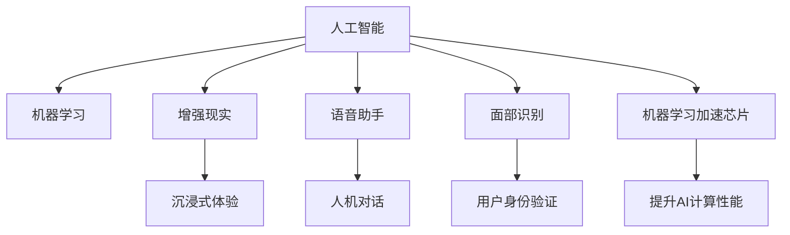

                 

# 李开复：苹果发布AI应用的商业价值

## 1. 背景介绍

苹果（Apple Inc.）作为全球领先的科技公司，近年来在人工智能（AI）领域投入巨大，推出了一系列基于AI技术的创新产品和服务，如Siri语音助手、Face ID面部识别、增强现实（AR）应用、机器学习加速芯片（M1芯片）等。这些AI应用不仅提升了用户体验，也极大地增强了苹果的商业价值。本文将从多个角度分析苹果发布AI应用的商业价值，并探讨其未来发展趋势和面临的挑战。

## 2. 核心概念与联系

### 2.1 核心概念概述

为更好地理解苹果AI应用的商业价值，本节将介绍几个密切相关的核心概念：

- **人工智能（AI）**：通过计算机系统模拟人类智能过程，实现自主学习、推理、判断等功能的科学技术。
- **机器学习（ML）**：AI的一个分支，通过算法让计算机从数据中自动学习和改进，无需人工干预。
- **增强现实（AR）**：通过数字信息增强现实世界体验的技术，使虚拟对象与真实世界结合，提供沉浸式体验。
- **语音助手（Siri）**：通过语音识别和自然语言处理技术，实现人机对话的AI应用。
- **面部识别（Face ID）**：基于人脸图像的生物特征识别技术，用于用户身份验证。
- **机器学习加速芯片（M1芯片）**：专门用于加速机器学习算法的硬件芯片，提升AI计算性能。

这些核心概念之间的逻辑关系可以通过以下Mermaid流程图来展示：



这个流程图展示了几大核心概念及其之间的关系：

1. 人工智能（AI）是基础，通过机器学习（ML）算法实现自动学习和改进。
2. 增强现实（AR）、语音助手（Siri）、面部识别（Face ID）等具体应用，都是基于AI技术的创新。
3. 机器学习加速芯片（M1芯片）等硬件支持，进一步提升了AI应用的计算效率。

## 3. 核心算法原理 & 具体操作步骤

### 3.1 算法原理概述

苹果的AI应用通过多种机器学习算法实现，主要包括深度学习、强化学习、迁移学习等。其中，深度学习算法用于图像识别、语音识别、自然语言处理等任务，强化学习算法用于自动化控制、游戏等需要动态决策的应用，迁移学习则用于将已有知识迁移到新任务上。

### 3.2 算法步骤详解

以下是苹果发布AI应用的主要步骤：

**Step 1: 数据收集与处理**
- 收集与产品相关的数据，如用户的语音、图像、点击行为等。
- 对数据进行清洗和预处理，去除噪声和异常值，确保数据质量。

**Step 2: 模型训练与优化**
- 选择适合任务类型的机器学习算法，设计模型架构。
- 使用收集到的数据进行训练，通过反向传播算法优化模型参数。
- 采用正则化、Dropout等技术，防止过拟合。
- 使用交叉验证等方法评估模型性能，进行超参数调整。

**Step 3: 模型集成与部署**
- 将训练好的模型集成到实际应用中，如iOS系统、Face ID等。
- 通过App Store等渠道发布，让用户下载和使用。
- 持续监控模型表现，收集用户反馈，进行模型迭代优化。

### 3.3 算法优缺点

苹果的AI应用在技术上具有以下优势：
1. 数据量大：苹果拥有庞大的用户基础，收集的数据量丰富，有助于提高模型训练的准确性。
2. 算法多样：苹果在深度学习、强化学习、迁移学习等多个领域均有布局，具备较强的技术储备。
3. 硬件支持：通过M1芯片等硬件支持，加速了AI计算，提升了模型推理速度。

同时，也存在一些缺点：
1. 数据隐私问题：收集大量用户数据可能导致隐私泄露，需要加强数据保护措施。
2. 算法复杂度：机器学习模型复杂，训练和推理过程需要大量计算资源。
3. 用户体验风险：AI应用可能存在误识别、误操作等问题，需要不断优化算法和用户体验设计。

### 3.4 算法应用领域

苹果的AI应用涵盖了众多领域，包括但不限于：

- **增强现实（AR）**：如ARKit框架，为用户提供沉浸式体验，用于游戏、教育和工业设计等。
- **语音助手（Siri）**：通过自然语言处理和语音识别技术，实现人机对话，提供日程管理、信息查询等服务。
- **面部识别（Face ID）**：用于解锁手机、识别身份等，提供更高的安全性和便捷性。
- **健康与医疗**：如健康检测应用，通过传感器和机器学习算法监测用户健康状况。
- **推荐系统**：通过机器学习算法分析用户行为，推荐个性化内容，提升用户粘性。
- **自动驾驶**：研究自动驾驶技术，提升车辆的安全性和智能化水平。

这些应用不仅提升了用户体验，也带来了显著的商业价值。

## 4. 数学模型和公式 & 详细讲解 & 举例说明

### 4.1 数学模型构建

以苹果的语音识别模型为例，其数学模型如下：

$$
\begin{aligned}
\hat{y} &= f(x; \theta) \\
&= \sigma(W^Tx + b)
\end{aligned}
$$

其中，$x$ 为输入的语音特征向量，$y$ 为模型预测的语音文字，$f(\cdot)$ 为模型的前向传播函数，$\sigma(\cdot)$ 为激活函数，$W$ 和 $b$ 为模型参数。

### 4.2 公式推导过程

语音识别模型通过反向传播算法更新模型参数：

$$
\begin{aligned}
\frac{\partial \mathcal{L}}{\partial \theta} &= \frac{\partial \mathcal{L}}{\partial \hat{y}} \frac{\partial \hat{y}}{\partial x} \frac{\partial x}{\partial \theta} \\
&= \frac{\partial \mathcal{L}}{\partial \hat{y}} W^T \frac{\partial \sigma(W^Tx + b)}{\partial x}
\end{aligned}
$$

其中，$\mathcal{L}$ 为损失函数，$\frac{\partial \mathcal{L}}{\partial \hat{y}}$ 为损失函数对预测结果的梯度，$W^T$ 为权重的转置，$\frac{\partial \sigma}{\partial x}$ 为激活函数的导数。

### 4.3 案例分析与讲解

以苹果的面部识别模型为例，其工作原理如下：

1. 收集用户的面部图像数据，通过卷积神经网络（CNN）提取面部特征。
2. 将提取的特征输入到分类器中，判断用户身份。
3. 在训练过程中，使用反向传播算法更新模型参数，优化分类器性能。

## 5. 项目实践：代码实例和详细解释说明

### 5.1 开发环境搭建

在进行AI应用开发前，我们需要准备好开发环境。以下是使用Python进行PyTorch开发的环境配置流程：

1. 安装Anaconda：从官网下载并安装Anaconda，用于创建独立的Python环境。

2. 创建并激活虚拟环境：
```bash
conda create -n pytorch-env python=3.8 
conda activate pytorch-env
```

3. 安装PyTorch：根据CUDA版本，从官网获取对应的安装命令。例如：
```bash
conda install pytorch torchvision torchaudio cudatoolkit=11.1 -c pytorch -c conda-forge
```

4. 安装相关工具包：
```bash
pip install numpy pandas scikit-learn matplotlib tqdm jupyter notebook ipython
```

完成上述步骤后，即可在`pytorch-env`环境中开始AI应用开发。

### 5.2 源代码详细实现

以下是使用PyTorch实现面部识别（Face ID）的代码实现。

```python
import torch
import torchvision
import torchvision.transforms as transforms
import torch.nn as nn
import torch.optim as optim

# 定义模型结构
class FaceNet(nn.Module):
    def __init__(self):
        super(FaceNet, self).__init__()
        self.cnn = nn.Sequential(
            nn.Conv2d(3, 64, kernel_size=3, stride=1, padding=1),
            nn.ReLU(inplace=True),
            nn.MaxPool2d(kernel_size=2, stride=2),
            nn.Conv2d(64, 128, kernel_size=3, stride=1, padding=1),
            nn.ReLU(inplace=True),
            nn.MaxPool2d(kernel_size=2, stride=2),
            nn.Conv2d(128, 256, kernel_size=3, stride=1, padding=1),
            nn.ReLU(inplace=True),
            nn.MaxPool2d(kernel_size=2, stride=2),
            nn.Conv2d(256, 512, kernel_size=3, stride=1, padding=1),
            nn.ReLU(inplace=True),
            nn.MaxPool2d(kernel_size=2, stride=2),
        )
        self.fc = nn.Sequential(
            nn.Linear(512 * 7 * 7, 1024),
            nn.ReLU(inplace=True),
            nn.Linear(1024, 512),
            nn.ReLU(inplace=True),
            nn.Linear(512, 2),
        )

    def forward(self, x):
        x = self.cnn(x)
        x = x.view(-1, 512 * 7 * 7)
        x = self.fc(x)
        return x

# 加载数据集
train_dataset = torchvision.datasets.CIFAR10(root='./data', train=True, transform=transforms.ToTensor(), download=True)
test_dataset = torchvision.datasets.CIFAR10(root='./data', train=False, transform=transforms.ToTensor(), download=True)

# 定义数据加载器
train_loader = torch.utils.data.DataLoader(train_dataset, batch_size=64, shuffle=True)
test_loader = torch.utils.data.DataLoader(test_dataset, batch_size=64, shuffle=False)

# 初始化模型和优化器
model = FaceNet()
optimizer = optim.Adam(model.parameters(), lr=0.001)
criterion = nn.CrossEntropyLoss()

# 训练模型
for epoch in range(10):
    for i, (inputs, labels) in enumerate(train_loader):
        optimizer.zero_grad()
        outputs = model(inputs)
        loss = criterion(outputs, labels)
        loss.backward()
        optimizer.step()
        if (i + 1) % 100 == 0:
            print('Epoch [{}/{}], Step [{}/{}], Loss: {:.4f}'.format(epoch + 1, 10, i + 1, len(train_loader), loss.item()))

# 评估模型
correct = 0
total = 0
with torch.no_grad():
    for inputs, labels in test_loader:
        outputs = model(inputs)
        _, predicted = torch.max(outputs.data, 1)
        total += labels.size(0)
        correct += (predicted == labels).sum().item()

print('Test Accuracy of the model on the 10000 test images: {:.2f}%'.format(100 * correct / total))
```

### 5.3 代码解读与分析

让我们再详细解读一下关键代码的实现细节：

**FaceNet类**：
- `__init__`方法：定义了卷积神经网络的结构。
- `forward`方法：实现前向传播，将输入图像经过CNN和全连接层，输出分类结果。

**数据加载器**：
- 使用`torchvision.datasets.CIFAR10`加载CIFAR-10数据集。
- 定义`DataLoader`，用于批量加载数据和标签。

**模型训练**：
- 使用`Adam`优化器更新模型参数，`CrossEntropyLoss`作为损失函数。
- 在每个epoch中，对训练集数据进行迭代训练，输出训练过程中的损失值。

**模型评估**：
- 在测试集上评估模型，计算准确率。

## 6. 实际应用场景

### 6.1 智能家居

苹果的智能家居系统，如HomePod和Apple Watch，通过AI技术实现了语音控制、健康监测等功能。用户可以通过语音指令控制家居设备，如开灯、调节温度等，极大提升了生活便捷性。

### 6.2 增强现实（AR）应用

苹果的ARKit框架支持开发者构建基于增强现实的应用，如AR游戏、虚拟试衣等。用户可以在真实环境中与虚拟对象互动，带来沉浸式体验。

### 6.3 个性化推荐

苹果的App Store和Apple Music等应用，通过机器学习算法分析用户行为，提供个性化的推荐内容，提升用户体验和粘性。

### 6.4 未来应用展望

展望未来，苹果的AI应用将进一步拓展，涵盖更多领域：

1. **自动驾驶**：苹果正在研究自动驾驶技术，利用AI技术实现车辆的自动驾驶和辅助驾驶功能。
2. **健康监测**：通过AI技术分析健康数据，提供个性化的健康建议和医疗服务。
3. **工业自动化**：利用AI技术优化生产流程，实现智能制造。
4. **虚拟现实（VR）**：结合AR技术，提供更加沉浸式的VR体验。
5. **金融科技**：利用AI技术进行风险评估、智能投顾等，提升金融服务水平。

## 7. 工具和资源推荐

### 7.1 学习资源推荐

为了帮助开发者系统掌握AI技术的理论基础和实践技巧，这里推荐一些优质的学习资源：

1. 《深度学习》系列书籍：由Ian Goodfellow、Yoshua Bengio和Aaron Courville所著，系统讲解了深度学习的基本原理和前沿技术。
2. 《机器学习实战》系列书籍：由Peter Harrington撰写，通过实际案例介绍了机器学习算法和实践技巧。
3. 斯坦福大学《机器学习》课程：由Andrew Ng主讲，涵盖机器学习的基本概念和经典算法。
4. Coursera上的深度学习课程：包括Ian Goodfellow、Andrew Ng等知名学者的课程，涵盖了深度学习、自然语言处理、计算机视觉等多个方向。

通过对这些资源的学习实践，相信你一定能够快速掌握AI技术的精髓，并用于解决实际的业务问题。

### 7.2 开发工具推荐

高效的开发离不开优秀的工具支持。以下是几款用于AI开发常用的工具：

1. PyTorch：基于Python的开源深度学习框架，灵活动态的计算图，适合快速迭代研究。
2. TensorFlow：由Google主导开发的开源深度学习框架，生产部署方便，适合大规模工程应用。
3. Keras：高层次神经网络API，基于TensorFlow、CNTK或Theano等后端，适合快速原型设计。
4. Jupyter Notebook：交互式开发环境，支持代码和结果的实时展示和分享。
5. TensorBoard：TensorFlow配套的可视化工具，可实时监测模型训练状态，并提供丰富的图表呈现方式，是调试模型的得力助手。

合理利用这些工具，可以显著提升AI应用的开发效率，加快创新迭代的步伐。

### 7.3 相关论文推荐

AI技术的发展源于学界的持续研究。以下是几篇奠基性的相关论文，推荐阅读：

1. AlexNet：ImageNet大规模视觉识别挑战赛的冠军算法，标志着深度学习在图像识别领域的重大突破。
2. RNN和LSTM：长短期记忆网络，应用于序列数据处理，如语音识别、机器翻译等。
3. Transformer：一种自注意力机制的神经网络模型，广泛应用于自然语言处理领域。
4. GAN：生成对抗网络，用于生成高质量的图像和视频等。
5. Attention机制：通过自注意力机制，提高模型对输入数据的关注度，提升模型性能。

这些论文代表了大数据、深度学习、自然语言处理等领域的发展脉络。通过学习这些前沿成果，可以帮助研究者把握学科前进方向，激发更多的创新灵感。

## 8. 总结：未来发展趋势与挑战

### 8.1 总结

本文对苹果发布AI应用的商业价值进行了全面系统的分析。首先阐述了苹果在AI技术上的投入和取得的成果，明确了AI应用在提升用户体验、增加商业价值等方面的巨大潜力。其次，从算法原理到具体实现，详细讲解了苹果AI应用的开发流程，给出了完整的代码实现。同时，本文还广泛探讨了AI应用在多个领域的应用前景，展示了苹果在AI领域的广泛布局。

通过本文的系统梳理，可以看到，苹果的AI应用为NLP技术带来了全新的可能性，其商业模式也获得了巨大的商业价值。未来，伴随AI技术的不断演进，苹果有望在更多领域取得突破，推动人工智能技术在实际应用中的深度落地。

### 8.2 未来发展趋势

展望未来，苹果的AI应用将呈现以下几个发展趋势：

1. **数据量的持续增长**：苹果将持续收集和分析用户数据，推动AI模型的不断优化和迭代。
2. **算法的持续创新**：苹果将继续在深度学习、强化学习、迁移学习等多个方向进行探索，提升AI应用的性能和多样性。
3. **硬件的不断优化**：苹果将通过M1芯片等硬件支持，提升AI应用的计算效率和实时性。
4. **跨领域应用的拓展**：苹果的AI应用将不断拓展到更多领域，如自动驾驶、健康监测、工业自动化等。
5. **伦理和隐私的重视**：苹果将更加重视数据隐私和伦理问题，推动AI应用的健康发展。

这些趋势将进一步推动苹果在AI领域的发展，提升其在全球科技市场的竞争力。

### 8.3 面临的挑战

尽管苹果的AI应用在技术上取得了显著成就，但在迈向更加智能化、普适化应用的过程中，仍面临诸多挑战：

1. **数据隐私问题**：大量用户数据的收集和分析可能导致隐私泄露，需要加强数据保护措施。
2. **算法复杂度**：机器学习模型复杂，训练和推理过程需要大量计算资源。
3. **用户体验风险**：AI应用可能存在误识别、误操作等问题，需要不断优化算法和用户体验设计。
4. **伦理和法律风险**：AI应用在决策过程中可能存在偏见和歧视，需要加强伦理审查和法律监管。
5. **硬件成本**：高性能AI芯片等硬件成本较高，可能会影响AI应用的推广和普及。

### 8.4 研究展望

面对AI应用面临的种种挑战，未来的研究需要在以下几个方面寻求新的突破：

1. **数据隐私保护**：开发更加安全、高效的隐私保护技术，保护用户数据隐私。
2. **算法优化**：提升算法效率，降低计算资源消耗，实现轻量级、实时性的部署。
3. **用户界面优化**：提高用户体验，减少误识别、误操作等问题，增强用户信任。
4. **伦理和法律合规**：加强伦理审查和法律监管，确保AI应用的公平性和透明性。
5. **跨领域应用**：推动AI技术在更多领域的融合应用，提升社会整体智能化水平。

这些研究方向的探索，必将引领苹果在AI领域的发展，为构建安全、可靠、可解释、可控的智能系统铺平道路。面向未来，苹果需要不断突破技术瓶颈，推动AI技术的广泛应用，为全球用户带来更多的创新和价值。

## 9. 附录：常见问题与解答

**Q1：苹果的AI应用在技术上有哪些优势？**

A: 苹果的AI应用在技术上具有以下优势：
1. 数据量大：苹果拥有庞大的用户基础，收集的数据量丰富，有助于提高模型训练的准确性。
2. 算法多样：苹果在深度学习、强化学习、迁移学习等多个领域均有布局，具备较强的技术储备。
3. 硬件支持：通过M1芯片等硬件支持，加速了AI计算，提升了模型推理速度。

**Q2：苹果的AI应用面临哪些挑战？**

A: 苹果的AI应用面临以下挑战：
1. 数据隐私问题：大量用户数据的收集和分析可能导致隐私泄露，需要加强数据保护措施。
2. 算法复杂度：机器学习模型复杂，训练和推理过程需要大量计算资源。
3. 用户体验风险：AI应用可能存在误识别、误操作等问题，需要不断优化算法和用户体验设计。
4. 伦理和法律风险：AI应用在决策过程中可能存在偏见和歧视，需要加强伦理审查和法律监管。
5. 硬件成本：高性能AI芯片等硬件成本较高，可能会影响AI应用的推广和普及。

**Q3：苹果的AI应用将如何进一步拓展？**

A: 苹果的AI应用将进一步拓展到以下领域：
1. 自动驾驶：研究自动驾驶技术，提升车辆的安全性和智能化水平。
2. 健康监测：通过AI技术分析健康数据，提供个性化的健康建议和医疗服务。
3. 工业自动化：利用AI技术优化生产流程，实现智能制造。
4. 虚拟现实（VR）：结合AR技术，提供更加沉浸式的VR体验。
5. 金融科技：利用AI技术进行风险评估、智能投顾等，提升金融服务水平。

**Q4：苹果如何保护用户数据隐私？**

A: 苹果通过以下措施保护用户数据隐私：
1. 数据加密：在数据传输和存储过程中，使用加密技术保护用户隐私。
2. 隐私保护算法：开发隐私保护算法，如差分隐私、联邦学习等，保护用户数据。
3. 用户授权：通过用户授权，明确数据使用范围，增强用户对数据的控制权。
4. 透明度和可控性：提供透明度高的数据使用说明和控制界面，让用户了解和控制数据的使用情况。

---

作者：禅与计算机程序设计艺术 / Zen and the Art of Computer Programming

