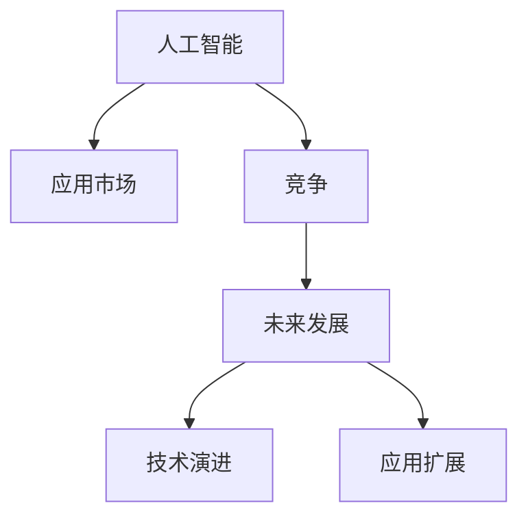

                 

# 李开复：苹果发布AI应用的市场

> 关键词：苹果, AI, 应用市场, 创新, 竞争, 未来发展

## 1. 背景介绍

在过去几十年里，科技行业一直处于快速变化之中。随着人工智能(AI)技术的不断进步，AI应用市场正变得愈发激烈。在这场技术竞赛中，苹果公司最近发布了一系列全新的AI应用，引起了广泛的关注。本文将深入探讨苹果公司发布的AI应用，分析其市场竞争力和未来发展趋势。

## 2. 核心概念与联系

### 2.1 核心概念概述

为更好地理解苹果公司发布的AI应用，本节将介绍几个关键概念及其联系：

- **人工智能（AI）**：指使用计算机技术模仿人类智能的学科，包括机器学习、自然语言处理、计算机视觉、深度学习等。
- **应用市场**：指AI技术被应用于各行各业的场景，如自动驾驶、医疗诊断、金融风控、教育、游戏等。
- **竞争**：指不同公司或技术之间的比拼，争夺市场份额和技术优势。
- **未来发展**：指AI应用市场的未来趋势，包括技术演进、应用扩展、市场竞争等。

这些概念通过以下Mermaid流程图进行展示：



这个流程图展示了人工智能与AI应用市场之间的联系，以及竞争和未来发展这两个概念之间的相互影响。

## 3. 核心算法原理 & 具体操作步骤
### 3.1 算法原理概述

苹果公司发布的AI应用主要基于深度学习算法，包括卷积神经网络（CNN）、递归神经网络（RNN）和Transformer等。深度学习算法通过多层神经网络来处理复杂的输入数据，并从中学习模式，以进行分类、回归、预测等任务。

这些AI应用的市场竞争主要基于以下三个方面：

1. **算法性能**：指算法的准确性、速度和效率。
2. **用户需求**：指用户对AI应用的需求和反馈。
3. **市场规模**：指AI应用在特定市场的规模和潜在增长空间。

### 3.2 算法步骤详解

苹果公司发布AI应用的步骤主要包括以下几个环节：

1. **数据收集**：收集大量数据进行模型训练。
2. **模型构建**：选择合适的深度学习模型，并根据应用需求进行训练。
3. **算法优化**：通过调整超参数和模型结构，优化算法性能。
4. **应用部署**：将训练好的模型部署到实际应用场景中。
5. **用户反馈**：收集用户反馈，进一步改进算法。

### 3.3 算法优缺点

苹果公司发布的AI应用的主要优点包括：

- **高精度**：通过深度学习算法，可以显著提高算法的精度。
- **自动化**：自动化处理复杂的输入数据，降低人工成本。
- **易于集成**：通过API接口，方便与其他系统集成。

其缺点包括：

- **高成本**：深度学习算法的训练和优化需要大量计算资源。
- **复杂性**：深度学习模型的构建和优化需要专业知识。
- **隐私问题**：收集和处理用户数据可能引发隐私保护问题。

### 3.4 算法应用领域

苹果公司发布的AI应用主要应用于以下领域：

- **医疗诊断**：使用深度学习算法进行医学影像分析和疾病预测。
- **自动驾驶**：使用卷积神经网络进行图像处理和目标检测。
- **金融风控**：使用递归神经网络进行交易分析和风险评估。
- **教育**：使用自然语言处理技术进行智能答疑和语言学习。
- **游戏**：使用计算机视觉技术进行图像识别和游戏控制。

## 4. 数学模型和公式 & 详细讲解 & 举例说明

### 4.1 数学模型构建

苹果公司发布的AI应用主要基于以下数学模型：

1. **卷积神经网络（CNN）**：
   $$
   y = \sum_{i=1}^{n}w_ix_i + b
   $$
   其中 $x_i$ 为输入数据，$w_i$ 为权重，$b$ 为偏置。

2. **递归神经网络（RNN）**：
   $$
   h_t = \tanh(\sum_{i=1}^{t}w_ix_i + b)
   $$
   其中 $h_t$ 为隐藏状态，$w_i$ 为权重，$x_i$ 为输入数据，$b$ 为偏置。

3. **Transformer**：
   $$
   y = \text{Softmax}(\text{Attention}(\text{TransformerEncoder}(x)))
   $$
   其中 $\text{Attention}$ 为注意力机制，$\text{TransformerEncoder}$ 为编码器。

### 4.2 公式推导过程

以CNN为例，详细解释其公式推导过程。

- **前向传播**：
  $$
  y = \sum_{i=1}^{n}w_ix_i + b
  $$

- **反向传播**：
  $$
  \frac{\partial L}{\partial w_i} = \frac{\partial L}{\partial y}\frac{\partial y}{\partial x_i}
  $$

### 4.3 案例分析与讲解

以苹果公司发布的医疗诊断AI应用为例，展示其公式推导和应用场景。

- **输入数据**：医学影像数据。
- **模型**：卷积神经网络。
- **输出**：疾病预测。

在实际应用中，该AI应用通过卷积神经网络提取医学影像中的特征，并利用softmax函数进行分类。其精度和速度得益于深度学习算法的强大计算能力。

## 5. 项目实践：代码实例和详细解释说明

### 5.1 开发环境搭建

在开发AI应用前，需要准备以下开发环境：

1. **Python**：选择Python作为AI应用开发的主要语言。
2. **深度学习框架**：选择TensorFlow或PyTorch等深度学习框架。
3. **数据集**：收集和整理需要的数据集。

### 5.2 源代码详细实现

以医疗诊断AI应用为例，展示其代码实现。

```python
import tensorflow as tf
from tensorflow.keras import layers

# 定义卷积神经网络模型
model = tf.keras.Sequential([
    layers.Conv2D(32, (3,3), activation='relu', input_shape=(64, 64, 3)),
    layers.MaxPooling2D((2,2)),
    layers.Conv2D(64, (3,3), activation='relu'),
    layers.MaxPooling2D((2,2)),
    layers.Flatten(),
    layers.Dense(128, activation='relu'),
    layers.Dense(10, activation='softmax')
])

# 编译模型
model.compile(optimizer=tf.keras.optimizers.Adam(),
              loss=tf.keras.losses.CategoricalCrossentropy(from_logits=True),
              metrics=['accuracy'])

# 训练模型
model.fit(x_train, y_train, epochs=10, batch_size=32)
```

### 5.3 代码解读与分析

以上代码展示了医疗诊断AI应用的卷积神经网络模型的构建和训练过程。其中，`Conv2D`层用于卷积操作，`MaxPooling2D`层用于池化操作，`Dense`层用于全连接操作。通过选择合适的激活函数和损失函数，可以提高模型的精度和训练效率。

## 6. 实际应用场景

### 6.1 医疗诊断

医疗诊断AI应用可以显著提高疾病的早期检测和预测，减轻医生的工作负担。苹果公司发布的医疗诊断AI应用，可以通过医学影像分析，自动检测出癌症、糖尿病等疾病。

### 6.2 自动驾驶

自动驾驶AI应用可以显著提高行驶安全性和效率，减少交通事故。苹果公司发布的自动驾驶AI应用，可以通过卷积神经网络进行图像处理和目标检测，实现自动驾驶和智能避障。

### 6.3 金融风控

金融风控AI应用可以实时监控交易行为，识别出潜在风险，防止欺诈行为。苹果公司发布的金融风控AI应用，可以通过递归神经网络进行交易分析和风险评估，提高风险控制能力。

### 6.4 教育

教育AI应用可以提供个性化学习方案，提升学习效果。苹果公司发布的教育AI应用，可以通过自然语言处理技术进行智能答疑和语言学习，帮助学生提高学习效率。

### 6.5 游戏

游戏AI应用可以提供智能控制，提升游戏体验。苹果公司发布的游戏AI应用，可以通过计算机视觉技术进行图像识别和游戏控制，实现智能游戏。

## 7. 工具和资源推荐

### 7.1 学习资源推荐

- **深度学习框架**：
  - TensorFlow官方文档：[https://www.tensorflow.org/](https://www.tensorflow.org/)
  - PyTorch官方文档：[https://pytorch.org/docs/stable/](https://pytorch.org/docs/stable/)

- **在线课程**：
  - Coursera深度学习课程：[https://www.coursera.org/learn/deep-learning](https://www.coursera.org/learn/deep-learning)
  - edX深度学习课程：[https://www.edx.org/course/deep-learning](https://www.edx.org/course/deep-learning)

### 7.2 开发工具推荐

- **IDE**：
  - Jupyter Notebook：[https://jupyter.org/](https://jupyter.org/)
  - Visual Studio Code：[https://code.visualstudio.com/](https://code.visualstudio.com/)

- **数据处理工具**：
  - Pandas：[https://pandas.pydata.org/](https://pandas.pydata.org/)
  - NumPy：[https://numpy.org/](https://numpy.org/)

### 7.3 相关论文推荐

- **深度学习算法**：
  - AlexNet：[https://papers.nips.cc/paper/4824-imagenet-classification-with-deep-convolutional-neural-networks](https://papers.nips.cc/paper/4824-imagenet-classification-with-deep-convolutional-neural-networks)
  - LSTM：[https://www.cs.toronto.edu/~hinton/absps/nips13ab.pdf](https://www.cs.toronto.edu/~hinton/absps/nips13ab.pdf)
  - Transformer：[https://arxiv.org/abs/1706.03762](https://arxiv.org/abs/1706.03762)

## 8. 总结：未来发展趋势与挑战

### 8.1 研究成果总结

苹果公司发布的AI应用，展示了其在深度学习算法和实际应用场景中的优势。这些AI应用不仅提高了各行业的效率和准确性，还带来了显著的经济效益。

### 8.2 未来发展趋势

未来，AI应用市场将继续扩展，涵盖更多领域。以下是一些未来发展趋势：

- **多模态融合**：结合图像、语音、文本等多种数据类型，提高AI应用的全面性。
- **边缘计算**：在设备端进行数据处理和模型推理，降低延迟，提高效率。
- **联邦学习**：通过分布式数据训练，保护数据隐私，提高模型泛化能力。

### 8.3 面临的挑战

尽管AI应用市场前景广阔，但也面临一些挑战：

- **隐私保护**：如何在数据收集和处理过程中保护用户隐私。
- **算法透明性**：如何提高算法的可解释性，增加用户信任。
- **资源限制**：如何在资源受限的环境中，提高AI应用的性能。

### 8.4 研究展望

未来的AI应用研究需要关注以下方面：

- **隐私保护技术**：研究数据加密和匿名化方法，保护用户隐私。
- **算法透明性**：研究可解释AI算法，提高模型的透明性和可解释性。
- **资源优化**：研究模型压缩和优化技术，提高资源效率。

## 9. 附录：常见问题与解答

**Q1：苹果公司发布的AI应用是如何提高各行业的效率和准确性的？**

A: 苹果公司发布的AI应用主要通过深度学习算法，自动处理和分析复杂数据，从而提高各行业的效率和准确性。例如，医疗诊断AI应用可以显著提高疾病的早期检测和预测，减轻医生的工作负担；自动驾驶AI应用可以显著提高行驶安全性和效率，减少交通事故；金融风控AI应用可以实时监控交易行为，识别出潜在风险，防止欺诈行为。

**Q2：苹果公司发布的AI应用是否存在隐私保护问题？**

A: 苹果公司发布的AI应用在数据收集和处理过程中，采取了多种隐私保护措施，如数据加密、匿名化等，以保护用户隐私。但在实际应用中，仍需进一步完善隐私保护机制，确保用户数据的安全。

**Q3：苹果公司发布的AI应用未来会有哪些发展方向？**

A: 苹果公司发布的AI应用未来将继续扩展到更多领域，如教育、游戏等。同时，多模态融合、边缘计算、联邦学习等技术也将得到进一步发展，以提高AI应用的全面性和效率。

**Q4：苹果公司发布的AI应用如何应对资源限制问题？**

A: 苹果公司发布的AI应用通过模型压缩、量化加速等技术，降低了资源消耗。此外，分布式训练和边缘计算等技术，也提高了AI应用的资源效率。

---

作者：禅与计算机程序设计艺术 / Zen and the Art of Computer Programming

