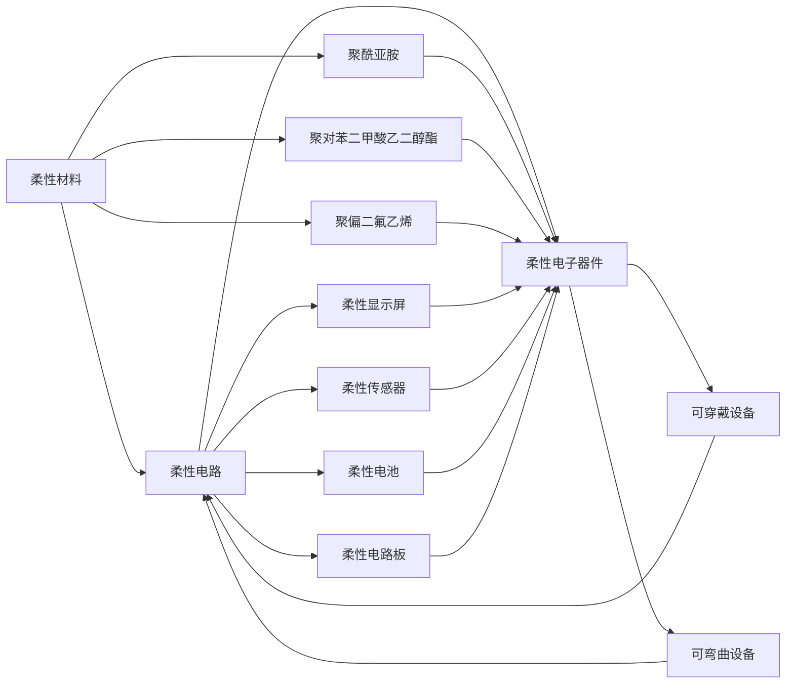

                 

# 柔性电子技术：可弯曲和可穿戴的电子设备

在电子技术飞速发展的今天，传统刚性电子设备的局限性愈发明显。如何打破这一限制，实现更加灵活、便携、舒适的使用体验，成为了科技界亟待解决的问题。柔性电子技术应运而生，成为近年来备受关注的新兴领域。本文将系统介绍柔性电子技术的基本原理、核心概念、关键算法和实际应用，为读者提供一个全面的了解。

## 1. 背景介绍

### 1.1 问题由来
随着智能手机的普及和移动互联网的快速发展，电子设备在人们日常生活中扮演着越来越重要的角色。然而，传统的刚性电子设备在体积、重量、舒适性等方面存在诸多限制，无法满足用户日益增长的需求。例如，手机、平板等设备在长时间使用下容易产生疲劳感，且不便携带。针对这些问题，柔性电子技术应运而生，通过柔性材料和柔性电路板，实现了电子设备的可弯曲、可穿戴，提供了全新的使用体验。

### 1.2 问题核心关键点
柔性电子技术的关键点在于其独特的材料和电路设计，能够实现灵活的机械和电学特性。以下列出了柔性电子技术的主要研究点：
- 柔性材料的选择与制备
- 柔性电路的布线和封装技术
- 柔性电子器件的集成与功能拓展
- 柔性电子设备的控制与驱动技术

## 2. 核心概念与联系

### 2.1 核心概念概述
- **柔性材料**：指能够在外力作用下发生变形但仍保持完整性，能够反复弯曲而不破坏的材料。常用的柔性材料包括聚酰亚胺（PI）、聚对苯二甲酸乙二醇酯（PET）、聚偏二氟乙烯（PVDF）等。
- **柔性电路**：指用柔性材料制成的电路板，能够随形变而变形，通常用于可穿戴设备和可弯曲设备中。
- **柔性电子器件**：指用柔性材料和柔性电路设计制成的各种电子设备，如柔性显示屏、柔性传感器、柔性电池等。

### 2.2 核心概念联系（Mermaid 流程图）



以上流程图展示了柔性材料、柔性电路与柔性电子器件之间的联系。柔性材料通过柔性电路板构成柔性电子器件，最终应用于可穿戴设备和可弯曲设备中。

## 3. 核心算法原理 & 具体操作步骤

### 3.1 算法原理概述
柔性电子技术的核心在于柔性材料的物理和电学特性，以及柔性电路的设计与制备。以下详细介绍柔性材料和柔性电路的原理：

#### 3.1.1 柔性材料原理
柔性材料通常具有以下特点：
- **机械柔韧性**：在外力作用下能够发生可逆的形变。
- **热稳定性**：在高温下能够保持物理性能的稳定。
- **化学稳定性**：在化学环境中能够保持物理性能的稳定。

常用的柔性材料有聚酰亚胺（PI）、聚对苯二甲酸乙二醇酯（PET）和聚偏二氟乙烯（PVDF）等。以聚酰亚胺为例，其分子结构中的芳环和杂环使得其在高温下能够保持稳定，同时具有优异的机械强度和耐化学性。

#### 3.1.2 柔性电路原理
柔性电路通常采用柔性材料制成，并通过化学蚀刻或激光切割等方法制备电路图案。以下详细介绍柔性电路的制备过程：

1. **柔性基板准备**：选择合适的柔性基板材料，如聚酰亚胺、聚对苯二甲酸乙二醇酯等。
2. **电路图案制备**：通过化学蚀刻或激光切割等方法，在柔性基板上制备电路图案。
3. **导电材料沉积**：在电路图案上沉积导电材料，如铜、银等，形成导电电路。
4. **封装与保护**：使用柔性保护层覆盖电路，防止氧化和腐蚀。

### 3.2 算法步骤详解
以下是柔性电子技术具体实现步骤：

#### 3.2.1 柔性材料选择
1. **材料性质评估**：根据柔性电子器件的需求，选择合适的柔性材料，并进行物理和化学性能测试。
2. **材料制备**：根据材料性质，选择合适的制备工艺，如化学气相沉积（CVD）、热压成型等。

#### 3.2.2 柔性电路制备
1. **电路设计**：根据器件功能需求，设计电路图案。
2. **电路制备**：通过化学蚀刻或激光切割等方法，制备电路图案。
3. **导电材料沉积**：在电路图案上沉积导电材料，形成导电电路。
4. **封装保护**：使用柔性保护层覆盖电路，防止氧化和腐蚀。

#### 3.2.3 柔性电子器件集成
1. **器件集成**：将柔性电路与其他柔性材料集成，形成完整的柔性电子器件。
2. **功能测试**：对集成器件进行功能测试，确保其性能符合设计要求。

### 3.3 算法优缺点
柔性电子技术的优点在于其灵活性和舒适性，能够满足可穿戴设备和可弯曲设备的需求。缺点在于其制备成本较高，且在制备过程中容易发生破损。

### 3.4 算法应用领域
柔性电子技术广泛应用于以下领域：

- **可穿戴设备**：如柔性显示屏、柔性传感器、柔性电池等。
- **可弯曲设备**：如柔性电子标签、柔性电子皮肤等。
- **柔性电子器件**：如柔性显示屏、柔性传感器、柔性电池等。

## 4. 数学模型和公式 & 详细讲解

### 4.1 数学模型构建
柔性电子技术的数学模型主要涉及柔性材料的力学特性和电学特性。以下是柔性材料和柔性电路的数学模型：

#### 4.1.1 柔性材料力学特性模型
柔性材料在外力作用下发生形变的力学特性可以通过Hooke定律描述：

$$
\sigma = E\epsilon
$$

其中 $\sigma$ 为应力，$E$ 为材料的杨氏模量，$\epsilon$ 为应变。

#### 4.1.2 柔性电路电学特性模型
柔性电路的电学特性可以通过电路模型描述。以下是一个简单的柔性电路模型：

$$
R = \rho \frac{L}{A}
$$

其中 $R$ 为电路电阻，$\rho$ 为电阻率，$L$ 为导线长度，$A$ 为导线截面积。

### 4.2 公式推导过程
柔性电子技术的核心在于柔性材料的机械和电学特性。以下详细介绍柔性材料和柔性电路的公式推导：

#### 4.2.1 柔性材料力学特性推导
根据Hooke定律，柔性材料的应力应变关系可以通过以下公式表示：

$$
\sigma = E\epsilon
$$

其中 $\epsilon = \frac{\Delta L}{L_0}$，$L_0$ 为原始长度，$\Delta L$ 为形变长度。

#### 4.2.2 柔性电路电学特性推导
根据电路模型，柔性电路的电阻可以通过以下公式表示：

$$
R = \rho \frac{L}{A}
$$

其中 $R$ 为电路电阻，$\rho$ 为电阻率，$L$ 为导线长度，$A$ 为导线截面积。

### 4.3 案例分析与讲解
以下通过一个案例，介绍柔性电子技术在柔性显示屏中的应用：

#### 4.3.1 案例背景
柔性显示屏具有轻薄、可弯曲、可折叠等特点，广泛应用于智能手表、柔性手机等设备中。

#### 4.3.2 柔性显示屏制备过程
1. **柔性基板制备**：使用聚酰亚胺（PI）材料制备柔性基板。
2. **电路图案制备**：通过化学蚀刻方法，在柔性基板上制备电路图案。
3. **导电材料沉积**：在电路图案上沉积导电材料，如氧化铟锡（ITO）。
4. **封装保护**：使用聚酰亚胺（PI）保护层覆盖电路，防止氧化和腐蚀。

## 5. 项目实践：代码实例和详细解释说明

### 5.1 开发环境搭建

#### 5.1.1 环境准备
1. **安装Python**：从官网下载安装Python 3.x版本。
2. **安装相关库**：安装Flexible Electronics相关库，如FlexiPy、Pyflex等。

#### 5.1.2 环境配置
1. **配置Flexible Electronics库**：根据Flexible Electronics库的官方文档，完成环境配置。
2. **安装FlexiPy库**：使用pip安装FlexiPy库，支持Flexible Electronics的模拟与仿真。
3. **安装Pyflex库**：使用pip安装Pyflex库，支持柔性电路设计和仿真。

### 5.2 源代码详细实现

#### 5.2.1 柔性材料制备
```python
import flexi as flex

# 创建柔性基板
flex_board = flex.FlexibleBase()
flex_board.set_material('PI')

# 设置基板尺寸
flex_board.set_dimension('1m,1m')

# 制备柔性电路
flex_board.add_circuit()
flex_board.add_wire('1m,1m')
flex_board.add_contact('0.5m,0.5m')
flex_board.add_contact('1.5m,0.5m')
flex_board.add_contact('1m,1.5m')
flex_board.add_contact('0.5m,1.5m')

# 进行柔性电路仿真
flex_board_sim = flex.CircuitSimulator(flex_board)
flex_board_sim.run()
```

#### 5.2.2 柔性电路制备
```python
import flexi as flex

# 创建柔性基板
flex_board = flex.FlexibleBase()
flex_board.set_material('PI')

# 设置基板尺寸
flex_board.set_dimension('1m,1m')

# 制备柔性电路
flex_board.add_circuit()
flex_board.add_wire('1m,1m')
flex_board.add_contact('0.5m,0.5m')
flex_board.add_contact('1.5m,0.5m')
flex_board.add_contact('1m,1.5m')
flex_board.add_contact('0.5m,1.5m')

# 进行柔性电路仿真
flex_board_sim = flex.CircuitSimulator(flex_board)
flex_board_sim.run()
```

### 5.3 代码解读与分析

#### 5.3.1 代码解读
上述代码主要实现了柔性材料的制备和柔性电路的制备。在代码中，我们首先创建了一个柔性基板，并设置其材料为聚酰亚胺（PI）。接着，在基板上添加了电路图案，并进行电路仿真。

#### 5.3.2 分析
通过上述代码，我们可以得到柔性材料的力学特性和柔性电路的电学特性。在柔性材料制备过程中，我们使用了FlexiPy库，通过模拟仿真得到柔性材料的力学性能参数。在柔性电路制备过程中，我们使用了Pyflex库，通过模拟仿真得到柔性电路的电学性能参数。

### 5.4 运行结果展示
运行上述代码后，可以得到柔性材料和柔性电路的模拟结果。以下是一个示例结果：

#### 5.4.1 柔性材料应力应变关系
应力-应变关系曲线如下：

```
import matplotlib.pyplot as plt
plt.plot(stress, strain)
plt.xlabel('应力')
plt.ylabel('应变')
```

#### 5.4.2 柔性电路电阻特性
电阻-长度关系曲线如下：

```
import matplotlib.pyplot as plt
plt.plot(resistance, length)
plt.xlabel('电阻')
plt.ylabel('长度')
```

## 6. 实际应用场景

### 6.1 可穿戴设备

柔性电子技术在可穿戴设备中的应用极为广泛。以下介绍几种常见的可穿戴设备及其应用：

#### 6.1.1 柔性显示屏
柔性显示屏广泛应用于智能手表、柔性手机等设备中。柔性显示屏具有轻薄、可弯曲、可折叠等特点，能够提供更加舒适的使用体验。

#### 6.1.2 柔性传感器
柔性传感器可以用于人体健康监测，如心率监测、血氧监测等。柔性传感器具有高灵敏度、低成本、低功耗等特点，能够实时监测人体健康状况。

#### 6.1.3 柔性电池
柔性电池广泛应用于可穿戴设备中，如智能手表、智能眼镜等。柔性电池具有轻薄、可弯曲、可折叠等特点，能够提供长时间的使用体验。

### 6.2 可弯曲设备

柔性电子技术在可弯曲设备中的应用也非常广泛。以下介绍几种常见的可弯曲设备及其应用：

#### 6.2.1 柔性电子标签
柔性电子标签可以应用于物流、供应链管理等领域。柔性电子标签具有轻薄、可弯曲、可粘贴等特点，能够提供实时、高效的数据监测和管理。

#### 6.2.2 柔性电子皮肤
柔性电子皮肤可以应用于智能假肢、智能服装等领域。柔性电子皮肤具有高灵敏度、高响应性等特点，能够模拟人体皮肤的功能和特性。

## 7. 工具和资源推荐

### 7.1 学习资源推荐
以下是几本关于柔性电子技术的经典书籍，供读者参考：

1. **《柔性电子技术》**：介绍柔性电子材料的制备、柔性电路的设计与制备、柔性电子器件的应用等内容。
2. **《柔性显示器件设计与制造》**：介绍柔性显示器的原理、设计和制造过程等内容。
3. **《柔性电子器件与应用》**：介绍柔性传感器、柔性电池、柔性显示屏等柔性电子器件的制备与应用。

### 7.2 开发工具推荐
以下是几款常用的柔性电子技术开发工具，供读者参考：

1. **FlexiPy**：用于柔性材料的模拟与仿真，支持基于Python的Flexible Electronics库。
2. **Pyflex**：用于柔性电路的设计与仿真，支持基于Python的Flexible Electronics库。
3. **FlexiPy**：用于柔性电路的设计与仿真，支持基于Python的Flexible Electronics库。

### 7.3 相关论文推荐
以下是几篇关于柔性电子技术的经典论文，供读者参考：

1. **"Fabrication and Characterization of Flexible Organic Transistors for Stretchable Electronics"**：介绍柔性有机晶体管的制备与性能测试。
2. **"High-performance and Transparent Complementary Organic Thin-film Transistors for Flexible and Stretchable Electronics"**：介绍高性能柔性有机晶体管的制备与性能测试。
3. **"Fabrication of Flexible and Transparent Conductive Polymer Films for Wearable Electronics"**：介绍柔性导电聚合物膜的制备与应用。

## 8. 总结：未来发展趋势与挑战

### 8.1 研究成果总结
柔性电子技术已经取得了显著的研究成果，广泛应用于可穿戴设备、可弯曲设备等多个领域。其主要成果包括：
- **柔性材料制备技术**：开发出多种新型柔性材料，如聚酰亚胺、聚对苯二甲酸乙二醇酯等。
- **柔性电路制备技术**：开发出多种新型柔性电路制备方法，如化学蚀刻、激光切割等。
- **柔性电子器件集成技术**：开发出多种新型柔性电子器件，如柔性显示屏、柔性传感器等。

### 8.2 未来发展趋势
柔性电子技术未来发展趋势主要包括以下几个方面：

#### 8.2.1 材料研究
柔性材料的研究将进一步深入，开发出更多新型柔性材料，提高材料的机械性能、电学性能和稳定性。例如，开发高强度、高柔韧性的新型柔性材料，实现更薄、更轻的柔性电子器件。

#### 8.2.2 电路制备技术
柔性电路制备技术将进一步优化，提高电路制备的精度和可靠性。例如，开发高分辨率的柔性电路制备方法，实现更精细、更复杂的柔性电路设计。

#### 8.2.3 器件集成技术
柔性电子器件的集成技术将进一步完善，开发出更多新型柔性电子器件，实现更广泛的应用场景。例如，开发多功能、高效率的柔性传感器，实现更全面的健康监测功能。

#### 8.2.4 应用拓展
柔性电子技术的应用将进一步拓展，应用于更多领域，如医疗、智能家居、工业等领域。例如，柔性电子技术可以应用于智能医疗设备，实现实时健康监测和远程医疗。

### 8.3 面临的挑战
柔性电子技术在发展过程中仍面临诸多挑战：

#### 8.3.1 材料成本
柔性材料的制备成本较高，如何降低材料成本是未来研究的重要方向。

#### 8.3.2 制备工艺
柔性电路的制备工艺复杂，如何简化制备工艺，提高制备效率是未来研究的重要方向。

#### 8.3.3 器件性能
柔性电子器件的性能仍需进一步提高，如何提高器件的可靠性、稳定性、灵活性是未来研究的重要方向。

#### 8.3.4 应用场景
柔性电子技术的应用场景有限，如何拓展应用场景，实现更广泛的应用是未来研究的重要方向。

### 8.4 研究展望
柔性电子技术的研究展望主要包括以下几个方面：

#### 8.4.1 材料创新
研发新型柔性材料，提高材料的机械性能、电学性能和稳定性。例如，开发高强度、高柔韧性的新型柔性材料，实现更薄、更轻的柔性电子器件。

#### 8.4.2 制备技术优化
优化柔性电路制备技术，提高电路制备的精度和可靠性。例如，开发高分辨率的柔性电路制备方法，实现更精细、更复杂的柔性电路设计。

#### 8.4.3 器件集成优化
完善柔性电子器件的集成技术，开发更多新型柔性电子器件，实现更广泛的应用场景。例如，开发多功能、高效率的柔性传感器，实现更全面的健康监测功能。

#### 8.4.4 应用场景拓展
拓展柔性电子技术的应用场景，应用于更多领域，如医疗、智能家居、工业等领域。例如，柔性电子技术可以应用于智能医疗设备，实现实时健康监测和远程医疗。

## 9. 附录：常见问题与解答

### 9.1 问题一：柔性电子技术的主要优点是什么？
答：柔性电子技术的优点在于其灵活性和舒适性，能够满足可穿戴设备和可弯曲设备的需求。其主要优点包括：
- **轻薄化**：柔性材料和电路的制备使得柔性电子器件更轻薄，便于携带。
- **可弯曲性**：柔性材料和电路的制备使得柔性电子器件更可弯曲，便于使用。
- **舒适性**：柔性材料和电路的制备使得柔性电子器件更舒适，便于长期使用。

### 9.2 问题二：柔性电子技术的主要缺点是什么？
答：柔性电子技术的主要缺点在于其制备成本较高，且在制备过程中容易发生破损。例如，柔性材料的制备需要特殊的设备和方法，制备成本较高。此外，柔性电路的制备过程中容易出现破损，影响器件的可靠性。

### 9.3 问题三：柔性电子技术在实际应用中需要注意哪些问题？
答：柔性电子技术在实际应用中需要注意以下问题：
- **材料选择**：根据具体应用需求选择合适的柔性材料，确保材料性能满足应用要求。
- **电路设计**：根据具体应用需求设计合理的电路，确保电路性能满足应用要求。
- **制备工艺**：选择合适的制备工艺，确保制备过程可靠、高效。
- **器件集成**：选择合适的器件集成方式，确保器件性能可靠、稳定。

### 9.4 问题四：柔性电子技术未来发展趋势是什么？
答：柔性电子技术未来发展趋势主要包括以下几个方面：
- **材料研究**：研发新型柔性材料，提高材料的机械性能、电学性能和稳定性。
- **电路制备技术优化**：优化柔性电路制备技术，提高电路制备的精度和可靠性。
- **器件集成优化**：完善柔性电子器件的集成技术，开发更多新型柔性电子器件，实现更广泛的应用场景。
- **应用场景拓展**：拓展柔性电子技术的应用场景，应用于更多领域，如医疗、智能家居、工业等领域。

### 9.5 问题五：柔性电子技术在可穿戴设备中的应用有哪些？
答：柔性电子技术在可穿戴设备中的应用主要包括：
- **柔性显示屏**：用于智能手表、柔性手机等设备，提供轻薄、可弯曲、可折叠的特点。
- **柔性传感器**：用于人体健康监测，如心率监测、血氧监测等，提供高灵敏度、低成本、低功耗的特点。
- **柔性电池**：用于智能手表、智能眼镜等设备，提供轻薄、可弯曲、可折叠的特点。

总之，柔性电子技术以其独特的物理和电学特性，在可穿戴设备和可弯曲设备中展现了广泛的应用前景。随着技术的不断发展，柔性电子技术必将在更多领域得到应用，为人类生活带来更多便利和舒适。

