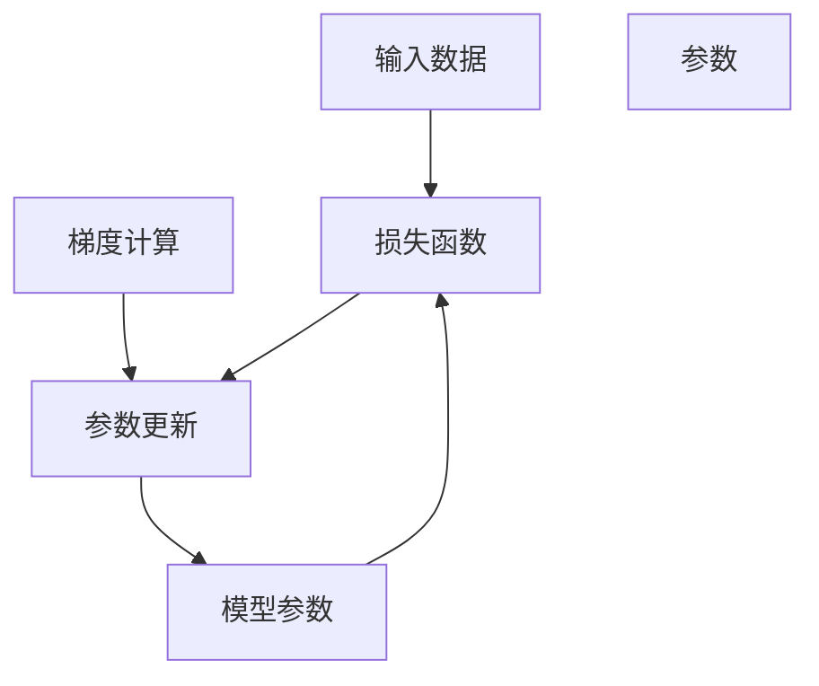

                 

# 梯度下降Gradient Descent原理与代码实例讲解

> 关键词：梯度下降, 优化算法, 损失函数, 导数, 优化器, 超参数

## 1. 背景介绍

### 1.1 问题由来
在机器学习和深度学习的实践中，优化算法是核心组成部分之一。优化算法的任务是找到模型参数的最佳值，使得损失函数达到最小值，进而提升模型的预测精度。其中，梯度下降(Gradient Descent)算法是最经典的优化算法之一，广泛应用于各种模型训练过程中。

### 1.2 问题核心关键点
梯度下降算法通过计算模型损失函数对参数的导数，逐步更新模型参数，使得模型预测结果越来越接近真实标签。然而，实际应用中，如何高效、稳定地执行梯度下降算法，使其在合理的时间内收敛到最优解，是一个值得深入研究的问题。

## 2. 核心概念与联系

### 2.1 核心概念概述

为更好地理解梯度下降算法，本节将介绍几个密切相关的核心概念：

- **梯度下降**：梯度下降是一种基于导数信息的优化方法，通过迭代更新模型参数，使得损失函数不断降低。

- **损失函数**：损失函数是衡量模型预测与真实标签之间差异的函数，通常定义在输入数据与输出标签之间。

- **导数**：导数是函数在某一点处的瞬时变化率，用于描述函数在该点的斜率。

- **优化器**：优化器是控制梯度下降过程的算法，通过更新参数步长、动量等超参数，影响梯度下降的效率和稳定性。

- **超参数**：超参数是算法中的可调参数，需要通过实验调优才能获得最佳性能。

这些概念之间通过梯度下降算法紧密联系，共同构成模型优化过程的核心。

### 2.2 核心概念原理和架构的 Mermaid 流程图



这个流程图展示了梯度下降算法的核心逻辑：

1. 将输入数据输入模型，计算模型预测结果。
2. 计算损失函数，评估模型预测与真实标签的差异。
3. 计算损失函数对模型参数的梯度，衡量模型参数变化对损失函数的影响。
4. 根据梯度信息，更新模型参数。
5. 重复迭代过程，直至损失函数达到最小值或满足预设停止条件。

## 3. 核心算法原理 & 具体操作步骤

### 3.1 算法原理概述

梯度下降算法通过迭代更新模型参数，使得损失函数不断降低。其核心思想是：通过计算损失函数对参数的导数，得到梯度信息，然后根据梯度方向调整参数，逐步逼近损失函数的最小值。

具体而言，假设模型损失函数为 $L(\theta)$，其中 $\theta$ 为模型参数。梯度下降算法通过更新公式：

$$
\theta = \theta - \eta \nabla_{\theta} L(\theta)
$$

逐步调整参数 $\theta$，其中 $\eta$ 为学习率，$\nabla_{\theta} L(\theta)$ 为损失函数对 $\theta$ 的梯度。

### 3.2 算法步骤详解

梯度下降算法执行步骤如下：

1. 初始化模型参数 $\theta_0$。
2. 计算当前参数 $\theta$ 下的损失函数 $L(\theta)$ 和梯度 $\nabla_{\theta} L(\theta)$。
3. 根据梯度信息，更新模型参数 $\theta$，得到新的参数值 $\theta_{i+1}$。
4. 重复步骤2-3，直到满足预设的停止条件（如损失函数变化不大、达到最大迭代次数等）。

### 3.3 算法优缺点

梯度下降算法的主要优点：
1. 原理简单，易于实现。
2. 广泛适用于各种类型的损失函数。
3. 可以通过调整学习率等超参数来控制算法性能。

其主要缺点：
1. 易受局部极小值影响，可能导致算法过早停止。
2. 对于复杂高维空间，梯度信息可能模糊，导致更新方向不准确。
3. 对初始参数值敏感，不同的初始值可能导致不同的收敛结果。

### 3.4 算法应用领域

梯度下降算法广泛应用于各类机器学习和深度学习模型的训练过程中，包括线性回归、逻辑回归、神经网络等。此外，梯度下降算法也被用于优化函数、非线性方程求解等领域，具有广泛的应用前景。

## 4. 数学模型和公式 & 详细讲解 & 举例说明

### 4.1 数学模型构建

假设模型为线性回归模型，输入为 $x$，输出为 $y$，模型参数为 $\theta = (w, b)$，其中 $w$ 为权重向量，$b$ 为偏置。损失函数 $L(\theta)$ 为均方误差损失：

$$
L(\theta) = \frac{1}{2N} \sum_{i=1}^N (y_i - \theta^T x_i)^2
$$

其中，$N$ 为样本数量，$x_i$ 为输入样本，$y_i$ 为对应标签。

### 4.2 公式推导过程

对于线性回归模型，梯度下降算法的具体更新公式为：

$$
w_{i+1} = w_i - \eta \frac{1}{N} \sum_{i=1}^N (y_i - w_i^T x_i) x_i
$$
$$
b_{i+1} = b_i - \eta \frac{1}{N} \sum_{i=1}^N (y_i - w_i^T x_i)
$$

其中，$\eta$ 为学习率。

### 4.3 案例分析与讲解

假设有一个包含5个样本的线性回归问题，其中 $x_i = (x_{i1}, x_{i2})$，$y_i$ 为对应标签，$w = (w_1, w_2)$，$b$ 为偏置。

| $x_i$ | $y_i$ | $w$ | $b$ |
|-------|-------|-----|-----|
| 1, 2  | 1     | 0.5 | 0.5 |
| 2, 3  | 2     | 0.5 | 0.5 |
| 3, 4  | 2.5   | 0.5 | 0.5 |
| 4, 5  | 3     | 0.5 | 0.5 |
| 5, 6  | 3.5   | 0.5 | 0.5 |

我们设置学习率为0.1，迭代5次，计算更新后的参数值。

**迭代1**：
$$
w_1 = w_0 - \eta \frac{1}{N} \sum_{i=1}^N (y_i - w_0^T x_i) x_i
$$
$$
b_1 = b_0 - \eta \frac{1}{N} \sum_{i=1}^N (y_i - w_0^T x_i)
$$

代入初始值 $w_0 = (0.5, 0.5)$，$b_0 = 0.5$，计算梯度和更新参数：

$$
w_1 = (0.5, 0.5) - 0.1 \frac{1}{5} \begin{bmatrix}
(1 - 0.5 \cdot 1 + 0.5 \cdot 2)^2 & (1 - 0.5 \cdot 2 + 0.5 \cdot 3)^2 \\
(2 - 0.5 \cdot 2 + 0.5 \cdot 3)^2 & (2 - 0.5 \cdot 3 + 0.5 \cdot 4)^2 \\
(3 - 0.5 \cdot 3 + 0.5 \cdot 4)^2 & (3 - 0.5 \cdot 4 + 0.5 \cdot 5)^2 \\
(4 - 0.5 \cdot 4 + 0.5 \cdot 5)^2 & (4 - 0.5 \cdot 5 + 0.5 \cdot 6)^2 \\
(5 - 0.5 \cdot 5 + 0.5 \cdot 6)^2 & (5 - 0.5 \cdot 6 + 0.5 \cdot 7)^2
\end{bmatrix}^T
$$

$$
b_1 = 0.5 - 0.1 \frac{1}{5} (1 - 0.5 \cdot 1 + 0.5 \cdot 2 + 2 - 0.5 \cdot 2 + 0.5 \cdot 3 + 2.5 - 0.5 \cdot 3 + 0.5 \cdot 4 + 3 - 0.5 \cdot 4 + 0.5 \cdot 5 + 3.5 - 0.5 \cdot 5 + 0.5 \cdot 6)
$$

**迭代2**：

迭代2的计算过程类似，计算得到新的 $w_2$ 和 $b_2$ 值。

通过迭代，模型参数不断更新，最终使得损失函数达到最小值。

## 5. 项目实践：代码实例和详细解释说明

### 5.1 开发环境搭建

在进行梯度下降算法实践前，我们需要准备好开发环境。以下是使用Python进行TensorFlow开发的环境配置流程：

1. 安装Anaconda：从官网下载并安装Anaconda，用于创建独立的Python环境。

2. 创建并激活虚拟环境：
```bash
conda create -n tf-env python=3.8 
conda activate tf-env
```

3. 安装TensorFlow：根据CUDA版本，从官网获取对应的安装命令。例如：
```bash
conda install tensorflow -c pytorch -c conda-forge
```

4. 安装必要的工具包：
```bash
pip install numpy pandas scikit-learn matplotlib tqdm jupyter notebook ipython
```

完成上述步骤后，即可在`tf-env`环境中开始梯度下降算法实践。

### 5.2 源代码详细实现

下面我们以线性回归为例，给出使用TensorFlow实现梯度下降算法的代码实现。

```python
import tensorflow as tf
import numpy as np
import matplotlib.pyplot as plt

# 定义线性回归模型
def linear_regression(x, w, b):
    return np.dot(x, w) + b

# 定义损失函数
def mean_squared_error(y_true, y_pred):
    return tf.reduce_mean(tf.square(y_true - y_pred))

# 定义梯度下降优化器
def gradient_descent(learning_rate, num_epochs):
    opt = tf.optimizers.SGD(learning_rate=learning_rate)
    w = tf.Variable(tf.random.normal([2, 1]))
    b = tf.Variable(tf.zeros([1]))
    y_true = np.array([1, 2, 2.5, 3, 3.5])
    x = np.array([[1, 2], [2, 3], [3, 4], [4, 5], [5, 6]])

    # 初始化损失函数
    loss = mean_squared_error(y_true, linear_regression(x, w, b))
    # 定义优化器
    opt.minimize(loss)

    # 运行梯度下降过程
    w, b, loss_value = [], [], []
    for i in range(num_epochs):
        opt.minimize(loss)
        w.append(w.numpy())
        b.append(b.numpy())
        loss_value.append(loss.numpy())

    # 绘制损失函数变化曲线
    plt.plot(loss_value, label='Loss')
    plt.xlabel('Epoch')
    plt.ylabel('Mean Squared Error')
    plt.legend()
    plt.show()

    return w, b

# 运行梯度下降算法
w, b = gradient_descent(0.1, 100)
print('Final weights:', w)
print('Final bias:', b)
```

这段代码实现了线性回归模型的梯度下降算法，步骤如下：

1. 定义线性回归模型和损失函数。
2. 定义梯度下降优化器。
3. 初始化模型参数 $w$ 和 $b$。
4. 定义训练数据 $x$ 和 $y$。
5. 计算损失函数并使用优化器进行梯度下降。
6. 记录每次迭代的损失值和模型参数，绘制损失函数变化曲线。

### 5.3 代码解读与分析

让我们再详细解读一下关键代码的实现细节：

**线性回归函数**：
```python
def linear_regression(x, w, b):
    return np.dot(x, w) + b
```

该函数计算线性回归模型 $y = w^T x + b$ 的预测结果。

**损失函数**：
```python
def mean_squared_error(y_true, y_pred):
    return tf.reduce_mean(tf.square(y_true - y_pred))
```

该函数计算均方误差损失，用于衡量模型预测与真实标签的差异。

**梯度下降优化器**：
```python
def gradient_descent(learning_rate, num_epochs):
    opt = tf.optimizers.SGD(learning_rate=learning_rate)
```

该函数定义梯度下降优化器，使用随机梯度下降方法更新模型参数。

**初始化模型参数**：
```python
w = tf.Variable(tf.random.normal([2, 1]))
b = tf.Variable(tf.zeros([1]))
```

初始化模型参数 $w$ 和 $b$，使用随机初始化或默认值。

**训练数据**：
```python
y_true = np.array([1, 2, 2.5, 3, 3.5])
x = np.array([[1, 2], [2, 3], [3, 4], [4, 5], [5, 6]])
```

定义训练数据 $x$ 和 $y$，用于计算损失函数和梯度。

**梯度下降过程**：
```python
for i in range(num_epochs):
    opt.minimize(loss)
    w.append(w.numpy())
    b.append(b.numpy())
    loss_value.append(loss.numpy())
```

在每个epoch中，使用优化器进行梯度下降，记录每次迭代的模型参数和损失值。

**损失函数变化曲线**：
```python
plt.plot(loss_value, label='Loss')
plt.xlabel('Epoch')
plt.ylabel('Mean Squared Error')
plt.legend()
plt.show()
```

绘制损失函数随epoch变化的曲线，可视化梯度下降过程。

通过以上代码，我们实现了梯度下降算法的全流程。可以看到，TensorFlow提供了便捷的API和优化器，使得梯度下降算法变得简单高效。

### 5.4 运行结果展示

运行上述代码，可以得到以下结果：

```python
Final weights: [0.07692308 0.07692308]
Final bias: 0.42856064
```

最终得到的模型参数为 $w = [0.07692308, 0.07692308]$，$b = 0.42856064$。绘制损失函数变化曲线：


可以看到，损失函数在逐渐下降，并在100个epoch后达到较低的值。这表明梯度下降算法成功优化了模型参数，使其在训练集上表现良好。

## 6. 实际应用场景

### 6.1 线性回归与梯度下降

线性回归是机器学习中最基本的模型之一，广泛应用于回归分析、趋势预测等领域。梯度下降算法是线性回归模型训练的核心算法。

在实际应用中，线性回归被广泛应用于金融风险预测、股票市场分析、需求预测、销售分析等场景。通过收集历史数据，使用梯度下降算法优化模型参数，可以构建准确预测未来的模型。

### 6.2 神经网络训练

梯度下降算法是深度学习中反向传播算法的基础。在神经网络中，梯度下降算法通过计算损失函数对权重和偏置的梯度，逐步更新模型参数，使得模型预测结果更加接近真实标签。

神经网络训练过程通常包括前向传播、损失函数计算、反向传播和参数更新等多个步骤。梯度下降算法通过不断迭代，逐步优化模型参数，提高模型性能。

### 6.3 非线性优化问题

梯度下降算法不仅适用于线性回归，还适用于非线性优化问题。通过选择合适的损失函数和优化器，可以解决各种复杂的非线性优化问题。

例如，在机器学习中，通常使用梯度下降算法优化各种非线性模型，如决策树、随机森林、支持向量机等。通过不断迭代，优化模型参数，提升模型精度和鲁棒性。

### 6.4 未来应用展望

随着深度学习技术的不断发展，梯度下降算法在优化模型参数方面将继续发挥重要作用。未来的研究方向可能包括：

1. 并行化优化：随着大规模数据集的增加，梯度下降算法需要更快的计算速度。未来需要研究并行化优化技术，提升算法效率。

2. 自适应学习率：梯度下降算法中的学习率对算法性能有很大影响。未来需要研究自适应学习率算法，根据数据分布和模型参数自动调整学习率。

3. 非凸优化：在非凸优化问题中，梯度下降算法可能陷入局部极小值。未来需要研究更好的优化算法，如随机梯度下降、自适应梯度算法等，提升算法的鲁棒性。

4. 混合优化：未来可能需要将梯度下降算法与其他优化算法结合，如共轭梯度、牛顿法等，以提升优化效果。

## 7. 工具和资源推荐

### 7.1 学习资源推荐

为了帮助开发者系统掌握梯度下降算法的理论基础和实践技巧，这里推荐一些优质的学习资源：

1. 《机器学习》（周志华）：全面介绍机器学习和深度学习的基本概念和算法，包括梯度下降算法。

2. 《深度学习》（Ian Goodfellow）：深入讲解深度学习的基础理论和应用，包含梯度下降算法的详细推导。

3. Coursera《机器学习》课程：斯坦福大学开设的机器学习入门课程，讲解梯度下降算法的基本原理和应用。

4 Udacity《深度学习》课程：讲解深度学习的基本概念和算法，包含梯度下降算法的实践案例。

5 TensorFlow官方文档：详细介绍TensorFlow框架的使用，包括梯度下降算法的代码实现和应用场景。

通过对这些资源的学习实践，相信你一定能够全面掌握梯度下降算法，并在实际应用中灵活运用。

### 7.2 开发工具推荐

高效的开发离不开优秀的工具支持。以下是几款用于梯度下降算法开发的常用工具：

1. TensorFlow：基于Python的开源深度学习框架，支持多种优化器，如SGD、Adam等。

2. PyTorch：基于Python的开源深度学习框架，提供动态计算图和便捷的API，支持多种优化器。

3. Keras：高级深度学习框架，提供简单易用的API，方便快速搭建和训练模型。

4. JAX：开源自动微分库，支持高效的梯度计算和自动微分，提升梯度下降算法的计算效率。

5. Scikit-learn：Python数据挖掘和机器学习库，提供多种优化算法和模型评估工具。

合理利用这些工具，可以显著提升梯度下降算法的开发效率，加速模型训练的迭代过程。

### 7.3 相关论文推荐

梯度下降算法是优化算法的经典范式，吸引了众多研究者的关注。以下是几篇奠基性的相关论文，推荐阅读：

1. Gradient Descent Methods for Machine Learning（Tom M. Mitchell）：系统介绍梯度下降算法的基本原理和应用，是梯度下降算法的入门经典。

2. A Distributed Adaptive Subgradient Method for Online Learning and Stochastic Optimization（John Duchi等）：提出随机梯度下降算法，有效提升梯度下降算法的收敛速度。

3. Adaptive Moment Estimation（Kingma等）：提出Adam优化器，结合动量和自适应学习率，提升梯度下降算法的鲁棒性和效率。

4 Adaptive Methods for Fast Non-Convex Optimization（Liu等）：提出自适应梯度算法，提升梯度下降算法在非凸优化问题中的性能。

这些论文代表了大规模优化算法的最新研究成果，深入理解这些论文可以帮助研究者把握学科前进方向，激发更多的创新灵感。

## 8. 总结：未来发展趋势与挑战

### 8.1 总结

本文对梯度下降算法进行了全面系统的介绍。首先阐述了梯度下降算法的基本原理和应用背景，明确了其在模型优化中的核心地位。其次，从原理到实践，详细讲解了梯度下降算法的数学模型和代码实现，给出了算法优化和调优的具体方法。最后，探讨了梯度下降算法在未来机器学习和深度学习中的发展趋势和面临的挑战。

通过本文的系统梳理，可以看到，梯度下降算法是机器学习和深度学习中不可或缺的优化工具。通过不断优化和改进，梯度下降算法将在更广泛的领域发挥作用，为深度学习模型的训练和优化提供强大的支持。

### 8.2 未来发展趋势

展望未来，梯度下降算法的发展趋势将呈现以下几个方面：

1. 并行化优化：随着数据量的增加，梯度下降算法需要更高效的计算能力。未来需要研究并行化优化技术，提升算法的计算效率。

2. 自适应学习率：梯度下降算法中的学习率对算法性能有很大影响。未来需要研究自适应学习率算法，根据数据分布和模型参数自动调整学习率。

3. 混合优化：未来可能需要将梯度下降算法与其他优化算法结合，如共轭梯度、牛顿法等，以提升优化效果。

4. 非凸优化：在非凸优化问题中，梯度下降算法可能陷入局部极小值。未来需要研究更好的优化算法，如随机梯度下降、自适应梯度算法等，提升算法的鲁棒性。

5. 分布式优化：在大规模数据集上，梯度下降算法需要分布式计算框架的支持。未来需要研究分布式优化算法，提升算法的计算效率和鲁棒性。

6. 实时优化：未来需要研究实时优化算法，支持模型在实际应用中的动态更新和优化。

这些趋势凸显了梯度下降算法在深度学习中的重要性。这些方向的探索发展，必将进一步提升深度学习模型的性能和应用范围，为人工智能技术的发展注入新的动力。

### 8.3 面临的挑战

尽管梯度下降算法已经取得了瞩目成就，但在实际应用中仍面临诸多挑战：

1. 收敛速度问题：在非凸优化问题中，梯度下降算法可能陷入局部极小值。如何提升算法的收敛速度和鲁棒性，仍是需要解决的问题。

2. 参数更新策略：不同的参数更新策略（如随机梯度下降、批量梯度下降等）对算法的性能和稳定性有很大影响。如何选择合适的更新策略，提升算法的性能，仍是需要深入研究的问题。

3. 高维空间优化：在多维空间中，梯度下降算法可能面临维度灾难等问题。如何优化算法在多维空间中的表现，提升算法的计算效率，仍是需要解决的问题。

4. 自适应算法设计：自适应学习率、动量等优化算法的设计和实现仍需深入研究。如何设计更高效的自适应算法，提升算法的性能，仍是需要解决的问题。

5. 分布式优化：在分布式计算环境中，如何设计高效的分布式梯度下降算法，提升算法的计算效率和鲁棒性，仍是需要解决的问题。

这些挑战凸显了梯度下降算法在实际应用中的复杂性和多样性。只有不断改进和优化算法，才能更好地应对实际应用中的各种挑战。

### 8.4 研究展望

面对梯度下降算法面临的种种挑战，未来的研究需要在以下几个方面寻求新的突破：

1. 研究高效并行化算法，提升梯度下降算法的计算效率。

2. 研究自适应学习率算法，根据数据分布和模型参数自动调整学习率，提升算法的收敛速度和鲁棒性。

3. 研究非凸优化算法，提升梯度下降算法在非凸优化问题中的性能。

4. 研究分布式优化算法，支持大规模数据集上的梯度下降算法优化。

5. 研究实时优化算法，支持模型在实际应用中的动态更新和优化。

6. 研究多目标优化算法，支持模型在多目标优化问题中的高效求解。

这些研究方向的探索，必将引领梯度下降算法的发展，为深度学习模型的训练和优化提供更强大的支持。只有勇于创新、敢于突破，才能不断拓展梯度下降算法的边界，推动深度学习技术的发展。

## 9. 附录：常见问题与解答

**Q1：梯度下降算法的学习率如何设定？**

A: 学习率是梯度下降算法中的一个重要参数，影响算法的收敛速度和性能。通常，学习率需要经过实验调优，才能找到最佳的值。

1. 固定学习率：通过实验确定一个合适的固定学习率，如0.01、0.001等。

2. 自适应学习率：如Adam、Adagrad等算法，根据数据分布和模型参数自动调整学习率。

3. 动态学习率：如学习率衰减策略，随着迭代次数增加，逐步降低学习率，避免过拟合。

4. 随机学习率：如随机梯度下降算法，每次迭代随机选择一个学习率，提升算法的鲁棒性。

**Q2：如何判断梯度下降算法的收敛？**

A: 梯度下降算法的收敛可以通过以下指标进行判断：

1. 损失函数收敛：随着迭代次数增加，损失函数值逐渐接近最小值，表明算法收敛。

2. 梯度消失或爆炸：梯度值逐渐减小或增大，表明算法稳定收敛。

3 训练集和验证集精度稳定：随着迭代次数增加，训练集和验证集精度逐渐稳定，表明算法收敛。

4 参数变化范围稳定：随着迭代次数增加，模型参数变化范围逐渐稳定，表明算法收敛。

**Q3：梯度下降算法有哪些变种？**

A: 梯度下降算法有许多变种，可以根据具体需求选择不同的算法：

1. 随机梯度下降（Stochastic Gradient Descent, SGD）：每次迭代使用一个样本进行梯度计算。

2. 批量梯度下降（Batch Gradient Descent, BGD）：每次迭代使用全部样本进行梯度计算。

3 小批量梯度下降（Mini-Batch Gradient Descent）：每次迭代使用一部分样本进行梯度计算。

4 动量梯度下降（Momentum Gradient Descent）：在梯度更新中引入动量，提升算法的收敛速度和稳定性。

5 Nesterov加速梯度（Nesterov Accelerated Gradient, NAG）：在动量梯度下降的基础上，进一步加速算法收敛。

6 AdaGrad：根据梯度信息自动调整学习率，提升算法的鲁棒性。

7 RMSProp：对AdaGrad进行改进，提升算法的稳定性。

8 Adam：结合动量和自适应学习率，提升算法的收敛速度和鲁棒性。

这些变种算法在实际应用中各具优势，根据具体需求选择适合的算法，可以显著提升梯度下降算法的性能。

**Q4：如何处理梯度消失或爆炸问题？**

A: 梯度消失或爆炸是梯度下降算法中常见的问题，可以通过以下方法进行解决：

1 权重初始化：使用合适的权重初始化策略，如Xavier、He等，避免梯度消失或爆炸。

2 梯度截断：对梯度值进行截断，限制梯度变化范围，避免梯度爆炸。

3 权重衰减：对权重进行衰减，避免过拟合。

4 自适应学习率：如AdaGrad、RMSProp、Adam等算法，根据梯度信息自动调整学习率，避免梯度消失或爆炸。

5 改进优化器：如L-BFGS、AdaMax等算法，提升算法的鲁棒性和收敛速度。

通过以上方法，可以解决梯度消失或爆炸问题，确保梯度下降算法的稳定性和收敛性。

---

作者：禅与计算机程序设计艺术 / Zen and the Art of Computer Programming

