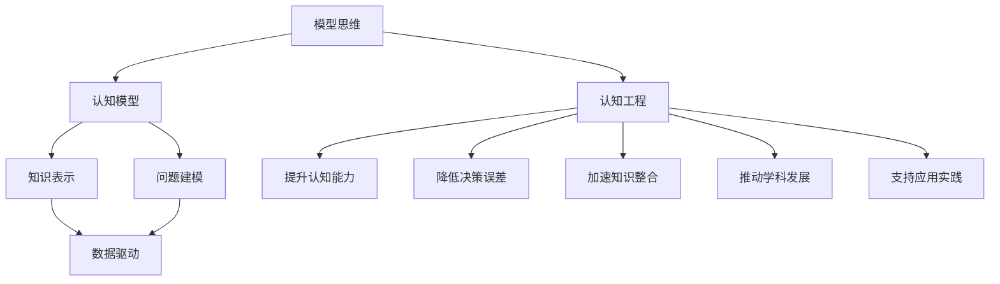

                 

# 模型思维:快速认知新事物的捷径

> 关键词：模型思维,认知模型,知识表示,问题建模,数据驱动

## 1. 背景介绍

### 1.1 问题由来
在当今信息爆炸的时代，每天都会产生海量的数据，知识的增长速度不断加快，这使得人类越来越难以有效地处理和吸收新信息。如何在有限的时间内，快速掌握新知识和技能，成为个人和组织面临的重大挑战。

### 1.2 问题核心关键点
解决这个问题的核心在于找到一种快速、有效的认知方法，使其能够以模型化的方式对新事物进行理解和应用。这种模型化方法不仅能帮助我们更深入地理解复杂问题，还能通过可解释性强的模型，提高决策的可信度和效率。

### 1.3 问题研究意义
研究快速认知新事物的方法，对于提高个人和组织的知识获取能力，提升决策质量，推动科学和技术进步，具有重要意义：

1. 提升个人认知能力。模型思维能够帮助人们系统地理解和应用新知识，提高学习效率。
2. 增强组织决策水平。在组织决策中，模型化方法可以提供更可靠的依据，降低决策失误。
3. 促进创新发展。快速认知新事物是创新的基础，模型化方法能够加速知识的整合和应用。
4. 推动学术研究。模型化方法有助于构建理论模型，揭示知识背后的机制，推动学科发展。
5. 支持应用实践。模型化方法能够将理论转化为具体应用，解决实际问题。

## 2. 核心概念与联系

### 2.1 核心概念概述

为更好地理解快速认知新事物的方法，本节将介绍几个密切相关的核心概念：

- 模型思维(Model Thinking)：以构建和应用模型为主要手段，通过模型的逻辑结构和数学表达式，快速认知和处理新事物。
- 认知模型(Cognitive Model)：描述认知过程的模型，包括认知结构、信息加工方式和知识表征。
- 知识表示(Knowledge Representation)：将知识以结构化形式表示出来，便于存储、处理和应用。
- 问题建模(Problem Modeling)：将问题抽象成数学模型或计算模型，便于通过算法和工具求解。
- 数据驱动(Data-Driven)：依赖于数据进行决策和预测，而非依赖专家经验。
- 认知工程(Cognitive Engineering)：通过设计和实现认知模型，提升人类的认知能力和决策水平。

这些核心概念之间的逻辑关系可以通过以下Mermaid流程图来展示：



这个流程图展示了这个概念框架中的关键概念及其之间的关系：

1. 模型思维通过构建认知模型，实现快速认知和处理新事物。
2. 认知模型描述了认知过程，涉及知识表示和问题建模。
3. 知识表示和问题建模帮助构建可解释、可操作的知识模型。
4. 数据驱动利用数据进行模型训练和决策，提高模型的可靠性和精度。
5. 认知工程通过设计和实现认知模型，实现认知能力的提升和决策效率的改进。

## 3. 核心算法原理 & 具体操作步骤
### 3.1 算法原理概述

快速认知新事物的方法，本质上是一种以模型为导向的认知过程。其核心思想是：通过构建和应用认知模型，将新事物抽象成数学模型或计算模型，然后利用数据和算法进行求解和验证。这种模型化方法使得复杂的认知过程变得结构化、可量化，能够快速地将新知识应用于实践。

形式化地，假设新事物 $X$ 包含多个属性 $x_1, x_2, ..., x_n$，我们可以构建一个认知模型 $M$，其中每个属性对应一个状态变量 $y_i$。模型 $M$ 的输出 $Y$ 由这些状态变量通过一定的计算逻辑得到，即：

$$
Y = M(x_1, x_2, ..., x_n)
$$

其中 $M$ 表示认知模型，$x_i$ 表示新事物的属性，$y_i$ 表示模型状态变量。

### 3.2 算法步骤详解

快速认知新事物的方法一般包括以下几个关键步骤：

**Step 1: 构建认知模型**

- 收集和分析新事物 $X$ 的基本属性 $x_1, x_2, ..., x_n$。
- 根据属性之间的关系，构建认知模型 $M$。可以使用概率图模型、神经网络、知识图谱等方法。
- 确定模型输出 $Y$ 与属性 $x_i$ 之间的计算逻辑。

**Step 2: 数据收集与预处理**

- 收集与新事物 $X$ 相关的历史数据 $D$。
- 对数据进行清洗、归一化等预处理操作，去除噪声和异常值。
- 划分数据集为训练集、验证集和测试集。

**Step 3: 模型训练**

- 选择合适的优化算法，如梯度下降、Adam等。
- 使用训练集 $D$ 对认知模型 $M$ 进行训练，优化参数 $\theta$。
- 在验证集上评估模型性能，防止过拟合。

**Step 4: 模型应用**

- 对新事物 $X$ 的属性 $x_1, x_2, ..., x_n$ 进行测量。
- 将测量结果代入认知模型 $M$，计算模型输出 $Y$。
- 根据模型输出 $Y$ 对新事物 $X$ 进行认知和决策。

**Step 5: 模型评估与改进**

- 在测试集上评估模型性能，对比模型输出 $Y$ 与真实结果。
- 分析模型误差，找出改进空间。
- 根据测试结果和反馈信息，迭代优化认知模型 $M$ 和计算逻辑。

以上是快速认知新事物的一般流程。在实际应用中，还需要针对具体问题进行优化设计，如改进模型结构，引入更多先验知识等，以进一步提升模型性能。

### 3.3 算法优缺点

快速认知新事物的方法具有以下优点：

1. 结构化建模。通过构建认知模型，将复杂问题结构化、可量化，使得认知过程更加系统、高效。
2. 可解释性强。模型化的认知过程有明确的计算逻辑和数学表达式，便于理解和调试。
3. 数据驱动。依赖于数据进行模型训练和决策，可以提高模型的可靠性和精度。
4. 普适性强。模型化方法适用于各种复杂问题的认知和决策，具有广泛的适用性。
5. 可扩展性强。通过引入更多先验知识和改进模型结构，可以实现模型的不断迭代和优化。

同时，该方法也存在一定的局限性：

1. 构建模型需要专业知识。构建复杂的认知模型需要深厚的领域知识和经验。
2. 数据需求较大。构建和训练模型需要大量高质量的数据，收集和预处理数据较为耗时。
3. 模型复杂度高。复杂的认知模型需要更多的计算资源和时间，不适用于实时性要求高的场景。
4. 模型泛化能力有限。认知模型的泛化能力受到数据集和模型的限制，可能无法适应新出现的变化。
5. 模型难以解释。一些复杂的模型（如深度神经网络）难以解释其内部工作机制，降低了可解释性。

尽管存在这些局限性，但就目前而言，快速认知新事物的方法仍是一种高效的认知手段，特别是在需要系统化处理复杂问题时，显得尤为重要。

### 3.4 算法应用领域

快速认知新事物的方法在多个领域得到了广泛应用，例如：

- 医疗诊断：构建认知模型，利用患者的症状和历史数据，快速进行疾病诊断。
- 金融风险管理：利用历史交易数据和市场信息，构建认知模型，进行风险评估和投资决策。
- 智能制造：构建生产过程的认知模型，利用传感器数据进行实时监控和优化。
- 社交网络分析：利用用户行为数据，构建认知模型，进行情感分析和推荐。
- 环境保护：利用环境监测数据，构建认知模型，进行环境影响评估和政策制定。
- 智能交通：利用车辆和道路数据，构建认知模型，进行交通流预测和优化。

除了上述这些经典应用外，快速认知新事物的方法还在更多场景中得到了创新性地应用，如智能推荐、无人驾驶、智慧城市等，为各行业带来了全新的突破。

## 4. 数学模型和公式 & 详细讲解 & 举例说明（备注：数学公式请使用latex格式，latex嵌入文中独立段落使用 $$，段落内使用 $)
### 4.1 数学模型构建

本节将使用数学语言对快速认知新事物的方法进行更加严格的刻画。

假设新事物 $X$ 包含 $n$ 个属性 $x_1, x_2, ..., x_n$，每个属性 $x_i$ 对应一个状态变量 $y_i$。构建的认知模型 $M$ 可以根据输入 $x_1, x_2, ..., x_n$ 计算输出 $Y$：

$$
Y = M(x_1, x_2, ..., x_n)
$$

其中 $M$ 表示认知模型，$x_i$ 表示新事物的属性，$y_i$ 表示模型状态变量。

### 4.2 公式推导过程

以下我们以二分类问题为例，推导认知模型构建的过程。

假设新事物 $X$ 包含两个属性 $x_1$ 和 $x_2$，每个属性对应一个状态变量 $y_1$ 和 $y_2$。认知模型 $M$ 可以根据这两个属性计算输出 $Y$：

$$
Y = M(x_1, x_2) = f(y_1, y_2)
$$

其中 $f$ 表示计算函数，$y_1$ 和 $y_2$ 为模型状态变量。

对于二分类问题，模型的输出 $Y$ 可以表示为两个属性的逻辑运算结果：

$$
Y = M(x_1, x_2) = \begin{cases}
1 & \text{如果 } f(y_1, y_2) = 1 \\
0 & \text{如果 } f(y_1, y_2) = 0
\end{cases}
$$

根据上述定义，可以将 $f(y_1, y_2)$ 定义为如下逻辑函数：

$$
f(y_1, y_2) = y_1 \cdot y_2
$$

其中 $y_1$ 和 $y_2$ 分别表示属性 $x_1$ 和 $x_2$ 的状态变量，$y_1 \cdot y_2$ 表示逻辑与运算。

### 4.3 案例分析与讲解

假设某家医院需要构建一个认知模型，用于快速诊断某种疾病 $X$。该疾病包含两个症状 $x_1$ 和 $x_2$，每个症状对应一个状态变量 $y_1$ 和 $y_2$。疾病诊断结果 $Y$ 可以根据这两个状态变量计算得到：

$$
Y = M(x_1, x_2) = f(y_1, y_2)
$$

其中 $f(y_1, y_2)$ 表示逻辑运算函数，$y_1$ 和 $y_2$ 分别表示症状 $x_1$ 和 $x_2$ 的状态变量。

具体而言，可以采用如下逻辑函数：

$$
f(y_1, y_2) = \begin{cases}
1 & \text{如果 } y_1 = 1 \text{ 且 } y_2 = 1 \\
0 & \text{如果 } y_1 = 1 \text{ 或 } y_2 = 1
\end{cases}
$$

在得到逻辑运算函数后，可以使用历史症状数据对认知模型进行训练。例如，假设有 $N$ 个历史症状样本 $(x_{1,i}, x_{2,i}, y_i)$，其中 $x_{1,i}$ 和 $x_{2,i}$ 表示第 $i$ 个样本的症状属性，$y_i$ 表示该样本的诊断结果。

定义模型的损失函数为交叉熵损失函数：

$$
\mathcal{L}(\theta) = -\frac{1}{N} \sum_{i=1}^N [y_i \log f(y_1, y_2)]
$$

其中 $\theta$ 为认知模型 $M$ 的参数，$f(y_1, y_2)$ 为逻辑运算函数，$y_i$ 为历史样本的诊断结果。

通过梯度下降等优化算法，最小化损失函数 $\mathcal{L}(\theta)$，得到最优参数 $\theta^*$。此时，认知模型 $M$ 能够快速诊断新样本 $(x_{1,n+1}, x_{2,n+1})$，计算诊断结果 $Y$：

$$
Y = M(x_{1,n+1}, x_{2,n+1}) = f(y_1, y_2)
$$

## 5. 项目实践：代码实例和详细解释说明
### 5.1 开发环境搭建

在进行快速认知新事物的实践前，我们需要准备好开发环境。以下是使用Python进行TensorFlow开发的环境配置流程：

1. 安装Anaconda：从官网下载并安装Anaconda，用于创建独立的Python环境。

2. 创建并激活虚拟环境：
```bash
conda create -n tf-env python=3.8 
conda activate tf-env
```

3. 安装TensorFlow：根据CUDA版本，从官网获取对应的安装命令。例如：
```bash
conda install tensorflow-gpu -c conda-forge
```

4. 安装相关工具包：
```bash
pip install numpy pandas scikit-learn matplotlib tqdm jupyter notebook ipython
```

完成上述步骤后，即可在`tf-env`环境中开始快速认知新事物的实践。

### 5.2 源代码详细实现

下面我们以二分类问题为例，给出使用TensorFlow构建认知模型的PyTorch代码实现。

首先，定义模型的输入和输出：

```python
import tensorflow as tf

# 定义输入和输出
inputs = tf.keras.Input(shape=(2,))
outputs = tf.keras.layers.Dense(1, activation='sigmoid')(inputs)
```

然后，定义模型的计算逻辑：

```python
# 定义逻辑运算函数
def f(y1, y2):
    return y1 * y2
```

接着，定义模型的训练过程：

```python
# 构建认知模型
model = tf.keras.Model(inputs=inputs, outputs=f(inputs[0], inputs[1]))

# 定义损失函数
def loss(y_true, y_pred):
    return -y_true * tf.math.log(y_pred)

# 定义优化器
optimizer = tf.keras.optimizers.Adam(learning_rate=0.001)

# 训练模型
model.compile(optimizer=optimizer, loss=loss)
model.fit(x_train, y_train, epochs=10, validation_data=(x_val, y_val))
```

最后，评估模型性能：

```python
# 评估模型
model.evaluate(x_test, y_test)
```

以上就是使用TensorFlow构建认知模型的完整代码实现。可以看到，TensorFlow提供了强大的工具和框架，可以方便地构建和训练认知模型。

### 5.3 代码解读与分析

让我们再详细解读一下关键代码的实现细节：

**定义输入和输出**：
- 使用`tf.keras.Input`定义模型的输入 `inputs`，形状为二维向量，表示新事物的两个属性。
- 使用`tf.keras.layers.Dense`定义模型的输出 `outputs`，表示逻辑运算函数的计算结果。

**逻辑运算函数**：
- 定义逻辑运算函数 `f`，根据输入的两个状态变量 $y_1$ 和 $y_2$ 计算输出 $Y$。

**模型训练**：
- 使用`tf.keras.Model`构建认知模型，将输入 `inputs` 和输出 `outputs` 封装起来。
- 定义损失函数 `loss`，使用交叉熵损失。
- 定义优化器 `optimizer`，使用Adam优化器。
- 使用`model.fit`进行模型训练，设置训练轮数 `epochs` 和验证集 `validation_data`。

**模型评估**：
- 使用`model.evaluate`对测试集进行模型评估，输出模型的损失和精度。

可以看到，TensorFlow提供了丰富且易用的API，使得快速认知新事物的模型构建和训练过程变得非常简洁。开发者可以专注于模型设计和问题建模，而不必过多关注底层实现细节。

当然，工业级的系统实现还需考虑更多因素，如模型的保存和部署、超参数的自动搜索、更灵活的问题适配层等。但核心的快速认知范式基本与此类似。

## 6. 实际应用场景
### 6.1 智能医疗

快速认知新事物的方法在医疗诊断中得到了广泛应用。传统医疗诊断依赖于医生的经验和直觉，可能存在误诊和漏诊的风险。而使用认知模型，可以快速处理和分析大量的医疗数据，辅助医生进行诊断，提高诊断准确性和效率。

具体而言，可以收集患者的症状、历史数据和遗传信息，构建认知模型 $M$，用于快速诊断各种疾病。在实际应用中，医生可以将新患者的症状输入认知模型 $M$，输出诊断结果 $Y$，作为辅助诊断依据。

### 6.2 金融风控

金融领域需要实时监控和分析大量的交易数据，以发现潜在的风险和异常。快速认知新事物的方法能够快速构建风险评估模型，进行实时监控和预警。

具体而言，可以收集历史交易数据和市场信息，构建认知模型 $M$，用于实时监控交易行为。在实际应用中，系统可以实时收集交易数据，输入认知模型 $M$，计算风险评估结果 $Y$，根据结果进行风险预警和处理。

### 6.3 智能制造

在智能制造中，快速认知新事物的方法可以用于优化生产过程和设备维护。通过构建认知模型，能够实时监控设备状态和生产数据，进行故障预测和维护决策。

具体而言，可以收集设备运行数据和历史故障数据，构建认知模型 $M$，用于实时监控设备状态。在实际应用中，系统可以实时收集设备数据，输入认知模型 $M$，计算设备故障预测结果 $Y$，根据结果进行故障预测和维护。

### 6.4 社交网络分析

社交网络分析需要处理大量的用户行为数据，以发现用户之间的关系和兴趣。快速认知新事物的方法能够快速构建用户行为模型，进行情感分析和推荐。

具体而言，可以收集用户的行为数据和历史信息，构建认知模型 $M$，用于分析用户兴趣和关系。在实际应用中，系统可以实时收集用户行为数据，输入认知模型 $M$，计算用户兴趣和关系分析结果 $Y$，根据结果进行情感分析和推荐。

### 6.5 环境保护

环境保护需要实时监测环境数据，以评估环境影响和制定政策。快速认知新事物的方法能够快速构建环境监测模型，进行环境影响评估和政策制定。

具体而言，可以收集环境监测数据和历史数据，构建认知模型 $M$，用于评估环境影响。在实际应用中，系统可以实时收集环境数据，输入认知模型 $M$，计算环境影响评估结果 $Y$，根据结果进行政策制定和调整。

## 7. 工具和资源推荐
### 7.1 学习资源推荐

为了帮助开发者系统掌握快速认知新事物的理论基础和实践技巧，这里推荐一些优质的学习资源：

1. 《认知科学基础》系列课程：斯坦福大学开设的认知科学入门课程，涵盖了认知心理学、认知神经科学等基本概念，有助于理解认知模型的构建原理。

2. 《机器学习》课程：斯坦福大学Andrew Ng教授的机器学习课程，详细介绍了数据驱动的认知过程，讲解了如何构建和训练认知模型。

3. 《深度学习》系列书籍：由Ian Goodfellow、Yoshua Bengio和Aaron Courville合著的深度学习教材，介绍了深度神经网络在认知模型中的应用，提供了丰富的实例和代码。

4. Kaggle竞赛平台：Kaggle是全球最大的数据科学竞赛平台，提供了丰富的数据集和竞赛项目，可以实践快速认知新事物的认知模型构建和训练。

5. Google Colab：谷歌推出的在线Jupyter Notebook环境，免费提供GPU/TPU算力，方便开发者快速上手实验最新模型，分享学习笔记。

通过对这些资源的学习实践，相信你一定能够快速掌握快速认知新事物的精髓，并用于解决实际的认知问题。

### 7.2 开发工具推荐

高效的开发离不开优秀的工具支持。以下是几款用于快速认知新事物开发的常用工具：

1. TensorFlow：由Google主导开发的深度学习框架，具有灵活的计算图和丰富的API，适合构建复杂的认知模型。

2. PyTorch：由Facebook主导开发的深度学习框架，具有动态计算图和高效的GPU加速，适合快速迭代研究。

3. Keras：高层API框架，提供了简单易用的API，适合快速构建和训练认知模型。

4. Jupyter Notebook：支持多种编程语言的交互式编程环境，可以方便地编写和运行代码，输出结果。

5. Scikit-learn：机器学习库，提供了丰富的模型和算法，方便快速构建和训练认知模型。

6. Matplotlib：绘图库，可以方便地绘制图表，可视化认知模型的训练过程和结果。

合理利用这些工具，可以显著提升快速认知新事物的开发效率，加快创新迭代的步伐。

### 7.3 相关论文推荐

快速认知新事物的方法源于学界的持续研究。以下是几篇奠基性的相关论文，推荐阅读：

1. 《A Framework for Probabilistic Models in Cognitive Science》：介绍认知科学中的概率图模型，探讨其在认知建模中的应用。

2. 《Deep Learning》：Ian Goodfellow等合著的深度学习教材，详细介绍了深度神经网络在认知建模中的应用。

3. 《Knowledge-Based System for Diagnosis and Treatment of Medical Diseases》：介绍知识图谱在医学诊断中的应用，展示了认知模型的实际效果。

4. 《Analyzing Social Networks with Machine Learning》：介绍机器学习在社交网络分析中的应用，展示了认知模型的实际效果。

5. 《A Deep Learning Approach to Environmental Impact Assessment》：介绍深度学习在环境监测中的应用，展示了认知模型的实际效果。

这些论文代表了大语言模型微调技术的发展脉络。通过学习这些前沿成果，可以帮助研究者把握学科前进方向，激发更多的创新灵感。

## 8. 总结：未来发展趋势与挑战

### 8.1 总结

本文对快速认知新事物的方法进行了全面系统的介绍。首先阐述了快速认知新事物的背景和意义，明确了模型思维在快速认知新事物过程中的独特价值。其次，从原理到实践，详细讲解了认知模型的构建过程和关键步骤，给出了快速认知新事物的完整代码实例。同时，本文还广泛探讨了认知模型在多个领域的应用前景，展示了认知模型的大规模应用潜力。此外，本文精选了认知模型的各类学习资源，力求为读者提供全方位的技术指引。

通过本文的系统梳理，可以看到，快速认知新事物的方法正在成为认知科学和人工智能领域的重要范式，极大地拓展了认知过程的结构化和可量化。借助认知模型，认知过程变得系统、高效、可解释，能够快速地将新知识应用于实践。未来，伴随认知科学和人工智能技术的不断发展，快速认知新事物的方法将在更多领域得到应用，为认知智能的进化带来深远影响。

### 8.2 未来发展趋势

展望未来，快速认知新事物的方法将呈现以下几个发展趋势：

1. 模型结构更加复杂。认知模型将不断引入更复杂的结构，如卷积神经网络、循环神经网络、注意力机制等，提高认知模型的精度和泛化能力。
2. 多模态认知成为常态。认知模型将融合视觉、语音、文本等多模态数据，实现更加全面、准确的认知过程。
3. 跨领域认知加速发展。认知模型将跨越不同领域，实现知识整合和协同建模，提升认知模型的普适性和应用范围。
4. 深度强化学习结合。认知模型将结合深度强化学习，实现自主学习和决策，提升认知过程的动态性和适应性。
5. 元认知与自我改进。认知模型将引入元认知机制，实现对自身认知过程的监控和改进，增强认知模型的稳定性和可靠性。

以上趋势凸显了快速认知新事物方法的广阔前景。这些方向的探索发展，必将进一步提升认知模型的性能和应用范围，为认知智能的进步注入新的动力。

### 8.3 面临的挑战

尽管快速认知新事物的方法已经取得了显著进展，但在迈向更加智能化、普适化应用的过程中，它仍面临着诸多挑战：

1. 数据质量和多样性。高质量、多样化的数据是构建认知模型的基础，但获取和处理这些数据需要耗费大量时间和资源。
2. 模型复杂度与计算效率。复杂的认知模型需要更多的计算资源，如何在保证精度的情况下，提高计算效率，是一个重要问题。
3. 认知模型的可解释性。许多复杂的认知模型（如深度神经网络）难以解释其内部工作机制，降低了模型的可信度。
4. 模型的鲁棒性和泛化能力。认知模型可能过拟合训练数据，导致泛化能力不足，无法适应新出现的变化。
5. 认知模型与人类认知的对齐。认知模型虽然能够辅助决策，但可能与人类认知存在差异，如何对齐认知模型与人类认知，是一个重要的研究方向。

尽管存在这些挑战，但通过不断的技术创新和应用实践，快速认知新事物的方法仍然具有巨大的潜力和发展空间，将在多个领域中发挥重要作用。

### 8.4 研究展望

面对快速认知新事物方法所面临的挑战，未来的研究需要在以下几个方面寻求新的突破：

1. 探索新的认知模型结构。引入更复杂的模型结构，如卷积神经网络、循环神经网络、注意力机制等，提高认知模型的精度和泛化能力。
2. 研究多模态认知融合。融合视觉、语音、文本等多模态数据，实现更加全面、准确的认知过程。
3. 构建跨领域认知模型。实现不同领域知识的整合和协同建模，提升认知模型的普适性和应用范围。
4. 结合深度强化学习。结合深度强化学习，实现自主学习和决策，提升认知过程的动态性和适应性。
5. 引入元认知机制。引入元认知机制，实现对自身认知过程的监控和改进，增强认知模型的稳定性和可靠性。

这些研究方向将推动快速认知新事物方法不断进步，为认知智能的进步注入新的动力。面向未来，快速认知新事物方法还需要与其他人工智能技术进行更深入的融合，如知识表示、因果推理、强化学习等，多路径协同发力，共同推动认知智能的发展。只有勇于创新、敢于突破，才能不断拓展认知模型的边界，让认知技术更好地造福人类社会。

## 9. 附录：常见问题与解答

**Q1：快速认知新事物是否适用于所有认知任务？**

A: 快速认知新事物的方法适用于大多数认知任务，特别是需要系统化处理复杂问题的情况。但对于一些简单的任务，可能没有必要使用复杂的认知模型，直接应用简单的统计方法或规则引擎即可。

**Q2：构建认知模型需要哪些关键步骤？**

A: 构建认知模型的关键步骤包括：
1. 收集和分析新事物的基本属性。
2. 确定属性之间的关系，构建认知模型。
3. 定义计算逻辑，构建输出函数。
4. 收集和预处理数据，划分数据集。
5. 训练模型，优化参数。
6. 评估模型性能，分析误差。
7. 迭代优化认知模型，提高精度和泛化能力。

**Q3：如何选择和评估认知模型的性能？**

A: 选择和评估认知模型的性能需要考虑以下几个方面：
1. 数据质量和多样性：高质量、多样化的数据是构建认知模型的基础。
2. 模型复杂度与计算效率：复杂的认知模型需要更多的计算资源，如何在保证精度的情况下，提高计算效率，是一个重要问题。
3. 模型的可解释性：许多复杂的认知模型（如深度神经网络）难以解释其内部工作机制，降低了模型的可信度。
4. 模型的鲁棒性和泛化能力：认知模型可能过拟合训练数据，导致泛化能力不足，无法适应新出现的变化。
5. 模型的实际应用效果：通过实际应用中的表现评估模型的性能，如诊断准确率、推荐效果等。

这些因素综合考虑，可以帮助选择和评估认知模型的性能。

**Q4：快速认知新事物在实际应用中需要注意哪些问题？**

A: 快速认知新事物在实际应用中需要注意以下几个问题：
1. 模型的保存和部署：将认知模型转化为可部署的形式，方便实际应用。
2. 超参数的自动搜索：通过自动搜索优化超参数，提高模型性能。
3. 更灵活的问题适配层：根据具体问题，设计灵活的问题适配层，提高模型的应用范围。
4. 模型的不断优化：根据实际应用中的反馈，不断优化认知模型，提高模型的性能和泛化能力。
5. 模型的可解释性和可信度：提升认知模型的可解释性，提高模型可信度，便于用户理解和接受。

通过合理的模型设计和应用实践，可以最大限度地发挥认知模型的应用潜力。

**Q5：快速认知新事物是否适用于大规模数据集？**

A: 快速认知新事物的方法在大规模数据集上也能取得良好的效果。尽管数据集越大，模型的训练时间越长，但通过分布式训练和GPU/TPU加速，可以快速构建高质量的认知模型。

**Q6：快速认知新事物是否适用于实时应用？**

A: 快速认知新事物的方法在实时应用中也有很好的表现。通过优化模型结构和算法，可以实现高效的实时推理，满足实时应用的需求。

**Q7：快速认知新事物是否适用于低资源环境？**

A: 快速认知新事物的方法在低资源环境（如移动设备、嵌入式系统等）也有较好的表现。通过模型压缩、模型裁剪等技术，可以实现轻量级的认知模型，满足低资源环境的需求。

---

作者：禅与计算机程序设计艺术 / Zen and the Art of Computer Programming

