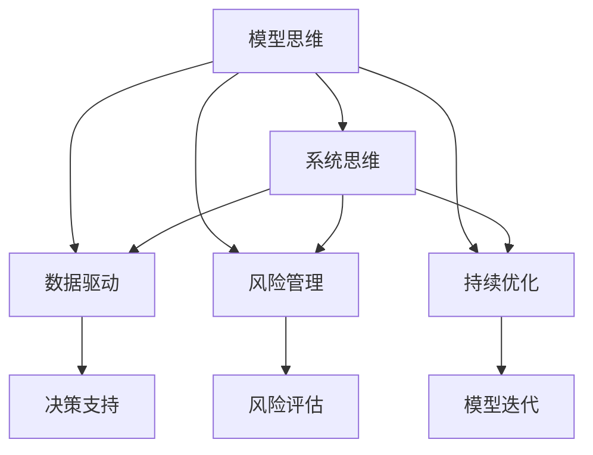

                 

# 模型思维在管理培训中的运用

> 关键词：模型思维，管理培训，领导力培养，系统思维，数据驱动，组织变革

## 1. 背景介绍

### 1.1 问题由来

随着企业环境的日益复杂化，管理者的决策过程也变得更加复杂和不确定。在快速变化的市场环境中，管理者需要具备系统的思维能力，能够从多个维度理解和分析问题，找到最优解决方案。而传统的基于经验的管理培训往往无法满足这一需求，缺乏系统的思维框架和方法。因此，如何在管理培训中引入模型思维，培养管理者的系统思维能力，成为现代培训的重要课题。

### 1.2 问题核心关键点

模型思维是一种基于数据和逻辑，从多个角度理解和分析问题的思维方式。将模型思维引入管理培训，可以帮助管理者建立系统化的思维框架，提高决策的科学性和系统性。具体而言，模型思维在管理培训中的运用可以体现在以下几个方面：

- **数据驱动决策**：通过数据和模型的分析，帮助管理者从多个角度理解和分析问题，找到最优解决方案。
- **系统化思维**：建立系统的思维框架，提高管理者对复杂问题的分析和解决能力。
- **风险管理**：通过模型预测和评估，帮助管理者识别和规避潜在的风险和不确定性。
- **持续优化**：通过迭代优化模型，提升管理者的决策能力和效果。

## 2. 核心概念与联系

### 2.1 核心概念概述

为了更好地理解模型思维在管理培训中的应用，本节将介绍几个关键概念及其之间的关系：

- **模型思维**：一种基于数据和逻辑的思维方式，通过构建模型来理解和分析问题，提升决策的科学性和系统性。
- **系统思维**：一种从整体出发，考虑各部分之间相互作用和关联的思维方式。
- **数据驱动**：以数据为依据，通过分析数据和建立模型，辅助决策和规划。
- **风险管理**：识别、评估和规避潜在的风险和不确定性，提升决策的鲁棒性。
- **持续优化**：通过迭代优化模型和算法，提升决策效果和能力。

这些概念之间的关系可以通过以下Mermaid流程图来展示：



这个流程图展示了模型思维与其他核心概念之间的联系：

1. **模型思维**：通过构建模型来理解和分析问题。
2. **系统思维**：从整体出发，考虑各部分之间的相互作用和关联。
3. **数据驱动**：以数据为依据，通过模型辅助决策和规划。
4. **风险管理**：识别和规避潜在的风险和不确定性。
5. **持续优化**：迭代优化模型和算法，提升决策效果和能力。

这些概念共同构成了模型思维在管理培训中的运用框架，帮助管理者建立系统化的思维方式，提高决策的科学性和系统性。

## 3. 核心算法原理 & 具体操作步骤
### 3.1 算法原理概述

模型思维在管理培训中的应用，主要体现在以下几个算法原理：

- **模型选择和构建**：选择合适的模型来理解和分析问题，建立模型来预测和评估决策效果。
- **数据预处理和清洗**：对原始数据进行预处理和清洗，确保数据的质量和一致性。
- **模型训练和评估**：通过训练和评估模型，提升模型的预测能力和鲁棒性。
- **模型应用和优化**：将模型应用于实际决策过程中，根据反馈结果迭代优化模型。

### 3.2 算法步骤详解

基于模型思维的管理培训主要包括以下几个关键步骤：

**Step 1: 数据准备和预处理**
- 收集和管理培训中的数据，包括学员的基本信息、绩效数据、行为数据等。
- 对数据进行清洗和预处理，去除噪音和异常值，确保数据的质量和一致性。

**Step 2: 模型选择和构建**
- 根据管理培训的目标和问题，选择合适的模型，如回归模型、分类模型、聚类模型等。
- 根据数据特性和模型要求，进行模型构建和参数调整。

**Step 3: 模型训练和评估**
- 使用历史数据训练模型，优化模型参数，提升模型的预测能力。
- 使用验证集评估模型性能，调整模型结构，确保模型的鲁棒性和泛化能力。

**Step 4: 模型应用和优化**
- 将训练好的模型应用于管理培训的实际决策过程中，如学员绩效预测、行为模式分析等。
- 根据反馈结果，不断迭代优化模型，提升决策效果和能力。

**Step 5: 模型应用结果展示**
- 使用可视化工具展示模型应用结果，如学员绩效变化、行为模式分析等。
- 结合实际案例，讲解模型思维的应用方法和效果。

### 3.3 算法优缺点

模型思维在管理培训中的运用具有以下优点：
1. **提升决策科学性**：通过模型分析和数据支持，提高决策的科学性和系统性。
2. **增强系统思维能力**：建立系统的思维框架，提升管理者的分析能力和决策能力。
3. **降低决策风险**：通过风险评估和模型预测，识别和规避潜在的风险和不确定性。
4. **持续优化决策效果**：通过迭代优化模型和算法，提升决策效果和能力。

同时，该方法也存在一定的局限性：
1. **数据质量要求高**：模型的准确性和鲁棒性高度依赖于数据质量，需要收集和管理高质量的数据。
2. **模型选择复杂**：不同的问题和场景需要不同的模型，选择合适的模型需要丰富的经验和知识。
3. **算法实现复杂**：模型训练和优化需要一定的技术水平，需要专业人员进行实现和维护。
4. **解释性不足**：一些复杂的模型（如深度学习模型）可能缺乏解释性，难以理解其内部工作机制。

尽管存在这些局限性，但就目前而言，模型思维在管理培训中的应用已成为一种重要的趋势，有助于提升管理者的决策能力和系统思维能力。

### 3.4 算法应用领域

模型思维在管理培训中的应用，主要包括以下几个领域：

- **领导力培养**：通过模型分析学员的绩效和行为数据，识别领导力特征和发展方向，提供个性化的培训方案。
- **决策能力提升**：使用模型分析决策过程中存在的风险和不确定性，优化决策方案，提升决策效果。
- **绩效管理**：通过模型分析员工绩效数据，识别绩效改进的方向和措施，优化绩效管理。
- **团队管理**：使用模型分析团队行为数据，识别团队协作中的问题，优化团队管理。

## 4. 数学模型和公式 & 详细讲解 & 举例说明

### 4.1 数学模型构建

在本节中，我们将详细介绍如何构建和管理培训中的数据模型，以提高管理者的决策能力和系统思维能力。

假设管理培训中有N个学员，每个学员有M个特征指标，这些指标可以被表示为一个特征矩阵X，其中X[i,j]表示第i个学员在第j个特征上的值。设每个学员的绩效Y为因变量，我们可以建立一个多元线性回归模型，来预测学员的绩效。

模型可以表示为：
$$
Y = \beta_0 + \sum_{j=1}^{M} \beta_j X_{j} + \epsilon
$$

其中，$\beta_0$ 为截距，$\beta_j$ 为第j个特征的系数，$\epsilon$ 为误差项。

### 4.2 公式推导过程

根据最小二乘法，我们可以最小化残差平方和，得到模型的系数估计值：
$$
\hat{\beta} = (X^T X)^{-1} X^T Y
$$

### 4.3 案例分析与讲解

假设某公司在管理培训中收集了所有员工的绩效数据，包括工作年限、教育水平、工作满意度等特征，以及员工的最终绩效评分。我们可以使用多元线性回归模型来预测员工的绩效，具体步骤如下：

1. 收集和管理培训中的数据，包括员工的特征和绩效数据。
2. 对数据进行预处理和清洗，去除噪音和异常值。
3. 使用线性回归模型，构建预测绩效的模型。
4. 使用验证集评估模型性能，调整模型参数。
5. 将训练好的模型应用于新员工的绩效预测，帮助管理培训中的决策和规划。

以下是使用Python和scikit-learn库进行线性回归模型构建的代码实现：

```python
import pandas as pd
from sklearn.model_selection import train_test_split
from sklearn.linear_model import LinearRegression
from sklearn.metrics import mean_squared_error

# 读取数据
data = pd.read_csv('employee_performance.csv')

# 数据预处理
X = data[['work_years', 'education_level', 'job_satisfaction']]
y = data['performance_score']

# 数据划分
X_train, X_test, y_train, y_test = train_test_split(X, y, test_size=0.2, random_state=42)

# 模型构建和训练
model = LinearRegression()
model.fit(X_train, y_train)

# 模型评估
y_pred = model.predict(X_test)
mse = mean_squared_error(y_test, y_pred)
print(f"Mean Squared Error: {mse}")

# 模型应用
new_employee = pd.DataFrame({'work_years': 5, 'education_level': 'bachelor', 'job_satisfaction': 4})
new_employee_performance = model.predict(new_employee)
print(f"New Employee Performance Prediction: {new_employee_performance}")
```

以上代码展示了如何使用线性回归模型预测员工的绩效，并计算模型的均方误差。通过这种方式，管理者可以更好地理解和分析员工的绩效数据，提升决策能力和系统思维能力。

## 5. 项目实践：代码实例和详细解释说明
### 5.1 开发环境搭建

在进行模型思维在管理培训中的应用实践前，我们需要准备好开发环境。以下是使用Python进行项目开发的环境配置流程：

1. 安装Anaconda：从官网下载并安装Anaconda，用于创建独立的Python环境。

2. 创建并激活虚拟环境：
```bash
conda create -n management_training python=3.8 
conda activate management_training
```

3. 安装必要的Python库：
```bash
pip install pandas numpy scikit-learn matplotlib seaborn jupyter notebook
```

4. 安装数据可视化工具：
```bash
pip install matplotlib seaborn jupyterlab
```

完成上述步骤后，即可在`management_training`环境中开始实践。

### 5.2 源代码详细实现

下面我们以员工绩效预测为例，给出使用scikit-learn库进行多元线性回归模型构建的PyTorch代码实现。

```python
import pandas as pd
from sklearn.model_selection import train_test_split
from sklearn.linear_model import LinearRegression
from sklearn.metrics import mean_squared_error
import matplotlib.pyplot as plt

# 读取数据
data = pd.read_csv('employee_performance.csv')

# 数据预处理
X = data[['work_years', 'education_level', 'job_satisfaction']]
y = data['performance_score']

# 数据划分
X_train, X_test, y_train, y_test = train_test_split(X, y, test_size=0.2, random_state=42)

# 模型构建和训练
model = LinearRegression()
model.fit(X_train, y_train)

# 模型评估
y_pred = model.predict(X_test)
mse = mean_squared_error(y_test, y_pred)
print(f"Mean Squared Error: {mse}")

# 模型应用
new_employee = pd.DataFrame({'work_years': 5, 'education_level': 'bachelor', 'job_satisfaction': 4})
new_employee_performance = model.predict(new_employee)
print(f"New Employee Performance Prediction: {new_employee_performance}")
```

### 5.3 代码解读与分析

让我们再详细解读一下关键代码的实现细节：

**数据预处理**：
- 使用pandas库读取数据集，并将特征和绩效数据分离。
- 使用train_test_split方法将数据集划分为训练集和测试集。

**模型构建和训练**：
- 使用scikit-learn库中的LinearRegression模型，构建多元线性回归模型。
- 使用fit方法训练模型，优化模型参数。

**模型评估和应用**：
- 使用mean_squared_error方法计算模型在测试集上的均方误差。
- 使用predict方法进行员工绩效预测，展示模型在实际应用中的效果。

以上代码展示了如何使用线性回归模型预测员工的绩效，并计算模型的均方误差。通过这种方式，管理者可以更好地理解和分析员工的绩效数据，提升决策能力和系统思维能力。

## 6. 实际应用场景
### 6.1 员工绩效管理

基于模型思维的管理培训，可以广泛应用于员工绩效管理中。传统绩效管理往往依赖于主观评价，缺乏客观依据。通过构建绩效预测模型，可以更科学、客观地评估员工绩效，优化绩效管理体系。

在技术实现上，可以收集员工的工作年限、教育水平、工作满意度等特征，并对其进行绩效评分。在此基础上对模型进行微调，使其能够自动预测员工未来的绩效表现。模型训练完成后，可以根据员工的当前特征，预测其未来的绩效表现，帮助管理者制定更合理的绩效评估方案和培训计划。

### 6.2 领导力培养

领导力培养是管理培训中的重要环节，但传统的培训方式往往难以量化的评价培训效果。通过构建领导力特征模型，可以系统化地评估和管理领导力的发展。

具体而言，可以收集领导力培训中的学员数据，包括行为、绩效等指标，建立领导力特征模型。通过模型分析，识别出领导力的关键特征和发展方向，提供个性化的培训方案，帮助学员提升领导力。模型训练完成后，可以根据学员的当前特征，预测其未来的领导力表现，优化培训方案。

### 6.3 组织变革

在企业组织变革过程中，管理者需要评估变革对组织的影响，制定合理的变革策略。通过构建组织变革模型，可以系统化地评估和管理组织变革。

具体而言，可以收集组织变革前的各项数据，如员工满意度、绩效、员工流动率等，并对其进行建模预测。通过模型分析，识别出组织变革的潜在风险和影响，优化变革策略，确保变革的成功实施。模型训练完成后，可以根据组织当前的状态，预测变革后的影响，优化变革方案。

### 6.4 未来应用展望

随着模型思维在管理培训中的不断发展，其在更多领域得到应用，为传统行业带来变革性影响。

在智慧城市治理中，模型思维可以帮助管理者系统化地分析城市数据，优化城市管理。在医疗领域，模型思维可以应用于病人数据分析，提升医疗服务水平。在金融领域，模型思维可以应用于风险管理，优化金融决策。

此外，在教育、农业、物流等众多领域，模型思维的应用也将不断涌现，为传统行业数字化转型升级提供新的技术路径。相信随着技术的日益成熟，模型思维在管理培训中的应用必将在更广阔的领域大放异彩，深刻影响人类的生产生活方式。

## 7. 工具和资源推荐
### 7.1 学习资源推荐

为了帮助开发者系统掌握模型思维在管理培训中的应用，这里推荐一些优质的学习资源：

1. 《数据驱动决策》系列书籍：由数据科学家撰写，深入浅出地介绍了如何基于数据和模型进行决策分析，适合管理培训中的实际应用。

2. Coursera《数据科学导论》课程：由斯坦福大学教授主讲，系统介绍了数据科学的基本概念和建模技术，适合系统学习。

3. Udacity《高级机器学习工程师》课程：通过实际项目练习，深入讲解了模型构建和优化的详细流程，适合实战训练。

4. Kaggle数据科学竞赛平台：提供大量公开数据集和模型竞赛，实战练习，提升建模能力。

5. 《Python数据科学手册》书籍：介绍了Python在数据科学中的应用，包括数据预处理、模型构建、模型评估等，适合初学者。

通过对这些资源的学习实践，相信你一定能够快速掌握模型思维在管理培训中的应用，并用于解决实际的培训问题。

### 7.2 开发工具推荐

高效的开发离不开优秀的工具支持。以下是几款用于模型思维在管理培训中应用的常用工具：

1. Python：基于Python的开发语言，开源且灵活，适合数据科学和模型构建。

2. scikit-learn：Python中的机器学习库，提供了多种经典的模型和算法，适合数据分析和建模。

3. TensorFlow：由Google主导开发的深度学习框架，生产部署方便，适合大规模工程应用。

4. Weights & Biases：模型训练的实验跟踪工具，可以记录和可视化模型训练过程中的各项指标，方便对比和调优。

5. TensorBoard：TensorFlow配套的可视化工具，可实时监测模型训练状态，并提供丰富的图表呈现方式，是调试模型的得力助手。

6. Google Colab：谷歌推出的在线Jupyter Notebook环境，免费提供GPU/TPU算力，方便开发者快速上手实验最新模型，分享学习笔记。

合理利用这些工具，可以显著提升模型思维在管理培训中的应用效率，加快创新迭代的步伐。

### 7.3 相关论文推荐

模型思维在管理培训中的应用源于学界的持续研究。以下是几篇奠基性的相关论文，推荐阅读：

1. 《数据驱动决策：原理与实践》：系统介绍了数据驱动决策的基本原理和实际应用，适合管理培训中的学习。

2. 《系统思维与组织变革》：分析了系统思维在组织变革中的应用，探讨了如何通过系统思维优化组织管理。

3. 《领导力特征模型》：提出了领导力特征模型，通过模型分析识别出领导力的关键特征和发展方向，适合领导力培训中的应用。

4. 《员工绩效预测模型》：研究了员工绩效预测模型，通过模型分析提升绩效管理的效果，适合绩效管理中的实际应用。

5. 《模型思维在企业管理中的应用》：系统分析了模型思维在企业管理中的应用，探讨了如何通过模型思维提升管理决策水平。

这些论文代表了大模型思维在管理培训中的应用发展脉络。通过学习这些前沿成果，可以帮助研究者把握学科前进方向，激发更多的创新灵感。

## 8. 总结：未来发展趋势与挑战
### 8.1 总结

本文对模型思维在管理培训中的应用进行了全面系统的介绍。首先阐述了模型思维在管理培训中的重要性，明确了其在提高决策科学性和系统性方面的独特价值。其次，从原理到实践，详细讲解了模型思维在管理培训中的数学模型和应用方法，给出了模型思维在实际应用中的完整代码实现。同时，本文还广泛探讨了模型思维在员工绩效管理、领导力培养、组织变革等多个管理培训领域的应用前景，展示了模型思维的巨大潜力。此外，本文精选了模型思维的各类学习资源，力求为读者提供全方位的技术指引。

通过本文的系统梳理，可以看到，模型思维在管理培训中的应用已成为一种重要的趋势，有助于提升管理者的决策能力和系统思维能力。未来，随着模型思维的持续演进，必将对管理培训和人力资源开发带来更深刻的变革，促进企业数字化转型升级，推动社会的智能化发展。

### 8.2 未来发展趋势

展望未来，模型思维在管理培训中的应用将呈现以下几个发展趋势：

1. **模型集成和融合**：未来的管理培训将更多地集成多种模型，实现多模型协同工作，提升决策的科学性和系统性。

2. **智能系统引入**：通过引入智能系统和自动化工具，帮助管理者更方便地构建和管理模型，提升模型应用的效率和效果。

3. **跨领域应用推广**：模型思维在更多行业中的应用将不断拓展，为不同领域的组织变革和绩效管理提供新的解决方案。

4. **人工智能和模型思维融合**：未来管理培训中的模型思维将更多地融合人工智能技术，如自然语言处理、图像识别等，提升决策的智能化水平。

5. **模型持续优化**：随着数据和算法的不断进步，模型思维将不断优化，提升模型的预测能力和鲁棒性，为管理决策提供更可靠的支持。

6. **模型可视化工具增强**：通过更丰富的可视化工具，帮助管理者更直观地理解模型结果，提升决策的可视化水平。

以上趋势凸显了模型思维在管理培训中的广阔前景，未来的研究需要在模型集成、智能系统、跨领域应用、人工智能融合、模型优化和可视化工具等方面进行更深入的探索。

### 8.3 面临的挑战

尽管模型思维在管理培训中的应用已取得显著成效，但在迈向更加智能化、普适化应用的过程中，仍面临诸多挑战：

1. **数据质量和多样性**：模型的准确性和鲁棒性高度依赖于数据质量和多样性，需要收集和管理高质量的数据。

2. **模型选择复杂**：不同的问题和场景需要不同的模型，选择合适的模型需要丰富的经验和知识。

3. **算法实现复杂**：模型训练和优化需要一定的技术水平，需要专业人员进行实现和维护。

4. **模型解释性不足**：一些复杂的模型（如深度学习模型）可能缺乏解释性，难以理解其内部工作机制。

5. **模型鲁棒性和可解释性**：模型的鲁棒性和可解释性需要进一步提高，以适应复杂多变的环境和应用场景。

6. **模型优化和迭代**：模型需要持续优化和迭代，以适应数据和环境的动态变化。

7. **伦理和隐私问题**：模型应用中涉及大量的个人数据，需要严格遵守伦理和隐私保护的规定。

这些挑战需要我们在数据收集、模型选择、算法实现、模型解释性、鲁棒性、可解释性、优化和迭代以及伦理和隐私等方面进行持续的探索和改进。

### 8.4 研究展望

未来，模型思维在管理培训中的应用需要进一步研究以下方向：

1. **多模型协同工作**：研究如何将多个模型进行协同工作，提升决策的科学性和系统性。

2. **智能系统引入**：研究如何通过引入智能系统和自动化工具，帮助管理者更方便地构建和管理模型。

3. **跨领域应用推广**：研究模型思维在更多行业中的应用，为不同领域的组织变革和绩效管理提供新的解决方案。

4. **人工智能和模型思维融合**：研究如何通过融合人工智能技术，提升决策的智能化水平。

5. **模型可视化工具增强**：研究更丰富的可视化工具，帮助管理者更直观地理解模型结果，提升决策的可视化水平。

6. **模型鲁棒性和可解释性**：研究如何提高模型的鲁棒性和可解释性，提升模型应用的实际效果。

7. **模型优化和迭代**：研究如何持续优化和迭代模型，以适应数据和环境的动态变化。

8. **伦理和隐私问题**：研究如何在模型应用中严格遵守伦理和隐私保护的规定，保障数据和模型的安全。

这些研究方向的探索，将进一步提升模型思维在管理培训中的应用效果，为管理培训和人力资源开发带来更深刻的变革，推动企业数字化转型升级，推动社会的智能化发展。

## 9. 附录：常见问题与解答
### 9.1 常见问题

**Q1: 模型思维在管理培训中的具体应用是什么？**

A: 模型思维在管理培训中的具体应用包括员工绩效预测、领导力培养、组织变革等。通过构建和管理培训中的数据模型，可以更科学、客观地评估员工绩效，提升决策能力和系统思维能力。

**Q2: 模型思维在管理培训中的优缺点是什么？**

A: 模型思维在管理培训中的优点包括提升决策科学性和系统性，增强系统思维能力，降低决策风险，持续优化决策效果。缺点包括数据质量要求高，模型选择复杂，算法实现复杂，解释性不足等。

**Q3: 模型思维在管理培训中的未来发展趋势是什么？**

A: 模型思维在管理培训中的未来发展趋势包括模型集成和融合，智能系统引入，跨领域应用推广，人工智能和模型思维融合，模型持续优化，模型可视化工具增强等。

**Q4: 模型思维在管理培训中面临的挑战是什么？**

A: 模型思维在管理培训中面临的挑战包括数据质量和多样性问题，模型选择复杂，算法实现复杂，模型解释性不足，模型鲁棒性和可解释性不足，模型优化和迭代复杂，伦理和隐私问题等。

通过这些问题的解答，相信你能够更全面地了解模型思维在管理培训中的应用和未来发展方向，更好地应用于实际的培训和管理工作中。

---

作者：禅与计算机程序设计艺术 / Zen and the Art of Computer Programming

