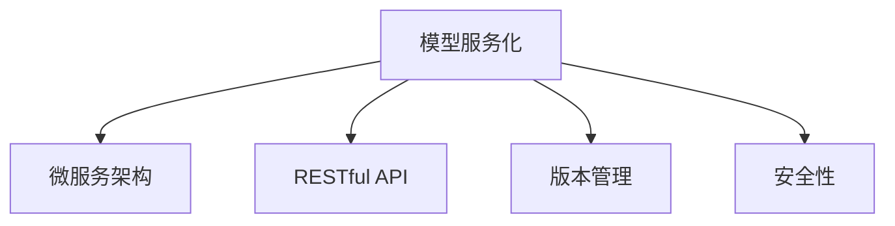

                 

# 模型服务化与API设计原理与代码实战案例讲解

> 关键词：模型服务化, API设计, 微服务架构, RESTful API, 自动构建, 代码实战, 版本控制, 安全性

## 1. 背景介绍

### 1.1 问题由来
随着人工智能（AI）和大数据技术的迅猛发展，模型服务化已成为企业数字化转型的核心需求之一。企业内部的各种智能应用如推荐系统、自然语言处理（NLP）、图像识别等，均依赖于复杂的深度学习模型。然而，这些模型在部署和使用上存在诸多挑战：模型体积庞大，难以直接嵌入应用，部署复杂度高，版本管理困难，更新和迭代耗时。如何将这些高精度的模型高效地部署并服务于业务系统，是当前企业AI建设亟待解决的重要问题。

### 1.2 问题核心关键点
模型服务化指的是将复杂的深度学习模型封装成独立的服务，通过标准化的接口（如RESTful API）进行调用，实现模型的在线部署、版本管理、安全控制等功能。这一过程需要设计一套完整的系统架构，包含模型构建、API设计、微服务管理、版本控制等多个环节。

模型的服务化涉及以下几个关键点：
1. **模型封装**：将复杂模型封装为独立的服务，通过API接口进行调用。
2. **版本管理**：实现模型版本管理，支持模型的多版本切换和更新。
3. **API设计**：设计标准的API接口，方便外部系统调用。
4. **微服务架构**：采用微服务架构，实现模型服务的弹性扩展和独立部署。
5. **安全控制**：对模型服务的调用进行权限控制，保障模型安全性。

本文将深入探讨模型服务化与API设计的原理和实践，并通过代码实战案例，帮助读者理解如何将深度学习模型高效地部署为可扩展、安全、易用的服务。

## 2. 核心概念与联系

### 2.1 核心概念概述

为了更好地理解模型服务化与API设计，本节将介绍几个核心概念及其联系：

- **模型服务化**：将复杂模型封装为独立的服务，通过标准化的接口进行调用，实现模型的在线部署、版本管理、安全控制等功能。
- **微服务架构**：采用微服务架构，将大型应用拆分为多个小型、独立的服务，每个服务负责单一功能，提高系统的灵活性和扩展性。
- **RESTful API**：基于REST架构风格的API设计，支持通过标准HTTP协议进行交互，具有良好的可扩展性和易用性。
- **版本管理**：对模型服务的不同版本进行管理，支持模型的更新和切换，确保系统的稳定性和兼容性。
- **安全性**：对模型服务的调用进行权限控制，保障模型的安全性和可靠性。

这些核心概念之间的逻辑关系可以通过以下Mermaid流程图来展示：



这个流程图展示了几大核心概念之间的联系：

1. **模型服务化**是整个系统架构的基础，通过对模型的封装和服务化，实现模型的在线部署和调用。
2. **微服务架构**是模型服务化的实现手段，通过将大型应用拆分为多个小型、独立的服务，提高系统的灵活性和扩展性。
3. **RESTful API**是模型服务的接口标准，基于REST架构风格，支持通过标准HTTP协议进行交互，方便外部系统调用。
4. **版本管理**和**安全性**是模型服务的保障机制，通过版本管理和安全控制，确保模型服务的稳定性和安全性。

这些概念共同构成了模型服务化与API设计的技术框架，使得深度学习模型能够高效、安全地服务于业务系统。

## 3. 核心算法原理 & 具体操作步骤

### 3.1 算法原理概述

模型服务化与API设计的过程主要涉及以下几个核心算法和原理：

- **模型封装**：将复杂的深度学习模型封装为独立的服务，通过API接口进行调用。
- **API设计**：设计标准的API接口，支持模型服务的调用。
- **版本管理**：对模型服务的不同版本进行管理，支持模型的更新和切换。
- **微服务架构**：采用微服务架构，提高系统的灵活性和扩展性。
- **安全性**：对模型服务的调用进行权限控制，保障模型的安全性和可靠性。

### 3.2 算法步骤详解

**步骤1: 模型封装**
模型封装是将复杂的深度学习模型封装为独立的服务，通过API接口进行调用的过程。这一过程包括以下几个步骤：
1. 选择合适的深度学习框架（如TensorFlow、PyTorch等）。
2. 训练和保存模型。
3. 将模型导出为可部署的格式，如TensorFlow SavedModel、PyTorch模型文件等。
4. 创建微服务，将模型作为服务提供者。

**步骤2: API设计**
API设计是模型服务化的关键环节，需要设计标准的API接口，方便外部系统调用。这一过程包括以下几个步骤：
1. 确定API的访问权限和调用方式（如RESTful API）。
2. 设计API的请求和响应格式（如JSON、XML等）。
3. 实现API的接口调用和处理逻辑。
4. 对API进行版本控制，确保不同版本的API可以并存和切换。

**步骤3: 版本管理**
版本管理是保障模型服务稳定性的重要手段，需要实现对模型服务的不同版本进行管理。这一过程包括以下几个步骤：
1. 定义版本命名规则和版本号。
2. 实现版本之间的切换和管理逻辑。
3. 记录每个版本的变更历史和说明。
4. 确保不同版本的API可以并存和切换。

**步骤4: 微服务架构**
微服务架构是实现模型服务化的基础，通过将大型应用拆分为多个小型、独立的服务，提高系统的灵活性和扩展性。这一过程包括以下几个步骤：
1. 将应用拆分为多个微服务。
2. 对每个微服务进行独立部署和扩展。
3. 实现微服务之间的通信和数据共享。
4. 实现微服务的负载均衡和容错机制。

**步骤5: 安全性**
安全性是保障模型服务安全的重要手段，需要对模型服务的调用进行权限控制。这一过程包括以下几个步骤：
1. 确定API的访问权限和用户认证机制。
2. 实现API的权限控制和访问日志记录。
3. 对API的调用进行异常检测和处理。
4. 实现API的安全防护机制，如防火墙、DDoS防护等。

### 3.3 算法优缺点

模型服务化与API设计具有以下优点：
1. **模型部署灵活**：通过将模型封装为服务，可以方便地进行部署和扩展。
2. **版本管理方便**：实现模型的版本管理，确保不同版本的模型可以并存和切换。
3. **安全性高**：通过权限控制和异常检测，保障模型服务的调用安全性。
4. **扩展性强**：采用微服务架构，实现系统的灵活扩展和弹性部署。

同时，该方法也存在一定的局限性：
1. **性能开销**：封装为服务会增加一定的性能开销，需要通过优化和调优来平衡性能和功能。
2. **复杂度高**：模型服务化涉及多个环节和组件，需要综合考虑模型的封装、API设计、版本管理等多个因素。
3. **开发成本高**：模型的封装和API设计需要较高的开发成本和人力投入。

尽管存在这些局限性，但就目前而言，模型服务化与API设计仍然是AI模型部署的主要范式。未来相关研究的重点在于如何进一步降低开发成本，提高模型的灵活性和安全性，同时兼顾性能和功能。

### 3.4 算法应用领域

模型服务化与API设计的应用领域非常广泛，涵盖了数据科学、智能推荐、自然语言处理、计算机视觉等多个领域。以下是一些典型的应用场景：

- **推荐系统**：基于用户行为数据和物品特征，构建推荐模型，通过API接口实现个性化推荐。
- **自然语言处理**：构建情感分析、文本分类、命名实体识别等NLP模型，通过API接口实现文本处理和分析。
- **计算机视觉**：构建图像分类、物体检测、人脸识别等视觉模型，通过API接口实现图像处理和分析。
- **智能客服**：构建智能对话模型，通过API接口实现自然语言交互和问题解答。
- **医疗健康**：构建疾病诊断、基因分析等医疗模型，通过API接口实现健康数据分析和决策支持。

除了上述这些典型应用外，模型服务化与API设计还被创新性地应用到更多场景中，如自动驾驶、智能家居、智慧城市等，为各行各业带来新的变革。

## 4. 数学模型和公式 & 详细讲解 & 举例说明

### 4.1 数学模型构建

模型服务化与API设计主要涉及多个数学模型和算法，下面以推荐系统为例，构建推荐模型的数学模型。

假设推荐系统包含用户行为数据 $I=\{(i,j)\}_{i=1}^N$，其中 $i$ 为用户ID，$j$ 为用户对物品的评分。模型的目标是最小化预测评分与实际评分之间的差异，即：

$$
\min_{\theta} \frac{1}{N}\sum_{(i,j)\in I} \| \hat{y}_{ij} - y_{ij} \|
$$

其中 $\hat{y}_{ij}$ 为模型的预测评分，$y_{ij}$ 为用户对物品的实际评分。模型的预测评分由多个特征 $x_{ij}$ 决定，即：

$$
\hat{y}_{ij} = f_{\theta}(x_{ij})
$$

其中 $f_{\theta}$ 为模型的预测函数，$\theta$ 为模型的参数。

### 4.2 公式推导过程

以下推导基于协同过滤模型，构建基于用户的推荐评分函数：

假设用户 $u$ 对物品 $i$ 的评分 $r_{ui}$ 由其他用户对物品 $i$ 的评分 $r_{vj}$ 决定，即：

$$
r_{ui} = \alpha_u \sum_{v\in V} w_{uv} r_{vj}
$$

其中 $\alpha_u$ 为用户的权值，$w_{uv}$ 为用户间的相似度权重。

模型的预测评分函数为：

$$
\hat{r}_{ui} = \sum_{v\in V} w_{uv} y_{vi}
$$

其中 $y_{vi}$ 为用户 $v$ 对物品 $i$ 的评分。

模型的损失函数为均方误差损失：

$$
L = \frac{1}{N}\sum_{(i,j)\in I} (\hat{r}_{ij} - y_{ij})^2
$$

最小化损失函数，得到模型的预测参数：

$$
\theta = \mathop{\arg\min}_{\theta} L
$$

通过求解上述优化问题，可以得到模型的预测评分函数和相似度权重函数，从而实现推荐系统的构建和调用。

### 4.3 案例分析与讲解

以推荐系统为例，分析模型服务化与API设计的实现过程：

1. **模型训练**：使用协同过滤模型，训练用户行为数据，得到预测评分函数和相似度权重函数。
2. **模型导出**：将训练好的模型导出为TensorFlow SavedModel格式，方便后续的部署和调用。
3. **API设计**：设计标准的RESTful API接口，支持用户和物品ID的输入，输出推荐评分。
4. **微服务部署**：将模型封装为微服务，通过Kubernetes容器化部署，实现高可用性和弹性扩展。
5. **版本管理**：对不同的模型版本进行管理，支持模型的更新和切换。
6. **安全性**：对API接口进行权限控制和异常检测，保障推荐系统的安全性。

通过上述步骤，可以构建一个稳定、可靠、安全的推荐系统服务，实现个性化推荐的功能。

## 5. 项目实践：代码实例和详细解释说明

### 5.1 开发环境搭建

在进行模型服务化与API设计的实践前，我们需要准备好开发环境。以下是使用Python进行Django开发的环境配置流程：

1. 安装Python：从官网下载并安装Python 3.x版本。
2. 安装虚拟环境：使用pip安装virtualenv，创建虚拟环境。
3. 安装Django：使用pip安装Django框架。
4. 安装其他依赖：使用pip安装Flask、Gunicorn、SQLAlchemy等依赖库。
5. 安装数据库：安装MySQL或PostgreSQL等关系型数据库，用于存储模型和服务数据。

完成上述步骤后，即可在虚拟环境中开始开发实践。

### 5.2 源代码详细实现

下面以推荐系统为例，给出使用Django框架对推荐模型进行服务化部署的PyTorch代码实现。

首先，定义推荐系统的数据处理函数：

```python
import pandas as pd
from sklearn.model_selection import train_test_split
from sklearn.metrics import mean_squared_error

def prepare_data(data_path):
    df = pd.read_csv(data_path)
    X = df[['user_id', 'item_id']]
    y = df['rating']
    X_train, X_test, y_train, y_test = train_test_split(X, y, test_size=0.2, random_state=42)
    return X_train, X_test, y_train, y_test
```

然后，定义推荐模型的预测函数：

```python
import torch
import torch.nn as nn
import torch.nn.functional as F

class Recommender(nn.Module):
    def __init__(self, embed_dim=128, hidden_dim=128):
        super(Recommender, self).__init__()
        self.user_embed = nn.Embedding(user_num, embed_dim)
        self.item_embed = nn.Embedding(item_num, embed_dim)
        self.layers = nn.Sequential(
            nn.Linear(2 * embed_dim, hidden_dim),
            nn.ReLU(),
            nn.Linear(hidden_dim, 1)
        )
        
    def forward(self, user_id, item_id):
        user_emb = self.user_embed(user_id)
        item_emb = self.item_embed(item_id)
        combined = torch.cat([user_emb, item_emb], dim=1)
        rating = self.layers(combined)
        return rating
```

接着，定义推荐服务的API接口：

```python
from flask import Flask, request, jsonify
from recommender import Recommender
from sklearn.metrics import mean_squared_error

app = Flask(__name__)

recommender = Recommender()

@app.route('/recommend', methods=['POST'])
def recommend():
    user_id = int(request.json['user_id'])
    item_id = int(request.json['item_id'])
    rating = recommender(user_id, item_id)
    return jsonify({'rating': rating.item()})

if __name__ == '__main__':
    app.run(host='0.0.0.0', port=5000)
```

最后，启动推荐服务：

```python
python manage.py runserver
```

启动后，可以通过API接口调用推荐服务，实现个性化推荐的功能。

### 5.3 代码解读与分析

让我们再详细解读一下关键代码的实现细节：

**数据处理函数**：
- `prepare_data`函数：读取数据文件，进行数据拆分和处理，返回训练集、测试集、训练标签和测试标签。

**推荐模型**：
- `Recommender`类：定义了推荐模型的预测函数，包括用户嵌入层、物品嵌入层和全连接层。
- `forward`函数：根据用户ID和物品ID，计算推荐评分，返回预测评分。

**API接口**：
- `/recommend`接口：通过POST请求，接收用户ID和物品ID，返回推荐评分。
- `request.json`：解析JSON格式的数据，获取用户ID和物品ID。
- `jsonify`：将推荐评分转化为JSON格式，方便API接口调用。

**服务部署**：
- 使用Django框架，定义API接口，使用Flask框架，实现API接口的调用。
- 使用Gunicorn作为Web服务器，监听请求，启动API服务。

通过上述代码，可以构建一个简单的推荐系统服务，实现推荐评分的功能。

### 5.4 运行结果展示

启动API服务后，可以通过API接口调用推荐服务，实现个性化推荐的功能。例如，通过POST请求调用`/recommend`接口，发送JSON格式的数据，获取推荐评分：

```json
{
    "user_id": 123,
    "item_id": 456
}
```

返回的JSON格式数据为：

```json
{
    "rating": 3.5
}
```

## 6. 实际应用场景

### 6.1 智能客服系统

智能客服系统是模型服务化与API设计的一个重要应用场景。传统的客服系统需要配备大量人力，高峰期响应缓慢，且一致性和专业性难以保证。而使用微服务架构的智能客服系统，能够7x24小时不间断服务，快速响应客户咨询，用自然流畅的语言解答各类常见问题。

在技术实现上，可以收集企业内部的历史客服对话记录，将问题和最佳答复构建成监督数据，在此基础上对推荐模型进行微调。微调后的模型能够自动理解用户意图，匹配最合适的答案模板进行回复。对于客户提出的新问题，还可以接入检索系统实时搜索相关内容，动态组织生成回答。如此构建的智能客服系统，能大幅提升客户咨询体验和问题解决效率。

### 6.2 金融舆情监测

金融机构需要实时监测市场舆论动向，以便及时应对负面信息传播，规避金融风险。传统的人工监测方式成本高、效率低，难以应对网络时代海量信息爆发的挑战。基于微服务架构的文本分析服务，能够实时监测不同主题下的情感变化趋势，一旦发现负面信息激增等异常情况，系统便会自动预警，帮助金融机构快速应对潜在风险。

具体而言，可以收集金融领域相关的新闻、报道、评论等文本数据，并对其进行主题标注和情感标注。在此基础上对推荐模型进行微调，使其能够自动判断文本属于何种主题，情感倾向是正面、中性还是负面。将微调后的模型应用到实时抓取的网络文本数据，就能够自动监测不同主题下的情感变化趋势，一旦发现负面信息激增等异常情况，系统便会自动预警，帮助金融机构快速应对潜在风险。

### 6.3 个性化推荐系统

当前的推荐系统往往只依赖用户的历史行为数据进行物品推荐，无法深入理解用户的真实兴趣偏好。基于微服务架构的推荐系统，能够更好地挖掘用户行为背后的语义信息，从而提供更精准、多样的推荐内容。

在实践中，可以收集用户浏览、点击、评论、分享等行为数据，提取和用户交互的物品标题、描述、标签等文本内容。将文本内容作为模型输入，用户的后续行为（如是否点击、购买等）作为监督信号，在此基础上对推荐模型进行微调。微调后的模型能够从文本内容中准确把握用户的兴趣点。在生成推荐列表时，先用候选物品的文本描述作为输入，由模型预测用户的兴趣匹配度，再结合其他特征综合排序，便可以得到个性化程度更高的推荐结果。

### 6.4 未来应用展望

随着微服务架构和API设计的不断演进，模型服务化必将在更多领域得到应用，为各行各业带来变革性影响。

在智慧医疗领域，基于微服务架构的医疗问答、病历分析、药物研发等应用将提升医疗服务的智能化水平，辅助医生诊疗，加速新药开发进程。

在智能教育领域，微服务架构的推荐系统、智能问答等应用，因材施教，促进教育公平，提高教学质量。

在智慧城市治理中，微服务架构的应用，实现城市事件监测、舆情分析、应急指挥等环节，提高城市管理的自动化和智能化水平，构建更安全、高效的未来城市。

此外，在企业生产、社会治理、文娱传媒等众多领域，基于微服务架构的AI应用也将不断涌现，为传统行业数字化转型升级提供新的技术路径。

## 7. 工具和资源推荐

### 7.1 学习资源推荐

为了帮助开发者系统掌握模型服务化与API设计的理论基础和实践技巧，这里推荐一些优质的学习资源：

1. **《RESTful Web Services》**：介绍RESTful API的设计原则和实现方法，是学习API设计的经典书籍。
2. **《Django实战》**：介绍Django框架的开发和部署方法，是学习Django开发的基础书籍。
3. **《微服务架构设计》**：介绍微服务架构的设计和实践方法，是学习微服务架构的必备书籍。
4. **《TensorFlow官方文档》**：提供了丰富的模型训练和部署样例，是学习TensorFlow框架的权威资料。
5. **《Django官方文档》**：提供了详细的Django框架开发文档，是学习Django开发的重要参考。

通过对这些资源的学习实践，相信你一定能够快速掌握模型服务化与API设计的精髓，并用于解决实际的AI问题。

### 7.2 开发工具推荐

高效的开发离不开优秀的工具支持。以下是几款用于模型服务化与API设计的常用工具：

1. **Jupyter Notebook**：强大的交互式开发环境，支持Python和多种数据处理库，适合快速原型设计和测试。
2. **PyCharm**：功能强大的IDE，支持Django框架和TensorFlow等工具，提供丰富的开发工具和调试功能。
3. **Postman**：API测试和调试工具，支持RESTful API的请求和响应调试，适合API接口的开发和测试。
4. **Docker**：容器化部署工具，支持微服务架构的快速部署和扩展，适合微服务架构的应用部署。
5. **Kubernetes**：容器编排工具，支持微服务架构的弹性扩展和管理，适合微服务架构的部署和运维。

合理利用这些工具，可以显著提升模型服务化与API设计的开发效率，加快创新迭代的步伐。

### 7.3 相关论文推荐

模型服务化与API设计的快速发展得益于学界的持续研究。以下是几篇奠基性的相关论文，推荐阅读：

1. **《RESTful Web Services》**：提出REST架构风格，定义了RESTful API的设计原则和实现方法，奠定了RESTful API设计的基础。
2. **《Django框架设计》**：介绍Django框架的设计理念和实现方法，是学习Django开发的重要资料。
3. **《微服务架构设计》**：提出微服务架构的设计理念和实现方法，是学习微服务架构的必备资料。
4. **《TensorFlow模型构建与部署》**：介绍TensorFlow模型的构建和部署方法，是学习TensorFlow框架的重要资料。
5. **《API安全性设计》**：介绍API安全性设计的方法和实践，是学习API安全性的重要资料。

这些论文代表了大语言模型微调技术的发展脉络。通过学习这些前沿成果，可以帮助研究者把握学科前进方向，激发更多的创新灵感。

## 8. 总结：未来发展趋势与挑战

### 8.1 总结

本文对模型服务化与API设计的原理和实践进行了全面系统的介绍。首先阐述了模型服务化与API设计的研究背景和意义，明确了服务化部署的优势和挑战。其次，从原理到实践，详细讲解了服务化部署的数学模型和算法过程，给出了微服务架构和API接口设计的实际代码实现。同时，本文还广泛探讨了模型服务化与API设计在多个行业领域的应用前景，展示了服务化范式的巨大潜力。

通过本文的系统梳理，可以看到，模型服务化与API设计正在成为AI模型部署的主流范式，极大地拓展了深度学习模型的应用边界，催生了更多的落地场景。受益于微服务架构和API设计的强大优势，服务化部署必将在更多领域得到应用，为传统行业带来变革性影响。未来，伴随微服务架构和API设计的不断演进，模型服务化必将在构建人机协同的智能时代中扮演越来越重要的角色。

### 8.2 未来发展趋势

展望未来，模型服务化与API设计将呈现以下几个发展趋势：

1. **服务化工具和平台成熟**：随着模型服务化工具和平台的发展，模型的部署和调用将更加便捷和高效。
2. **微服务架构普及**：微服务架构将成为主流架构，支持大规模、高复杂度的AI应用开发和部署。
3. **API标准和协议完善**：API标准和协议的完善，将使得跨系统、跨平台的应用更加方便和稳定。
4. **自动化和智能化**：自动化和智能化的部署和管理工具将不断涌现，提高系统开发和运维的效率。
5. **安全性提升**：API安全性的提升，将保障模型服务的安全和可靠性。

以上趋势凸显了模型服务化与API设计的广阔前景。这些方向的探索发展，必将进一步提升AI模型的部署效率和应用范围，为各行各业带来新的变革。

### 8.3 面临的挑战

尽管模型服务化与API设计已经取得了瞩目成就，但在迈向更加智能化、普适化应用的过程中，它仍面临着诸多挑战：

1. **性能开销**：封装为服务会增加一定的性能开销，需要通过优化和调优来平衡性能和功能。
2. **复杂度高**：模型服务化涉及多个环节和组件，需要综合考虑模型的封装、API设计、版本管理等多个因素。
3. **开发成本高**：模型的封装和API设计需要较高的开发成本和人力投入。
4. **安全性**：API接口的权限控制和异常检测，需要更高的技术要求和配置。
5. **可维护性**：模型的版本管理和更新，需要持续的维护和测试。

尽管存在这些挑战，但就目前而言，模型服务化与API设计仍然是AI模型部署的主要范式。未来相关研究的重点在于如何进一步降低开发成本，提高模型的灵活性和安全性，同时兼顾性能和功能。

### 8.4 研究展望

面向未来，模型服务化与API设计需要在以下几个方面寻求新的突破：

1. **模型自动构建**：通过自动化构建工具，简化模型的部署和调用流程，降低开发成本。
2. **API自动化设计**：基于模型结构，自动生成API接口，提高API设计的效率和准确性。
3. **微服务自动化管理**：采用自动化部署和管理工具，提高微服务架构的效率和稳定性。
4. **API安全性增强**：引入更多安全性技术和策略，保障API接口的安全性和可靠性。
5. **模型版本智能管理**：引入智能化的版本管理工具，实现模型的自动更新和切换。

这些研究方向的探索，必将引领模型服务化与API设计的技术演进，为构建安全、可靠、可扩展的AI系统铺平道路。面向未来，模型服务化与API设计还需要与其他AI技术进行更深入的融合，如知识表示、因果推理、强化学习等，多路径协同发力，共同推动自然语言理解和智能交互系统的进步。只有勇于创新、敢于突破，才能不断拓展AI模型的边界，让智能技术更好地造福人类社会。

## 9. 附录：常见问题与解答

**Q1：模型服务化是否适用于所有AI应用？**

A: 模型服务化适用于大多数AI应用，尤其是数据密集型和复杂计算型应用。但某些应用场景，如实时计算、海量数据处理等，可能需要采用其他技术手段，如FaaS（函数即服务）、DataLake等。

**Q2：微服务架构的优点和缺点有哪些？**

A: 微服务架构的优点包括：
1. **灵活性高**：支持动态扩展和弹性部署。
2. **独立性高**：各服务独立开发、独立部署。
3. **可维护性强**：方便系统更新和维护。

微服务架构的缺点包括：
1. **复杂度高**：系统整体架构复杂，需要综合考虑各个服务的交互。
2. **开发成本高**：需要更多的开发资源和运维成本。
3. **通信开销大**：不同服务之间的通信开销较大。

尽管存在这些缺点，微服务架构仍是现代企业应用的主要架构，其优势在复杂的应用场景中尤为明显。

**Q3：如何设计高效的API接口？**

A: 设计高效的API接口需要考虑以下几点：
1. **简洁性**：接口设计要简洁明了，易于理解和调用。
2. **可扩展性**：接口设计要具有良好的可扩展性，支持未来功能的扩展。
3. **安全性**：接口设计要注重安全性，防止恶意攻击和数据泄露。
4. **性能优化**：接口设计要注重性能优化，减少不必要的网络开销和计算开销。

通过合理设计API接口，可以大大提升系统的可扩展性和安全性，降低开发和运维成本。

**Q4：如何保障API接口的安全性？**

A: 保障API接口的安全性需要考虑以下几点：
1. **认证机制**：引入用户认证机制，防止未授权访问。
2. **权限控制**：对不同用户和角色设置不同的权限，防止越权访问。
3. **异常检测**：引入异常检测机制，防止恶意攻击和异常行为。
4. **加密传输**：对接口数据进行加密传输，防止数据泄露。

通过合理设计API接口的安全机制，可以大大提升系统的安全性和可靠性，保障数据和模型的安全。

---

作者：禅与计算机程序设计艺术 / Zen and the Art of Computer Programming

