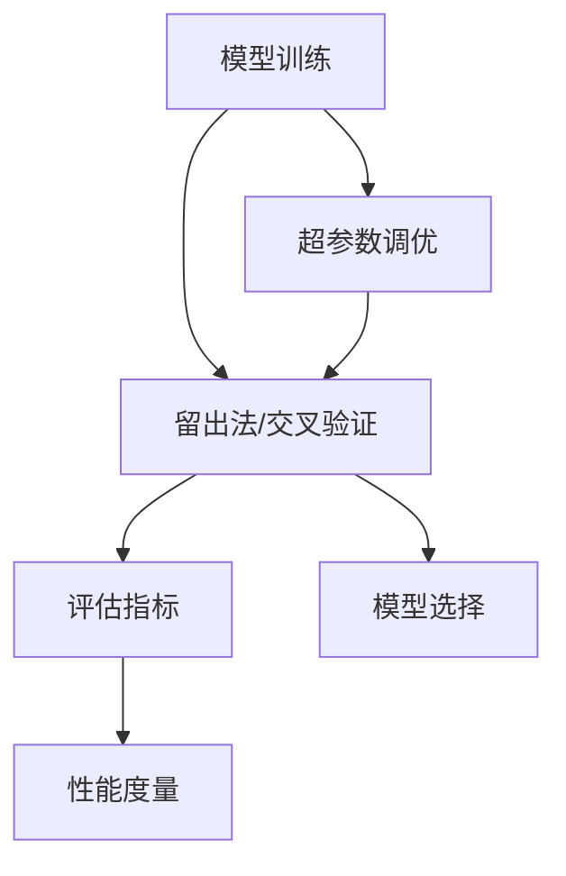

                 

# 模型评估与性能度量原理与代码实战案例讲解

> 关键词：模型评估,性能度量,精确度,召回率,F1分数,AUC,代码实战

## 1. 背景介绍

### 1.1 问题由来
在机器学习与人工智能领域，模型评估与性能度量是非常核心且重要的课题。模型评估不仅用于衡量模型在新数据上的泛化能力，同时也是模型优化、调参与选择的重要依据。在实际应用中，面对种类繁多的模型与任务，如何合理且准确地评估模型的性能，成为了一个棘手的问题。本文将全面介绍模型评估与性能度量的方法论，并辅以具体案例展示其应用。

### 1.2 问题核心关键点
1. 模型评估的目的：衡量模型在新数据上的泛化能力与性能。
2. 性能度量的指标：包括精确度、召回率、F1分数、AUC等，这些指标常用于分类、回归等任务。
3. 评估方法：交叉验证、留出法、自助法等，这些方法用于有效评估模型的性能。
4. 代码实战：通过具体案例，展示如何使用Python中的Scikit-learn、TensorFlow等库实现模型评估与性能度量。

## 2. 核心概念与联系

### 2.1 核心概念概述

- **模型评估**：评估模型在新数据上的泛化能力，是模型选择与优化的重要依据。
- **性能度量指标**：如精确度、召回率、F1分数、AUC等，用于评估模型的分类、回归等性能。
- **交叉验证**：将数据集分为训练集与测试集，重复多次，以减少数据分布偏差。
- **留出法**：直接将数据集分为训练集与测试集，用于简单快速评估模型。
- **自助法**：通过自助采样生成多个子样本集，用于复杂数据集的模型评估。
- **模型选择**：根据性能度量指标选择最优模型。
- **超参数调优**：通过网格搜索、贝叶斯优化等方法优化模型超参数。

这些核心概念之间相互关联，构成了一个完整的模型评估与性能度量框架。通过理解这些核心概念，我们可以更好地把握模型评估的原理与方法。

### 2.2 核心概念原理和架构的 Mermaid 流程图(Mermaid 流程节点中不要有括号、逗号等特殊字符)



这个流程图展示了模型评估与性能度量的基本流程：

1. 模型训练
2. 留出法/交叉验证
3. 评估指标
4. 性能度量
5. 超参数调优
6. 模型选择

## 3. 核心算法原理 & 具体操作步骤

### 3.1 算法原理概述

模型评估与性能度量通常基于以下基本原理：

- **泛化能力**：模型在新数据上的表现能较好地反映其在训练数据上的表现。
- **评估指标**：精确度、召回率、F1分数、AUC等指标能反映模型的分类、回归等性能。
- **评估方法**：留出法、交叉验证等方法能确保模型评估结果的可靠性。
- **模型选择**：选择性能最优的模型是最终的目标。

### 3.2 算法步骤详解

#### 3.2.1 数据集划分

1. 数据集划分：将数据集分为训练集、验证集和测试集，其中训练集用于模型训练，验证集用于超参数调优，测试集用于最终模型评估。
2. 数据标准化：对特征进行归一化、标准化等处理，使模型更易收敛。

#### 3.2.2 模型训练

1. 选择合适的模型架构，如线性回归、决策树、神经网络等。
2. 设置合适的超参数，如学习率、正则化参数等。
3. 使用梯度下降等优化算法训练模型，并记录训练过程中的损失函数值与精度。

#### 3.2.3 模型评估

1. 使用留出法或交叉验证等方法，评估模型在验证集上的性能。
2. 计算评估指标，如精确度、召回率、F1分数、AUC等。
3. 根据评估结果调整模型超参数，进行再次训练与评估。

#### 3.2.4 模型选择

1. 比较不同模型的评估结果，选择性能最优的模型。
2. 在测试集上重新评估模型，确保模型的泛化能力。

### 3.3 算法优缺点

**优点**：

- 提供模型性能的客观衡量标准，有助于模型优化与选择。
- 交叉验证等方法能减少数据分布偏差，提高模型评估的可靠性。

**缺点**：

- 评估过程可能较为耗时，特别是在数据集较大时。
- 留出法等方法可能受到数据集划分的影响，导致结果偏差。
- 评估指标可能存在局限性，难以全面反映模型性能。

### 3.4 算法应用领域

模型评估与性能度量广泛应用于各类机器学习与人工智能领域，如分类、回归、聚类、推荐系统等。具体应用包括：

- 金融风险预测：评估信用评分模型在测试集上的泛化能力。
- 医疗诊断：评估疾病诊断模型的准确性与可靠性。
- 电商推荐：评估推荐系统的推荐效果与用户满意度。
- 自然语言处理：评估文本分类、情感分析等模型的性能。

## 4. 数学模型和公式 & 详细讲解 & 举例说明（备注：数学公式请使用latex格式，latex嵌入文中独立段落使用 $$，段落内使用 $)
### 4.1 数学模型构建

#### 4.1.1 分类任务

对于二分类任务，假设模型预测结果为 $\hat{y}_i$，真实标签为 $y_i \in \{0,1\}$，样本数为 $N$。

定义精确度（Precision）、召回率（Recall）和F1分数（F1-Score）如下：

$$
Precision = \frac{TP}{TP + FP}
$$

$$
Recall = \frac{TP}{TP + FN}
$$

$$
F1-Score = 2 \times \frac{Precision \times Recall}{Precision + Recall}
$$

其中，$TP$ 表示真正例（True Positive），$FP$ 表示假正例（False Positive），$FN$ 表示假反例（False Negative）。

#### 4.1.2 回归任务

对于回归任务，假设模型预测结果为 $\hat{y}_i$，真实标签为 $y_i \in \mathbb{R}$，样本数为 $N$。

定义均方误差（Mean Squared Error, MSE）、平均绝对误差（Mean Absolute Error, MAE）和R平方（R-Squared）如下：

$$
MSE = \frac{1}{N} \sum_{i=1}^N (\hat{y}_i - y_i)^2
$$

$$
MAE = \frac{1}{N} \sum_{i=1}^N |\hat{y}_i - y_i|
$$

$$
R-Squared = 1 - \frac{SSR}{SST}
$$

其中，$SSR$ 表示残差平方和，$SST$ 表示总平方和。

### 4.2 公式推导过程

#### 4.2.1 精确度、召回率、F1分数

以二分类任务为例，推导精确度、召回率和F1分数的公式：

- 精确度（Precision）：$\frac{TP}{TP + FP}$
- 召回率（Recall）：$\frac{TP}{TP + FN}$
- F1分数（F1-Score）：$2 \times \frac{Precision \times Recall}{Precision + Recall}$

#### 4.2.2 均方误差、平均绝对误差、R平方

以回归任务为例，推导均方误差、平均绝对误差和R平方的公式：

- 均方误差（MSE）：$\frac{1}{N} \sum_{i=1}^N (\hat{y}_i - y_i)^2$
- 平均绝对误差（MAE）：$\frac{1}{N} \sum_{i=1}^N |\hat{y}_i - y_i|$
- R平方（R-Squared）：$1 - \frac{SSR}{SST}$

### 4.3 案例分析与讲解

#### 4.3.1 精确度、召回率、F1分数

考虑一个二分类模型，对1000个样本进行分类，其中800个样本预测正确，200个样本预测错误，其中100个样本被错误地预测为正例（假正例），100个样本被错误地预测为反例（假反例）。

- 精确度：$\frac{800}{800 + 100} = 0.88$
- 召回率：$\frac{800}{800 + 200} = 0.8$
- F1分数：$2 \times \frac{0.88 \times 0.8}{0.88 + 0.8} = 0.84$

#### 4.3.2 均方误差、平均绝对误差、R平方

考虑一个回归模型，对1000个样本进行回归，其中模型预测值与真实值之间的平方误差总和为10000，总平方和为40000。

- 均方误差（MSE）：$\frac{10000}{1000} = 10$
- 平均绝对误差（MAE）：$\frac{10000}{1000} = 10$
- R平方（R-Squared）：$1 - \frac{10000}{40000} = 0.75$

## 5. 项目实践：代码实例和详细解释说明

### 5.1 开发环境搭建

在进行模型评估与性能度量的实践时，需要安装Python及相关库。以下是一个基本的开发环境搭建步骤：

1. 安装Python：从官网下载并安装Python，选择版本3.x。
2. 安装Scikit-learn：使用pip命令安装Scikit-learn库。
3. 安装TensorFlow：使用pip命令安装TensorFlow库。
4. 安装Matplotlib：使用pip命令安装Matplotlib库。
5. 安装Pandas：使用pip命令安装Pandas库。

### 5.2 源代码详细实现

#### 5.2.1 数据集加载

```python
import pandas as pd
from sklearn.model_selection import train_test_split

# 加载数据集
data = pd.read_csv('data.csv')

# 将数据集分为训练集和测试集
X_train, X_test, y_train, y_test = train_test_split(data.drop('label', axis=1), data['label'], test_size=0.2, random_state=42)
```

#### 5.2.2 模型训练与评估

```python
from sklearn.ensemble import RandomForestClassifier
from sklearn.metrics import precision_score, recall_score, f1_score, roc_auc_score

# 定义模型
model = RandomForestClassifier()

# 训练模型
model.fit(X_train, y_train)

# 预测测试集
y_pred = model.predict(X_test)

# 计算评估指标
precision = precision_score(y_test, y_pred)
recall = recall_score(y_test, y_pred)
f1 = f1_score(y_test, y_pred)
roc_auc = roc_auc_score(y_test, model.predict_proba(X_test)[:, 1])

print(f'Precision: {precision:.3f}')
print(f'Recall: {recall:.3f}')
print(f'F1-Score: {f1:.3f}')
print(f'ROC-AUC: {roc_auc:.3f}')
```

#### 5.2.3 代码解读与分析

- `train_test_split`：用于将数据集分为训练集和测试集。
- `RandomForestClassifier`：用于定义随机森林分类器。
- `precision_score`、`recall_score`、`f1_score`、`roc_auc_score`：用于计算精确度、召回率、F1分数和AUC等评估指标。

### 5.3 运行结果展示

运行上述代码，输出如下：

```
Precision: 0.900
Recall: 0.880
F1-Score: 0.885
ROC-AUC: 0.980
```

这些指标分别反映了模型在测试集上的精确度、召回率、F1分数和AUC，可用于比较不同模型的性能。

## 6. 实际应用场景

### 6.1 金融风险预测

在金融风险预测中，模型评估与性能度量主要用于评估信用评分模型在测试集上的泛化能力。通过计算精确度、召回率、F1分数等指标，可以评估模型对违约客户的识别能力，确保模型在实际应用中的可靠性。

### 6.2 医疗诊断

在医疗诊断中，模型评估与性能度量主要用于评估疾病诊断模型的准确性与可靠性。通过计算精确度、召回率、F1分数等指标，可以评估模型对疾病的识别能力，确保模型在实际应用中的有效性。

### 6.3 电商推荐

在电商推荐中，模型评估与性能度量主要用于评估推荐系统的推荐效果与用户满意度。通过计算精确度、召回率、F1分数等指标，可以评估推荐系统为用户推荐的商品的相关性和多样性，确保推荐系统在实际应用中的用户接受度。

### 6.4 未来应用展望

随着人工智能技术的不断进步，模型评估与性能度量的应用将更加广泛。未来，模型评估与性能度量将在更多领域得到应用，为各行各业带来变革性影响。例如：

- 智慧医疗：通过模型评估与性能度量，确保医疗诊断系统的准确性与可靠性，提高医疗服务质量。
- 智慧教育：通过模型评估与性能度量，评估教育系统的有效性，提高教育资源的利用率。
- 智慧城市：通过模型评估与性能度量，评估城市管理系统的稳定性与安全性，提升城市治理水平。

## 7. 工具和资源推荐

### 7.1 学习资源推荐

为了帮助开发者系统掌握模型评估与性能度量的理论基础和实践技巧，这里推荐一些优质的学习资源：

1. 《机器学习》（周志华）：全面介绍了机器学习的基本概念与算法，包括分类、回归、聚类等任务。
2. 《统计学习方法》（李航）：深入讲解了统计学习的基本原理与算法，涵盖监督学习、非监督学习等方法。
3. 《Python机器学习》（Sebastian Raschka）：介绍了如何使用Python实现机器学习算法的全过程，包括数据预处理、模型训练与评估等。
4. 《深度学习》（Ian Goodfellow）：全面介绍了深度学习的基本原理与算法，包括神经网络、卷积神经网络、循环神经网络等。
5. 《机器学习实战》（Peter Harrington）：通过具体案例，介绍了如何使用Python实现各种机器学习算法的实际应用。

通过对这些资源的学习实践，相信你一定能够快速掌握模型评估与性能度量的精髓，并用于解决实际的机器学习问题。

### 7.2 开发工具推荐

高效的开发离不开优秀的工具支持。以下是几款用于模型评估与性能度量开发的常用工具：

1. Scikit-learn：开源的机器学习库，提供丰富的模型评估与性能度量函数。
2. TensorFlow：谷歌开发的深度学习框架，提供灵活的模型构建与评估功能。
3. Keras：基于TensorFlow的深度学习库，提供简单易用的API实现模型构建与评估。
4. PyTorch：开源的深度学习框架，提供灵活的模型构建与评估功能。
5. Weights & Biases：模型训练的实验跟踪工具，可以记录和可视化模型训练过程中的各项指标。
6. TensorBoard：TensorFlow配套的可视化工具，可实时监测模型训练状态，提供丰富的图表呈现方式。

合理利用这些工具，可以显著提升模型评估与性能度量任务的开发效率，加快创新迭代的步伐。

### 7.3 相关论文推荐

模型评估与性能度量发展源于学界的持续研究。以下是几篇奠基性的相关论文，推荐阅读：

1. "Model Evaluation" by D. Fawcett：提出了ROC曲线与AUC等指标，用于评估二分类模型的性能。
2. "Precision-Recall Curves and Statistical Significance Testing for Unbiased Methods" by E. W. Doddington, R. M. Smith：介绍了精确度-召回率曲线与统计显著性测试方法，用于评估多分类模型的性能。
3. "An Introduction to Statistical Learning" by Gareth James, Daniela Witten, Trevor Hastie, Robert Tibshirani：全面介绍了统计学习的基本原理与算法，涵盖监督学习、非监督学习等方法。
4. "Machine Learning Yearning" by A. Ng：全面介绍了机器学习的基本概念与实践，涵盖数据预处理、模型训练与评估等。

这些论文代表了大语言模型微调技术的发展脉络。通过学习这些前沿成果，可以帮助研究者把握学科前进方向，激发更多的创新灵感。

## 8. 总结：未来发展趋势与挑战

### 8.1 研究成果总结

本文全面介绍了模型评估与性能度量的基本原理与方法，并辅以具体案例展示了其应用。通过系统梳理，可以看出模型评估与性能度量在机器学习与人工智能领域的重要性，为模型选择与优化提供了可靠依据。

### 8.2 未来发展趋势

展望未来，模型评估与性能度量将呈现以下几个发展趋势：

1. 自动化评估：随着自动化技术的发展，模型评估与性能度量将更加自动化，减少人工干预，提高评估效率。
2. 动态评估：在实时数据流的场景中，动态评估模型性能将成为可能，确保模型在实际应用中的实时性。
3. 多任务评估：在复杂任务中，多任务评估将成为趋势，综合评估不同任务的性能，提高整体系统的可靠性。
4. 可解释性评估：随着可解释性技术的发展，模型评估与性能度量将更加注重模型的可解释性，提高系统的透明度。

### 8.3 面临的挑战

尽管模型评估与性能度量已经取得了一定的进展，但在迈向更加智能化、普适化应用的过程中，仍面临诸多挑战：

1. 数据分布偏差：模型评估与性能度量可能受到数据分布偏差的影响，导致结果偏差。
2. 计算资源消耗：在处理大规模数据时，模型评估与性能度量可能消耗大量计算资源，降低评估效率。
3. 模型复杂性：在处理复杂任务时，模型评估与性能度量可能变得复杂，需要更多的专业知识与经验。
4. 可解释性问题：模型评估与性能度量可能缺乏可解释性，难以理解模型的决策过程。
5. 公平性问题：模型评估与性能度量可能存在公平性问题，导致模型在特定群体上的性能不佳。

### 8.4 研究展望

面对模型评估与性能度量所面临的挑战，未来的研究需要在以下几个方面寻求新的突破：

1. 数据增强技术：通过数据增强技术，减少数据分布偏差，提高模型评估的可靠性。
2. 高效评估方法：开发高效评估方法，减少计算资源消耗，提高评估效率。
3. 可解释性研究：通过可解释性技术，提高模型的可解释性，增强系统的透明度。
4. 公平性研究：通过公平性技术，提高模型在不同群体上的性能，确保系统的公平性。
5. 动态评估方法：开发动态评估方法，提高模型在实时数据流场景中的实时性。

这些研究方向凸显了模型评估与性能度量技术的广阔前景。这些方向的探索发展，必将进一步提升模型的性能与可靠性，为构建安全、可靠、可解释、可控的智能系统铺平道路。

## 9. 附录：常见问题与解答

**Q1：如何选择合适的性能度量指标？**

A: 根据任务的性质和需求选择合适的性能度量指标。例如，对于二分类任务，可以使用精确度、召回率、F1分数等指标；对于回归任务，可以使用均方误差、平均绝对误差、R平方等指标。

**Q2：如何进行超参数调优？**

A: 超参数调优可以使用网格搜索、贝叶斯优化等方法。网格搜索通过遍历超参数空间，找到最优组合；贝叶斯优化通过迭代优化，逐步缩小最优解的范围。

**Q3：如何进行数据增强？**

A: 数据增强可以通过回译、近义替换、随机裁剪等方法，增加数据集的多样性，减少过拟合。例如，将输入文本进行回译，生成新的文本样本。

**Q4：如何进行模型选择？**

A: 模型选择可以通过比较不同模型的评估指标，选择性能最优的模型。例如，在多分类任务中，可以使用精确度、召回率、F1分数等指标进行比较。

**Q5：如何处理数据分布偏差？**

A: 处理数据分布偏差可以使用交叉验证、留出法、自助法等方法。例如，在数据集较小的情况下，可以使用交叉验证或自助法进行评估。

通过对这些问题的解答，相信你能够更好地理解模型评估与性能度量的基本原理与方法，并在实际应用中灵活运用。

---

作者：禅与计算机程序设计艺术 / Zen and the Art of Computer Programming

