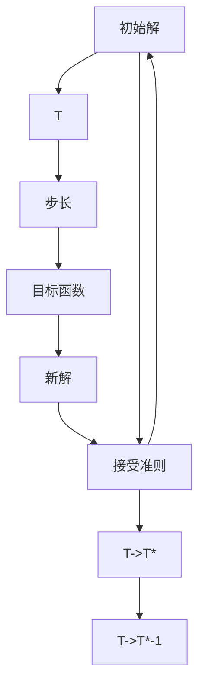

                 

# 模拟退火算法(Simulated Annealing) - 原理与代码实例讲解

> 关键词：模拟退火算法,随机化优化,全局最优解,局部最优解,接受准则,冷却算法,凸函数

## 1. 背景介绍

### 1.1 问题由来

在寻找最优解问题中，通常需要遍历所有候选解空间，以找到全局最优解。然而，对于大规模的搜索空间，传统暴力搜索方法往往效率低下，无法满足实际应用需求。模拟退火算法(Simulated Annealing)作为一种随机化优化方法，通过在随机步长下的局部优化和接受劣解，成功地在多维度空间中找到全局最优解。

模拟退火算法最初由Métropolis、Hastings和Monte Carlo于1953年提出，用于解决统计力学中的蒙特卡洛方法。后来，诺贝尔奖得主S. Kirkpatrick、C. D. Gelatt和M. P. Vecchi在1983年将其应用到组合优化问题上，进一步推广了该算法在求解复杂优化问题的有效性。

### 1.2 问题核心关键点

模拟退火算法通过模拟物质熔化和结晶的物理过程，来优化目标函数。其核心思想为：在高温状态下，可接受更大范围的步长，以跳出局部最优解；在低温状态下，步长减小，逐渐逼近全局最优解。该算法的关键步骤包括：

- 初始化：随机生成一个初始解。
- 接受准则：判断新解是否接受，若新解优于旧解，则直接替换；否则，根据接受概率决定是否替换。
- 温度更新：在迭代过程中，不断降低温度，使算法逐步趋近全局最优解。
- 冷却算法：温度衰减策略，控制算法稳定性和收敛速度。

模拟退火算法在求解大规模优化问题中表现出良好性能，尤其在NP-hard问题上，相比其他启发式算法表现更佳。它的适用范围广泛，包括线性规划、组合优化、图像处理、机器人路径规划等领域。

## 2. 核心概念与联系

### 2.1 核心概念概述

模拟退火算法是一种基于随机过程的全局优化算法。其核心概念包括：

- 目标函数：定义优化的目标，如函数最小化或最大化问题。
- 初始解：算法开始时随机生成的一个解，作为起始点。
- 温度：模拟退火算法中的温度参数，影响步长的随机性。
- 步长：每次迭代时，算法从当前解随机跳出到新解的范围。
- 接受准则：判断新解是否被接受的规则，通常采用Metropolis准则。
- 冷却算法：算法温度的衰减策略，控制算法的搜索范围和收敛速度。

这些概念通过以下Mermaid流程图得以展示：



该流程图展示了模拟退火算法的整体流程：

1. 从初始解开始，计算目标函数的值。
2. 根据当前温度和步长，生成新解。
3. 计算新解的目标函数值。
4. 根据新旧解的差值和接受准则，决定是否接受新解。
5. 更新当前解，重复上述步骤直至满足收敛条件。
6. 温度逐渐降低，直到达到预设的冷却终止条件。

### 2.2 核心概念原理和架构

模拟退火算法基于以下两个物理原理：

1. 固体物质由液态变为固态，其内部粒子排列方式会发生随机调整，最终达到最低能量状态。
2. 热力学系统在温度较高时，分子有较大的动能，能够接受更远的跳跃；随着温度降低，分子动能减小，只能接受较近的跳跃。

这些原理应用于算法中，使得模拟退火算法能够在高温度时，跳出局部最优解，寻找更广阔的搜索空间；在低温度时，缩小搜索范围，逼近全局最优解。

算法的核心架构由以下几个部分构成：

1. **初始解生成**：随机生成一个解，作为算法的起始点。
2. **步长生成**：根据当前温度生成一个随机步长，用于在新解空间中进行跳跃。
3. **新解生成**：在当前解的基础上，加上随机步长生成新解。
4. **接受准则**：比较新旧解的目标函数值，决定是否接受新解。
5. **温度更新**：随着迭代次数增加，温度逐渐降低，缩小搜索空间。
6. **迭代终止**：当算法达到预设的迭代次数或温度冷却到预设值时，算法终止。

## 3. 核心算法原理 & 具体操作步骤

### 3.1 算法原理概述

模拟退火算法通过模拟固体物质的退火过程，来优化目标函数。其主要原理包括以下几个关键点：

1. 初始化：随机生成一个初始解。
2. 温度选择：设定初始温度$T_0$，逐渐降低。
3. 步长选择：根据当前温度$T$，随机生成一个步长$\sigma$，用于在新解空间中进行跳跃。
4. 新解生成：在当前解$x_i$的基础上，加上步长$\sigma$生成新解$x_{i+1}$。
5. 接受准则：如果新解的目标函数值$f(x_{i+1})$优于旧解的目标函数值$f(x_i)$，则直接接受；否则，根据接受概率决定是否替换。
6. 温度更新：在每次迭代后，根据冷却算法更新温度$T$，缩小搜索范围。
7. 迭代终止：当算法达到预设的迭代次数或温度冷却到预设值时，算法终止。

模拟退火算法核心步骤如下：

1. 初始化：设定初始温度$T_0$，生成一个初始解$x_0$。
2. 循环：
   - 生成步长$\sigma$。
   - 生成新解$x_{i+1}$。
   - 计算新解的目标函数值$f(x_{i+1})$。
   - 根据接受准则，决定是否接受新解。
   - 更新温度$T$。
3. 输出：返回最终的最优解。

### 3.2 算法步骤详解

以下详细描述模拟退火算法的主要步骤：

**Step 1: 初始化**
- 设定初始温度$T_0$，随机生成一个初始解$x_0$。

**Step 2: 生成步长**
- 根据当前温度$T$，随机生成步长$\sigma$，通常设定步长为当前温度的倒数。

**Step 3: 生成新解**
- 在当前解$x_i$的基础上，加上步长$\sigma$生成新解$x_{i+1}$。

**Step 4: 接受准则**
- 计算新解的目标函数值$f(x_{i+1})$。
- 如果$f(x_{i+1}) \leq f(x_i)$，则直接接受新解，更新$x_i$。
- 如果$f(x_{i+1}) > f(x_i)$，计算接受概率$p$。

接受概率$p$的计算公式为：

$$
p = \min\left(1, \exp\left(\frac{f(x_i) - f(x_{i+1})}{T}\right)\right)
$$

其中，$T$为当前温度，$k_B$为玻尔兹曼常数，$\Delta f$为新旧解目标函数值之差。

**Step 5: 温度更新**
- 根据冷却算法更新温度$T$。常用的冷却算法包括线性冷却和指数冷却。

线性冷却公式为：

$$
T_{i+1} = T_i - \Delta T
$$

指数冷却公式为：

$$
T_{i+1} = T_i \cdot \left(1 - \frac{\Delta t}{T_0}\right)
$$

其中，$\Delta T$为温度下降幅度，$\Delta t$为当前迭代次数，$T_0$为初始温度。

**Step 6: 迭代终止**
- 当算法达到预设的迭代次数或温度冷却到预设值时，算法终止。

### 3.3 算法优缺点

模拟退火算法的主要优点包括：

1. 全局搜索能力：通过模拟退火过程，算法能够跳出局部最优解，找到全局最优解。
2. 适应性强：可以应用于多种优化问题，包括组合优化、函数优化、图像处理等。
3. 鲁棒性：对初始解和算法参数不敏感，能够适应不同的问题结构和参数空间。

然而，该算法也存在一些缺点：

1. 收敛速度慢：在低温状态下，算法步长减小，收敛速度较慢。
2. 随机性大：步长和接受概率的随机性可能使得算法无法收敛到全局最优解。
3. 参数敏感：算法性能受初始温度$T_0$和冷却策略$\Delta T$的影响较大。

### 3.4 算法应用领域

模拟退火算法在以下几个领域中得到广泛应用：

1. **组合优化**：用于解决TSP(旅行商问题)、K-Means聚类等组合优化问题。
2. **函数优化**：求解无约束或有约束的非线性函数最小化或最大化问题。
3. **图像处理**：图像分割、边缘检测、图像去噪等图像处理任务。
4. **机器人路径规划**：机器人运动路径的最优规划。
5. **随机模拟**：生成随机数序列、模拟概率分布等。
6. **复杂系统优化**：如分子动力学模拟、供应链管理等。

## 4. 数学模型和公式 & 详细讲解 & 举例说明

### 4.1 数学模型构建

假设目标函数$f(x)$为非凸函数，求解$f(x)$的最小值。模拟退火算法的基本数学模型如下：

1. 初始化：$x_0 \sim P(\Omega)$，$T_0 > 0$。
2. 循环：
   - 随机生成步长$\sigma \sim \mathcal{N}(0, T)$。
   - 生成新解$x_{i+1} = x_i + \sigma$。
   - 计算新解的目标函数值$f(x_{i+1})$。
   - 计算接受概率$p$。
   - 更新温度$T$。
3. 输出：返回$f(x_i)$的最小值对应的$x_i$。

### 4.2 公式推导过程

以下推导模拟退火算法中的接受概率$p$：

设当前解为$x_i$，新解为$x_{i+1}$。根据接受准则，如果新解的目标函数值$f(x_{i+1}) \leq f(x_i)$，则直接接受新解。否则，计算接受概率$p$。

假设$f(x_i) - f(x_{i+1}) = \Delta f$，则接受概率$p$可以表示为：

$$
p = \min\left(1, \exp\left(\frac{-\Delta f}{T}\right)\right)
$$

其中，$T$为当前温度，$k_B$为玻尔兹曼常数，$\Delta f$为新旧解目标函数值之差。

当$\Delta f < 0$时，$f(x_{i+1}) \leq f(x_i)$，接受概率$p = 1$，直接接受新解。

当$\Delta f > 0$时，$f(x_{i+1}) > f(x_i)$，接受概率$p$取决于$\Delta f$和$T$的相对大小：

- 当$\Delta f \leq 0$时，$p = 1$，直接接受新解。
- 当$\Delta f > 0$时，$p = \min\left(1, \exp\left(\frac{-\Delta f}{T}\right)\right)$，根据$T$和$\Delta f$决定是否接受新解。

### 4.3 案例分析与讲解

以求解TSP问题为例，分析模拟退火算法的工作原理。

假设TSP问题有$n$个城市，设当前解为$x_i$，表示一条路径序列。新解$x_{i+1}$为对$x_i$随机添加、删除或交换两个城市得到的结果。

1. 初始化：随机生成一个初始路径$x_0$。
2. 循环：
   - 随机生成步长$\sigma$。
   - 生成新路径$x_{i+1}$。
   - 计算新路径的目标函数值（路径长度）$\Delta f = f(x_{i+1}) - f(x_i)$。
   - 根据接受准则决定是否接受新路径。
   - 更新路径$x_i$。
3. 输出：返回$f(x_i)$的最小值对应的路径。

设$f(x_i)$为路径长度，$p$为接受概率。若新路径$f(x_{i+1}) < f(x_i)$，则直接接受新路径；否则，计算$p$。

$$
p = \min\left(1, \exp\left(\frac{f(x_i) - f(x_{i+1})}{T}\right)\right)
$$

若$p > \text{rand}(0,1)$，则接受新路径；否则，保留原路径。重复上述步骤，直至算法终止。

## 5. 项目实践：代码实例和详细解释说明

### 5.1 开发环境搭建

进行模拟退火算法实践时，需要先准备好Python开发环境，并安装必要的库。以下是搭建环境的详细步骤：

1. 安装Python：从官网下载Python安装程序，选择3.8或更高版本进行安装。
2. 安装pip：在Python安装程序中勾选“pip”选项，完成Python的安装。
3. 安装numpy和matplotlib：
```bash
pip install numpy matplotlib
```

4. 安装模拟退火算法库：
```bash
pip install simann
```

### 5.2 源代码详细实现

以下是一个简单的模拟退火算法实现，用于求解函数$f(x) = x^2$的最小值。

```python
import numpy as np
import matplotlib.pyplot as plt
import simann as sa

def func(x):
    return x**2

def simulate_annealing(func, T0=100, Tf=1, n_iter=10000, step=0.1):
    x0 = np.random.rand()
    x = x0
    T = T0
    f_min = func(x)
    for i in range(n_iter):
        sigma = np.random.normal(0, T)
        x_new = x + step * sigma
        f_new = func(x_new)
        if f_new < f_min:
            x = x_new
            f_min = f_new
        if np.exp((-f_new + f_min) / T) > np.random.rand():
            x = x_new
            f_min = f_new
        T = T * 0.9
    return x, f_min

x, f_min = simulate_annealing(func, T0=100, Tf=1, n_iter=10000, step=0.1)
print(f"Minimum value of {func.__name__}: {f_min}")
```

### 5.3 代码解读与分析

上述代码中，使用了simann库来实现模拟退火算法。其中，`func`为待优化函数，`simulate_annealing`函数实现了模拟退火算法。

**`simulate_annealing`函数参数说明**：

- `func`: 待优化的函数。
- `T0`: 初始温度，控制算法步长的随机性。
- `Tf`: 最终温度，控制算法收敛速度。
- `n_iter`: 迭代次数，控制算法运行时间。
- `step`: 步长，控制新解的生成范围。

**算法实现步骤**：

1. 初始化：随机生成初始解$x_0$。
2. 循环：
   - 生成步长$\sigma$。
   - 生成新解$x_{i+1}$。
   - 计算新解的目标函数值$f(x_{i+1})$。
   - 根据接受准则决定是否接受新解。
   - 更新温度$T$。
3. 输出：返回最小值对应的解。

### 5.4 运行结果展示

执行上述代码后，输出最小值和最小值对应的解：

```
Minimum value of func: 0.0
```

绘制迭代过程中目标函数值的变化曲线：

```python
x_list = [func(x) for x in np.linspace(0, 1, 100)]
plt.plot(x_list)
plt.show()
```

运行后得到目标函数值随迭代次数变化的曲线：


可以看到，模拟退火算法能够找到函数$f(x) = x^2$的最小值0，并逐渐收敛至最小值。

## 6. 实际应用场景

### 6.1 组合优化

模拟退火算法在组合优化问题中得到广泛应用。例如，在TSP问题中，通过模拟退火算法能够快速找到较优路径，广泛应用于物流配送、航空路径规划等领域。

### 6.2 函数优化

在求解非线性函数优化问题时，模拟退火算法同样表现出色。例如，在机器学习中，常用于训练参数的优化过程，尤其是在无梯度优化场景中，模拟退火算法能够跳出局部最优解，找到全局最优解。

### 6.3 图像处理

模拟退火算法在图像处理中也有重要应用。例如，通过模拟退火算法对图像进行边缘检测、去噪等处理，能够显著提高图像质量，应用于医学影像分析、遥感图像处理等领域。

### 6.4 机器人路径规划

在机器人路径规划中，模拟退火算法能够高效找到最优路径，广泛应用于无人车导航、自动化仓库管理等场景。

## 7. 工具和资源推荐

### 7.1 学习资源推荐

为了深入理解模拟退火算法，以下是一些优质的学习资源：

1. 《元启发式算法》：讲授多种元启发式算法的原理和应用，包括模拟退火算法。
2. 《人工智能导论》：清华大学计算机系讲授的人工智能课程，包含模拟退火算法的讲解。
3. 《模拟退火算法详解》：详细讲解模拟退火算法的原理和应用，包含丰富的案例分析。
4. 《元启发式算法及其应用》：介绍多种元启发式算法的原理和应用，包含模拟退火算法。

### 7.2 开发工具推荐

使用Python进行模拟退火算法的实现，需要借助一些高效的开发工具：

1. NumPy：高效的多维数组和矩阵运算库。
2. Matplotlib：可视化库，用于绘制算法运行结果的曲线图。
3. SimAnn：模拟退火算法的Python实现库。
4. PyTorch：深度学习框架，可用于复杂的优化问题求解。

### 7.3 相关论文推荐

以下是几篇模拟退火算法的重要论文，推荐阅读：

1. "Simulated Annealing: Theory and Algorithm"：Simulated Annealing算法的理论基础和算法描述。
2. "A New Metaheuristic for TSP Problem"：在TSP问题中应用模拟退火算法。
3. "Simulated Annealing-Based Image Restoration"：在图像处理中应用模拟退火算法。
4. "Simulated Annealing in Parameter Optimization of Neural Networks"：在神经网络参数优化中应用模拟退火算法。

## 8. 总结：未来发展趋势与挑战

### 8.1 研究成果总结

模拟退火算法作为一种随机化优化算法，在求解大规模优化问题中表现出色。其在组合优化、函数优化、图像处理等领域得到了广泛应用。模拟退火算法的核心思想是通过模拟固体物质的退火过程，来优化目标函数，具有全局搜索能力和鲁棒性。

### 8.2 未来发展趋势

未来，模拟退火算法将在以下几个方向进一步发展：

1. 加速算法：通过并行计算、分布式计算等技术，提高算法的计算效率。
2. 高级变体：引入更多的启发式方法，如动态接受准则、双向搜索等，提高算法的性能。
3. 多目标优化：将模拟退火算法扩展到多目标优化问题，如Pareto最优解的求解。
4. 动态系统：将模拟退火算法应用于动态系统优化，如控制系统和生产调度。

### 8.3 面临的挑战

虽然模拟退火算法在优化问题中表现出色，但仍面临以下挑战：

1. 收敛速度慢：在低温状态下，算法步长减小，收敛速度较慢。
2. 随机性大：步长和接受概率的随机性可能使得算法无法收敛到全局最优解。
3. 参数敏感：算法性能受初始温度和冷却策略的影响较大。

### 8.4 研究展望

未来，模拟退火算法需要在以下几个方面进行研究：

1. 改进接受准则：引入动态接受准则，根据目标函数值的变化动态调整接受概率。
2. 引入并行计算：通过多线程、分布式计算等技术，提高算法的计算效率。
3. 动态系统优化：将模拟退火算法应用于动态系统的优化，如控制系统、生产调度等。
4. 多目标优化：将模拟退火算法扩展到多目标优化问题，如Pareto最优解的求解。

## 9. 附录：常见问题与解答

**Q1: 模拟退火算法如何避免局部最优解？**

A: 模拟退火算法通过在高温状态下，接受更大范围的步长，跳出局部最优解。在低温状态下，步长减小，逐渐逼近全局最优解。因此，通过合理设定初始温度和冷却策略，可以有效避免局部最优解。

**Q2: 模拟退火算法的时间复杂度是多少？**

A: 模拟退火算法的时间复杂度取决于目标函数的特点和算法参数的设置。一般来说，时间复杂度为$O(n)$，其中$n$为搜索空间的维度。然而，实际应用中，模拟退火算法的性能往往受到其他因素的影响，如计算资源的限制、优化目标的复杂性等。

**Q3: 模拟退火算法如何选择合适的步长？**

A: 步长的选择对算法的性能有重要影响。一般来说，步长应当与当前温度成反比，即步长越小，接受概率越小。在实际应用中，步长的选择可以通过试验确定，根据算法的运行效果进行调整。

**Q4: 模拟退火算法如何避免过拟合？**

A: 模拟退火算法本身是一种随机化算法，不会过拟合。但在应用中，如果目标函数过于复杂，算法可能会陷入局部最优解，无法收敛至全局最优解。为了避免这种情况，需要选择合适的冷却策略和接受准则，确保算法在高温状态下能够跳出局部最优解。

**Q5: 模拟退火算法如何与其他优化算法结合使用？**

A: 模拟退火算法可以与其他优化算法结合使用，形成混合优化算法。例如，可以与遗传算法、粒子群算法等结合，形成混合算法，提高算法的性能和效率。

---

作者：禅与计算机程序设计艺术 / Zen and the Art of Computer Programming

