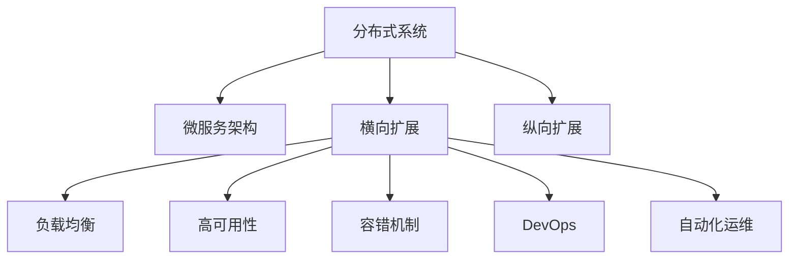

                 

# 横向与纵向扩展的实现方法

> 关键词：横向扩展, 纵向扩展, 分布式系统, 云计算, 微服务架构, 负载均衡, 高可用性, 容错机制, DevOps, 自动化运维

## 1. 背景介绍

### 1.1 问题由来
随着互联网技术的快速发展，企业对于系统处理能力和业务容量的需求日益增长。系统需要应对越来越大的流量和数据量，对系统的可用性、扩展性、性能和稳定性也提出了更高要求。传统单体应用已难以满足企业不断增长的需求，需要通过扩展来提升系统的整体性能和可维护性。

### 1.2 问题核心关键点
系统扩展分为横向扩展和纵向扩展两大类。横向扩展是通过增加系统实例来提升性能；纵向扩展是通过升级硬件或增加内存等资源来提升性能。本文将重点探讨横向扩展，通过微服务架构和云计算等技术手段，实现系统的高可用性、高性能和易扩展性。

### 1.3 问题研究意义
通过合理设计系统架构，实现横向扩展，可以提升系统的性能和可用性，满足企业对高并发和大流量的需求。同时，扩展过程能够最大程度地利用云计算等资源，降低运营成本，提高系统的稳定性和可维护性。

## 2. 核心概念与联系

### 2.1 核心概念概述

为更好地理解横向与纵向扩展的实现方法，本节将介绍几个密切相关的核心概念：

- 横向扩展（Scale Out）：指通过增加系统实例来提升性能和容量。例如，通过增加服务器实例或容器实例来提升系统处理能力和吞吐量。
- 纵向扩展（Scale Up）：指通过升级硬件或增加内存等资源来提升性能。例如，通过增加服务器硬件配置或内存来提升系统处理能力。
- 分布式系统（Distributed System）：指由多个独立的计算节点组成的系统，通过网络进行通信和数据共享，以实现系统的高可用性和扩展性。
- 微服务架构（Microservices Architecture）：指将大系统拆分为多个小的、独立的服务单元，每个服务负责特定的业务逻辑，通过网络进行通信。
- 负载均衡（Load Balancing）：指通过将请求分散到多个实例中，提升系统的处理能力和响应速度，同时保证系统的可用性和稳定性。
- 高可用性（High Availability）：指系统在各种故障情况下仍能正常运行的能力，通常通过冗余和容错机制实现。
- 容错机制（Fault Tolerance）：指系统在发生故障时，能够通过重试、自动恢复等手段，保持系统正常运行。
- DevOps：指开发与运维的紧密结合，通过自动化工具和持续交付流程，提升系统开发和运维效率。
- 自动化运维（Automated Operations）：指通过自动化工具和脚本，实现系统部署、监控、维护和优化等操作，提升系统稳定性和可维护性。

这些核心概念之间的逻辑关系可以通过以下Mermaid流程图来展示：



这个流程图展示了大系统扩展的核心概念及其之间的关系：

1. 分布式系统通过多个节点协同工作，提供高可用性和扩展性。
2. 微服务架构将系统拆分为多个独立的服务单元，提升系统灵活性和扩展性。
3. 横向扩展通过增加实例提升系统容量和性能，通过负载均衡和高可用性保证系统稳定。
4. 纵向扩展通过升级硬件提升性能，通过容错机制和自动化运维提升系统稳定性和可维护性。
5. DevOps通过自动化流程提升系统开发和运维效率，支持系统的持续交付和优化。

## 3. 核心算法原理 & 具体操作步骤

### 3.1 算法原理概述

系统扩展的核心是合理设计系统架构，实现高效的资源利用和业务编排。横向扩展的原理是通过增加系统实例，实现负载均衡和高可用性，提升系统性能和可用性。具体实现过程包括：

1. 系统拆分：将大系统拆分为多个小的、独立的服务单元，每个服务单元负责特定的业务逻辑。
2. 实例创建：根据负载情况，动态创建和销毁实例，提升系统容量和性能。
3. 负载均衡：将请求分散到多个实例中，提升系统处理能力和响应速度，同时保证系统的可用性和稳定性。
4. 高可用性：通过冗余和容错机制，实现系统在各种故障情况下的正常运行。
5. 容错机制：通过重试、自动恢复等手段，保持系统在故障情况下的正常运行。
6. DevOps：通过自动化工具和持续交付流程，提升系统开发和运维效率，支持系统的持续交付和优化。

### 3.2 算法步骤详解

横向扩展的实现步骤包括以下几个关键步骤：

**Step 1: 系统拆分与设计**

- 根据业务需求，将大系统拆分为多个小的、独立的服务单元。每个服务单元负责特定的业务逻辑。
- 设计服务之间的通信协议和接口，支持服务间的协调和数据共享。
- 选择合适的基础设施平台，如Kubernetes、Docker Swarm等，支持服务的编排和调度。

**Step 2: 实例创建与配置**

- 根据负载情况，动态创建和销毁实例。可以使用Kubernetes等容器编排工具，实现自动扩展。
- 配置实例的资源限制和调度策略，保证实例高效利用资源，避免资源浪费。
- 配置实例的自动恢复和重试策略，保证实例在故障情况下快速恢复。

**Step 3: 负载均衡与高可用性**

- 配置负载均衡器，将请求分散到多个实例中，提升系统处理能力和响应速度。
- 实现服务的自动故障检测和切换，保证系统的可用性和稳定性。
- 设计服务的冗余机制，实现数据的备份和恢复，避免单点故障。

**Step 4: DevOps与自动化运维**

- 设计持续交付流程，支持系统的自动化部署和更新。
- 配置监控工具，实时监控系统的性能和状态，及时发现和解决问题。
- 配置报警系统，设定告警规则，及时通知运维人员处理异常情况。
- 实现自动化运维流程，包括自动部署、自动回滚、自动扩缩容等，提升系统稳定性和可维护性。

### 3.3 算法优缺点

横向扩展的优点包括：

- 扩展性强：可以根据负载情况，动态增加或减少实例，实现系统的灵活扩展。
- 资源利用率高：通过实例的并行处理，充分利用系统资源，提升系统性能。
- 系统可靠性高：通过负载均衡和高可用性机制，提升系统的稳定性和容错能力。

同时，横向扩展也存在一些缺点：

- 管理复杂：需要管理多个实例和服务，增加运维工作量。
- 网络延迟：多个实例之间需要通过网络通信，可能存在网络延迟和通信开销。
- 数据一致性：分布式系统需要解决数据一致性和同步问题，增加系统复杂性。

尽管存在这些局限性，但横向扩展仍然是现代企业系统的主要扩展方式，能够有效应对大规模数据和高并发流量的需求。

### 3.4 算法应用领域

横向扩展广泛应用于云计算、互联网、金融、电商等多个领域，其应用场景包括：

- 云计算平台：如AWS、Azure、阿里云等，提供弹性扩展和按需使用资源。
- 互联网应用：如电商网站、社交媒体、在线教育等，需要应对大规模用户并发请求。
- 金融系统：如股票交易、支付系统、银行等，需要应对高频交易和大数据量处理。
- 电商平台：如淘宝、京东、亚马逊等，需要应对海量用户和商品数据。
- 智能制造：如工业互联网、物联网等，需要应对实时数据和复杂业务逻辑。

除了这些常见的应用场景外，横向扩展还被广泛应用于数据仓库、数据湖、大数据处理等领域，提升系统的处理能力和容错能力。

## 4. 数学模型和公式 & 详细讲解 & 举例说明（备注：数学公式请使用latex格式，latex嵌入文中独立段落使用 $$，段落内使用 $)
### 4.1 数学模型构建

横向扩展的数学模型主要涉及系统实例数、负载、处理能力和资源成本等因素。以一个典型的电商网站为例，设系统的负载为 $L$，每个实例的处理能力为 $C$，系统实例数为 $N$，系统总成本为 $C_{total}$。

定义系统实例数为 $N$，每个实例的处理能力为 $C$，负载为 $L$。假设每个实例的初始处理能力为 $C_0$，系统的负载为 $L$，则系统的总处理能力为 $N \times C_0$。为了提升系统的处理能力，需要增加系统实例数 $N$，直到满足 $N \times C_0 \geq L$。假设每个实例的资源成本为 $c$，系统的总成本为 $C_{total}$，则系统总成本可以表示为 $N \times c + C_{fixed}$，其中 $C_{fixed}$ 为固定成本。

### 4.2 公式推导过程

根据上述假设，系统的总处理能力和总成本可以表示为：

$$
C_{total} = N \times c + C_{fixed}
$$

在实际应用中，需要根据系统的负载情况动态调整系统实例数 $N$。假设系统的负载在时间 $t$ 时刻为 $L_t$，系统实例数为 $N_t$，每个实例的处理能力为 $C_t$。系统实例数 $N_t$ 可以通过以下公式计算：

$$
N_t = \lceil \frac{L_t}{C_t} \rceil
$$

其中 $\lceil \rceil$ 表示向上取整。为了保证系统实例数 $N_t$ 的合理性，需要对处理能力和资源成本进行优化。假设系统的最优处理能力为 $C_{opt}$，最优系统实例数为 $N_{opt}$，则最优系统实例数为：

$$
N_{opt} = \lceil \frac{L_t}{C_{opt}} \rceil
$$

此时，系统的总成本最小，即：

$$
C_{opt} = N_{opt} \times c + C_{fixed}
$$

### 4.3 案例分析与讲解

以一个电商网站为例，假设系统的负载在时间 $t$ 时刻为 $L_t$，每个实例的处理能力为 $C_t = 1000$，资源成本为 $c = 100$，固定成本为 $C_{fixed} = 10000$。系统的最优处理能力 $C_{opt} = 2000$，则系统实例数 $N_{opt} = \lceil \frac{L_t}{C_{opt}} \rceil = \lceil \frac{L_t}{2000} \rceil$。

当 $L_t = 2000$ 时，系统实例数 $N_{opt} = 1$，此时系统总成本为 $10000 + 1 \times 100 = 11100$。当 $L_t = 4000$ 时，系统实例数 $N_{opt} = 2$，此时系统总成本为 $20000 + 2 \times 100 = 20300$。当 $L_t = 6000$ 时，系统实例数 $N_{opt} = 3$，此时系统总成本为 $30000 + 3 \times 100 = 30100$。

可以看出，当系统负载增加时，系统实例数和总成本也相应增加。但是，最优处理能力和最优实例数的增加，可以有效提升系统的处理能力和容错能力，降低单位成本。因此，合理设计系统实例数和处理能力，可以有效降低系统的总成本，提升系统的性能和稳定性。

## 5. 项目实践：代码实例和详细解释说明
### 5.1 开发环境搭建

在进行横向扩展的实践前，我们需要准备好开发环境。以下是使用Python进行Kubernetes开发的环境配置流程：

1. 安装Docker：从官网下载并安装Docker，用于构建和运行容器。

2. 安装Kubernetes：选择官方安装或从云平台（如GCP、AWS等）部署Kubernetes，用于管理容器实例。

3. 安装Helm：安装Helm包管理工具，用于快速部署和管理Kubernetes资源。

4. 安装Prometheus和Grafana：安装监控和报警工具，实时监控系统状态，并可视化展示。

5. 安装Jenkins：安装自动化运维工具，实现持续交付和自动化部署。

完成上述步骤后，即可在Kubernetes环境中开始横向扩展的实践。

### 5.2 源代码详细实现

下面我们以一个简单的电商网站为例，展示如何使用Kubernetes进行横向扩展的实现。

首先，定义电商网站的微服务架构：

```python
from flask import Flask
import requests

app = Flask(__name__)

@app.route('/product')
def product():
    return requests.get('http://product-service/api/product/1').json()

@app.route('/order')
def order():
    return requests.get('http://order-service/api/order/1').json()

@app.route('/')
def home():
    return 'Welcome to the e-commerce website'
```

然后，使用Docker容器化应用，并发布到Kubernetes：

```python
# 构建Docker镜像
docker build -t ecommerce-app .

# 发布到Kubernetes
kubectl create deployment ecommerce-app --image=ecommerce-app --replicas=1

# 设置服务
kubectl expose deployment ecommerce-app --port=80 --target-port=80

# 设置副本数
kubectl scale deployment ecommerce-app --replicas=2
```

最后，设置负载均衡和高可用性：

```python
# 创建服务
kubectl create service kube-system loadbalancer --selector ecommerce-app

# 设置副本数
kubectl scale deployment ecommerce-app --replicas=3

# 设置容错机制
kubectl create horizontal pod autoscaler hpa --name ecommerce-app-hpa --min=1 --max=10 --target-cpu-utilization=50
```

以上就是使用Kubernetes进行横向扩展的完整代码实现。可以看到，Kubernetes提供了强大的容器编排和管理能力，能够实现系统的自动扩展和容错机制，保证系统的稳定性和可维护性。

### 5.3 代码解读与分析

让我们再详细解读一下关键代码的实现细节：

**Flask应用**：
- `Flask`是一个轻量级的Web框架，用于构建Web应用。
- 定义了三个路由，分别对应商品、订单和首页。

**Docker镜像构建**：
- 使用Docker构建应用镜像，支持自动部署和扩展。
- 使用 `docker build` 命令构建镜像，并在Docker Hub中发布镜像。

**Kubernetes部署**：
- 使用 `kubectl create deployment` 命令创建Deployment，指定镜像和副本数。
- 使用 `kubectl expose` 命令将服务暴露到外部，支持外部访问。
- 使用 `kubectl scale` 命令动态调整副本数，实现自动扩展。

**Kubernetes HPA（Horizontal Pod Autoscaler）**：
- 使用 `kubectl create horizontal pod autoscaler` 命令创建Horizontal Pod Autoscaler，实现自动扩展。
- 设置副本数的上下限，确保系统的稳定性和资源利用率。

**Kubernetes Service**：
- 使用 `kubectl create service` 命令创建Service，将应用实例暴露到外部。
- 使用 `kubectl get service` 命令查看服务的详情。

可以看到，Kubernetes通过部署、服务、HPA等资源，实现了系统的横向扩展和负载均衡，能够动态调整实例数，提升系统的处理能力和容错能力。

## 6. 实际应用场景
### 6.1 智能制造

智能制造系统需要应对大量的实时数据和复杂业务逻辑，对系统的处理能力和容错能力提出了高要求。通过横向扩展，智能制造系统可以实现资源的动态调整和负载均衡，提升系统的响应速度和稳定性。

在实际应用中，智能制造系统可以使用微服务架构将系统拆分为多个独立的服务单元，如设备管理、生产调度、质量控制等，通过Kubernetes进行容器编排和调度。根据负载情况，动态增加或减少实例，实现自动扩展。通过负载均衡和高可用性机制，提升系统的稳定性，保证系统的正常运行。

### 6.2 金融交易

金融交易系统需要应对高频交易和大数据量处理，对系统的处理能力和容错能力提出了高要求。通过横向扩展，金融交易系统可以实现资源的动态调整和负载均衡，提升系统的响应速度和稳定性。

在实际应用中，金融交易系统可以使用微服务架构将系统拆分为多个独立的服务单元，如交易引擎、数据存储、用户管理等，通过Kubernetes进行容器编排和调度。根据负载情况，动态增加或减少实例，实现自动扩展。通过负载均衡和高可用性机制，提升系统的稳定性，保证系统的正常运行。

### 6.3 智慧城市

智慧城市系统需要应对大量的城市事件和传感器数据，对系统的处理能力和容错能力提出了高要求。通过横向扩展，智慧城市系统可以实现资源的动态调整和负载均衡，提升系统的响应速度和稳定性。

在实际应用中，智慧城市系统可以使用微服务架构将系统拆分为多个独立的服务单元，如事件监控、数据分析、告警通知等，通过Kubernetes进行容器编排和调度。根据负载情况，动态增加或减少实例，实现自动扩展。通过负载均衡和高可用性机制，提升系统的稳定性，保证系统的正常运行。

### 6.4 未来应用展望

随着横向扩展技术的不断进步，未来的应用场景将更加广泛，包括以下几个方面：

1. 物联网（IoT）：智能设备和传感器将产生大量的数据，通过横向扩展提升系统的处理能力和容错能力，实现设备的智能管理和数据分析。
2. 自动驾驶：自动驾驶系统需要应对复杂的交通环境和实时数据，通过横向扩展提升系统的稳定性和响应速度，实现安全可靠的自动驾驶。
3. 大数据分析：大数据分析系统需要处理海量数据，通过横向扩展提升系统的处理能力和容错能力，实现高效的数据分析和挖掘。
4. 人工智能：人工智能系统需要处理复杂的算法和数据，通过横向扩展提升系统的处理能力和容错能力，实现高效的人工智能应用。

随着技术的不断发展，横向扩展将变得更加灵活和高效，能够更好地应对各种复杂的业务场景和数据需求，为各行各业提供更加强大、可靠的系统支持。

## 7. 工具和资源推荐
### 7.1 学习资源推荐

为了帮助开发者系统掌握横向扩展的理论基础和实践技巧，这里推荐一些优质的学习资源：

1. 《Kubernetes官方文档》：Kubernetes官方文档，详细介绍了Kubernetes的安装、部署、资源管理等内容，是学习Kubernetes的最佳资源。
2. 《Docker官方文档》：Docker官方文档，详细介绍了Docker的安装、镜像构建、容器管理等内容，是学习Docker的最佳资源。
3. 《Microservices: The real-world guide to designing and building distributed systems》：介绍微服务架构和分布式系统的设计理念和实现方法，是学习微服务架构的优秀资源。
4. 《DevOps实践指南》：DevOps实践指南，详细介绍了DevOps的理念、工具和流程，是学习DevOps的最佳资源。
5. 《分布式系统基础》：介绍分布式系统的设计理念和实现方法，是学习分布式系统的优秀资源。

通过对这些资源的学习实践，相信你一定能够快速掌握横向扩展的精髓，并用于解决实际的系统问题。

### 7.2 开发工具推荐

高效的开发离不开优秀的工具支持。以下是几款用于横向扩展开发的常用工具：

1. Kubernetes：Kubernetes，开源的容器编排工具，提供强大的资源管理和服务编排能力，支持自动扩展和容错机制。
2. Helm：Helm，Kubernetes的包管理工具，用于快速部署和管理Kubernetes资源。
3. Docker：Docker，开源的容器化工具，支持应用程序的打包、构建、部署和运行，提升系统的稳定性和可维护性。
4. Jenkins：Jenkins，开源的自动化运维工具，支持持续交付和自动化部署，提升系统的开发和运维效率。
5. Prometheus：Prometheus，开源的监控和报警工具，支持实时监控系统状态，并可视化展示。
6. Grafana：Grafana，开源的数据可视化工具，支持将监控数据图表化展示，提升系统的可视化和决策能力。

合理利用这些工具，可以显著提升横向扩展的开发效率，加快创新迭代的步伐。

### 7.3 相关论文推荐

横向扩展技术的不断发展源于学界的持续研究。以下是几篇奠基性的相关论文，推荐阅读：

1. "Google's Kubernetes: Protecting Your Most Mission-Critical Workloads"：介绍Kubernetes的设计理念和实现方法，是学习Kubernetes的最佳资源。
2. "Docker: The Run Anything Computing Language"：介绍Docker的设计理念和实现方法，是学习Docker的最佳资源。
3. "Microservices: A Digital Platform Strategy"：介绍微服务架构的设计理念和实现方法，是学习微服务架构的优秀资源。
4. "Automated Operations"：介绍DevOps的理念、工具和流程，是学习DevOps的最佳资源。
5. "The Design and Implementation of Linux Networking"：介绍分布式系统的设计理念和实现方法，是学习分布式系统的优秀资源。

这些论文代表了大系统扩展技术的不断发展，帮助研究者把握学科前进方向，激发更多的创新灵感。

## 8. 总结：未来发展趋势与挑战

### 8.1 总结

本文对横向扩展的实现方法进行了全面系统的介绍。首先阐述了横向扩展的背景和意义，明确了横向扩展在提升系统性能和可用性方面的独特价值。其次，从原理到实践，详细讲解了横向扩展的数学模型和关键步骤，给出了横向扩展任务开发的完整代码实例。同时，本文还广泛探讨了横向扩展方法在智能制造、金融交易、智慧城市等多个行业领域的应用前景，展示了横向扩展方法的巨大潜力。

通过本文的系统梳理，可以看到，横向扩展技术正在成为现代企业系统的主要扩展方式，能够有效应对大规模数据和高并发流量的需求。未来，伴随技术的不懈探索和创新，横向扩展将不断进步，为系统扩展提供更加高效、灵活、可靠的解决方案。

### 8.2 未来发展趋势

展望未来，横向扩展技术将呈现以下几个发展趋势：

1. 智能化扩展：通过机器学习和预测算法，动态调整系统实例数和资源配置，实现智能化的扩展。
2. 自适应扩展：根据系统负载和资源利用情况，自动调整实例数和资源配置，实现自适应的扩展。
3. 微服务治理：通过服务网格和服务治理，提升微服务架构的稳定性和可维护性。
4. 容器编排优化：通过优化容器编排和调度策略，提升容器的利用率和调度效率。
5. 分布式计算优化：通过优化分布式计算和数据存储策略，提升系统的性能和容错能力。
6. 跨云扩展：通过云平台之间的资源和数据共享，实现跨云扩展和资源优化。

以上趋势凸显了横向扩展技术的广阔前景。这些方向的探索发展，必将进一步提升系统的性能和稳定性，为构建更加灵活、高效、可靠的分布式系统铺平道路。

### 8.3 面临的挑战

尽管横向扩展技术已经取得了一定的成果，但在迈向更加智能化、自适应化的过程中，它仍面临着诸多挑战：

1. 系统复杂性增加：微服务架构和服务治理的引入，增加了系统的复杂性和管理难度。
2. 资源消耗增加：横向扩展需要大量的计算和存储资源，增加系统的硬件和网络负担。
3. 数据一致性问题：分布式系统需要解决数据一致性和同步问题，增加系统复杂性。
4. 系统可靠性问题：分布式系统的可靠性和容错能力需要持续优化和测试，保证系统的稳定性和可维护性。
5. 自动化运维问题：自动化运维流程和工具的引入，需要持续优化和升级，保证系统的持续交付和优化。

正视横向扩展面临的这些挑战，积极应对并寻求突破，将使横向扩展技术更加成熟和稳定。只有不断优化和创新，才能真正实现系统的灵活扩展和高效运营。

### 8.4 研究展望

面对横向扩展面临的挑战，未来的研究需要在以下几个方面寻求新的突破：

1. 智能化扩展算法：探索智能化扩展算法，实现动态调整系统实例数和资源配置，提升系统的智能化水平。
2. 自适应扩展算法：探索自适应扩展算法，根据系统负载和资源利用情况，自动调整实例数和资源配置，实现自适应的扩展。
3. 微服务治理工具：开发微服务治理工具，提升微服务架构的稳定性和可维护性。
4. 容器编排优化算法：优化容器编排和调度策略，提升容器的利用率和调度效率。
5. 分布式计算优化算法：优化分布式计算和数据存储策略，提升系统的性能和容错能力。
6. 跨云扩展技术：探索跨云扩展技术，通过云平台之间的资源和数据共享，实现跨云扩展和资源优化。

这些研究方向的探索，必将引领横向扩展技术迈向更高的台阶，为构建安全、可靠、可扩展的分布式系统提供更加全面的解决方案。面向未来，横向扩展技术还需要与其他人工智能技术进行更深入的融合，如知识表示、因果推理、强化学习等，多路径协同发力，共同推动分布式系统的进步。

## 9. 附录：常见问题与解答

**Q1：横向扩展和纵向扩展有什么区别？**

A: 横向扩展和纵向扩展都是系统扩展的方式，但实现方式有所不同。横向扩展通过增加系统实例实现扩展，适用于需要动态处理大量数据和请求的场景；纵向扩展通过升级硬件或增加内存等资源实现扩展，适用于需要处理大规模数据或高并发的场景。

**Q2：横向扩展过程中需要注意哪些问题？**

A: 横向扩展过程中需要注意以下几个问题：
1. 负载均衡：将请求分散到多个实例中，提升系统处理能力和响应速度。
2. 高可用性：通过冗余和容错机制，实现系统在各种故障情况下的正常运行。
3. 数据一致性：解决分布式系统中的数据一致性和同步问题。
4. 系统可靠性：通过重试、自动恢复等手段，保持系统在故障情况下的正常运行。
5. 资源优化：合理管理系统资源，提升资源利用率和系统性能。

**Q3：如何实现系统的智能化扩展？**

A: 实现系统的智能化扩展需要以下几个步骤：
1. 收集系统负载数据，使用机器学习算法预测未来负载情况。
2. 根据预测结果，动态调整系统实例数和资源配置。
3. 使用自动扩缩容工具，实时调整实例数和资源配置，实现智能化的扩展。
4. 定期评估系统性能，优化预测算法和扩展策略。

**Q4：如何实现系统的自适应扩展？**

A: 实现系统的自适应扩展需要以下几个步骤：
1. 收集系统性能数据，使用自适应算法实时调整实例数和资源配置。
2. 根据系统性能数据，动态调整实例数和资源配置，实现自适应的扩展。
3. 使用自动化运维工具，实现系统的持续交付和优化。
4. 定期评估系统性能，优化自适应算法和扩展策略。

**Q5：如何在横向扩展中实现负载均衡？**

A: 在横向扩展中实现负载均衡需要以下几个步骤：
1. 将系统实例暴露到服务集群中。
2. 配置负载均衡器，将请求分散到多个实例中。
3. 实时监控系统负载，动态调整负载均衡策略。
4. 使用容错机制，确保系统的正常运行。

可以看出，横向扩展技术通过微服务架构和容器编排等手段，实现了系统的灵活扩展和容错机制，能够有效应对大规模数据和高并发流量的需求。

---

作者：禅与计算机程序设计艺术 / Zen and the Art of Computer Programming

