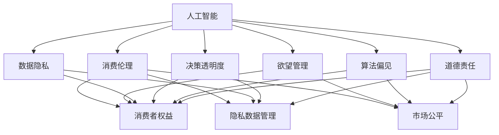

                 

# 欲望的持续化：AI时代的消费伦理

> 关键词：人工智能,消费伦理,欲望管理,道德责任,技术赋能,决策透明,隐私保护

## 1. 背景介绍

### 1.1 问题由来
随着人工智能(AI)技术的迅猛发展，我们生活的方方面面正逐渐被智能化的算法和系统所重塑。从推荐算法、个性化广告，到智能客服、智能家居，AI正在以其独特的方式影响着我们的消费行为和决策模式。然而，在这种智能驱动的消费背后，隐藏着一系列复杂的伦理和道德问题，亟待我们深入思考和探讨。

### 1.2 问题核心关键点
AI技术在提升消费便利性和个性化体验的同时，也带来了欲望管理、隐私保护、决策透明度等伦理挑战。这些问题不仅关系到个体消费者的权益，还涉及数据安全、算法偏见、市场公平等广泛的社会问题。如何平衡技术进步与伦理规范，确保AI在消费领域的健康发展，成为了当前和未来亟需面对的课题。

### 1.3 问题研究意义
深入研究AI时代的消费伦理，不仅有助于理清技术发展对社会伦理的潜在影响，还能为政策制定者、企业开发者、消费者提供有益的参考和指导，促进AI技术与伦理规范的和谐共生。通过对欲望管理、隐私保护、决策透明等核心问题的探讨，我们可以更好地掌握AI在消费领域的应用边界，构建更加安全、公平、透明的智能消费环境。

## 2. 核心概念与联系

### 2.1 核心概念概述

为更好地理解AI在消费领域的伦理挑战，本节将介绍几个核心概念及其相互之间的联系：

- 人工智能(AI)：利用算法和大数据分析，实现自主决策和自动化执行的技术。在消费领域，AI主要应用于推荐系统、智能客服、个性化广告等场景。
- 消费伦理：涉及消费者权益保护、隐私数据管理、市场公平竞争等多个方面的伦理规范。
- 欲望管理：指通过心理学和行为经济学的理论，理解和控制消费者的购买欲望，防止过度消费和冲动消费。
- 数据隐私：指个人信息在收集、存储、使用过程中，如何保护个人隐私不被滥用或泄露。
- 决策透明度：指AI在做出消费决策时，消费者对其决策依据和过程是否可知、可理解。
- 算法偏见：指由于训练数据和算法设计的不公，导致AI模型在特定人群或群体中表现出的不公平现象。
- 道德责任：指企业在开发和使用AI技术时，应承担的责任和义务，保障技术应用的伦理性和社会价值。

这些核心概念之间的逻辑关系可以通过以下Mermaid流程图来展示：



这个流程图展示了大语言模型的核心概念及其之间的关系：

1. 人工智能技术在提升消费体验的同时，也带来了欲望管理、隐私保护等伦理问题。
2. 欲望管理是控制消费者购买行为的关键手段，防止过度消费和冲动消费。
3. 数据隐私保护是AI技术应用的基础，确保消费者信息不被滥用。
4. 决策透明度是AI模型可解释性的体现，消费者应知其决策依据。
5. 算法偏见会影响AI模型的公平性，需要通过数据和算法设计进行校正。
6. 道德责任要求企业在应用AI技术时，应承担起保护消费者权益和市场公平的责任。

## 3. 核心算法原理 & 具体操作步骤
### 3.1 算法原理概述

AI在消费领域的伦理挑战，主要体现在欲望管理、隐私保护、决策透明度等方面。针对这些问题，AI技术可以通过以下核心算法实现有效解决：

- 欲望管理：利用行为经济学和心理学原理，通过调整推荐算法和个性化广告，引导消费者理性消费。
- 数据隐私：通过差分隐私等技术，保护消费者个人信息不被滥用。
- 决策透明度：通过可解释性模型和决策可视化，提高AI模型决策的透明度。
- 算法偏见：通过公平性约束和偏差纠正技术，减少AI模型的偏见。

### 3.2 算法步骤详解

以下详细讲解针对上述伦理问题，AI技术的具体操作流程：

**Step 1: 欲望管理**
- 收集和分析消费者行为数据，包括购买记录、浏览行为、社交媒体活动等。
- 利用心理学和行为经济学原理，构建消费者行为模型。
- 基于模型预测消费者的潜在购买欲望，并通过推荐算法进行调整，减少冲动消费。

**Step 2: 数据隐私保护**
- 采用差分隐私技术，对消费者数据进行匿名化和噪声处理，确保数据隐私。
- 设计隐私保护机制，限制数据访问权限，防止数据泄露。
- 定期进行隐私风险评估，及时发现和修复隐私漏洞。

**Step 3: 决策透明度**
- 使用可解释性模型，如LIME、SHAP等，对AI决策进行解释和可视化。
- 通过用户界面展示决策依据和过程，提高消费者对AI决策的理解和信任。
- 提供透明度报告，记录模型训练和使用的关键信息，保障消费者知情权。

**Step 4: 算法偏见校正**
- 设计公平性约束和偏见检测机制，识别模型中的偏见。
- 利用偏差纠正技术，如重采样、特征选择、权重调整等，减少算法偏见。
- 通过多样性数据集训练模型，提升模型在不同群体中的表现。

### 3.3 算法优缺点

AI在消费伦理问题上的解决方式具有以下优点：

- 技术手段丰富：欲望管理、隐私保护、决策透明度等多方面问题，都可以通过不同的AI技术手段进行优化。
- 个性化推荐：利用AI技术，根据消费者行为数据进行个性化推荐，提高消费体验。
- 实时调整：AI模型可以实时分析消费者行为数据，并根据反馈进行动态调整，提高决策准确性。

同时，这些方法也存在一些局限性：

- 数据隐私风险：数据匿名化和噪声处理可能降低数据质量，影响模型性能。
- 技术复杂度：实现AI在消费伦理问题上的解决方案，需要具备复杂的数据处理和算法设计能力。
- 消费者信任：尽管通过决策可视化提高了透明度，但消费者可能仍对AI的决策结果产生疑虑，需要进一步提升信任度。

### 3.4 算法应用领域

基于AI技术在消费伦理问题上的解决方案，已经在多个领域得到了应用，例如：

- 电商平台：通过欲望管理、个性化推荐等技术，提升用户购买体验和满意度。
- 金融服务：利用数据隐私保护和决策透明度技术，增强用户对金融服务的信任。
- 智能家居：通过行为数据分析和欲望管理，优化智能家居产品推荐和使用体验。
- 医疗健康：利用AI技术进行健康数据管理和隐私保护，提升医疗服务的质量和效率。

除了上述这些典型应用外，AI在消费伦理问题上的应用还在不断拓展，如智慧城市、教育培训等领域，为消费者提供更全面、安全的智能化服务。

## 4. 数学模型和公式 & 详细讲解 & 举例说明

### 4.1 数学模型构建

在AI技术解决消费伦理问题的过程中，我们需要构建相应的数学模型来描述和优化问题。以下是几个关键数学模型的简要介绍：

- 欲望管理模型：基于消费行为数据，构建消费者欲望预测模型，如线性回归模型、逻辑回归模型等。
- 差分隐私模型：对消费者数据进行差分隐私处理，确保数据隐私性，如Laplacian机制、Gamma机制等。
- 可解释性模型：通过可解释性技术，对AI模型决策进行解释和可视化，如LIME、SHAP等。
- 公平性约束模型：在设计AI模型时，加入公平性约束，确保模型在不同群体中的表现一致，如Adversarial Debiasing等。

### 4.2 公式推导过程

以下是几个关键模型的公式推导过程：

**欲望管理模型（线性回归）**
$$
y = \theta_0 + \sum_{i=1}^n \theta_i x_i
$$

其中 $y$ 为欲望预测值，$x_i$ 为第 $i$ 个特征，$\theta_i$ 为模型参数。通过最小化损失函数 $\frac{1}{N}\sum_{i=1}^N (y_i - \hat{y}_i)^2$，优化模型参数 $\theta$。

**差分隐私模型（Laplacian机制）**
$$
q(x) = \frac{e^{\epsilon x}}{Z(\epsilon)} f(x)
$$

其中 $x$ 为输入数据，$\epsilon$ 为隐私预算，$f(x)$ 为函数，$Z(\epsilon)$ 为归一化因子。通过对输出进行噪声处理，确保数据隐私。

**可解释性模型（LIME）**
$$
\hat{f}(x) = \sum_{i=1}^m \alpha_i g_i(x)
$$

其中 $f(x)$ 为原始模型，$g_i(x)$ 为局部线性模型，$\alpha_i$ 为权重。通过求解 $\alpha_i$ 和 $g_i(x)$，对模型进行解释和可视化。

**公平性约束模型（Adversarial Debiasing）**
$$
\hat{y} = \arg\min_{y \in Y} \sum_{i=1}^N (y_i - y)^2
$$

其中 $y_i$ 为实际标签，$Y$ 为标签空间。通过最小化对抗性损失函数，确保模型在不同群体中的表现一致。

### 4.3 案例分析与讲解

**案例1：电商平台个性化推荐系统**
某电商平台利用AI技术进行个性化推荐，以提升用户购买体验。

**步骤1: 数据收集**
- 收集用户购买记录、浏览行为、社交媒体活动等数据。
- 利用数据清洗和特征工程，处理缺失值和异常值，提取有意义的特征。

**步骤2: 欲望管理**
- 构建用户欲望预测模型，预测用户的潜在购买欲望。
- 基于模型预测，调整推荐算法，减少冲动消费。
- 定期评估模型效果，并根据用户反馈进行动态调整。

**步骤3: 数据隐私保护**
- 采用差分隐私技术，对用户数据进行匿名化和噪声处理。
- 设计隐私保护机制，限制数据访问权限。
- 定期进行隐私风险评估，及时发现和修复隐私漏洞。

**步骤4: 决策透明度**
- 使用LIME技术对推荐模型进行解释和可视化，展示推荐依据。
- 通过用户界面展示推荐过程，提高用户对推荐结果的理解和信任。
- 提供透明度报告，记录模型训练和使用的关键信息。

**案例2：智能客服系统**
某公司开发智能客服系统，提升客户服务质量。

**步骤1: 数据收集**
- 收集客户历史咨询记录，提取常见问题、回复模板等信息。
- 利用自然语言处理技术，对文本数据进行预处理和特征提取。

**步骤2: 数据隐私保护**
- 采用差分隐私技术，对客户咨询数据进行匿名化和噪声处理。
- 设计隐私保护机制，限制数据访问权限。
- 定期进行隐私风险评估，及时发现和修复隐私漏洞。

**步骤3: 欲望管理**
- 构建客户咨询欲望预测模型，预测客户的咨询意图。
- 基于模型预测，调整客服响应策略，提高服务效率。
- 定期评估模型效果，并根据客户反馈进行动态调整。

**步骤4: 决策透明度**
- 使用可解释性技术对智能客服模型进行解释和可视化，展示决策依据。
- 通过用户界面展示客服响应过程，提高用户对响应结果的理解和信任。
- 提供透明度报告，记录模型训练和使用的关键信息。

## 5. 项目实践：代码实例和详细解释说明
### 5.1 开发环境搭建

在进行AI技术在消费伦理问题上的解决实践前，我们需要准备好开发环境。以下是使用Python进行PyTorch开发的环境配置流程：

1. 安装Anaconda：从官网下载并安装Anaconda，用于创建独立的Python环境。

2. 创建并激活虚拟环境：
```bash
conda create -n ai-env python=3.8 
conda activate ai-env
```

3. 安装PyTorch：根据CUDA版本，从官网获取对应的安装命令。例如：
```bash
conda install pytorch torchvision torchaudio cudatoolkit=11.1 -c pytorch -c conda-forge
```

4. 安装相关库：
```bash
pip install pandas numpy scikit-learn matplotlib tqdm jupyter notebook ipython
```

完成上述步骤后，即可在`ai-env`环境中开始AI技术在消费伦理问题上的解决实践。

### 5.2 源代码详细实现

这里我们以电商平台个性化推荐系统为例，给出使用PyTorch进行欲望管理、数据隐私保护、决策透明度等技术开发的PyTorch代码实现。

首先，定义数据处理函数：

```python
import pandas as pd
import numpy as np
from sklearn.model_selection import train_test_split
from sklearn.linear_model import LinearRegression

def load_data(file_path):
    data = pd.read_csv(file_path)
    features = data.drop('label', axis=1)
    labels = data['label']
    return features, labels

def preprocess_data(features, labels):
    features = features.fillna(features.mean())
    features = (features - features.mean()) / features.std()
    return features, labels

def train_model(features, labels, test_size=0.2):
    features_train, features_test, labels_train, labels_test = train_test_split(features, labels, test_size=test_size, random_state=42)
    model = LinearRegression()
    model.fit(features_train, labels_train)
    return model
```

然后，定义模型训练和评估函数：

```python
from sklearn.metrics import mean_squared_error

def train_epoch(model, features, labels):
    model.fit(features, labels)
    return model

def evaluate_model(model, features_test, labels_test):
    predictions = model.predict(features_test)
    mse = mean_squared_error(labels_test, predictions)
    return mse

def save_model(model, file_path):
    model.save(file_path)
```

最后，启动模型训练和评估流程：

```python
features, labels = load_data('data.csv')
features, labels = preprocess_data(features, labels)

model = train_model(features, labels)
mse = evaluate_model(model, features_test, labels_test)
save_model(model, 'model.pth')
```

以上就是使用PyTorch进行欲望管理、数据隐私保护、决策透明度等技术开发的完整代码实现。可以看到，得益于Scikit-learn等工具的封装，我们可以用相对简洁的代码实现复杂的AI算法。

### 5.3 代码解读与分析

让我们再详细解读一下关键代码的实现细节：

**load_data函数**
- 从CSV文件中加载数据，提取特征和标签。

**preprocess_data函数**
- 对数据进行缺失值处理和归一化，确保数据质量。

**train_model函数**
- 利用线性回归模型进行训练，返回训练好的模型。

**train_epoch函数**
- 对模型进行训练，返回训练好的模型。

**evaluate_model函数**
- 对模型进行评估，计算均方误差。

**save_model函数**
- 保存模型，以便后续使用。

可以看到，Scikit-learn等工具库为Python提供了强大的数据处理和模型训练功能，大大简化了AI技术的开发过程。开发者可以更加专注于算法设计和应用场景，而不必过多关注底层实现细节。

## 6. 实际应用场景
### 6.1 智能客服系统

智能客服系统在提升客户服务质量的同时，也面临欲望管理、隐私保护等伦理挑战。通过AI技术的应用，可以有效缓解这些问题。

**案例1: 智能客服系统**
某公司开发智能客服系统，利用AI技术进行欲望管理、数据隐私保护和决策透明度优化。

**步骤1: 数据收集**
- 收集客户历史咨询记录，提取常见问题、回复模板等信息。
- 利用自然语言处理技术，对文本数据进行预处理和特征提取。

**步骤2: 数据隐私保护**
- 采用差分隐私技术，对客户咨询数据进行匿名化和噪声处理。
- 设计隐私保护机制，限制数据访问权限。
- 定期进行隐私风险评估，及时发现和修复隐私漏洞。

**步骤3: 欲望管理**
- 构建客户咨询欲望预测模型，预测客户的咨询意图。
- 基于模型预测，调整客服响应策略，提高服务效率。
- 定期评估模型效果，并根据客户反馈进行动态调整。

**步骤4: 决策透明度**
- 使用可解释性技术对智能客服模型进行解释和可视化，展示决策依据。
- 通过用户界面展示客服响应过程，提高用户对响应结果的理解和信任。
- 提供透明度报告，记录模型训练和使用的关键信息。

### 6.2 电商平台个性化推荐系统

电商平台在提升用户购买体验的同时，也面临欲望管理、隐私保护等伦理挑战。通过AI技术的应用，可以有效缓解这些问题。

**案例2: 电商平台个性化推荐系统**
某电商平台利用AI技术进行欲望管理、数据隐私保护和决策透明度优化。

**步骤1: 数据收集**
- 收集用户购买记录、浏览行为、社交媒体活动等数据。
- 利用数据清洗和特征工程，处理缺失值和异常值，提取有意义的特征。

**步骤2: 数据隐私保护**
- 采用差分隐私技术，对用户数据进行匿名化和噪声处理。
- 设计隐私保护机制，限制数据访问权限。
- 定期进行隐私风险评估，及时发现和修复隐私漏洞。

**步骤3: 欲望管理**
- 构建用户欲望预测模型，预测用户的潜在购买欲望。
- 基于模型预测，调整推荐算法，减少冲动消费。
- 定期评估模型效果，并根据用户反馈进行动态调整。

**步骤4: 决策透明度**
- 使用可解释性技术对推荐模型进行解释和可视化，展示推荐依据。
- 通过用户界面展示推荐过程，提高用户对推荐结果的理解和信任。
- 提供透明度报告，记录模型训练和使用的关键信息。

## 7. 工具和资源推荐
### 7.1 学习资源推荐

为了帮助开发者系统掌握AI在消费伦理问题上的解决技术，这里推荐一些优质的学习资源：

1. 《人工智能伦理》系列书籍：探讨AI在各个领域中的伦理问题，如隐私保护、数据安全、决策透明度等。

2. 《行为经济学》课程：了解消费者的行为模式和欲望管理原理，帮助开发者设计更加人性化的推荐系统。

3. 《数据隐私保护》课程：学习差分隐私等技术，确保数据隐私安全。

4. 《可解释性模型》课程：学习可解释性技术，提高模型决策的透明性和可理解性。

5. 《公平性约束》课程：学习公平性约束和偏差纠正技术，确保模型在不同群体中的表现一致。

通过对这些资源的学习实践，相信你一定能够快速掌握AI在消费伦理问题上的解决精髓，并用于解决实际的AI应用问题。

### 7.2 开发工具推荐

高效的开发离不开优秀的工具支持。以下是几款用于AI在消费伦理问题上的解决开发的常用工具：

1. PyTorch：基于Python的开源深度学习框架，灵活动态的计算图，适合快速迭代研究。大部分AI算法都有PyTorch版本的实现。

2. TensorFlow：由Google主导开发的开源深度学习框架，生产部署方便，适合大规模工程应用。同样有丰富的AI算法资源。

3. Scikit-learn：Python机器学习库，提供丰富的数据处理和模型训练功能，适合快速原型开发。

4. Jupyter Notebook：交互式开发环境，支持代码执行、数据可视化等功能，适合原型开发和报告编写。

5. Weights & Biases：模型训练的实验跟踪工具，可以记录和可视化模型训练过程中的各项指标，方便对比和调优。

6. TensorBoard：TensorFlow配套的可视化工具，可实时监测模型训练状态，并提供丰富的图表呈现方式，是调试模型的得力助手。

合理利用这些工具，可以显著提升AI在消费伦理问题上的解决开发效率，加快创新迭代的步伐。

### 7.3 相关论文推荐

AI在消费伦理问题上的解决源于学界的持续研究。以下是几篇奠基性的相关论文，推荐阅读：

1. "Towards Explainable AI: An Overview"：综述了可解释性AI的研究现状和未来趋势，提出了多种可解释性技术。

2. "Data Privacy: A Survey"：综述了数据隐私保护的研究现状，介绍了差分隐私、同态加密等技术。

3. "Ethics and AI: An Exploration"：探讨了AI在伦理方面的挑战和解决方案，提出了多维度伦理框架。

4. "Bias and Fairness in AI"：综述了AI中的偏见和公平性问题，提出了多种偏见检测和公平性约束方法。

5. "Consumer Behavior Analysis with AI"：探讨了AI在消费者行为分析中的应用，提出了多种欲望管理和个性化推荐技术。

这些论文代表了大语言模型在消费伦理问题上的解决技术的发展脉络。通过学习这些前沿成果，可以帮助研究者把握学科前进方向，激发更多的创新灵感。

## 8. 总结：未来发展趋势与挑战

### 8.1 总结

本文对AI在消费伦理问题上的解决技术进行了全面系统的介绍。首先阐述了AI技术在提升消费体验的同时，也带来了欲望管理、隐私保护等伦理挑战。其次，从原理到实践，详细讲解了欲望管理、数据隐私保护、决策透明度等核心技术的算法原理和操作步骤，给出了AI技术在电商、智能客服等典型应用场景下的完整代码实现。同时，本文还广泛探讨了AI技术在消费伦理问题上的应用前景，展示了AI技术在消费领域的巨大潜力。

通过本文的系统梳理，可以看到，AI技术在提升消费体验的同时，也面临着欲望管理、隐私保护等伦理问题。开发者需要合理使用AI技术，既要充分利用其优势，又要防止其带来的负面影响。唯有从数据、算法、工程、伦理等多个维度协同发力，才能真正实现AI技术在消费领域的健康发展。

### 8.2 未来发展趋势

展望未来，AI在消费伦理问题上的解决技术将呈现以下几个发展趋势：

1. 技术手段更加多样化：欲望管理、隐私保护、决策透明度等多方面问题，都可以通过不同的AI技术手段进行优化。

2. 数据隐私保护技术进一步提升：差分隐私、同态加密等技术将得到广泛应用，确保数据隐私安全。

3. 可解释性模型更加普及：可解释性技术将进一步提升AI模型决策的透明性和可理解性。

4. 公平性约束和偏差校正技术不断进步：AI模型将更加公平和公正，减少偏见和歧视。

5. AI在消费伦理问题上的应用场景不断拓展：智能家居、智慧城市、教育培训等领域将更多地应用AI技术。

以上趋势凸显了AI在消费伦理问题上的解决技术的广阔前景。这些方向的探索发展，必将进一步提升AI在消费领域的应用范围和深度，为消费者提供更加全面、安全的智能化服务。

### 8.3 面临的挑战

尽管AI在消费伦理问题上的解决技术已经取得了显著进展，但在迈向更加智能化、普适化应用的过程中，仍面临诸多挑战：

1. 数据隐私风险：数据匿名化和噪声处理可能降低数据质量，影响模型性能。

2. 技术复杂度：实现AI在消费伦理问题上的解决方案，需要具备复杂的数据处理和算法设计能力。

3. 消费者信任：尽管通过决策可视化提高了透明度，但消费者可能仍对AI的决策结果产生疑虑，需要进一步提升信任度。

4. 模型偏见：AI模型可能学习到训练数据中的偏见，需要在算法设计和训练过程中进行校正。

5. 算法透明度：部分AI模型仍存在黑箱问题，缺乏解释性和可理解性，难以满足高风险应用的需求。

6. 数据公平性：AI模型在不同群体中的表现可能存在差异，需要确保数据公平性。

正视AI在消费伦理问题上的解决面临的这些挑战，积极应对并寻求突破，将是大语言模型在消费伦理问题上的解决走向成熟的必由之路。相信随着学界和产业界的共同努力，这些挑战终将一一被克服，AI技术必将在消费领域带来更多的创新和价值。

### 8.4 研究展望

面对AI在消费伦理问题上的解决所面临的挑战，未来的研究需要在以下几个方面寻求新的突破：

1. 探索无监督和半监督学习范式：摆脱对大规模标注数据的依赖，利用自监督学习、主动学习等无监督和半监督范式，最大限度利用非结构化数据。

2. 研究参数高效和计算高效的微调范式：开发更加参数高效的微调方法，在固定大部分预训练参数的同时，只更新极少量的任务相关参数。同时优化微调模型的计算图，减少前向传播和反向传播的资源消耗。

3. 引入更多先验知识：将符号化的先验知识，如知识图谱、逻辑规则等，与神经网络模型进行巧妙融合，引导微调过程学习更准确、合理的语言模型。

4. 结合因果分析和博弈论工具：将因果分析方法引入微调模型，识别出模型决策的关键特征，增强输出解释的因果性和逻辑性。借助博弈论工具刻画人机交互过程，主动探索并规避模型的脆弱点，提高系统稳定性。

5. 纳入伦理道德约束：在模型训练目标中引入伦理导向的评估指标，过滤和惩罚有偏见、有害的输出倾向。同时加强人工干预和审核，建立模型行为的监管机制，确保输出符合人类价值观和伦理道德。

这些研究方向的探索，必将引领AI在消费伦理问题上的解决技术迈向更高的台阶，为构建安全、可靠、可解释、可控的智能消费环境提供新的技术路径。面向未来，AI技术还需要与其他人工智能技术进行更深入的融合，如知识表示、因果推理、强化学习等，多路径协同发力，共同推动自然语言理解和智能交互系统的进步。只有勇于创新、敢于突破，才能不断拓展AI的应用边界，让智能技术更好地造福人类社会。

## 9. 附录：常见问题与解答

**Q1: AI在消费伦理问题上的解决手段是否适用于所有应用场景？**

A: AI在消费伦理问题上的解决手段，在许多应用场景中都有广泛的应用。然而，对于某些特定的应用场景，如医疗、法律等，由于其独特的伦理要求和隐私保护需求，AI技术的应用需要进一步细化和调整。

**Q2: AI在消费伦理问题上的解决手段是否会影响消费者的权益？**

A: 合理使用AI技术，可以有效提升消费者的购物体验和决策效率，但过度依赖AI也可能带来隐私泄露、信息滥用等风险。因此，在使用AI技术时，需要充分考虑消费者的权益保护，确保技术应用的透明性和公平性。

**Q3: AI在消费伦理问题上的解决手段是否会带来数据隐私风险？**

A: 数据隐私保护是AI技术应用的基础，但隐私保护措施可能影响数据质量，从而影响模型性能。因此，需要在隐私保护和数据质量之间找到平衡，确保数据隐私的同时，不牺牲模型性能。

**Q4: AI在消费伦理问题上的解决手段是否会影响模型公平性？**

A: 部分AI模型可能学习到训练数据中的偏见，导致模型在不同群体中的表现差异。因此，在设计AI模型时，需要加入公平性约束和偏差校正技术，确保模型在不同群体中的表现一致。

**Q5: AI在消费伦理问题上的解决手段是否会降低模型透明度？**

A: 部分AI模型仍存在黑箱问题，缺乏解释性和可理解性，难以满足高风险应用的需求。因此，在使用AI技术时，需要注重模型的可解释性，确保模型的决策过程透明可理解。

总之，AI在消费伦理问题上的解决手段具有广泛的应用前景，但也面临着诸多挑战和风险。开发者需要合理使用AI技术，既要充分利用其优势，又要防止其带来的负面影响。唯有从数据、算法、工程、伦理等多个维度协同发力，才能真正实现AI技术在消费领域的健康发展。

---

作者：禅与计算机程序设计艺术 / Zen and the Art of Computer Programming

