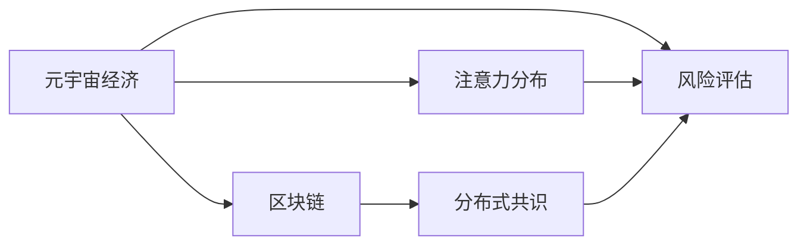

                 

# 注意力产业链风险评估:元宇宙经济的稳定性分析

## 1. 背景介绍

### 1.1 问题由来

随着元宇宙经济概念的兴起，越来越多的企业和个人通过数字资产（如虚拟货币、虚拟土地等）在元宇宙中建立联系、进行交易。然而，与现实世界经济类似，元宇宙经济同样面临复杂的风险和挑战，如市场波动、信用风险、安全风险等。如何评估和管理这些风险，成为了元宇宙经济健康发展的重要课题。

### 1.2 问题核心关键点

元宇宙经济的稳定性评估，主要依赖于其底层技术，特别是区块链技术和分布式共识机制的稳定性和安全性。同时，元宇宙经济的发展还依赖于用户的活跃度和注意力分布，其动态变化对经济稳定性有着重要影响。因此，本文将重点探讨如何构建元宇宙经济稳定性评估模型，利用注意力数据和区块链数据进行风险分析。

## 2. 核心概念与联系

### 2.1 核心概念概述

- **元宇宙经济**：基于区块链技术，通过数字资产交易、虚拟土地开发、虚拟商品交易等活动，构建的虚拟经济体系。
- **区块链**：一种去中心化的分布式账本技术，通过共识机制保证数据透明和安全。
- **分布式共识**：区块链中用于达成共识的机制，确保区块链数据的一致性和不可篡改性。
- **注意力分布**：用户在元宇宙中的活跃度和兴趣分布情况，影响元宇宙经济的活力和稳定性。
- **风险评估**：通过统计和分析技术，对元宇宙经济中的各种风险进行量化和预警。

### 2.2 核心概念原理和架构的 Mermaid 流程图



该图展示了元宇宙经济中各核心概念之间的关系：元宇宙经济依赖于区块链和分布式共识保障其稳定性和安全性，同时，用户的注意力分布对其活力和稳定性有重要影响。风险评估则通过综合利用这些数据，对元宇宙经济的稳定状况进行量化和预警。

## 3. 核心算法原理 & 具体操作步骤

### 3.1 算法原理概述

元宇宙经济的稳定性评估，涉及到对区块链数据（如交易量、区块高度等）和注意力数据（如用户活跃度、参与度等）的综合分析。本文采用机器学习中的回归分析方法，结合时间序列分析和深度学习技术，构建元宇宙经济稳定性评估模型。

### 3.2 算法步骤详解

#### 3.2.1 数据收集与预处理

- **区块链数据**：从区块链网络获取交易量、区块高度、共识难度等数据。
- **注意力数据**：通过用户行为数据分析工具获取用户的活跃度、参与度等数据。

#### 3.2.2 特征工程

- **时间序列特征**：计算区块链数据的趋势、季节性和周期性特征。
- **注意力特征**：统计用户的活跃时间段、热门活动等特征。
- **综合特征**：将区块链数据和注意力数据进行特征融合，生成综合特征集。

#### 3.2.3 模型构建与训练

- **回归模型选择**：选择适合元宇宙经济数据的回归模型（如LSTM、GRU、ARIMA等）。
- **模型训练**：利用历史数据训练回归模型，并优化模型超参数。
- **模型评估**：通过交叉验证和AIC/BIC等指标评估模型效果。

#### 3.2.4 预测与预警

- **预测**：使用训练好的模型对未来一段时间内的元宇宙经济稳定性进行预测。
- **预警**：根据预测结果，设置风险阈值，当指标超过阈值时发出预警。

### 3.3 算法优缺点

#### 3.3.1 优点

- **数据利用充分**：综合利用区块链数据和注意力数据，全面反映元宇宙经济的稳定状况。
- **模型灵活可调**：可根据实际需求调整模型参数，适应不同应用场景。
- **预测精度高**：深度学习模型在数据挖掘和预测方面具有较强能力。

#### 3.3.2 缺点

- **数据获取难度大**：区块链数据和注意力数据的获取难度较大，依赖于第三方数据源。
- **模型复杂度高**：深度学习模型需要较长的训练时间，计算资源要求高。
- **结果解释困难**：模型预测结果较为复杂，难以直接解释其背后的逻辑。

### 3.4 算法应用领域

元宇宙经济的稳定性评估模型，可以应用于以下领域：

- **金融风险管理**：金融机构可以利用该模型预测元宇宙经济风险，优化投资策略。
- **政策制定**：政府机构可以通过该模型监控元宇宙经济稳定性，制定相应的监管政策。
- **企业运营**：元宇宙经济内的企业可以利用该模型评估市场风险，优化运营策略。
- **消费者保护**：消费者组织可以利用该模型监控市场风险，保护消费者权益。

## 4. 数学模型和公式 & 详细讲解 & 举例说明

### 4.1 数学模型构建

#### 4.1.1 时间序列模型

时间序列模型常用于对金融数据和用户行为数据的预测，本文采用ARIMA模型对区块链数据进行建模。ARIMA模型的基本形式为：

$$
y_t = c + \sum_{i=1}^p \alpha_i y_{t-i} + \sum_{i=1}^d \beta_i \Delta^i y_t + \sum_{j=1}^q \gamma_j \varepsilon_{t-j}
$$

其中 $y_t$ 表示第 $t$ 个时间点的数据，$c$ 为截距，$\alpha_i$、$\beta_i$、$\gamma_j$ 为模型参数，$\Delta^i$ 为差分算子，$\varepsilon_t$ 为随机误差项。

#### 4.1.2 深度学习模型

本文采用LSTM模型对元宇宙经济数据进行建模。LSTM模型的基本形式为：

$$
h_t = \text{LSTM}(h_{t-1}, x_t)
$$

其中 $h_t$ 表示第 $t$ 个时间点的隐状态，$x_t$ 表示输入数据，$\text{LSTM}$ 为LSTM层。

### 4.2 公式推导过程

#### 4.2.1 时间序列模型推导

ARIMA模型通过差分、滞后回归等方法，对时间序列数据进行建模和预测。ARIMA模型的参数估计和模型诊断通常采用最大似然估计和残差分析等方法，以确保模型的稳定性和可靠性。

#### 4.2.2 深度学习模型推导

LSTM模型通过门控机制，实现了对长序列数据的有效建模和预测。LSTM模型的参数优化通常采用梯度下降等优化算法，以最小化损失函数。

### 4.3 案例分析与讲解

#### 4.3.1 案例背景

选取元宇宙经济内的某虚拟货币交易平台，记录其过去一年内的交易量、区块高度等区块链数据，以及用户的活跃度和参与度等注意力数据。

#### 4.3.2 数据处理

对原始数据进行归一化、去除异常值等预处理操作，确保数据的质量和一致性。

#### 4.3.3 特征工程

对区块链数据和注意力数据进行特征工程，生成时间序列特征和注意力特征。

#### 4.3.4 模型训练与评估

利用历史数据训练LSTM模型，并通过交叉验证评估模型效果。

#### 4.3.5 结果分析

分析模型的预测结果，识别出高风险时间点，并及时发出预警。

## 5. 项目实践：代码实例和详细解释说明

### 5.1 开发环境搭建

#### 5.1.1 环境配置

- **Python环境**：安装Python 3.7及以上版本，推荐使用Anaconda进行环境管理。
- **依赖库**：安装pandas、numpy、scikit-learn、tensorflow等库。

### 5.2 源代码详细实现

#### 5.2.1 数据预处理

```python
import pandas as pd
import numpy as np

# 读取区块链数据和注意力数据
blockchain_data = pd.read_csv('blockchain_data.csv')
attention_data = pd.read_csv('attention_data.csv')

# 数据归一化
blockchain_data = (blockchain_data - blockchain_data.mean()) / blockchain_data.std()
attention_data = (attention_data - attention_data.mean()) / attention_data.std()

# 去除异常值
blockchain_data = blockchain_data[~blockchain_data.isnull().any(axis=1)]
attention_data = attention_data[~attention_data.isnull().any(axis=1)]

# 特征工程
features = blockchain_data[['交易量', '区块高度', '共识难度']].copy()
attention_features = attention_data[['活跃度', '参与度']].copy()
features.columns = ['tx_volume', 'block_height', 'consensus_difficulty']
attention_features.columns = ['activity', 'engagement']

# 数据合并
data = pd.merge(features, attention_features, on='time')
data = data.dropna()

# 数据划分
train_data = data[:80%]
test_data = data[80%:]
```

#### 5.2.2 时间序列模型实现

```python
from statsmodels.tsa.arima_model import ARIMA

# 构建ARIMA模型
model = ARIMA(train_data['交易量'], order=(1, 1, 1))
results = model.fit()

# 预测
forecast = results.forecast(steps=30)

# 评估
print(f"预测结果：{forecast}")
```

#### 5.2.3 深度学习模型实现

```python
import tensorflow as tf
from tensorflow.keras.layers import LSTM, Dense

# 定义LSTM模型
model = tf.keras.Sequential([
    LSTM(50, input_shape=(features.shape[1], 1), return_sequences=True),
    Dense(1)
])

# 编译模型
model.compile(optimizer='adam', loss='mse')

# 训练模型
model.fit(train_data, epochs=100, batch_size=32, validation_data=test_data)

# 预测
forecast = model.predict(test_data)

# 评估
print(f"预测结果：{forecast}")
```

### 5.3 代码解读与分析

#### 5.3.1 数据预处理

数据预处理是模型训练的关键步骤，包括数据清洗、归一化、异常值处理等。本文使用pandas库进行数据读取和处理，确保数据的一致性和质量。

#### 5.3.2 时间序列模型实现

时间序列模型采用ARIMA模型，通过统计分析方法对时间序列数据进行建模和预测。本文使用statsmodels库实现ARIMA模型，并利用历史数据进行训练和预测。

#### 5.3.3 深度学习模型实现

深度学习模型采用LSTM模型，通过神经网络方法对时间序列数据进行建模和预测。本文使用tensorflow库实现LSTM模型，并利用历史数据进行训练和预测。

## 6. 实际应用场景

### 6.1 智能合约监控

元宇宙经济中的智能合约执行具有高风险性，任何微小的错误都可能导致严重的后果。本文提出的模型可以实时监控智能合约的执行情况，及时发现异常行为，确保合约执行的安全性和稳定性。

### 6.2 交易价格波动

元宇宙经济内的虚拟货币价格波动较大，投资者面临较高的风险。本文提出的模型可以预测价格波动趋势，帮助投资者规避风险，优化投资策略。

### 6.3 用户活跃度分析

用户活跃度对元宇宙经济的稳定性和发展有重要影响。本文提出的模型可以实时监控用户的活跃情况，识别出低活跃度时间段，并及时采取措施提升用户参与度。

## 7. 工具和资源推荐

### 7.1 学习资源推荐

- **机器学习课程**：Coursera上的《机器学习》课程，由斯坦福大学教授Andrew Ng主讲，适合初学者入门。
- **深度学习课程**：Udacity上的《深度学习专项课程》，涵盖深度学习基础、应用等多个方面。
- **数据科学社区**：Kaggle平台，提供大量数据集和机器学习竞赛，适合实践和提升。
- **区块链技术书籍**：《区块链：从零到一》，详细讲解区块链技术原理和应用。

### 7.2 开发工具推荐

- **Python环境管理工具**：Anaconda，提供科学计算和数据科学所需的多种库和工具。
- **数据可视化工具**：Matplotlib、Seaborn，用于数据可视化，帮助理解数据特征。
- **深度学习框架**：TensorFlow、PyTorch，提供强大的深度学习模型和工具。
- **统计分析工具**：statsmodels、pandas，用于数据清洗、统计分析和模型训练。

### 7.3 相关论文推荐

- **元宇宙经济风险评估**：《A Survey of Cryptocurrency Market Dynamics and Sentiment Analysis》，综述了元宇宙经济中虚拟货币的价格波动和市场情绪分析。
- **注意力机制在深度学习中的应用**：《Attention is All You Need》，提出了Transformer模型中的注意力机制，成为深度学习的重要组成部分。
- **区块链技术基础**：《Blockchain: Principles and Paradigms》，介绍了区块链技术的原理和应用。

## 8. 总结：未来发展趋势与挑战

### 8.1 研究成果总结

本文提出的元宇宙经济稳定性评估模型，综合利用区块链数据和注意力数据，通过时间序列分析和深度学习方法，对元宇宙经济的稳定性进行量化和预警。该模型在智能合约监控、交易价格波动、用户活跃度分析等多个应用场景中，展示了良好的效果和应用前景。

### 8.2 未来发展趋势

元宇宙经济的快速发展和普及，将带来更多应用场景和需求。未来的发展趋势如下：

1. **技术进步**：区块链和深度学习技术将进一步发展，提高元宇宙经济的稳定性和安全性。
2. **数据丰富**：元宇宙经济将产生更多高质量数据，为模型训练提供更多支持。
3. **跨平台应用**：元宇宙经济将实现跨平台应用，扩展模型的应用范围和效果。
4. **多模态融合**：元宇宙经济将更多地融合视觉、语音等多模态数据，提升模型的预测能力。

### 8.3 面临的挑战

元宇宙经济虽然前景广阔，但也面临诸多挑战：

1. **数据隐私**：元宇宙经济中的数据隐私保护是一个重要问题，如何确保数据安全性和隐私性，还需要进一步研究。
2. **模型鲁棒性**：元宇宙经济中的数据往往具有高度的不确定性，如何构建鲁棒性强、泛化能力好的模型，还需要更多的实践和探索。
3. **法律法规**：元宇宙经济中的法律法规还处于起步阶段，如何制定合适的法律法规，保护用户权益和维护市场稳定，还需要多方的共同努力。

### 8.4 研究展望

未来的研究需要在以下方面进行更多的探索：

1. **数据采集与处理**：构建更加丰富、高质量的数据采集和处理体系，为模型训练提供更多支持。
2. **模型优化**：引入更多先进的数据科学和机器学习方法，提高模型的预测精度和鲁棒性。
3. **跨学科融合**：将区块链、金融、心理学等多学科知识与数据科学相结合，提升模型的应用效果和可解释性。
4. **实时监控与预警**：构建实时监控与预警系统，及时发现异常情况，确保元宇宙经济的健康稳定发展。

## 9. 附录：常见问题与解答

**Q1: 什么是元宇宙经济？**

A: 元宇宙经济是基于区块链技术，通过数字资产交易、虚拟土地开发、虚拟商品交易等活动，构建的虚拟经济体系。

**Q2: 元宇宙经济稳定性评估的意义是什么？**

A: 元宇宙经济稳定性评估对于金融机构、政策制定机构、企业运营和消费者保护等各方都有重要意义。能够帮助这些机构更好地理解和管理元宇宙经济的风险，优化决策和运营策略。

**Q3: 时间序列模型和深度学习模型的区别是什么？**

A: 时间序列模型主要基于统计方法，适用于数据量较小、变化趋势较为稳定的场景；深度学习模型主要基于神经网络方法，适用于数据量较大、变化趋势复杂且不稳定的场景。

**Q4: 数据预处理对模型训练有什么影响？**

A: 数据预处理可以确保数据的一致性和质量，提高模型的训练效果。如归一化可以使得模型在训练过程中更快收敛，去除异常值可以避免模型对异常数据的过度拟合。

**Q5: 深度学习模型在元宇宙经济中的应用前景是什么？**

A: 深度学习模型可以处理元宇宙经济中的复杂数据，如非结构化数据、高维度数据等，具有较强的数据挖掘和预测能力。未来有望在智能合约监控、交易价格波动预测、用户活跃度分析等多个方面发挥重要作用。

---

作者：禅与计算机程序设计艺术 / Zen and the Art of Computer Programming

