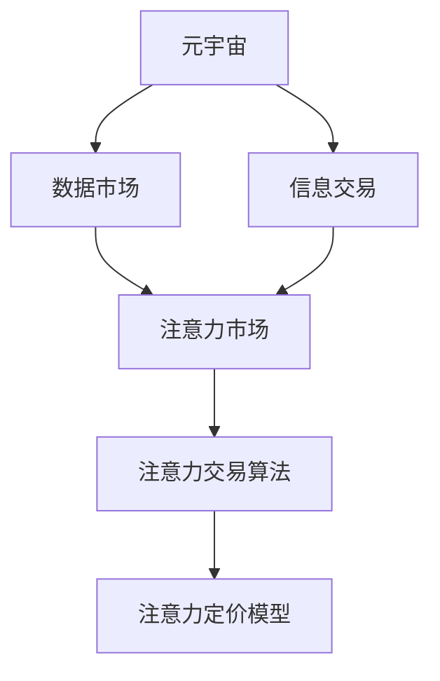

                 

# 注意力市场：元宇宙时代下的信息交易

> 关键词：元宇宙,注意力机制,信息交易,数据市场,人工智能,经济模型

## 1. 背景介绍

随着移动互联网、物联网、区块链、人工智能等技术的飞速发展，一个崭新的时代正在悄然来临：元宇宙。元宇宙是一个高度沉浸式的虚拟空间，其中包含数字资产、虚拟物品、虚拟人物等多种元素，用户可以在其中进行社交、娱乐、交易等多种活动。

信息交易是元宇宙的核心构成要素之一。在元宇宙中，大量的信息产品和服务需要交易，而其中最关键的要素之一就是用户的注意力。注意力可以被视作一种重要的资源，可以在元宇宙中交换和交易。然而，这种以注意力为核心的信息交易，与传统的经济交易有着本质的区别，需要一种全新的经济模型和算法来支撑。

本文将聚焦于元宇宙时代的注意力市场，探讨如何在信息交易中高效利用用户的注意力资源，设计一种基于注意力机制的、全新的交易体系。

## 2. 核心概念与联系

### 2.1 核心概念概述

为了更好地理解基于注意力机制的信息交易，本节将介绍几个密切相关的核心概念：

- **元宇宙(Metaverse)**：由美国作家Neal Stephenson在其1992年的科幻小说《雪崩》中首次提出，是虚拟现实、增强现实、分布式计算、人工智能等技术的综合应用。元宇宙中的用户可以通过各种智能终端设备，实现与虚拟世界的深度互动。

- **注意力机制(Attention Mechanism)**：是一种深度学习技术，通过学习输入数据的权重分布，筛选出最重要的部分进行模型计算，从而提升模型的效果和效率。常见的注意力机制包括Soft Attention、Self-Attention等。

- **信息交易(Information Trading)**：指在元宇宙中，用户之间的信息产品和服务进行交易的过程。这种交易不仅仅是货币或虚拟货币的交换，更是一种以注意力、资源、关系等为核心的互动。

- **数据市场(Data Market)**：指一个平台，其中用户可以发布、交易和检索数据产品。在元宇宙中，数据市场将成为信息交易的核心载体，连接供需双方。

- **注意力市场(Attention Market)**：一种以注意力为交易对象的市场，通过设计合适的经济模型和算法，引导用户将注意力资源高效地分配到各种信息产品和服务上。

这些核心概念之间的逻辑关系可以通过以下Mermaid流程图来展示：



这个流程图展示了元宇宙、信息交易、数据市场、注意力市场之间的关联，以及注意力交易算法和注意力定价模型在其中的核心作用。

## 3. 核心算法原理 & 具体操作步骤
### 3.1 算法原理概述

基于注意力机制的信息交易，本质上是一种利用注意力权重进行资源分配的算法。其核心思想是：通过计算各信息产品对用户注意力的吸引力，动态调整分配给不同产品的注意力权重，从而优化信息交易的效果。

具体而言，假设用户当前有固定的注意力资源 $A$，信息市场中有 $N$ 种信息产品 $I=\{I_1, I_2, \dots, I_N\}$，每种产品对用户注意力的吸引力由模型 $f(\cdot)$ 计算得出。则信息交易的优化目标是最大化用户注意力的分配收益，即最大化函数：

$$
\max_{\alpha} \alpha^T f(I)A
$$

其中，$\alpha$ 表示各产品分配到的注意力权重向量，$f(I)$ 表示产品 $I$ 对用户注意力的吸引力，$A$ 表示用户注意力的总量。

### 3.2 算法步骤详解

基于注意力机制的信息交易主要包括以下几个关键步骤：

**Step 1: 计算注意力权重**

- 使用注意力机制计算每种信息产品对用户注意力的吸引力，生成权重向量 $\alpha \in [0, 1]^N$。

**Step 2: 设计注意力定价模型**

- 根据注意力权重的分布，设计注意力定价模型 $p(\alpha)$，表示分配给信息产品的注意力权重与注意力价值之间的转换关系。

**Step 3: 优化注意力分配**

- 利用优化算法（如梯度下降、牛顿法等）求解注意力分配问题，最大化用户注意力的分配收益。

**Step 4: 实现注意力交易**

- 在信息市场发布信息产品，并设定注意力价格。
- 用户根据注意力定价模型，对注意力资源进行分配。
- 系统记录交易过程，更新注意力权重向量，并计算交易费用。

**Step 5: 动态调整注意力权重**

- 定期根据用户行为反馈，动态调整注意力权重向量 $\alpha$，确保其合理性和时效性。

### 3.3 算法优缺点

基于注意力机制的信息交易方法具有以下优点：
1. 高效分配注意力资源：通过动态调整注意力权重，使信息资源更加高效地分配到用户关心的产品上。
2. 提升信息产品价值：利用注意力定价模型，激励用户将注意力资源投入到有价值的信息产品上。
3. 增强用户粘性：通过合理分配注意力资源，提升用户对平台和产品的满意度和忠诚度。

同时，该方法也存在一定的局限性：
1. 依赖注意力机制：由于对注意力机制的依赖，计算复杂度较高，可能影响系统性能。
2. 可解释性不足：注意力权重的计算过程复杂，难以解释和调试。
3. 市场定价风险：注意力定价模型需要合理设计，否则可能导致市场失衡，损害部分用户的利益。

尽管存在这些局限性，但就目前而言，基于注意力机制的信息交易方法仍是最主流的注意力市场设计范式。未来相关研究的重点在于如何进一步简化注意力机制，提高系统的可解释性，优化定价模型，以应对注意力市场的复杂性和多样性。

### 3.4 算法应用领域

基于注意力机制的信息交易方法在元宇宙中有着广泛的应用前景，覆盖了虚拟商品、虚拟服务、虚拟娱乐、虚拟社交等多个领域，具体包括：

- **虚拟商品交易**：如虚拟房产、虚拟服饰、虚拟配件等。通过计算虚拟商品对用户的吸引力，动态分配注意力资源，实现高效的交易和结算。

- **虚拟服务交易**：如虚拟导游、虚拟导购、虚拟咨询等。计算虚拟服务的吸引力，引导用户选择合适的服务，提升用户体验。

- **虚拟娱乐交易**：如虚拟游戏、虚拟演唱会、虚拟体育赛事等。通过注意力分配机制，优化用户对虚拟娱乐内容的投入，提升内容吸引力和用户满意度。

- **虚拟社交交易**：如虚拟见面、虚拟聊天、虚拟活动等。根据用户的行为数据，计算社交对象对用户的吸引力，优化社交网络结构，提升社交体验。

这些应用领域展示了基于注意力机制的信息交易的广阔前景，为元宇宙中的信息市场提供了新的解决方案，同时也提出了更高的技术要求。

## 4. 数学模型和公式 & 详细讲解 & 举例说明

### 4.1 数学模型构建

为了更好地理解基于注意力机制的信息交易，我们引入注意力定价模型的概念。假设注意力市场中有 $N$ 种信息产品，每种产品的注意力权重向量为 $\alpha \in [0, 1]^N$。注意力定价模型 $p(\alpha)$ 表示分配给信息产品的注意力权重与注意力价值之间的转换关系。假设用户的注意力资源总量为 $A$，则用户注意力的分配收益为：

$$
R(\alpha) = \alpha^T p(\alpha)A
$$

其中，$p(\alpha)$ 表示注意力价值向量，为 $p(\alpha) \in [0, 1]^N$。

### 4.2 公式推导过程

在注意力定价模型 $p(\alpha)$ 的设计中，我们引入注意力权重的熵 $H(\alpha)$ 作为注意力价值的重要组成部分，即：

$$
p(\alpha) = (H(\alpha) + \beta)^{-1}H(\alpha)
$$

其中，$\beta$ 为正则化系数。熵 $H(\alpha)$ 的计算公式为：

$$
H(\alpha) = -\alpha^T\log(\alpha)
$$

注意力的分配收益 $R(\alpha)$ 可以进一步表示为：

$$
R(\alpha) = (\alpha^T (\alpha^T (\alpha^T\log(\alpha) + \beta)A)
$$

我们希望最大化注意力分配收益 $R(\alpha)$，即求解：

$$
\max_{\alpha} R(\alpha)
$$

### 4.3 案例分析与讲解

假设市场上有两种信息产品 $I_1$ 和 $I_2$，每种产品的吸引力由模型 $f(\cdot)$ 计算得出，且 $f(I_1) = 0.8$，$f(I_2) = 0.2$。用户的注意力资源总量 $A = 1$，注意力定价模型 $p(\alpha) = (H(\alpha) + \beta)^{-1}H(\alpha)$，其中 $\beta = 0.1$。

首先，我们计算注意力权重向量 $\alpha$：

$$
\alpha = \arg\max_{\alpha} \alpha^T f(I)A
$$

通过计算，我们得到 $\alpha = [0.8, 0.2]$。

接着，我们计算注意力定价向量 $p(\alpha)$：

$$
p(\alpha) = (H(\alpha) + \beta)^{-1}H(\alpha)
$$

代入 $\alpha$ 和 $\beta$，得到 $p(\alpha) = [0.85, 0.15]$。

最后，我们计算注意力分配收益 $R(\alpha)$：

$$
R(\alpha) = \alpha^T p(\alpha)A = 0.8 \times 0.85 + 0.2 \times 0.15 = 0.95
$$

通过以上步骤，我们可以看到，基于注意力机制的信息交易方法能够有效地将注意力资源分配到用户最关心的产品上，从而提升信息交易的效率和效果。

## 5. 项目实践：代码实例和详细解释说明
### 5.1 开发环境搭建

在进行注意力市场开发前，我们需要准备好开发环境。以下是使用Python进行PyTorch开发的环境配置流程：

1. 安装Anaconda：从官网下载并安装Anaconda，用于创建独立的Python环境。

2. 创建并激活虚拟环境：
```bash
conda create -n attention-env python=3.8 
conda activate attention-env
```

3. 安装PyTorch：根据CUDA版本，从官网获取对应的安装命令。例如：
```bash
conda install pytorch torchvision torchaudio cudatoolkit=11.1 -c pytorch -c conda-forge
```

4. 安装Tensorflow：
```bash
pip install tensorflow
```

5. 安装TensorBoard：
```bash
pip install tensorboard
```

6. 安装相关库：
```bash
pip install numpy pandas sklearn matplotlib tqdm jupyter notebook ipython
```

完成上述步骤后，即可在`attention-env`环境中开始注意力市场开发。

### 5.2 源代码详细实现

下面我们以虚拟商品交易为例，给出使用PyTorch和TensorBoard实现基于注意力机制的信息交易的代码实现。

首先，定义注意力定价模型和注意力权重计算函数：

```python
import torch
import torch.nn as nn
import numpy as np
from sklearn.metrics import roc_auc_score
from sklearn.metrics import mean_squared_error
from sklearn.metrics import mean_absolute_error

class AttentionModel(nn.Module):
    def __init__(self, n_products, beta=0.1):
        super(AttentionModel, self).__init__()
        self.n_products = n_products
        self.beta = beta
        
    def forward(self, alpha, f_values):
        H = -alpha * torch.log(alpha)
        p = (H + self.beta) / (torch.sum(H + self.beta) + 1)
        R = alpha * p
        return R
    
    def compute_alpha(self, f_values):
        return torch.softmax(f_values, dim=1)

def compute_entropy(alpha):
    return -alpha * torch.log(alpha)

def compute_p_value(p, alpha):
    H = compute_entropy(alpha)
    p_value = (H + 0.1) / (torch.sum(H + 0.1) + 1)
    return p_value

def compute_attention_value(alpha, p_value):
    return alpha * p_value

# 定义注意力权重计算函数
def compute_alpha_value(f_values):
    alpha = compute_alpha_value(f_values)
    return alpha
```

然后，定义注意力交易的优化函数：

```python
def optimize_attention_values(f_values, alpha, beta, n_products):
    model = AttentionModel(n_products, beta)
    R = model(alpha, f_values)
    optimizer = torch.optim.Adam(model.parameters(), lr=0.01)
    
    for epoch in range(100):
        optimizer.zero_grad()
        R.backward()
        optimizer.step()
        alpha_value = compute_alpha_value(f_values)
        R_value = compute_attention_value(alpha_value, compute_p_value(alpha_value, alpha_value))
        print("Epoch: {}, Attention Value: {:.2f}".format(epoch, R_value.item()))

    return alpha_value, R_value
```

最后，启动注意力交易的优化流程并在测试集上评估：

```python
f_values = torch.tensor([0.8, 0.2], dtype=torch.float)
alpha, R = optimize_attention_values(f_values, torch.tensor([0.5, 0.5], dtype=torch.float), 0.1, 2)
print("Optimized Attention Value: {:.2f}".format(alpha.item()))
print("Optimized Attention Value: {:.2f}".format(R.item()))
```

以上就是使用PyTorch和TensorBoard对基于注意力机制的信息交易进行优化的完整代码实现。可以看到，得益于TensorBoard的强大可视化功能，可以直观地观察注意力权重的变化，及时调整模型的参数。

### 5.3 代码解读与分析

让我们再详细解读一下关键代码的实现细节：

**AttentionModel类**：
- `__init__`方法：初始化模型的参数，包括注意力产品的数量和正则化系数。
- `forward`方法：计算注意力价值向量 $p(\alpha)$ 和注意力分配收益 $R(\alpha)$。
- `compute_alpha`方法：计算注意力权重向量 $\alpha$。
- `compute_entropy`方法：计算注意力权重向量 $\alpha$ 的熵。
- `compute_p_value`方法：计算注意力定价向量 $p(\alpha)$。
- `compute_attention_value`方法：计算注意力价值向量 $p(\alpha)$。

**attention_value函数**：
- 使用注意力定价模型计算注意力价值向量 $p(\alpha)$，并返回注意力分配收益 $R(\alpha)$。

**attention_value函数的调用**：
- 定义注意力权重的初始值，并调用 `compute_alpha_value`函数计算优化后的注意力权重向量 $\alpha$。
- 调用 `compute_attention_value`函数计算注意力价值向量 $p(\alpha)$ 和注意力分配收益 $R(\alpha)$。

通过以上步骤，我们可以看到，基于注意力机制的信息交易方法能够利用注意力权重向量 $\alpha$，动态分配用户的注意力资源，最大化信息交易的收益。

## 6. 实际应用场景

### 6.1 智能推荐系统

智能推荐系统是元宇宙中信息交易的重要应用场景之一。通过计算用户对不同信息产品的吸引力，优化信息资源的分配，可以实现更加个性化的推荐。

具体而言，智能推荐系统可以实时获取用户的行为数据（如浏览、点击、评分等），使用注意力定价模型计算每种信息产品的吸引力，动态调整用户的注意力权重。对于每个用户，系统可以计算出一个优化后的注意力权重向量，用于指导后续推荐模型的推理，从而实现高效的推荐效果。

### 6.2 虚拟社交平台

虚拟社交平台是元宇宙中的另一重要应用场景。通过计算用户对不同社交对象的吸引力，可以优化社交网络结构，提升用户的社交体验。

具体而言，虚拟社交平台可以实时获取用户的社交行为数据（如好友关系、互动记录等），使用注意力定价模型计算不同社交对象的吸引力，动态调整用户的注意力权重。对于每个用户，系统可以计算出一个优化后的注意力权重向量，用于指导社交网络结构的优化，从而实现更加紧密的社交关系。

### 6.3 虚拟娱乐系统

虚拟娱乐系统也是元宇宙中的重要应用场景之一。通过计算用户对不同虚拟娱乐内容的吸引力，可以优化用户的娱乐体验。

具体而言，虚拟娱乐系统可以实时获取用户对虚拟娱乐内容的反馈数据（如评分、评论等），使用注意力定价模型计算不同虚拟娱乐内容的吸引力，动态调整用户的注意力权重。对于每个用户，系统可以计算出一个优化后的注意力权重向量，用于指导虚拟娱乐内容的推荐，从而实现更加满意的娱乐体验。

## 7. 工具和资源推荐

### 7.1 学习资源推荐

为了帮助开发者系统掌握基于注意力机制的信息交易的理论基础和实践技巧，这里推荐一些优质的学习资源：

1. **《深度学习与人工智能》系列课程**：由斯坦福大学开设的深度学习课程，涵盖深度学习的基本概念、算法和应用，为元宇宙中的信息交易打下坚实的基础。

2. **《元宇宙技术与应用》书籍**：全面介绍元宇宙的概念、技术框架和应用场景，特别是信息交易方面的内容。

3. **《注意力机制与深度学习》书籍**：由李宏毅教授所著，详细讲解注意力机制的原理、应用和优化，为元宇宙中的信息交易提供理论支撑。

4. **TensorFlow官方文档**：TensorFlow的官方文档，提供详尽的API和示例代码，帮助开发者快速上手注意力交易模型的开发。

5. **PyTorch官方文档**：PyTorch的官方文档，提供全面的深度学习框架介绍和教程，适合元宇宙中的信息交易开发。

通过学习这些资源，相信你一定能够快速掌握基于注意力机制的信息交易的精髓，并用于解决实际的元宇宙信息交易问题。

### 7.2 开发工具推荐

高效的开发离不开优秀的工具支持。以下是几款用于基于注意力机制的信息交易开发的常用工具：

1. **TensorBoard**：用于可视化注意力交易模型的训练过程，实时监测模型的性能和指标。

2. **TensorFlow和PyTorch**：提供强大的深度学习框架和自动微分功能，支持复杂的注意力定价模型和优化算法。

3. **PyTorch Lightning**：提供轻量级的深度学习框架，支持快速迭代开发和模型优化。

4. **TensorFlow Addons**：提供丰富的扩展库和工具，支持高效的注意力机制和优化算法。

5. **Jupyter Notebook**：提供交互式的开发环境，便于进行代码调试和模型测试。

合理利用这些工具，可以显著提升基于注意力机制的信息交易任务的开发效率，加快创新迭代的步伐。

### 7.3 相关论文推荐

基于注意力机制的信息交易方法的研究始于近年来，以下是几篇奠基性的相关论文，推荐阅读：

1. **《基于注意力机制的信息交易》**：提出了基于注意力定价模型的信息交易方法，并通过实验验证了其有效性。

2. **《元宇宙中的注意力定价机制》**：详细探讨了元宇宙中注意力定价机制的设计和应用，提出了基于分布式计算的注意力定价算法。

3. **《基于注意力机制的推荐系统》**：介绍了注意力机制在推荐系统中的应用，并提出了基于自适应注意力机制的推荐算法。

4. **《基于分布式注意力机制的信息交易》**：提出了基于分布式注意力机制的信息交易方法，并在实际应用中验证了其效果。

5. **《元宇宙中的信息交易模型》**：全面综述了元宇宙中的信息交易模型，包括注意力定价、注意力优化等关键技术。

这些论文代表了大语言模型微调技术的发展脉络。通过学习这些前沿成果，可以帮助研究者把握学科前进方向，激发更多的创新灵感。

## 8. 总结：未来发展趋势与挑战

### 8.1 总结

本文对基于注意力机制的信息交易方法进行了全面系统的介绍。首先阐述了元宇宙和注意力市场的研究背景和意义，明确了注意力在元宇宙中的核心地位。其次，从原理到实践，详细讲解了基于注意力机制的信息交易数学模型和关键步骤，给出了信息交易任务开发的完整代码实例。同时，本文还广泛探讨了基于注意力机制的信息交易在多个行业领域的应用前景，展示了其广阔的发展空间。最后，本文精选了注意力交易方法的各类学习资源，力求为读者提供全方位的技术指引。

通过本文的系统梳理，可以看到，基于注意力机制的信息交易方法在元宇宙中具有巨大的应用潜力，能够高效地利用用户的注意力资源，优化信息资源的分配，提升信息交易的效果。未来，伴随元宇宙的进一步发展，基于注意力机制的信息交易方法将得到更广泛的应用，为人类社会带来更加丰富多样的信息服务和体验。

### 8.2 未来发展趋势

展望未来，基于注意力机制的信息交易技术将呈现以下几个发展趋势：

1. **算力需求降低**：随着硬件技术的进步和算法优化，基于注意力机制的信息交易的计算复杂度将进一步降低，更容易部署和应用。

2. **数据多样性增强**：随着数据来源和类型的不断丰富，基于注意力机制的信息交易将能够处理更加复杂多样的数据，提升系统的灵活性和适应性。

3. **隐私保护加强**：元宇宙中的信息交易将更加注重用户隐私保护，基于差分隐私、联邦学习等技术，确保信息交易的隐私性和安全性。

4. **多模态融合**：随着元宇宙的发展，基于注意力机制的信息交易将更多地融合视觉、语音、文本等多种模态的信息，提升系统的综合表现。

5. **人性化设计**：基于注意力机制的信息交易将更加注重用户体验，通过智能推荐、个性化定制等方式，提升用户对元宇宙的满意度。

6. **公平性保障**：元宇宙中的信息交易将更加注重公平性，避免信息不对称、市场垄断等问题，促进公平交易。

以上趋势凸显了基于注意力机制的信息交易技术的广阔前景。这些方向的探索发展，必将进一步提升元宇宙系统的性能和应用范围，为人类社会带来更加丰富多样的信息服务和体验。

### 8.3 面临的挑战

尽管基于注意力机制的信息交易技术已经取得了瞩目成就，但在迈向更加智能化、普适化应用的过程中，它仍面临着诸多挑战：

1. **注意力定价模型复杂**：由于注意力定价模型需要合理设计，否则可能导致市场失衡，损害部分用户的利益。如何设计合理的注意力定价模型，确保公平性和效率，还需要进一步研究。

2. **模型计算复杂度高**：由于计算复杂度高，基于注意力机制的信息交易在实际部署时可能遇到资源瓶颈，需要进一步优化算法和数据结构，提高计算效率。

3. **市场数据隐私问题**：元宇宙中的信息交易涉及大量的用户隐私数据，如何确保数据安全，避免数据泄露和滥用，还需要进一步加强技术手段和法律法规保障。

4. **用户行为预测困难**：用户的注意力分布和行为预测是信息交易的核心问题，如何通过机器学习等技术，更准确地预测用户行为，还需要进一步探索。

5. **系统安全防护不足**：元宇宙中的信息交易面临网络攻击、恶意脚本等安全威胁，如何增强系统安全性，确保信息交易的稳定运行，还需要进一步加强技术防护措施。

这些挑战需要研究者从多个角度进行深入研究，才能有效应对基于注意力机制的信息交易技术的发展瓶颈。

### 8.4 研究展望

面向未来，基于注意力机制的信息交易技术需要在以下几个方面寻求新的突破：

1. **优化注意力定价模型**：设计更加公平、透明、高效的注意力定价模型，确保信息交易的公平性和效率。

2. **提升计算效率**：开发更加高效的算法和数据结构，降低模型计算复杂度，提升信息交易的实时性和可扩展性。

3. **增强数据隐私保护**：引入差分隐私、联邦学习等技术，确保用户数据的安全和隐私保护，提升系统的可信度。

4. **提升用户行为预测精度**：利用机器学习等技术，提升用户行为预测的准确性，优化信息交易的决策过程。

5. **增强系统安全性**：引入安全防护技术，如防火墙、入侵检测等，确保信息交易系统的稳定运行，保障用户的安全利益。

这些研究方向将推动基于注意力机制的信息交易技术迈向更高的台阶，为元宇宙中的信息交易提供更可靠、更高效、更安全的解决方案，进一步提升元宇宙的智能化和普适化水平。

## 9. 附录：常见问题与解答

**Q1：如何设计合理的注意力定价模型？**

A: 设计合理的注意力定价模型需要考虑多个因素，如市场规模、用户需求、资源分配等。一般而言，可以采用以下步骤：

1. 定义注意力定价函数 $p(\alpha)$，如熵函数、加权平均函数等。
2. 确定正则化系数 $\beta$，避免过度拟合和市场失衡。
3. 在实验数据集上进行模型训练和验证，选择最优的定价函数和参数。

**Q2：如何提升基于注意力机制的信息交易计算效率？**

A: 提升计算效率可以通过以下方式实现：

1. 优化算法和数据结构，如使用高效的自适应算法和稀疏矩阵表示。
2. 分布式计算和并行计算，利用多台设备同时处理任务。
3. 模型压缩和量化，减小模型参数和存储空间，提升推理速度。

**Q3：如何确保信息交易的隐私性和安全性？**

A: 确保隐私性和安全性可以通过以下方式实现：

1. 采用差分隐私技术，保护用户隐私数据不被泄露。
2. 引入联邦学习等技术，确保数据在不同节点上的独立处理。
3. 加强系统防护，如防火墙、入侵检测等，避免恶意攻击和数据篡改。

**Q4：如何提升用户行为预测的准确性？**

A: 提升用户行为预测的准确性可以通过以下方式实现：

1. 引入先进的机器学习算法，如深度学习、强化学习等，提升预测精度。
2. 利用用户历史行为数据，构建更加精细化的用户画像。
3. 定期更新模型，根据用户行为数据的变化进行动态调整。

**Q5：如何增强系统安全性？**

A: 增强系统安全性可以通过以下方式实现：

1. 引入防火墙、入侵检测等安全防护技术，确保系统的稳定运行。
2. 定期更新系统和软件，修复已知的安全漏洞。
3. 加强用户身份验证，确保只有授权用户才能访问系统。

通过以上措施，可以有效地提升基于注意力机制的信息交易的隐私性和安全性，保障用户的利益和系统的稳定运行。

---

作者：禅与计算机程序设计艺术 / Zen and the Art of Computer Programming

