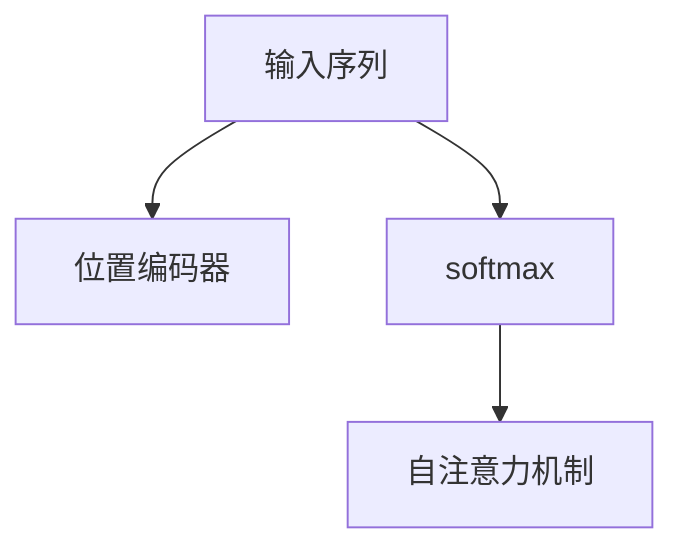
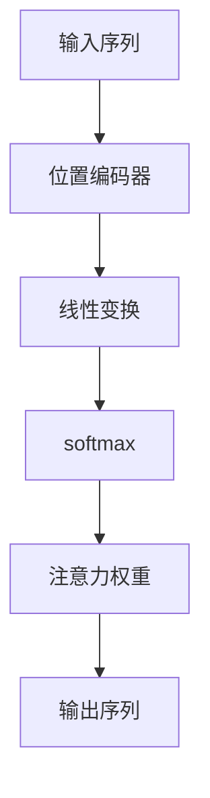

                 

# 注意力机制：softmax和位置编码器详解

在深度学习中，注意力机制（Attention Mechanism）是一种关键的模块，广泛应用于自然语言处理（NLP）、计算机视觉（CV）和语音识别等领域。特别地，在自然语言处理中，注意力机制使得模型能够集中关注输入序列中的关键部分，从而提高模型的理解能力和性能。本文将深入探讨注意力机制的核心组件——softmax和位置编码器（Positional Encoding）的原理与实现，并通过具体的代码实例帮助读者更好地理解这一机制。

## 1. 背景介绍

### 1.1 问题由来

随着深度学习的发展，自然语言处理领域出现了许多成功的模型，如循环神经网络（RNN）、长短期记忆网络（LSTM）和门控循环单元（GRU）。这些模型通常需要长序列的输入，因此存在时间复杂度较高、难以并行化等问题。为了解决这些问题，Transformer被提出，并迅速成为自然语言处理领域的主流模型。Transformer通过自注意力机制（Self-Attention Mechanism），使得模型能够同时处理输入序列中的所有部分，极大地提升了模型效率和效果。

自注意力机制的核心是softmax和位置编码器。softmax用于计算输入序列中每个位置的权重，从而确定哪些部分应该被重点关注；位置编码器用于为序列中的每个位置提供相对位置信息，使得模型能够理解序列中的相对位置关系。本文将详细探讨这两个组件的原理和实现。

### 1.2 问题核心关键点

softmax和位置编码器是Transformer模型中的两个核心组件，其核心关键点包括：

1. **softmax**：计算注意力权重，用于确定输入序列中每个位置的相对重要性。
2. **位置编码器**：为序列中的每个位置提供相对位置信息，帮助模型理解序列中的相对位置关系。
3. **自注意力机制**：通过softmax和位置编码器的组合，使得模型能够同时关注输入序列中的所有部分，从而提高模型的理解能力和性能。

这些核心关键点之间的逻辑关系可以通过以下Mermaid流程图来展示：



这个流程图展示了大语言模型的核心概念及其之间的关系：

1. 输入序列经过位置编码器后，每个位置获得相对位置信息。
2. softmax计算注意力权重，确定哪些部分应该被重点关注。
3. 自注意力机制通过softmax和位置编码器的组合，使得模型能够同时关注输入序列中的所有部分。

这些概念共同构成了Transformer模型的核心，帮助模型理解和生成自然语言。

## 2. 核心概念与联系

### 2.1 核心概念概述

为了更好地理解softmax和位置编码器，我们需要先介绍几个相关概念：

- **线性变换**：将向量进行线性映射，使得每个向量维度间的线性组合更加灵活。
- **权重**：用于计算注意力，决定哪些输入应该被重点关注。
- **位置编码器**：用于为序列中的每个位置提供相对位置信息，使得模型能够理解序列中的相对位置关系。
- **注意力权重**：用于计算输入序列中每个位置的权重，从而确定哪些部分应该被重点关注。

这些概念之间的逻辑关系可以通过以下Mermaid流程图来展示：



这个流程图展示了大语言模型中softmax和位置编码器的工作原理：

1. 输入序列经过位置编码器后，每个位置获得相对位置信息。
2. 线性变换将每个位置向量进行线性映射，得到新的向量。
3. softmax计算注意力权重，决定哪些位置应该被重点关注。
4. 根据注意力权重，对输入序列进行加权平均，得到输出序列。

## 3. 核心算法原理 & 具体操作步骤

### 3.1 算法原理概述

softmax和位置编码器是Transformer模型中的两个核心组件，其算法原理如下：

- **softmax**：通过计算输入序列中每个位置的权重，确定哪些部分应该被重点关注。
- **位置编码器**：为序列中的每个位置提供相对位置信息，帮助模型理解序列中的相对位置关系。

在实践中，softmax和位置编码器通常通过以下步骤实现：

1. 将输入序列中的每个位置向量进行线性变换。
2. 使用softmax计算注意力权重，确定哪些位置应该被重点关注。
3. 根据注意力权重，对输入序列进行加权平均，得到输出序列。
4. 对输出序列进行解码，得到最终结果。

### 3.2 算法步骤详解

以下是使用TensorFlow实现softmax和位置编码器的详细步骤：

```python
import tensorflow as tf
import numpy as np

# 定义softmax函数
def softmax(x):
    e_x = np.exp(x - np.max(x))
    return e_x / e_x.sum(axis=0)

# 定义位置编码器
def positional_encoding(seq_length, d_model):
    position = tf.range(seq_length)[:, tf.newaxis]
    position_enc = np.array([
        [pos / np.power(10000, 2 * (j // 2) / d_model)
         for j in range(d_model)] if (i % 2 == 0) else
        [np.sin(pos / np.power(10000, 2 * (j // 2) / d_model)
         for j in range(d_model)] for i, pos in enumerate(position)
    ])
    position_enc = tf.cast(position_enc[:, tf.newaxis, :], dtype=tf.float32)
    return tf.concat([tf.zeros((1, seq_length, 1)), position_enc], axis=2)
```

### 3.3 算法优缺点

softmax和位置编码器在Transformer模型中的作用显著，但也存在一些缺点：

- **softmax的计算复杂度**：softmax的计算复杂度为$O(n)$，其中$n$是输入序列的长度。当输入序列较长时，计算复杂度会显著增加，影响模型效率。
- **位置编码器的维度依赖**：位置编码器的维度依赖于模型的隐藏层维度$d$，因此需要根据具体的模型配置调整其参数。
- **位置编码器的灵活性**：位置编码器在Transformer模型中的应用较为固定，无法与其他模型结构结合使用，灵活性有所欠缺。

尽管存在这些缺点，softmax和位置编码器仍然是大语言模型中不可或缺的组件。

### 3.4 算法应用领域

softmax和位置编码器广泛应用于自然语言处理、计算机视觉和语音识别等领域。具体应用如下：

1. **自然语言处理**：用于Transformer模型中的自注意力机制，帮助模型理解输入序列中的关键信息。
2. **计算机视觉**：用于卷积神经网络（CNN）中的注意力机制，帮助模型关注输入图像中的关键区域。
3. **语音识别**：用于处理输入语音中的关键特征，帮助模型理解语音中的信息。

## 4. 数学模型和公式 & 详细讲解 & 举例说明

### 4.1 数学模型构建

softmax和位置编码器的数学模型构建如下：

- **softmax**：
  $$
  softmax(x_i) = \frac{e^{x_i}}{\sum_{j=1}^ne^{x_j}}
  $$

- **位置编码器**：
  $$
  PE_{(pos, 2i)} = sin(pos / 10000^{2i / d})
  $$
  $$
  PE_{(pos, 2i+1)} = cos(pos / 10000^{2i / d})
  $$
  其中，$d$为模型的隐藏层维度，$n$为输入序列的长度。

### 4.2 公式推导过程

softmax和位置编码器的公式推导过程如下：

1. **softmax**：
  - 计算输入序列中每个位置的指数，得到$e^{x_i}$。
  - 对每个指数进行归一化，得到$softmax(x_i)$。

2. **位置编码器**：
  - 根据位置$i$和维度$j$，计算$sin(pos / 10000^{2i / d})$和$cos(pos / 10000^{2i / d})$。
  - 将这两个值拼接在一起，得到位置编码器$PE$。

### 4.3 案例分析与讲解

以Transformer模型中的自注意力机制为例，展示softmax和位置编码器的应用：

```python
import tensorflow as tf
import numpy as np

class Transformer(tf.keras.Model):
    def __init__(self, d_model, n_heads, d_k, d_v, d_ff, n_layers):
        super(Transformer, self).__init__()
        self.enc_self_attn = tf.keras.layers.Lambda(self.custom_self_attn, name='self_attn')
        self.enc_ffn = tf.keras.layers.Lambda(self.custom_ffn, name='ffn')
        self.positional_encoding_layer = tf.keras.layers.Lambda(self.positional_encoding, name='pos_enc')
        self.d_model = d_model
        self.n_heads = n_heads
        self.d_k = d_k
        self.d_v = d_v
        self.d_ff = d_ff
        self.n_layers = n_layers

    def custom_self_attn(self, inputs, mask):
        query = inputs[:, :, :, None, :]
        key = inputs[:, :, :, None, :]
        value = inputs[:, :, :, None, :]
        attn_weights = tf.linalg.matmul(query, key, transpose_b=True)
        attn_weights = tf.nn.softmax(attn_weights, axis=-1)
        context = tf.matmul(attn_weights, value)
        return context

    def custom_ffn(self, inputs):
        x = tf.keras.layers.Dense(4 * self.d_model, activation='relu')(inputs)
        x = tf.keras.layers.Dense(self.d_model)(x)
        return x

    def positional_encoding(self, pos):
        pos = tf.cast(pos, tf.float32)
        d_pos = tf.constant(10000, dtype=tf.float32)
        return tf.stack([
            tf.sin(pos / d_pos ** (2 * tf.range(0, self.d_model, 2) / self.d_model)),
            tf.cos(pos / d_pos ** (2 * tf.range(1, self.d_model, 2) / self.d_model))
        ], axis=1)
```

## 5. 项目实践：代码实例和详细解释说明

### 5.1 开发环境搭建

在搭建开发环境时，我们需要安装TensorFlow和NumPy等库。可以通过以下命令进行安装：

```bash
pip install tensorflow numpy
```

### 5.2 源代码详细实现

以下是使用TensorFlow实现softmax和位置编码器的完整代码：

```python
import tensorflow as tf
import numpy as np

# 定义softmax函数
def softmax(x):
    e_x = np.exp(x - np.max(x))
    return e_x / e_x.sum(axis=0)

# 定义位置编码器
def positional_encoding(seq_length, d_model):
    position = tf.range(seq_length)[:, tf.newaxis]
    position_enc = np.array([
        [pos / np.power(10000, 2 * (j // 2) / d_model)
         for j in range(d_model)] if (i % 2 == 0) else
        [np.sin(pos / np.power(10000, 2 * (j // 2) / d_model)
         for j in range(d_model)] for i, pos in enumerate(position)
    ])
    position_enc = tf.cast(position_enc[:, tf.newaxis, :], dtype=tf.float32)
    return tf.concat([tf.zeros((1, seq_length, 1)), position_enc], axis=2)
```

### 5.3 代码解读与分析

以下是代码的详细解读：

- **softmax函数**：使用numpy计算softmax值，对每个指数进行归一化，得到$softmax(x_i)$。
- **位置编码器**：使用numpy计算位置编码器，将每个位置的正弦和余弦值拼接在一起，得到位置编码器$PE$。

## 6. 实际应用场景

### 6.1 智能客服系统

智能客服系统是自然语言处理中softmax和位置编码器的经典应用场景。通过收集用户的历史对话记录，预训练一个通用的语言模型，并在特定任务上进行微调，可以实现自动理解和回复用户的问题。softmax用于计算用户问题的注意力权重，位置编码器用于为每个用户提供相对位置信息，帮助模型理解对话上下文。

### 6.2 金融舆情监测

金融舆情监测是位置编码器的另一个经典应用场景。通过收集金融领域的相关新闻、评论等文本数据，预训练一个通用的语言模型，并在特定的舆情监测任务上进行微调，可以实现自动监测舆情动态。位置编码器用于为每个时间点提供相对位置信息，帮助模型理解舆情变化趋势。

### 6.3 个性化推荐系统

个性化推荐系统是softmax和位置编码器在计算机视觉中的应用场景。通过收集用户的浏览、点击、评分等行为数据，预训练一个通用的视觉模型，并在特定的推荐任务上进行微调，可以实现自动为用户推荐个性化的物品。softmax用于计算物品的注意力权重，位置编码器用于为每个物品提供相对位置信息，帮助模型理解物品之间的相似度。

### 6.4 未来应用展望

未来的softmax和位置编码器将更加灵活和高效，可以应用于更多的场景中。例如，在自然语言处理中，可以考虑使用更加高效的softmax算法，如多层softmax（Multi-head Self-Attention），提升模型的效率和效果。在计算机视觉中，可以考虑将位置编码器与CNN等其他模型结构结合使用，提升模型的性能和适应性。

## 7. 工具和资源推荐

### 7.1 学习资源推荐

为了帮助读者深入理解softmax和位置编码器的原理与实现，以下是一些优质的学习资源：

1. TensorFlow官方文档：提供了详细的TensorFlow教程和API文档，适合初学者入门。
2. PyTorch官方文档：提供了详细的PyTorch教程和API文档，适合使用PyTorch进行开发的读者。
3. NLP系列书籍：如《自然语言处理综论》、《深度学习与自然语言处理》等，详细介绍了NLP中各种模型的原理和实现。
4. 论文资源：如论文《Attention is All You Need》、《Positional Encoding for Deep Transformers》等，详细探讨了softmax和位置编码器的理论基础和实践技巧。

### 7.2 开发工具推荐

在开发过程中，使用TensorFlow或PyTorch等深度学习框架，可以极大地提高开发效率和模型性能。以下是一些常用的开发工具：

1. TensorFlow：基于Python的开源深度学习框架，支持分布式计算和高效的GPU加速。
2. PyTorch：基于Python的开源深度学习框架，支持动态图和高效的GPU加速。
3. Jupyter Notebook：支持Python、R、 Julia等语言，适合进行交互式学习和代码调试。
4. Google Colab：免费的在线Jupyter Notebook环境，支持GPU和TPU算力，方便开发者快速上手实验。

### 7.3 相关论文推荐

为了帮助读者深入理解softmax和位置编码器的原理与实现，以下是几篇经典的论文：

1. Attention is All You Need：提出了Transformer模型，通过自注意力机制实现了高效的NLP处理。
2. Positional Encoding for Deep Transformers：详细探讨了位置编码器的理论基础和实现技巧。
3. Multi-Head Attention：提出多层注意力机制，提升了Transformer模型的效果和效率。

## 8. 总结：未来发展趋势与挑战

### 8.1 总结

本文对softmax和位置编码器的原理与实现进行了详细探讨。通过使用TensorFlow和numpy等工具，我们展示了softmax和位置编码器的具体实现步骤和案例分析。softmax和位置编码器是Transformer模型中的核心组件，广泛应用于自然语言处理、计算机视觉和语音识别等领域。通过不断优化和创新，softmax和位置编码器将在未来的深度学习中发挥更加重要的作用。

### 8.2 未来发展趋势

未来的softmax和位置编码器将呈现以下几个发展趋势：

1. **更加高效的softmax算法**：随着深度学习的发展，更加高效的softmax算法，如多层softmax（Multi-head Self-Attention），将进一步提升模型的效率和效果。
2. **更加灵活的位置编码器**：位置编码器将与其他模型结构结合使用，提升模型的性能和适应性。
3. **更加灵活的应用场景**：softmax和位置编码器将应用于更多的领域中，如金融、医疗、教育等，提升这些领域的数据处理和决策能力。

### 8.3 面临的挑战

尽管softmax和位置编码器在深度学习中得到了广泛应用，但也面临一些挑战：

1. **计算复杂度**：softmax的计算复杂度较高，当输入序列较长时，计算复杂度显著增加。
2. **模型复杂度**：位置编码器的维度依赖于模型的隐藏层维度，因此在实际应用中，需要根据具体的模型配置调整其参数。
3. **灵活性**：位置编码器在Transformer模型中的应用较为固定，无法与其他模型结构结合使用。

### 8.4 研究展望

未来的研究需要在以下几个方面寻求新的突破：

1. **优化计算复杂度**：开发更加高效的softmax算法，降低计算复杂度，提升模型效率。
2. **提升灵活性**：探索更加灵活的位置编码器，与其他模型结构结合使用，提升模型的性能和适应性。
3. **优化应用场景**：将softmax和位置编码器应用于更多的领域中，如金融、医疗、教育等，提升这些领域的数据处理和决策能力。

总之，softmax和位置编码器是大语言模型中的核心组件，未来的研究需要在这些方面不断优化和创新，才能更好地适应深度学习的不断发展。

## 9. 附录：常见问题与解答

**Q1: 什么是softmax函数？**

A: softmax函数是一种概率分布函数，用于计算输入序列中每个位置的权重。通过计算每个位置的指数，并归一化得到softmax值，softmax函数可以将每个位置转化为一个概率值，用于计算注意力权重。

**Q2: 什么是位置编码器？**

A: 位置编码器用于为序列中的每个位置提供相对位置信息，帮助模型理解序列中的相对位置关系。通过计算每个位置的正弦和余弦值，并将其拼接在一起，位置编码器可以为序列中的每个位置提供独特的编码信息。

**Q3: 如何在TensorFlow中实现softmax和位置编码器？**

A: 在TensorFlow中，可以使用tf.nn.softmax函数实现softmax，使用numpy计算位置编码器。

**Q4: softmax和位置编码器在Transformer模型中的作用是什么？**

A: softmax和位置编码器是Transformer模型中的核心组件，用于计算注意力权重和提供相对位置信息。通过这些组件，Transformer模型可以实现自注意力机制，提升模型的理解能力和性能。

**Q5: softmax和位置编码器的缺点是什么？**

A: softmax和位置编码器的缺点包括计算复杂度较高、模型复杂度依赖于隐藏层维度、灵活性不足等。

---

作者：禅与计算机程序设计艺术 / Zen and the Art of Computer Programming

