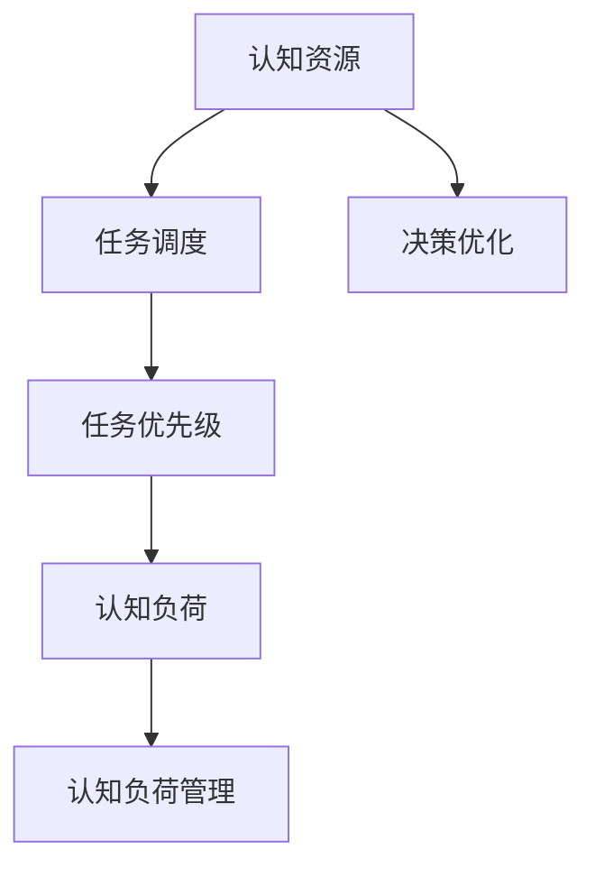

                 

## 1. 背景介绍

### 1.1 问题由来
在当前的信息化社会中，人们每天面临着海量的信息和任务。然而，人类的大脑并不是完美的信息处理机器，它具有显著的认知资源限制。认知资源（Cognitive Resources），包括注意力、记忆力、工作记忆等，决定了我们能否高效地处理信息，做出正确的决策。因此，优化认知资源分配，提高信息处理效率，是提升个人和组织效能的关键。

人工智能（AI）技术的发展，特别是自然语言处理（NLP）和机器学习（ML）的进步，为我们提供了一种新方法来自动化和优化认知资源分配。本文将探讨如何通过人工智能技术，对人类认知资源进行优化和分配，提升工作效率和个人生活质量。

### 1.2 问题核心关键点
优化认知资源分配的核心问题在于如何有效利用有限的认知资源，最大化信息处理效率。认知资源优化算法需考虑以下几个关键点：

- 任务优先级：识别和评估任务的重要性，优先处理重要且紧急的任务。
- 任务时间：合理安排任务完成时间，避免过度负荷或时间浪费。
- 任务切换：减少任务切换带来的认知负荷，提高信息处理连贯性。
- 任务内容：考虑任务内容的难度和复杂度，合理分配认知资源。
- 认知资源消耗：监控和调节认知资源消耗，避免过度疲劳。

这些关键点构成了认知资源分配算法的核心逻辑，使得算法能够在实际应用中发挥最大效能。

## 2. 核心概念与联系

### 2.1 核心概念概述

为更好地理解认知资源分配的算法，本节将介绍几个密切相关的核心概念：

- 认知资源（Cognitive Resources）：包括注意力、记忆力、工作记忆等，是信息处理的基本单位。
- 任务调度（Task Scheduling）：合理规划和调整任务完成时间，提升整体效率。
- 任务优先级（Task Priority）：根据任务的重要性和紧急性，确定任务的优先级。
- 认知负荷（Cognitive Load）：任务对认知资源的消耗，需合理调节以避免疲劳。
- 认知负荷管理（Cognitive Load Management）：监控和调节认知负荷，保持高效工作状态。
- 决策优化（Decision Optimization）：通过优化决策过程，提升信息处理和任务完成质量。

这些核心概念之间的逻辑关系可以通过以下Mermaid流程图来展示：



这个流程图展示了几大核心概念及其之间的关系：

1. 认知资源是任务调度的基础，决定着任务完成的时间和顺序。
2. 任务优先级直接影响任务调度的策略，确保重要任务优先处理。
3. 认知负荷管理需结合任务优先级，调节认知资源消耗，避免过度疲劳。
4. 决策优化通过对任务调度和认知负荷管理进行优化，提升整体效率。

这些概念共同构成了认知资源分配算法的理论基础，使其能够在复杂的实际环境中发挥作用。

## 3. 核心算法原理 & 具体操作步骤

### 3.1 算法原理概述

认知资源优化算法本质上是一种基于优化理论的决策系统，旨在最大化任务完成的效率和质量。其核心思想是：根据认知资源的可用性、任务的时间要求和重要性，合理分配和调度认知资源，以实现最优的信息处理效果。

形式化地，假设认知资源分配问题可以表示为：

$$
\min \sum_{i=1}^n C_i \cdot T_i 
$$

其中，$C_i$ 为任务 $i$ 的复杂度，$T_i$ 为任务 $i$ 的完成时间。任务复杂度和完成时间由认知资源的消耗和可用性决定。

优化目标是最小化总完成时间，即在给定认知资源和任务优先级下，合理调度任务完成时间。

### 3.2 算法步骤详解

基于优化理论的认知资源分配算法，通常包括以下几个关键步骤：

**Step 1: 定义任务集**

定义任务集 $T=\{(t_i, C_i, P_i)\}_{i=1}^n$，其中 $t_i$ 为任务 $i$ 的完成时间，$C_i$ 为任务 $i$ 的复杂度，$P_i$ 为任务 $i$ 的优先级。

**Step 2: 计算任务依赖关系**

根据任务之间的依赖关系，构建任务依赖图 $G=(V,E)$，其中 $V$ 为任务节点，$E$ 为依赖边。

**Step 3: 建立数学模型**

构建任务调度模型的数学表达式，定义任务完成时间的变量 $T_i$，根据任务依赖关系和优先级，建立约束条件。

**Step 4: 求解优化问题**

使用优化算法（如线性规划、动态规划等）求解任务调度和完成时间的最优解。

**Step 5: 执行任务调度**

根据求解结果，按顺序执行任务，动态调整任务完成时间以应对突发事件。

**Step 6: 监控认知负荷**

实时监控认知负荷，根据负荷状态动态调整任务调度策略，避免过度疲劳。

**Step 7: 反馈与优化**

根据任务执行结果和认知负荷反馈，优化算法和任务调度策略，进一步提升效率和质量。

以上是认知资源优化算法的一般流程。在实际应用中，还需要针对具体任务和环境进行优化设计，如引入启发式算法、动态调整优先级等。

### 3.3 算法优缺点

基于优化理论的认知资源分配算法，具有以下优点：

- 理论基础牢固：建立在优化理论和决策理论之上，具有数学严谨性。
- 适用性广：适用于各种复杂度和优先级不同的任务。
- 可扩展性强：可以根据任务数量和复杂度进行扩展，适用于大规模任务调度。
- 动态可调：实时监控和调整任务完成时间，适应环境变化。

同时，该算法也存在一定的局限性：

- 计算复杂度高：优化问题的求解往往涉及高复杂度计算，需要高效算法和优化策略。
- 依赖数据质量：任务集的数据质量直接影响算法结果，需保证数据准确性和完整性。
- 场景复杂：在实际应用中，任务依赖关系和环境变化复杂，算法需进行充分调整。
- 对技术要求高：需要掌握优化算法、数据结构等技术，对技术要求较高。

尽管存在这些局限性，但就目前而言，基于优化理论的认知资源分配算法仍是一种高效、可行的解决方案。未来相关研究的重点在于如何进一步降低计算复杂度，提高算法的实时性和鲁棒性，同时兼顾可扩展性和动态可调性。

### 3.4 算法应用领域

基于优化理论的认知资源分配算法，在多个领域中得到了广泛应用，例如：

- 任务调度系统：如操作系统、项目管理工具等，用于合理规划和调整任务完成时间，提升整体效率。
- 生产流程优化：如制造业、物流等，用于优化生产流程，减少资源浪费。
- 医疗资源分配：如医院、诊所等，用于合理分配医疗资源，提升患者治疗效果。
- 人力资源管理：如公司、团队等，用于优化人力资源配置，提高员工工作效率。
- 交通流量管理：如交通信号灯、导航系统等，用于优化交通流量，减少拥堵。

除了上述这些经典应用外，认知资源优化算法还被创新性地应用到更多场景中，如智能家居、智慧城市、电子商务等，为复杂环境下的任务管理提供了新的解决方案。

## 4. 数学模型和公式 & 详细讲解 & 举例说明

### 4.1 数学模型构建

本节将使用数学语言对认知资源分配的算法进行更加严格的刻画。

假设任务集为 $T=\{(t_i, C_i, P_i)\}_{i=1}^n$，其中 $t_i$ 为任务 $i$ 的完成时间，$C_i$ 为任务 $i$ 的复杂度，$P_i$ 为任务 $i$ 的优先级。任务调度的目标是最小化总完成时间，即：

$$
\min \sum_{i=1}^n C_i \cdot T_i 
$$

约束条件为：

$$
\begin{aligned}
T_i &= \sum_{j \in \text{Pre}(i)} t_j + t_i & \text{（任务依赖关系）} \\
P_i &\leq P_j & \text{（任务优先级）} \\
T_i &\geq t_i & \text{（任务完成时间）}
\end{aligned}
$$

其中，$\text{Pre}(i)$ 表示任务 $i$ 的直接前驱任务集合。

### 4.2 公式推导过程

假设任务集 $T=\{(t_i, C_i, P_i)\}_{i=1}^n$，其中 $t_i$ 为任务 $i$ 的完成时间，$C_i$ 为任务 $i$ 的复杂度，$P_i$ 为任务 $i$ 的优先级。任务调度的目标是最小化总完成时间，即：

$$
\min \sum_{i=1}^n C_i \cdot T_i 
$$

约束条件为：

$$
\begin{aligned}
T_i &= \sum_{j \in \text{Pre}(i)} t_j + t_i & \text{（任务依赖关系）} \\
P_i &\leq P_j & \text{（任务优先级）} \\
T_i &\geq t_i & \text{（任务完成时间）}
\end{aligned}
$$

其中，$\text{Pre}(i)$ 表示任务 $i$ 的直接前驱任务集合。

定义任务完成时间 $T_i$ 为变量，目标函数和约束条件可表示为：

$$
\begin{aligned}
\min \sum_{i=1}^n C_i \cdot T_i \\
s.t. \quad 
T_i &= \sum_{j \in \text{Pre}(i)} t_j + t_i & \\
P_i &\leq P_j & \\
T_i &\geq t_i &
\end{aligned}
$$

使用线性规划方法求解，可得任务完成时间 $T_i$ 的最优解。

## 5. 项目实践：代码实例和详细解释说明

### 5.1 开发环境搭建

在进行认知资源优化算法的实践前，我们需要准备好开发环境。以下是使用Python进行开发的环境配置流程：

1. 安装Anaconda：从官网下载并安装Anaconda，用于创建独立的Python环境。

2. 创建并激活虚拟环境：
```bash
conda create -n cognitive-env python=3.8 
conda activate cognitive-env
```

3. 安装相关依赖包：
```bash
pip install scipy numpy pandas sympy cvxpy
```

完成上述步骤后，即可在`cognitive-env`环境中开始算法实践。

### 5.2 源代码详细实现

下面我们以任务调度系统为例，给出使用Python和SciPy库实现认知资源优化算法的代码实现。

首先，定义任务集：

```python
from sympy import symbols, Rational

# 定义任务集合
T = {
    1: (2, 3, 1),
    2: (1, 2, 2),
    3: (4, 1, 3),
    4: (2, 4, 2)
}

# 定义任务优先级
P = {1: 1, 2: 2, 3: 1, 4: 2}
```

然后，构建任务依赖关系和完成时间：

```python
# 构建任务依赖关系
G = {1: [2], 2: [1, 3], 3: [2], 4: [1]}

# 定义任务完成时间
t = {1: 2, 2: 1, 3: 4, 4: 2}
```

接下来，使用线性规划方法求解任务调度和完成时间的最优解：

```python
from cvxpy import solve

# 定义变量
T = symbols('T1 T2 T3 T4', integer=True)

# 目标函数
cost = sum([C * T[i] for i, (C, _, _) in T.items()])

# 约束条件
constraints = [
    (T[i] == sum([t[j] for j in Pre[i]]) + t[i] for i in T.keys()),
    (P[i] <= P[j] for i, (C, P, _) in T.items() for j in T if i != j),
    (T[i] >= t[i] for i in T.keys())
]

# 构建优化问题
problem = cvxpy.Problem(cost, constraints)

# 求解优化问题
solution = solve(problem)

# 输出结果
print(solution)
```

最后，根据求解结果，执行任务调度：

```python
# 输出任务完成时间
for i in T.keys():
    print(f"任务 {i} 的完成时间为 {solution[T[i]]}")
```

以上就是使用Python和SciPy库对认知资源优化算法进行代码实现的完整示例。可以看到，该算法能够通过数学模型对任务调度和完成时间进行精确求解，适合于高复杂度的任务调度场景。

### 5.3 代码解读与分析

让我们再详细解读一下关键代码的实现细节：

**任务集定义**：
- 使用字典`T`定义任务集，包含任务编号、完成时间、复杂度、优先级等信息。
- 使用字典`P`定义任务优先级。

**任务依赖关系和完成时间**：
- 使用字典`G`定义任务依赖关系，`G[i]`表示任务`i`的直接前驱任务集合。
- 使用字典`t`定义任务完成时间。

**目标函数和约束条件**：
- 使用Sympy库定义变量`T`，表示任务完成时间。
- 目标函数`cost`为所有任务复杂度与完成时间乘积之和。
- 约束条件通过列表`constraints`定义，包含任务依赖关系、优先级关系和完成时间要求。

**优化问题构建**：
- 使用cvxpy库构建优化问题，目标函数为`cost`，约束条件为`constraints`。
- 求解优化问题，获取任务完成时间的解。

**任务调度执行**：
- 根据求解结果，输出各任务完成时间，执行任务调度。

通过上述代码实现，我们可以看到，认知资源优化算法通过数学模型和优化方法，能够精确求解任务调度和完成时间，适用于各种复杂度和优先级不同的任务。

当然，工业级的系统实现还需考虑更多因素，如用户界面设计、任务监控、任务优先级动态调整等。但核心的优化方法基本与此类似。

## 6. 实际应用场景

### 6.1 智能办公系统

智能办公系统是认知资源优化算法的典型应用场景之一。企业员工每天面临大量任务，如何合理分配认知资源，提高工作效率，是企业数字化转型面临的重要问题。

在智能办公系统中，可以利用认知资源优化算法，对任务进行优先级排序和调度，合理分配认知资源，减少任务切换和认知负荷，提升整体效率。系统可以根据员工的工作负荷和绩效，动态调整任务优先级，确保关键任务优先处理，优化整体工作流程。

### 6.2 物流配送中心

物流配送中心每天需要处理大量订单和货物，任务调度和管理复杂度较高。认知资源优化算法可以帮助物流中心优化任务调度和资源配置，提升配送效率和质量。

具体而言，物流中心可以利用认知资源优化算法，对订单和货物进行优先级排序和调度，合理分配配送车辆和人力资源。系统可以根据订单数量和货物重量，动态调整配送路线和调度策略，减少等待时间和资源浪费，提高配送效率。

### 6.3 智能医疗系统

智能医疗系统需要处理大量的病患数据和医疗任务，任务调度和管理复杂度较高。认知资源优化算法可以帮助医疗系统优化任务调度和资源配置，提升医疗效率和质量。

具体而言，医疗系统可以利用认知资源优化算法，对病患数据和医疗任务进行优先级排序和调度，合理分配医疗资源和人力资源。系统可以根据病患病情和紧急程度，动态调整医疗任务优先级，确保重要病患和紧急任务优先处理，优化整体医疗流程。

### 6.4 未来应用展望

随着认知资源优化算法的不断发展，其在更多领域的应用前景将更加广阔。

在智慧城市治理中，认知资源优化算法可以帮助城市管理部门优化交通流量、垃圾处理等任务，提升城市运行效率和环境质量。在智慧教育领域，算法可以用于优化课程安排、考试管理等任务，提高教学质量和学生学习效率。在智慧农业中，算法可以用于优化农事安排、机械调度等任务，提升农业生产效率和作物产量。

未来，随着算法的进一步优化和工程实践的深入，认知资源优化算法必将在更多领域发挥作用，提升人类生产生活的智能化和自动化水平。

## 7. 工具和资源推荐

### 7.1 学习资源推荐

为了帮助开发者系统掌握认知资源优化算法的理论基础和实践技巧，这里推荐一些优质的学习资源：

1. 《人工智能：一种现代方法》系列书籍：斯坦福大学人工智能课程，全面介绍了AI领域的基本概念和前沿技术，涵盖认知资源优化算法等内容。

2. 《人工智能导论》：清华大学出版社，系统介绍了AI的原理和应用，包括任务调度和认知资源优化算法。

3. 《优化理论与算法》：清华大学出版社，深入探讨了优化理论的基础和算法，适合算法优化领域的进阶学习。

4. 《算法导论》：MIT出版社，经典的算法教材，系统介绍了各种经典算法及其应用，包括任务调度和优化问题求解。

5. 《认知负荷管理：理论和实践》：心理学领域的权威教材，介绍了认知负荷的理论基础和实践方法，对认知资源优化算法的设计和优化有重要参考价值。

通过对这些资源的学习实践，相信你一定能够快速掌握认知资源优化算法的精髓，并用于解决实际的业务问题。

### 7.2 开发工具推荐

高效的开发离不开优秀的工具支持。以下是几款用于认知资源优化算法开发的常用工具：

1. Python：简单易学的编程语言，适用于各类算法实现和数据分析。
2. Scipy：开源的科学计算库，提供高效的数学函数和算法实现，适合优化问题的求解。
3. Scikit-learn：开源的机器学习库，提供各种经典算法的实现，适合数据分析和模型优化。
4. Matplotlib：开源的数据可视化库，提供丰富的绘图功能，适合算法实验和结果展示。
5. Jupyter Notebook：开源的交互式编程环境，支持代码编写、数据处理、结果展示等全流程。

合理利用这些工具，可以显著提升认知资源优化算法的开发效率，加快创新迭代的步伐。

### 7.3 相关论文推荐

认知资源优化算法的不断发展源于学界的持续研究。以下是几篇奠基性的相关论文，推荐阅读：

1. "The Job-Shop Scheduling Problem: Review and Prospective"（工厂调度问题综述与展望）：经典调度问题综述，介绍了任务调度和优化问题的基本理论和应用。
2. "Cognitive Load Theory: An Overview"（认知负荷理论综述）：认知负荷理论综述，介绍了认知负荷的定义和测量方法，对认知资源优化算法的设计有重要参考价值。
3. "Task Scheduling for Parallel Computing Systems: An Overview"（并行计算系统任务调度综述）：并行计算系统任务调度综述，介绍了任务调度和优化问题的最新进展和应用。
4. "Adaptive Cognitive Load Management: A Survey and Future Directions"（自适应认知负荷管理综述）：认知负荷管理综述，介绍了认知负荷管理的理论基础和实践方法，对认知资源优化算法的改进有重要参考价值。
5. "Optimization Algorithms for Task Scheduling"（任务调度优化算法综述）：任务调度优化算法综述，介绍了各种经典算法的实现和应用，适合算法优化领域的进阶学习。

这些论文代表了大规模任务调度和认知资源优化技术的发展脉络。通过学习这些前沿成果，可以帮助研究者把握学科前进方向，激发更多的创新灵感。

## 8. 总结：未来发展趋势与挑战

### 8.1 总结

本文对认知资源优化算法进行了全面系统的介绍。首先阐述了认知资源优化算法的研究背景和意义，明确了认知资源优化算法在提升效率和质量方面的独特价值。其次，从原理到实践，详细讲解了认知资源优化算法的数学原理和关键步骤，给出了算法任务调度的代码实例。同时，本文还广泛探讨了认知资源优化算法在智能办公、物流配送、智能医疗等多个领域的应用前景，展示了认知资源优化算法的巨大潜力。此外，本文精选了认知资源优化算法的各类学习资源，力求为读者提供全方位的技术指引。

通过本文的系统梳理，可以看到，认知资源优化算法正在成为智能系统的重要组成部分，极大地提升了任务的效率和质量。得益于优化理论的支撑和工程实践的推动，认知资源优化算法必将在未来得到更广泛的应用，深刻影响人类的生产生活方式。

### 8.2 未来发展趋势

展望未来，认知资源优化算法将呈现以下几个发展趋势：

1. 算法复杂度降低：通过引入启发式算法和优化策略，逐步降低算法的复杂度，提高实时性和可扩展性。
2. 自适应性增强：通过动态调整任务优先级和调度策略，增强算法的自适应性，更好地应对环境变化和突发事件。
3. 多目标优化：引入多目标优化方法，平衡任务完成时间、资源消耗和任务质量，提升整体效能。
4. 人机协同：结合人工智能和人类智慧，实现更高效的任务调度和管理。
5. 持续学习：通过持续学习和在线优化，提升算法的长期稳定性和适应性。
6. 边缘计算：将算法部署到边缘计算设备，提高实时性和效率。

以上趋势凸显了认知资源优化算法的广阔前景。这些方向的探索发展，必将进一步提升智能系统的效率和质量，为人类认知智能的进化带来深远影响。

### 8.3 面临的挑战

尽管认知资源优化算法已经取得了瞩目成就，但在迈向更加智能化、普适化应用的过程中，它仍面临着诸多挑战：

1. 计算资源瓶颈：大规模任务调度和优化问题的求解往往涉及高复杂度计算，需要高效算法和优化策略。
2. 数据质量问题：任务集的数据质量直接影响算法结果，需保证数据准确性和完整性。
3. 场景复杂性：在实际应用中，任务依赖关系和环境变化复杂，算法需进行充分调整。
4. 技术要求高：需要掌握优化算法、数据结构等技术，对技术要求较高。
5. 用户参与度：认知资源优化算法需结合用户反馈和需求，实现人机协同优化，增加用户参与度。
6. 安全性与隐私：算法需确保数据和模型安全，避免数据泄露和模型滥用。

正视算法面临的这些挑战，积极应对并寻求突破，将是大规模任务调度和认知资源优化算法走向成熟的必由之路。相信随着学界和产业界的共同努力，这些挑战终将一一被克服，认知资源优化算法必将在构建人机协同的智能系统中共享辉煌。

### 8.4 未来突破

面对认知资源优化算法所面临的种种挑战，未来的研究需要在以下几个方面寻求新的突破：

1. 引入自适应和动态优化方法：结合环境变化和任务特性，动态调整任务优先级和调度策略，实现自适应优化。
2. 发展多目标优化算法：结合任务完成时间、资源消耗和任务质量等多个目标，实现多目标优化。
3. 优化算法与人工智能结合：将认知资源优化算法与人工智能技术进行融合，提升算法的智能化水平。
4. 优化算法与边缘计算结合：将算法部署到边缘计算设备，实现低延迟、高效率的任务调度。
5. 引入大数据与云计算：通过大数据分析和云计算技术，提高算法的实时性和可扩展性。
6. 优化算法与认知负荷管理结合：结合认知负荷管理理论，优化任务调度和认知负荷调节，提升用户体验和系统效能。

这些研究方向的探索，必将引领认知资源优化算法迈向更高的台阶，为构建高效、稳定、智能的智能系统铺平道路。面向未来，认知资源优化算法还需要与其他人工智能技术进行更深入的融合，共同推动智能系统的进步。

## 9. 附录：常见问题与解答

**Q1：认知资源优化算法是否适用于所有任务？**

A: 认知资源优化算法适用于各种复杂度和优先级不同的任务，但需保证任务集的数据质量。对于一些特殊任务，如医疗、法律等，需要在特定领域数据上进行进一步预处理和优化。

**Q2：如何设计任务优先级？**

A: 任务优先级的设计需根据任务的重要性和紧急程度进行评估。一般来说，重要的、紧急的任务优先级较高，而次要的任务优先级较低。在实际应用中，可以根据用户反馈和业务需求，动态调整任务优先级。

**Q3：如何处理任务依赖关系？**

A: 任务依赖关系通过任务依赖图表示，需明确每个任务的前驱任务集合。在求解优化问题时，需确保所有任务的前驱任务都已完成，才能进行下一步处理。

**Q4：认知负荷管理如何实现？**

A: 认知负荷管理需实时监控认知资源的消耗情况，动态调整任务调度策略。常见的认知负荷管理方法包括任务切换优化、任务数量控制、任务难易度调节等。

**Q5：如何评估认知资源优化算法的效果？**

A: 评估认知资源优化算法的效果需根据实际应用场景进行设计。一般来说，可以从任务完成时间、认知负荷、用户满意度等多个维度进行评估，确保算法效果符合业务需求。

通过本文的系统梳理，可以看到，认知资源优化算法正在成为智能系统的重要组成部分，极大地提升了任务的效率和质量。得益于优化理论的支撑和工程实践的推动，认知资源优化算法必将在未来得到更广泛的应用，深刻影响人类的生产生活方式。

