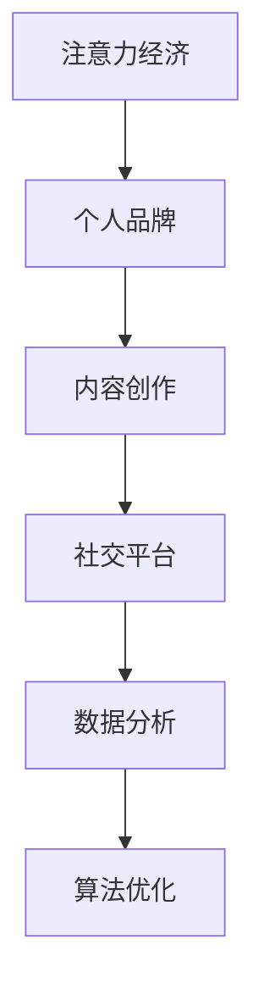

                 

## 1. 背景介绍

在数字化时代的浪潮下，个体品牌的崛起已经成为一种现象。从传统媒体到社交平台，从内容创作到技术开发，个体的影响力正在重新定义。这种变化不仅仅体现在商业领域，更贯穿于我们的日常生活。在注意力经济的环境中，如何打造个人品牌，让自身价值最大化，成为了每个从业者不可回避的课题。

### 1.1 问题由来

随着互联网和移动互联网的普及，信息的传播变得更加快捷、广泛。每个人都可以是信息的发声者，每个品牌都有机会在公众视野中曝光。然而，注意力分散、信息过载使得个体和品牌的曝光效果大打折扣。如何在海量信息中脱颖而出，吸引目标受众的注意力，是每一个品牌打造者面临的挑战。

### 1.2 问题核心关键点

在注意力经济的背景下，打造个人品牌的关键点在于：

1. **内容创作**：高质量、有价值的内容是吸引注意力的核心。
2. **平台选择**：选择合适的社交媒体平台，最大化内容的曝光范围和影响力。
3. **互动交流**：通过互动和社区建设，增强用户粘性，提升品牌认同感。
4. **技术手段**：运用数据分析和算法优化，精确投放内容，提升传播效果。
5. **品牌策略**：制定明确的个人品牌战略，保持一致的品牌形象和价值主张。

## 2. 核心概念与联系

### 2.1 核心概念概述

为了更好地理解如何在注意力经济中打造个人品牌，我们需要对以下几个关键概念有深入的理解：

1. **注意力经济**：在信息爆炸的数字化时代，注意力成为稀缺资源。掌握和引导注意力，是实现商业价值和个人影响力的基础。
2. **个人品牌**：个人通过独特的能力、形象、价值观等在公众中建立的特定的识别度和价值主张。
3. **内容创作**：通过撰写文章、制作视频、开发应用等形式，创造出具有吸引力的内容。
4. **社交平台**：如微博、微信、知乎等，为内容传播提供渠道。
5. **数据分析**：利用数据挖掘和分析技术，了解用户行为和偏好，精准投放内容。
6. **算法优化**：通过机器学习和推荐系统，提升内容推送的精准度和个性化程度。

这些核心概念之间的逻辑关系可以通过以下Mermaid流程图来展示：



这个流程图展示了个体品牌在注意力经济中的关键环节及其相互关系：

1. 首先，注意力经济是个人品牌打造的基础环境。
2. 个人品牌通过内容创作在社交平台上展现，形成初步影响。
3. 数据分析提供用户行为洞察，为内容优化提供依据。
4. 算法优化则提升内容的精准推送，增强用户粘性。

## 3. 核心算法原理 & 具体操作步骤
### 3.1 算法原理概述

在注意力经济下，个人品牌的打造可以分为几个主要步骤：

1. **内容创作**：创造具有独特性和高价值的内容，吸引受众注意力。
2. **平台选择**：选择合适的社交平台，扩大内容传播范围。
3. **数据分析**：利用数据挖掘技术，了解用户偏好，优化内容策略。
4. **算法优化**：通过推荐系统，提升内容推送的精准度和个性化程度。

### 3.2 算法步骤详解

#### 3.2.1 内容创作

内容创作是品牌打造的核心。一个优秀的内容不仅要有高质量的信息，还要具备以下几点：

1. **独特性**：内容需具有个人特色，区别于其他创作者。
2. **价值性**：内容需提供信息价值、情感共鸣或娱乐价值，满足用户需求。
3. **一致性**：内容风格、调性需保持一致，形成品牌识别度。

**操作步骤**：

1. **确定目标受众**：了解受众的基本信息、兴趣偏好和行为习惯。
2. **确定内容形式**：选择文章、视频、音频等形式，根据受众偏好调整。
3. **内容策划**：围绕目标受众需求，策划内容主题和表达方式。
4. **内容制作**：利用写作、编辑、视频制作等技能，完成内容创作。
5. **内容发布**：选择合适平台发布内容，利用平台推荐机制扩大影响。

#### 3.2.2 平台选择

选择合适的社交平台是内容传播的关键。不同的平台有各自的用户特点和传播机制：

1. **微博**：适合短文本传播，热点话题覆盖广泛。
2. **微信**：适合长文本和互动交流，内容形式丰富。
3. **知乎**：适合深度内容创作，专业讨论和知识分享。
4. **抖音**：适合短视频传播，视觉冲击力强。

**操作步骤**：

1. **平台调研**：了解各平台的用户特点、内容类型和传播机制。
2. **目标受众定位**：确定目标受众常用的平台。
3. **账号定位**：选择适合的平台账号形式，如微博账号、微信公众号、知乎专栏等。
4. **内容适配**：根据平台特点适配内容形式，如短文、长文、视频、图片等。

#### 3.2.3 数据分析

数据分析是品牌打造的重要环节，通过了解用户行为和偏好，指导内容创作和发布策略：

1. **数据收集**：利用社交平台提供的用户行为数据，如浏览记录、点赞数、评论等。
2. **数据挖掘**：分析用户行为模式，识别热点话题和用户兴趣。
3. **用户画像**：根据数据分析结果，构建用户画像，了解受众特征。
4. **内容优化**：根据用户画像，优化内容创作和发布策略，提高用户粘性。

**操作步骤**：

1. **工具选择**：选择数据分析工具，如Tableau、PowerBI、Python等。
2. **数据采集**：利用API或爬虫技术，采集所需用户行为数据。
3. **数据清洗**：处理缺失值、异常值等，保证数据质量。
4. **数据分析**：进行描述性统计、聚类分析、关联分析等，发现用户行为模式。
5. **策略制定**：根据数据分析结果，调整内容创作和发布策略。

#### 3.2.4 算法优化

算法优化通过推荐系统提升内容推送的精准度和个性化程度，增强用户粘性：

1. **推荐算法**：选择适合的推荐算法，如协同过滤、内容推荐、混合推荐等。
2. **模型训练**：根据用户历史行为数据，训练推荐模型。
3. **模型评估**：利用A/B测试、交叉验证等方法评估推荐模型效果。
4. **优化调整**：根据评估结果调整模型参数，优化推荐效果。

**操作步骤**：

1. **算法选择**：选择推荐算法，如矩阵分解、深度学习等。
2. **数据准备**：准备用户历史行为数据，如点击记录、评分记录等。
3. **模型训练**：利用训练数据训练推荐模型。
4. **模型评估**：在测试集上评估推荐模型效果，如准确率、召回率、覆盖率等。
5. **模型优化**：根据评估结果，调整模型参数，优化推荐效果。

### 3.3 算法优缺点

**算法优点**：

1. **精准度高**：通过数据分析和算法优化，实现内容精准推送。
2. **覆盖广泛**：算法可以覆盖大量用户，提升内容曝光度。
3. **自动化**：利用算法自动生成推荐结果，减少人工干预。

**算法缺点**：

1. **数据依赖**：依赖高质量的数据，数据偏差可能导致推荐效果不佳。
2. **技术复杂**：算法实现复杂，需要专业知识。
3. **用户隐私**：算法处理用户行为数据，可能涉及隐私问题。

### 3.4 算法应用领域

基于注意力经济的个人品牌打造方法在多个领域均有应用：

1. **内容创作者**：如作家、博主、视频UP主等，通过内容创作和平台推广，吸引目标受众。
2. **企业品牌**：通过内容营销和社交媒体运营，提升品牌知名度和影响力。
3. **教育机构**：利用数据和算法优化课程推荐和学生学习路径，提升教育效果。
4. **健康医疗**：通过数据分析和个性化推荐，提升患者诊疗体验和健康管理效果。
5. **旅游行业**：通过推荐系统和个性化服务，提升用户旅行体验和消费转化率。

## 4. 数学模型和公式 & 详细讲解 & 举例说明

### 4.1 数学模型构建

在个人品牌打造中，数据驱动的推荐系统是重要的一环。推荐系统通常采用协同过滤、内容推荐、混合推荐等多种方法，核心目标是通过用户行为数据，预测用户对内容的兴趣，从而推荐最相关的内容。

假设用户集合为 $U=\{u_1,u_2,...,u_n\}$，物品集合为 $I=\{i_1,i_2,...,i_m\}$，用户 $u_i$ 对物品 $i_j$ 的评分 $r_{u_i,i_j} \in [1,5]$。推荐系统的目标是通过用户-物品评分矩阵 $R \in \mathbb{R}^{n \times m}$，为用户 $u_i$ 推荐物品 $i_j$，使得推荐效果最大化。

### 4.2 公式推导过程

推荐系统通常使用以下协同过滤算法来预测用户对物品的评分：

$$
\hat{r}_{u_i,i_j} = \frac{1}{1+\exp(-\theta^T[\alpha \cdot r_{u_i,i_j} + \beta \cdot r_{i_j} + \gamma \cdot r_{u_i}]}
$$

其中 $\theta$ 是模型的参数向量，$\alpha,\beta,\gamma$ 是模型超参数，$R_u$ 和 $R_i$ 分别为用户 $u$ 和物品 $i$ 的评分均值，$R_{ui}$ 为用户 $u$ 对物品 $i$ 的评分。

模型的目标函数为：

$$
\min_{\theta} \sum_{u_i,i_j}||r_{u_i,i_j}-\hat{r}_{u_i,i_j}||^2
$$

利用梯度下降等优化算法求解，最小化目标函数，即可得到最优的模型参数 $\theta^*$。

### 4.3 案例分析与讲解

以YouTube推荐系统为例，该系统通过协同过滤算法，为用户提供个性化视频推荐。系统首先对用户观看历史和评分进行建模，然后预测用户对未观看视频的兴趣评分，从而推荐最相关的视频。

具体步骤如下：

1. **数据采集**：收集用户观看历史和评分数据，构建用户-视频评分矩阵。
2. **模型训练**：利用评分矩阵训练协同过滤模型，得到预测评分矩阵。
3. **推荐生成**：根据预测评分矩阵，生成个性化视频推荐列表。
4. **评估优化**：利用A/B测试等方法评估推荐效果，调整模型参数，优化推荐策略。

## 5. 项目实践：代码实例和详细解释说明

### 5.1 开发环境搭建

在进行推荐系统开发前，我们需要准备好开发环境。以下是使用Python进行PyTorch开发的环境配置流程：

1. 安装Anaconda：从官网下载并安装Anaconda，用于创建独立的Python环境。

2. 创建并激活虚拟环境：
```bash
conda create -n pytorch-env python=3.8 
conda activate pytorch-env
```

3. 安装PyTorch：根据CUDA版本，从官网获取对应的安装命令。例如：
```bash
conda install pytorch torchvision torchaudio cudatoolkit=11.1 -c pytorch -c conda-forge
```

4. 安装Tensorflow：
```bash
conda install tensorflow
```

5. 安装TensorBoard：
```bash
pip install tensorboard
```

6. 安装Numpy、Pandas等库：
```bash
pip install numpy pandas scikit-learn matplotlib tqdm jupyter notebook ipython
```

完成上述步骤后，即可在`pytorch-env`环境中开始推荐系统开发。

### 5.2 源代码详细实现

这里我们以协同过滤推荐系统为例，给出使用PyTorch进行推荐系统开发的代码实现。

首先，定义推荐系统的数据处理函数：

```python
import numpy as np
from scipy.sparse import csr_matrix

def build_user_item_matrix(data):
    user_ids = np.array([item['userId'] for item in data])
    item_ids = np.array([item['itemId'] for item in data])
    ratings = np.array([item['rating'] for item in data])
    user_item_matrix = csr_matrix((ratings, (user_ids, item_ids)), shape=(max(user_ids)+1, max(item_ids)+1))
    return user_item_matrix
```

然后，定义推荐模型的类：

```python
import torch
import torch.nn as nn
from torch.nn import functional as F

class协同过滤模型(nn.Module):
    def __init__(self, alpha=0.5, beta=0.5, gamma=0.5):
        super(协同过滤模型, self).__init__()
        self.alpha = alpha
        self.beta = beta
        self.gamma = gamma
        self.user_mean = nn.Parameter(torch.zeros(max_user+1))
        self.item_mean = nn.Parameter(torch.zeros(max_item+1))
        self.user_std = nn.Parameter(torch.ones(max_user+1))
        self.item_std = nn.Parameter(torch.ones(max_item+1))
        self.weight = nn.Parameter(torch.ones(max_item+1))

    def forward(self, user_id, item_id):
        user = self.user_mean[user_id]
        item = self.item_mean[item_id]
        user_std = self.user_std[user_id]
        item_std = self.item_std[item_id]
        user_mean = user
        user_std = user_std
        item = item
        score = (self.alpha * item + self.beta * user + self.gamma * self.weight[item]) / (1 + torch.exp(-torch.tensor(self.alpha * item + self.beta * user + self.gamma * self.weight[item])))
        return score
```

最后，定义训练和评估函数：

```python
from torch.utils.data import DataLoader
from tqdm import tqdm

def train_model(model, user_item_matrix, batch_size, optimizer):
    device = torch.device('cuda') if torch.cuda.is_available() else torch.device('cpu')
    model.to(device)
    model.train()
    for epoch in range(num_epochs):
        optimizer.zero_grad()
        for user_id, item_id in user_item_matrix:
            output = model(user_id, item_id)
            loss = F.mse_loss(output, target)
            loss.backward()
            optimizer.step()
            epoch_loss += loss.item()
    return epoch_loss / num_epochs

def evaluate_model(model, user_item_matrix, batch_size):
    device = torch.device('cuda') if torch.cuda.is_available() else torch.device('cpu')
    model.eval()
    score_matrix = np.zeros((max_user+1, max_item+1))
    with torch.no_grad():
        for user_id, item_id in user_item_matrix:
            output = model(user_id, item_id)
            score_matrix[user_id, item_id] = output.item()
    return score_matrix
```

启动训练流程并在测试集上评估：

```python
num_epochs = 10
batch_size = 32
optimizer = torch.optim.Adam(model.parameters(), lr=0.01)

user_item_matrix = build_user_item_matrix(data)
epoch_loss = train_model(model, user_item_matrix, batch_size, optimizer)
print('Epoch {} | Loss: {:.4f}'.format(epoch+1, epoch_loss))
score_matrix = evaluate_model(model, user_item_matrix, batch_size)
```

以上就是使用PyTorch进行协同过滤推荐系统的代码实现。可以看到，得益于PyTorch的灵活性，我们可以用相对简洁的代码完成推荐模型的开发和训练。

### 5.3 代码解读与分析

让我们再详细解读一下关键代码的实现细节：

**build_user_item_matrix函数**：
- 构建用户-物品评分矩阵，利用numpy和scipy库进行数据处理。

**协同过滤模型类**：
- 定义模型参数和初始化函数。
- 定义前向传播函数，计算预测评分。

**训练函数**：
- 对模型进行训练，设置优化器、学习率等。
- 在每个epoch内，对每个样本进行前向传播、计算loss并反向传播更新参数。

**评估函数**：
- 对模型进行评估，利用numpy生成评分矩阵。
- 在测试集上计算预测评分矩阵，并返回评分矩阵。

**训练流程**：
- 设置训练轮数、批大小和优化器。
- 在每个epoch内，遍历所有用户和物品进行前向传播、计算loss并反向传播更新参数。
- 在每个epoch结束后，输出平均损失。
- 在测试集上评估模型性能。

## 6. 实际应用场景

### 6.1 电商平台推荐系统

电商平台推荐系统是推荐系统的一个重要应用场景。通过推荐系统，电商平台能够为用户推荐感兴趣的商品，提升用户购买转化率和满意度。

**操作步骤**：

1. **数据收集**：收集用户历史浏览、点击、购买数据，构建用户-商品评分矩阵。
2. **模型训练**：利用评分矩阵训练协同过滤模型，得到预测评分矩阵。
3. **推荐生成**：根据预测评分矩阵，生成个性化商品推荐列表。
4. **评估优化**：利用A/B测试等方法评估推荐效果，调整模型参数，优化推荐策略。

### 6.2 社交媒体内容推荐

社交媒体内容推荐系统通过推荐系统为用户推荐感兴趣的内容，提高用户粘性和平台活跃度。

**操作步骤**：

1. **数据收集**：收集用户浏览、点赞、评论数据，构建用户-内容评分矩阵。
2. **模型训练**：利用评分矩阵训练协同过滤模型，得到预测评分矩阵。
3. **推荐生成**：根据预测评分矩阵，生成个性化内容推荐列表。
4. **评估优化**：利用A/B测试等方法评估推荐效果，调整模型参数，优化推荐策略。

### 6.3 广告推荐系统

广告推荐系统通过推荐系统为广告主推荐合适的广告位，提高广告投放的精准度和ROI。

**操作步骤**：

1. **数据收集**：收集用户浏览、点击、广告曝光数据，构建用户-广告评分矩阵。
2. **模型训练**：利用评分矩阵训练协同过滤模型，得到预测评分矩阵。
3. **推荐生成**：根据预测评分矩阵，生成个性化广告推荐列表。
4. **评估优化**：利用A/B测试等方法评估推荐效果，调整模型参数，优化推荐策略。

### 6.4 未来应用展望

随着推荐系统技术的不断进步，其应用场景将不断扩展。未来，推荐系统将在更多领域得到应用，如智能家居、智能交通、智能健康等，为各行各业带来新的价值提升。

## 7. 工具和资源推荐

### 7.1 学习资源推荐

为了帮助开发者系统掌握推荐系统理论基础和实践技巧，这里推荐一些优质的学习资源：

1. 《推荐系统实践》系列博文：由推荐系统专家撰写，深入浅出地介绍了推荐系统的基本原理和经典模型。

2. CS231n《深度学习计算机视觉》课程：斯坦福大学开设的深度学习课程，涵盖推荐系统的理论基础和实际应用。

3. 《深度学习推荐系统》书籍：Yangqing Jia等人所著，全面介绍了推荐系统的理论和实践，包括协同过滤、内容推荐、混合推荐等。

4. Amazon推荐系统官方文档：Amazon的推荐系统文档，详细介绍了亚马逊推荐系统的主要算法和实现细节。

5. Kaggle推荐系统竞赛：通过参与Kaggle推荐系统竞赛，实战练习推荐系统开发技能。

通过对这些资源的学习实践，相信你一定能够快速掌握推荐系统的精髓，并用于解决实际的推荐问题。

### 7.2 开发工具推荐

高效的开发离不开优秀的工具支持。以下是几款用于推荐系统开发的常用工具：

1. PyTorch：基于Python的开源深度学习框架，灵活动态的计算图，适合快速迭代研究。大部分推荐系统都有PyTorch版本的实现。

2. TensorFlow：由Google主导开发的开源深度学习框架，生产部署方便，适合大规模工程应用。同样有丰富的推荐系统资源。

3. LightFM：Facebook开源的推荐系统框架，支持矩阵分解、梯度下降等优化算法，易于上手。

4. Surprise：Scikit-learn中推荐系统模块，支持多种协同过滤算法，集成度高，使用方便。

5. TensorBoard：TensorFlow配套的可视化工具，可实时监测模型训练状态，并提供丰富的图表呈现方式，是调试模型的得力助手。

6. Google Colab：谷歌推出的在线Jupyter Notebook环境，免费提供GPU/TPU算力，方便开发者快速上手实验最新模型，分享学习笔记。

合理利用这些工具，可以显著提升推荐系统开发效率，加快创新迭代的步伐。

### 7.3 相关论文推荐

推荐系统的发展源于学界的持续研究。以下是几篇奠基性的相关论文，推荐阅读：

1. 《ALS: A Personalized Collaborative Filtering Approach》：提出交替最小二乘算法(ALS)，为协同过滤推荐系统提供了基础理论。

2. 《Netflix Prize》：介绍Netflix竞赛中的推荐系统算法，展示了协同过滤、矩阵分解等算法的强大效果。

3. 《Scalable Memory-Based Collaborative Filtering with Compressed Latent Factor》：提出矩阵压缩算法，提升了推荐系统的效率和精度。

4. 《The Surprise: A Python Package for Collaborative Filtering》：介绍Surprise库，提供了丰富的推荐算法和评估指标。

5. 《Deep Learning for Recommender Systems: A Survey and Outlook》：总结了深度学习在推荐系统中的应用，展望了未来发展方向。

这些论文代表了几十年来推荐系统研究的发展脉络。通过学习这些前沿成果，可以帮助研究者把握学科前进方向，激发更多的创新灵感。

## 8. 总结：未来发展趋势与挑战

### 8.1 研究成果总结

本文对基于注意力经济的个人品牌打造方法进行了全面系统的介绍。首先阐述了注意力经济对品牌打造的重要性，明确了个人品牌打造的几个关键点：内容创作、平台选择、数据分析和算法优化。其次，从原理到实践，详细讲解了推荐系统的数学模型和实现步骤，给出了推荐系统开发的完整代码实例。同时，本文还广泛探讨了推荐系统在电商平台、社交媒体、广告推荐等多个领域的应用前景，展示了推荐系统的巨大潜力。此外，本文精选了推荐系统的各类学习资源，力求为读者提供全方位的技术指引。

通过本文的系统梳理，可以看到，基于数据驱动的推荐系统在个人品牌打造中扮演了重要角色。其精准的推荐能力、广泛的应用场景，使得品牌能够在注意力经济的环境中脱颖而出。未来，伴随推荐系统技术的持续进步，其在更多领域的应用将不断拓展，为经济社会发展注入新的动力。

### 8.2 未来发展趋势

展望未来，推荐系统技术将呈现以下几个发展趋势：

1. **多模态融合**：推荐系统不仅关注单一模态数据，还逐步拓展到文本、图像、视频等多模态数据的融合，提升推荐效果。

2. **跨领域推荐**：推荐系统不仅聚焦于单一领域的推荐，还逐步拓展到跨领域推荐，如商品推荐、内容推荐、广告推荐等。

3. **个性化推荐**：推荐系统越来越注重个性化推荐，根据用户的多维特征和行为数据，提供定制化的推荐服务。

4. **实时推荐**：推荐系统逐步实现实时推荐，通过流式数据处理和实时计算，提升推荐的时效性和精准度。

5. **深度学习应用**：推荐系统越来越多地应用深度学习技术，提升模型的复杂度和精度。

### 8.3 面临的挑战

尽管推荐系统技术已经取得了瞩目成就，但在迈向更加智能化、普适化应用的过程中，它仍面临着诸多挑战：

1. **数据隐私**：推荐系统需要处理大量的用户数据，数据隐私和安全问题亟需解决。

2. **算法透明**：推荐系统通常是"黑盒"系统，难以解释其内部工作机制和决策逻辑，影响用户信任。

3. **计算资源**：推荐系统涉及复杂的模型训练和计算，对计算资源需求较高，需要优化资源使用。

4. **动态性**：用户兴趣和行为变化快速，推荐系统需要实时更新，提升动态性。

5. **泛化能力**：推荐系统面临冷启动问题，如何有效利用少量数据，提升推荐系统的泛化能力，是一个亟需解决的问题。

### 8.4 研究展望

面对推荐系统面临的挑战，未来的研究需要在以下几个方面寻求新的突破：

1. **数据隐私保护**：采用联邦学习、差分隐私等技术，保护用户隐私，确保数据安全。

2. **算法透明化**：引入可解释性算法，提高推荐系统的透明度，增强用户信任。

3. **资源优化**：利用分布式计算、模型压缩等技术，优化推荐系统的计算资源使用。

4. **动态推荐**：引入在线学习、强化学习等技术，提升推荐系统的动态性和实时性。

5. **冷启动问题**：利用知识图谱、跨领域推荐等技术，解决推荐系统的冷启动问题，提升泛化能力。

这些研究方向的探索，必将引领推荐系统技术迈向更高的台阶，为构建更加智能、普适的推荐系统提供新的思路。

## 9. 附录：常见问题与解答

**Q1：推荐系统是否可以处理多模态数据？**

A: 推荐系统可以处理多模态数据，通过将不同模态的数据融合在一起，提升推荐效果。例如，将用户的历史点击记录、评分记录和社交网络数据融合在一起，可以得到更全面的用户画像，从而提供更准确的推荐。

**Q2：推荐系统如何应对冷启动问题？**

A: 冷启动问题是指新用户或新物品没有历史数据，难以进行推荐。推荐系统可以通过以下方法应对冷启动问题：

1. **知识图谱**：利用知识图谱中的信息，对新用户或新物品进行推荐。
2. **相似物品推荐**：根据用户对已有物品的评分，推荐与已有物品相似的新物品。
3. **多维特征融合**：利用用户的多维特征（如年龄、性别、职业等）进行推荐。

**Q3：推荐系统如何处理用户数据隐私问题？**

A: 推荐系统处理用户数据隐私问题，可以采用以下方法：

1. **数据匿名化**：通过数据匿名化处理，去除用户可识别信息。
2. **差分隐私**：在数据处理过程中加入噪声，保护用户隐私。
3. **联邦学习**：在用户端进行模型训练，只传输模型参数，不传输用户数据。

**Q4：推荐系统如何实现实时推荐？**

A: 推荐系统实现实时推荐，可以通过以下方法：

1. **流式数据处理**：使用流式数据处理框架，实时接收和处理数据。
2. **分布式计算**：利用分布式计算框架，并行处理数据。
3. **增量学习**：通过增量学习技术，实时更新模型参数。

**Q5：推荐系统如何提升算法透明度？**

A: 推荐系统提升算法透明度，可以采用以下方法：

1. **可解释性算法**：使用可解释性算法，如LIME、SHAP等，解释推荐模型的决策过程。
2. **用户反馈机制**：引入用户反馈机制，根据用户反馈调整推荐策略。
3. **可视化工具**：使用可视化工具，展示推荐模型的内部工作机制。

这些方法能够帮助推荐系统提高透明度，增强用户信任。

---

作者：禅与计算机程序设计艺术 / Zen and the Art of Computer Programming

