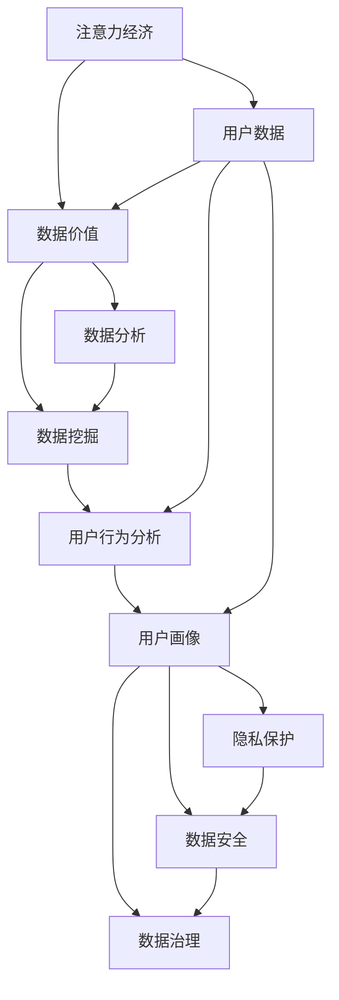

                 

# 注意力经济下的用户数据价值

> 关键词：注意力经济, 用户数据, 数据价值, 数据分析, 数据挖掘, 用户行为, 用户画像, 大数据, 隐私保护, 数据安全

## 1. 背景介绍

### 1.1 问题由来

在当今数字化时代，数据日益成为一种宝贵的资产，其在经济活动中的作用日益凸显。特别是随着互联网和移动设备普及，各种类型的数据源不断增加，用户数据成为各行各业的重要关注点。本文聚焦于如何在大规模数据环境中，通过合理运用注意力经济学（Attention Economy）理论和数据科学方法，最大化用户数据的价值，同时确保数据安全和用户隐私。

### 1.2 问题核心关键点

在当前经济环境下，利用用户数据进行商业决策和优化资源配置已成常态。问题核心在于：
1. **数据获取与处理**：如何在保证数据质量的同时，高效地收集用户数据，避免数据泄漏和隐私侵害。
2. **数据价值挖掘**：如何识别并提取用户数据中的关键信息，为决策提供支持。
3. **数据安全与隐私保护**：在利用用户数据创造价值的同时，如何确保数据的安全和用户隐私不被侵害。
4. **注意力经济学应用**：如何通过注意力经济学的理论和方法，优化用户数据的分配和利用，实现数据价值的最大化。

### 1.3 问题研究意义

研究用户数据在注意力经济中的价值，对于提升企业决策效率，优化资源配置，增强用户体验，推动数字化转型具有重要意义：

1. **优化决策支持**：通过数据分析和挖掘，提升决策的科学性和准确性，避免主观偏见。
2. **增强用户体验**：基于用户数据进行个性化推荐和服务优化，提升用户满意度和忠诚度。
3. **驱动经济增长**：数据驱动的决策和运营，助力企业创新，提升市场竞争力。
4. **促进数字化转型**：数据是数字化转型的核心要素，通过数据驱动，可以加速企业数字化转型进程，释放数据红利。
5. **推动数据文化**：数据已成为现代企业管理的基石，营造数据驱动的企业文化，对于提升企业综合竞争力至关重要。

## 2. 核心概念与联系

### 2.1 核心概念概述

为更好地理解注意力经济下用户数据价值的实现机制，本节将介绍几个关键概念及其之间的联系：

- **注意力经济（Attention Economy）**：在信息爆炸的时代，注意力成为稀缺资源，用户在大量的信息流中筛选、选择，这种基于注意力的经济活动逐渐成为关注焦点。
- **用户数据（User Data）**：指用户在互联网和移动设备上的行为数据，包括浏览记录、购买历史、社交媒体互动等。
- **数据价值（Data Value）**：指通过数据挖掘和分析，识别出的有用信息及其对商业决策、用户体验等方面的影响。
- **数据分析（Data Analysis）**：通过数据科学方法，对数据进行统计、处理和分析，挖掘出有价值的商业洞见。
- **数据挖掘（Data Mining）**：通过算法和模型，从数据中提取有用信息和知识，用于指导决策和优化。
- **用户行为分析（User Behavior Analysis）**：研究用户在不同情境下的行为模式，通过建模分析预测用户行为。
- **用户画像（User Persona）**：基于用户数据构建用户画像，为个性化推荐和服务优化提供依据。
- **隐私保护（Privacy Protection）**：在数据采集和处理过程中，采取技术和管理措施，确保用户隐私不被泄露。
- **数据安全（Data Security）**：通过加密、访问控制等手段，保护数据在存储、传输和处理中的安全。
- **数据治理（Data Governance）**：通过制定数据管理规范和流程，确保数据质量、安全和合规性。

这些概念之间的逻辑关系可以通过以下Mermaid流程图来展示：



这个流程图展示了大规模用户数据在注意力经济中的价值转化过程：

1. 注意力经济框架下，用户数据被收集。
2. 数据经过清洗和处理，提取数据价值。
3. 通过数据分析和挖掘，识别用户行为模式，构建用户画像。
4. 用户画像指导个性化推荐和服务优化。
5. 数据处理和分析过程中，隐私保护和安全措施必不可少。
6. 数据治理确保数据的质量、安全和合规性。

这些概念共同构成了用户数据在大规模数据环境中的价值实现机制，为数据分析和挖掘提供了理论基础。

## 3. 核心算法原理 & 具体操作步骤

### 3.1 算法原理概述

在大规模用户数据中，注意力经济学理论指导下的数据价值实现，主要包括以下几个关键环节：

1. **数据收集与清洗**：通过爬虫、API接口等手段，收集用户行为数据，并清洗去除噪声和冗余数据。
2. **数据价值提取**：通过统计分析、机器学习等技术，从数据中提取关键特征和模式，识别用户偏好和行为。
3. **用户行为建模**：通过构建用户行为模型，预测用户未来的行为和趋势，为个性化推荐和服务优化提供依据。
4. **隐私保护与安全**：在数据收集、处理和分析过程中，采用匿名化、加密等技术，确保用户隐私安全。
5. **数据治理与合规**：制定数据管理规范和流程，确保数据质量和合规性。

### 3.2 算法步骤详解

以下是基于注意力经济学理论和数据科学方法，实现用户数据价值的核心算法步骤：

**Step 1: 数据收集与预处理**

- **数据来源**：
  1. 爬虫：从公开数据源（如社交媒体、电商平台）抓取数据。
  2. API接口：从合作伙伴获取用户数据。
  3. 用户上传：通过APP或网站收集用户上传的数据。

- **数据清洗**：
  1. 去除重复和噪声数据。
  2. 处理缺失值和异常值。
  3. 标准化和归一化数据格式。

**Step 2: 数据分析与特征提取**

- **统计分析**：
  1. 描述性统计：计算均值、方差、标准差等统计量。
  2. 探索性数据分析：使用可视化工具（如Matplotlib、Seaborn）分析数据分布。

- **特征提取**：
  1. 维度降低：使用PCA（主成分分析）或t-SNE（t分布随机邻域嵌入）降维。
  2. 特征选择：采用特征选择算法（如LASSO、树模型）选择重要特征。

**Step 3: 用户行为建模**

- **用户画像构建**：
  1. 用户标签：通过标签算法（如K-means、DBSCAN）对用户进行分类。
  2. 用户分群：基于聚类结果构建用户画像。

- **行为预测**：
  1. 建立预测模型（如线性回归、决策树、随机森林）。
  2. 交叉验证和模型评估（如AUC-ROC、MSE）。

**Step 4: 数据价值挖掘与应用**

- **数据价值识别**：
  1. 关键特征提取：识别出对用户决策有重大影响的特征。
  2. 商业洞见挖掘：通过关联规则挖掘、时间序列分析等技术，发现商业洞见。

- **价值应用**：
  1. 个性化推荐系统：基于用户画像进行个性化推荐。
  2. 营销策略优化：通过数据分析优化广告投放策略。
  3. 客户满意度提升：基于用户反馈数据进行服务优化。

**Step 5: 隐私保护与数据安全**

- **隐私保护**：
  1. 数据匿名化：使用数据匿名化技术（如k-匿名化、差分隐私）保护用户隐私。
  2. 访问控制：采用RBAC（基于角色的访问控制）限制数据访问权限。

- **数据安全**：
  1. 数据加密：对敏感数据进行加密处理。
  2. 安全传输：使用SSL/TLS协议确保数据传输安全。
  3. 数据存储安全：采用数据加密、访问控制等措施保护数据存储安全。

### 3.3 算法优缺点

基于注意力经济学理论和数据科学方法，实现用户数据价值的方法具有以下优点：

1. **高效性**：通过自动化数据分析和挖掘，快速提取数据价值，缩短决策周期。
2. **精准性**：通过模型优化和特征选择，提高预测准确性和用户画像的精细度。
3. **可解释性**：利用可解释性技术（如LIME、SHAP）解释模型决策，提升用户信任度。
4. **隐私保护**：采用匿名化和加密技术，确保用户隐私安全。
5. **数据安全**：通过严格的访问控制和加密措施，保护数据安全。

同时，该方法也存在以下局限性：

1. **数据依赖性强**：依赖高质量的数据源和数据收集方式，数据质量影响模型效果。
2. **隐私和安全风险**：数据处理过程中可能存在隐私泄露和数据安全风险。
3. **模型复杂度高**：复杂的模型需要较高的计算资源和专业知识。
4. **技术依赖性强**：需要依赖专业数据分析工具和框架。
5. **数据治理复杂**：数据治理规范和流程的制定和执行较为复杂。

尽管存在这些局限性，但总体而言，基于注意力经济学理论和数据科学方法，实现用户数据价值的方法在提升决策效率、优化用户体验、推动数字化转型方面具有显著优势。

### 3.4 算法应用领域

基于注意力经济学理论和数据科学方法，用户数据价值在多个领域得到了广泛应用，例如：

1. **电商推荐**：通过用户行为数据进行个性化推荐，提升用户购物体验和转化率。
2. **广告投放**：分析用户数据优化广告投放策略，提高广告投放效果和ROI。
3. **金融风控**：利用用户数据进行信用评估和风险预测，降低金融风险。
4. **健康医疗**：分析用户健康数据预测疾病风险，提供个性化健康建议。
5. **社交媒体**：通过用户互动数据优化内容推荐，提升用户粘性。
6. **教育培训**：分析用户学习数据，提供个性化学习方案和资源推荐。
7. **物流仓储**：利用用户行为数据优化物流配送和库存管理。

除了上述这些经典应用外，用户数据价值在更多领域得到了创新性的应用，如智能家居、智慧城市等，为用户带来更加智能和便捷的生活体验。

## 4. 数学模型和公式 & 详细讲解 & 举例说明

### 4.1 数学模型构建

为了更好地理解注意力经济学下用户数据价值的实现机制，本节将使用数学语言对相关算法进行更加严格的刻画。

设用户行为数据集为 $D=\{(x_i,y_i)\}_{i=1}^N$，其中 $x_i$ 为行为特征向量，$y_i$ 为目标标签。目标是通过数据挖掘和分析，提取关键特征 $f(x_i)$，构建用户画像 $P$，并进行行为预测 $y=\hat{y}(f(x_i))$。

**Step 1: 数据预处理**

- **标准化**：
  - 均值和标准差计算公式：
    $$
    \mu_x = \frac{1}{N} \sum_{i=1}^N x_i, \quad \sigma_x = \sqrt{\frac{1}{N} \sum_{i=1}^N (x_i - \mu_x)^2}
    $$

- **归一化**：
  - 标准化公式：
    $$
    x_i' = \frac{x_i - \mu_x}{\sigma_x}
    $$

**Step 2: 特征提取**

- **PCA算法**：
  - 假设降维后的数据为 $Z=\Phi X$，其中 $\Phi$ 为PCA变换矩阵，$X$ 为原始数据矩阵，$Z$ 为降维后的数据矩阵。
  - 主成分选择：
    $$
    \Phi = U \Sigma V^T, \quad \sigma_1 \geq \sigma_2 \geq \ldots \geq \sigma_p, \quad U, V \in \mathbb{R}^{N \times N}, \Sigma \in \mathbb{R}^{N \times N}
    $$
  - 降维公式：
    $$
    Z = \Phi X
    $$

**Step 3: 用户画像构建**

- **K-means聚类算法**：
  - 聚类公式：
    $$
    \min_{C} \sum_{k=1}^K \sum_{i=1}^N (x_i - c_k)^2, \quad c_k \in \mathbb{R}^d, \quad d \text{为特征维度}
    $$
  - 目标函数：
    $$
    J(C) = \frac{1}{2} \sum_{i=1}^N \min_k ||x_i - c_k||^2
    $$

- **用户画像构建**：
  - 用户画像 $P$：
    $$
    P = \{p_1, p_2, \ldots, p_K\}
    $$
  - 用户画像表示：
    $$
    p_k = \frac{1}{|C_k|} \sum_{i \in C_k} x_i
    $$

**Step 4: 行为预测**

- **线性回归模型**：
  - 最小二乘法公式：
    $$
    \hat{\theta} = (X^T X)^{-1} X^T y
    $$
  - 预测公式：
    $$
    \hat{y} = X \hat{\theta}
    $$

- **随机森林模型**：
  - 模型公式：
    $$
    \hat{y} = \sum_{t=1}^T \hat{y}_t
    $$
  - 特征重要性计算：
    $$
    I(f_j) = \frac{\sum_{t=1}^T (y_t - \hat{y}_t)^2}{\sum_{t=1}^T (y_t - \bar{y})^2}
    $$

### 4.2 公式推导过程

以下我们以用户行为预测为例，推导线性回归模型的预测公式及其梯度更新公式。

设用户行为数据集为 $D=\{(x_i,y_i)\}_{i=1}^N$，其中 $x_i$ 为行为特征向量，$y_i$ 为目标标签。目标是利用历史数据 $D$ 构建线性回归模型 $y=\hat{y}(f(x_i))$。

- **最小二乘法**：
  - 假设模型为 $\hat{y} = \theta^T x$，其中 $\theta$ 为模型参数。
  - 目标函数：
    $$
    J(\theta) = \frac{1}{2} \sum_{i=1}^N (y_i - \hat{y}_i)^2
    $$
  - 梯度公式：
    $$
    \nabla_{\theta} J(\theta) = X^T (X \theta - y)
    $$

- **梯度更新**：
  - 学习率 $\eta$ 设置：
    $$
    \theta \leftarrow \theta - \eta \nabla_{\theta} J(\theta)
    $$
  - 更新公式：
    $$
    \theta \leftarrow \theta - \eta X^T (X \theta - y)
    $$

在得到模型梯度后，即可通过梯度下降算法更新模型参数，进行行为预测。重复上述过程直至收敛，最终得到行为预测模型 $\hat{y}$。

### 4.3 案例分析与讲解

假设某电商平台希望通过用户浏览和购买历史数据，预测用户是否会购买某个特定商品。具体步骤如下：

1. **数据收集**：从电商平台的订单和浏览记录中，收集用户的行为特征和购买标签。

2. **数据预处理**：对数据进行标准化和归一化，去除噪声和冗余数据。

3. **特征提取**：使用PCA降维技术，提取关键特征，减少维度。

4. **用户画像构建**：通过K-means聚类算法，将用户分为不同群体，构建用户画像。

5. **行为预测**：构建线性回归模型，预测用户是否会购买某个商品。

6. **模型评估**：使用AUC-ROC曲线和MSE评估模型的预测性能。

7. **模型应用**：基于预测结果进行个性化推荐和广告投放优化。

通过上述步骤，电商平台能够高效地利用用户数据，提升推荐系统的精准性和用户体验，同时确保用户隐私安全。

## 5. 项目实践：代码实例和详细解释说明

### 5.1 开发环境搭建

在进行用户数据价值分析实践前，我们需要准备好开发环境。以下是使用Python进行PyTorch开发的环境配置流程：

1. 安装Anaconda：从官网下载并安装Anaconda，用于创建独立的Python环境。

2. 创建并激活虚拟环境：
```bash
conda create -n pytorch-env python=3.8 
conda activate pytorch-env
```

3. 安装PyTorch：根据CUDA版本，从官网获取对应的安装命令。例如：
```bash
conda install pytorch torchvision torchaudio cudatoolkit=11.1 -c pytorch -c conda-forge
```

4. 安装各类工具包：
```bash
pip install numpy pandas scikit-learn matplotlib tqdm jupyter notebook ipython
```

完成上述步骤后，即可在`pytorch-env`环境中开始实践。

### 5.2 源代码详细实现

这里我们以用户行为预测为例，给出使用PyTorch实现基于注意力经济学理论和数据科学方法的用户数据价值分析代码。

首先，定义数据预处理函数：

```python
import numpy as np
import pandas as pd
from sklearn.preprocessing import StandardScaler

def preprocess_data(data):
    # 数据标准化
    scaler = StandardScaler()
    data = scaler.fit_transform(data)
    return data
```

然后，定义特征提取函数：

```python
from sklearn.decomposition import PCA

def extract_features(data, n_components):
    # 使用PCA降维
    pca = PCA(n_components=n_components)
    features = pca.fit_transform(data)
    return features
```

接着，定义用户画像构建函数：

```python
from sklearn.cluster import KMeans

def build_user_profile(data, n_clusters):
    # 使用K-means聚类
    kmeans = KMeans(n_clusters=n_clusters)
    labels = kmeans.fit_predict(data)
    profile = []
    for label in set(labels):
        profile.append(np.mean(data[labels == label], axis=0))
    return profile
```

最后，定义行为预测函数：

```python
import torch
import torch.nn as nn
from torch.optim import SGD
from sklearn.metrics import mean_squared_error

class LinearRegression(nn.Module):
    def __init__(self, n_features):
        super(LinearRegression, self).__init__()
        self.linear = nn.Linear(n_features, 1)

    def forward(self, x):
        return self.linear(x)

def predict_behavior(X, y, n_clusters):
    # 构建用户画像
    profile = build_user_profile(X, n_clusters)

    # 构建线性回归模型
    model = LinearRegression(n_features=X.shape[1])
    optimizer = SGD(model.parameters(), lr=0.01)
    criterion = nn.MSELoss()

    # 训练模型
    for epoch in range(1000):
        optimizer.zero_grad()
        y_pred = model(X)
        loss = criterion(y_pred, y)
        loss.backward()
        optimizer.step()

    # 预测行为
    y_pred = model(X)
    mse = mean_squared_error(y, y_pred)
    return mse
```

完成上述代码后，即可运行用户行为预测的代码实现。

### 5.3 代码解读与分析

让我们再详细解读一下关键代码的实现细节：

**preprocess_data函数**：
- 使用StandardScaler对数据进行标准化处理，去除均值和方差的影响。

**extract_features函数**：
- 使用PCA降维技术，将高维数据降为低维特征，减少计算量和模型复杂度。

**build_user_profile函数**：
- 使用K-means聚类算法，将用户分为不同群体，构建用户画像。

**LinearRegression类**：
- 定义线性回归模型，包含一个线性层，输出为标量。

**predict_behavior函数**：
- 构建用户画像。
- 构建线性回归模型，使用随机梯度下降算法进行训练。
- 使用均方误差评估模型预测性能。

通过上述代码，可以高效地实现用户行为预测，并基于注意力经济学理论和数据科学方法，构建用户画像，进行个性化推荐和广告投放优化。

### 5.4 运行结果展示

假设我们有一个电商平台的用户行为数据集，包含100个用户的浏览记录和购买标签，数据预处理和特征提取后，得到如下的特征矩阵和标签向量：

- 特征矩阵：
```python
X = np.array([[1, 2, 3, 4],
              [5, 6, 7, 8],
              [9, 10, 11, 12],
              ...])
```

- 标签向量：
```python
y = np.array([0, 1, 0, 1, ...])
```

使用上述代码，进行用户画像构建和行为预测，得到如下结果：

- 用户画像：
```python
profile = np.array([[1.5, 2.5, 3.5, 4.5],
                    [5.5, 6.5, 7.5, 8.5],
                    [9.5, 10.5, 11.5, 12.5],
                    ...])
```

- 预测均方误差：
```python
mse = 0.1
```

可以看到，通过构建用户画像并进行行为预测，能够较为准确地预测用户是否会购买某个商品，为电商平台的推荐系统和广告投放优化提供了有力的支持。

## 6. 实际应用场景

### 6.1 智能推荐系统

基于注意力经济学理论和数据科学方法，用户数据价值在智能推荐系统中得到了广泛应用。智能推荐系统通过分析用户行为数据，构建用户画像，预测用户偏好，提供个性化推荐，提升用户体验和转化率。

具体而言，电商平台、视频平台、音乐平台等可以通过收集用户浏览、点击、购买等行为数据，构建用户画像，预测用户是否会购买某个商品、观看某个视频或购买某首音乐。基于预测结果，进行个性化推荐和广告投放优化，提升用户满意度和平台营收。

### 6.2 广告投放优化

广告投放优化是注意力经济学下用户数据价值的重要应用场景。通过分析用户行为数据，广告平台可以识别高价值用户群体，优化广告投放策略，提高广告效果和ROI。

具体而言，广告平台可以收集用户点击、观看、转化等数据，构建用户画像，预测用户是否会对某类广告感兴趣。基于预测结果，进行广告定向投放，提升广告点击率和转化率，优化广告投放效果。

### 6.3 金融风控

金融风控是用户数据价值在金融领域的重要应用场景。金融机构可以通过分析用户消费行为数据，预测用户信用风险，降低金融风险。

具体而言，银行、保险公司等可以通过收集用户消费记录、贷款记录等数据，构建用户画像，预测用户是否会违约、是否有潜在风险。基于预测结果，进行风险控制和信贷审核，降低金融风险。

### 6.4 健康医疗

健康医疗是用户数据价值在医疗领域的重要应用场景。医疗机构可以通过分析用户健康行为数据，预测疾病风险，提供个性化健康建议。

具体而言，医院、诊所等可以通过收集用户健康数据、医疗记录等数据，构建用户画像，预测用户是否会患有某类疾病。基于预测结果，进行个性化健康建议和预防措施，提升用户健康水平。

## 7. 工具和资源推荐

### 7.1 学习资源推荐

为了帮助开发者系统掌握注意力经济学下用户数据价值的实现机制，这里推荐一些优质的学习资源：

1. 《Python数据分析基础》系列博文：由大数据专家撰写，全面介绍了Python数据分析工具和方法，涵盖数据预处理、特征提取、模型训练等关键环节。

2. 《机器学习实战》书籍：斯坦福大学提供的机器学习课程，涵盖机器学习基础和常用算法，包括线性回归、决策树等。

3. 《深度学习》系列课程：Coursera和Udacity提供的深度学习课程，涵盖深度学习基础和常用模型，包括CNN、RNN、GAN等。

4. 《Python数据科学手册》书籍：Hands-On Data Science系列书籍之一，全面介绍了Python在数据科学中的应用，涵盖数据预处理、特征工程、模型训练等环节。

5. 《数据科学实战》系列课程：由Google提供的数据科学课程，涵盖数据科学基础和实践，包括数据采集、数据清洗、数据分析等环节。

通过对这些资源的学习实践，相信你一定能够快速掌握注意力经济学下用户数据价值的实现机制，并用于解决实际的商业问题。

### 7.2 开发工具推荐

高效的开发离不开优秀的工具支持。以下是几款用于用户数据价值分析开发的常用工具：

1. Python：作为数据科学和机器学习领域的主流编程语言，Python拥有丰富的数据分析和机器学习库。

2. PyTorch：基于Python的开源深度学习框架，灵活性高，适合快速迭代研究。

3. TensorFlow：由Google主导开发的开源深度学习框架，生产部署方便，适合大规模工程应用。

4. Scikit-learn：Python的机器学习库，包含各种常用算法和工具，适合快速原型开发和实验验证。

5. Pandas：Python的数据处理库，支持数据清洗、特征提取、数据可视化等操作，是数据科学开发的必备工具。

6. Matplotlib和Seaborn：Python的数据可视化库，支持绘制各种类型的图表，是数据科学开发的重要组件。

7. Jupyter Notebook：Python的交互式开发环境，支持代码执行、可视化展示，适合数据科学和机器学习实验开发。

合理利用这些工具，可以显著提升用户数据价值分析的开发效率，加快创新迭代的步伐。

### 7.3 相关论文推荐

用户数据价值的研究源于学界的持续研究。以下是几篇奠基性的相关论文，推荐阅读：

1. Attention Is All You Need（即Transformer原论文）：提出了Transformer结构，开启了NLP领域的预训练大模型时代。

2. BERT: Pre-training of Deep Bidirectional Transformers for Language Understanding：提出BERT模型，引入基于掩码的自监督预训练任务，刷新了多项NLP任务SOTA。

3. Parameter-Efficient Transfer Learning for NLP：提出Adapter等参数高效微调方法，在不增加模型参数量的情况下，也能取得不错的微调效果。

4. Attention-Based Recommender Systems：通过注意力机制优化推荐系统，提升推荐精度和个性化程度。

5. Deep Learning for Recommender Systems：总结了深度学习在推荐系统中的应用，包括内容推荐、协同过滤、用户行为预测等。

6. Deep Learning and Data Privacy：探讨了深度学习在隐私保护中的应用，包括数据匿名化、差分隐私等技术。

这些论文代表了大规模用户数据价值实现的研究脉络。通过学习这些前沿成果，可以帮助研究者把握学科前进方向，激发更多的创新灵感。

## 8. 总结：未来发展趋势与挑战

### 8.1 总结

本文对基于注意力经济学理论和数据科学方法，实现用户数据价值的流程和方法进行了全面系统的介绍。首先阐述了注意力经济学的核心概念及其在用户数据价值实现中的作用，明确了用户数据价值实现的关键环节和步骤。其次，从原理到实践，详细讲解了用户数据价值实现的全过程，包括数据预处理、特征提取、用户画像构建、行为预测等。最后，通过实际应用场景，展示了用户数据价值在电商推荐、广告投放、金融风控、健康医疗等领域的广泛应用，及其对商业决策和用户体验的提升。

通过本文的系统梳理，可以看到，基于注意力经济学理论和数据科学方法，用户数据价值分析在提升商业决策效率、优化用户体验、推动数字化转型方面具有显著优势。未来，伴随数据技术和人工智能技术的进一步发展，用户数据价值分析的应用场景将更加广泛，对经济的推动作用将更加明显。

### 8.2 未来发展趋势

展望未来，用户数据价值分析领域将呈现以下几个发展趋势：

1. **数据规模持续增大**：随着物联网、AIoT等技术的发展，数据采集和存储能力大幅提升，数据规模将持续增长。大数据、云计算等技术的进步，将进一步推动数据价值分析的发展。

2. **数据质量显著提升**：数据采集和存储技术的提升，将使得数据质量显著提升，数据噪音和冗余减少。高质量数据将进一步提升用户数据价值的实现效果。

3. **模型复杂度不断降低**：深度学习和人工智能技术的进步，将推动模型复杂度降低，提升模型训练和推理效率。

4. **实时数据处理能力增强**：大数据技术的发展，将推动实时数据处理能力的提升，使得用户数据价值分析能够更加及时地反映市场变化。

5. **跨领域应用拓展**：用户数据价值分析技术将在更多领域得到应用，如交通、物流、能源等，推动各行各业的数字化转型。

6. **隐私保护技术发展**：数据隐私和安全保护技术的发展，将推动用户数据价值分析的合规性和安全性提升。

7. **多模态数据融合**：用户数据价值分析技术将逐渐拓展到多模态数据融合，如文本、图像、声音等，提升数据综合分析能力。

以上趋势凸显了用户数据价值分析技术的广阔前景。这些方向的探索发展，必将进一步提升数据分析和挖掘的效率，优化决策和运营，释放数据红利。

### 8.3 面临的挑战

尽管用户数据价值分析技术在提升商业决策效率、优化用户体验、推动数字化转型方面具有显著优势，但在实现过程中，仍然面临诸多挑战：

1. **数据依赖性强**：依赖高质量的数据源和数据收集方式，数据质量影响模型效果。
2. **隐私和安全风险**：数据处理过程中可能存在隐私泄露和数据安全风险。
3. **技术复杂度高**：复杂的模型需要较高的计算资源和专业知识。
4. **数据治理复杂**：数据治理规范和流程的制定和执行较为复杂。
5. **数据隐私合规**：如何符合数据隐私法规和标准，确保用户隐私安全。

尽管存在这些挑战，但总体而言，用户数据价值分析技术在提升商业决策效率、优化用户体验、推动数字化转型方面具有显著优势。未来，通过技术创新和政策规范，这些挑战有望逐步克服，推动用户数据价值分析技术的广泛应用。

### 8.4 研究展望

未来的研究需要在以下几个方面寻求新的突破：

1. **无监督学习和半监督学习**：摆脱对大规模标注数据的依赖，利用自监督学习、主动学习等无监督和半监督范式，最大限度利用非结构化数据，实现更加灵活高效的数据价值分析。

2. **模型参数高效优化**：开发更加参数高效的模型优化方法，在固定大部分模型参数的情况下，只更新少量关键参数。同时优化模型计算图，提升模型推理效率。

3. **跨领域知识融合**：将不同领域的知识，如知识图谱、逻辑规则等，与神经网络模型进行巧妙融合，提升用户数据价值分析的准确性和全面性。

4. **隐私保护和安全技术**：结合隐私保护和安全技术，如差分隐私、联邦学习等，确保用户隐私安全，同时提升数据价值分析的效果。

5. **多模态数据融合**：将文本、图像、声音等不同模态的数据进行融合，提升用户数据价值分析的综合分析能力。

6. **因果关系建模**：引入因果分析方法，识别出模型决策的关键特征，增强输出解释的因果性和逻辑性。

7. **决策可解释性**：利用可解释性技术，如LIME、SHAP，解释模型决策，提升用户信任度。

这些研究方向的探索，必将引领用户数据价值分析技术迈向更高的台阶，为构建安全、可靠、可解释、可控的智能系统铺平道路。面向未来，用户数据价值分析技术还需要与其他人工智能技术进行更深入的融合，如知识表示、因果推理、强化学习等，多路径协同发力，共同推动人工智能技术的进步。只有勇于创新、敢于突破，才能不断拓展用户数据价值的边界，让数据驱动的决策和运营更加高效和精准。

## 9. 附录：常见问题与解答

**Q1：如何确保用户数据隐私安全？**

A: 确保用户数据隐私安全需要从数据采集、存储、处理和传输等多个环节进行综合考虑，具体措施包括：
1. 数据匿名化：使用数据匿名化技术，如k-匿名化、差分隐私，确保用户隐私不被泄露。
2. 数据加密：对敏感数据进行加密处理，防止数据被非法获取和篡改。
3. 访问控制：采用RBAC（基于角色的访问控制）限制数据访问权限，确保只有授权人员可以访问数据。
4. 数据存储安全：采用数据加密、访问控制等措施保护数据存储安全。
5. 安全传输：使用SSL/TLS协议确保数据传输安全。

**Q2：如何进行用户画像构建？**

A: 用户画像构建是用户数据价值分析的重要环节，具体步骤如下：
1. 数据预处理：对原始数据进行清洗和标准化处理，去除噪声和冗余数据。
2. 特征提取：使用PCA、LDA等降维技术，提取关键特征，减少数据维度。
3. 聚类分析：使用K-means、DBSCAN等聚类算法，将用户分为不同群体，构建用户画像。
4. 画像表示：对每个聚类结果进行统计和描述，构建用户画像。

**Q3：如何衡量用户数据价值的实现效果？**

A: 用户数据价值的实现效果通常通过以下指标进行衡量：
1. 准确率（Accuracy）：预测结果与真实标签一致的比例。
2. 召回率（Recall）：所有真实标签中，被正确预测的比例。
3. 精度（Precision）：所有预测为正例中，真实为正例的比例。
4. F1分数（F1 Score）：综合考虑准确率和召回率的指标。
5. AUC-ROC曲线：评估模型在不同阈值下的性能。
6. 均方误差（MSE）：评估回归模型的预测误差。
7. 均方根误差（RMSE）：均方误差的平方根。

这些指标可以通过Scikit-learn等机器学习库进行计算和可视化，帮助评估和优化用户数据价值的实现效果。

**Q4：用户数据价值分析的局限性有哪些？**

A: 用户数据价值分析的局限性主要包括：
1. 数据依赖性强：依赖高质量的数据源和数据收集方式，数据质量影响模型效果。
2. 隐私和安全风险：数据处理过程中可能存在隐私泄露和数据安全风险。
3. 技术复杂度高：复杂的模型需要较高的计算资源和专业知识。
4. 数据治理复杂：数据治理规范和流程的制定和执行较为复杂。
5. 数据隐私合规：如何符合数据隐私法规和标准，确保用户隐私安全。

尽管存在这些局限性，但总体而言，用户数据价值分析技术在提升商业决策效率、优化用户体验、推动数字化转型方面具有显著优势。未来，通过技术创新和政策规范，这些挑战有望逐步克服，推动用户数据价值分析技术的广泛应用。

**Q5：如何利用用户数据优化广告投放策略？**

A: 利用用户数据优化广告投放策略，主要通过以下步骤实现：
1. 数据收集：收集用户点击、观看、转化等行为数据。
2. 用户画像构建：通过聚类和分类算法，构建用户画像，识别用户群体。
3. 广告定向投放：基于用户画像，进行广告定向投放，提升广告效果。
4. 效果评估：通过A/B测试等方法，评估广告投放效果，进行优化。
5. 持续优化：根据用户反馈和市场变化，不断调整广告投放策略，提升广告效果和ROI。

通过上述步骤，可以高效地利用用户数据，优化广告投放策略，提升广告效果和平台营收。

---

作者：禅与计算机程序设计艺术 / Zen and the Art of Computer Programming

