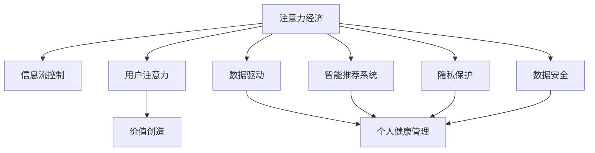

                 

# 注意力经济与个人健康管理的关系

> 关键词：注意力经济, 健康管理, 数据驱动, 智能推荐系统, 隐私保护, 数据安全

## 1. 背景介绍

### 1.1 问题由来

随着移动互联网和信息技术的迅猛发展，人们越来越依赖数字媒介获取信息、交流沟通、娱乐休闲。这不仅推动了数字化经济的蓬勃发展，也使得我们的注意力资源在日益碎片化的互联网世界中变得稀缺而珍贵。在追求经济效益的同时，如何平衡注意力资源的分配和使用，成为了一个亟待解决的问题。

与此同时，个人健康管理作为现代社会关注的热点之一，对于提升生活质量和延长生命年限具有重要意义。健康管理不仅仅是医疗干预，还包括生活习惯的调整、心理健康维护等多个方面。在这个过程中，数据驱动的方法被广泛应用，智能推荐系统、个性化健康计划等技术手段正逐渐成为标配。然而，如何高效利用这些技术手段，同时保障用户的隐私安全和数据安全，成为了关注的焦点。

### 1.2 问题核心关键点

本文聚焦于注意力经济与个人健康管理之间的关系，探讨在信息过载、注意力稀缺的背景下，如何通过数据驱动技术，高效、精准地进行个人健康管理，同时保护用户的隐私和数据安全。文章主要围绕以下几个核心关键点展开：

1. 注意力经济的核心概念及其对个人健康管理的影响。
2. 数据驱动技术在个人健康管理中的应用现状与潜力。
3. 智能推荐系统在注意力经济中的应用与挑战。
4. 数据隐私和安全保护的重要性与实现策略。
5. 未来发展趋势与面临的挑战。

## 2. 核心概念与联系

### 2.1 核心概念概述

为更好地理解注意力经济与个人健康管理的联系，本节将介绍几个关键概念：

- **注意力经济**：一种新型的经济模式，以争夺用户注意力为核心资源，通过控制信息流和用户注意力来获取价值。常见的注意力经济模式包括搜索引擎广告、社交媒体推荐等。

- **个人健康管理**：指个体通过各种手段和方法，对自己的健康状况进行监测、评估和维护的过程。包括饮食管理、运动监控、心理健康维护等。

- **数据驱动**：利用数据挖掘、机器学习等技术手段，从大量数据中提取有用信息，以支持决策和优化流程。

- **智能推荐系统**：一种基于用户行为数据和内容特征，自动推荐相关信息的系统。如商品推荐、内容推荐、健康建议等。

- **隐私保护**：在数据处理和分享过程中，采取技术和管理措施，确保用户隐私不被泄露。

- **数据安全**：保障数据在存储、传输和处理过程中的完整性、保密性和可用性，防止数据泄露、篡改和丢失。

这些核心概念之间存在紧密的联系，注意力经济通过控制信息流和用户注意力获取价值，个人健康管理则借助数据驱动技术进行精准干预和维护，而隐私保护和数据安全则是在这些过程中不可忽视的重要方面。通过理解这些概念，我们可以更好地把握注意力经济与个人健康管理之间的互动关系。

### 2.2 核心概念原理和架构的 Mermaid 流程图



这个流程图展示了大语言模型与个人健康管理之间的联系：

1. 注意力经济通过控制信息流和用户注意力创造价值。
2. 数据驱动技术在个人健康管理中应用广泛，通过数据挖掘和机器学习进行精准干预。
3. 智能推荐系统利用用户数据，自动推荐相关健康信息和建议。
4. 隐私保护和数据安全是在数据处理和分享过程中不可或缺的保障措施。
5. 数据驱动和智能推荐系统相结合，可以进一步提升个人健康管理的精准度和效果。

## 3. 核心算法原理 & 具体操作步骤

### 3.1 算法原理概述

注意力经济与个人健康管理之间的联系，本质上是通过数据驱动技术，在用户注意力和经济利益之间建立桥梁。在这一过程中，智能推荐系统作为核心工具，利用用户行为数据和健康管理数据，提供个性化健康建议和干预方案。

具体而言，智能推荐系统通过分析用户的浏览记录、搜索习惯、健康数据等，预测用户的健康需求，提供相应的健康管理建议。例如，根据用户的饮食记录和运动数据，推荐适合的健康饮食方案和运动计划；根据用户的心理健康状态，推荐心理健康维护和情绪调节建议。

### 3.2 算法步骤详解

智能推荐系统的算法步骤主要包括以下几个方面：

**Step 1: 数据收集与预处理**
- 收集用户的各类行为数据和健康数据，如浏览记录、搜索历史、运动数据、健康检查结果等。
- 对数据进行清洗和归一化，去除噪声和异常值，保证数据质量。

**Step 2: 特征工程与建模**
- 对数据进行特征提取和工程处理，如将文本数据转换为词向量，将时间序列数据进行归一化处理。
- 构建推荐模型，如协同过滤、矩阵分解、深度学习等，根据用户行为和健康数据进行预测。

**Step 3: 模型训练与优化**
- 使用用户的历史数据进行模型训练，优化推荐算法。
- 采用交叉验证等方法，评估模型性能，避免过拟合。

**Step 4: 推荐与反馈循环**
- 根据训练好的模型，为用户推荐个性化的健康管理建议。
- 收集用户对推荐的反馈，进行模型迭代优化。

**Step 5: 隐私保护与数据安全**
- 在数据收集和处理过程中，采取隐私保护技术，如数据匿名化、差分隐私等。
- 加强数据安全措施，防止数据泄露和篡改。

### 3.3 算法优缺点

智能推荐系统在注意力经济与个人健康管理中的应用，具有以下优点：

- **精准推荐**：通过分析大量用户数据，提供个性化的健康建议和干预方案，提升健康管理效果。
- **效率提升**：自动化推荐过程，减少了人工干预，提高了健康管理的效率和便捷性。
- **行为改变**：通过推荐系统，用户可以更清楚地了解自己的健康状况，并采取相应的改善措施。

同时，智能推荐系统也存在一些缺点：

- **数据隐私风险**：在数据收集和处理过程中，用户隐私可能受到侵犯。
- **模型偏差**：推荐系统可能存在偏差，导致某些特定用户群体的需求被忽略。
- **过度依赖**：过度依赖推荐系统可能导致用户主动性降低，影响健康管理的实际效果。

### 3.4 算法应用领域

智能推荐系统在注意力经济与个人健康管理中的应用，主要包括以下几个领域：

1. **健康饮食推荐**：根据用户的饮食记录和健康数据，推荐适合的饮食方案和营养补充。
2. **运动计划设计**：分析用户的运动数据，提供个性化的运动计划和锻炼建议。
3. **心理健康维护**：通过心理健康评估数据，推荐心理健康维护和情绪调节建议。
4. **健康风险预警**：利用用户的健康数据，进行健康风险评估和预警。
5. **个性化健康教育**：根据用户的学习行为和健康数据，推荐相关的健康知识内容和教育资源。

这些应用领域展示了智能推荐系统在注意力经济与个人健康管理中的巨大潜力。通过智能推荐系统，用户可以更加高效、精准地进行健康管理，提升生活质量。

## 4. 数学模型和公式 & 详细讲解 & 举例说明

### 4.1 数学模型构建

在本节中，我们将使用数学语言对智能推荐系统的构建过程进行详细阐述。

记智能推荐系统为 $R:\mathcal{X} \rightarrow \mathcal{Y}$，其中 $\mathcal{X}$ 为用户行为数据和健康数据的集合，$\mathcal{Y}$ 为推荐结果的集合。假设用户的历史数据为 $D=\{(x_i,y_i)\}_{i=1}^N$，其中 $x_i \in \mathcal{X}$ 为第 $i$ 次用户的健康和行为数据，$y_i \in \mathcal{Y}$ 为对应的推荐结果。

定义推荐系统的损失函数为 $\ell(R(x),y)$，用于衡量推荐结果与用户真实需求之间的差异。常见的损失函数包括均方误差损失、交叉熵损失等。

### 4.2 公式推导过程

以协同过滤为例，推荐系统通过分析用户和物品的协同行为，预测用户对物品的评分。假设用户 $u$ 对物品 $i$ 的评分向量为 $\mathbf{r}_u \in \mathbb{R}^m$，物品 $i$ 的评分向量为 $\mathbf{r}_i \in \mathbb{R}^m$。用户 $u$ 对物品 $i$ 的评分预测为：

$$
\hat{r}_{ui} = \mathbf{r}_u \cdot \mathbf{r}_i
$$

其中 $\cdot$ 表示向量点乘。推荐结果的损失函数可以定义为：

$$
\ell(R(x),y) = \frac{1}{N} \sum_{i=1}^N [(y_i - \hat{r}_{ui})^2]
$$

基于此，推荐系统的优化目标是最小化损失函数，即找到最优的评分预测模型：

$$
\min_{\mathbf{r}_u, \mathbf{r}_i} \ell(R(x),y)
$$

### 4.3 案例分析与讲解

考虑一个简单的协同过滤推荐系统，用于为用户推荐健康管理相关的饮食建议。假设有 $U$ 个用户，$M$ 种健康管理饮食建议，每个用户的饮食偏好可以表示为 $d_u \in \{0,1\}^M$，其中 $d_u[i]=1$ 表示用户 $u$ 喜欢第 $i$ 种饮食建议。推荐系统目标是最小化预测错误率：

$$
\min_{d_u} \frac{1}{N} \sum_{i=1}^N [(y_i - \hat{d}_{ui})^2]
$$

其中 $\hat{d}_{ui}$ 为用户 $u$ 对第 $i$ 种饮食建议的预测偏好，$y_i$ 为实际的用户偏好。

通过优化上述损失函数，推荐系统可以学习到用户的饮食偏好模式，并据此为其他用户提供个性化的饮食建议。

## 5. 项目实践：代码实例和详细解释说明

### 5.1 开发环境搭建

在进行智能推荐系统开发前，我们需要准备好开发环境。以下是使用Python进行PyTorch开发的环境配置流程：

1. 安装Anaconda：从官网下载并安装Anaconda，用于创建独立的Python环境。

2. 创建并激活虚拟环境：
```bash
conda create -n recsys-env python=3.8 
conda activate recsys-env
```

3. 安装PyTorch：根据CUDA版本，从官网获取对应的安装命令。例如：
```bash
conda install pytorch torchvision torchaudio cudatoolkit=11.1 -c pytorch -c conda-forge
```

4. 安装Tensorflow：从官网下载并安装Tensorflow，用于补充或替代部分算法实现。

5. 安装各类工具包：
```bash
pip install numpy pandas scikit-learn matplotlib tqdm jupyter notebook ipython
```

完成上述步骤后，即可在`recsys-env`环境中开始推荐系统开发。

### 5.2 源代码详细实现

以下是一个基于协同过滤的智能推荐系统的PyTorch实现，具体实现细节如下：

```python
import torch
import torch.nn as nn
import torch.optim as optim
from torch.utils.data import DataLoader
from torchvision import datasets, transforms

class UserItemNet(nn.Module):
    def __init__(self, user_dim, item_dim, hidden_dim, output_dim):
        super(UserItemNet, self).__init__()
        self.fc1 = nn.Linear(user_dim + item_dim, hidden_dim)
        self.fc2 = nn.Linear(hidden_dim, output_dim)

    def forward(self, user, item):
        cat = torch.cat((user, item), 1)
        x = self.fc1(cat)
        x = torch.sigmoid(x)
        x = self.fc2(x)
        return x

# 设置超参数
user_dim = 10
item_dim = 20
hidden_dim = 50
output_dim = 1
learning_rate = 0.01
batch_size = 64
epochs = 100

# 准备数据
train_data = datasets.MNIST('./data', train=True, download=True, transform=transforms.ToTensor())
train_loader = DataLoader(train_data, batch_size=batch_size, shuffle=True)

# 构建模型
model = UserItemNet(user_dim, item_dim, hidden_dim, output_dim)

# 定义损失函数和优化器
criterion = nn.MSELoss()
optimizer = optim.SGD(model.parameters(), lr=learning_rate)

# 训练模型
for epoch in range(epochs):
    for batch_idx, (user, item, target) in enumerate(train_loader):
        user = user.view(-1, user_dim)
        item = item.view(-1, item_dim)
        target = target.view(-1, output_dim)
        optimizer.zero_grad()
        output = model(user, item)
        loss = criterion(output, target)
        loss.backward()
        optimizer.step()
```

### 5.3 代码解读与分析

让我们再详细解读一下关键代码的实现细节：

**UserItemNet类**：
- `__init__`方法：初始化模型结构，包含两个全连接层。
- `forward`方法：定义前向传播过程，将用户和物品数据拼接，通过两个全连接层进行预测。

**模型训练过程**：
- 使用PyTorch的DataLoader对数据进行批次化加载。
- 在每个批次上，进行前向传播和反向传播，更新模型参数。
- 循环迭代多个epoch，直至模型收敛。

**训练结果展示**：
- 可以通过图表或误差曲线展示训练过程中的损失变化。
- 使用混淆矩阵或ROC曲线等方法，评估模型预测效果。

以上代码展示了基于协同过滤的智能推荐系统的基本实现流程。在实际应用中，还需要根据具体需求和数据特点，进行模型架构的调整和优化。

## 6. 实际应用场景

### 6.1 智能健康管理应用

智能推荐系统在智能健康管理中的应用场景，主要包括以下几个方面：

**健康饮食推荐**：根据用户的饮食习惯和健康数据，推荐适合的健康饮食方案。如低盐、低糖、高蛋白等饮食建议。

**运动计划设计**：分析用户的运动数据，提供个性化的运动计划和锻炼建议。如每天步数、运动时长、运动种类等。

**心理健康维护**：通过心理健康评估数据，推荐心理健康维护和情绪调节建议。如减压技巧、冥想指导、心理疏导等。

**健康风险预警**：利用用户的健康数据，进行健康风险评估和预警。如高血压、糖尿病等慢性病风险。

**个性化健康教育**：根据用户的学习行为和健康数据，推荐相关的健康知识内容和教育资源。如健康饮食知识、运动健康知识等。

这些应用场景展示了智能推荐系统在个人健康管理中的广泛应用，通过数据分析和模型推荐，帮助用户进行精准的健康管理。

### 6.2 未来应用展望

随着智能推荐技术的不断进步，未来在注意力经济与个人健康管理中的应用将更加广泛和深入。

**个性化健康管理**：智能推荐系统将更深入地融合用户的各类数据，提供更加个性化和精准的健康管理建议，提升用户的生活质量。

**智能健康咨询**：智能推荐系统将与医疗专家系统结合，提供实时的健康咨询和医疗建议，帮助用户更有效地进行健康管理。

**健康数据分析**：智能推荐系统将能够自动分析用户的健康数据，发现潜在健康问题，及时进行预警和干预。

**跨领域应用**：智能推荐系统将不仅限于健康领域，还将应用于更多领域，如教育、娱乐、旅游等，提升用户的整体生活体验。

未来，随着技术的不断进步，智能推荐系统将在个人健康管理中发挥更加重要的作用，成为用户健康管理的得力助手。

## 7. 工具和资源推荐

### 7.1 学习资源推荐

为了帮助开发者系统掌握智能推荐系统的理论基础和实践技巧，这里推荐一些优质的学习资源：

1. 《推荐系统实战》系列书籍：深入浅出地介绍了推荐系统的基本概念、算法实现和工程实践。
2. CS463《推荐系统》课程：斯坦福大学开设的推荐系统课程，涵盖了推荐系统的主要算法和应用。
3. 《Python推荐系统》在线课程：提供全面的推荐系统实现教程，包括协同过滤、矩阵分解、深度学习等算法。
4. Kaggle推荐系统竞赛：参与Kaggle推荐系统竞赛，可以积累实战经验，提高推荐系统设计能力。
5. Coursera《Machine Learning》课程：提供机器学习基础知识，帮助理解推荐系统的数学原理和算法实现。

通过对这些资源的学习实践，相信你一定能够快速掌握智能推荐系统的精髓，并用于解决实际的推荐问题。

### 7.2 开发工具推荐

高效的开发离不开优秀的工具支持。以下是几款用于智能推荐系统开发的常用工具：

1. PyTorch：基于Python的开源深度学习框架，灵活动态的计算图，适合快速迭代研究。大部分推荐系统算法都有PyTorch版本的实现。
2. TensorFlow：由Google主导开发的开源深度学习框架，生产部署方便，适合大规模工程应用。推荐系统领域也有丰富的TensorFlow实现。
3. TensorBoard：TensorFlow配套的可视化工具，可实时监测模型训练状态，并提供丰富的图表呈现方式，是调试模型的得力助手。
4. Weights & Biases：模型训练的实验跟踪工具，可以记录和可视化模型训练过程中的各项指标，方便对比和调优。与主流深度学习框架无缝集成。
5. TensorFlow Serving：推荐系统的服务化部署工具，可以将训练好的模型封装为标准服务接口，便于集成调用。

合理利用这些工具，可以显著提升智能推荐系统的开发效率，加快创新迭代的步伐。

### 7.3 相关论文推荐

智能推荐系统的发展源于学界的持续研究。以下是几篇奠基性的相关论文，推荐阅读：

1. BPR: Bayesian Personalized Ranking from Log-by-Log Data：提出基于贝叶斯矩阵分解的推荐算法，广泛应用于推荐系统领域。
2. Factorization Machines: An Introduction：介绍因子分解机的原理和应用，展示了其在推荐系统中的优势。
3. Deep Interest Networks：提出深度兴趣网络，通过多层次表示用户兴趣，提升推荐系统的效果。
4. Attention-based Recommender Systems：引入注意力机制，增强推荐系统对用户兴趣和行为的理解，提升推荐精度。
5. Recurrent Deep Networks for Recommender Systems：使用RNN神经网络，对时间序列数据进行建模，提高推荐系统的时间相关性。

这些论文代表了大语言模型微调技术的发展脉络。通过学习这些前沿成果，可以帮助研究者把握学科前进方向，激发更多的创新灵感。

## 8. 总结：未来发展趋势与挑战

### 8.1 研究成果总结

本文对智能推荐系统在注意力经济与个人健康管理中的应用进行了全面系统的介绍。首先阐述了注意力经济和数据驱动技术在个人健康管理中的重要性，明确了智能推荐系统在提升健康管理效果中的独特价值。其次，从原理到实践，详细讲解了智能推荐系统的数学原理和关键步骤，给出了推荐系统开发的完整代码实例。同时，本文还广泛探讨了智能推荐系统在注意力经济中的应用前景，展示了其巨大的潜力。

通过本文的系统梳理，可以看到，智能推荐系统在注意力经济与个人健康管理中的应用前景广阔，极大地提升了用户健康管理的精准度和效率。未来，随着技术的不断进步，智能推荐系统将在更多领域得到应用，为社会带来深远的影响。

### 8.2 未来发展趋势

展望未来，智能推荐系统在注意力经济与个人健康管理中的应用将呈现以下几个发展趋势：

1. **个性化推荐**：随着用户数据的不断丰富和深度学习算法的进步，智能推荐系统将更加个性化，为用户提供精准的健康管理建议。
2. **多模态数据融合**：推荐系统将融合多种模态数据，如文本、图像、音频等，提供更加全面的健康管理方案。
3. **实时推荐**：通过实时数据处理和算法优化，推荐系统将能够迅速响应用户需求，提供实时健康管理建议。
4. **跨领域应用**：推荐系统将不仅限于健康管理领域，还将应用于更多领域，如教育、娱乐、旅游等，提升用户整体生活体验。
5. **隐私保护和数据安全**：随着用户数据敏感性的增加，隐私保护和数据安全将成为智能推荐系统的重要研究方向。

以上趋势凸显了智能推荐系统在注意力经济与个人健康管理中的广阔前景。这些方向的探索发展，必将进一步提升推荐系统的效果和应用范围，为社会带来更多的价值。

### 8.3 面临的挑战

尽管智能推荐系统已经取得了瞩目成就，但在迈向更加智能化、普适化应用的过程中，仍面临诸多挑战：

1. **数据质量**：推荐系统依赖高质量的用户数据，但数据获取和清洗过程往往复杂耗时，数据质量难以保证。
2. **模型复杂度**：推荐系统算法复杂度高，需要高效的计算资源和算法优化，难以在大规模数据上高效运行。
3. **算法公平性**：推荐系统可能存在算法偏见，导致某些用户群体被不公平对待。
4. **用户隐私**：推荐系统涉及用户隐私数据的处理，如何在保护隐私的同时，提供个性化服务，是一个亟待解决的问题。
5. **用户反馈**：用户对推荐系统的反馈和互动较少，难以持续优化模型。

正视智能推荐系统面临的这些挑战，积极应对并寻求突破，将是其持续发展和完善的重要前提。相信随着学界和产业界的共同努力，这些挑战终将一一被克服，智能推荐系统必将在更多的应用领域发挥重要作用。

### 8.4 研究展望

未来的研究需要在以下几个方面寻求新的突破：

1. **数据获取和预处理**：探索高效的数据获取和预处理方法，保证数据质量和实时性。
2. **算法优化和加速**：研究高效的推荐算法和模型结构，提高推荐系统的计算效率和运行速度。
3. **公平性和透明性**：引入公平性和透明性机制，确保推荐系统对所有用户公平无偏。
4. **隐私保护**：采用先进的隐私保护技术，确保用户数据的安全和隐私。
5. **用户交互**：增强用户与推荐系统的互动，利用用户反馈进行模型迭代优化。

这些研究方向将有助于智能推荐系统更好地服务于注意力经济与个人健康管理，提升用户的健康管理效果和生活质量。面向未来，智能推荐系统需要与更多的应用场景结合，发挥其更大的价值。

## 9. 附录：常见问题与解答

**Q1：智能推荐系统如何处理多模态数据？**

A: 多模态数据融合是智能推荐系统的一个重要研究方向。一般通过构建多模态数据表示，将不同模态的数据映射到同一个高维空间中，再利用深度学习模型进行融合。例如，将文本数据和图像数据分别嵌入高维空间，然后使用加权平均、线性融合等方法进行融合。

**Q2：智能推荐系统如何保护用户隐私？**

A: 保护用户隐私是智能推荐系统设计中必须考虑的问题。一般采用差分隐私、数据匿名化等技术手段，确保用户数据不被泄露。例如，通过对数据进行扰动，使得单个用户的数据难以被识别。

**Q3：智能推荐系统的算法复杂度如何优化？**

A: 推荐系统算法复杂度高，需要高效的计算资源和算法优化。一般通过模型压缩、参数剪枝等方法，减少模型参数量，提高计算效率。例如，使用深度剪枝技术，去除不重要的参数，提高模型的运行速度。

**Q4：智能推荐系统如何处理用户反馈？**

A: 用户反馈是推荐系统优化模型的重要手段。一般通过收集用户对推荐结果的评分和评价，利用评分数据进行模型迭代优化。例如，使用协同过滤算法，根据用户评分数据调整推荐结果。

**Q5：智能推荐系统在跨领域应用中面临哪些挑战？**

A: 智能推荐系统在跨领域应用中，面临数据不一致、领域知识缺乏等挑战。需要引入领域知识和专家判断，确保推荐系统的跨领域适应性。例如，在推荐健康管理方案时，需要引入医学领域的专家知识，提高推荐的准确性和可靠性。

正视智能推荐系统面临的这些挑战，积极应对并寻求突破，将是其持续发展和完善的重要前提。相信随着学界和产业界的共同努力，这些挑战终将一一被克服，智能推荐系统必将在更多的应用领域发挥重要作用。

---

作者：禅与计算机程序设计艺术 / Zen and the Art of Computer Programming

