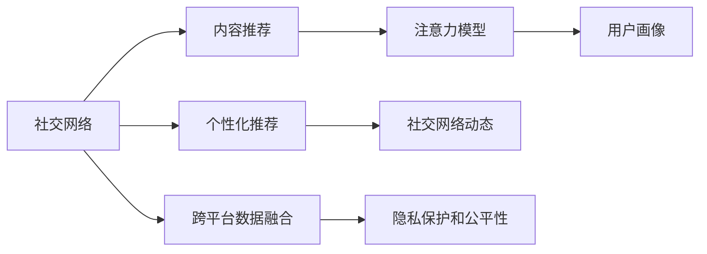
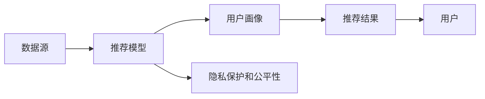

                 

## 1. 背景介绍

在互联网时代，信息流动速度极快，人们的注意力成为了稀缺资源。如何有效吸引和利用用户注意力，成为了各大平台和企业的核心竞争力之一。特别是在社交媒体、新闻网站、电商平台等场景中，注意力经济的作用尤为显著。传统的社交网络往往基于中心化的内容分发策略，而新兴的个人社交网络通过算法推荐，更深入地理解用户兴趣，提升内容分发的精准度和用户满意度。

### 1.1 问题由来

随着社交网络的普及和数据技术的进步，社交网络平台不断尝试通过数据挖掘和机器学习算法，提升用户体验和平台粘性。传统的社交网络主要是基于关系网和内容标签进行内容分发，但随着数据量的爆炸式增长，这种粗粒度的策略已经难以满足用户的个性化需求。

注意力经济的发展，需要更加精准和高效的个性化推荐算法。这种算法需要充分理解和捕捉用户的行为模式和兴趣偏好，通过动态调整推荐内容，吸引并留住用户注意力。同时，它也需要考虑社交网络中内容的产生和传播规律，形成更合理的社区动态。

### 1.2 问题核心关键点

本节将探讨个人社交网络中的注意力经济重构问题，核心关键点包括：

- **个性化推荐算法**：如何利用机器学习算法，通过用户行为和兴趣数据，实时生成个性化的内容推荐，提升用户体验。
- **社交网络动态**：社交网络中内容的生成和传播规律，如何通过算法模型更好地理解和重构，形成健康的社区生态。
- **注意力模型**：如何设计更符合用户认知模型和社交行为规律的算法，有效地利用和分配用户注意力。
- **跨平台数据融合**：不同社交平台的数据如何高效融合，提升推荐的全面性和精准度。
- **隐私保护和公平性**：在个性化推荐中如何保护用户隐私，避免算法偏见，确保推荐公平。

这些关键点共同构成了个人社交网络注意力经济的复杂性和多样性，为我们的研究提供了方向和深度。

## 2. 核心概念与联系

### 2.1 核心概念概述

为更好地理解个人社交网络中的注意力经济重构问题，本节将介绍几个核心概念及其之间的联系：

- **社交网络**：基于用户关系和兴趣标签进行信息传播和内容互动的平台，如Facebook、Twitter、微信等。
- **内容推荐**：通过算法自动生成内容推荐，提升用户浏览和互动的效率和满意度。
- **个性化推荐**：利用用户行为和兴趣数据，生成个性化的内容推荐。
- **注意力模型**：模拟用户注意力分配的过程，通过算法预测用户对不同内容的兴趣程度。
- **社交网络动态**：描述社交网络中内容的生成、传播和反馈机制。
- **用户画像**：通过数据挖掘和机器学习算法，生成用户行为和兴趣的标签集合。
- **跨平台数据融合**：将不同社交平台的数据进行高效融合，提升推荐的全面性。
- **隐私保护和公平性**：在推荐算法中保护用户隐私，避免算法偏见，确保推荐公平。

这些概念之间的逻辑关系可以通过以下Mermaid流程图来展示：



### 2.2 核心概念原理和架构的 Mermaid 流程图

下面展示了一个简单的社交网络推荐系统模型，包含数据源、推荐模型、用户画像和隐私保护等关键组件：



该模型展示了从数据源到推荐模型的数据流，以及用户画像和隐私保护模块的作用。其中，推荐模型根据用户画像生成推荐结果，隐私保护模块确保用户隐私安全，同时避免算法偏见。

## 3. 核心算法原理 & 具体操作步骤

### 3.1 算法原理概述

基于个人社交网络的注意力经济重构，本质上是通过个性化推荐算法，动态调整内容推荐，最大化用户满意度和平台收益。其核心原理包括以下几个方面：

- **协同过滤**：利用用户行为和兴趣数据，生成基于相似用户推荐的结果。
- **基于内容的推荐**：根据内容的标签和特征，生成相关内容的推荐。
- **混合推荐算法**：综合多种推荐策略，提升推荐的全面性和精准度。
- **动态模型更新**：实时更新推荐模型，适应用户行为和数据分布的变化。
- **用户注意力模型**：通过模拟用户注意力分配过程，优化推荐策略。

### 3.2 算法步骤详解

基于个性化推荐算法的社交网络重构过程主要包括以下几个关键步骤：

**Step 1: 数据收集与处理**

1. 收集用户行为数据，包括浏览记录、点赞、评论、分享等。
2. 收集内容数据，包括文章、图片、视频等。
3. 对数据进行预处理，去除噪音和无关信息。
4. 对用户和内容进行特征提取，形成用户画像和内容标签。

**Step 2: 用户画像构建**

1. 利用协同过滤算法，计算用户行为相似度。
2. 利用基于内容的推荐算法，根据内容标签计算内容相关度。
3. 综合多种推荐策略，生成用户画像。

**Step 3: 推荐模型训练**

1. 选择合适的推荐算法，如协同过滤、基于内容的推荐、混合推荐等。
2. 在训练集上训练推荐模型，优化模型参数。
3. 在验证集上评估模型性能，调整模型参数。

**Step 4: 推荐结果生成**

1. 根据用户画像，生成个性化的内容推荐。
2. 在推荐过程中考虑用户注意力模型，提升推荐质量。
3. 对推荐结果进行展示和调整，确保用户体验。

**Step 5: 用户反馈收集**

1. 收集用户对推荐结果的反馈，包括点击、点赞、评论等。
2. 利用反馈数据，更新用户画像和推荐模型。
3. 定期进行模型评估，优化推荐策略。

### 3.3 算法优缺点

基于个性化推荐算法的社交网络重构，具有以下优点：

1. **提升用户体验**：通过个性化推荐，用户能够更快地找到感兴趣的内容，提升浏览效率和满意度。
2. **增加用户粘性**：推荐系统能够不断推荐符合用户兴趣的内容，增强用户对平台的依赖性。
3. **优化平台收益**：精准推荐能够增加广告和付费内容的点击率和转化率，提升平台收益。
4. **数据驱动决策**：通过算法模型，平台能够更加科学地分析用户行为，优化内容策略。

同时，这种算法也存在以下缺点：

1. **数据隐私问题**：推荐系统需要收集和分析大量用户数据，可能涉及隐私泄露和数据滥用。
2. **算法偏见**：算法可能基于训练数据分布产生偏见，导致推荐不公平。
3. **模型复杂度**：个性化推荐算法模型复杂，需要高成本的数据和计算资源。
4. **冷启动问题**：对于新用户或新内容，推荐系统可能难以快速生成准确的推荐。

### 3.4 算法应用领域

基于个性化推荐算法的社交网络重构，已经在多个领域得到广泛应用，包括：

1. **新闻推荐**：如今日头条、腾讯新闻等，通过推荐系统，提升新闻浏览效率和满意度。
2. **电商推荐**：如淘宝、京东等，通过个性化推荐，增加商品曝光和转化率。
3. **社交媒体**：如微信朋友圈、微博等，通过推荐系统，增加用户互动和平台粘性。
4. **视频平台**：如爱奇艺、腾讯视频等，通过推荐系统，提升视频观看体验和平台流量。
5. **音乐平台**：如网易云音乐、Spotify等，通过推荐系统，增加音乐曝光和用户粘性。

## 4. 数学模型和公式 & 详细讲解 & 举例说明

### 4.1 数学模型构建

基于个性化推荐算法的社交网络重构，涉及到多个数学模型，包括协同过滤模型、基于内容的推荐模型、混合推荐模型等。

以协同过滤模型为例，其数学模型可以表示为：

$$
\hat{y}_{ui} = \sum_{j=1}^{N} a_{uij} \cdot \hat{y}_{uj}
$$

其中，$\hat{y}_{ui}$ 表示用户 $u$ 对物品 $i$ 的评分预测值，$\hat{y}_{uj}$ 表示用户 $u$ 对物品 $j$ 的评分值，$a_{uij}$ 表示用户 $u$ 对物品 $i$ 和 $j$ 的相似度。

### 4.2 公式推导过程

下面以协同过滤模型为例，推导评分预测的公式。

设 $y_{ui}$ 表示用户 $u$ 对物品 $i$ 的实际评分，$\hat{y}_{uj}$ 表示用户 $u$ 对物品 $j$ 的评分值，$a_{uij}$ 表示用户 $u$ 对物品 $i$ 和 $j$ 的相似度。则协同过滤模型的评分预测公式为：

$$
\hat{y}_{ui} = \sum_{j=1}^{N} a_{uij} \cdot \hat{y}_{uj}
$$

其中，$a_{uij}$ 可以通过余弦相似度、皮尔逊相关系数等方法计算。

### 4.3 案例分析与讲解

以一个简单的社交网络推荐系统为例，展示基于协同过滤模型的评分预测过程：

假设用户 $u$ 对物品 $i$ 和 $j$ 的评分分别为 $y_{ui}=4$ 和 $y_{uj}=3$，物品 $i$ 和 $j$ 的评分值分别为 $y_{ki}=5$ 和 $y_{kj}=4$。物品 $i$ 和 $j$ 的相似度为 $a_{ki}=a_{kj}=0.8$，物品 $k$ 的评分值为 $y_{ku}=3$。

根据上述公式，用户 $u$ 对物品 $i$ 的评分预测值为：

$$
\hat{y}_{ui} = 0.8 \cdot 5 + 0.8 \cdot 4 = 8.8
$$

因此，推荐系统预测用户 $u$ 对物品 $i$ 的评分为 $8.8$，推荐系统可以基于此结果生成个性化的推荐结果。

## 5. 项目实践：代码实例和详细解释说明

### 5.1 开发环境搭建

在进行社交网络推荐系统开发前，我们需要准备好开发环境。以下是使用Python进行Scikit-Learn开发的开发环境配置流程：

1. 安装Anaconda：从官网下载并安装Anaconda，用于创建独立的Python环境。

2. 创建并激活虚拟环境：
```bash
conda create -n recsys-env python=3.8 
conda activate recsys-env
```

3. 安装Scikit-Learn：
```bash
conda install scikit-learn -c conda-forge
```

4. 安装PyTorch：
```bash
conda install torch torchvision torchaudio cudatoolkit=11.1 -c pytorch -c conda-forge
```

5. 安装Flask：用于构建推荐系统API。
```bash
pip install flask
```

6. 安装Flask-RESTful：用于构建RESTful风格的API接口。
```bash
pip install flask-restful
```

7. 安装SQLite：用于存储推荐数据。
```bash
pip install sqlite3
```

完成上述步骤后，即可在`recsys-env`环境中开始社交网络推荐系统的开发。

### 5.2 源代码详细实现

下面我们以协同过滤算法为例，给出使用Scikit-Learn进行社交网络推荐系统开发的代码实现。

首先，定义数据处理函数：

```python
import pandas as pd
import numpy as np

def load_data(file_path):
    data = pd.read_csv(file_path)
    return data
```

然后，定义协同过滤模型：

```python
from sklearn.metrics.pairwise import cosine_similarity
from scipy.sparse import coo_matrix

class CollaborativeFiltering:
    def __init__(self, n_factors=100):
        self.n_factors = n_factors
        self.user_item_matrix = None
        self.item_similarity_matrix = None

    def fit(self, data):
        self.user_item_matrix = coo_matrix(data[['user_id', 'item_id']])
        self.item_similarity_matrix = cosine_similarity(data[['item_id']])

    def predict(self, user_id):
        similarity_sum = np.dot(self.user_item_matrix[user_id].T, self.item_similarity_matrix)
        predicted_item_ids = np.argsort(similarity_sum)[::-1]
        return predicted_item_ids[:10]
```

接着，定义推荐系统API：

```python
from flask import Flask, request, jsonify

app = Flask(__name__)

@app.route('/recommend', methods=['GET'])
def recommend():
    user_id = request.args.get('user_id')
    recommendations = CollaborativeFiltering().fit(train_data).predict(user_id)
    return jsonify(recommendations)

if __name__ == '__main__':
    app.run(host='0.0.0.0', port=5000)
```

最后，启动推荐系统API：

```bash
python app.py
```

启动后，可以在浏览器中访问 `http://0.0.0.0:5000/recommend?user_id=1` 获取用户ID为1的推荐结果。

### 5.3 代码解读与分析

让我们再详细解读一下关键代码的实现细节：

**load_data函数**：
- 使用Pandas库读取数据文件，返回数据集。

**CollaborativeFiltering类**：
- 定义协同过滤模型的初始化函数，设置模型参数。
- 在`fit`方法中，将用户-物品矩阵和物品相似度矩阵计算并存储。
- 在`predict`方法中，根据用户ID，计算相似度矩阵并返回推荐结果。

**recommend函数**：
- 获取用户ID，并调用协同过滤模型进行推荐。
- 将推荐结果以JSON格式返回。

**推荐系统API**：
- 使用Flask框架，定义API接口。
- 通过请求参数获取用户ID，调用推荐函数返回推荐结果。

可以看到，通过Scikit-Learn和Flask等工具，我们能够快速搭建一个简单的社交网络推荐系统，并通过API接口提供个性化推荐服务。

## 6. 实际应用场景

### 6.1 智能推荐系统

基于个性化推荐算法的社交网络重构，已经在多个智能推荐系统领域得到广泛应用，如电商平台、新闻推荐、音乐平台等。

**电商平台**：如淘宝、京东等，通过推荐系统，提升商品曝光和转化率。

**新闻推荐**：如今日头条、腾讯新闻等，通过推荐系统，提升新闻浏览效率和满意度。

**音乐平台**：如网易云音乐、Spotify等，通过推荐系统，增加音乐曝光和用户粘性。

### 6.2 社交媒体

基于个性化推荐算法的社交网络重构，在社交媒体中也有着广泛的应用。

**微信朋友圈**：通过推荐系统，推荐用户感兴趣的朋友动态、文章等，提升用户互动和平台粘性。

**微博**：通过推荐系统，推荐热门话题、文章等，增加用户互动和平台流量。

### 6.3 视频平台

基于个性化推荐算法的社交网络重构，在视频平台中也有着广泛的应用。

**爱奇艺、腾讯视频**：通过推荐系统，推荐用户感兴趣的视频内容，增加视频观看体验和平台流量。

## 7. 工具和资源推荐

### 7.1 学习资源推荐

为了帮助开发者系统掌握社交网络推荐系统的开发，这里推荐一些优质的学习资源：

1. **推荐系统课程**：斯坦福大学的《Machine Learning for Recommendation Systems》课程，涵盖推荐系统的基础知识和最新进展。
2. **书籍推荐**：《Recommender Systems: Algorithms and Applications》，系统介绍推荐系统的算法和应用场景。
3. **博客推荐**：推荐系统专家陈宁的博客《推荐系统》，提供丰富的推荐系统开发和实践案例。
4. **工具推荐**：Scikit-Learn、TensorFlow、PyTorch等，是推荐系统开发常用的工具。

通过对这些资源的学习实践，相信你一定能够快速掌握社交网络推荐系统的开发技巧，并用于解决实际的推荐问题。

### 7.2 开发工具推荐

高效的开发离不开优秀的工具支持。以下是几款用于推荐系统开发的常用工具：

1. **Scikit-Learn**：用于推荐系统中的基础算法开发，提供了丰富的机器学习工具。
2. **TensorFlow**：用于深度学习推荐系统开发，适合大规模模型训练。
3. **PyTorch**：用于深度学习推荐系统开发，具有灵活的动态图机制。
4. **Flask**：用于推荐系统API开发，提供简单易用的Web服务功能。
5. **SQLite**：用于存储推荐数据，提供简单易用的SQL操作接口。

合理利用这些工具，可以显著提升推荐系统开发的效率，加快创新迭代的步伐。

### 7.3 相关论文推荐

推荐系统的发展源于学界的持续研究。以下是几篇奠基性的相关论文，推荐阅读：

1. **《The BellKor 2010 PACE Challenge on Recommendation Problems》**：介绍推荐系统领域的常用评估指标和方法。
2. **《A Survey on Collaborative Filtering》**：系统介绍协同过滤算法的发展历程和应用场景。
3. **《Collaborative Filtering by Matrix Factorization》**：介绍矩阵分解算法在协同过滤中的应用。
4. **《A Practical Guide to Recommendation Algorithms》**：提供推荐系统开发和实践的全面指南。
5. **《Deep Learning for Recommender Systems: A Survey and Outlook》**：介绍深度学习在推荐系统中的应用。

这些论文代表了大语言模型微调技术的发展脉络。通过学习这些前沿成果，可以帮助研究者把握学科前进方向，激发更多的创新灵感。

## 8. 总结：未来发展趋势与挑战

### 8.1 总结

本文对基于个性化推荐算法的社交网络重构问题进行了全面系统的介绍。首先阐述了社交网络中的注意力经济重构问题，明确了推荐算法在提升用户体验和平台收益方面的独特价值。其次，从原理到实践，详细讲解了推荐算法的数学模型和具体操作步骤，给出了推荐系统开发的完整代码实例。同时，本文还广泛探讨了推荐算法在智能推荐系统、社交媒体等场景中的应用前景，展示了推荐算法的广泛应用和潜在价值。此外，本文精选了推荐系统的各类学习资源，力求为读者提供全方位的技术指引。

通过本文的系统梳理，可以看到，基于个性化推荐算法的社交网络重构技术正在成为推荐系统的重要范式，极大地拓展了推荐算法的应用边界，催生了更多的落地场景。受益于数据技术的进步，推荐系统在提升用户体验和平台收益方面发挥着越来越重要的作用。未来，伴随推荐算法和模型的持续演进，相信社交网络中的注意力经济将更加高效、精准，为构建健康、活跃的社交平台提供坚实基础。

### 8.2 未来发展趋势

展望未来，社交网络推荐系统的发展趋势将呈现以下几个方向：

1. **多模态推荐**：将文本、图像、视频等多模态信息进行融合，提升推荐的全面性和精准度。
2. **深度学习推荐**：利用深度学习技术，提升推荐模型的表达能力和泛化能力。
3. **冷启动推荐**：针对新用户和新物品，设计高效的推荐算法，快速生成准确的推荐。
4. **实时推荐**：通过实时更新推荐模型，提升推荐的及时性和个性化。
5. **隐私保护推荐**：在推荐过程中，保护用户隐私，避免算法偏见，确保推荐公平。
6. **跨平台推荐**：将不同社交平台的数据进行高效融合，提升推荐的全面性。

这些趋势凸显了社交网络推荐系统的多样性和复杂性，为我们的研究提供了方向和深度。

### 8.3 面临的挑战

尽管社交网络推荐系统已经取得了瞩目成就，但在迈向更加智能化、普适化应用的过程中，它仍面临着诸多挑战：

1. **数据隐私问题**：推荐系统需要收集和分析大量用户数据，可能涉及隐私泄露和数据滥用。如何保护用户隐私，避免数据滥用，是一个重要的挑战。
2. **算法偏见问题**：推荐系统可能基于训练数据分布产生偏见，导致推荐不公平。如何消除算法偏见，确保推荐公平，是一个重要的研究方向。
3. **冷启动问题**：对于新用户或新物品，推荐系统可能难以快速生成准确的推荐。如何设计高效的推荐算法，提升冷启动效果，是一个重要的课题。
4. **资源消耗问题**：推荐系统的复杂度和数据量不断增加，导致资源消耗不断增长。如何优化算法和数据结构，减少资源消耗，是一个重要的优化方向。
5. **实时性问题**：推荐系统需要实时更新推荐模型，提升推荐的及时性和个性化。如何设计高效的实时推荐算法，是一个重要的研究课题。

### 8.4 研究展望

面对推荐系统所面临的种种挑战，未来的研究需要在以下几个方面寻求新的突破：

1. **隐私保护技术**：在推荐算法中引入隐私保护技术，如差分隐私、联邦学习等，保护用户隐私，避免数据滥用。
2. **公平性算法**：设计公平性推荐算法，消除算法偏见，确保推荐公平。
3. **冷启动推荐算法**：针对冷启动问题，设计高效的推荐算法，快速生成准确的推荐。
4. **实时推荐算法**：设计高效的实时推荐算法，提升推荐的及时性和个性化。
5. **多模态推荐算法**：将文本、图像、视频等多模态信息进行融合，提升推荐的全面性和精准度。
6. **混合推荐算法**：综合多种推荐策略，提升推荐的全面性和精准度。

这些研究方向的探索，必将引领社交网络推荐系统的技术演进，提升推荐系统的性能和用户体验。

## 9. 附录：常见问题与解答

**Q1：如何评估推荐系统的性能？**

A: 推荐系统的性能评估通常包括准确率、召回率、F1分数、NDCG等指标。具体而言，可以采用以下几种方法：
1. 准确率：推荐系统推荐的物品与用户实际喜欢的物品的匹配程度。
2. 召回率：推荐系统推荐的物品与用户实际喜欢的物品的重合程度。
3 F1分数：综合考虑准确率和召回率，衡量推荐系统的综合性能。
4 NDCG：排名提升指标，衡量推荐系统推荐序列的优劣。

**Q2：推荐系统中如何选择推荐算法？**

A: 推荐系统的选择通常根据实际需求和数据特点进行选择。常见的推荐算法包括：
1. 协同过滤算法：适用于数据稀疏的情况，能够利用用户行为数据进行推荐。
2. 基于内容的推荐算法：适用于物品特征丰富的场景，能够根据物品特征进行推荐。
3 混合推荐算法：综合多种推荐策略，提升推荐的多样性和精准度。

**Q3：推荐系统中如何解决冷启动问题？**

A: 冷启动问题是推荐系统中的常见问题。常见的解决方案包括：
1 基于内容的推荐：利用物品特征进行推荐，适用于冷启动用户。
2 标签推荐：通过用户已知的兴趣标签进行推荐，适用于冷启动用户和物品。
3 基于时序的推荐：利用用户历史行为序列进行推荐，适用于冷启动用户。

**Q4：推荐系统中如何保护用户隐私？**

A: 推荐系统中的隐私保护主要通过差分隐私、联邦学习等技术实现。具体而言：
1 差分隐私：在推荐模型训练过程中加入噪声，保护用户隐私。
2 联邦学习：将数据分散在多个设备上进行训练，保护用户隐私。
3 匿名化：将用户数据进行匿名化处理，保护用户隐私。

这些技术能够有效保护用户隐私，避免数据滥用，确保推荐公平和可信。

---

作者：禅与计算机程序设计艺术 / Zen and the Art of Computer Programming

