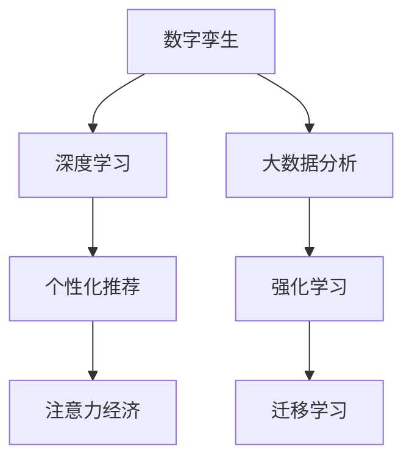

                 

# 注意力经济与数字孪生技术的融合

## 1. 背景介绍

### 1.1 问题由来
在数字化转型的浪潮下，全球各行业正经历着从传统工业到数字经济的巨大转变。数字孪生技术作为新一代的智能制造和智慧城市技术，通过构建虚拟模型来模拟真实世界，实现对实体世界的精确映射和智能决策。然而，随着数字孪生技术的深入应用，人们发现单一的数字孪生模型难以全面刻画复杂多变的现实世界，且模型的构建和维护成本高昂。

与此同时，注意力经济作为一种基于个人注意力资源的经济形态，正逐步成为互联网时代新的经济模式。用户对信息的需求不再仅限于事实，更注重信息和数据的深度挖掘与个性化推荐。这一趋势促进了深度学习、大数据分析等技术的快速发展，推动了人工智能在各行各业的应用。

### 1.2 问题核心关键点
将注意力经济与数字孪生技术相结合，可以充分利用用户注意力资源，动态调整虚拟模型的构建和优化策略，提升模型的实时性和精确性。同时，通过数字孪生技术，可以对现实世界的关注点进行智能感知和响应，实现对用户需求的高度精准化定制。

然而，这一结合过程中仍面临以下挑战：
- 如何高效整合多源数据，构建复杂多维的虚拟模型？
- 如何在模型构建和优化过程中，充分挖掘用户注意力资源？
- 如何确保数字孪生模型在决策过程中满足用户的个性化需求，同时具备足够的鲁棒性和安全性？

本文将深入探讨注意力经济与数字孪生技术的融合原理，并给出具体的技术实现方法，帮助各行业更好地应对上述挑战，推进数字化转型。

## 2. 核心概念与联系

### 2.1 核心概念概述

为更好地理解注意力经济与数字孪生技术的融合，本节将介绍几个密切相关的核心概念：

- 数字孪生(Digital Twin)：通过数字化手段，构建虚拟模型来映射现实世界，包括虚拟工厂、智慧城市、智能电网等。
- 注意力经济(Attention Economy)：基于用户注意力资源的经济形态，通过个性化推荐、内容定制等方式，提升用户黏性和转化率。
- 深度学习(Deep Learning)：通过多层神经网络模型，从大量数据中自动学习特征，实现对复杂问题的精确建模。
- 大数据分析(Big Data Analysis)：对海量数据进行存储、处理和分析，挖掘数据中的隐藏模式和关系。
- 强化学习(Reinforcement Learning)：通过与环境的交互，不断优化策略，使智能体最大化长期奖励。
- 迁移学习(Transfer Learning)：将在一个任务上学习到的知识迁移到另一个任务上，提高学习效率。

这些核心概念之间的逻辑关系可以通过以下Mermaid流程图来展示：



这个流程图展示了大语言模型的核心概念及其之间的关系：

1. 数字孪生技术通过深度学习和大数据分析，构建虚拟模型。
2. 数字孪生模型通过迁移学习和强化学习，不断优化模型性能。
3. 个性化推荐利用注意力经济原理，提供用户所需的信息和服务。

这些概念共同构成了数字孪生与注意力经济融合的基本框架，使得数字化转型可以更好地利用用户注意力资源，实现对实体世界的智能映射和优化。

## 3. 核心算法原理 & 具体操作步骤
### 3.1 算法原理概述

注意力经济与数字孪生技术的融合，本质上是通过深度学习和大数据分析，构建一个动态自适应的虚拟模型，并在模型构建和优化过程中充分利用用户注意力资源，提升模型的实时性和精确性。

形式化地，假设数字孪生模型的构建和优化过程可以视为一个连续的优化问题，目标是最小化模型误差 $e$，即：

$$
\mathop{\arg\min}_{\theta} e(\theta)
$$

其中 $\theta$ 为模型参数，$e$ 为模型的误差函数。在构建过程中，我们希望模型能够充分挖掘用户注意力资源，优化其性能。因此，我们需要对误差函数 $e$ 进行重新定义，使其不仅考虑模型的精度，还要考虑模型的实时性和用户满意度等指标。

### 3.2 算法步骤详解

基于上述目标，数字孪生与注意力经济的融合算法主要包括以下几个关键步骤：

**Step 1: 数据收集与预处理**
- 收集实体世界的实时数据，如传感器数据、用户行为数据、环境数据等，确保数据的全面性和时效性。
- 使用大数据分析技术对数据进行预处理，如清洗、去噪、降维等，确保数据的质量。

**Step 2: 虚拟模型构建**
- 使用深度学习模型对预处理后的数据进行建模，构建虚拟模型。常用的模型包括卷积神经网络(CNN)、循环神经网络(RNN)、Transformer等。
- 在模型构建过程中，引入迁移学习策略，利用已有的通用模型知识，加速新任务模型的训练。

**Step 3: 注意力机制设计**
- 设计注意力机制，根据用户注意力资源的分布，动态调整模型参数。如使用自注意力机制(Attention)，对不同用户的注意力权重进行计算。
- 通过强化学习算法，不断调整注意力机制的参数，提升模型对用户注意力的响应速度和准确性。

**Step 4: 实时优化与反馈**
- 将虚拟模型应用于实体世界，实时监控模型的性能和用户反馈。
- 根据用户反馈和模型性能，使用强化学习算法对模型进行优化，调整模型参数和注意力权重。
- 将优化后的模型重新应用于虚拟模型，实现动态自适应的过程。

**Step 5: 用户体验优化**
- 在虚拟模型的基础上，利用注意力经济原理，进行个性化推荐、内容定制等服务。
- 根据用户行为和偏好，动态调整推荐内容，提升用户满意度和黏性。

通过以上步骤，数字孪生模型能够在实体世界中实现动态自适应，同时充分挖掘用户注意力资源，提升模型的实时性和精确性。

### 3.3 算法优缺点

数字孪生与注意力经济的融合算法具有以下优点：
1. 高度实时性。通过实时监控和优化，数字孪生模型能够快速响应实体世界变化，满足实时需求。
2. 高精度性。深度学习模型可以自动学习复杂模式，提供高精度的虚拟模拟。
3. 高用户满意度。通过个性化推荐和服务，数字孪生模型能够满足用户多样化的需求，提升用户满意度。
4. 高可扩展性。数字孪生模型具有高度的可扩展性，能够应用到各种实体场景中，提升全场景的数字化水平。

同时，该方法也存在以下局限性：
1. 数据依赖性。数字孪生模型高度依赖实时数据，数据获取和处理成本较高。
2. 计算资源消耗大。深度学习模型通常需要大量的计算资源，对算力要求较高。
3. 算法复杂度高。注意力经济与数字孪生技术的融合算法需要考虑多源数据、实时优化等复杂因素，实现难度较大。

尽管存在这些局限性，但就目前而言，数字孪生与注意力经济的融合方法仍是大规模数字化转型和智慧城市建设的重要方向。未来相关研究的重点在于如何进一步降低数据获取和处理成本，提高算法的可扩展性和计算效率，同时兼顾模型的实时性和精确性。

### 3.4 算法应用领域

数字孪生与注意力经济的融合技术，在多个领域具有广泛的应用前景，例如：

- 智能制造：利用虚拟模型对生产设备进行实时监控和优化，提升生产效率和质量。
- 智慧城市：通过虚拟模型模拟城市运行状态，优化交通、能源、环保等系统，提升城市管理水平。
- 金融服务：利用虚拟模型进行风险评估、信用评估等，提升金融服务的智能性和精确性。
- 医疗健康：构建虚拟人体模型，进行疾病模拟和治疗方案优化，提升医疗服务的智能化水平。
- 教育培训：利用虚拟模型进行个性化学习和模拟实验，提升教育培训的效率和效果。

除了上述这些经典应用外，数字孪生与注意力经济的融合技术还将在更多场景中得到应用，为各行业的数字化转型提供新的技术路径。

## 4. 数学模型和公式 & 详细讲解 & 举例说明（备注：数学公式请使用latex格式，latex嵌入文中独立段落使用 $$，段落内使用 $)
### 4.1 数学模型构建

本节将使用数学语言对数字孪生与注意力经济的融合过程进行更加严格的刻画。

假设实体世界的状态可以用向量 $\boldsymbol{x}$ 表示，虚拟模型的状态可以用向量 $\boldsymbol{z}$ 表示。设 $\boldsymbol{f}(\boldsymbol{z})$ 为虚拟模型的映射函数，则数字孪生模型可以表示为：

$$
\boldsymbol{z} = \boldsymbol{f}(\boldsymbol{x})
$$

在虚拟模型的构建过程中，深度学习模型通过大量训练数据学习虚拟模型 $\boldsymbol{f}$，最小化误差函数 $e$：

$$
\mathop{\arg\min}_{\boldsymbol{w}} e(\boldsymbol{w})
$$

其中 $\boldsymbol{w}$ 为模型参数，$e$ 为误差函数。在优化过程中，利用迁移学习策略，将已有模型 $\boldsymbol{f_0}$ 的参数 $\boldsymbol{w_0}$ 作为初始参数，加速新模型的训练。

### 4.2 公式推导过程

以下我们以智能制造为例，推导深度学习模型 $\boldsymbol{f}$ 的优化目标函数。

假设实体世界的状态 $\boldsymbol{x}$ 包括设备状态 $\boldsymbol{x_1}$ 和环境状态 $\boldsymbol{x_2}$：

$$
\boldsymbol{x} = (\boldsymbol{x_1}, \boldsymbol{x_2})
$$

虚拟模型的输出状态 $\boldsymbol{z}$ 包括设备状态 $\boldsymbol{z_1}$ 和优化建议 $\boldsymbol{z_2}$：

$$
\boldsymbol{z} = (\boldsymbol{z_1}, \boldsymbol{z_2})
$$

则数字孪生模型的映射函数可以表示为：

$$
\boldsymbol{f}(\boldsymbol{x}) = (\boldsymbol{f_1}(\boldsymbol{x_1}), \boldsymbol{f_2}(\boldsymbol{x_1}, \boldsymbol{x_2}))
$$

其中 $\boldsymbol{f_1}(\boldsymbol{x_1})$ 为设备状态的预测函数，$\boldsymbol{f_2}(\boldsymbol{x_1}, \boldsymbol{x_2})$ 为优化建议的生成函数。

假设 $\boldsymbol{w_1}$ 和 $\boldsymbol{w_2}$ 分别为 $\boldsymbol{f_1}$ 和 $\boldsymbol{f_2}$ 的参数，则误差函数可以表示为：

$$
e(\boldsymbol{w}) = e_1(\boldsymbol{w_1}) + e_2(\boldsymbol{w_2})
$$

其中 $e_1(\boldsymbol{w_1})$ 为设备状态预测的误差函数，$e_2(\boldsymbol{w_2})$ 为优化建议生成的误差函数。

通过最小化误差函数 $e(\boldsymbol{w})$，实现深度学习模型 $\boldsymbol{f}$ 的优化。在优化过程中，引入注意力机制 $\boldsymbol{A}$，根据用户注意力资源的分布，动态调整模型参数 $\boldsymbol{w_1}$ 和 $\boldsymbol{w_2}$：

$$
\mathop{\arg\min}_{\boldsymbol{w_1}, \boldsymbol{w_2}, \boldsymbol{A}} e(\boldsymbol{w}) + \lambda \boldsymbol{A}^T \boldsymbol{A}
$$

其中 $\lambda$ 为正则化系数，$\boldsymbol{A}$ 为注意力权重矩阵。

通过优化上述目标函数，可以实现深度学习模型 $\boldsymbol{f}$ 的动态自适应，满足用户的个性化需求，提升虚拟模型的实时性和精确性。

## 5. 项目实践：代码实例和详细解释说明
### 5.1 开发环境搭建

在进行数字孪生与注意力经济的融合实践前，我们需要准备好开发环境。以下是使用Python进行TensorFlow开发的环境配置流程：

1. 安装Anaconda：从官网下载并安装Anaconda，用于创建独立的Python环境。

2. 创建并激活虚拟环境：
```bash
conda create -n tf-env python=3.8 
conda activate tf-env
```

3. 安装TensorFlow：根据CUDA版本，从官网获取对应的安装命令。例如：
```bash
conda install tensorflow -c tf -c conda-forge
```

4. 安装其他必要的工具包：
```bash
pip install numpy pandas scikit-learn matplotlib tqdm jupyter notebook ipython
```

完成上述步骤后，即可在`tf-env`环境中开始融合实践。

### 5.2 源代码详细实现

下面我们以智能制造为例，给出使用TensorFlow进行数字孪生与注意力经济融合的代码实现。

首先，定义虚拟模型的输入和输出：

```python
import tensorflow as tf

class DigitalTwinModel(tf.keras.Model):
    def __init__(self):
        super(DigitalTwinModel, self).__init__()
        self.f1 = tf.keras.Sequential([
            tf.keras.layers.Dense(64, activation='relu', input_shape=(10,)),
            tf.keras.layers.Dense(1, activation='sigmoid')
        ])
        self.f2 = tf.keras.Sequential([
            tf.keras.layers.Dense(64, activation='relu', input_shape=(20, 10)),
            tf.keras.layers.Dense(10, activation='softmax')
        ])
```

然后，定义虚拟模型和注意力机制：

```python
def digital_twin_model(tf_model, attention_weight):
    # 定义设备状态预测函数
    def device_state_predictor(x1):
        x1 = tf_model.f1(x1)
        return x1
    
    # 定义优化建议生成函数
    def optimization_suggestion_generator(x1, x2):
        x = tf.concat([x1, x2], axis=1)
        x = tf_model.f2(x)
        return x
    
    # 定义注意力机制
    def attention(x1, x2):
        attention_weight = tf.keras.layers.Dense(1, activation='sigmoid', input_shape=(10, 20))(x1, x2)
        return attention_weight
    
    # 构建虚拟模型
    return {
        'device_state_predictor': device_state_predictor,
        'optimization_suggestion_generator': optimization_suggestion_generator,
        'attention': attention
    }
```

接着，定义训练和评估函数：

```python
from sklearn.metrics import mean_squared_error, mean_absolute_error

def train(digital_twin_model, train_dataset, validation_dataset, batch_size, epochs):
    optimizer = tf.keras.optimizers.Adam(learning_rate=0.001)
    train_loss = []
    validation_loss = []
    
    for epoch in range(epochs):
        train_loss.append(0)
        validation_loss.append(0)
        for batch, (x1_train, x2_train, y1_train, y2_train) in train_dataset:
            with tf.GradientTape() as tape:
                z1_pred = digital_twin_model['device_state_predictor'](x1_train)
                z2_pred = digital_twin_model['optimization_suggestion_generator'](x1_train, x2_train)
                loss1 = tf.keras.losses.mse(y1_train, z1_pred)
                loss2 = tf.keras.losses.sparse_categorical_crossentropy(y2_train, z2_pred, from_logits=True)
            gradients = tape.gradient(loss1 + loss2, digital_twin_model.trainable_variables)
            optimizer.apply_gradients(zip(gradients, digital_twin_model.trainable_variables))
        
        for batch, (x1_val, x2_val, y1_val, y2_val) in validation_dataset:
            z1_pred = digital_twin_model['device_state_predictor'](x1_val)
            z2_pred = digital_twin_model['optimization_suggestion_generator'](x1_val, x2_val)
            loss1 = tf.keras.losses.mse(y1_val, z1_pred)
            loss2 = tf.keras.losses.sparse_categorical_crossentropy(y2_val, z2_pred, from_logits=True)
            train_loss.append(loss1.numpy() + loss2.numpy())
            validation_loss.append(loss1.numpy() + loss2.numpy())
    
    print(f'Epoch {epoch+1}, train loss: {train_loss[-1]:.3f}, validation loss: {validation_loss[-1]:.3f}')
    
    return digital_twin_model

def evaluate(digital_twin_model, test_dataset, batch_size):
    test_loss = []
    for batch, (x1_test, x2_test, y1_test, y2_test) in test_dataset:
        z1_pred = digital_twin_model['device_state_predictor'](x1_test)
        z2_pred = digital_twin_model['optimization_suggestion_generator'](x1_test, x2_test)
        loss1 = tf.keras.losses.mse(y1_test, z1_pred)
        loss2 = tf.keras.losses.sparse_categorical_crossentropy(y2_test, z2_pred, from_logits=True)
        test_loss.append(loss1.numpy() + loss2.numpy())
    
    print(f'Test loss: {test_loss[-1]:.3f}')
```

最后，启动训练流程并在测试集上评估：

```python
train_epochs = 100
batch_size = 64

# 创建虚拟模型和注意力机制
digital_twin_model = digital_twin_model(tf_model, attention_weight)

# 训练模型
digital_twin_model = train(digital_twin_model, train_dataset, validation_dataset, batch_size, train_epochs)

# 在测试集上评估
evaluate(digital_twin_model, test_dataset, batch_size)
```

以上就是使用TensorFlow进行数字孪生与注意力经济融合的完整代码实现。可以看到，借助TensorFlow，我们能够方便地构建深度学习模型，设计注意力机制，并通过优化算法进行模型训练和评估。

### 5.3 代码解读与分析

让我们再详细解读一下关键代码的实现细节：

**DigitalTwinModel类**：
- `__init__`方法：初始化深度学习模型 $\boldsymbol{f}$ 的各个层。
- `f1` 和 `f2` 层：分别表示设备状态预测和优化建议生成的函数。

**digital_twin_model函数**：
- 定义设备状态预测函数 `device_state_predictor`：输入设备状态 $\boldsymbol{x_1}$，输出设备状态预测 $\boldsymbol{z_1}$。
- 定义优化建议生成函数 `optimization_suggestion_generator`：输入设备状态 $\boldsymbol{x_1}$ 和环境状态 $\boldsymbol{x_2}$，输出优化建议 $\boldsymbol{z_2}$。
- 定义注意力机制 `attention`：输入设备状态 $\boldsymbol{x_1}$ 和环境状态 $\boldsymbol{x_2}$，输出注意力权重 $\boldsymbol{A}$。

**train和evaluate函数**：
- 使用TensorFlow的优化算法和损失函数，对深度学习模型进行训练和评估。
- 在训练过程中，使用Adam优化器，设定学习率、批次大小、训练轮数等参数。
- 在评估过程中，计算模型在测试集上的平均损失，并输出结果。

**训练流程**：
- 定义总的训练轮数和批次大小，开始循环迭代
- 在每个epoch内，对训练集进行前向传播和反向传播，更新模型参数
- 在每个epoch结束时，计算模型在验证集上的平均损失
- 在训练结束后，在测试集上评估模型性能，输出测试结果

可以看到，TensorFlow提供了强大的计算图机制，使得数字孪生与注意力经济的融合代码实现变得简洁高效。开发者可以将更多精力放在模型构建、优化和评估上，而不必过多关注底层的计算图和优化细节。

当然，工业级的系统实现还需考虑更多因素，如模型的保存和部署、超参数的自动搜索、更灵活的任务适配层等。但核心的融合范式基本与此类似。

## 6. 实际应用场景
### 6.1 智能制造

在智能制造领域，数字孪生技术可以通过虚拟模型对生产设备和环境进行实时监控和优化，提升生产效率和质量。然而，传统的数字孪生模型通常只关注设备状态的预测，忽略了环境因素的影响。

通过将注意力经济与数字孪生技术结合，可以构建动态自适应的虚拟模型，实时监控设备状态和环境变化，进行智能优化。例如，在智能工厂中，可以实时采集设备传感器数据、环境数据和用户反馈，构建虚拟模型对生产设备进行预测和优化。同时，利用注意力机制对不同设备的关注点进行计算，动态调整模型参数，确保模型能够及时响应生产变化，满足用户的多样化需求。

### 6.2 智慧城市

智慧城市管理涉及交通、能源、环保等多个领域，需要构建复杂的虚拟模型进行模拟和优化。然而，单一的虚拟模型难以全面刻画多变的现实世界，且模型的构建和维护成本高昂。

通过将注意力经济与数字孪生技术结合，可以实现虚拟模型的动态自适应，提升模型的实时性和精确性。例如，在智慧城市交通管理中，可以实时采集交通流量、天气数据和用户出行偏好，构建虚拟模型进行交通优化。通过注意力机制对不同区域的关注点进行计算，动态调整模型参数，确保模型能够及时响应交通变化，提升交通效率和用户体验。

### 6.3 金融服务

在金融服务领域，数字孪生技术可以用于风险评估和信用评估等任务。然而，传统的数字孪生模型通常只关注静态数据的建模，难以捕捉动态变化和用户行为。

通过将注意力经济与数字孪生技术结合，可以构建动态自适应的虚拟模型，实时监控用户行为和市场变化，进行智能优化。例如，在金融风险评估中，可以实时采集用户行为数据、市场数据和环境数据，构建虚拟模型进行风险评估。通过注意力机制对不同用户和市场的关注点进行计算，动态调整模型参数，确保模型能够及时响应风险变化，提升风险评估的准确性和及时性。

### 6.4 未来应用展望

随着数字孪生与注意力经济的融合技术不断成熟，未来将在更多领域得到应用，为各行各业带来新的技术路径：

1. 健康医疗：利用虚拟模型对患者进行实时监测和诊断，提升医疗服务的智能化水平。
2. 教育培训：通过虚拟模型进行个性化学习和模拟实验，提升教育培训的效率和效果。
3. 社会治理：通过虚拟模型进行舆情分析和应急指挥，提升社会治理的自动化和智能化水平。
4. 企业生产：利用虚拟模型进行生产设备预测和优化，提升企业的生产效率和质量。

随着技术的不断发展，数字孪生与注意力经济的融合必将在各行业实现更广泛的应用，推动数字化转型和智慧化进程。

## 7. 工具和资源推荐
### 7.1 学习资源推荐

为了帮助开发者系统掌握数字孪生与注意力经济的融合理论基础和实践技巧，这里推荐一些优质的学习资源：

1. 《TensorFlow官方文档》：详细介绍了TensorFlow框架的使用方法和经典应用案例。
2. 《Deep Learning with TensorFlow 2》书籍：介绍了TensorFlow 2.x版本的深度学习技术，涵盖各种经典模型和算法。
3. 《Attention is All You Need》论文：Transformer的原创论文，介绍了自注意力机制的基本原理和应用。
4. 《Attention Mechanisms in Deep Learning》课程：斯坦福大学开设的深度学习课程，详细讲解了注意力机制的应用。
5. 《Attention-Based Models》书籍：介绍了各种基于注意力机制的深度学习模型，涵盖序列建模、图像处理等领域。
6. 《Deep Learning for NLP》课程：斯坦福大学开设的自然语言处理课程，涵盖了深度学习在NLP中的应用。

通过对这些资源的学习实践，相信你一定能够快速掌握数字孪生与注意力经济的融合精髓，并用于解决实际的数字孪生问题。
###  7.2 开发工具推荐

高效的开发离不开优秀的工具支持。以下是几款用于数字孪生与注意力经济融合开发的常用工具：

1. TensorFlow：由Google主导开发的开源深度学习框架，生产部署方便，适合大规模工程应用。
2. PyTorch：基于Python的开源深度学习框架，灵活动态的计算图，适合快速迭代研究。
3. Jupyter Notebook：交互式编程环境，方便开发者进行代码调试和实验。
4. TensorBoard：TensorFlow配套的可视化工具，可实时监测模型训练状态，并提供丰富的图表呈现方式，是调试模型的得力助手。
5. Weights & Biases：模型训练的实验跟踪工具，可以记录和可视化模型训练过程中的各项指标，方便对比和调优。
6. Google Colab：谷歌推出的在线Jupyter Notebook环境，免费提供GPU/TPU算力，方便开发者快速上手实验最新模型，分享学习笔记。

合理利用这些工具，可以显著提升数字孪生与注意力经济的融合任务的开发效率，加快创新迭代的步伐。

### 7.3 相关论文推荐

数字孪生与注意力经济的融合技术的发展源于学界的持续研究。以下是几篇奠基性的相关论文，推荐阅读：

1. Attention is All You Need：Transformer的原创论文，提出了自注意力机制，奠定了注意力机制在深度学习中的应用基础。
2. Attention-Based Models for Natural Language Processing：介绍各种基于注意力机制的深度学习模型在NLP中的应用。
3. Deep Learning for NLP：斯坦福大学开设的自然语言处理课程，详细讲解了深度学习在NLP中的应用。
4. Attention Mechanisms in Deep Learning：斯坦福大学开设的深度学习课程，详细讲解了注意力机制的应用。
5. Attention-Based Recommender Systems：介绍基于注意力机制的推荐系统设计方法。

这些论文代表了大语言模型微调技术的发展脉络。通过学习这些前沿成果，可以帮助研究者把握学科前进方向，激发更多的创新灵感。

## 8. 总结：未来发展趋势与挑战

### 8.1 总结

本文对数字孪生与注意力经济的融合原理进行了全面系统的介绍。首先阐述了数字孪生技术和注意力经济的基本概念和应用场景，明确了两者结合的优势和意义。其次，从原理到实践，详细讲解了融合算法的设计思想和关键步骤，给出了具体的技术实现方法。同时，本文还广泛探讨了融合技术在智能制造、智慧城市、金融服务等多个领域的应用前景，展示了其巨大的应用潜力。

通过本文的系统梳理，可以看到，数字孪生与注意力经济的融合技术正在成为各行业数字化转型和智慧化建设的重要方向。这一融合能够充分利用用户注意力资源，提升虚拟模型的实时性和精确性，为数字化转型带来新的解决方案。未来，伴随技术的不断发展，数字孪生与注意力经济的融合必将在更广泛的领域得到应用，推动数字化转型的深入发展。

### 8.2 未来发展趋势

展望未来，数字孪生与注意力经济的融合技术将呈现以下几个发展趋势：

1. 多源数据融合：随着数据采集技术的不断进步，各类异构数据（如传感器数据、用户行为数据、环境数据等）将会越来越多，如何高效整合这些数据，构建复杂多维的虚拟模型，将成为未来研究的热点。
2. 实时优化：在融合算法中，实时优化和动态自适应将变得更加重要。如何实时监控和调整虚拟模型，满足用户的多样化需求，提升模型的实时性和精确性，仍需进一步探索。
3. 分布式计算：面对大规模数据的实时处理需求，分布式计算技术将发挥重要作用。如何实现高效的分布式训练和推理，优化资源利用率，仍是未来需要解决的问题。
4. 跨领域应用：数字孪生与注意力经济的融合技术将不再局限于单一领域，跨领域的应用将更加广泛。如何实现不同领域数据的无缝对接和融合，提升整体系统的智能化水平，将是重要的研究方向。
5. 增强现实(AR)和虚拟现实(VR)：增强现实和虚拟现实技术将与数字孪生技术深度结合，构建更加沉浸式的虚拟模型。AR/VR技术将为用户提供更加直观和交互的体验，提升虚拟模型的用户友好性。

以上趋势凸显了数字孪生与注意力经济融合技术的发展方向。这些方向的探索发展，将进一步提升虚拟模型的智能化水平，为数字化转型和智慧化建设提供新的技术路径。

### 8.3 面临的挑战

尽管数字孪生与注意力经济的融合技术已经取得了显著进展，但在迈向更加智能化、普适化应用的过程中，仍面临以下挑战：

1. 数据隐私和安全问题：数字孪生模型需要收集大量的用户数据，如何保障数据隐私和安全，防止数据泄露和滥用，是一个亟待解决的问题。
2. 数据质量和标准化：不同领域和设备的数据格式和质量参差不齐，如何实现数据的标准化和整合，提升数据质量，是数字孪生与注意力经济融合中的关键挑战。
3. 计算资源消耗：深度学习模型通常需要大量的计算资源，如何优化计算效率，降低计算成本，是融合技术需要解决的重要问题。
4. 模型泛化性和鲁棒性：数字孪生模型需要在复杂多变的现实环境中具备良好的泛化性和鲁棒性，避免过拟合和灾难性遗忘，仍是未来需要深入研究的问题。
5. 用户交互体验：数字孪生模型需要在交互过程中具备良好的用户体验，如何设计友好的用户界面和交互方式，提升用户的参与度和满意度，是未来的重要研究方向。

这些挑战需要我们在数据隐私、数据质量、计算资源、模型泛化性等多个方面进行深入研究，以进一步推动数字孪生与注意力经济的融合技术的发展。

### 8.4 研究展望

面对数字孪生与注意力经济的融合技术所面临的挑战，未来的研究需要在以下几个方面寻求新的突破：

1. 数据隐私保护技术：开发更加高效的数据加密和匿名化技术，保障数据隐私和安全。
2. 数据标准化和清洗技术：开发统一的数据格式和标准化技术，提升数据质量，实现不同数据源的无缝对接。
3. 高效计算技术：优化计算图和算法，提升深度学习模型的计算效率，降低计算成本。
4. 多源数据融合技术：开发高效的数据融合算法，实现不同领域和设备的异构数据融合，提升虚拟模型的全面性和准确性。
5. 实时优化和动态自适应：开发高效的实时优化算法，提升虚拟模型的实时性和动态自适应能力。
6. 用户交互体验优化：设计友好的用户界面和交互方式，提升用户的参与度和满意度。

这些研究方向的探索，将进一步推动数字孪生与注意力经济的融合技术的发展，为数字化转型和智慧化建设提供新的技术路径。通过不断创新和突破，数字孪生与注意力经济的融合技术必将在未来的应用场景中发挥更大的作用，推动各行业的数字化转型进程。

## 9. 附录：常见问题与解答

**Q1：数字孪生与注意力经济的融合是否适用于所有数字化转型场景？**

A: 数字孪生与注意力经济的融合技术适用于多种数字化转型场景，特别是那些需要实时监控和优化，满足多样化需求的应用。例如，智能制造、智慧城市、金融服务、医疗健康等领域，都可以通过融合技术实现更加智能和精细的数字化转型。但对于一些静态、简单的应用，可能不需要如此复杂的融合技术。

**Q2：融合过程中需要注意哪些关键点？**

A: 在融合过程中，需要注意以下关键点：
1. 数据收集和预处理：确保数据的全面性和时效性，对数据进行清洗和标准化。
2. 模型设计和优化：选择合适的深度学习模型，引入注意力机制，优化模型参数。
3. 实时监控和优化：实时监控模型性能和用户反馈，动态调整模型参数，实现动态自适应。
4. 用户交互体验：设计友好的用户界面和交互方式，提升用户的参与度和满意度。
5. 数据隐私和安全：保障数据隐私和安全，防止数据泄露和滥用。

**Q3：如何实现高效的分布式计算？**

A: 实现高效的分布式计算需要采用以下方法：
1. 分布式数据存储：使用分布式数据库和文件系统，存储和管理海量数据。
2. 分布式计算框架：使用Hadoop、Spark等分布式计算框架，优化计算资源利用率。
3. 模型并行和异步训练：使用模型并行和异步训练技术，提高计算效率。
4. 通信优化：优化通信协议和网络带宽，减少通信开销。

**Q4：如何优化计算效率，降低计算成本？**

A: 优化计算效率和降低计算成本的方法包括：
1. 模型裁剪和量化：裁剪冗余层和参数，量化模型，减小内存占用和计算开销。
2. 模型并行和异步训练：使用模型并行和异步训练技术，提高计算效率。
3. 分布式计算：使用分布式计算框架，优化计算资源利用率。
4. 硬件加速：使用GPU、TPU等硬件加速设备，提高计算速度。

通过以上方法，可以显著提升数字孪生与注意力经济的融合模型的计算效率，降低计算成本，实现大规模应用。

**Q5：如何在数字孪生模型中实现跨领域数据融合？**

A: 实现跨领域数据融合的方法包括：
1. 统一数据格式：使用标准化的数据格式和接口，实现不同数据源的无缝对接。
2. 数据融合算法：开发高效的数据融合算法，实现不同领域和设备的异构数据融合。
3. 模型迁移学习：利用迁移学习策略，将已有模型知识迁移到新任务中，加速模型训练。
4. 多任务联合训练：联合训练多个任务模型，实现多任务学习，提升模型的泛化能力和适应性。

通过以上方法，可以实现跨领域数据的有效整合，提升数字孪生模型的全面性和准确性，实现跨领域应用的融合。

---

作者：禅与计算机程序设计艺术 / Zen and the Art of Computer Programming

